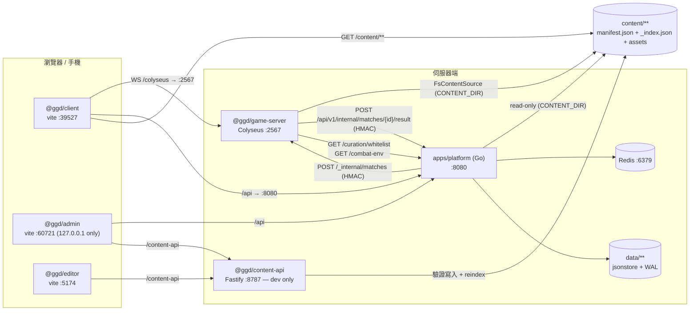
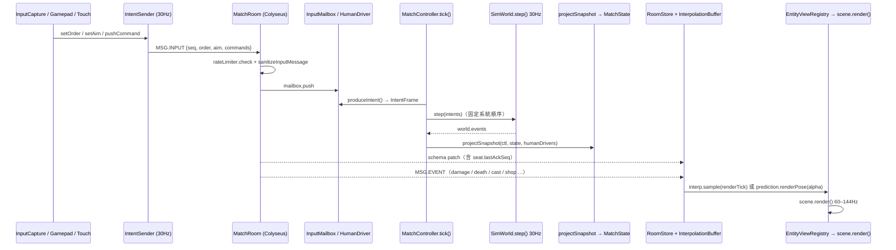

# GGD — 去死團的逆襲 / 動漫亂鬥競技場

3v3v3v3 網頁 3D 體素競技場 MOBA。私人專案。

- [1. 這是什麼 / What this is](#1-這是什麼--what-this-is)
- [2. 快速開始 / Quick start](#2-快速開始--quick-start)
- [3. 啟動各服務 / Running the services](#3-啟動各服務--running-the-services)
- [4. 有哪些頁面 / Feature pages](#4-有哪些頁面--feature-pages)
- [5. 怎麼玩 / How to play](#5-怎麼玩--how-to-play)
- [6. 各平台操作 / Controls](#6-各平台操作--controls)
- [7. 內容 / Content](#7-內容--content) — 含**完整的 113 英雄 / 554 技能 / 214 道具清單**
- [8. 架構 / Architecture](#8-架構--architecture)
- [9. 開發 / Development](#9-開發--development)
- [10. 社群 / Community](#10-社群--community)
- [11. 授權 / Licence](#11-授權--licence)

---

## 1. 這是什麼 / What this is

一場 12 人：**4 隊 × 每隊 3 席**。每個回合，still-alive 的隊伍被拆成**同時進行的兩場 3v3 對決**（LoL Arena 式的 paired duels），輸的一方扣命數，命數歸零就淘汰，最後站著的隊伍第一名。回合之間有整備相位可以買裝、抽三選一強化，而且**每個回合都會換一張地圖**。跑在瀏覽器裡：Babylon.js 畫面、React HUD、Colyseus 權威伺服器、一套 30Hz 確定性模擬同時跑在伺服器與客戶端（後者只用來做本機預測）。可以純離線打 bot，也可以接上帳號平台連線對戰。

這是**私人專案**，從作者自己的 Warcraft III 自製地圖移植過來 —— 英雄、技能、道具、數值、字串都是從 `.w3x` 匯入再重建的（`tools/w3x-import`）。不是開源專案，沒有 CI badge，沒有 contribution guide，也不打算有。這份 README 是寫給兩種人的：**(a) 隔一陣子回來的作者本人**，**(b) 被丟了這個 repo 要幫忙的朋友**。所有數字與路徑都是從 repo 讀出來的；讀不到的地方會明講「未驗證」，不會編一個看起來合理的預設值。

---

## 2. 快速開始 / Quick start

**最短的真實路徑：不需要 Go、不需要 Redis、不需要帳號。**

```bash
pnpm install
```

```bash
pnpm dev
```

開 <http://localhost:39527>，在登入畫面按 **Play offline vs bots**（按鈕下方就寫著 "no account needed — jumps straight into a bot match"）。旁邊的競技場下拉選單有預設值 `arena.skeleton`（`apps/client/src/ui/platform/maps.ts:19` 的 `DEFAULT_MAP_ID`），不選也能直接開打。

接著會進**英雄選擇 40 秒**。挑一個按鎖定；**就算你完全不動，開打前伺服器也會從可選池裡隨機指派一個**（`MatchController.ts` 的 `isEnabledSpawnablePick()` 檢查失敗就 `pool[rng.int(...)]`），不會像早期版本那樣以 0 血觀戰開局。之後就是 §5 的迴圈：整備／商店 → 戰鬥 → 結算 → 下一回合。

為什麼這樣就夠：

- client 的 vite port 是寫死的 `39527` + `strictPort`（`apps/client/vite.config.ts` 的 `server.port` / `server.strictPort`），`pnpm dev` 不用加任何參數。
- client 走同源 `/colyseus` proxy 打到 `localhost:2567`（同檔 `server.proxy["/colyseus"]`，`ws: true`）。
- game-server 抓不到 platform 時，白名單**fail-safe 成 allow-all**（`apps/game-server/src/curation/whitelist.ts:14-21`），所以不跑 platform 也有完整英雄可選。
- `content/manifest.json` 與各 `_index.json` **都在 git 裡**（113 英雄 / 554 技能 / 214 道具），fresh clone **不需要**先跑 `content:build`。
- `@ggd/shared` **沒有 build 步驟** —— `package.json` 的 `main`/`types`/`exports` 全部直接指向 `./src/*.ts`，由 vite / tsx 就地編譯。所以 `pnpm install` 之後不用先 `pnpm build` 也不用先 build shared。

> 前兩條刻意只寫欄位名不寫行號 —— `apps/client/vite.config.ts` 是常被改的檔案，這兩處在寫這份 README 的期間就漂過兩次（504 → 505 → 514）。要找就 grep `39527` 與 `"/colyseus"`。

> **dev 模式下 `PLATFORM_GAME_SHARED_SECRET` 是空的** —— 這代表 join 不驗證、client 送什麼 accountId 就是誰、而且**作弊指令是開的**（`apps/game-server/src/config/secretGuard.ts:15-30`、`match/cheatGate.ts:14-17`）。本機自己玩沒差，對外開就是洞。

### 前置需求 / Prerequisites

| 需要 | 版本 | 何時需要 | 出處 |
| --- | --- | --- | --- |
| Node | `>=20` | 一定 | `package.json:8` |
| pnpm | `9.15.9`（`packageManager` 已 pin，`corepack enable` 即可） | 一定 | `package.json:6` |
| Go | `1.25`（platform）／`1.23`（testrunner） | 跑 platform 或 `make test` | `apps/platform/go.mod:3`、`tools/testrunner/go.mod:3` |
| Redis | 預設 `127.0.0.1:6379` | 只有跑 platform 才要 | `apps/platform/internal/config/config.go` 的 `LoadStorage()` |
| python3 | importer 要 **≥3.10**；`tools/reference/*.py` **沒有宣告任何最低版本**（只有 shebang，無 `from __future__`、無版本檢查），本機實測 3.10.4 可跑 | 重新產生 §7 的內容清單（`pnpm docs:readme` / `docs:reference`，兩者都是直接 `python3 tools/reference/*.py`）；importer 另需 `mpyq` `Pillow` | `package.json:22-24`、`tools/w3x-import/README.md:30` |
| ffmpeg | — | 只有 bgm-gen / tts-gen 才要 | `tools/bgm-gen/README.md` |
| docker + kind + kubectl + helm + skaffold | — | 只有 `make up` 才要 | `Makefile:42-46` |

沒有 `.nvmrc`。lockfile 是 pnpm v9 格式。CI 用 Node 22 + Go 1.25（`.github/workflows/ci.yml:21,32`）；engines 只宣告 `>=20`，所以「哪些版本是 known-good」除了 CI 的 22 之外沒有其他保證。

---

## 3. 啟動各服務 / Running the services

`.claude/launch.json` 是啟動設定的權威來源（13 個具名 server）。三個組合包：

```bash
pnpm dev        # game-server + client
```

```bash
pnpm dev:editor # content-api + editor
```

```bash
pnpm dev:all    # game-server + client + editor + content-api + admin
```

| name | 指令要點 | port | 什麼時候用 |
| --- | --- | ---: | --- |
| `client` | `pnpm --filter @ggd/client dev --port 39527 --strictPort` | 39527 | 平常唯一要開的前端 |
| `client-lan` | 同上 **+ `--host 0.0.0.0`** | 39527 | 手機／第二台電腦要連進來打。開之前先 `make lan-probe` |
| `client-mobile` | `VITE_GAME_WS=ws://localhost:2599` + port 5199 | 5199 | 搭配 `game-server-mobile`，在同一台 Mac 上開第二套環境（**不是** LAN 用的，見 §6） |
| `game-server` | `pnpm --filter @ggd/game-server dev` | 2567 | 預設。無 secret ＝ dev 模式（cheats on） |
| `game-server-seam` | `PLATFORM_GAME_SHARED_SECRET=devseam` | 2567 | 要測 platform↔game 的 HMAC seat/ticket 交握 |
| `game-server-platform` | `GGD_PLATFORM_URL=http://127.0.0.1:8080` + `GGD_WHITELIST_BYPASS=1` | 2567 | 要讓 game-server 讀到**本機** platform 的方便組合。**`GGD_PLATFORM_URL` 其實可省** —— 程式的內建預設已經是 `http://localhost:8080`（`apps/game-server/src/config/platformUrl.ts:31`，任務 #48 已把舊的 k8s host 預設改掉；k8s 那邊改成明確設 `GGD_PLATFORM_URL=http://platform:8080`）。這條真正有價值的是 `GGD_WHITELIST_BYPASS=1`，免得 default-empty 白名單把可選英雄過濾到零 |
| `game-server-mobile` | `GAME_PORT=2599` | 2599 | 手機測試專用的第二台 game-server |
| `platform` | `go -C apps/platform run ./cmd/platform`（⚠ 見下） | 8080 | 需要帳號、大廳、排位、白名單時 |
| `admin` | `pnpm --filter @ggd/admin dev` | 60721 | 後台。網址是 `/admin/`，**只綁 127.0.0.1** |
| `content-api` | `pnpm --filter @ggd/content-api dev` | 8787 | 後台「內容管理」要能存檔就得開它 |
| `editor` | `pnpm --filter @ggd/editor dev` | 5174 | 獨立的內容編輯 SPA，`/editor/` |
| `test-dashboard` | `pnpm --filter @ggd/test-dashboard dev` | 5173 | 一鍵跑測試的 UI，需搭配 `testrunner` |
| `testrunner` | `go -C tools/testrunner run ./cmd/testrunner` | 8799 | test-dashboard 的後端 |

### platform（要 Redis）

`JWT_SIGNING_SECRET` 與 `PLATFORM_GAME_SHARED_SECRET` 是**必填**：`internal/config/config.go` 的 `Load()` 在結尾檢查兩者非空、否則**回傳 error**（注意它自己不會 exit），真正 `os.Exit(1)` 的是 `cmd/platform/main.go:26`。開機時會用 `data/` 的 JSON 重建 Redis 熱層，Redis 掛了就開不起來（`cmd/platform/main.go:38-41` 的 `srv.Boot(ctx)`）。

```bash
redis-server &
```

```bash
DATA_DIR=./data REDIS_ADDR=127.0.0.1:6379 PLATFORM_ADDR=127.0.0.1:8080 JWT_SIGNING_SECRET=devsecret PLATFORM_GAME_SHARED_SECRET=devseam GAME_SERVER_ADDR=http://127.0.0.1:2567 PLATFORM_INTERNAL_URL=http://127.0.0.1:8080 go -C apps/platform run ./cmd/platform
```

> ⚠️ `.claude/launch.json` 有兩處要注意：
> - `platform` 那一條把 `DATA_DIR` 指到一個**舊 session 的 scratchpad 路徑**（`.claude/launch.json:55`）。用那條啟動等於開一個空的 store。要保留資料請自己覆寫 `DATA_DIR`。
> - `game-server-platform` 的 `comment` 欄（`:49`）還在講「內建預設是 k8s host `platform:8080`」—— 那是任務 #48 修好之前的舊註解，已不成立（見上表）。

### 環境變數 / Env vars

**platform**（全部在 `apps/platform/internal/config/config.go` 的 `Load()`；`DATA_DIR` / `REDIS_ADDR` / `REDIS_PASSWORD` 三個由它呼叫的 `LoadStorage()` 讀）

> 這裡刻意只寫函式名不寫行號 —— `apps/platform` 目前正被另一個 session 改動，行號會漂。

| 變數 | 必填 | 預設 |
| --- | --- | --- |
| `JWT_SIGNING_SECRET` | **是** | — |
| `PLATFORM_GAME_SHARED_SECRET` | **是** | — |
| `PLATFORM_ADDR` | | `:8080` |
| `REDIS_ADDR` / `REDIS_PASSWORD` | | `127.0.0.1:6379` / 空 |
| `DATA_DIR` / `CONTENT_DIR` | | `./data` / `../../content` |
| `GAME_SERVER_ADDR` | | `http://127.0.0.1:2567` |
| `PLATFORM_INTERNAL_URL` | | `http://platform:8080`（k8s 用） |
| `SEASON` | | `s1` |
| `RANKED_CHALLENGER_FRAC` / `RANKED_GRANDMASTER_FRAC` / `RANKED_MIN_APEX_GAMES` | | `0.10` / `0.10` / `10` |
| `ADMIN_BOOTSTRAP_USERNAME` | | 空（不 bootstrap） |
| `GGD_DEPLOY_TIER` | | 未設 ＝ **public**（版權閘的 fail-safe 方向） |
| `GGD_REQUIRE_APPROVAL` / `GGD_REGISTER_RATE_LIMIT` | | off / `0`（`internal/server/server.go` 的 `New()`：`envEnabled("GGD_REQUIRE_APPROVAL")` / `envInt("GGD_REGISTER_RATE_LIMIT", 0)`） |

**game-server**（`apps/game-server/src/index.ts:22-27` 等）：`GAME_PORT`=2567、`CONTENT_DIR`=repo `content/`、`PLATFORM_GAME_SHARED_SECRET`=空（production 才強制）、`GAME_PUBLIC_ENDPOINT`=`ws://localhost:<PORT>`、`GGD_PLATFORM_URL`=`http://localhost:8080`、`GGD_WHITELIST_BYPASS`、`GGD_COMBAT_ENV_BYPASS`、`GGD_DEV_CHEATS`（設 `"0"` 才關）、`GGD_MAX_ROOMS`=200。

**content-api**：`PORT`=8787、`HOST`=127.0.0.1（**非 loopback 直接 exit**）、`GGD_CONTENT_DIR`、`GGD_CONTENT_BACKUP_DIR`=`data/content-backups`；`NODE_ENV=production` 一律拒絕啟動。

**前端 `VITE_`**：`VITE_GAME_WS`（強制指定 Colyseus 位址）、`VITE_PLATFORM_API_URL`、`VITE_CONTENT_API_URL`、`VITE_RUNNER_URL`、`VITE_GGD_SILENT`（靜音，給無頭截圖／背景 agent 用）、以及 admin Console Hub 的 `VITE_CLIENT_URL` / `VITE_EDITOR_URL` / `VITE_ADMIN_URL` / `VITE_DOCS_URL` / `VITE_TEST_DASHBOARD_URL`。

### Docker / k8s

存在，但**不是日常開發的路**。

- `make up` → kind cluster `ggd` + skaffold + helm，最後把 `svc/ggd-edge` port-forward 到 `http://localhost:8080`。需要 docker/kind/kubectl/helm/skaffold 五樣都在。
- `make secrets` 用 `openssl rand -hex 32` 產 `deploy/helm/secrets.local.yaml`（gitignored）。
- `docker/compose.yaml` 是不用 k8s 的較輕迴圈，但**目前有壞掉的 key**。Dockerfile 沒有任何 env 轉譯（`docker/platform.Dockerfile:32,38` 只設 `APP_ENV`/`DATA_DIR`/`CONTENT_DIR` 再 `ENTRYPOINT ["/platform"]`；`game.Dockerfile` 與 `content-api.Dockerfile` 都是 `CMD ["node","dist/index.js"]`），所以 compose 設的名字若程式不讀就是**直接被忽略**：

  | compose 設的 | 程式實際讀的 | 後果 |
  | --- | --- | --- |
  | `HTTP_ADDR: ":8080"` | `PLATFORM_ADDR`（預設 `:8080`） | 無害，預設剛好同值 |
  | `PORT: "2567"`（game） | `GAME_PORT`（預設 2567） | 無害，預設剛好同值 |
  | `GAME_INTERNAL_URL: "http://game:2567"` | `GAME_SERVER_ADDR`（預設 `http://127.0.0.1:2567`） | **壞**：platform 會打回自己而不是 game 容器，開房失敗 |
  | `CONTENT_DIR: /srv/content`（content-api） | `GGD_CONTENT_DIR`（`apps/content-api/src/index.ts:25`） | **壞**：那個 bind mount 等於沒作用 |

  `HTTP_ADDR` 與 `GAME_INTERNAL_URL` 在 `apps/` 底下**零次出現**（實測 grep）。要用 compose 得先把後兩個 key 改名。

---

## 4. 有哪些頁面 / Feature pages

這個 repo 沒有單一入口，是好幾個各自獨立的 dev server。

| 是什麼 | URL | 需要跑的 server |
| --- | --- | --- |
| **遊戲本體**（登入 → 大廳 → 對戰） | `http://localhost:39527/` | client；要真的打才要 game-server；要登入/大廳/排行才要 platform |
| ├ 登入 / 註冊 | 同上（`screen === "auth"`） | client |
| ├ 大廳（好友 / 房間 / 排行榜三欄） | 同上（`screen === "lobby"`） | client + platform |
| ├ 商店 Store（大廳內切換，不是另一頁） | 同上（`lobbyView === "store"`） | client + platform |
| └ 對戰（選角 / 中場商店 / 三選一 / 結算全是 match 的 phase） | 同上（`screen === "match"`） | client + game-server |
| **內容圖鑑 #codex** | `http://localhost:39527/#codex` | client（大廳右上「📖 圖鑑」按鈕） |
| **資產主控台 #assets** | `http://localhost:39527/#assets` | client。**沒有任何按鈕連過去，只能手打 hash** |
| **版權聲明 #credits** | `http://localhost:39527/#credits` | client（登入頁 footer） |
| **音樂・音效試聽** | `http://localhost:39527/bgm-audition.html` | client |
| **模型預算**（#99） | `http://localhost:39527/model-budget.html` | client |
| **店員視線確認**（#103） | `http://localhost:39527/intermission-audition.html` | client，**只在 `vite dev` 下可用** |
| **煙火確認**（#93） | `http://localhost:39527/firework-audition.html` | client，同上 |
| **地面確認**（#80） | `http://localhost:39527/ground-audition.html` | client，同上 |
| **後台管理主控台** | `http://127.0.0.1:60721/admin/` | admin；玩家維運頁另需 platform |
| **內容編輯器** | `http://127.0.0.1:5174/editor/` | editor + content-api |
| **測試台** | `http://127.0.0.1:5173/` | test-dashboard + testrunner |
| **平台健康檢查** | `http://localhost:8080/api/v1/healthz` | platform |

遊戲 client **沒有 URL router** —— 四個畫面（boot / auth / lobby / match）都在同一個網址下，由 Zustand 狀態機切換。選角、中場商店、三選一、結算全部是 match 畫面的 phase，都沒有自己的 URL。唯一可深連結的是那三個 hash overlay，而且可以疊在對戰進行中打開。

後面三個 audition 頁直接 import client 的 `/src/**/*.ts`，所以只在 `vite dev` 下能用（它們自己的錯誤框就這麼寫）。`bgm-audition.html` 與 `model-budget.html` 是純靜態 + fetch，理論上 build 完也能跑，但**未實測**。

> **⚠ 後台 Console Hub 上有兩張壞卡**：
> - 「測試台」寫的是 `localhost:5199`（`apps/admin/src/config.ts:28`），但那是 `client-mobile` 的 port。測試台真正在 **5173**。
> - 「說明文件 `/admin/docs`」—— 沒有任何 location 專門服務它，admin SPA 也沒有這個 route。`nginx.conf:262-271` 的 `location /admin/` 會用 `try_files $uri $uri/ /admin/index.html` 把它吃掉，所以它**回 200 但畫面是 admin 的預設頁**，不會 404。實質是死連結。

### 後台的每一頁

側邊欄 **production build 11 項**，寫死在 `apps/admin/src/ui/App.tsx:20-34` 的 `NAV` 陣列裡；**dev build 12 項** —— 「內容管理」不在那個陣列中，由 `useContentAdminPage()`（同檔 `:56-74`）動態 import `./ContentPage` 取得，再由 `App.tsx:109` 插在第 5 項之後。打 ✅ 的需要真的 platform 管理員登入，其餘在 loopback 上免登入直接進（`apps/admin/src/store.ts:85-94`）。

| 頁面 | 做什麼 | 需登入 |
| --- | --- | :---: |
| Console Hub | 每個服務一張卡 + 即時健康燈號 | — |
| Players | 玩家搜尋：停權 / M幣調整 / MMR 設定 | ✅ |
| Matches | 已結算對戰紀錄 + 詳情抽屜 | ✅ |
| Announcements | 公告增刪改 + 上下架 + 玩家端預覽 | ✅ |
| 內容白名單 | **內容能不能被玩到，只由這頁決定**。預設全空；英雄／道具／技能三分頁，可批次開關、一鍵「啟用起始組合」 | ✅ |
| 內容管理 | 英雄・技能・武器道具 CRUD。**只存在於 dev build**（production build 連這個 chunk 都不產生） | — |
| 戰鬥系統 | 全域倍率表（冷卻／傷害／防禦／生命／速度／治療／護盾／暴擊…），1.0 為中性。**存檔只對「下一場」生效** | ✅ |
| AI 生成設定 | 平台 AI proxy：開關、各能力的 base URL + model、**只寫不讀**的 API key | ✅ |
| 模型預算 | 每個模型的面數／貼圖／VRAM／用在哪 + 同畫面上限 | — |
| ICON 生成追蹤 | 覆蓋率、供應商狀態、樣式規格、費用與授權 | — |
| M幣 發放 | 後台發放 M幣（可負數扣除，伺服器端 floor 到 0） | ✅ |
| Audit log | 所有後台變更的 append-only 紀錄 | ✅ |

### 一開始沒有任何可玩內容？

只有**跑了 platform**才會遇到 —— 內容白名單刻意 default-empty。離線 bot 模式因為 fail-safe allow-all，不受影響。

```bash
make seed-demo   # 需要 admin token；POST 到 curation/whitelist/starter
```

```bash
make whitelist   # 看目前啟用了多少 champions/items/abilities
```

> ⚠️ 這兩個 target 打的**預設端點不是 platform**：`Makefile:108` 是 `PLATFORM ?= http://127.0.0.1:60721`，那是 **admin dev server** 的 port；請求要靠 `apps/admin/vite.config.ts:89-92` 的 `/api` proxy 才會轉到 platform :8080。所以只開 platform、沒開 admin 一樣是 connection refused。要嘛兩個都開，要嘛直接指定端點：`make whitelist PLATFORM=http://127.0.0.1:8080`（`seed-demo` 同理，另需 `TOKEN=`）。

或直接在後台：**內容白名單 → ⭐ 啟用示範組合 → 儲存**。完整復原指南：[`docs/runbooks/content-whitelist.md`](docs/runbooks/content-whitelist.md)。

---

## 5. 怎麼玩 / How to play

> 本節每個數字都從程式與 `content/config/` 讀出。若你改了設定卻發現沒生效，先看最後的「設定陷阱」。

### 賽制：3v3v3v3

一場 12 人：**4 隊 × 每隊 3 席**。每隊開局 **3 條命**。

每個回合，仍存活的隊伍被拆成**同時進行的兩場 3v3**（zone 0 / zone 1）。配對走固定的循環賽表，每 3 回合循環一次（`apps/game-server/src/match/PairedDuels.ts:16-29`）：

| 回合 | zone 0 | zone 1 |
| --- | --- | --- |
| 1, 4, 7… | 隊0 vs 隊1 | 隊2 vs 隊3 |
| 2, 5, 8… | 隊0 vs 隊2 | 隊1 vs 隊3 |
| 3, 6, 9… | 隊0 vs 隊3 | 隊1 vs 隊2 |

**輪空（BYE）**：只剩 3 隊時會有一隊輪空 —— 不上場、不扣命，但仍領敗方等級的 150 金。輪空者依回合輪替。

**輸掉一場對決要扣命，而且愈打愈痛**（`PairedDuels.ts:64-68`）：

| 回合 | 扣命 |
| --- | ---: |
| 1–2 | 1 |
| 3–4 | 2 |
| 5+ | 3 |

命數歸零＝淘汰，名次由下往上鎖定；**最後存活的隊伍就是第 1 名**，整場立刻結算。

### 一個回合長什麼樣

**商店在戰鬥「之前」**，不是之後：你在整備相位花掉上一回合賺的錢，然後開打。

```
英雄選擇 40s ──▶ ┌─ 整備/商店 40s ──▶ 戰鬥 ≤240s ──▶ 結算 6s ─┐
（開局一次）      └───────────────  下一回合  ◀───────────────┘
```

秒數來自 `content/config/config.match.json:12-21`。240 秒是**硬上限**，不是預期的回合長度 —— 火圈會先把場面收掉。模擬固定 30Hz。

戰鬥開始時所有人先被「停屍」，只有排進本回合對決的兩隊會在自家出生點**滿血滿魔**復活；輪空隊整回合維持陣亡。所以每回合都是乾淨的重新開打，只有裝備、等級與強化會累積。

**對決怎麼判贏**（`apps/game-server/src/match/MatchController.ts:760-781`，HP% 加總在同檔 `:748-757`）：

1. 一方三人全倒 → 對方勝
2. 240 秒到期 → 比該區存活者的 **HP 百分比總和**，高者勝
3. 雙方同時全滅、或 HP% 完全相同 → 用 `world.rng` 擲 50%（可重播，非真隨機）

### 火圈

**戰鬥開始 180 秒後**點燃（`config.match.json:15-20`）。不是實體縮圈，而是對每個還站著的英雄施加逐秒升壓的燒傷：t+0s 寬限、t+1s 每秒 1% 自身最大生命、t+2s 每秒 2%…上限 100%/秒。累積 1+2+…+14 ≥ 100%，所以**點燃後約 14 秒，滿血也會死**。

火圈傷害是純 %HP 真實傷害：**無視護甲、魔抗、護盾，也無視 combat-env 的傷害倍率**。它只在戰鬥真正進行中燒，回合一判定結束就停。

實務上：把 180 秒當成「這回合該結束了」的鈴聲，240 秒當成不會用到的保險絲。

### 中立守護者

每個**有對決的** zone 中央會生一隻（輪空區沒有）。它是純中立建築 —— 沒有隊伍、不算存活人數、不影響勝負判定，但誰都能打它。

**獎勵只給最後一擊的人**（`packages/shared/src/sim/systems/GuardianSystem.ts:489-543`）：**+150 金**、**回滿 HP 與 MP**、**25 秒的「鎮守之力」**（周圍 2.5 半徑內打出守護者齊射傷害 25% 的脈衝）。若最後一擊者在結算瞬間已死、或不在同一 zone，獎勵**作廢** —— 守護者照樣消失，沒人拿到。

它不是免費補品。醒著時會朝**傷害它最多的人**打出有 0.8 秒預警的 AoE 齊射：每 4 秒一輪、3 個標記點、半徑 3.0，同一次甦醒中每發再 +15%（最多 2 倍）。標記點**不追人**。

強度隨回合成長：HP = `1450 × (1 + 0.28×(回合-1))`，齊射基礎傷害 = `108 × (1 + 0.14×(回合-1))`。單次承受傷害硬上限 = 其最大生命的 15%，所以沒有任何一招能一鍵秒掉它。回合結束時消失。

> ⚠ 任務 **#89（守護者）** 在任務清單上仍標 pending。程式路徑與設定都存在且會被武裝，但**沒有實際跑一場對局確認觀感**。

### 金錢與商店

| 項目 | 金額 |
| --- | ---: |
| 起始金幣 | 600 |
| 擊殺 | 150 |
| 首殺賞金（額外） | +100 |
| 助攻 | 75 |
| 回合勝 | 300 |
| 回合敗／輪空 | 150 |

（`packages/shared/src/sim/economy/progression.ts:16,29`）

首殺賞金**每個敵人一生只付一次** —— 被救活後再殺不會再付（`DeathSystem.ts:54-57`）。

**商店開放時機**三態（`economy/shopAccess.ts:67-82`）：整備相位全員可買；**戰鬥中只有本回合已陣亡者**可買；英雄選擇／結算／賽末關閉。

**背包 6 格**，賣出**只退原價 40%**（向下取整）。買賣的 undo 歷史在戰鬥開始時清空，跨回合的「買→賣→undo」套不出錢。

**武器只有兩種價格**（`economy/itemTiers.ts:43-46`）：

| 層級 | 價格 | 件數 |
| --- | ---: | ---: |
| 簡易 SIMPLE | 300 | 42 |
| 強力 POWERFUL | 1200 | 28 |
| 傳說 LEGENDARY | **無價格** | 25（只能靠三選一或寶玉） |

4 件簡易 ≈ 1 件強力的數值，但吃掉 4 格 vs 1 格。後期是**格子壓力**的遊戲，不是金幣效率的遊戲。

**傳說寶玉 2400 金**：不是道具，是抽卡觸發器 —— 買下即從傳說池 roll 出三選一並預留一格。

> ⚠ **「不可重複」不是全域規則**。`buyItem` 只在道具標了 `unique` 時才擋（`shop.ts:98`），而 214 份道具文件裡**只有 `swift-boots.json` 標了 `unique: true`**。也就是說在目前資料下絕大多數道具買得到第二個。是否有其他策展層另外過濾 —— **未驗證**。

### 屬性路線與畢業裝

商店有個不佔格子的服務：**能力屬性強化，每次 375 金**，從 9 種固定加成中均勻抽一種，可無限疊。

累積 **20 次**（375 × 20 = 7500 金）可換畢業裝 **傳說·萬象強化**：對最大生命／攻擊力／護甲／魔抗**各 +r%**，r 是 10%~100% 的十等分均勻抽。

兩個必須知道的規則：

1. **任何一次用金幣買真道具，層數立刻歸零** —— 包含第 19 層，也包含買傳說寶玉。只有三選一**免費發**的武器不歸零（`shop.ts:118`、`statPath.ts:204-216`）。
2. **就算 20 層滿了，也要等第 6 回合的商店才會發**（`CAPSTONE_ROUND_GATE = 6`）。

一場的確定收入約 7600 金（600+750+2500+1000+1250+1500），而 20 層要 7500 —— 這是一條**全押的路**，走了就幾乎買不起任何裝備。

### 回合間的三選一

抽 3 張、加權、不重複、已擁有的不會再出現（`content/config/arena-rules.json`）。

| 回合 | 等級 | 金幣 | 強化卡 | 武器卡 |
| ---: | ---: | ---: | --- | --- |
| 1 | +2（自動學會 Q/W/E） | — | silver | — |
| 2 | +1 | +750 | silver | quest-rewards |
| 3 | +1 | +2500 | gold | — |
| 4 | +1 | +1000 | gold | — |
| 5 | +1 | +1250 | prismatic | legendary-weapons |
| 6 | +1 | +1500 | prismatic | — |
| 7+ | +1 | 1500，每多一回合 +250 | prismatic | — |

另外：**大招 R 從第 3 回合起無視等級可加點**；**EX 技能第 5 回合解鎖**。

### 復活小圈

你倒下時會在屍體位置落下**隊色小火圈**。**活著的隊友**站進去引導 **3 秒**就能救回你（`arena-rules.json:56-67`）：

- 引導 3.0 秒，圈存在 6.0 秒，半徑 2.0
- 復活後 **HP 與 MP 各回 50% 上限**
- **每隊每回合只有 1 次**
- 敵人站進圈裡會**暫停**進度（不歸零）；被打**不會**中斷；被控場**會**中斷
- 沒人引導時進度以 2 倍速倒退

圈只能救**它自己的主人**，屍體本人不能自己引導。一隊同時只有一個圈。回合結束時所有圈與引導中的施法一律靜默消失。

場上還有**治療花**：開打 15 秒後出現、每區最多 1 朵、25 秒重生、60 血，打爆後在半徑 6 內回復 18% 最大生命與 18% 最大魔力。

### 全域倍率表（重要：畫面上的數字已經乘過了）

`content/config/combat-env.json` 是一張全域倍率表，每項只作用在模擬裡的**唯一一個**公式點。**目前的值**：

| 倍率 | 值 | 作用 |
| --- | ---: | --- |
| `cooldown` | **0.25** | 技能冷卻秒數（含 EX） |
| `damageDealt` | **0.5** | 所有減傷前的傷害封包 |
| `maxHealth` | **8.0** | 最大生命 |
| `abilityRange` | **0.6** | 技能施放距離與 AoE 半徑（**不含普攻**） |
| 其餘 14 項 | 1.0 | defense / attackDamage / abilityPower / healthRegen / maxMana / manaRegen / moveSpeed / attackSpeed / healing / shield / critChance / critDamage / lifesteal / attackRange |

**遊戲內顯示的每一個數字，都是乘完倍率之後的最終值。** 一個原始 35 秒冷卻的技能，在 `cooldown: 0.25` 之下實際是 8.75 秒 —— UI 顯示的就是 8.75，不是 35。換算走唯一一條接縫 `apps/client/src/ui/displayFinal.ts`，React 端訂閱權威的 `combatEnvJson`，後台改倍率時畫面即時跟著變。

倍率表在 tick 0 之前注入模擬並隨快照下發，兩邊用同一支正規化函式，所以預測與伺服器永遠對得上。後台覆寫逐鍵蓋過 content 預設。

### 每回合換地圖

輪替池：`arena.skeleton` / `arena.castle` / `arena.colosseum` / `arena.dota` / `arena.godie`（`apps/game-server/src/match/arenaSelect.ts:30-36` 的 `ARENA_ROTATION_IDS`；未載入的會被略過）。五份文件都確實存在於 `content/arenas/`，manifest 也記 `arenas: 5`。

選擇由 `(matchSeed, round)` 的純雜湊決定，**不動用 `world.rng`**，因此：同種子重播完全一致、**連續兩回合永不重複**、前 N 回合會走遍每張地圖。地圖在戰鬥相位一開始就選定並套用碰撞幾何。

> ⚠ 任務 **#145（每回合換地圖）** 仍標 pending。程式路徑與五份 arena 文件都在，但**沒有實際跑一場對局確認觀感**。

### 設定陷阱（改了不會生效）

`content/config/config.match.json` 有幾個欄位**沒有任何程式碼讀取**：

| 欄位 | 寫的 | 實際 |
| --- | --- | --- |
| `match.startingTeamLives` | 8 | **3**（`apps/game-server/src/rooms/MatchRoom.ts:192` 字面值） |
| 整個 `economy` 區塊 | — | 生效的是 `economy/progression.ts` 與 `shop.ts` 的常數。目前數值恰好相同，但那是**巧合不是綁定** |
| `draft.tierSchedule` | — | 被 `arena-rules.json` 的 `rounds` 表取代 |

會生效的是：`match` 的四個秒數欄位、`match.fireRing` 整塊、`arena-rules.json` 全部、`combat-env.json` 全部。

---

## 6. 各平台操作 / Controls

GGD 是**一份 web client**。Mac 與 PC 之間**沒有任何程式碼上的差異** —— 全 client source 找不到 `userAgent` / `navigator.platform` / `metaKey` 的行為分支，也沒有 Electron / Tauri / Capacitor 外殼。差別只有你用哪個瀏覽器。手機才真的有一套獨立的輸入層。

| | 鍵鼠 (Mac / PC) | 觸控 (iPhone 橫向) | 手把 |
| --- | --- | --- | --- |
| 移動 | 右鍵點地 | 畫面**左半邊**浮動搖桿（按下處為圓心，半徑 64px，死區 0.12） | 左類比（死區 0.15） |
| 普攻／指定攻擊 | 右鍵點敵人；`A` + 左鍵 = attack-move | 右下角大 ⚔ 鈕（88px）＝ 打**範圍 12 內最近的敵人** | `LT` = 最近敵人；`RT` = attack-move |
| Q / W / E / R | `Q` `W` `E` `R`（quick cast，以**當下滑鼠位置**結算） | ⚔ 鈕周圍 122px 弧上的四顆圓鈕（Q 正左、R 正上） | `A` `B` `X` `Y` |
| **EX 技能** | **`F`**（HUD 標示為「F / Back」） | 弧線**外側** 45° 方向的琥珀色 EX 鈕（圓心距 122·√2 ≈ 173px，不在 QWER 那條 122px 弧上） | `Back`(8) |
| 停止／回城 | `S` 停止、`B` 回城 | 弧線上方小 ⌂ 鈕 = 回城 | `RB` 停止、`LB` 回城、`Start` ready |
| 攝影機 | 滾輪縮放、`Space` 切換跟隨、方向鍵平移、滑鼠貼邊 24px 自動平移 | 無（恆跟隨） | 右類比 = 瞄準（非攝影機） |
| 選單 | `Esc`（或 ☰ 鈕） | ☰ 鈕 | — |
| 作弊台（僅單機） | 反引號 `` ` ``（或 🐞 鈕） | 🐞 鈕 | — |
| 商店／計分板 | **沒有快捷鍵** | 同左 | 同左 |

> `W`/`A`/`S`/`D` **不是**移動鍵：照 MOBA 慣例 `A` 是 attack-move、`S` 是停止、`W`/`E` 是技能。平移用方向鍵。
> 桌機的技能格**按下去不會施法** —— 滑鼠按住只會叫出地面虛線射程/AoE 預覽 + 頂部技能說明；施法一律走鍵盤。
> 「商店／計分板無快捷鍵」是對 `apps/client/src` 所有 `keydown` listener 的窮舉 grep 結果；若有透過其他機制註冊的快捷鍵不會被抓到。

### 觸控：兩種施法方式

按住技能鈕後，鬆手做什麼取決於手指移動了多遠：

1. **點一下（位移 ≤ 18px）= 快速施放**。走跟鍵鼠、手把完全同一條 `buildCastCommand`：skillshot/dash → 射程內最近敵人方向，沒有就用面向；ground → 面向前方 `min(射程, 6)`；self → 自己；targeted → 射程內最近敵人，沒目標就**不出招**。
2. **按住拖曳（> 18px）= 瞄準模式**。拖到 96px 為滿舵，放開即施放。拖曳中該格亮**綠框**，地面顯示直線或圓盤指示器。**拖回原點 28px 內再放開 = 取消**（框變**紅色**）。

同時只追蹤一根技能手指；搖桿與技能手指可並存。

### 判斷「這是觸控裝置」

```
isTouchDevice = __ggdForceTouch === true
              || ('ontouchstart' in window && matchMedia("(pointer: coarse)").matches)
```

兩個條件**都要成立**（`apps/client/src/input/mobileDetect.ts:19-38`），所以有觸控螢幕但主指標是滑鼠的筆電**不會**被判成手機。目標平台明寫為 iOS Safari / WKWebView，**Android 不在範圍內**。開發時可用 `globalThis.__ggdForceTouch = true` 在桌機模擬（手把則有 `globalThis.__ggdFakePads`）。

### 手把與同機多人

- 一台機器最多 **4 位本機玩家**，一人一支手把：第 k 支**已連線**的手把驅動第 k 位玩家。手把數少於人數時，多出來的玩家沒有輸入。
- 玩家 0 同時保有鍵鼠；兩邊餵同一個 IntentSender，**後寫者勝**。
- 單人路徑則是「**最後連上的**那支手把」接管。
- 選角階段按 `A` 循環切換該座位的英雄。
- 同機客人的帳號是 `{accountId}:p2`..`:p4`，顯示為「名字 (2P)」..「(4P)」。
- ⚠ 程式直接寫死 standard mapping 的按鍵索引（BTN 0–9），**沒有讀 `Gamepad.mapping`** —— 非標準對應的手把會錯位。哪些實體手把回報 standard mapping **未實測**。

### 手機版面限制

- **強制橫向**：直向會蓋上整頁「Rotate to landscape」提示。
- HUD 以「手機橫向約 375–430px 高」為前提排版：小地圖從桌機的**右下**搬到觸控的**左上**，208 → 116px（因為右下角整片被技能弧佔滿）；敵隊面板在觸控只剩 66px 血條長條。
- 所有可點元素 ≥ 44px（Apple HIG），輸入框 16px 避免 iOS 對焦縮放；`viewport-fit=cover` + `env(safe-area-inset-*)` 避開瀏海與 home indicator。
- 畫質自動判定：觸控 → `medium`（≤3 核或 <3GB → `low`），桌機 → `high`（≤4 核或 ≤4GB → `medium`）。

> ⚠️ **已知未修（任務 #151）**：iPhone **橫向的選單畫面**（登入卡／英雄跑馬燈／按鈕／footer）會互相重疊，直向正常。要測 844×390、780×360、以及直向 390×844。只影響選單，不影響戰鬥中的觸控 HUD。

### 用手機透過 wifi 連進來玩

前提：手機和 Mac 在**同一個 wifi**。

```bash
pnpm --filter @ggd/game-server dev
```

```bash
pnpm --filter @ggd/client dev --port 39527 --strictPort --host 0.0.0.0
```

```bash
ipconfig getifaddr en0
```

手機瀏覽器開 `http://<上一行的 IP>:39527`，橫向拿好。

**為什麼會通**：`defaultEndpoint()` 是「同源優先」—— 只要網址 hostname 不是 localhost/127.0.0.1/::1，就連 `ws://<同一個 host>/colyseus`，再由 vite 的 `/colyseus` proxy（`ws: true`）轉到 Mac 本機的 2567。如果寫死 `ws://localhost:2567`，在手機上 localhost 指的是**手機自己**。

**兩件已經做好的事，別自己拆掉**：

- 這台 LAN 公開的 vite server **故意沒有 `/content-api` proxy**，而且有 plugin 對 `/content-api` 所有動詞回終端 404。因為 proxy 會把手機的來源位址洗成 127.0.0.1，content-api 的 loopback 檢查就會誤判，等於把 `content/` 的寫入權交給整個 wifi。內容編輯請走 admin console。
- 版權素材（`/content/assets/models/imported`、`/content/assets/blizzard-local`）依 socket 來源分級：loopback 與 LAN 照給，真正的 public peer 一律 403。手機在同一 wifi 上不受影響。

想確認 wifi 上沒有多開什麼寫入面：

```bash
make lan-probe
```

它用這台機器自己的 LAN 位址去探 39527 / 60721 / 8787（`tools/lan-probe.sh:34-36`），再確認遊戲本身還通得過（`/api/v1/healthz` → 200、`/api/v1/admin/accounts` → 401），最後對 platform :8080 做一次**建議性**檢查。**exit 0 不等於零警告** —— platform 若還綁在 wildcard 上會印黃色 `WARN` 但仍然通過（腳本自己註明那是無害的，因為 platform 沒有任何 address-based trust）。

> `.claude/launch.json` 另有 `client-mobile`(5199) + `game-server-mobile`(2599)，但 `client-mobile` **沒有** `--host`，而且 `VITE_GAME_WS=ws://localhost:2599` 在手機上會指向手機自己 —— 那是「在同一台 Mac 上開第二套環境」用的，**不是 LAN 連線用的**。

> 以上 LAN 流程是從 `launch.json` + `vite.config.ts` + `RoomConnection.defaultEndpoint()` 推導的，**沒有實際用手機連線驗證過**。

---

## 7. 內容 / Content

**完整的英雄／技能／道具清單就在這一節裡** —— 見下方三個可折疊區塊。所有數字都從 repo 量出來，權威計數在 `content/manifest.json`（由 `pnpm content:build` 產生）。

| collection | docs | 說明 |
| --- | ---: | --- |
| `content/champions/` | **113** | 全部英雄文件（含未開放的）。其中 **48** 在**這台機器目前的**開放名單裡 |
| `content/abilities/` | **554** | 每英雄每 slot 一份；Q/W/E/R 各 113，EX 102（**11 名沒有 EX**） |
| `content/items/` | **214** | 其中只有 **70 件真的能買**（42×300g + 28×1200g）、25 件傳說（0g 不可買）、2 項服務、117 件 w3x 匯入殘件 |
| `content/vfx/` | 388 | |
| `content/models/` | 117 | 目錄下實際有 119 個 `.json`：117 份 doc + `_index.json` + `_standin-overrides.json`（底線開頭＝非 doc，不進 index） |
| 其餘 7 個 collection | 55 | augments 21 / config 11 / projectiles 5 / status-effects 5 / arenas 5 / skins 5 / loot-tables 3 |
| **合計** | **1441** | |

`manifest.json` 裡的 `contentVersion` 是整棵 `content/` 的純函數，**改內容就會變**。不要相信任何抄在文件裡的雜湊 —— 包含這份 README 的散文部分。下面三個產生區塊會自己印出產生當下的 `contentVersion`，那個才是可信的。

### 這三份表是機器產生的

由 `tools/reference/gen_readme_lists.py` 寫進三對 HTML 註解標記之間 —— `BEGIN GENERATED:roster` / `END GENERATED:roster`，以及 `abilities`、`items` 兩組同型的標記（實際字樣請直接看下面三個區塊的頭尾；這裡刻意不逐字重複，因為產生器是用**字串出現次數**找標記的，散文裡多寫一次就會讓它以為標記重複而中止）。

**標記之間的任何一個字都不要手改** —— 下次重新產生就沒了。要改內容請改 `content/` 底下的來源文件，然後：

```bash
pnpm docs:readme
```

```bash
pnpm docs:readme:check
```

第二條只檢查不寫入，README 過期就 exit 1（適合掛 pre-commit / CI）。產生是確定性的、**無時間戳**；區塊結尾印的 `contentVersion` 就是新鮮度戳記。標記之外的每一個手寫字元都會逐位保留；標記若成對缺失，區塊會被**附加在檔尾**（不會靜默覆寫任何東西）。標記重複或落單，產生器會直接中止並說明。

同一個產生器還有一個離線分身 `pnpm docs:reference`（`tools/reference/gen_reference.py`），輸出 `docs/reference/roster.md` / `abilities.md` / `items.md` —— 內容相同，只是不塞進 README。想要單獨一份表可以用它。

> ⚠️ **fresh clone 目前跑不了這兩條指令。** 實測 `git ls-files tools/reference docs/reference` 是空的、`git show HEAD:package.json` 裡也沒有 `docs:readme` / `docs:reference` —— 產生器與那三個 script 只存在於目前的工作區，**尚未 commit**。README 裡的表格本身會隨 README 一起進版控（它們就是檔案內容），但「重新產生」的能力要等產生器進版控。產生器需要 python3。

### 想要互動版：站內內容圖鑑

<http://localhost:39527/#codex>（任務 #71）

client 的一個 hash route，不用登入、不用開對戰，大廳右上「📖 圖鑑」按鈕也能開。它在**執行期**從 `/content` mount 抓資料，任何快照、JSON import 或複製貼上的內容字串都會讓 build 失敗（`codexLive.test.ts` 守著），所以永遠不可能過期。有搜尋、有 facet，英雄→技能、技能→本尊、道具→配方圖→推薦英雄全部互相連結，還會把壞資料列成 issue 表。在 localhost 上它同時是編輯器（#96；寫入路徑在 production bundle 裡是**不存在**而非被停用）。

下面的表格是**離線快照式的清單**（要 Ctrl-F、要離線看、要 diff 用），圖鑑是**互動版**（要查關聯、要編輯用）。兩者讀的是同一棵 `content/`。

> **列是完整的，儲存格不是。** 三張表的**列數**就是 `content/` 的全部（113 / 554 / 214，一份不漏），但描述類欄位為了表格可讀性被**截斷**：英雄「一句話說明」40 字、技能「短效果」50 字、道具「屬性 modifiers」52 字、「被動」28 字（`tools/reference/gen_readme_lists.py` 頂端的 `LIMIT_*` 常數）。**結尾的 `…` 是產生器加的，不是原文的一部分**。此刻實測被截斷的列：英雄 **79/113**、技能 **258/554**、道具 **2/214**（也就是說英雄與技能表的描述欄大多不完整）。要看完整文字請開 `#codex` 或直接讀 `content/<collection>/<id>.json`。

### 怎麼讀這三張表

**開放名單 vs 全部 113 名。** 能不能被選到，是**營運策展狀態**，不是程式常數：真相在 `data/curation/whitelist.json`，由 platform 的 `GET /api/v1/curation/whitelist` 提供、由 game-server 在**建房當下**執行（5 秒行程快取，並據以過濾可選英雄／RANDOM 池／商店／draft，拒絕非白名單的 `SELECT_CHAMPION`）。所以：

- `content/champions/` 的 113 份是**這個 repo 有的東西**。
- 表格裡「開放名單」那 48 名是**這台機器此刻啟用的東西**（任務 #138 的 48 名指定名冊）。
- `/data/**` 是 gitignored（`.gitignore:21`），**fresh clone 的白名單是空的** —— 開放數會是 0，復原步驟見 §4。
- platform 沒跑時 game-server **fail-safe 成 allow-all**，所以離線 bot 模式永遠是完整 113 名可選，不受白名單影響。

**技能表的 `slot` 欄只有 Q/W/E/R/EX 五種。** **被動不是一個 slot** —— 全樹沒有任何 `xx-00` 被動技能文件（實測 0 份）。被動掛在某個 QWER 技能的 `passive` 區塊裡，在表上就是 `型態` 欄標「被動」的那些。`型態` 取自描述開頭的 w3x 分類標記，沒有標記的顯示「主動」。技能依英雄分組（一個英雄一張小表），開放名單內的英雄排在前面。

**道具的「階梯」和 `tier` 欄是兩回事。** 商店只有兩種價格：簡易 **300g**、強力 **1200g**（`packages/shared/src/sim/economy/itemTiers.ts:43-46`）；傳說**沒有價格**，只能靠三選一卡或 2400g 的傳說寶玉抽到。「可買」要**同時**滿足價格等於階梯價 **且** 真的有效果（有 `modifiers` 或 `passive`）—— 所以 214 件裡只有 70 件上架。表上的 `tier` 欄（1..5）是 **w3x 匯入的遺留欄位，與價格階梯無關**，不要拿它當商店層級看。

**數值是 `content/` 的原始值，未套用 combat-env 倍率。** 遊戲內顯示的一律是乘算後的最終值（`cooldown` ×0.25、`damageDealt` ×0.5、`maxHealth` ×8.0、`abilityRange` ×0.6，見 §5），所以畫面上的冷卻／傷害／生命跟表格**不會相同** —— 那是預期行為，不是 bug。

**`critChance` / `critDamage` / `lifesteal` 的 flat 值是分數**（`+0.17` 就是 17%）；標了 `%` 的欄位才是 `pctAdd`。

### 英雄文件長什麼樣

schema 在 `packages/shared/src/content/schema/champion.ts`（`champion@1`，strict）：

| 你要找的 | 實際欄位 |
| --- | --- |
| 稱號 + 全名 | **都在 `name` 裡**，格式 `稱號 - 全名`。**沒有**獨立的 title 欄位。113 名裡 109 名符合，例外是 `sela`、`thorne`、不良少年、死亡騎士（表上顯示 `—`） |
| 描述 | `description`（選填，113 份裡有 100 份） |
| **名言** | **champion doc 裡沒有**。在 `docs/champions.csv` 與 `content/assets/audio/voices/quotes/quotes.json`（各 113 句），所以下面的名冊表也沒有這一欄 |
| 職業／攻擊類型 | `role`、`attackType`（`melee` \| `ranged`） |
| 數值 | `baseStats` + `growth` |
| 技能 | `abilities.{Q,W,E,R}` **內嵌整份 ability def**；`exAbility` 是 ref |
| 模型 | `modelKey`，另有 `tint` / `alpha` / `icon` |

`docs/champions.csv`（7 欄、113 列、UTF-8 with BOM）**是手工維護的，沒有任何程式會產生它**。全 repo 只有兩個讀者：`tools/bgm-gen/src/audition.py:31` 與 `tools/tts-gen/src/build-champ-quotes.mjs:195`。改內容 JSON 不會同步這份 CSV —— 這是已知的漂移風險，也正是下面三張表要用產生器而不是手打的原因。

### 技能編號慣例

w3x 作者的慣例是 `NN-0X 技能名`，`NN` 是英雄編號；EX 用三位數 `NN-00X`。唯一的解析器是一條 regex —— `HERO_NUMBER_RE = /^(\d{2})-(\d{2,3})(?!\d)/`（`packages/shared/src/content/championIdentity.ts:89`）。它**刻意不要求前綴後面有分隔符**，就是為了 `61-01惡魔球` 這種少空格的名字（同檔 `:86-87` 的 NOTE 寫明；那個名字有兩份文件 `godie-u011.q` / `godie-u012.q`，兩份都解析得出來）。

554 份實測，兩種切法都列出來（前者是「編號寫了什麼」，後者是「編號跟 slot 對不對得上」）：

| | `01` | `02` | `03` | `04` | `002` | `001` | 無法解析 |
| --- | ---: | ---: | ---: | ---: | ---: | ---: | ---: |
| **依解析出的編號**（總和 554） | 107 | 108 | 107 | 106 | 98 | 4 | 24 |
| **編號與檔名 slot 相符** | Q 101/113 | W 96/113 | E 98/113 | R 103/113 | EX 98 | EX 4 | — |

也就是說 EX 那 102 份**全部**編號正確；QWER 的 452 份裡 398 份對得上、24 份無法解析、**剩下 30 份編號與 slot 不一致**（例如 6 份 `w` 檔寫 `01`、6 份 `e` 檔寫 `02`）—— 這是 w3x 原稿本身的偏差，不是匯入的 bug。

**24 份完全沒有可解析編號**，來源乾淨可數：兩名非 w3x 原創英雄 `sela` / `thorne`（各 4 份 = 8），加上四名技能名稱字面就是 `none` 的英雄 `godie-e00u` / `godie-h02n` / `godie-u01f` / `godie-u01q`（各 4 份 = 16）。

編號同時是**英雄身分的唯一判準** —— 同模型 ≠ 同角色（`championIdentity.ts` 開頭的黑化Saber 案例值得讀一次）。

> ⚠️ 程式裡有幾則**過期註解**，不要抄：`CodexPage.tsx:18`、`codexSearch.ts:3` 與 `:229` 都寫 879、`codexData.ts:67` 寫 "~879 docs"，但 113+554+214 = **881**；`apps/admin/src/content.ts:4` 寫 "212 items"，實際 **214**。以 `manifest.json` 為準。

### 三張表

<!-- BEGIN GENERATED:roster -->
<details>
<summary><b>英雄名冊 / Champion roster</b> — 全部 113 名英雄（開放 48 · 未開放 65）</summary>

> 開放名單是**營運策展狀態**，不是程式常數：真相在 `data/curation/whitelist.json`，由 platform 的 `GET /api/v1/curation/whitelist` 提供、由 game-server 在建房時執行。來源：`data/curation/whitelist.json`（updatedAt `2026-07-22T15:49:20.043229Z`）
>
> `稱號` / `全名` 是從 `name` 欄位拆出來的（慣例 `稱號 - 全名`），champion doc 上**沒有**獨立的稱號欄位；不符慣例的顯示 `—`。`名言` 也不在 champion doc 裡。
>
> ⚠️ `一句話說明` 取自 `description` 並**截斷到 40 字**，結尾的 `…` 是產生器加的、不是原文的一部分（表格可讀性所需，見產生器頂端的說明）。要完整描述請開 <http://localhost:39527/#codex> 或直接讀 `content/champions/<id>.json`。沒有 `description` 的顯示 `—`。

#### 開放名單 OPEN roster（48）

選角畫面看得到、bot 也會抽到的就是這些。

| id | 全名 | 稱號 | role | 攻擊 | 一句話說明 | 技能 id（Q W E R EX） |
|---|---|---|---|---|---|---|
| `godie-e001` | 龍宮禮奈 | 蟬在叫人壞掉 | fighter | 近戰 | 來自雛見澤的小女孩，喜歡把"好可愛"的東西帶回家。 | `godie-e001.q` `godie-e001.w` `godie-e001.e` `godie-e001.r` `godie-e001.ex` |
| `godie-e002` | Saber | 亞瑟王 | fighter | 近戰 | 在偶然的情況下與衛宮士郎定下契約的 、外觀嬌小的女性SERVANT，就是被認為… | `godie-e002.q` `godie-e002.w` `godie-e002.e` `godie-e002.r` `godie-e002.ex` |
| `godie-e007` | 天地志狼 | 龍之子 | marksman | 遠程 | 本是平凡的國中二年級學生，因為母親項鍊的神奇力量來到三國時代，而被當做龍之子，… | `godie-e007.q` `godie-e007.w` `godie-e007.e` `godie-e007.r` `godie-e007.ex` |
| `godie-e008` | 夏娜 | 火霧戰士 | fighter | 近戰 | 身分為火霧戰士，為了存在感稀薄的人而戰。 | `godie-e008.q` `godie-e008.w` `godie-e008.e` `godie-e008.r` `godie-e008.ex` |
| `godie-e00k` | 安云 | 戰國刺客Azumi | fighter | 近戰 | 少女殺手安云，是身手敏捷、拔刀神速，號稱百人斬的殺手刺客。在完成使命恢復自由之… | `godie-e00k.q` `godie-e00k.w` `godie-e00k.e` `godie-e00k.r` `godie-e00k.ex` |
| `godie-e00r` | 初號機 | 最終泛用人型決戰兵器 | fighter | 近戰 | 『汎用人型決戰兵器』EVANGELION初號機，採用半生物機械的製造，因此雖然… | `godie-e00r.q` `godie-e00r.w` `godie-e00r.e` `godie-e00r.r` `godie-e00r.ex` |
| `godie-e00w` | 櫻綻剎那 | 神鳴流劍士 | fighter | 近戰 | 武道四天王之一，是在京都流傳已久的神鳴流劍術高手，也是個精通陰陽道的劍士。烏鴉… | `godie-e00w.q` `godie-e00w.w` `godie-e00w.e` `godie-e00w.r` `godie-e00w.ex` |
| `godie-edem` | 宇智波佐助 | 寫輪眼復仇者 | fighter | 近戰 | 在忍者學校以第一名的成績畢業，是有名的"宇智波一族"的後代。復仇信念堅定，一心… | `godie-edem.q` `godie-edem.w` `godie-edem.e` `godie-edem.r` `godie-edem.ex` |
| `godie-emfr` | 涅吉。史普林。菲爾德 | 魔法老師 | marksman | 遠程 | 英國某間魔法學校修行的首席畢業生涅吉，目前還只是個10歲的少年。他的目標是成為… | `godie-emfr.q` `godie-emfr.w` `godie-emfr.e` `godie-emfr.r` `godie-emfr.ex` |
| `godie-emns` | 夜神月 | 奇樂 | marksman | 遠程 | 英俊瀟灑，謹慎且機智，雖然極有女人緣但對異性不感興趣。高中三年級時在學校撿到了… | `godie-emns.q` `godie-emns.w` `godie-emns.e` `godie-emns.r` `godie-emns.ex` |
| `godie-etyr` | 木乃香 | 治癒系公主 | marksman | 遠程 | 父母家在京都的關西咒術協會，父親近衛詠春是關西咒術協會會長，祖父是關東魔法協會… | `godie-etyr.q` `godie-etyr.w` `godie-etyr.e` `godie-etyr.r` `godie-etyr.ex` |
| `godie-h00l` | 林克 | 時空勇者 | fighter | 近戰 | 原本在森林中被當成『永遠不會長大的科奇利族人』般的生活著，直到某天因葛諾多夫的… | `godie-h00l.q` `godie-h00l.w` `godie-h00l.e` `godie-h00l.r` `godie-h00l.ex` |
| `godie-h01n` | 黑崎一護 | 開外掛的死神 | fighter | 近戰 | 黑崎一護除了能夠看見靈之外，是個很普通的高中生，但是有一天，出現了一個叫做〔虛… | `godie-h01n.q` `godie-h01n.w` `godie-h01n.e` `godie-h01n.r` `godie-h01n.ex` |
| `godie-h01u` | 呂布奉先 | 亂世癿王者 | fighter | 近戰 | 呂布（公元151年—公元198年），字奉先，五原（今內蒙古包頭市）人。三國時代… | `godie-h01u.q` `godie-h01u.w` `godie-h01u.e` `godie-h01u.r` `godie-h01u.ex` |
| `godie-h020` | 莉娜因巴斯 | 黑魔導士 | marksman | 遠程 | 自稱天才美少女魔導士的莉娜，加入愛與和平純粹只是為了可以獲得賞金，正如同她的綽… | `godie-h020.q` `godie-h020.w` `godie-h020.e` `godie-h020.r` `godie-h020.ex` |
| `godie-h02k` | 熊貓 | 國寶級的畜生 | fighter | 近戰 | 來自四川的熊貓，經歷過四川的地震以後，流落到馬戲團賣藝，雖然自稱賣藝不賣身，但… | `godie-h02k.q` `godie-h02k.w` `godie-h02k.e` `godie-h02k.r` `godie-h02k.ex` |
| `godie-h02r` | 妙蛙花 | 種子神奇寶貝 | fighter | 近戰 | — | `godie-h02r.q` `godie-h02r.w` `godie-h02r.e` `godie-h02r.r` `godie-h02r.ex` |
| `godie-h02u` | 草泥馬 | 看似憂鬱的神獸 | fighter | 近戰 | 草泥馬是中國網民惡搞的十大神獸之一，被《紐約時報》等媒體認為是中國網民對於中國… | `godie-h02u.q` `godie-h02u.w` `godie-h02u.e` `godie-h02u.r` `godie-h02u.ex` |
| `godie-hapm` | Berserker | 海克力斯 | fighter | 近戰 | Berserker是希臘神話中著名的英雄海格力斯(Hercules) ，血統為… | `godie-hapm.q` `godie-hapm.w` `godie-hapm.e` `godie-hapm.r` `godie-hapm.ex` |
| `godie-hart` | 克勞德 | 最終幻想 | fighter | 近戰 | Cloud的名字暗示著他神祕，不清楚的過去以及他那不可預知的將來，為了過去奮戰… | `godie-hart.q` `godie-hart.w` `godie-hart.e` `godie-hart.r` `godie-hart.ex` |
| `godie-hpal` | 藤井八雲 | 不死之身-無 | fighter | 近戰 | 身為三隻眼的僕人，擁有不死之身的藤井八雲，雖然可以招喚威力強大的魔獸，卻要付出… | `godie-hpal.q` `godie-hpal.w` `godie-hpal.e` `godie-hpal.r` `godie-hpal.ex` |
| `godie-hpb1` | 蒼月潮 | 獸矛傳承使 | fighter | 近戰 | 無意間破除光霸明宗所設的密室結界， 並意外成為獸矛這一世的傳承者。充滿熱血正義… | `godie-hpb1.q` `godie-hpb1.w` `godie-hpb1.e` `godie-hpb1.r` `godie-hpb1.ex` |
| `godie-huth` | 魔人普烏 | 超級普烏 | fighter | 近戰 | 看似貪玩可愛，骨子裡卻充滿邪惡的魔人普烏。擁有強大的分身再生能力，摧毀敵人也只… | `godie-huth.q` `godie-huth.w` `godie-huth.e` `godie-huth.r` `godie-huth.ex` |
| `godie-hvsh` | Rider | 梅杜莎 | fighter | 近戰 | 高爾根為蛇髮女怪，她們是海神Phorcys和ceto所生的三女妖：大姐司提娜(… | `godie-hvsh.q` `godie-hvsh.w` `godie-hvsh.e` `godie-hvsh.r` `godie-hvsh.ex` |
| `godie-hvwd` | 桔梗 | 除魔巫女 | marksman | 遠程 | 原本是四魂之玉的守護巫女，為了守護世界的和平，只好再度轉生修練來對抗去死團的怨… | `godie-hvwd.q` `godie-hvwd.w` `godie-hvwd.e` `godie-hvwd.r` `godie-hvwd.ex` |
| `godie-n003` | 依文潔琳 | 黑暗福音 | marksman | 遠程 | 吸血鬼的真祖〔以怪物來說是最強的等級而且是吸血鬼中屬於最高階的人物﹞，在15年… | `godie-n003.q` `godie-n003.w` `godie-n003.e` `godie-n003.r` `godie-n003.ex` |
| `godie-n00b` | 哆拉A夢 | 小叮噹 | fighter | 近戰 | 從21世紀來的機械貓，因為感受到體內KUSO魂呼喚，所以決定在去死團大闖天下。 | `godie-n00b.q` `godie-n00b.w` `godie-n00b.e` `godie-n00b.r` `godie-n00b.ex` |
| `godie-n00p` | 南野秀一 | 妖狐藏馬 | marksman | 遠程 | 魔界高級妖魔轉生寄宿為人類，為控制魔界植物的支配者。 | `godie-n00p.q` `godie-n00p.w` `godie-n00p.e` `godie-n00p.r` `godie-n00p.ex` |
| `godie-n01c` | 勇者小呆 | 傳說的龍騎士 | fighter | 近戰 | 傳說中打敗魔王的勇者，為神魔人混血創造的龍騎士，為了維護世界和平，再度使用高超… | `godie-n01c.q` `godie-n01c.w` `godie-n01c.e` `godie-n01c.r` `godie-n01c.ex` |
| `godie-nplh` | 麻倉葉 | 通靈人 | fighter | 近戰 | 為了修練來到愛與和平，擁有安娜授予《超．占事略決》，得到了新的超越靈魂──阿隬… | `godie-nplh.q` `godie-nplh.w` `godie-nplh.e` `godie-nplh.r` `godie-nplh.ex` |
| `godie-o00k` | 皮卡娘 | 傲嬌電氣老鼠 | marksman | 遠程 | 相當傲嬌的皮卡丘，從小就展現出超出一般水準的戰鬥能力，是個斗S，喜歡身為M的主… | `godie-o00k.q` `godie-o00k.w` `godie-o00k.e` `godie-o00k.r` `godie-o00k.ex` |
| `godie-o00l` | 傑洛士 | 獸神官 | marksman | 遠程 | 隸屬於獸王底下的神官，是非常高等的魔族，擁有強大的魔法破壞力，不過通常隱身在幕… | `godie-o00l.q` `godie-o00l.w` `godie-o00l.e` `godie-o00l.r` `godie-o00l.ex` |
| `godie-o00x` | 悟空 | 超級賽亞人 | fighter | 近戰 | 七龍珠中不死的傳奇英雄，每當世界有難的時候總會亂入(!?)。 | `godie-o00x.q` `godie-o00x.w` `godie-o00x.e` `godie-o00x.r` `godie-o00x.ex` |
| `godie-o02p` | 初音 | 夢幻之星 | fighter | 近戰 | 人類史上第一個紅遍全球的虛擬歌姬，儘管到了今日仍在發光發熱，甚至有專屬初音的感… | `godie-o02p.q` `godie-o02p.w` `godie-o02p.e` `godie-o02p.r` `godie-o02p.ex` |
| `godie-ofar` | 皮卡丘 | 神奇寶貝兒 | marksman | 遠程 | 自從皮卡丘成為國際巨星後，開始也擺起架勢把小智當傭人使喚，直到有一天在森林裡吃… | `godie-ofar.q` `godie-ofar.w` `godie-ofar.e` `godie-ofar.r` `godie-ofar.ex` |
| `godie-ogld` | 黑人牙膏 | 美白大法師 | marksman | 遠程 | 曾是魔法界首屈一指美白專家，個性善良；但在一次魔法決鬥中敗給飛鼠先生。自認為輸… | `godie-ogld.q` `godie-ogld.w` `godie-ogld.e` `godie-ogld.r` `godie-ogld.ex` |
| `godie-orkn` | 臭作 | 電車癡漢 | marksman | 遠程 | 傳說中的變態色魔老頭，身懷眾多變態絕技，是去死團裡強大的怨念支柱，興趣是偷窺以… | `godie-orkn.q` `godie-orkn.w` `godie-orkn.e` `godie-orkn.r` `godie-orkn.ex` |
| `godie-osam` | 殺生丸 | 犬妖 | fighter | 近戰 | 犬夜叉同父異母的哥哥。他是完全的妖怪，能力要強得多，性格非常冷酷殘忍，對付自己… | `godie-osam.q` `godie-osam.w` `godie-osam.e` `godie-osam.r` `godie-osam.ex` |
| `godie-u00h` | 鬼畜狂刀KYO | 鬼畜紅王 | fighter | 近戰 | 關原之戰後四年千人斬傳說復活！ | `godie-u00h.q` `godie-u00h.w` `godie-u00h.e` `godie-u00h.r` `godie-u00h.ex` |
| `godie-u00j` | 賽菲洛斯 | 神性的流失 | fighter | 近戰 | 賽菲洛斯是路克麗西亞和寶條博士的兒子。在胎兒時期被親生父親植入傑諾娃細胞，造成… | `godie-u00j.q` `godie-u00j.w` `godie-u00j.e` `godie-u00j.r` `godie-u00j.ex` |
| `godie-u00k` | 死之王 | 邪惡意念集合體 | marksman | 遠程 | 所有邪惡的聚合體，從上古時代就誕生的惡魔，與飛鼠先生一戰後魂飛魄散，在此次戰役… | `godie-u00k.q` `godie-u00k.w` `godie-u00k.e` `godie-u00k.r` `godie-u00k.ex` |
| `godie-u00l` | 拳四郎 | 北斗之鼠 | fighter | 近戰 | 北斗神拳的唯一傳人，使用難以置信的秘穴(!?)拳法致敵人於死地。由於北斗星是不… | `godie-u00l.q` `godie-u00l.w` `godie-u00l.e` `godie-u00l.r` `godie-u00l.ex` |
| `godie-u00n` | 蒙其.D.魯夫 | 草帽小子 | fighter | 近戰 | 魯夫小時候崇拜海賊「紅髮傑克」而夢想將來做個海賊，某一天，魯夫因為誤食惡魔果實… | `godie-u00n.q` `godie-u00n.w` `godie-u00n.e` `godie-u00n.r` `godie-u00n.ex` |
| `godie-u00v` | 基廉列克 | 黑手黨老大 | fighter | 近戰 | 前黑手黨老大，被手下背叛炸爛後接合回去所以身上有須多接痕及顏色，平常安靜，必要… | `godie-u00v.q` `godie-u00v.w` `godie-u00v.e` `godie-u00v.r` `godie-u00v.ex` |
| `godie-u010` | 飛影 | 邪眼師 | fighter | 近戰 | 在魔界中有名的盜賊妖怪，除了是一位邪王炎殺拳的高手之外，也是一位用劍的高手。為… | `godie-u010.q` `godie-u010.w` `godie-u010.e` `godie-u010.r` `godie-u010.ex` |
| `godie-u01u` | 索隆 | 三刀流劍士 | fighter | 近戰 | 夢想成為世界第一的大劍客，使用自創的三刀流劍術擊遍天下劍客。為了在戰鬥中追尋武… | `godie-u01u.q` `godie-u01u.w` `godie-u01u.e` `godie-u01u.r` `godie-u01u.ex` |
| `godie-ubal` | 巴恩大魔王 | 魔界霸主 | fighter | 近戰 | 巴恩為了永恆年輕的肉體，將自己精神轉移到老頭子身上，並將年輕肉體封印起來，只在… | `godie-ubal.q` `godie-ubal.w` `godie-ubal.e` `godie-ubal.r` `godie-ubal.ex` |
| `godie-udea` | 飛鼠先生 | 至尊學長 | fighter | 近戰 | 神秘的英雄，擅長以各種KUSO手法襲擊對手並加以推倒。 | `godie-udea.q` `godie-udea.w` `godie-udea.e` `godie-udea.r` `godie-udea.ex` |

#### 未開放 not in the open roster（65）

文件存在、資料完整，但白名單沒放行，所以選不到。

| id | 全名 | 稱號 | role | 攻擊 | 一句話說明 | 技能 id（Q W E R EX） |
|---|---|---|---|---|---|---|
| `godie-e00j` | 騜 | 皇者 | fighter | 近戰 | 出生於東方之珠的真龍天子，一出生就有龍氣附身，註定是強者中的強者。不過在初次與… | `godie-e00j.q` `godie-e00j.w` `godie-e00j.e` `godie-e00j.r` `godie-e00j.ex` |
| `godie-e00l` | Saber | 亞瑟王 | fighter | 近戰 | — | `godie-e00l.q` `godie-e00l.w` `godie-e00l.e` `godie-e00l.r` `godie-e00l.ex` |
| `godie-e00n` | 龍宮禮奈 | 蟬在叫人壞掉 | fighter | 近戰 | — | `godie-e00n.q` `godie-e00n.w` `godie-e00n.e` `godie-e00n.r` `godie-e00n.ex` |
| `godie-e00q` | 黑化Saber | 英靈-亞瑟王 | fighter | 近戰 | 被偽聖杯污染後的產物，她之所以會是最強，並不是因其作為劍士的能力，而是因為擁有… | `godie-e00q.q` `godie-e00q.w` `godie-e00q.e` `godie-e00q.r` `godie-e00q.ex` |
| `godie-e00s` | 白木卡迪那 | 白木老樹精 | marksman | 遠程 | 白木家族是捍衛世界樹種族之一，與黃金龍族不同的是，通常處於被動守護狀態而不像黃… | `godie-e00s.q` `godie-e00s.w` `godie-e00s.e` `godie-e00s.r` `godie-e00s.ex` |
| `godie-e00t` | 貞子 | 七夜怪談 | marksman | 遠程 | 傳說中帶有恐怖怨念的超能力者，擅長爬出電視機嚇人，惹火她的人將會死無葬身之地。 | `godie-e00t.q` `godie-e00t.w` `godie-e00t.e` `godie-e00t.r` `godie-e00t.ex` |
| `godie-e00u` | 十六夜Sakuya | 完全而瀟灑的女僕 | marksman | 遠程 | (出自:東方Project) | `godie-e00u.q` `godie-e00u.w` `godie-e00u.e` `godie-e00u.r` |
| `godie-e00v` | 維尼 | 百畝森林的霸主 | fighter | 近戰 | 小熊維尼是百畝森林裡最受歡迎的動物，約有22吋高，純真可愛，雖然有點笨拙，但心… | `godie-e00v.q` `godie-e00v.w` `godie-e00v.e` `godie-e00v.r` `godie-e00v.ex` |
| `godie-e00x` | 櫻綻剎那 | 神鳴流劍士 | fighter | 近戰 | 武道四天王之一，是在京都流傳已久的神鳴流劍術高手，也是個精通陰陽道的劍士。烏鴉… | `godie-e00x.q` `godie-e00x.w` `godie-e00x.e` `godie-e00x.r` `godie-e00x.ex` |
| `godie-e00z` | 安云 | 戰國刺客Azumi | fighter | 近戰 | — | `godie-e00z.q` `godie-e00z.w` `godie-e00z.e` `godie-e00z.r` `godie-e00z.ex` |
| `godie-e012` | 佐佐木小次郎 | 殺人劍客 | fighter | 近戰 | 。 | `godie-e012.q` `godie-e012.w` `godie-e012.e` `godie-e012.r` |
| `godie-e015` | 金居福 | 夜市人生 | fighter | 近戰 | 方恰恰的老公，他是在元配過世之後，才娶了方恰恰的。從事營造業，個性喜好吹噓，但… | `godie-e015.q` `godie-e015.w` `godie-e015.e` `godie-e015.r` `godie-e015.ex` |
| `godie-ecen` | 約翰走路 | 姜窩肯 | marksman | 遠程 | 酒不醉人人自醉，當初發跡是由一家小雜貨店開始。當時年紀才十五歲的約翰華克（Jo… | `godie-ecen.q` `godie-ecen.w` `godie-ecen.e` `godie-ecen.r` `godie-ecen.ex` |
| `godie-efur` | 揍敵客桀諾 | 揍敵客大家長 | marksman | 遠程 | 來自殺手世家揍敵客家族，其才能在揍敵客家族歷史也是非常優秀。擁有超強的念能力，… | `godie-efur.q` `godie-efur.w` `godie-efur.e` `godie-efur.r` `godie-efur.ex` |
| `godie-ekee` | 傳說中的大刀 | 會叫的野獸 | marksman | 遠程 | 出現於世界各地，汲汲營營、毀人不倦，通常手下都有大量的菸酒生可供使喚，特技是壓… | `godie-ekee.q` `godie-ekee.w` `godie-ekee.e` `godie-ekee.r` `godie-ekee.ex` |
| `godie-ewar` | 天地志狼 | 龍之子 | fighter | 近戰 | 本是平凡的國中二年級學生，因為母親項鍊的神奇力量來到三國時代，而被當做龍之子，… | `godie-ewar.q` `godie-ewar.w` `godie-ewar.e` `godie-ewar.r` `godie-ewar.ex` |
| `godie-ewrd` | 棗 真夜 | 天上天下 | fighter | 近戰 | 立誓要以"武術"征服全校， 身為統道學園劍道部社長棗真夜，有必要以廣告招收新社… | `godie-ewrd.q` `godie-ewrd.w` `godie-ewrd.e` `godie-ewrd.r` `godie-ewrd.ex` |
| `godie-h001` | 斑剎 | 地獄來襲者 | fighter | 近戰 | 來自天堂的召喚師，擁有召喚強力怪獸的能力，同樣是充滿怨念的角色。 | `godie-h001.q` `godie-h001.w` `godie-h001.e` `godie-h001.r` `godie-h001.ex` |
| `godie-h01o` | 黑崎一護 | 外掛開很大的死神 | fighter | 近戰 | — | `godie-h01o.q` `godie-h01o.w` `godie-h01o.e` `godie-h01o.r` `godie-h01o.ex` |
| `godie-h021` | 阿強一號 | 破銅爛鐵 | marksman | 遠程 | 。 | `godie-h021.q` `godie-h021.w` `godie-h021.e` `godie-h021.r` |
| `godie-h022` | 涅吉。史普林。菲爾德 | 白色之翼 | fighter | 近戰 | 在魔法世界裡經父親以前的夥伴拉坎的協助，學會了依文潔琳百年前用的禁忌之術──「… | `godie-h022.q` `godie-h022.w` `godie-h022.e` `godie-h022.r` `godie-h022.ex` |
| `godie-h02n` | 打我阿笨蛋 | 腦包英雄 | fighter | 近戰 | — | `godie-h02n.q` `godie-h02n.w` `godie-h02n.e` `godie-h02n.r` |
| `godie-h02s` | 死亡騎士 | — | fighter | 近戰 | 詳情請參考巫妖電視王-30秒說完巫妖王歷史。 | `godie-h02s.q` `godie-h02s.w` `godie-h02s.e` `godie-h02s.r` `godie-h02s.ex` |
| `godie-h02v` | 草泥馬 | 看似憂鬱的神獸 | fighter | 近戰 | 草泥馬是中國網民惡搞的十大神獸之一，被《紐約時報》等媒體認為是中國網民對於中國… | `godie-h02v.q` `godie-h02v.w` `godie-h02v.e` `godie-h02v.r` `godie-h02v.ex` |
| `godie-h02y` | 志志雄真實 | 幕末復仇狂者 | fighter | 近戰 | 「強者生存，弱者滅亡」為其信念，認為去死團在對岸列強環伺下需要強權領導，現任作… | `godie-h02y.q` `godie-h02y.w` `godie-h02y.e` `godie-h02y.r` `godie-h02y.ex` |
| `godie-h02z` | 不良少年 | — | fighter | 近戰 | 詳情請參考巫妖電視王-30秒說完巫妖王歷史。 | `godie-h02z.q` `godie-h02z.w` `godie-h02z.e` `godie-h02z.r` `godie-h02z.ex` |
| `godie-harf` | 鄭先生 | 豪洨天王 | fighter | 近戰 | PTT傳說中的愛洨會最高層幹部之一，喜愛吞噬某樣液體成名。之所以會加入去死團，… | `godie-harf.q` `godie-harf.w` `godie-harf.e` `godie-harf.r` `godie-harf.ex` |
| `godie-hblm` | 賈修貝爾 | 慈悲的王者 | marksman | 遠程 | 與手持魔法紅書唸出咒語的清人並肩作戰，和同樣被送到人間，競爭角逐魔界之王的寶座… | `godie-hblm.q` `godie-hblm.w` `godie-hblm.e` `godie-hblm.r` `godie-hblm.ex` |
| `godie-hgam` | 妙蛙種子 | 種子神奇寶貝 | fighter | 近戰 | 一出生背上就負著不可思議的種子。背上的種子裡面，擁有大量的營養 ，種子會跟著身… | `godie-hgam.q` `godie-hgam.w` `godie-hgam.e` `godie-hgam.r` `godie-hgam.ex` |
| `godie-hjai` | 莉娜因巴斯 | 黑魔導士 | marksman | 遠程 | 自稱天才美少女魔導士的莉娜，加入愛與和平純粹只是為了可以獲得賞金，正如同她的綽… | `godie-hjai.q` `godie-hjai.w` `godie-hjai.e` `godie-hjai.r` `godie-hjai.ex` |
| `godie-hlgr` | 煌 | 鋼彈 | fighter | 近戰 | 煌 大和是操縱鋼彈的駕駛員，為了執行宇宙和平的使命，於是開著拼裝的工程用鋼彈加… | `godie-hlgr.q` `godie-hlgr.w` `godie-hlgr.e` `godie-hlgr.r` `godie-hlgr.ex` |
| `godie-n01g` | 依文潔琳 | 黑暗福音 | marksman | 遠程 | 吸血鬼的真祖〔以怪物來說是最強的等級而且是吸血鬼中屬於最高階的人物﹞，在15年… | `godie-n01g.q` `godie-n01g.w` `godie-n01g.e` `godie-n01g.r` `godie-n01g.ex` |
| `godie-n01l` | 小派 | 學姊 | fighter | 近戰 | (出自:現實的人生) | `godie-n01l.q` `godie-n01l.w` `godie-n01l.e` `godie-n01l.r` `godie-n01l.ex` |
| `godie-naka` | 風魔小次郎 | 猿飛佐助 | fighter | 近戰 | 神秘的忍者，藏在敵人的影子之中難以發現，暗殺的達人，不攻擊的時候甚至可以永久隱… | `godie-naka.q` `godie-naka.w` `godie-naka.e` `godie-naka.r` `godie-naka.ex` |
| `godie-nbbc` | 勇者小呆 | 傳說的龍騎士 | fighter | 近戰 | 傳說中打敗魔王的勇者，為神魔人混血創造的龍騎士，為了維護世界和平，再度使用高超… | `godie-nbbc.q` `godie-nbbc.w` `godie-nbbc.e` `godie-nbbc.r` `godie-nbbc.ex` |
| `godie-nbst` | 瘋狂假面 | 變態正義 | fighter | 近戰 | 傳說瘋狂假面是一個實行變態正義的人，一旦套上小褲褲就會變成正義超人，擁有制裁罪… | `godie-nbst.q` `godie-nbst.w` `godie-nbst.e` `godie-nbst.r` `godie-nbst.ex` |
| `godie-nman` | 憤怒的胖虎 | 地獄歌神 | fighter | 近戰 | 身為孩子王的胖虎卻找不到女伴，如此大的怨念讓胖虎憤怒的成為去死團的戰士。 | `godie-nman.q` `godie-nman.w` `godie-nman.e` `godie-nman.r` `godie-nman.ex` |
| `godie-nsjs` | 南野秀一 | 妖狐藏馬 | marksman | 遠程 | 魔界高級妖魔轉生寄宿為人類，為控制魔界植物的支配者。 | `godie-nsjs.q` `godie-nsjs.w` `godie-nsjs.e` `godie-nsjs.r` `godie-nsjs.ex` |
| `godie-ntin` | 菲特·泰斯塔羅沙 | 時空管理局執務官 | fighter | 近戰 | 任職於時空管理局，擔任的職位是執務官。階級相當於一等尉。 轉任至機動六課後擔任… | `godie-ntin.q` `godie-ntin.w` `godie-ntin.e` `godie-ntin.r` `godie-ntin.ex` |
| `godie-o01z` | 高町奈葉 | 魔砲少女 | marksman | 遠程 | 傳說中的「白色惡魔」，在每一次的任務中，她總是能以「以砲交友」的方法把敵人降服… | `godie-o01z.q` `godie-o01z.w` `godie-o01z.e` `godie-o01z.r` `godie-o01z.ex` |
| `godie-o02l` | 皮卡丘 | 神騎寶貝 | fighter | 近戰 | — | `godie-o02l.q` `godie-o02l.w` `godie-o02l.e` `godie-o02l.r` `godie-o02l.ex` |
| `godie-o02o` | 阿瞞大人 | 曹操孟德 | fighter | 近戰 | 。 | `godie-o02o.q` `godie-o02o.w` `godie-o02o.e` `godie-o02o.r` |
| `godie-o02s` | 涼宮八ㄦ匕 | 憂鬱少女 | marksman | 遠程 | 隸屬於獸王底下的神官，是非常高等的魔族，擁有強大的魔法破壞力，不過通常隱身在幕… | `godie-o02s.q` `godie-o02s.w` `godie-o02s.e` `godie-o02s.r` |
| `godie-o02v` | 高町奈葉 | 白色惡魔 | marksman | 遠程 | 傳說中的「白色惡魔」，在每一次的任務中，她總是能以「以砲交友」的方法把敵人降服… | `godie-o02v.q` `godie-o02v.w` `godie-o02v.e` `godie-o02v.r` `godie-o02v.ex` |
| `godie-o02w` | 令狐沖 | 笑傲江湖 | fighter | 近戰 | 華山劍派之首席大弟子，為人大而化之不拘小節，且不喜世俗教條之束縛，因緣際會之下… | `godie-o02w.q` `godie-o02w.w` `godie-o02w.e` `godie-o02w.r` `godie-o02w.ex` |
| `godie-obla` | 牧太郎 | 被剝削的勞工階級 | fighter | 近戰 | 在牧場打工，領著低薪的低賤勞工，原名已經不詳，只知道大家叫他牧太郎。擅長砍樹﹑… | `godie-obla.q` `godie-obla.w` `godie-obla.e` `godie-obla.r` `godie-obla.ex` |
| `godie-ogrh` | 悟空 | 賽亞人 | fighter | 近戰 | 七龍珠中不死的傳奇英雄，每當世界有難的時候總會亂入(!?)。 | `godie-ogrh.q` `godie-ogrh.w` `godie-ogrh.e` `godie-ogrh.r` `godie-ogrh.ex` |
| `godie-opgh` | 趙子龍 | 常勝將軍 | fighter | 近戰 | 傳說中七進七出救大嫂，被劉備發現後怒摔阿斗。據漢水，縱橫於千軍萬馬之中，視數十… | `godie-opgh.q` `godie-opgh.w` `godie-opgh.e` `godie-opgh.r` `godie-opgh.ex` |
| `godie-oshd` | 鬼王達 | 魔鬼筋肉人 | marksman | 遠程 | 雜貨店的老闆，也是傳說中的懦夫救星、中國古拳法的掌門人-綽號魔鬼筋肉人。選擇加… | `godie-oshd.q` `godie-oshd.w` `godie-oshd.e` `godie-oshd.r` `godie-oshd.ex` |
| `godie-othr` | 金鋼狼 | X戰警 | fighter | 近戰 | 名為金鋼狼，是因為全身硬梆梆像金鋼一樣。身材雖然臃腫，速度和力量卻不輸其他人，… | `godie-othr.q` `godie-othr.w` `godie-othr.e` `godie-othr.r` `godie-othr.ex` |
| `godie-u00b` | 清蒸 飛鼠先生 | 最M的魔法Jizz | fighter | 近戰 | — | `godie-u00b.q` `godie-u00b.w` `godie-u00b.e` `godie-u00b.r` |
| `godie-u00o` | 蒙其.D.魯夫 | 草帽小子 | fighter | 近戰 | 魯夫小時候崇拜海賊「紅髮傑克」而夢想將來做個海賊，某一天，魯夫因為誤食惡魔果實… | `godie-u00o.q` `godie-u00o.w` `godie-u00o.e` `godie-u00o.r` `godie-u00o.ex` |
| `godie-u011` | 克勞薩先生 | 死亡老二 | fighter | 近戰 | — | `godie-u011.q` `godie-u011.w` `godie-u011.e` `godie-u011.r` `godie-u011.ex` |
| `godie-u012` | 克勞薩II世 | 重金屬樂團的怪物 | fighter | 近戰 | 在一次"新人音樂家招募"活動中,意外加入了惡魔系重金屬樂隊"Detroit M… | `godie-u012.q` `godie-u012.w` `godie-u012.e` `godie-u012.r` `godie-u012.ex` |
| `godie-u01f` | 黑化張飛 | 萬夫莫敵 | marksman | 遠程 | — | `godie-u01f.q` `godie-u01f.w` `godie-u01f.e` `godie-u01f.r` |
| `godie-u01q` | 索隆 | 測試英雄 | fighter | 近戰 | — | `godie-u01q.q` `godie-u01q.w` `godie-u01q.e` `godie-u01q.r` |
| `godie-u034` | 傑 富力士 | 職業獵人 | fighter | 近戰 | 出身於鯨魚島，從小就在大自然中成長，鍛鍊出他一身恐怖的能力。在尋找父親的旅程中… | `godie-u034.q` `godie-u034.w` `godie-u034.e` `godie-u034.r` `godie-u034.ex` |
| `godie-ucrl` | 傑 富力士 | 職業獵人 | fighter | 近戰 | 出身於鯨魚島，從小就在大自然中成長，鍛鍊出他一身恐怖的能力。在尋找父親的旅程中… | `godie-ucrl.q` `godie-ucrl.w` `godie-ucrl.e` `godie-ucrl.r` `godie-ucrl.ex` |
| `godie-udre` | 索隆 | 三刀流劍士 | fighter | 近戰 | 夢想成為世界第一的大劍客，使用自創的三刀流劍術擊遍天下劍客。為了在戰鬥中追尋武… | `godie-udre.q` `godie-udre.w` `godie-udre.e` `godie-udre.r` `godie-udre.ex` |
| `godie-umal` | 拳四郎 | 北斗神拳掌門人 | fighter | 近戰 | 北斗神拳的唯一傳人，使用難以置信的秘穴(!?)拳法致敵人於死地。由於北斗星是不… | `godie-umal.q` `godie-umal.w` `godie-umal.e` `godie-umal.r` `godie-umal.ex` |
| `godie-usyl` | 異形 | 殺戮之牙 | marksman | 遠程 | 傳說中外太空的邪惡生物，殺戮是他們的天性，難以對付的敵人。 | `godie-usyl.q` `godie-usyl.w` `godie-usyl.e` `godie-usyl.r` `godie-usyl.ex` |
| `godie-uvng` | 飛影 | 邪眼師 | fighter | 近戰 | 在魔界中有名的盜賊妖怪，除了是一位邪王炎殺拳的高手之外，也是一位用劍的高手。為… | `godie-uvng.q` `godie-uvng.w` `godie-uvng.e` `godie-uvng.r` `godie-uvng.ex` |
| `godie-uwar` | 撒尿牛丸 | 食神 | marksman | 遠程 | 神秘的戰士，據說是被混在一起才變成撒尿牛丸的。 | `godie-uwar.q` `godie-uwar.w` `godie-uwar.e` `godie-uwar.r` `godie-uwar.ex` |
| `sela` | Sela, the Ember Sage | — | mage | 遠程 | — | `sela.q` `sela.w` `sela.e` `sela.r` |
| `thorne` | Thorne, the Bramble Knight | — | bruiser | 近戰 | — | `thorne.q` `thorne.w` `thorne.e` `thorne.r` |

</details>

*generated by `pnpm docs:readme`, from contentVersion `cv_6c0d23e1c545`. 共 113 列。 手動編輯這三段之間的任何字都會在下次重新產生時被覆蓋。*
<!-- END GENERATED:roster -->

<!-- BEGIN GENERATED:abilities -->
<details>
<summary><b>技能總表 / Ability reference</b> — 全部 554 個技能，依英雄分組（113 套技能組）</summary>

> 每個英雄每個 slot 一份：Q 113 · W 113 · E 113 · R 113 · EX 102。開放名單內的英雄排在前面。
>
> `slot` 只有 Q/W/E/R/EX 五種 —— **被動不是一個 slot**，它掛在某個 QWER 技能上（`型態` 欄標「被動」的就是）；全樹沒有任何 `xx-00` 被動技能文件。`型態` 取自描述開頭的 w3x 分類標記，沒有標記的顯示「主動」。
>
> 數值是 `content/` 的**原始值**，未套用 `combat-env` 全域倍率 —— 遊戲內顯示的一律是乘算後的最終值，所以畫面上的冷卻／傷害跟這裡不會相同。那是預期行為。
>
> ⚠️ `短效果` 取自 `description` 並**截斷到 50 字**，結尾的 `…` 是產生器加的、不是原文的一部分。完整文字在 <http://localhost:39527/#codex> 或 `content/abilities/<id>.json`；沒有 `description` 的會退回一行自動摘要。

**`godie-e001` 龍宮禮奈** · fighter · ✅ 開放 · 5 技

| slot | id | 名稱 | 型態 | 短效果 |
|---|---|---|---|---|
| Q | `godie-e001.q` | 22-01 鬼隱之擊 | 輔助 | 隱形並在一定的時間內提昇50%速度以暗殺目標，當攻擊時隱形術即告失效，但是會造成額外100點的背刺… |
| W | `godie-e001.w` | 22-02 染血的柴刀 | 被動 | 攻擊時有18%的機率可以使出會心一擊造成1.25倍的傷害。 |
| E | `godie-e001.e` | 22-03 五吋釘 | 主動攻擊 | 將一枚充滿詛咒的五吋釘射向敵方目標，造成瞬間350點傷害，並減緩60%移動速度5秒。 |
| R | `godie-e001.r` | 22-04 雛見澤症候群L5 | 輔助 | 注射藥物使自己短暫激發到L5的病狀，此狀態將會強化攻擊55點和移動速度，並暫時減少生命最大值150… |
| EX | `godie-e001.ex` | 22-002 月光下的決鬥者 | 被動 | 在夜晚的時刻決鬥能讓禮奈異常興奮，被敵人攻擊的時候有20%機率，引起嗚鎖打的快速打擊狀態，狀態內亦… |

**`godie-e002` Saber** · fighter · ✅ 開放 · 5 技

| slot | id | 名稱 | 型態 | 短效果 |
|---|---|---|---|---|
| Q | `godie-e002.q` | 20-02 感知能力 | 被動 | 受到物理攻擊時有7%機率可迴避物理攻擊。 |
| W | `godie-e002.w` | 20-01 風王結界 | 主動 | 開啟風王結界，每次攻擊消耗 30法力，對目標造成額外10+力量*1倍的傷害，此為法球效應。 |
| E | `godie-e002.e` | 20-03 約束與勝利之劍 | 主動攻擊 | 集結了人們的意念而形成的星星的結晶。是一把精鍊的神造兵裝，被譽為「最強的幻想(Last Phant… |
| R | `godie-e002.r` | 20-04 Avalon-永恆的理想鄉 | 輔助 | Saber手中握著的石中劍的劍鞘，可以發動傳說中EX級寶具Avalon－永恆的理想鄉，是個可以將任… |
| EX | `godie-e002.ex` | 20-002 解放.約束勝利劍MAX | 被動 | 理想鄉發動期間如果受到傷害，且魔力高於70%時，能給予敵人連續七次斬擊，每次斬擊造成0.6倍理想鄉… |

**`godie-e007` 天地志狼** · marksman · ✅ 開放 · 5 技

| slot | id | 名稱 | 型態 | 短效果 |
|---|---|---|---|---|
| Q | `godie-e007.q` | 12-01 鬥仙術 | 主動攻擊 | 將武道融入仙道而創出來所謂的不敗的武術，以念體攻擊敵人，造成150傷害的同時可以迷惑目標1秒。 |
| W | `godie-e007.w` | 12-02 仙氣．採藥 | 輔助 | 利用身體小周天循環恢復生命持續250點，並且除去身上任何附加法術狀態。 |
| E | `godie-e007.e` | 12-03 破凰之心-徒手空破山 | 輔助 | 使用破凰之力的志狼，在每次攻擊皆能施展空破山，劃出大氣之刃，造成100%的擴散傷害，持續12秒。 |
| R | `godie-e007.r` | 12-04 龍氣爆發 | 主動傷害 | 凝聚體內的龍氣造成550點傷害，集氣每秒增加(敏捷*5)傷害，最多集氣3秒。 |
| EX | `godie-e007.ex` | 12-002 仙氣發勁 | 主動攻擊 | 天地志狼在近身的最後必殺絕技，將身上所有的仙氣集中在手上瞬間爆發造成1800點傷害。 |

**`godie-e008` 夏娜** · fighter · ✅ 開放 · 5 技

| slot | id | 名稱 | 型態 | 短效果 |
|---|---|---|---|---|
| Q | `godie-e008.q` | 21-02 拔焰刀 | 主動攻擊 | 拔抽覆蓋火焰的刀斬擊敵人造成300傷害，同時可以打昏目標0.5秒。同時熾熱的刀身能造成普攻附加額外… |
| W | `godie-e008.w` | 21-01 火羽 | 傷害加成 | 召喚火焰般的羽毛幫助周圍單位加速移動1.5倍，持續6秒。 |
| E | `godie-e008.e` | 21-03 赤焰爆發 | 主動攻擊 | 赤焰爆發可以攻擊一直線敵人，將其打到空中給予400點損害，落地後暈眩1秒。 |
| R | `godie-e008.r` | 21-04 討滅封絕 | 輔助 | 開啟封絕的結界，範圍1800敵方移動速度下降30%、攻擊速度下降100%，而夏娜在結界內每殺死一名… |
| EX | `godie-e008.ex` | 21-002 天破壤碎 | 主動 | 以燃燒火霧戰士的心臟為祭品，讓身為紅世「天罰神」的阿拉斯托爾得以直接在現世顯現並不受現世影響發揮全… |

**`godie-e00k` 安云** · fighter · ✅ 開放 · 5 技

| slot | id | 名稱 | 型態 | 短效果 |
|---|---|---|---|---|
| Q | `godie-e00k.q` | 19-01 斷末 | 被動 | 安云從小就被訓練一擊就能斬殺敵人不留活口，因此斬殺時有8%的機率，造成正常攻擊2.2倍。 |
| W | `godie-e00k.w` | 19-02 迴切 | 輔助 | 安云能在各種角度流利的旋轉刀身砍殺敵人，並能感知敵意抵擋負性指定法術，給予周圍敵人75點的傷害，可… |
| E | `godie-e00k.e` | 19-03 瞬切百殺 | 主動攻擊 | 當安云開始殺戮時，刀子動的比反射神經還快，將會對附近的敵人進行斬殺，給予(40+敏捷*1)傷害，共… |
| R | `godie-e00k.r` | 19-04 幻影暗殺 | 被動 | 當安云站在敵方背後攻擊的時候，能發揮刺客暗殺的實力，給予額外(敏捷*1)+100點傷害。 |
| EX | `godie-e00k.ex` | 19-002 紫色披風 | 輔助 | 當安云穿上上紫色披風的時候，代表捨棄一切慈悲心大開殺戒，使得他殺手的實力完全發揮，閃擊機率提升到5… |

**`godie-e00r` 初號機** · fighter · ✅ 開放 · 5 技

| slot | id | 名稱 | 型態 | 短效果 |
|---|---|---|---|---|
| Q | `godie-e00r.q` | 59-01 吞噬 | 輔助 | 啟動吞噬狀態可讓初號機攻擊力增加20點傷害，攻擊時獲得生命回饋15%，可持續9秒 |
| W | `godie-e00r.w` | 59-02 高週波短刀 | 被動 | 高週波短刀攻擊時有10%機率增加75點破壞力，並有機會將敵人擊昏0.5秒。 |
| E | `godie-e00r.e` | 59-03 AT力場 | 被動 | 一個被稱為神的聖域的力場，有40%降低所有施加在初號機身上的傷害35點。 |
| R | `godie-e00r.r` | 59-04 野戰型陽電子砲 | 主動攻擊 | 集中大量能源，以求一擊必殺的陽電子砲,能夠對前方一直線的敵人造成750點傷害。 |
| EX | `godie-e00r.ex` | 59-001 完全暴走 | 強化 | 完全失去控制的初號機，將暴走機率提升至75%，平時提升25%的閃躲能力。 |

**`godie-e00w` 櫻綻剎那** · fighter · ✅ 開放 · 5 技

| slot | id | 名稱 | 型態 | 短效果 |
|---|---|---|---|---|
| Q | `godie-e00w.q` | 77-01 百烈櫻華斬 | 主動攻擊 | 用劍捲起一陣由內往外的旋風，給予複數敵人200點傷害，並暈眩1秒，擊退1000距離。 |
| W | `godie-e00w.w` | 77-02 雷鳴劍 | 被動 | 攻擊時有10%的機率可以使出會心一擊造成1.5倍的傷害，並且有10%的機率掉下一條落雷，造成範圍內… |
| E | `godie-e00w.e` | 77-03 GLADIARIA ALAT | 變身 | GLADIARIA ALAT意指有翼的劍士，剎那不輕易展露烏鴉族的身分，一但展開翅膀，剎那就可以… |
| R | `godie-e00w.r` | 77-04 真-雷光劍 | 主動攻擊 | 神鳴流決戰奧義，聚集大量雷電於劍上予以斬擊，給予擊中範圍500內敵人600傷害，若範圍內含有英雄則… |
| EX | `godie-e00w.ex` | 77-002 御雷劍 | 強化 | 使用從者道具"御雷劍"的剎那，在效果期間，其雷鳴劍發動機率上升至50%，並且可以減免33%傷害，持… |

**`godie-edem` 宇智波佐助** · fighter · ✅ 開放 · 5 技

| slot | id | 名稱 | 型態 | 短效果 |
|---|---|---|---|---|
| Q | `godie-edem.q` | 45-01 火遁-豪火龍之術 | 傷害加成 | 比豪火球之術更上一層的火遁忍術，將吐出的火焰轉化為龍形，給予範圍內敵人250+敏捷*2點傷害。 |
| W | `godie-edem.w` | 45-02 千鳥流 | 主動攻擊 | 千鳥流就是將全身充滿千鳥的雷電，使周圍敵人受到雷電傷害75點生命值與麻痺減緩攻擊與移動速度各50%… |
| E | `godie-edem.e` | 45-03 千鳥 | 主動攻擊 | 卡卡西傳授的技術。 原理是把查克拉集中在手上, 再以高速突刺作直線式的攻擊，造成((英雄等級*20… |
| R | `godie-edem.r` | 45-04 哥哥 | 被動 | 「我愚蠢的弟弟啊！憎恨吧！怨恨把！帶著你對我的仇恨，醜陋的苟延殘喘的活下去。」對哥哥鼬的怨念，使得… |
| EX | `godie-edem.ex` | 45-002 天照 | 輔助攻擊 | 擁有萬花筒寫輪眼的佐助，將可發動天照，造成週遭大範圍部隊每秒受到400點灼燒傷害，並無法施展法術，… |

**`godie-emfr` 涅吉。史普林。菲爾德** · marksman · ✅ 開放 · 5 技

| slot | id | 名稱 | 型態 | 短效果 |
|---|---|---|---|---|
| Q | `godie-emfr.q` | 15-01 風精召喚 | 主動攻擊 | 集合3個風的中等精靈幫助召喚者攻擊敵人，每單位風之精靈造成155點傷害。 |
| W | `godie-emfr.w` | 15-02 沉睡之霧 | 輔助 | 沉睡之霧可以讓周圍施咒範圍內的敵人陷入睡眠狀態，持續3秒。 |
| E | `godie-emfr.e` | 15-03 雷電風暴 | 主動攻擊 | 用魔法元素創造出來充滿雷元素的風暴攻擊範圍內的敵人給予400+智慧*4點的瞬間傷害，之後每秒會承受… |
| R | `godie-emfr.r` | 15-04 千之雷 | 主動攻擊 | 千之雷是涅吉。史普林，威力最強大的雷系魔法，缺點是念咒時間長，可以讓敵人850點的瑪那瞬間大量流失… |
| EX | `godie-emfr.ex` | 15-002 風花-武裝解除 | 輔助 | 涅吉所有招式中最令人臉紅心跳的絕招，可以將目標的衣服爆破(誤)，造成範圍內部隊減少15點裝甲，英雄… |

**`godie-emns` 夜神月** · marksman · ✅ 開放 · 5 技

| slot | id | 名稱 | 型態 | 短效果 |
|---|---|---|---|---|
| Q | `godie-emns.q` | 44-01 死神之眼 | 輔助 | 與死神暫時交換眼睛來鎖定殺人目標，相對地以自己生命75%作交換，需要搭配6級技能-火車輾過以及9級… |
| W | `godie-emns.w` | 44-02 死神的規則 | 被動 | 夜神月越了解死神界和筆記本的規則，越能掌控全局，將這份知識化為智慧7點。 |
| E | `godie-emns.e` | 44-03 火車輾過 | 主動攻擊 | 被死神之眼鎖定的部隊身旁將會出現莫名其妙的火車撞上，使附近的敵方部隊受到650點的劇烈傷害。 |
| R | `godie-emns.r` | 44-04 心臟麻痺 | 主動攻擊 | 被死神之眼指定的人將會心臟麻痺，短時間內將會行動緩慢以及喪失(目標生命上限)*15%+450點生命… |
| EX | `godie-emns.ex` | 44-002 交換筆記本 | 主動攻擊 | 置死地而後生的大絕招，將筆記本暫時送給別人，讓自己跟別人現存生命作交換，但是將會解除死神之眼的鎖定。 |

**`godie-etyr` 木乃香** · marksman · ✅ 開放 · 5 技

| slot | id | 名稱 | 型態 | 短效果 |
|---|---|---|---|---|
| Q | `godie-etyr.q` | 14-01 東風繪扇、南風末廣 | 輔助 | 揮動兩把具有神奇魔力的扇子，使我方範圍300內單位解除異常狀態，並且回復生命力150+智慧*2點。 |
| W | `godie-etyr.w` | 14-03 魔力應援 | 被動 | 木乃香強大的魔力使得400範圍內的友軍增加攻擊速度35%和移動速度5%。 |
| E | `godie-etyr.e` | 14-02 式神炸裂 | 主動攻擊 | 讓每個召喚出來的式神自爆，使周圍敵人受到150+智慧*3點傷害，每位式神的犧牲都能讓木乃香獲得15… |
| R | `godie-etyr.r` | 14-04 聖夜降臨 | 主動攻擊 | 利用木乃香身上深不可測的魔力使得周圍死去的亡靈轉換成1個式神，持續8秒，召喚瞬間會造成周圍200傷… |
| EX | `godie-etyr.ex` | 14-002 魔力激發 | 被動 | 打開魔力封印使得木乃香自身的魔力回復到達顛峰，每秒獲得7%的瑪那回復，使用東風繪扇、南風末廣有效範… |

**`godie-h00l` 林克** · fighter · ✅ 開放 · 5 技

| slot | id | 名稱 | 型態 | 短效果 |
|---|---|---|---|---|
| Q | `godie-h00l.q` | 60-01 科奇利族的迴旋鏢 | 主動攻擊 | 使用科奇利族的迴旋標攻擊敵人，造成150點傷害。 |
| W | `godie-h00l.w` | 60-02 鎖鏈槍 | 輔助 | 勾住一個單位，將他拉到身邊來，範圍300，並且給予額外傷害150。 |
| E | `godie-h00l.e` | 60-03 海拉爾之盾的庇護 | 開關 | 開啟後將受到的穿刺及法術傷害降低20%，但是會失去50%移動速度。 |
| R | `godie-h00l.r` | 60-04 迴旋斬 | 主動傷害 | 使用迴旋斬將附近敵人砍傷450點並且彈開震暈1秒，每彈開一次附加林克力量屬性0.5倍的傷害。 |
| EX | `godie-h00l.ex` | 60-002 絕光斬 | 被動 | 在生命低於45%的瀕死狀態，林克的絕光斬將自動覺醒，每次攻擊都能產生一道劍氣，造成325點傷害。 |

**`godie-h01n` 黑崎一護** · fighter · ✅ 開放 · 5 技

| slot | id | 名稱 | 型態 | 短效果 |
|---|---|---|---|---|
| Q | `godie-h01n.q` | 79-01 瞬步 | 主動攻擊 | 以急快的速度移動至對方身旁並給予兩段式傷害，共計200點傷害。 |
| W | `godie-h01n.w` | 79-02 斬擊 | 輔助 | 將月牙的能量聚集在斬月上，在攻擊敵人的同時釋放出，給予目標額外100+力量*2點傷害，蓄力最久可持… |
| E | `godie-h01n.e` | 79-03 月牙天衝 | 主動攻擊 | 讓斬月吸收靈力的力量，再由刀尖放出超高密度靈壓的斬擊，造成一直線上的敵方部隊受到450傷害。 |
| R | `godie-h01n.r` | 79-04 卍解 | 輔助 | 死神中的奧義，只有踏上死神最高點才可習得的技能，黑崎的卍解是將靈氣集中於斬月上，使其爆發出最高的力… |
| EX | `godie-h01n.ex` | 79-002 虛化 | 輔助 | 突破死神力量極限的一種技巧，可以藉此獲的更強大的力量，期間黑崎獲得100%攻擊力提昇，每秒回復60… |

**`godie-h01u` 呂布奉先** · fighter · ✅ 開放 · 5 技

| slot | id | 名稱 | 型態 | 短效果 |
|---|---|---|---|---|
| Q | `godie-h01u.q` | 80-01 天下無雙 | 被動 | 亂世中呂布孤傲叛逆的個性，於戰鬥中追求最高戰力，犧牲3點防禦力，增進25點攻擊力。 |
| W | `godie-h01u.w` | 80-02 弒鬼神 | 主動攻擊 | 氣貫長槍，以電光石火之速回旋猛刺，其勢威猛，似可弒殺鬼神，造成直線450距離敵方部隊150點傷害。 |
| E | `godie-h01u.e` | 80-03 鬼神烈戟 | 主動攻擊 | 武將殺氣凝聚為無堅不摧的巨大畫戟形象，造成範圍500內敵人350+(力量*3)點傷害。重擊敵軍的同… |
| R | `godie-h01u.r` | 80-04 赤兔咆哮 | 主動攻擊 | 招喚赤兔馬人馬合一，於亂世中有一夫當關的氣勢，可以提升自身跑速10%並給予週遭450範圍內敵人每0… |
| EX | `godie-h01u.ex` | 80-002 戰無不勝 | 強化 | 演過古惑仔之戰無不勝的呂布，擁有過人的戰績，可以幫助他在戰場上發揮最大的威力，可使其增加150點攻… |

**`godie-h020` 莉娜因巴斯** · marksman · ✅ 開放 · 5 技

| slot | id | 名稱 | 型態 | 短效果 |
|---|---|---|---|---|
| Q | `godie-h020.q` | 04-01 火球術 | 主動攻擊 | 使用火球來攻擊敵人造成170點傷害，並附帶暈眩1.50秒的效果。 |
| W | `godie-h020.w` | 04-02 炸彈陣 | 主動攻擊 | 施展火焰爆裂魔法傷害敵方部隊，每秒可以燒傷55點並持續5秒的時間。在火柱消散之後，在火焰中的部隊仍… |
| E | `godie-h020.e` | 04-03 龍破斬 | 主動攻擊 | 藉由赤眼魔王沙布蘭尼古之力使用的咒文，以範圍廣和強大的破壞力自誇，具有一擊可殺死巨龍及毀滅一個小鎮… |
| R | `godie-h020.r` | 04-04 神滅斬 | 主動攻擊 | 是藉金色魔王之力使出的強力咒文。將魔力化為黑色的光刀，力量強勁到似乎可以斬斷一切。造成敵方單體60… |
| EX | `godie-h020.ex` | 04-002 惡夢魔王的碎片 | 輔助 | 使用惡夢魔王碎片來短暫增幅黑魔法的威力，持續20秒。 |

**`godie-h02k` 熊貓** · fighter · ✅ 開放 · 5 技

| slot | id | 名稱 | 型態 | 短效果 |
|---|---|---|---|---|
| Q | `godie-h02k.q` | 89-01 憤怒的頭槌 | 被動 | 當熊貓憤怒到極點的時候將會使出致命殺傷力的頭槌攻擊，但是牠總是忘記有這招，攻擊時有5%機率想起頭槌… |
| W | `godie-h02k.w` | 89-02 憤怒的菊花 | 被動 | 當敵人攻擊熊貓的時候，有3%機率會讓熊貓想起四川地震牠剛好在撇條的痛苦，會胡亂噴放排泄物使敵人造成… |
| E | `godie-h02k.e` | 89-03 憤怒的胸毛 | 輔助 | 傳說中拔下熊貓的一根胸毛，也就是熊貓胸毛，可以讓胸毛..是熊貓復活，這份刺激的快感也讓熊貓行動加速… |
| R | `godie-h02k.r` | 89-04 憤怒的簡諧運動 | 被動 | [我心中有個夢...] 牠這樣說著，雖然牠搞不清楚是是夢遺還是夢三小，但是每當牠想起的時候，手掌就… |
| EX | `godie-h02k.ex` | 89-002 俄羅斯輪盤 | 主動攻擊 | 在馬戲團打工的熊貓，為了保護自己不被從樹後偷襲養成了把周圍的樹木破壞掉的習慣。除此之外，他也學會了… |

**`godie-h02r` 妙蛙花** · fighter · ✅ 開放 · 5 技

| slot | id | 名稱 | 型態 | 短效果 |
|---|---|---|---|---|
| Q | `godie-h02r.q` | 90-01 飛葉快刀 | 主動攻擊 | 發出飛快的葉子進行攻擊，每秒對附近的敵人造成100點傷害，持續2秒。 |
| W | `godie-h02r.w` | 90-02 麻痺粉 | 輔助 | 散發出麻痺的粉末，令周圍600的敵人減緩速度60%，持續3秒。 |
| E | `godie-h02r.e` | 90-03 藤鞭 | 輔助 | 指定目標區域，1秒後將位於該區域上的所有單位拉到身旁，若受作用的目標是敵人則會給予350點傷害。 |
| R | `godie-h02r.r` | 90-04 陽光烈焰 | 主動攻擊 | 草系的強力招式之一，將陽光的能量慢慢聚集起來，累積成強烈的烈焰後發射，造成一直線上敵方部隊600+… |
| EX | `godie-h02r.ex` | 90-002 超進化! 妙蛙花 | 輔助 | 小小青蛙也會有變態的時候，小學課本都有教。超進化為妙蛙花的時候攻擊速度加快，攻擊距離上升為600，… |

**`godie-h02u` 草泥馬** · fighter · ✅ 開放 · 5 技

| slot | id | 名稱 | 型態 | 短效果 |
|---|---|---|---|---|
| Q | `godie-h02u.q` | 92-01 臥草泥馬 | 輔助 | 這是較高等級的草泥馬才有的稱號，優秀的牠們被允許躺在朝尼族的水槽邊休息恢復體力，每秒恢復3%體力，… |
| W | `godie-h02u.w` | 92-03 狂草泥馬 | 主動攻擊 | 草泥馬中最上等的一隻，是草泥馬中的馬王，要朝尼族騎術最好的人才能獲得，對500範圍內敵人造成(現有… |
| E | `godie-h02u.e` | 92-02 消化液 | 主動攻擊 | 羊駝在驚嚇或憤怒的時候，會從嘴巴裡噴出消化液攻擊敵人，造成範圍內敵人減少3點防禦、20%攻速、5%… |
| R | `godie-h02u.r` | 92-04 馬勒戈壁 | 投影 | 草泥馬將內心的風景投射到戰場上，改變了戰場，每秒奪取周圍英雄的黃金150並造成100傷害，持續6秒。 |
| EX | `godie-h02u.ex` | 92-002 最終戈壁 | 輔助 | 人人討厭的馬勒戈壁最終進化版，可以同時搶錢、搶糧、搶娘們(誤)，馬勒戈壁發動時每秒可以額外奪得75… |

**`godie-hapm` Berserker** · fighter · ✅ 開放 · 5 技

| slot | id | 名稱 | 型態 | 短效果 |
|---|---|---|---|---|
| Q | `godie-hapm.q` | 52-01 狂戰士之怒 | 輔助 | 進入狂戰士的狀態，可增加40點的額外傷害及裝甲4點，但是會降低攻擊速度20%。持續12秒。 |
| W | `godie-hapm.w` | 52-02 蹂躪編年史 | 主動攻擊 | 迅速將目標抓回再暴力的丟出去，使之撞擊前方400距離處的敵人造成350傷害。 |
| E | `godie-hapm.e` | 52-03 無銘斧劍 | 被動 | 由希臘神殿石柱打造出來的斧劍，只有BARSERKER的怪力才能揮動它，被攻擊者接下攻擊後會受到額外… |
| R | `godie-hapm.r` | 52-04 巨神一擊 | 主動攻擊 | 燃燒巨斧向前衝刺400距離後揮出致命的一擊，對周圍400內的敵人造成600點傷害。 |
| EX | `godie-hapm.ex` | 52-002 射殺百頭 | 主動攻擊 | 利用手中的無銘戰斧重現最得意的寶具-射殺百頭，對目標連續100下的斬擊，造成(力量*9)+900點… |

**`godie-hart` 克勞德** · fighter · ✅ 開放 · 5 技

| slot | id | 名稱 | 型態 | 短效果 |
|---|---|---|---|---|
| Q | `godie-hart.q` | 01-01 凶斬 | 主動攻擊 | 使用大刀在敵人身上刻下凶字造成150傷害，並且使人暫時無法行動1秒。 |
| W | `godie-hart.w` | 01-02 隕石擊 | 主動攻擊 | 招喚隕石擊落攻擊區域內的敵人造成100傷害並且跳躍到該範圍給予斬殺造成100傷害。 |
| E | `godie-hart.e` | 01-03 畫龍點睛 | 主動攻擊 | 快速迴旋巨劍產生龍捲風砍殺敵人造成450點傷害，並降低目標裝甲3點，持續5秒。 |
| R | `godie-hart.r` | 01-04 超究武神霸斬 | 主動攻擊 | 克勞德的奧義招式，連斬七次的超必殺攻擊，每一次斬擊皆造成極大傷害，總傷害630+力量*1點。 |
| EX | `godie-hart.ex` | 01-002 究極魔劍 | 被動 | 只有在使用究極魔劍時，克勞德才能發揮出他100%的力量。凶斬及超究武神霸斬升級為囧斬及超究武神霸斬… |

**`godie-hpal` 藤井八雲** · fighter · ✅ 開放 · 5 技

| slot | id | 名稱 | 型態 | 短效果 |
|---|---|---|---|---|
| Q | `godie-hpal.q` | 35-01 土爪 | 主動攻擊 | 召喚爪魔獸在地下爬出，劃破地面進行兩次攻擊，每次造成100點傷害，最多300點傷害。但是召喚魔獸也… |
| W | `godie-hpal.w` | 35-02 石絲 | 主動攻擊 | 使生物短時間內不能活動，使敵身體硬化0.75秒，每秒承受50點傷害。 |
| E | `godie-hpal.e` | 35-03 鏡蠱 | 輔助 | 召喚蜘蛛獸，吐絲作繩索，為目標單位抵擋住1000點的法術傷害，持續10秒。 |
| R | `godie-hpal.r` | 35-04 光牙 | 主動攻擊 | 召喚光龍魔獸衝擊敵人，造成攻擊線地面部隊600點傷害。但是召喚魔獸將會消耗自身的生命力44%，消耗… |
| EX | `godie-hpal.ex` | 35-002 出來吧!全部的魔獸 | 被動 | 在佩死掉的三秒內如果施展光牙將會變成招喚出所有魔獸，額外出現八道魔獸衝擊波造成2400傷害。 |

**`godie-hpb1` 蒼月潮** · fighter · ✅ 開放 · 5 技

| slot | id | 名稱 | 型態 | 短效果 |
|---|---|---|---|---|
| Q | `godie-hpb1.q` | 07-01 臨、兵、鬥 | 輔助 | 可抵擋對方負性魔法。 |
| W | `godie-hpb1.w` | 07-02 者、皆、陣 | 主動攻擊 | 以超快的速度衝刺砍殺一直線上的敵人使得血流成河，砍殺造成225+力量*1傷害。 |
| E | `godie-hpb1.e` | 07-03 列、在、前 | 主動攻擊 | 用盡全身力氣跳起落下斬擊使得大地震動，區域內敵人皆受到(力量*2)+450傷害。 |
| R | `godie-hpb1.r` | 07-04 神聖結界 | 輔助 | 展開一道強力的結界，可以抵擋50%的傷害，持續8秒。 |
| EX | `godie-hpb1.ex` | 07-002 獸矛持有者 | 強化 | 持有獸矛的蒼月潮，在攻擊非英雄部隊時(不包含建築)，當該部隊血量低於35%將直接死亡，並有1%機率… |

**`godie-huth` 魔人普烏** · fighter · ✅ 開放 · 5 技

| slot | id | 名稱 | 型態 | 短效果 |
|---|---|---|---|---|
| Q | `godie-huth.q` | 28-01 吃掉你 | 主動攻擊 | 張開大口吃掉目標，把敵人變成養分。 |
| W | `godie-huth.w` | 28-02 把你變成餅乾 | 主動攻擊 | 把低等的敵人變成餅乾，吃下餅乾可以回復體力500點，也會對目標造成250傷害。 |
| E | `godie-huth.e` | 28-03 分身 | 輔助 | 創造出2個普烏的實體來攻擊敵人，具有30%攻擊力，並除掉身上的所有法術效果，可持續10秒。 |
| R | `godie-huth.r` | 28-04 破滅能量彈 | 主動攻擊 | 指定一區域給予強大的重力能量彈，造成該區域單位行動速度降低35%，並且每秒受到300點傷害，持續5… |
| EX | `godie-huth.ex` | 28-002 普烏死亡 | 主動 | effects: applyBuff |

**`godie-hvsh` Rider** · fighter · ✅ 開放 · 5 技

| slot | id | 名稱 | 型態 | 短效果 |
|---|---|---|---|---|
| Q | `godie-hvsh.q` | 48-01 魔法鎖鏈 | 主動攻擊 | 使用鎖鏈將路線上的部隊拉回自己身旁，並受到150的傷害。 |
| W | `godie-hvsh.w` | 48-02 心眼 | 被動 | 心眼讓梅杜莎有12%的機會閃避攻擊。 |
| E | `godie-hvsh.e` | 48-03 鮮血神殿 | 主動攻擊 | 召喚一個嗜血的結界，每秒可以損傷敵方部隊75生命，降低攻擊速度50%，每秒受到傷害的部隊可恢復Ri… |
| R | `godie-hvsh.r` | 48-04 騎英之疆繩 | 主動攻擊 | 招喚飛馬以超快的速度衝擊前方，對指定地點上的地面部隊造成敏捷*3+300的傷害。 |
| EX | `godie-hvsh.ex` | 48-002 騎英之疆繩MAX | 被動 | Rider解開眼罩封印，讓必殺技騎英之疆繩轉變成騎英之疆繩MAX造成直線上1500+敏捷*6的傷害。 |

**`godie-hvwd` 桔梗** · marksman · ✅ 開放 · 5 技

| slot | id | 名稱 | 型態 | 短效果 |
|---|---|---|---|---|
| Q | `godie-hvwd.q` | 02-01 破魔之箭 | 法球效應 | 桔梗擁有極強力的淨化能力，使敵人受到25點傷害的同時流失法力。 |
| W | `godie-hvwd.w` | 02-02 明鏡止水 | 靈氣 | 明鏡止水可以讓桔梗的弓箭威力有7%的遠距攻擊傷害加成。 |
| E | `godie-hvwd.e` | 02-03 魂飛魄散 | 主動攻擊 | 桔梗將死魂收集的妖力爆發噴射，造成一直線上的敵人350點傷害。 |
| R | `godie-hvwd.r` | 02-04 百鬼夜行 | 主動攻擊 | 招換6位式神，吸取附近敵軍部隊的生命能量。當他們回到身邊時，他們會將從犧牲者身上吸取的生命能量，用… |
| EX | `godie-hvwd.ex` | 02-002 神通眼 | 主動攻擊 | 修練到極致的桔梗可以打開神通眼，讓淨化之箭追蹤千里之外的敵人並造成1750點傷害，暈眩2秒。 |

**`godie-n003` 依文潔琳** · marksman · ✅ 開放 · 5 技

| slot | id | 名稱 | 型態 | 短效果 |
|---|---|---|---|---|
| Q | `godie-n003.q` | 42-01 凍結的大地 | 主動攻擊 | 以一波冰雪轟擊敵方部隊，造成目標250點的傷害，以及周圍目標150點的冰爆傷害。冰冷傷害可以降低部… |
| W | `godie-n003.w` | 42-02 吸血祭品 | 輔助 | 犧牲選定的友方不死部隊，並將它50%的生命點數轉化為吸血鬼的生命力，20%轉化為吸血鬼的法力。 |
| E | `godie-n003.e` | 42-03 暗夜吹雪 | 主動攻擊 | 依文潔琳的得意技之一，使用高等冰系黑魔法造成一直線敵方500點傷害。 |
| R | `godie-n003.r` | 42-04 世界終結 | 主動攻擊 | 由暗系永遠的黑暗以及冰系魔法永遠的冰河混合成的超強力魔法,有著足以將上古鬼神一擊殺的恐怖力量，給予… |
| EX | `godie-n003.ex` | 42-002 魔力印章 | 輔助 | 用校長的印章解除魔力使用限制，讓依文可以隨時在身邊施展出世界終結的效果，這段時間移動速度會因為念咒… |

**`godie-n00b` 哆拉A夢** · fighter · ✅ 開放 · 5 技

| slot | id | 名稱 | 型態 | 短效果 |
|---|---|---|---|---|
| Q | `godie-n00b.q` | 57-01 空氣砲 | 主動攻擊 | 小叮噹的空氣砲可以造成一直線上敵方部隊250傷害並且擊退附近敵人。 |
| W | `godie-n00b.w` | 57-03 複製鏡 | 輔助攻擊 | 未來的法寶，可將鏡前的人或物加以複製，複製出來的人物擁有與本尊相同的攻擊力，但將承受200%額外傷… |
| E | `godie-n00b.e` | 57-02 任意門 | 輔助 | 使用任意門可以傳送到地圖探索過的任何一點，準備時間為3秒。 |
| R | `godie-n00b.r` | 57-04 竹蜻蜓 | 輔助 | 給目標帶上竹蜻蜓，而四周會產生共12道龍捲風每個龍捲風都有著150點傷害。 |
| EX | `godie-n00b.ex` | 57-002 時光機 | 未來科技 | 可以穿梭時空回到過去的超先進科技。 |

**`godie-n00p` 南野秀一** · marksman · ✅ 開放 · 5 技

| slot | id | 名稱 | 型態 | 短效果 |
|---|---|---|---|---|
| Q | `godie-n00p.q` | 18-01 風華圓舞陣 | 主動攻擊 | 周圍內飄逸出10片的花瓣，每片花瓣碰觸到敵方時造成50傷害，持續8秒。 |
| W | `godie-n00p.w` | 18-02 寄生種子 | 主動攻擊 | 把魔界凶惡植物寄生在敵人身上造成75點傷害，若干時間後將會侵蝕敵人的身體造成每秒60點傷害，持續2… |
| E | `godie-n00p.e` | 18-03 妖狐變化 | 變身 | 幻化為妖狐型態，能力將會大幅提升，隨著技能等級提升妖狐可以具備更多的能力，攻擊力和各方面的數值也會… |
| R | `godie-n00p.r` | 18-04 億年樹 | 主動攻擊 | 讓魔界最具強大魔力的億年樹在現世甦醒，億年樹擁有500點生命，出現時造成附近敵軍300傷害，每秒回… |
| EX | `godie-n00p.ex` | 18-002 魔界吸血植物 | 被動 | 培養殘暴的魔界吸血植物，當聞到血的味道將會自動追上敵人，使寄生種子額外造成敵人最大生命40%傷害，… |

**`godie-n01c` 勇者小呆** · fighter · ✅ 開放 · 5 技

| slot | id | 名稱 | 型態 | 短效果 |
|---|---|---|---|---|
| Q | `godie-n01c.q` | 08-01 雙龍紋 | 輔助 | 繼承父親巴藍以及自身的龍紋章，使用雙龍紋將會使小呆的增加50點傷害，可持續9秒 |
| W | `godie-n01c.w` | 08-02 萊丁快速劍 | 主動攻擊 | 使用萊丁(閃電咒文)複合阿邦快速劍使出的魔法劍術，造成150點傷害並瞬間移動到敵方面前，周圍敵人也… |
| E | `godie-n01c.e` | 08-03 龍鬥氣砲咒文 | 主動攻擊 | 龍騎士的得意技之一，發動龍紋章之力使出咒文迫擊砲，造成攻擊線地面部隊450點傷害。 |
| R | `godie-n01c.r` | 08-04 阿邦快速劍X | 主動攻擊 | 小呆獨自思考和特訓中，所創出的新阿邦式快速劍，將A式(Arrow)與B式(Break)兩種快速劍同… |
| EX | `godie-n01c.ex` | 08-002 龍魔人 | 輔助 | 變身成為神魔龍融合的最強生物-龍魔人，使得小呆強化全能力15點，防禦增加15點，魔法抗性增加為50… |

**`godie-nplh` 麻倉葉** · fighter · ✅ 開放 · 5 技

| slot | id | 名稱 | 型態 | 短效果 |
|---|---|---|---|---|
| Q | `godie-nplh.q` | 16-03 無無明亦無 | 主動攻擊 | 使對方瑪那無效化的招式，可以燒掉對方部隊350點瑪那。並在消耗瑪那的同時，給予目標肉體同等傷害。 |
| W | `godie-nplh.w` | 16-01 超．占事略決 | 魔法書 | 內隱藏著許多失傳的法術。 |
| E | `godie-nplh.e` | 16-04 劍之精靈 | 召喚 | 召喚肉肉的阿彌陀丸來幫助麻倉葉，附身合體可暫時增加麻倉葉10點全能力。 |
| R | `godie-nplh.r` | 16-02 阿彌陀流真空佛陀斬 | 主動攻擊 | 阿彌陀流真空佛陀斬會以高超的拔刀術攻擊對方造成200點傷害並癱瘓行動1.5秒。 |
| EX | `godie-nplh.ex` | 16-002 布都御魂 | 輔助 | 麻倉家世世代代流傳的通靈之劍，可以增加靈體強韌度與等級。點選使用二段媒介，使麻倉葉攻擊力提升300… |

**`godie-o00k` 皮卡娘** · marksman · ✅ 開放 · 5 技

| slot | id | 名稱 | 型態 | 短效果 |
|---|---|---|---|---|
| Q | `godie-o00k.q` | 86-01 十萬伏特 | 主動攻擊 | 皮卡的得意絕招，使出電擊攻擊6個敵人，每個敵人傷害175。 |
| W | `godie-o00k.w` | 86-02 電光一閃 | 輔助 | 讓皮卡娘以疾快的速度移動進出600的距離到指定的位置。 |
| E | `godie-o00k.e` | 86-03 神鳴 | 主動攻擊 | 皮卡娘大絕招之一，將雷電集中在手上，再放射出去，可造成前方一直線400點的傷害。 |
| R | `godie-o00k.r` | 86-04 打雷絕招 | 主動攻擊 | 放出全身積蓄的電壓瘋狂電擊範圍300距離內的敵人並使之暈眩0.5秒，每個敵人將會受到雷擊造成150… |
| EX | `godie-o00k.ex` | 86-002 雷電萌神 | 主動 | 皮卡娘在雷電萌神狀態，閃電大決傷害將增加為兩倍。 |

**`godie-o00l` 傑洛士** · marksman · ✅ 開放 · 5 技

| slot | id | 名稱 | 型態 | 短效果 |
|---|---|---|---|---|
| Q | `godie-o00l.q` | 53-01 獸王牙操彈 | 傷害加成 | 借獸王之力施展之咒文，可依施法者思考操縱攻擊，光帶周圍每秒造成250+智慧*3點傷害。 |
| W | `godie-o00l.w` | 53-02 強化炸彈陣 | 主動攻擊 | 施展火焰爆裂魔法傷害敵方部隊，燒傷150點。 |
| E | `godie-o00l.e` | 53-03 破法對咒 | 輔助 | 使用強大的魔力展開結界承受住範圍500內650點的法術傷害，持續6秒。 |
| R | `godie-o00l.r` | 53-04 暴爆咒 | 主動攻擊 | 火系黑魔法的最高等攻擊法術，需要的魔力相當驚人，賢者等級以上才能施展的毀滅性咒文，使用後施術者會以… |
| EX | `godie-o00l.ex` | 53-002 恐懼力量 | 強化 | 加強吸收恐懼負面情緒的能量，當傑洛士施展暴爆咒時，能額外增加周圍敵方瑪娜不足的傷害，當敵方瑪娜越低… |

**`godie-o00x` 悟空** · fighter · ✅ 開放 · 5 技

| slot | id | 名稱 | 型態 | 短效果 |
|---|---|---|---|---|
| Q | `godie-o00x.q` | 09-01 界王拳 | 輔助 | 悟空在界王神那邊以10倍重力之下所習得的招數，可增加55點的額外傷害，但是將會每秒消耗生命10點。 |
| W | `godie-o00x.w` | 09-02 瞬間移動 | 輔助 | 悟空跟佛利沙大戰之後，在宇宙漂流到了亞德拉特星，跟那邊的人習得了瞬間移動，以傳送的方式移動850的… |
| E | `godie-o00x.e` | 09-03 超級賽亞人 | 變身 | 帶著憤怒的情緒，將氣發揮到極致，變身成為超級賽亞人，攻擊和移動速度將會大幅提升，持續8秒。 |
| R | `godie-o00x.r` | 09-04 龜派氣功 | 主動攻擊 | 源自武天老師的絕學，將氣集中在手上，累積成強烈氣旋後發射，造成一直線上敵方部隊450+力量*2傷害。 |
| EX | `godie-o00x.ex` | 09-002 十倍龜派氣功 | 主動 | 可以無限增強的悟空，在能力達一定程度後，可以使出一擊將一顆星球打爆的十倍龜派氣功，這樣威力強大也是… |

**`godie-o02p` 初音** · fighter · ✅ 開放 · 5 技

| slot | id | 名稱 | 型態 | 短效果 |
|---|---|---|---|---|
| Q | `godie-o02p.q` | 99-01 甩蔥歌 | 主動攻擊 | 初音的成名曲之一，其電波般的旋律，會讓週遭的聽者有如全身通過電流一般；召喚一道閃電進行攻擊，給予最… |
| W | `godie-o02p.w` | 99-02 最初的聲音 | 輔助 | 初音的成名曲之一，其輕快的旋律，唱出的卻是感傷的故事，撫慰的歌聲，讓聽者的內心也受到了治癒；召喚一… |
| E | `godie-o02p.e` | 99-03 初音未來的消失 | 輔助 | 初音的成名曲之一，讓聽者莫名的悲憤及難過，進而在一定時間內武裝自己；在初音週遭的部隊可以額外獲得1… |
| R | `godie-o02p.r` | 99-04 世界第一的公主殿下 | 主動傷害 | 初音的成名曲之一，讓初音宛如公主般的翩翩起舞，期間不受任何魔法傷害；在初音週遭的部隊每秒受到100… |
| EX | `godie-o02p.ex` | 99-002 把你給MikuMiku掉 | 輔助 | 初音的成名曲之一，可以發揮出初音最強之實力；所選擇的部隊將會獲得20點額外裝甲，並恢復100%血量… |

**`godie-ofar` 皮卡丘** · marksman · ✅ 開放 · 5 技

| slot | id | 名稱 | 型態 | 短效果 |
|---|---|---|---|---|
| Q | `godie-ofar.q` | 58-01 十萬伏特 | 主動攻擊 | 皮卡的得意絕招，使出電擊攻擊6個敵人，每個敵人傷害175。 |
| W | `godie-ofar.w` | 58-02 鋼鐵尾巴 | 被動 | 揮動鋼鐵尾巴可以讓皮卡在攻擊時有10%機率增加75點破壞力，並有機會將敵人震昏0.01秒。 |
| E | `godie-ofar.e` | 58-03 就決定是你了!小智 | 主動傷害 | 對著敵方的部隊投出皮卡丘痛恨已久的低能小智缺，造成350傷害之後還會將對方打昏0.5秒。 |
| R | `godie-ofar.r` | 58-04 瘋狂皮卡丘 | 變身 | 再也受不了裝可愛清純路線的皮卡丘終於露出本性，變身為瘋狂癡呆惡棍皮卡，瘋狂使用鋼鐵尾巴攻擊敵人，轉… |
| EX | `godie-ofar.ex` | 58-002 打雷絕招 | 主動攻擊 | 放出全身積蓄的電壓瘋狂電擊範圍1800距離內的敵人並使之暈眩0.5秒，每個敵人將會受到雷擊造成25… |

**`godie-ogld` 黑人牙膏** · marksman · ✅ 開放 · 5 技

| slot | id | 名稱 | 型態 | 短效果 |
|---|---|---|---|---|
| Q | `godie-ogld.q` | 72-01洗刷刷 | 主動攻擊 | 召喚一陣雨季的暴風來攻擊對方的部隊，在350範圍造成150點的傷害。可持續2秒。 |
| W | `godie-ogld.w` | 72-02 黑人牙菌斑 | 主動 | 釋放黑人牙菌斑病毒，被感染的部隊會每秒受到20點傷害並減緩攻擊移動速度30%，持續10秒。死亡後會… |
| E | `godie-ogld.e` | 72-03 超亮白 | 輔助 | 使用超亮白牙膏攻擊目標，帶腐蝕性的牙膏會侵蝕目標6點裝甲，亮白效果也將使目標暴露於我方視野之中，持… |
| R | `godie-ogld.r` | 72-04 黑化 | 主動攻擊 | 黑化後的黑人牙膏將會在短時間內使出敵我皆傷的噴牙膏攻擊，對周圍所有生物造成最多智慧*9的傷害。 |
| EX | `godie-ogld.ex` | 72-002 億萬星殞落 | 主動攻擊 | 黑人牙膏的最終能力，可以大範圍召喚流星進行攻擊，其規模毀天滅地，每秒造成大範圍廣域200點傷害，持… |

**`godie-orkn` 臭作** · marksman · ✅ 開放 · 5 技

| slot | id | 名稱 | 型態 | 短效果 |
|---|---|---|---|---|
| Q | `godie-orkn.q` | 30-01 綁架 | 輔助 | 因為想非常想要肛人而起了綁架人的念頭，導致不分敵我的胡亂綁架來肛，綑綁範圍300。 |
| W | `godie-orkn.w` | 30-02 酒精灌腸 | 輔助 | 把敵人肛門泡在酒精中，讓他們的移動速度降低10%，而且有20%的機會在攻擊時失手。當這個受到酒醉迷… |
| E | `godie-orkn.e` | 30-03 痴漢火焰 | 主動攻擊 | 讓一個敵方單位身陷痴漢火焰之中，造成每秒16點的持續性的傷害，並使其無法施展法術、並降低攻擊力50… |
| R | `godie-orkn.r` | 30-04 電車之狼衝擊 | 主動攻擊 | 在臭作肛了新幹線車長之時，導致車長興奮過度讓新幹線脫軌衝了出來，造成一直線地面部隊550點傷害。 |
| EX | `godie-orkn.ex` | 30-002 變態紳士 | 被動 | 當臭作變態指數達到顛峰之時，攻擊身上有酒精灌腸效果的敵人將額外敵人現存瑪娜*20%的爆擊高潮撕裂傷。 |

**`godie-osam` 殺生丸** · fighter · ✅ 開放 · 5 技

| slot | id | 名稱 | 型態 | 短效果 |
|---|---|---|---|---|
| Q | `godie-osam.q` | 34-01 風華之爪 | 被動 | 殺生丸以風華之爪攻擊，導致這一擊之中10%的傷害會擊穿對方，並造成附近敵人的傷害。 |
| W | `godie-osam.w` | 34-02 合氣斬 | 被動 | 攻擊時有10%的機率造成1.5倍的傷害。 |
| E | `godie-osam.e` | 34-03 爆碎丸 | 被動 | 新生的爆碎丸，有15%的機會，對目標敵人造成90點額外傷害，並擊昏敵人0.5秒。 |
| R | `godie-osam.r` | 34-04 奧義˙蒼龍破 | 主動攻擊 | 蒼龍破是殺生丸釋放自己的妖力施展出來的絕招，將妖氣集中在劍刃上揮出，傷害範圍900內一直線上的敵人… |
| EX | `godie-osam.ex` | 34-002 冥道殘月破 | 主動攻擊 | 完整的冥道殘月破，可將範圍內不分敵我，全部送往冥界，6秒後現身，並受到1300點傷害。 |

**`godie-u00h` 鬼畜狂刀KYO** · fighter · ✅ 開放 · 5 技

| slot | id | 名稱 | 型態 | 短效果 |
|---|---|---|---|---|
| Q | `godie-u00h.q` | 39-01 無名神風流-白虎 | 主動攻擊 | 村正臨死前教授的真無名神風 |
| W | `godie-u00h.w` | 39-02 無名神風流-朱雀 | 主動攻擊 | 村正臨死前教授的真無名神風 |
| E | `godie-u00h.e` | 39-03 無名神風流-蛟龍 | 主動攻擊 | 你聽到神風的清響聲了嗎? |
| R | `godie-u00h.r` | 39-04 祕奧義．金色的神風 | 主動攻擊 | 同時召喚出四神時所同時發動的最終奧義，將帶給接近鬼眼狂刀的人333+敏捷*1傷害並暈眩1秒，並且招… |
| EX | `godie-u00h.ex` | 39-002-紅王 | 被動 | 取回原本的身體，使得全能力值大幅提升30點，並額外增加蛟龍及金色神風 3倍敏捷傷害。 |

**`godie-u00j` 賽菲洛斯** · fighter · ✅ 開放 · 5 技

| slot | id | 名稱 | 型態 | 短效果 |
|---|---|---|---|---|
| Q | `godie-u00j.q` | 74-01 獄門 | 主動攻擊 | 傳說中刺死愛麗絲的必殺技，雖然命中範圍小，卻具有強大殺傷力，造成小範圍350傷害。 |
| W | `godie-u00j.w` | 74-02 八刀一閃 | 主動攻擊 | 極快的速度衝刺到敵人面前，給予週遭敵人敏捷*3+150傷害。 |
| E | `godie-u00j.e` | 74-03 闇之天使 | 主動攻擊 | 抽取星球之力轉換為魔晃能量，瞬間爆發的威力造成150點傷害，共8道爆炸。 |
| R | `godie-u00j.r` | 74-04 最終殞落星 | 主動攻擊 | 招喚災難彗星造成地面嚴重傷害，每顆隕石造成650點傷害，總共1顆隕石。 |
| EX | `godie-u00j.ex` | 74-002 超新星 | 被動 | 在八刀一閃施展後瞬間施展獄門，將會招喚超新星造成巨大的範圍1200傷害。 |

**`godie-u00k` 死之王** · marksman · ✅ 開放 · 5 技

| slot | id | 名稱 | 型態 | 短效果 |
|---|---|---|---|---|
| Q | `godie-u00k.q` | 71-01 死亡隕落 | 主動攻擊 | 死之王可幻化成代表死亡的隕石造成敵方250點傷害。 |
| W | `godie-u00k.w` | 71-02 靈魂吸取 | 被動 | 死之王每次攻擊可造成部隊的靈魂凍結0.01秒，並於部隊死亡後20秒內增加死之王全能力1點(最高累計… |
| E | `godie-u00k.e` | 71-03 厄夜靈魂 | 主動攻擊 | 抽取範圍內所有生命的泉源，造成生命8%傷害。 |
| R | `godie-u00k.r` | 71-04 萬惡歸宗 | 主動攻擊 | 抽走附近敵我所有魔力，釋放出魔力總合乘上15%的魔法爆炸傷害。 |
| EX | `godie-u00k.ex` | 71-002 夜之主 | 被動 | 當死之王累積到足夠的邪惡，祂將重新奪回祂的力量，所施展的每一個招式都將喚來黑夜，持續30秒。 |

**`godie-u00l` 拳四郎** · fighter · ✅ 開放 · 5 技

| slot | id | 名稱 | 型態 | 短效果 |
|---|---|---|---|---|
| Q | `godie-u00l.q` | 25-01 北斗懺悔拳 | 主動攻擊 | "你還有3秒的時間可以懺悔你這輩子的罪孽"，點擊指定單位之秘穴，在三秒後造成自身力量*3+150傷… |
| W | `godie-u00l.w` | 25-02 北斗神拳秘訣轉龍呼吸法 | 被動 | 有7%的機會閃避攻擊，而且有12%機會擊中敵人祕穴造成正常攻擊1.5倍的傷害。 |
| E | `godie-u00l.e` | 25-03 北斗百裂拳 | 主動攻擊 | 拳四郎得意絕技之一，以連續拳頭攻擊區域內的敵人造成單體攻擊300+力量*2傷害。 |
| R | `godie-u00l.r` | 25-04 ChangeDNA | 輔助 | 在一次偶然失敗實驗中，拳四郎學會招喚強力雷電改變自身DNA，變身成為北斗之鼠，攻擊時擁有25%機率… |
| EX | `godie-u00l.ex` | 25-002 喔拉喔拉喔拉喔拉 | 主動 | 聽說這樣叫會比較強，有25%機率造成256點範圍傷害，並且提升在北斗之鼠狀態下，北斗懺悔拳額外力量… |

**`godie-u00n` 蒙其.D.魯夫** · fighter · ✅ 開放 · 5 技

| slot | id | 名稱 | 型態 | 短效果 |
|---|---|---|---|---|
| Q | `godie-u00n.q` | 76-01 伸縮自如的橡膠戰斧 | 主動攻擊 | 利用橡膠果實的力量，將腿拉長，由上而下重擊敵人，造成傷害250點，並於目標落下處範圍250內，造成… |
| W | `godie-u00n.w` | 76-02 伸縮自如的橡膠火箭砲 | 主動攻擊 | 藉由橡膠果實的能力，將手臂伸長，長距離給於敵人200點傷害，並且將其擊退且擊昏1秒。 |
| E | `godie-u00n.e` | 76-03 伸縮自如的槍亂打 | 主動攻擊 | 利用拳頭迅速的攻擊範圍400內敵人造成暈眩1.5秒及傷害500點。 |
| R | `godie-u00n.r` | 76-04 三檔.巨人迴旋彈 | 主動攻擊 | 將空氣吹入骨頭中形成骨氣球，在這個狀態下將拳頭揮出造成巨人般的破壞力，給予周圍的敵人600+力量*… |
| EX | `godie-u00n.ex` | 76-002 霸王色 | 主動攻擊 | 可以靠著自身「氣魄」震攝或嚇昏敵人，但如果控制不好，會使周遭的人一併受牽連。可造成範圍內敵方部隊受… |

**`godie-u00v` 基廉列克** · fighter · ✅ 開放 · 5 技

| slot | id | 名稱 | 型態 | 短效果 |
|---|---|---|---|---|
| Q | `godie-u00v.q` | 78-01 斬鐵拳 | 被動 | 基廉列克的拳頭在攻擊時有10%機率增加75點破壞力，並有機會將敵人震昏1秒。 |
| W | `godie-u00v.w` | 78-02 地走龍牙破 | 主動攻擊 | 對付裝甲戰車時發動之必殺技，挖地道到目標上方後突襲，使該範圍受到200點傷害，並且暈眩0.1秒。 |
| E | `godie-u00v.e` | 78-03 廬山昇龍破 | 主動攻擊 | 使數百輛警車和警察仆街的超必殺技，可對附近敵方單位造成450點傷害。 |
| R | `godie-u00v.r` | 78-04 死亡噴射肘擊 | 主動攻擊 | 在基廉列克發怒的時候，將會使出意外的致命一擊，超快速速飛奔到敵人面前，使用肘擊敵方造成450點傷害… |
| EX | `godie-u00v.ex` | 78-002 加速爆體 | 被動 | 暴走的監獄兔接近無敵狀態，將可抵擋50%法術和穿刺傷害，並有機率增加攻擊及移動速度。 |

**`godie-u010` 飛影** · fighter · ✅ 開放 · 5 技

| slot | id | 名稱 | 型態 | 短效果 |
|---|---|---|---|---|
| Q | `godie-u010.q` | 38-01 邪王炎殺劍 | 主動攻擊 | 招喚魔界火炎盤旋在劍上，使劍在瞬間變得鋒利無比，衝刺砍殺一直線上的敵人直到撞到為止，砍殺造成250… |
| W | `godie-u010.w` | 38-02 邪王炎殺煉獄焦 | 主動攻擊 | 將火燄集中於拳頭上，以連續拳頭攻擊區域內的敵人造成250傷害。 |
| E | `godie-u010.e` | 38-03 邪王炎殺黑龍波 | 主動攻擊 | 將飛影手上封印的魔界生物炎殺黑龍釋放，凝聚到極限使出邪王奧義黑龍波，造成650傷害將敵方燒得只剩影… |
| R | `godie-u010.r` | 38-04 黑龍波吸收 | 輔助 | 吸收黑龍波的妖力，使支配魔界火焰的妖術師獲得爆發性的能力成長，但是會持續消耗魔力10點。 |
| EX | `godie-u010.ex` | 38-002 究極暴走黑龍波 | 被動 | 在邪眼全開的狀態下，將邪王炎殺黑龍波發揮到極致，黑龍波黑龍數量增加為三條，造成大範圍2500點傷害。 |

**`godie-u01u` 索隆** · fighter · ✅ 開放 · 5 技

| slot | id | 名稱 | 型態 | 短效果 |
|---|---|---|---|---|
| Q | `godie-u01u.q` | 11-01 燒鬼斬 | 傷害加成 | 在攻擊敵人時附加10點的火焰擴散傷害。 |
| W | `godie-u01u.w` | 11-02 虎狩獵 | 主動傷害 | 由背負著2把刀的型態下揮出「斬擊」系招式。據說名稱的由來是因為其傷痕簡直好像老虎的條紋一樣。給予多… |
| E | `godie-u01u.e` | 11-03 鬼氣九刀流-阿修羅壹霧銀 | 主動傷害 | 以鬥氣創造出鬼神阿修羅幻象的"鬼氣九刀流 阿修羅"，使出將對手斬擊都能霧化的必殺技"阿修羅 壹霧銀… |
| R | `godie-u01u.r` | 11-04 三千世界 | 主動傷害 | 三刀流的奧義，也是索隆最強的招式。把3把刀像風車般旋轉的姿態，會產生強勁的風。然後使出的斬刀幾乎沒… |
| EX | `godie-u01u.ex` | 11-002 武裝色霸氣 | 輔助 | 能夠提昇個人的防禦力，作用猶如看不見的盔甲；更可演化為攻擊力，進而與惡魔果實能力者抗衡。 |

**`godie-ubal` 巴恩大魔王** · fighter · ✅ 開放 · 5 技

| slot | id | 名稱 | 型態 | 短效果 |
|---|---|---|---|---|
| Q | `godie-ubal.q` | 37-01 凱薩之鷹 | 主動攻擊 | 召喚魔界火焰形成像鷹一樣的灼熱衝擊波重創敵人，是巴恩的得意技，但是在老年姿態施展會有些慢，威力也相… |
| W | `godie-ubal.w` | 37-03 災難之牆 | 主動攻擊 | 釋放一道火牆，對面前所有的敵人每秒造成450點的傷害，火牆持續3秒。 |
| E | `godie-ubal.e` | 37-02 黑核晶 | 主動攻擊 | 黑核晶是長年埋在魔界地底深層的脈礦，吸收蘊藏了相當驚人的魔力，一旦被引爆釋放出來將會毀滅一切，範圍… |
| R | `godie-ubal.r` | 37-04 魔界之王 | 輔助 | 召喚巴恩大魔王封印的年輕肉體並將靈魂合而為一，隨著技能等級提升可以使用的招式也將變多，變身後各方面… |
| EX | `godie-ubal.ex` | 37-002 真‧黑核晶 | 主動攻擊 | 巴恩大魔王拿出真正的黑核晶進行設置，可以造成毀滅性的區域傷害，最高可造成範圍內2400點傷害。 |

**`godie-udea` 飛鼠先生** · fighter · ✅ 開放 · 5 技

| slot | id | 名稱 | 型態 | 短效果 |
|---|---|---|---|---|
| Q | `godie-udea.q` | 65-01 神出鬼沒 | 輔助 | 飛鼠先生可以瞬間移動3300的距離到指定的位置。 |
| W | `godie-udea.w` | 65-02 寒冰破碎 | 主動攻擊 | 飛鼠先生在劍術學院結業創造之劍術，成功融合寒冰魔法與劍擊，能給予冰爆和劍斬衝擊雙重傷害，造成一直線… |
| E | `godie-udea.e` | 65-03 魔法膨脹 | 主動攻擊 | 施咒補充敵方部隊法力的缺陷，但是過度膨脹的法力將會使目標暈眩1秒並造成生命傷害，傷害公式為目標(法… |
| R | `godie-udea.r` | 65-04 天譴 | 主動攻擊 | 怒氣凝聚為閃電殺暴附近的敵人，對周圍500範圍內的所有敵人放出閃雷造成250點法力損失和150點傷… |
| EX | `godie-udea.ex` | 65-002 永恆的愚蠢鄉 | 輔助 | 使飛鼠先生在一定時間內受到技能攻擊時，能夠給予對手強大的反擊，威力基礎為自身等級*200，承受時間… |

**`godie-e00j` 騜** · fighter · — 未開放 · 5 技

| slot | id | 名稱 | 型態 | 短效果 |
|---|---|---|---|---|
| Q | `godie-e00j.q` | 95-01 謝謝指教 | 主動傷害 | 左手是謝謝，右手是指教，談笑間將目標擊飛，每滑行50距離便會受到30點傷害，最遠距離400。被打中… |
| W | `godie-e00j.w` | 95-02 大和戰氣 | 被動 | 攻擊時有20%的機會，造成40點額外傷害。 |
| E | `godie-e00j.e` | 95-03 皇者戰氣第五十重天 | 主動攻擊 | 把發揮到五十重天金黃色的皇者戰氣纏繞在身上，飛行到目標身旁給予沉痛的一擊，給予600點傷害。由於威… |
| R | `godie-e00j.r` | 95-04 藍色戰氣一百重天 | 主動攻擊 | 人性本善，當戰氣運轉到最高時，便能驅逐人心中的邪惡，將他的心靈淨化成剛出生純真的樣子，淨化目標並給… |
| EX | `godie-e00j.ex` | 95-002 固有結界-和諧世界 | 主動攻擊 | 馬皇全力運起藍色戰氣強大地流轉，讓正直與善良遍佈周圍，使身邊一片和諧，在此範圍600內友方單位每秒… |

**`godie-e00l` Saber** · fighter · — 未開放 · 5 技

| slot | id | 名稱 | 型態 | 短效果 |
|---|---|---|---|---|
| Q | `godie-e00l.q` | 20-02 感知能力 | 被動 | 受到物理攻擊時有7%機率可迴避物理攻擊。 |
| W | `godie-e00l.w` | 20-01 風王結界 | 主動 | 開啟風王結界，每次攻擊消耗 30法力，對目標造成額外10+力量*1倍的傷害，此為法球效應。 |
| E | `godie-e00l.e` | 20-03 約束與勝利之劍 | 主動攻擊 | 集結了人們的意念而形成的星星的結晶。是一把精鍊的神造兵裝，被譽為「最強的幻想(Last Phant… |
| R | `godie-e00l.r` | 20-04 Avalon-永恆的理想鄉 | 輔助 | Saber手中握著的石中劍的劍鞘，可以發動傳說中EX級寶具Avalon－永恆的理想鄉，是個可以將任… |
| EX | `godie-e00l.ex` | 20-002 解放.約束勝利劍MAX | 被動 | 理想鄉發動期間如果受到傷害，且魔力高於70%時，能給予敵人連續七次斬擊，每次斬擊造成0.6倍理想鄉… |

**`godie-e00n` 龍宮禮奈** · fighter · — 未開放 · 5 技

| slot | id | 名稱 | 型態 | 短效果 |
|---|---|---|---|---|
| Q | `godie-e00n.q` | 22-01 鬼隱之擊 | 輔助 | 隱形並在一定的時間內提昇50%速度以暗殺目標，當攻擊時隱形術即告失效，但是會造成額外100點的背刺… |
| W | `godie-e00n.w` | 22-02 染血的柴刀 | 被動 | 攻擊時有18%的機率可以使出會心一擊造成1.25倍的傷害。 |
| E | `godie-e00n.e` | 22-03 五吋釘 | 主動攻擊 | 將一枚充滿詛咒的五吋釘射向敵方目標，造成瞬間350點傷害，並減緩60%移動速度5秒。 |
| R | `godie-e00n.r` | 22-04 雛見澤症候群L5 | 輔助 | 注射藥物使自己短暫激發到L5的病狀，此狀態將會強化攻擊55點和移動速度，並暫時減少生命最大值150… |
| EX | `godie-e00n.ex` | 22-002 月光下的決鬥者 | 被動 | 在夜晚的時刻決鬥能讓禮奈異常興奮，被敵人攻擊的時候有20%機率，引起嗚鎖打的快速打擊狀態，狀態內亦… |

**`godie-e00q` 黑化Saber** · fighter · — 未開放 · 5 技

| slot | id | 名稱 | 型態 | 短效果 |
|---|---|---|---|---|
| Q | `godie-e00q.q` | 69-01 力量強化 | 被動 | 不斷修煉讓自身攻防能力大幅上升，增加力量4點。 |
| W | `godie-e00q.w` | 69-02 黑泥召喚 | 主動攻擊 | 召喚聖杯黑泥攻擊敵人。黑泥擁有極快的攻擊速度，可造成30-50點法術傷害，並且使攻擊目標減緩移動速… |
| E | `godie-e00q.e` | 69-03 約束與勝利之劍 | 主動攻擊 | 集結了人們的意念而形成的星星的結晶。是一把精鍊的神造兵裝，被譽為「最強的幻想(Last Phant… |
| R | `godie-e00q.r` | 69-04 魔力增幅 | 被動 | 打開魔術迴路，永久性的增加法力500點以及生命再生8點。 |
| EX | `godie-e00q.ex` | 69-002 固有結界-黑洞 | 主動攻擊 | 施展後將會產生固有結界-黑洞，在此範圍600內單位行動緩慢，降低移動速度30%及攻擊速度100%，… |

**`godie-e00s` 白木卡迪那** · marksman · — 未開放 · 5 技

| slot | id | 名稱 | 型態 | 短效果 |
|---|---|---|---|---|
| Q | `godie-e00s.q` | 70-01 伸卡球 | 主動攻擊 | 某天卡迪納吃著洋芋片從MLB某球員領悟的球技，變化為必殺技後有意想不到的傷害，造成範圍敵人150+… |
| W | `godie-e00s.w` | 70-02 大怒石 | 被動 | 白木具有大聯盟實力的投擲攻擊有8%機率增加50點破壞力，並敵人觸身擊暈0.4秒。 |
| E | `godie-e00s.e` | 70-03 木束縛之術 | 輔助 | 讓白木周圍的敵方都受到木靈束縛綑綁，持續1.5秒。 |
| R | `godie-e00s.r` | 70-04 千年練成 | 主動攻擊 | 在指定範圍內招喚樹精並且在短時間練成千年的魔力，總共4棵樹精，每棵樹精誕生時可以造成180點傷害。 |
| EX | `godie-e00s.ex` | 70-002 樹海降臨 | 強化 | 集千年煉成之大成，白木將悟得樹海降臨，可以瞬間召喚樹精，召喚的樹精將獲得十倍之血量及五倍之裝甲，召… |

**`godie-e00t` 貞子** · marksman · — 未開放 · 5 技

| slot | id | 名稱 | 型態 | 短效果 |
|---|---|---|---|---|
| Q | `godie-e00t.q` | 66-01 靈體化 | 輔助 | <A0I7,Cool1>秒冷卻時間 |
| W | `godie-e00t.w` | 66-02 驚駭 | 輔助 | <A0I8,Cool1>秒冷卻時間 |
| E | `godie-e00t.e` | 66-03 七夜怪談 | 主動傷害 | <A0IB,Cool1>秒冷卻時間 |
| R | `godie-e00t.r` | 66-04 靈壓震撼 | 輔助 | <A0IC,Cool1>秒冷卻時間 |
| EX | `godie-e00t.ex` | 66-002 死亡漫延 | 被動 | 詛咒力量提升到極限的貞子，在使用靈壓震撼時將會在周圍產生結界，每秒造成範圍傷害，離貞子越遠傷害越大… |

**`godie-e00u` 十六夜Sakuya** · marksman · — 未開放 · 4 技

| slot | id | 名稱 | 型態 | 短效果 |
|---|---|---|---|---|
| Q | `godie-e00u.q` | none | 主動 | effects: damage |
| W | `godie-e00u.w` | none | 主動 | effects: damage |
| E | `godie-e00u.e` | none | 主動 | effects: damage |
| R | `godie-e00u.r` | none | 主動 | effects: damage |

**`godie-e00v` 維尼** · fighter · — 未開放 · 5 技

| slot | id | 名稱 | 型態 | 短效果 |
|---|---|---|---|---|
| Q | `godie-e00v.q` | 84-01 冷笑話 | 輔助 | 說一個冷笑話，使範圍600內的敵人都被冷到無法動彈，持續0.5秒。 |
| W | `godie-e00v.w` | 84-02 保齡球 | 主動攻擊 | 百畝森林裡非常流行的遊戲，以飛快的速度迴旋衝撞，彈開路徑上所有的東西，但維尼常常忘記收爪子而傷到人… |
| E | `godie-e00v.e` | 84-03 蜜汁 | 輔助 | 出自好心提醒對方，但不知什麼原因卻會造成目標羞愧的說不出話而禁言，降低攻擊速度30%以及移動速度5… |
| R | `godie-e00v.r` | 84-04 給我蜂蜜 | 主動攻擊 | 抓狂的小熊狠狠地抓住對方，接著賞他幾個熊掌吃，每次打擊給予暈眩傷害，最後一擊會將對方彈開1000距… |
| EX | `godie-e00v.ex` | 84-002 我只想確定你在這裡 | 輔助 | 小豬悄悄的走到維尼背後；維尼!小豬小聲的喊道；嗯,小豬?；沒事!小豬說，接著他握起維尼的手，我只是… |

**`godie-e00x` 櫻綻剎那** · fighter · — 未開放 · 5 技

| slot | id | 名稱 | 型態 | 短效果 |
|---|---|---|---|---|
| Q | `godie-e00x.q` | 77-01 百烈櫻華斬 | 主動攻擊 | 用劍捲起一陣由內往外的旋風，給予複數敵人200點傷害，並暈眩1秒，擊退1000距離。 |
| W | `godie-e00x.w` | 77-02 雷鳴劍 | 被動 | 攻擊時有10%的機率可以使出會心一擊造成1.5倍的傷害，並且有10%的機率掉下一條落雷，造成範圍內… |
| E | `godie-e00x.e` | 77-03 GLADIARIA ALAT | 變身 | GLADIARIA ALAT意指有翼的劍士，剎那不輕易展露烏鴉族的身分，一但展開翅膀，剎那就可以… |
| R | `godie-e00x.r` | 77-04 真-雷光劍 | 主動攻擊 | 神鳴流決戰奧義，聚集大量雷電於劍上予以斬擊，給予擊中範圍500內敵人600傷害，若範圍內含有英雄則… |
| EX | `godie-e00x.ex` | 77-002 御雷劍 | 強化 | 使用從者道具"御雷劍"的剎那，在效果期間，其雷鳴劍發動機率上升至50%，並且可以減免33%傷害，持… |

**`godie-e00z` 安云** · fighter · — 未開放 · 5 技

| slot | id | 名稱 | 型態 | 短效果 |
|---|---|---|---|---|
| Q | `godie-e00z.q` | 19-01 斷末 | 被動 | 安云從小就被訓練一擊就能斬殺敵人不留活口，因此斬殺時有8%的機率，造成正常攻擊2.2倍。 |
| W | `godie-e00z.w` | 19-02 迴切 | 輔助 | 安云能在各種角度流利的旋轉刀身砍殺敵人，並能感知敵意抵擋負性指定法術，給予周圍敵人75點的傷害，可… |
| E | `godie-e00z.e` | 19-03 瞬切百殺 | 主動攻擊 | 當安云開始殺戮時，刀子動的比反射神經還快，將會對附近的敵人進行斬殺，給予(40+敏捷*1)傷害，共… |
| R | `godie-e00z.r` | 19-04 幻影暗殺 | 被動 | 當安云站在敵方背後攻擊的時候，能發揮刺客暗殺的實力，給予額外(敏捷*1)+100點傷害。 |
| EX | `godie-e00z.ex` | 19-002 紫色披風 | 輔助 | 當安云穿上上紫色披風的時候，代表捨棄一切慈悲心大開殺戒，使得他殺手的實力完全發揮，閃擊機率提升到5… |

**`godie-e012` 佐佐木小次郎** · fighter · — 未開放 · 4 技

| slot | id | 名稱 | 型態 | 短效果 |
|---|---|---|---|---|
| Q | `godie-e012.q` | 47-01 飛龍閃 | 主動攻擊 | 高速拔刀使刀柄飛向對手造成150點傷害並擊暈1.0秒的牽制劍術，施展範圍400。 |
| W | `godie-e012.w` | 47-02 神速 | 輔助 | 以瞬間移動600的距離到指定的位置。 |
| E | `godie-e012.e` | 47-03 九頭龍閃 | 主動攻擊 | 使出飛天御劍流快速拔刀術，擊退前方範圍敵人並造成目標暫時性的速度減緩，附加連續九次共200+75*… |
| R | `godie-e012.r` | 47-04 天翔龍閃 | 主動攻擊 | 施展飛天御劍流最強奧義天翔龍閃，每秒可使周圍受到500點傷害，施展期間劍心為魔法免疫狀態，持續2秒。 |

**`godie-e015` 金居福** · fighter · — 未開放 · 5 技

| slot | id | 名稱 | 型態 | 短效果 |
|---|---|---|---|---|
| Q | `godie-e015.q` | 94-01 北斗爆橘拳 | 主動攻擊 | 北斗神拳奧義-北斗爆橘拳，使盡全力將橘子捏爆，讓敵人驚嚇受到自身力量*2+100傷害，而爆出來的橘… |
| W | `godie-e015.w` | 94-02 橘山斬空破 | 主動攻擊 | 在成堆的橘子上奮力一擊，造成大量的橘子爆破，讓敵人受到極大的驚嚇，造成範圍內敵人100點傷害並附帶… |
| E | `godie-e015.e` | 94-03 珍奶顏射 | 輔助 | 被珍珠奶茶射中的金居福，進入暴怒狀態，將會額外受到20%傷害，但每次攻擊可附帶125點傷害並暈眩0… |
| R | `godie-e015.r` | 94-04 賣扣~~ | 主動攻擊 | 召喚一台貨車攻擊目標，給予目標強力的衝擊造成600點傷害，並將目標撞出天邊。 |
| EX | `godie-e015.ex` | 94-002 歹戲拖棚 | 被動 | 著名的台灣八點檔鄉土劇，總是能夠不斷編出新的狗血劇情來吸引婆婆媽媽的注意，隨便演個幾百集都不是問題… |

**`godie-ecen` 約翰走路** · marksman · — 未開放 · 5 技

| slot | id | 名稱 | 型態 | 短效果 |
|---|---|---|---|---|
| Q | `godie-ecen.q` | 64-01 威士忌攻擊 | 主動傷害 | 約翰走路藉由獨家調配的奇異威士忌發動神秘的攻擊，造成100點傷害並且緩慢對手移動速度25%，持續6… |
| W | `godie-ecen.w` | 64-02 酒釀精華 | 主動傷害 | 約翰走路取出酒釀精華發動神秘的攻擊，對敵方造成每秒78點傷害的連續性攻擊，若對友方造成每秒78點的… |
| E | `godie-ecen.e` | 64-03 工廠機器人 | 召喚 | 約翰走路召喚2位製酒工廠中的巨大機器人LV1一同幫忙攻擊對手，持續30秒。 |
| R | `godie-ecen.r` | 64-04 魔幻浮水印 | 輔助 | 約翰走路製造一個魔幻浮水印在友軍裝甲身上，據說是約翰走路家族代代相傳驅凶避邪的商業標籤，可提升裝甲… |
| EX | `godie-ecen.ex` | 64-002 魔幻嘉年華 | 輔助 | 大家一起來參加嘉年華會吧！ |

**`godie-efur` 揍敵客桀諾** · marksman · — 未開放 · 5 技

| slot | id | 名稱 | 型態 | 短效果 |
|---|---|---|---|---|
| Q | `godie-efur.q` | 13-01 老樹盤根 | 主動攻擊 | 用植物的根部將敵人羈絆住而無法移動，被綑綁的敵人每秒也會承受25點的傷害，持續1秒。 |
| W | `godie-efur.w` | 13-02 變化念力 | 輔助 | 利用強大的念能力將指定單位轉化為軟弱無力的小動物，持續1秒。 |
| E | `godie-efur.e` | 13-03 快步 | 輔助 | 使出揍敵客家族的殺手絕技，能快步到指定單位身邊，可持續3秒。 |
| R | `godie-efur.r` | 13-04 暗殺奧義 | 被動 | 提升暗殺奧義的功力，在攻擊時有7%的機會，攻擊力增加3倍。 |
| EX | `godie-efur.ex` | 13-002 KISS ME! | 被動 | 揍敵客殺意激發，施展快步將會附帶周圍0.01秒暈眩及額外75傷害。 |

**`godie-ekee` 傳說中的大刀** · marksman · — 未開放 · 5 技

| slot | id | 名稱 | 型態 | 短效果 |
|---|---|---|---|---|
| Q | `godie-ekee.q` | 93-01 期末報告 | 被動 | 攻擊目標的同時要求他期末要繳交報告，並且強制把附近的人編成同一組，讓所有人每秒受到15點傷害，持續… |
| W | `godie-ekee.w` | 93-02 抽點名 | 被動 | 點名是件很無聊的事，可是不點名學生又不來，所以叫獸們發明了隨機抽點，每過15秒就對600範圍內隨機… |
| E | `godie-ekee.e` | 93-03 這次考試很簡單 | 輔助 | 小考的時候叫獸都會跟學生說考試很簡單，讓學生放鬆戒心，導致發生致命的錯誤，暫時抽取目標現有生命及瑪… |
| R | `godie-ekee.r` | 93-04 當掉 | 主動攻擊 | 威力滿點的宣言，對目標造成500點精神攻擊，並使其僵直2秒。 |
| EX | `godie-ekee.ex` | 93-002 二一 | 主動攻擊 | 發出毀滅性的判決 -二一退學，目標所有技能點將重置，並且降低等級3等。 |

**`godie-ewar` 天地志狼** · fighter · — 未開放 · 5 技

| slot | id | 名稱 | 型態 | 短效果 |
|---|---|---|---|---|
| Q | `godie-ewar.q` | 12-01 鬥仙術 | 主動攻擊 | 將武道融入仙道而創出來所謂的不敗的武術，以念體攻擊敵人，造成150傷害的同時可以迷惑目標1秒。 |
| W | `godie-ewar.w` | 12-02 仙氣．採藥 | 輔助 | 利用身體小周天循環恢復生命持續250點，並且除去身上任何附加法術狀態。 |
| E | `godie-ewar.e` | 12-03 破凰之心-徒手空破山 | 輔助 | 使用破凰之力的志狼，在每次攻擊皆能施展空破山，劃出大氣之刃，造成100%的擴散傷害，持續12秒。 |
| R | `godie-ewar.r` | 12-04 龍氣爆發 | 主動傷害 | 凝聚體內的龍氣造成550點傷害，集氣每秒增加(敏捷*5)傷害，最多集氣3秒。 |
| EX | `godie-ewar.ex` | 12-002 仙氣發勁 | 主動攻擊 | 天地志狼在近身的最後必殺絕技，將身上所有的仙氣集中在手上瞬間爆發造成1800點傷害。 |

**`godie-ewrd` 棗 真夜** · fighter · — 未開放 · 5 技

| slot | id | 名稱 | 型態 | 短效果 |
|---|---|---|---|---|
| Q | `godie-ewrd.q` | 17-01 鬼-真夜 | 靈氣 | 散發出使敵人畏懼的殺氣，降低附近敵人的裝甲3點。 |
| W | `godie-ewrd.w` | 17-02 殺無真空斬 | 主動攻擊 | 集氣向前斬擊敵人造成175點傷害，並且造成暈眩，持續0.5秒。 |
| E | `godie-ewrd.e` | 17-03 空破圓斬 | 主動攻擊 | 快速衝刺到敵人面前施展猛烈的斬擊最多使5個敵方造成重創，給予375點傷害。 |
| R | `godie-ewrd.r` | 17-04 狂龍斬 | 主動攻擊 | 雙手穴道全開斬殺傷一個五芒星區域內的敵人5次，期間無法控制自我行動，造成(敏捷*0.7)+100傷… |
| EX | `godie-ewrd.ex` | 17-002 天照龍門 | 強化 | 棗真夜的隱藏異能，可以中和一切其他異能的能力。這樣異能使棗真夜可以擁有33%物理閃避能力及額外30… |

**`godie-h001` 斑剎** · fighter · — 未開放 · 5 技

| slot | id | 名稱 | 型態 | 短效果 |
|---|---|---|---|---|
| Q | `godie-h001.q` | 41-01 吸血鬼之吻 | 主動攻擊 | 施展邪惡的吸血魔法，將會從敵人身上奪取200點生命來回復自己的體力。 |
| W | `godie-h001.w` | 41-02 地裂術 | 主動攻擊 | 中等類型的法術，可以給予一直線敵人200點損害，並造成極短暫的暈眩。 |
| E | `godie-h001.e` | 41-03 召喚術 | 召喚 | 從一具屍體中召喚5位來自地獄的僕人骷髏斧手，持續40秒。 |
| R | `godie-h001.r` | 41-04 究極魔法流星雨 | 主動攻擊 | 借用火龍巴拉卡斯之力，召喚出許多致命的流星隕石攻擊敵方，每顆隕石造成350點傷害，總共2顆隕石。 |
| EX | `godie-h001.ex` | 41-002 絕對屏障 | 輔助 | 在指定點展開一個小型結界，使得這個小區域的單位狀態為無敵，持續成5秒。 |

**`godie-h01o` 黑崎一護** · fighter · — 未開放 · 5 技

| slot | id | 名稱 | 型態 | 短效果 |
|---|---|---|---|---|
| Q | `godie-h01o.q` | 79-01 瞬步 | 主動攻擊 | 以急快的速度移動至對方身旁並給予兩段式傷害，共計200點傷害。 |
| W | `godie-h01o.w` | 79-02 斬擊 | 輔助 | 將月牙的能量聚集在斬月上，在攻擊敵人的同時釋放出，給予目標額外100+力量*2點傷害，蓄力最久可持… |
| E | `godie-h01o.e` | 79-03 月牙天衝 | 主動攻擊 | 讓斬月吸收靈力的力量，再由刀尖放出超高密度靈壓的斬擊，造成一直線上的敵方部隊受到450傷害。 |
| R | `godie-h01o.r` | 79-04 卍解 | 輔助 | 死神中的奧義，只有踏上死神最高點才可習得的技能，黑崎的卍解是將靈氣集中於斬月上，使其爆發出最高的力… |
| EX | `godie-h01o.ex` | 79-002 虛化 | 輔助 | 突破死神力量極限的一種技巧，可以藉此獲的更強大的力量，期間黑崎獲得100%攻擊力提昇，每秒回復60… |

**`godie-h021` 阿強一號** · marksman · — 未開放 · 4 技

| slot | id | 名稱 | 型態 | 短效果 |
|---|---|---|---|---|
| Q | `godie-h021.q` | 05-01 薩喀爾 | 主動攻擊 | 召喚數道閃電進行攻擊給予最多3位敵人175點的傷害 |
| W | `godie-h021.w` | 05-02 薩喀爾嘎 | 主動攻擊 | 薩喀爾的強化版，放射出集中並且有穿透力的電擊，造成150傷害。 |
| E | `godie-h021.e` | 05-03 及喀爾度 | 主動攻擊 | 賈修的神秘咒語，招喚2顆磁力球，可將範圍350的對手磁化，並吸引到自己身旁的咒語。 |
| R | `godie-h021.r` | 05-04 巴歐．薩喀爾嘎 | 主動攻擊 | 賈修的最強咒語，招換出一條金色的雷龍衝擊敵人造成550點傷害，並擊退一段距離，若受到撞擊停止，周圍… |

**`godie-h022` 涅吉。史普林。菲爾德** · fighter · — 未開放 · 5 技

| slot | id | 名稱 | 型態 | 短效果 |
|---|---|---|---|---|
| Q | `godie-h022.q` | 82-01 雷之斧 | 主動攻擊 | 雷之斧是涅吉。史普林。菲爾德父親的得意連續技之一，可以瞬間對250範圍內敵人造成210點傷害。 |
| W | `godie-h022.w` | 82-02 虛空瞬動 | 輔助 | 瞬動術的高級技法，可於空中不斷使用瞬動來移動，使用後在0.5秒內點按右鍵可以無條件使用短距離瞬移。 |
| E | `godie-h022.e` | 82-03 雷之投擲 | 主動攻擊 | 以雷創造出的魔法之槍，急速落下給予隨機範圍內敵人(350+智慧*3)點傷害，若是於闇之魔法型態下攻… |
| R | `godie-h022.r` | 82-04 闇之魔法 | 輔助 | 黑暗福音所創之招式，吸收負面的魔法能量，犧牲肉體及心靈，在時間內增強10點全能力，並且有20%造成… |
| EX | `godie-h022.ex` | 82-001 太陰道-敵彈吸收陣 | 輔助 | 召喚出可以將所有傷害吸收轉為己用的魔法陣，在持續時間內無法對涅吉造成任何傷害，並於下次攻擊時發動巨… |

**`godie-h02n` 打我阿笨蛋** · fighter · — 未開放 · 4 技

| slot | id | 名稱 | 型態 | 短效果 |
|---|---|---|---|---|
| Q | `godie-h02n.q` | none | 主動 | effects: damage |
| W | `godie-h02n.w` | none | 主動 | effects: damage |
| E | `godie-h02n.e` | none | 主動 | effects: damage |
| R | `godie-h02n.r` | none | 主動 | effects: damage |

**`godie-h02s` 死亡騎士** · fighter · — 未開放 · 5 技

| slot | id | 名稱 | 型態 | 短效果 |
|---|---|---|---|---|
| Q | `godie-h02s.q` | 91-01 死亡之握 | 輔助 | 駕馭周圍穢邪的能量以束縛萬物，將450距離內的目標吸引到死亡騎士面前，並強迫敵人攻擊死亡騎士，持續… |
| W | `godie-h02s.w` | 91-02 疫病 | 被動 | 死騎掌握著各種疫病能力，能使敵人在痛苦中死亡。 |
| E | `godie-h02s.e` | 91-03 碎心打擊 | 主動攻擊 | 立即打擊目標與其周圍的盟友，對主要目標造成450點傷害，且周圍也會受到一半的傷害，並且降低部隊的移… |
| R | `godie-h02s.r` | 91-04 血魄暴噬 | 被動 | 讓巫妖王在攻擊時給予敵人50點附加傷害。 |
| EX | `godie-h02s.ex` | 91-002 亡靈大軍 | 主動攻擊 | 召喚麾下的食屍鬼軍團來為死亡騎士作戰。震暈範圍內所有敵人2秒，並從周圍生出8隻食屍鬼包圍此區域，盡… |

**`godie-h02v` 草泥馬** · fighter · — 未開放 · 5 技

| slot | id | 名稱 | 型態 | 短效果 |
|---|---|---|---|---|
| Q | `godie-h02v.q` | 92-01 臥草泥馬 | 輔助 | 這是較高等級的草泥馬才有的稱號，優秀的牠們被允許躺在朝尼族的水槽邊休息恢復體力，每秒恢復3%體力，… |
| W | `godie-h02v.w` | 92-03 狂草泥馬 | 主動攻擊 | 草泥馬中最上等的一隻，是草泥馬中的馬王，要朝尼族騎術最好的人才能獲得，對500範圍內敵人造成(現有… |
| E | `godie-h02v.e` | 92-02 消化液 | 主動攻擊 | 羊駝在驚嚇或憤怒的時候，會從嘴巴裡噴出消化液攻擊敵人，造成範圍內敵人減少3點防禦、20%攻速、5%… |
| R | `godie-h02v.r` | 92-04 馬勒戈壁 | 投影 | 草泥馬將內心的風景投射到戰場上，改變了戰場，每秒奪取周圍英雄的黃金150並造成100傷害，持續6秒。 |
| EX | `godie-h02v.ex` | 92-002 最終戈壁 | 輔助 | 人人討厭的馬勒戈壁最終進化版，可以同時搶錢、搶糧、搶娘們(誤)，馬勒戈壁發動時每秒可以額外奪得75… |

**`godie-h02y` 志志雄真實** · fighter · — 未開放 · 5 技

| slot | id | 名稱 | 型態 | 短效果 |
|---|---|---|---|---|
| Q | `godie-h02y.q` | 97-01 壹之秘劍-焰靈 | 被動 | 每一次的攻擊都會因為黏附在目標身上的火焰而加強。這些火焰會在第一次攻擊時增加20點傷害力，第二次攻… |
| W | `godie-h02y.w` | 97-02 貳之秘劍-紅蓮腕 | 主動攻擊 | 將目標抓至身邊並持續2秒，接著用手上的火藥點燃爆炸，造成小範圍75點傷害及暈眩0.5秒。抓住期間中… |
| E | `godie-h02y.e` | 97-03 弱肉強食 | 被動 | 每次攻擊都能汲取10%的傷害化為自己的生命值 |
| R | `godie-h02y.r` | 97-04 終極秘劍-火產靈神 | 主動攻擊 | 使自己的劍與身體纏繞著火燄，每秒對自身附近的敵人造成200點傷害，並且從發出10道火柱，每一柱火燄… |
| EX | `godie-h02y.ex` | 97-002 終極秘劍-火產靈神 | 主動攻擊 | 終極秘劍的覺醒形態。志志雄真實使自身的劍與身體纏繞著火燄，每秒對附近的敵人造成傷害，並發出多道火柱… |

**`godie-h02z` 不良少年** · fighter · — 未開放 · 5 技

| slot | id | 名稱 | 型態 | 短效果 |
|---|---|---|---|---|
| Q | `godie-h02z.q` | 91-01 死亡之握 | 輔助 | 駕馭周圍穢邪的能量以束縛萬物，將450距離內的目標吸引到死亡騎士面前，並強迫敵人攻擊死亡騎士，持續… |
| W | `godie-h02z.w` | 91-02 疫病 | 被動 | 死騎掌握著各種疫病能力，能使敵人在痛苦中死亡。 |
| E | `godie-h02z.e` | 91-03 碎心打擊 | 主動攻擊 | 立即打擊目標與其周圍的盟友，對主要目標造成450點傷害，且周圍也會受到一半的傷害，並且降低部隊的移… |
| R | `godie-h02z.r` | 91-04 血魄暴噬 | 被動 | 讓巫妖王在攻擊時給予敵人50點附加傷害。 |
| EX | `godie-h02z.ex` | 91-002 亡靈大軍 | 主動攻擊 | 召喚麾下的食屍鬼軍團來為死亡騎士作戰。震暈範圍內所有敵人2秒，並從周圍生出8隻食屍鬼包圍此區域，盡… |

**`godie-harf` 鄭先生** · fighter · — 未開放 · 5 技

| slot | id | 名稱 | 型態 | 短效果 |
|---|---|---|---|---|
| Q | `godie-harf.q` | 26-01 腳底按摩 | 輔助 | 使用穴道按摩發揮一個人最大的潛力，讓這個部隊攻擊速度提昇50%，移動速度30%，但必須承受額外10… |
| W | `godie-harf.w` | 26-02 亂入 | 被動 | 攻擊時有25%機率一定會命中且附加額外50點的無言傷害。 |
| E | `godie-harf.e` | 26-03 熱血 | 靈氣 | 鄭先生雄壯的熱血帶給他額外的13%傷害。 |
| R | `godie-harf.r` | 26-04 開天闢地‧洨者聖臨 | 輔助 | 舉行禁忌的食子儀式獲得強大的力量，攻擊類型轉為攻城，增加25%的基礎攻擊速度，5點裝甲，維持7秒。 |
| EX | `godie-harf.ex` | 26-002 鄉民的正義 | 輔助 | 傳說中的鄭洨在PTT有很大的影響力，膽敢違背豪洨天王的人，將會被鄉民們人肉搜索，造成場上每位敵軍英… |

**`godie-hblm` 賈修貝爾** · marksman · — 未開放 · 5 技

| slot | id | 名稱 | 型態 | 短效果 |
|---|---|---|---|---|
| Q | `godie-hblm.q` | 05-01 薩喀爾 | 主動攻擊 | 召喚數道閃電進行攻擊給予最多3位敵人175點的傷害 |
| W | `godie-hblm.w` | 05-02 薩喀爾嘎 | 主動攻擊 | 薩喀爾的強化版，放射出集中並且有穿透力的電擊，造成150傷害。 |
| E | `godie-hblm.e` | 05-03 及喀爾度 | 主動攻擊 | 賈修的神秘咒語，招喚2顆磁力球，可將範圍350的對手磁化，並吸引到自己身旁的咒語。 |
| R | `godie-hblm.r` | 05-04 巴歐．薩喀爾嘎 | 主動攻擊 | 賈修的最強咒語，招換出一條金色的雷龍衝擊敵人造成550點傷害，並擊退一段距離，若受到撞擊停止，周圍… |
| EX | `godie-hblm.ex` | 05-002 金色巨龍 | 強化 | 獲得金色魔書的賈修，將獲得力量，每秒造成小範圍內部隊400點傷害，並可召喚金色巨龍，使用巴歐的力量… |

**`godie-hgam` 妙蛙種子** · fighter · — 未開放 · 5 技

| slot | id | 名稱 | 型態 | 短效果 |
|---|---|---|---|---|
| Q | `godie-hgam.q` | 90-01 飛葉快刀 | 主動攻擊 | 發出飛快的葉子進行攻擊，每秒對附近的敵人造成100點傷害，持續2秒。 |
| W | `godie-hgam.w` | 90-02 麻痺粉 | 輔助 | 散發出麻痺的粉末，令周圍600的敵人減緩速度60%，持續3秒。 |
| E | `godie-hgam.e` | 90-03 藤鞭 | 輔助 | 指定目標區域，1秒後將位於該區域上的所有單位拉到身旁，若受作用的目標是敵人則會給予350點傷害。 |
| R | `godie-hgam.r` | 90-04 陽光烈焰 | 主動攻擊 | 草系的強力招式之一，將陽光的能量慢慢聚集起來，累積成強烈的烈焰後發射，造成一直線上敵方部隊600+… |
| EX | `godie-hgam.ex` | 90-002 超進化! 妙蛙花 | 輔助 | 小小青蛙也會有變態的時候，小學課本都有教。超進化為妙蛙花的時候攻擊速度加快，攻擊距離上升為600，… |

**`godie-hjai` 莉娜因巴斯** · marksman · — 未開放 · 5 技

| slot | id | 名稱 | 型態 | 短效果 |
|---|---|---|---|---|
| Q | `godie-hjai.q` | 04-01 火球術 | 主動攻擊 | 使用火球來攻擊敵人造成170點傷害，並附帶暈眩1.50秒的效果。 |
| W | `godie-hjai.w` | 04-02 炸彈陣 | 主動攻擊 | 施展火焰爆裂魔法傷害敵方部隊，每秒可以燒傷55點並持續5秒的時間。在火柱消散之後，在火焰中的部隊仍… |
| E | `godie-hjai.e` | 04-03 龍破斬 | 主動攻擊 | 藉由赤眼魔王沙布蘭尼古之力使用的咒文，以範圍廣和強大的破壞力自誇，具有一擊可殺死巨龍及毀滅一個小鎮… |
| R | `godie-hjai.r` | 04-04 神滅斬 | 主動攻擊 | 是藉金色魔王之力使出的強力咒文。將魔力化為黑色的光刀，力量強勁到似乎可以斬斷一切。造成敵方單體60… |
| EX | `godie-hjai.ex` | 04-002 惡夢魔王的碎片 | 輔助 | 使用惡夢魔王碎片來短暫增幅黑魔法的威力，持續20秒。 |

**`godie-hlgr` 煌** · fighter · — 未開放 · 5 技

| slot | id | 名稱 | 型態 | 短效果 |
|---|---|---|---|---|
| Q | `godie-hlgr.q` | 03-02 詭雷 | 主動攻擊 | 在一定區域中放出詭雷進行攻擊，被直接擊中的敵人承受30點直接傷害，裝甲2點破壞，周遭的敵人也會承受… |
| W | `godie-hlgr.w` | 03-01 磁軌砲 | 主動攻擊 | 對著敵方部隊發射磁軌砲，造成125點傷害並讓目標昏迷0.5秒。 |
| E | `godie-hlgr.e` | 03-03 鯨式電漿光束炮 | 主動攻擊 | 一道向外的衝擊波擴散的電漿光束炮，造成一直線地面部隊450點傷害。 |
| R | `godie-hlgr.r` | 03-04 全彈發射 | 主動攻擊 | 用為數龐大的飛彈轟炸一塊區域造成力量*2+200點傷害，並擊暈1秒。 |
| EX | `godie-hlgr.ex` | 03-001 龍騎兵 | 主動攻擊 | 射出8個自動瞄準砲筒，自動鎖定鋼彈週遭的敵人進行攻擊，每次攻擊造成300點法術傷害。持續時間20秒。 |

**`godie-n01g` 依文潔琳** · marksman · — 未開放 · 5 技

| slot | id | 名稱 | 型態 | 短效果 |
|---|---|---|---|---|
| Q | `godie-n01g.q` | 42-01 凍結的大地 | 主動攻擊 | 以一波冰雪轟擊敵方部隊，造成目標250點的傷害，以及周圍目標150點的冰爆傷害。冰冷傷害可以降低部… |
| W | `godie-n01g.w` | 42-02 吸血祭品 | 輔助 | 犧牲選定的友方不死部隊，並將它50%的生命點數轉化為吸血鬼的生命力，20%轉化為吸血鬼的法力。 |
| E | `godie-n01g.e` | 42-03 暗夜吹雪 | 主動攻擊 | 依文潔琳的得意技之一，使用高等冰系黑魔法造成一直線敵方500點傷害。 |
| R | `godie-n01g.r` | 42-04 世界終結 | 主動攻擊 | 由暗系永遠的黑暗以及冰系魔法永遠的冰河混合成的超強力魔法,有著足以將上古鬼神一擊殺的恐怖力量，給予… |
| EX | `godie-n01g.ex` | 42-002 魔力印章 | 輔助 | 用校長的印章解除魔力使用限制，讓依文可以隨時在身邊施展出世界終結的效果，這段時間移動速度會因為念咒… |

**`godie-n01l` 小派** · fighter · — 未開放 · 5 技

| slot | id | 名稱 | 型態 | 短效果 |
|---|---|---|---|---|
| Q | `godie-n01l.q` | 98-01 理財的習慣 | 輔助 | 身為學姊，會一些理財的方法來增加自身的積蓄也是合情合理的，每60秒增加自身金錢及原木量1%。 |
| W | `godie-n01l.w` | 98-02 平易近人的笑容 | 靈氣 | 學姊平易近人的笑容，足以振奮人心，提升自身及週遭友軍4%攻擊力，並每隔30秒恢復週遭友軍100點生… |
| E | `godie-n01l.e` | 98-03 從過去中學習 | 被動 | 年紀越大越會從過去的經驗中記取教訓，使自身更加成長，降低10%穿刺及法術傷害。 |
| R | `godie-n01l.r` | 98-04 自在飛翔 | 輔助 | 自在走向自己的目標，宛如飛燕般令人捉摸不定，可以提升自身20%攻速及5%跑速；受傷時有10%機率產… |
| EX | `godie-n01l.ex` | 98-002 夢想前程的彼方 | IMBA | 只是場遊戲而已，放鬆心情，當一切結束時就該回歸現實，正視自己的生活及未來，稍縱即逝的時間，之後想回… |

**`godie-naka` 風魔小次郎** · fighter · — 未開放 · 5 技

| slot | id | 名稱 | 型態 | 短效果 |
|---|---|---|---|---|
| Q | `godie-naka.q` | 27-01 忍法風魔手裡劍 | 主動攻擊 | 使用兩發風魔手裡劍以華麗的軌道攻擊敵人，造成100點傷害。 |
| W | `godie-naka.w` | 27-02 忍法鬼穿刺 | 主動攻擊 | 忍法鬼穿刺可以攻擊一直線敵人，將其打到空中給予200點損害，落地後暈眩1秒。 |
| E | `godie-naka.e` | 27-03 忍法千變萬化之刀 | 傷害加成 | 窮究一切武藝和自然元素的精隨，讓小次郎悟出深奧的忍法理論，可以隨機以不同的屬性來攻擊他的敵人，最多… |
| R | `godie-naka.r` | 27-04 忍法暗殺奧義-飛燕閃 | 主動攻擊 | 忍法暗殺術最高奧義，以肉眼難以察覺的速度衝刺到前方突刺，造成指定單位敏捷*3+450點傷害，暈眩時… |
| EX | `godie-naka.ex` | 27-002 祕法-霧隱分身之術 | 輔助 | 實力增強到某個程度的風魔，可以完全隱匿攻擊時的行蹤，並且悟得祕法，產生兩個實體分身，並擁有本尊10… |

**`godie-nbbc` 勇者小呆** · fighter · — 未開放 · 5 技

| slot | id | 名稱 | 型態 | 短效果 |
|---|---|---|---|---|
| Q | `godie-nbbc.q` | 08-01 雙龍紋 | 輔助 | 繼承父親巴藍以及自身的龍紋章，使用雙龍紋將會使小呆的增加50點傷害，可持續9秒 |
| W | `godie-nbbc.w` | 08-02 萊丁快速劍 | 主動攻擊 | 使用萊丁(閃電咒文)複合阿邦快速劍使出的魔法劍術，造成150點傷害並瞬間移動到敵方面前，周圍敵人也… |
| E | `godie-nbbc.e` | 08-03 龍鬥氣砲咒文 | 主動攻擊 | 龍騎士的得意技之一，發動龍紋章之力使出咒文迫擊砲，造成攻擊線地面部隊450點傷害。 |
| R | `godie-nbbc.r` | 08-04 阿邦快速劍X | 主動攻擊 | 小呆獨自思考和特訓中，所創出的新阿邦式快速劍，將A式(Arrow)與B式(Break)兩種快速劍同… |
| EX | `godie-nbbc.ex` | 08-002 龍魔人 | 輔助 | 變身成為神魔龍融合的最強生物-龍魔人，使得小呆強化全能力15點，防禦增加15點，魔法抗性增加為50… |

**`godie-nbst` 瘋狂假面** · fighter · — 未開放 · 5 技

| slot | id | 名稱 | 型態 | 短效果 |
|---|---|---|---|---|
| Q | `godie-nbst.q` | 24-01 這是我的豆皮壽司 | 主動攻擊 | 瘋狂假面變態般的出現，秀出豆皮壽司，使敵方驚嚇造成暈眩1.5秒及 |
| W | `godie-nbst.w` | 24-02 變態根性 | 被動 | 變態血液使得假面防禦力提升2點。 |
| E | `godie-nbst.e` | 24-03 變態絕技悶絕地獄車 | 主動攻擊 | 以超快的速度迅速滑行一段距離並進行攻擊，對一直線上的地面部隊造成350+力量*3傷害。 |
| R | `godie-nbst.r` | 24-04 內褲變身 | 輔助 | 瘋狂假面在戴上內褲後可以發揮全部的潛力，使出正義的力量對敵人進行制裁，增加攻擊力50%，生命回復速… |
| EX | `godie-nbst.ex` | 24-002 來~快點吃吧 | 主動攻擊 | 瘋狂假面制裁壞蛋的最終奧義，把敵人夾入跨下持續5秒，每秒受到400點傷害。 |

**`godie-nman` 憤怒的胖虎** · fighter · — 未開放 · 5 技

| slot | id | 名稱 | 型態 | 短效果 |
|---|---|---|---|---|
| Q | `godie-nman.q` | 40-01 威脅之拳 | 被動 | 胖虎蠻橫的拳頭在攻擊時有15%機率增加75點破壞力，並有機會將敵人震昏1秒。 |
| W | `godie-nman.w` | 40-02 必殺！爆熱神音！ | 主動攻擊 | 模擬環繞音響的超音波歌聲讓附近敵人受到175傷害。 |
| E | `godie-nman.e` | 40-03 萬解-貓王胖虎 | 變身 | 萬解後的胖虎變成貓王頭，靈壓強得驚人，可以施展麥克風型的斬魄刀來攻擊敵人，攻擊型態為遠距離彈跳，最… |
| R | `godie-nman.r` | 40-04 地獄搖滾 | 主動攻擊 | 充滿藝術細胞的胖虎在全身細胞最興奮的時候，將會不由自主的跳起舞來，使附近敵人受到6次150點連續傷… |
| EX | `godie-nman.ex` | 40-002 環繞音響 | 主動攻擊 | 胖虎的歌聲，擁有著毀滅世界的潛力，當他高歌一曲的時候，將會是你最大的惡夢，可造成全場敵方英雄150… |

**`godie-nsjs` 南野秀一** · marksman · — 未開放 · 5 技

| slot | id | 名稱 | 型態 | 短效果 |
|---|---|---|---|---|
| Q | `godie-nsjs.q` | 18-01 風華圓舞陣 | 主動攻擊 | 周圍內飄逸出10片的花瓣，每片花瓣碰觸到敵方時造成50傷害，持續8秒。 |
| W | `godie-nsjs.w` | 18-02 寄生種子 | 主動攻擊 | 把魔界凶惡植物寄生在敵人身上造成75點傷害，若干時間後將會侵蝕敵人的身體造成每秒60點傷害，持續2… |
| E | `godie-nsjs.e` | 18-03 妖狐變化 | 變身 | 幻化為妖狐型態，能力將會大幅提升，隨著技能等級提升妖狐可以具備更多的能力，攻擊力和各方面的數值也會… |
| R | `godie-nsjs.r` | 18-04 億年樹 | 主動攻擊 | 讓魔界最具強大魔力的億年樹在現世甦醒，億年樹擁有500點生命，出現時造成附近敵軍300傷害，每秒回… |
| EX | `godie-nsjs.ex` | 18-002 魔界吸血植物 | 被動 | 培養殘暴的魔界吸血植物，當聞到血的味道將會自動追上敵人，使寄生種子額外造成敵人最大生命40%傷害，… |

**`godie-ntin` 菲特·泰斯塔羅沙** · fighter · — 未開放 · 5 技

| slot | id | 名稱 | 型態 | 短效果 |
|---|---|---|---|---|
| Q | `godie-ntin.q` | 23-01 電離光槍 - 繁星飛躍 | 主動攻擊 | 發射出8道雷矢攻擊敵人，每道造成105點傷害。『阿爾卡斯、克洛塔斯、艾利亞斯，怒吼的天神啊，在我的… |
| W | `godie-ntin.w` | 23-02 超音型態 | 輔助 | 由雷光戰斧重新構築的防護服。以高機動的輔助功能強化攻擊速度15%及移動速度13%，可以持續10秒。 |
| E | `godie-ntin.e` | 23-03 雷牙一閃˙雷牙烈霸 | 主動攻擊 | 高速的儀式魔法產生落雷，刀身積蓄了能源之後，在揮刀同時將自分魔力連同魔力彈全部一併放出，造成一直線… |
| R | `godie-ntin.r` | 23-04 雷焰聖劍 | 主動攻擊 | 解放所有的魔力，在雷霆型態下將雷劍巨大化，作出的大型斬擊攻擊，使敵人受到900點傷害，並且獲得20… |
| EX | `godie-ntin.ex` | 23-002 雙刀模式 | 被動 | 在菲特超音型態時，若對受到雷光枷鎖困住行動的敵人施展雷焰聖劍，將會變為雙刀終極形態，給予兩倍聖劍傷… |

**`godie-o01z` 高町奈葉** · marksman · — 未開放 · 5 技

| slot | id | 名稱 | 型態 | 短效果 |
|---|---|---|---|---|
| Q | `godie-o01z.q` | 81-01 Barrel Shot | 主動攻擊 | 帶有輔助效果的復合高速砲擊，以快速發動的魔力波動封鎖住對手的行動，造成300範圍內的敵人減緩速度8… |
| W | `godie-o01z.w` | 81-02 Acxel Shooter | 主動攻擊 | 「Divine Shooter」的應用型。狙擊精度、靈彈威力、貫穿力、彈速都得到了大幅度的提升。但… |
| E | `godie-o01z.e` | 81-03 Divine Buster Extention | 主動攻擊 | 最大射程與彈速均相當優秀的砲擊，即使經過長距離飛行其精準度和威力也不會衰退，為奈葉的主砲之一。砲擊… |
| R | `godie-o01z.r` | 81-04 Starlight Breaker Plus | 主動攻擊 | 集結周遭的魔力來放出巨大砲擊的集束型砲擊魔法，以長時間的充能換取了強大的破壞力以及破壞範圍，造成敵… |
| EX | `godie-o01z.ex` | 81-002 Exellion Mode | 輔助 | 解除為了防止本體破壞設置的出力限制，引出了由極大的魔力消耗所換取的爆發性出力，持續15秒。 |

**`godie-o02l` 皮卡丘** · fighter · — 未開放 · 5 技

| slot | id | 名稱 | 型態 | 短效果 |
|---|---|---|---|---|
| Q | `godie-o02l.q` | 58-01 十萬伏特 | 主動攻擊 | 皮卡的得意絕招，使出電擊攻擊6個敵人，每個敵人傷害175。 |
| W | `godie-o02l.w` | 58-02 鋼鐵尾巴 | 被動 | 揮動鋼鐵尾巴可以讓皮卡在攻擊時有10%機率增加75點破壞力，並有機會將敵人震昏0.01秒。 |
| E | `godie-o02l.e` | 58-03 就決定是你了!小智 | 主動傷害 | 對著敵方的部隊投出皮卡丘痛恨已久的低能小智缺，造成350傷害之後還會將對方打昏0.5秒。 |
| R | `godie-o02l.r` | 58-04 瘋狂皮卡丘 | 變身 | 再也受不了裝可愛清純路線的皮卡丘終於露出本性，變身為瘋狂癡呆惡棍皮卡，瘋狂使用鋼鐵尾巴攻擊敵人，轉… |
| EX | `godie-o02l.ex` | 58-002 打雷絕招 | 主動攻擊 | 放出全身積蓄的電壓瘋狂電擊範圍1800距離內的敵人並使之暈眩0.5秒，每個敵人將會受到雷擊造成25… |

**`godie-o02o` 阿瞞大人** · fighter · — 未開放 · 4 技

| slot | id | 名稱 | 型態 | 短效果 |
|---|---|---|---|---|
| Q | `godie-o02o.q` | 87-01 大紅蓮斬 | 主動攻擊 | 氣貫長槍，以電光石火之速回旋猛刺，其勢威猛，似可弒殺鬼神，造成前方敵方部隊250點傷害。 |
| W | `godie-o02o.w` | 87-02 霸體 | 被動 | 霸王威能，有10%降低所有施加在身上的傷害。 |
| E | `godie-o02o.e` | 87-03 天下號令 | 變身 | 變身超級曹操，持續6秒。 |
| R | `godie-o02o.r` | 87-04 逆我必殺 | 輔助 | 殺！增加100點傷害，攻擊時獲得生命回饋80%，可持續9秒 |

**`godie-o02s` 涼宮八ㄦ匕** · marksman · — 未開放 · 4 技

| slot | id | 名稱 | 型態 | 短效果 |
|---|---|---|---|---|
| Q | `godie-o02s.q` | 53-02 強化炸彈陣 | 主動攻擊 | 施展火焰爆裂魔法傷害敵方部隊，燒傷150點。 |
| W | `godie-o02s.w` | 53-01 獸王牙操彈 | 傷害加成 | 借獸王之力施展之咒文，可依施法者思考操縱攻擊，光帶周圍每秒造成250+智慧*3點傷害。 |
| E | `godie-o02s.e` | 53-04 暴爆咒 | 主動攻擊 | 火系黑魔法的最高等攻擊法術，需要的魔力相當驚人，賢者等級以上才能施展的毀滅性咒文，火焰爆裂會以施術… |
| R | `godie-o02s.r` | 53-03 破法對咒 | 輔助 | 使用強大的魔力展開結界承受住範圍500內650點的法術傷害，持續6秒。 |

**`godie-o02v` 高町奈葉** · marksman · — 未開放 · 5 技

| slot | id | 名稱 | 型態 | 短效果 |
|---|---|---|---|---|
| Q | `godie-o02v.q` | 81-01 Barrel Shot | 主動攻擊 | 帶有輔助效果的復合高速砲擊，以快速發動的魔力波動封鎖住對手的行動，造成300範圍內的敵人減緩速度8… |
| W | `godie-o02v.w` | 81-02 Acxel Shooter | 主動攻擊 | 「Divine Shooter」的應用型。狙擊精度、靈彈威力、貫穿力、彈速都得到了大幅度的提升。但… |
| E | `godie-o02v.e` | 81-03 Divine Buster Extention | 主動攻擊 | 最大射程與彈速均相當優秀的砲擊，即使經過長距離飛行其精準度和威力也不會衰退，為奈葉的主砲之一。砲擊… |
| R | `godie-o02v.r` | 81-04 Starlight Breaker Plus | 主動攻擊 | 集結周遭的魔力來放出巨大砲擊的集束型砲擊魔法，以長時間的充能換取了強大的破壞力以及破壞範圍，造成敵… |
| EX | `godie-o02v.ex` | 81-002 Exellion Mode | 輔助 | 解除為了防止本體破壞設置的出力限制，引出了由極大的魔力消耗所換取的爆發性出力，持續15秒。 |

**`godie-o02w` 令狐沖** · fighter · — 未開放 · 5 技

| slot | id | 名稱 | 型態 | 短效果 |
|---|---|---|---|---|
| Q | `godie-o02w.q` | 96-01 華山劍法 | 被動 | 華山派的基本劍法，以速度著稱，劍式輕盈，招式多變。攻擊時有(5+敏捷/15)%機率造成額外10+敏… |
| W | `godie-o02w.w` | 96-02 混元掌 | 主動攻擊 | 華山派的特殊招式，於掌法內修習內勁，內外兼修。能將敵人震暈1秒並造成150點傷害。令狐沖並無心於此… |
| E | `godie-o02w.e` | 96-03 吸星大法 | 主動攻擊 | 令狐沖被困於西湖地牢時習得的絕世武功，強制吸取目標的內力200點，降低對方100%攻速及20%跑速… |
| R | `godie-o02w.r` | 96-04 獨孤九劍 | 主動攻擊 | 用極快的速度像敵人攻去，在一瞬間連續攻擊數十次使其無法招架暈眩1秒，其留下的殘影在旁人看來就有如9… |
| EX | `godie-o02w.ex` | 96-002 易筋經 | 被動 | 令狐沖在習得吸星大法之後，產生了嚴重的併發症，承得「風清揚師叔所傳達的內功心法」，情況才逐漸好轉。… |

**`godie-obla` 牧太郎** · fighter · — 未開放 · 5 技

| slot | id | 名稱 | 型態 | 短效果 |
|---|---|---|---|---|
| Q | `godie-obla.q` | 33-01 放山雞 | 召喚 | 飼養1隻放山雞，這是一種充滿精力與致命性的食物。飼養放山雞在傷害敵人的同時，也會吃下目標的血肉，最… |
| W | `godie-obla.w` | 33-02 吃完的口香糖 | 輔助 | 真正的高手能將身邊任何道具變成兇器，口中吐出口香糖黏住敵方腳底，導致指定的敵方部隊受到囚禁，在2秒… |
| E | `godie-obla.e` | 33-03 地道突襲 | 主動攻擊 | 挖地道到目標上方後用炸藥突襲，使該範圍受到500點傷害，並且暈眩1秒。 |
| R | `godie-obla.r` | 33-04 動物拳法 | 被動 | 因為他熱愛動物的心，感動了女神，所以女神賜與牧太郎可以讓世上凶惡的人變成慈悲的動物，讓他們感受到身… |
| EX | `godie-obla.ex` | 33-001 喝了再上 | 輔助 | 勞工階級間常會聽見的著名台詞，花費100元可以迅速獲得1500點生命恢復。 |

**`godie-ogrh` 悟空** · fighter · — 未開放 · 5 技

| slot | id | 名稱 | 型態 | 短效果 |
|---|---|---|---|---|
| Q | `godie-ogrh.q` | 09-01 界王拳 | 輔助 | 悟空在界王神那邊以10倍重力之下所習得的招數，可增加55點的額外傷害，但是將會每秒消耗生命10點。 |
| W | `godie-ogrh.w` | 09-02 瞬間移動 | 輔助 | 悟空跟佛利沙大戰之後，在宇宙漂流到了亞德拉特星，跟那邊的人習得了瞬間移動，以傳送的方式移動850的… |
| E | `godie-ogrh.e` | 09-03 超級賽亞人 | 變身 | 帶著憤怒的情緒，將氣發揮到極致，變身成為超級賽亞人，攻擊和移動速度將會大幅提升，持續8秒。 |
| R | `godie-ogrh.r` | 09-04 龜派氣功 | 主動攻擊 | 源自武天老師的絕學，將氣集中在手上，累積成強烈氣旋後發射，造成一直線上敵方部隊450+力量*2傷害。 |
| EX | `godie-ogrh.ex` | 09-002 十倍龜派氣功 | 主動 | 可以無限增強的悟空，在能力達一定程度後，可以使出一擊將一顆星球打爆的十倍龜派氣功，這樣威力強大也是… |

**`godie-opgh` 趙子龍** · fighter · — 未開放 · 5 技

| slot | id | 名稱 | 型態 | 短效果 |
|---|---|---|---|---|
| Q | `godie-opgh.q` | 32-01 一騎槍閃 | 主動攻擊 | 將全身的力氣瞬間擊出，直刺敵方造成150點傷害，擊退目標600距離，暈眩1秒。 |
| W | `godie-opgh.w` | 32-02 橫掃千軍 | 被動 | 疾風鶴唳的長槍可同時掃蕩傷害周圍敵人，造成10%擴散傷害。 |
| E | `godie-opgh.e` | 32-03 閃光龍牙 | 主動攻擊 | 以極快的速度朝對方進行突刺，像是飛龍掃過烈爪一般，造成力量*3+300點傷害，由於威力過於強大，若… |
| R | `godie-opgh.r` | 32-04 狂龍霸體 | 輔助 | 將青龍之力爆發出來，可增加攻擊速度50%及移動速度12%，持續30秒。 |
| EX | `godie-opgh.ex` | 32-002 見龍卸甲 | 輔助 | 大家都知道，趙雲絕對不會輕易卸甲，當趙雲卸甲的時候，便是要使出"九天十地，菩薩搖頭怕怕，劈靂金光雷… |

**`godie-oshd` 鬼王達** · marksman · — 未開放 · 5 技

| slot | id | 名稱 | 型態 | 短效果 |
|---|---|---|---|---|
| Q | `godie-oshd.q` | 29-01 鐵砂掌 | 主動攻擊 | 源於泗水鐵掌幫，威力無窮，任何人被擊中，五臟俱碎而導致送醫途中不治。減少護甲3點；對主要目標造成每… |
| W | `godie-oshd.w` | 29-02 鬼王流星雨 | 主動攻擊 | 呼喚數波流星雨來傷害附近的敵方部隊。每一波可以造成150點傷害，可持續6秒。 |
| E | `godie-oshd.e` | 29-03 有功夫無懦夫 | 輔助 | 聽到這句話的人，驚覺只要有功夫就沒有懦夫，啟發四周人的功夫之心，而得到無敵神力，讓附近一定區域的友… |
| R | `godie-oshd.r` | 29-04 電光毒龍鑽 | 主動攻擊 | 源於龍虎門的王小虎，原本只是一種幻想，但是經過鬼王達的改良已經成為一種必殺技，對附近的敵方地面部隊… |
| EX | `godie-oshd.ex` | 29-002 慢著!來人餵公子吃餅 | 被動 | 攻擊背對你逃走的敵人有50%機率任意變成一種畜生，以便留下來陪尚書大人吃餅。 |

**`godie-othr` 金鋼狼** · fighter · — 未開放 · 5 技

| slot | id | 名稱 | 型態 | 短效果 |
|---|---|---|---|---|
| Q | `godie-othr.q` | 31-01 迴旋爪擊 | 主動攻擊 | 傳說金鋼狼從夢X代摩天輪領悟的必殺技，以異常快的速度邊旋轉邊刺殺敵人，給予每個敵人力量*2+150… |
| W | `godie-othr.w` | 31-02 重爪擊 | 主動攻擊 | 使用金鋼狼獨有的爪子來攻擊敵人，造成劇烈的痛苦，給予250點傷害的同時可以恢復自己的生命，並且緩慢… |
| E | `godie-othr.e` | 31-03 野性的呼喚 | 速度加成 | 喚醒沉睡在血液中狼的野性，雖然攻擊速度上升50%和移動速度上升27%，但是將會受到額外攻擊20%傷… |
| R | `godie-othr.r` | 31-04 不要踢我蛋蛋 | 輔助 | 被踢到蛋蛋的金鋼狼狂暴化，於時間內增加攻擊力15%、防禦力5點、回血15點，並且反彈(所受傷害)*… |
| EX | `godie-othr.ex` | 31-002 武士之魂 | 被動 | 覺醒武士之魂的金鋼狼，施展迴旋爪擊將有2倍傷害，在野性的呼喚狀態，對敵方生命低於15%時直接必殺。 |

**`godie-u00b` 清蒸 飛鼠先生** · fighter · — 未開放 · 4 技

| slot | id | 名稱 | 型態 | 短效果 |
|---|---|---|---|---|
| Q | `godie-u00b.q` | 75-01 超．祕技略決 | 魔法書 | 內隱藏著許多作弊的法術。 |
| W | `godie-u00b.w` | 75-02 幻影鬥氣 | 被動 | 傳說當鬥氣提升到極致之時，將會產生幻影造成對手傷害。攻擊時有10%的機率可以產生幻影造成50點傷害。 |
| E | `godie-u00b.e` | 75-02 龍捲風 | 主動 | 召喚一道可以控制的殘暴龍捲風，降低敵方部隊的移動速度，並以亂數決定將哪些地面部隊丟到半空中，同時傷… |
| R | `godie-u00b.r` | 75-03 暴雷無限刃 | 主動攻擊 | 將劍刃附著雷電傷害，將會隨機對附近的敵人進行斬殺，給予50傷害並且淨化，共十五次。 |

**`godie-u00o` 蒙其.D.魯夫** · fighter · — 未開放 · 5 技

| slot | id | 名稱 | 型態 | 短效果 |
|---|---|---|---|---|
| Q | `godie-u00o.q` | 76-01 伸縮自如的橡膠戰斧 | 主動攻擊 | 利用橡膠果實的力量，將腿拉長，由上而下重擊敵人，造成傷害250點，並於目標落下處範圍250內，造成… |
| W | `godie-u00o.w` | 76-02 伸縮自如的橡膠火箭砲 | 主動攻擊 | 藉由橡膠果實的能力，將手臂伸長，長距離給於敵人200點傷害，並且將其擊退且擊昏1秒。 |
| E | `godie-u00o.e` | 76-03 伸縮自如的槍亂打 | 主動攻擊 | 利用拳頭迅速的攻擊範圍400內敵人造成暈眩1.5秒及傷害500點。 |
| R | `godie-u00o.r` | 76-04 三檔.巨人迴旋彈 | 主動攻擊 | 將空氣吹入骨頭中形成骨氣球，在這個狀態下將拳頭揮出造成巨人般的破壞力，給予周圍的敵人600+力量*… |
| EX | `godie-u00o.ex` | 76-002 霸王色 | 主動攻擊 | 可以靠著自身「氣魄」震攝或嚇昏敵人，但如果控制不好，會使周遭的人一併受牽連。可造成範圍內敵方部隊受… |

**`godie-u011` 克勞薩先生** · fighter · — 未開放 · 5 技

| slot | id | 名稱 | 型態 | 短效果 |
|---|---|---|---|---|
| Q | `godie-u011.q` | 61-01惡魔球 | 主動攻擊 | 惡魔的象徵，只有真正的惡魔才有能力使出如此強大的招式 |
| W | `godie-u011.w` | 61-02 霸獸盔甲 | 開關 | 脫掉霸獸盔甲會每秒不斷的流失20點魔力，對附近的地面敵方部隊造成60點傷害。 |
| E | `godie-u011.e` | 61-03 打屁股風林火豬 | 被動 | 調教被虐待狂的調教術，用在實戰中也有意想不到的效果。 |
| R | `godie-u011.r` | 61-04 瘋狂怪物 | 開關 | 從地獄來的瘋狂怪物什麼都吃!! |
| EX | `godie-u011.ex` | 61-002 惡魔吉他 | 靈氣 | 取得惡魔吉他的克勞薩，將化身為地獄來的魔王，每次攻擊都可將對敵人的損傷轉換為自己的生命值 3倍。 |

**`godie-u012` 克勞薩II世** · fighter · — 未開放 · 5 技

| slot | id | 名稱 | 型態 | 短效果 |
|---|---|---|---|---|
| Q | `godie-u012.q` | 61-01惡魔球 | 主動攻擊 | 惡魔的象徵，只有真正的惡魔才有能力使出如此強大的招式 |
| W | `godie-u012.w` | 61-02 霸獸盔甲 | 開關 | 脫掉霸獸盔甲會每秒不斷的流失20點魔力，對附近的地面敵方部隊造成60點傷害。 |
| E | `godie-u012.e` | 61-03 打屁股風林火豬 | 被動 | 調教被虐待狂的調教術，用在實戰中也有意想不到的效果。 |
| R | `godie-u012.r` | 61-04 瘋狂怪物 | 開關 | 從地獄來的瘋狂怪物什麼都吃!! |
| EX | `godie-u012.ex` | 61-002 惡魔吉他 | 靈氣 | 取得惡魔吉他的克勞薩，將化身為地獄來的魔王，每次攻擊都可將對敵人的損傷轉換為自己的生命值 3倍。 |

**`godie-u01f` 黑化張飛** · marksman · — 未開放 · 4 技

| slot | id | 名稱 | 型態 | 短效果 |
|---|---|---|---|---|
| Q | `godie-u01f.q` | none | 主動 | effects: damage |
| W | `godie-u01f.w` | none | 主動 | effects: damage |
| E | `godie-u01f.e` | none | 主動 | effects: damage |
| R | `godie-u01f.r` | none | 主動 | effects: damage |

**`godie-u01q` 索隆** · fighter · — 未開放 · 4 技

| slot | id | 名稱 | 型態 | 短效果 |
|---|---|---|---|---|
| Q | `godie-u01q.q` | none | 主動 | effects: damage |
| W | `godie-u01q.w` | none | 主動 | effects: damage |
| E | `godie-u01q.e` | none | 主動 | effects: damage |
| R | `godie-u01q.r` | none | 主動 | effects: damage |

**`godie-u034` 傑 富力士** · fighter · — 未開放 · 5 技

| slot | id | 名稱 | 型態 | 短效果 |
|---|---|---|---|---|
| Q | `godie-u034.q` | 06-01 山形修煉-放 | 被動 | 攻擊敵人時，4%機率施展放出系能力，由掌心放出念彈造成一直線敵人150點傷害，並增強「猜猜拳-布」… |
| W | `godie-u034.w` | 06-02 山形修煉-變 | 被動 | 攻擊時有25%機率會發動變化系能力，將念化為刀刃攻擊目標造成75點額外傷害。並增強「猜猜拳-剪刀」… |
| E | `godie-u034.e` | 06-03 山形修煉-強 | 被動 | 不斷地修煉強化系能力，能讓自身攻防能力大幅上升，永久性的提昇力量7點。並增強「猜猜拳-石頭」的威力… |
| R | `godie-u034.r` | 06-04 傑桑變化 | 變身 | 將全身的念發揮至極限，強制讓身體成長為數十年後的面貌，成長後攻擊和移動速度大幅提昇，攻擊時有(5+… |
| EX | `godie-u034.ex` | 06-002 殺意 | 被動 | 平時的小傑雖然固執卻不喜歡殺害生命，但一旦被激起憤怒，將殺意注入攻擊之中便會瞬間成為人間兇器。 |

**`godie-ucrl` 傑 富力士** · fighter · — 未開放 · 5 技

| slot | id | 名稱 | 型態 | 短效果 |
|---|---|---|---|---|
| Q | `godie-ucrl.q` | 06-01 山形修煉-放 | 被動 | 攻擊敵人時，4%機率施展放出系能力，由掌心放出念彈造成一直線敵人150點傷害，並增強「猜猜拳-布」… |
| W | `godie-ucrl.w` | 06-02 山形修煉-變 | 被動 | 攻擊時有25%機率會發動變化系能力，將念化為刀刃攻擊目標造成75點額外傷害。並增強「猜猜拳-剪刀」… |
| E | `godie-ucrl.e` | 06-03 山形修煉-強 | 被動 | 不斷地修煉強化系能力，能讓自身攻防能力大幅上升，永久性的提昇力量7點。並增強「猜猜拳-石頭」的威力… |
| R | `godie-ucrl.r` | 06-04 傑桑變化 | 變身 | 將全身的念發揮至極限，強制讓身體成長為數十年後的面貌，成長後攻擊和移動速度大幅提昇，攻擊時有(5+… |
| EX | `godie-ucrl.ex` | 06-002 殺意 | 被動 | 平時的小傑雖然固執卻不喜歡殺害生命，但一旦被激起憤怒，將殺意注入攻擊之中便會瞬間成為人間兇器。 |

**`godie-udre` 索隆** · fighter · — 未開放 · 5 技

| slot | id | 名稱 | 型態 | 短效果 |
|---|---|---|---|---|
| Q | `godie-udre.q` | 11-01 燒鬼斬 | 傷害加成 | 在攻擊敵人時附加10點的火焰擴散傷害。 |
| W | `godie-udre.w` | 11-02 虎狩獵 | 主動傷害 | 由背負著2把刀的型態下揮出「斬擊」系招式。據說名稱的由來是因為其傷痕簡直好像老虎的條紋一樣。給予多… |
| E | `godie-udre.e` | 11-03 鬼氣九刀流-阿修羅壹霧銀 | 主動傷害 | 以鬥氣創造出鬼神阿修羅幻象的"鬼氣九刀流 阿修羅"，使出將對手斬擊都能霧化的必殺技"阿修羅 壹霧銀… |
| R | `godie-udre.r` | 11-04 三千世界 | 主動傷害 | 三刀流的奧義，也是索隆最強的招式。把3把刀像風車般旋轉的姿態，會產生強勁的風。然後使出的斬刀幾乎沒… |
| EX | `godie-udre.ex` | 11-002 武裝色霸氣 | 輔助 | 能夠提昇個人的防禦力，作用猶如看不見的盔甲；更可演化為攻擊力，進而與惡魔果實能力者抗衡。 |

**`godie-umal` 拳四郎** · fighter · — 未開放 · 5 技

| slot | id | 名稱 | 型態 | 短效果 |
|---|---|---|---|---|
| Q | `godie-umal.q` | 25-01 北斗懺悔拳 | 主動攻擊 | "你還有3秒的時間可以懺悔你這輩子的罪孽"，點擊指定單位之秘穴，在三秒後造成自身力量*3+150傷… |
| W | `godie-umal.w` | 25-02 北斗神拳秘訣轉龍呼吸法 | 被動 | 有7%的機會閃避攻擊，而且有12%機會擊中敵人祕穴造成正常攻擊1.5倍的傷害。 |
| E | `godie-umal.e` | 25-03 北斗百裂拳 | 主動攻擊 | 拳四郎得意絕技之一，以連續拳頭攻擊區域內的敵人造成單體攻擊300+力量*2傷害。 |
| R | `godie-umal.r` | 25-04 ChangeDNA | 輔助 | 在一次偶然失敗實驗中，拳四郎學會招喚強力雷電改變自身DNA，變身成為北斗之鼠，攻擊時擁有25%機率… |
| EX | `godie-umal.ex` | 25-002 喔拉喔拉喔拉喔拉 | 主動 | 聽說這樣叫會比較強，有25%機率造成256點範圍傷害，並且提升在北斗之鼠狀態下，北斗懺悔拳額外力量… |

**`godie-usyl` 異形** · marksman · — 未開放 · 5 技

| slot | id | 名稱 | 型態 | 短效果 |
|---|---|---|---|---|
| Q | `godie-usyl.q` | 49-01 遮斷獵殺 | 輔助 | 異形鎖定目標後將會放慢移動速度15%而遮斷氣息的接近對手，但是會造成額外350點的背刺傷害，持續2… |
| W | `godie-usyl.w` | 49-02 腐蝕毒液 | 被動 | 異形的每一次攻擊都能附帶些許毒性的腐蝕毒液，造成10毒傷，並且緩慢攻擊速度15%。 |
| E | `godie-usyl.e` | 49-03 蛻變 | 被動 | 加成遠距離攻擊傷害5%，並且每殺死一個敵方的英雄可以讓異形的敏捷獲得1點成長上限為140。 |
| R | `godie-usyl.r` | 49-04 母體 | 招喚 | 招換初級的異形母體，每7秒生出嫩嫩的小異形，持續25秒。 |
| EX | `godie-usyl.ex` | 49-002 產卵 | 主動 | 將卵產至目標身體內使目標每秒受到100點傷害，並減緩50%攻擊速度，於目標被殺死時將產生一隻異形皇… |

**`godie-uvng` 飛影** · fighter · — 未開放 · 5 技

| slot | id | 名稱 | 型態 | 短效果 |
|---|---|---|---|---|
| Q | `godie-uvng.q` | 38-01 邪王炎殺劍 | 主動攻擊 | 招喚魔界火炎盤旋在劍上，使劍在瞬間變得鋒利無比，衝刺砍殺一直線上的敵人直到撞到為止，砍殺造成250… |
| W | `godie-uvng.w` | 38-02 邪王炎殺煉獄焦 | 主動攻擊 | 將火燄集中於拳頭上，以連續拳頭攻擊區域內的敵人造成250傷害。 |
| E | `godie-uvng.e` | 38-03 邪王炎殺黑龍波 | 主動攻擊 | 將飛影手上封印的魔界生物炎殺黑龍釋放，凝聚到極限使出邪王奧義黑龍波，造成650傷害將敵方燒得只剩影… |
| R | `godie-uvng.r` | 38-04 黑龍波吸收 | 輔助 | 吸收黑龍波的妖力，使支配魔界火焰的妖術師獲得爆發性的能力成長，但是會持續消耗魔力10點。 |
| EX | `godie-uvng.ex` | 38-002 究極暴走黑龍波 | 被動 | 在邪眼全開的狀態下，將邪王炎殺黑龍波發揮到極致，黑龍波黑龍數量增加為三條，造成大範圍2500點傷害。 |

**`godie-uwar` 撒尿牛丸** · marksman · — 未開放 · 5 技

| slot | id | 名稱 | 型態 | 短效果 |
|---|---|---|---|---|
| Q | `godie-uwar.q` | 43-01 得罪了方丈還想走 | 主動攻擊 | 得罪了方丈還想走，是為了追殺敵人研發的武技，召喚出扇狀的閃電，擊中3個敵人，每個敵人會受到125傷… |
| W | `godie-uwar.w` | 43-02 打狗鏟 | 被動 | 天下武功出少林，打狗鏟心法可以幫助在攻擊時有10%機率增加55點破壞力，並有機會將敵人震昏0.1秒。 |
| E | `godie-uwar.e` | 43-04 爆裂海景佛跳牆 | 主動攻擊 | 丟出一罐內部裝著炸彈的佛跳牆，接住的人將受到爆炸波及造成700+智慧*3點的強烈傷害。 |
| R | `godie-uwar.r` | 43-03 少林絕學-火雲掌 | 主動攻擊 | 運起深厚的內力，把地板像煎荷包蛋一樣急速加熱，讓地面震動碎裂，每秒對建築物造成每秒150點的劇烈傷… |
| EX | `godie-uwar.ex` | 43-002 食神歸位 | 輔助 | 當牛丸領悟了真正的廚師之心，將恢復為食神。只要有心！人人都是食神！！！造成範圍內不論敵我部隊皆變為… |

**`sela` Sela, the Ember Sage** · mage · — 未開放 · 4 技

| slot | id | 名稱 | 型態 | 短效果 |
|---|---|---|---|---|
| Q | `sela.q` | Ember Bolt | 主動 | effects: spawnProjectile |
| W | `sela.w` | Cinder Ward | 主動 | effects: shield, applyBuff |
| E | `sela.e` | Scorch Ring | 主動 | effects: damage, applyStatus |
| R | `sela.r` | Firestorm | 主動 | effects: damage, applyStatus |

**`thorne` Thorne, the Bramble Knight** · bruiser · — 未開放 · 4 技

| slot | id | 名稱 | 型態 | 短效果 |
|---|---|---|---|---|
| Q | `thorne.q` | Thorn Lash | 主動 | effects: dash |
| W | `thorne.w` | Barkskin Bulwark | 主動 | effects: shield, applyBuff |
| E | `thorne.e` | Root Snare | 主動 | effects: spawnProjectile |
| R | `thorne.r` | Bramble Burst | 主動 | effects: damage, applyStatus |

</details>

*generated by `pnpm docs:readme`, from contentVersion `cv_6c0d23e1c545`. 共 554 列。 手動編輯這三段之間的任何字都會在下次重新產生時被覆蓋。*
<!-- END GENERATED:abilities -->

<!-- BEGIN GENERATED:items -->
<details>
<summary><b>道具總表 / Item reference</b> — 全部 214 件道具（商店上架 70 · 傳說池 25 · 商店服務 2 · 未上架 117）</summary>

> 只有兩種價格：**簡易 300g**、**強力 1200g**（`packages/shared/src/sim/economy/itemTiers.ts:43-46`）。**傳說沒有價格**，只能靠三選一卡或 2400g 的傳說寶玉抽到。背包 6 格、賣出退 40%。
>
> 「可買」的判定是**同時**滿足：價格等於某個階梯價 **且** 真的有效果（有 `modifiers` 或 `passive`）—— 有幾件 1200g 的 WC3 製作書沒有效果，因此不上架。
>
> `tier` 欄是 doc 上的 1..5 分級，那是 w3x 匯入的遺留欄位，**與價格階梯無關**。`暴擊率` / `暴擊傷害` / `吸血` 的 flat 值是**小數比例**（`+0.17` 就是 17%）；標了 `%` 的才是 `pctAdd`。
>
> ⚠️ `屬性 modifiers` 截斷到 52 字、`被動` 截斷到 28 字，結尾的 `…` 是產生器加的、不是原文的一部分。完整內容在 <http://localhost:39527/#codex> 或 `content/items/<id>.json`。

#### 商店服務 services（2）

真的是 `item@1` 文件，但 `buyItem` 在進背包路徑前就攔截它們：不佔格、可重複買。

| id | 名稱 | 價格 | tier | 傳說池 | 開放 | 屬性 modifiers | 被動 |
|---|---|---|---|---|---|---|---|
| `legendary-orb` | 傳說寶玉 | 2400g | T3 | — | — | — | — |
| `stat-attunement` | 能力屬性強化 | 375g | T1 | — | — | — | — |

#### 簡易 SIMPLE 300g（42）

| id | 名稱 | 價格 | tier | 傳說池 | 開放 | 屬性 modifiers | 被動 |
|---|---|---|---|---|---|---|---|
| `ember-rod` | 餘燼魔杖 | 300g | T1 | — | — | 法強 +31.6 | — |
| `godie-i002` | 武聖手鐲 | 300g | T1 | — | ✅ | 暴擊率 +0.17 · 暴擊傷害 +0.29 | — |
| `godie-i004` | 魔戒 | 300g | T1 | — | — | 生命 +39 · 攻擊力 +1.9 · 魔力 +23 | — |
| `godie-i005` | 初心者寶石 | 300g | T1 | — | — | 生命 +39 · 攻擊力 +1.9 · 魔力 +23 | — |
| `godie-i008` | 初級傳送捲軸 | 300g | T1 | — | — | 生命 +39 · 攻擊力 +1.9 · 魔力 +23 | — |
| `godie-i00g` | 奇美拉之翼 | 300g | T1 | — | — | 生命 +39 · 攻擊力 +1.9 · 魔力 +23 | — |
| `godie-i00k` | 女神之淚 | 300g | T1 | — | — | 護甲 +0.8 · 魔力 +42 · 生命 +48 | — |
| `godie-i00m` | 米索莉護板 | 300g | T1 | — | ✅ | 護甲 +17 | — |
| `godie-i00p` | 聖誕之靴 | 300g | T1 | — | — | 攻速 +11.2% · 移速 +0.23 | — |
| `godie-i00q` | 伊娃之盾 | 300g | T1 | — | — | 回魔 +22.3% · 生命 +59 · 護甲 +1.2 | — |
| `godie-i010` | 熱戀魔杖 | 300g | T1 | — | ✅ | 法強 +21.1 · 魔力 +63 | — |
| `godie-i016` | 晨曦之光 | 300g | T1 | — | — | 生命 +39 · 攻擊力 +1.9 · 魔力 +23 | — |
| `godie-i01f` | 和道一文字 | 300g | T1 | — | — | 護甲 +1.2 · 攻速 +14.3% | — |
| `godie-i01m` | 黑核晶 | 300g | T1 | — | — | 回魔 +115.9% · 魔力 +155 | — |
| `godie-i01w` | 祕銀鎖子甲 | 300g | T1 | — | ✅ | 護甲 +17 | — |
| `godie-i02d` | 消失的密室 | 300g | T1 | — | — | 生命 +23 · 攻擊力 +1.1 · 魔力 +14 · 移速 +0.34 | — |
| `godie-i02p` | 網友手環 | 300g | T1 | — | — | 護甲 +17 | — |
| `godie-i033` | 初心者護腕 | 300g | T1 | — | — | 護甲 +1.7 · 生命 +35 · 攻擊力 +1.7 · 魔力 +21 | — |
| `godie-i03d` | 光明虎徹 | 300g | T1 | — | — | 生命 +39 · 攻擊力 +1.9 · 魔力 +23 | — |
| `godie-i03f` | 甘豆腐之袍 | 300g | T1 | — | — | 回魔 +22.3% · 生命 +59 · 護甲 +1.2 | — |
| `godie-i03m` | 反射之盾 | 300g | T1 | — | — | 護甲 +17 | — |
| `godie-i041` | 火閃電 | 300g | T1 | — | — | 移速 +0.83 | — |
| `godie-i05k` | 打我阿笨蛋卷軸 | 300g | T1 | — | — | 生命 +39 · 攻擊力 +1.9 · 魔力 +23 | — |
| `godie-i05l` | 力量護腕 | 300g | T1 | — | — | 護甲 +0.8 · 攻擊力 +2 · 生命 +43 | — |
| `godie-i05m` | 敏捷護腕 | 300g | T1 | — | — | 護甲 +4.2 · 攻速 +11.6% | — |
| `godie-i05n` | 智慧護腕 | 300g | T1 | — | — | 護甲 +1.6 · 法強 +19.2 · 魔力 +57 | — |
| `godie-i05o` | 刺針 | 300g | T1 | — | — | 攻擊力 +5.2 · 生命 +11 · 魔力 +7 | — |
| `godie-i05r` | 吸血石 | 300g | T1 | — | ✅ | 吸血 +0.27 | — |
| `godie-i05s` | 嚇人假面 | 300g | T1 | — | — | 回魔 +300% | — |
| `godie-i05t` | 定情戒指 | 300g | T1 | — | ✅ | 回血 +3.28 | — |
| `godie-i05u` | 熱舞之靴 | 300g | T1 | — | ✅ | 移速 +0.83 | — |
| `godie-i05v` | 破壞王手套 | 300g | T1 | — | ✅ | 攻速 +15.4% | — |
| `godie-i05x` | 辣妹護腕 | 300g | T1 | — | ✅ | 魔抗 +37.8 | — |
| `godie-i061` | 死之王的神盾 | 300g | T1 | — | — | 護甲 +17 | — |
| `godie-i063` | 防狼電擊棒 | 300g | T1 | — | — | 魔力 +185 · 回魔 +16.8% | — |
| `godie-i066` | 復仇之玉 | 300g | T1 | — | — | — | onBasicAttack→applyBuff |
| `godie-i068` | 瑪那寶石 | 300g | T1 | — | ✅ | 魔力 +190 | — |
| `godie-i06b` | 思念的守護 | 300g | T1 | — | ✅ | 法強 +17.6 · 魔力 +53 · 護甲 +2.8 | — |
| `godie-i06h` | 求生護腕 | 300g | T1 | — | ✅ | 生命 +39 · 攻擊力 +1.9 · 魔力 +23 | — |
| `godie-i06q` | 鍊金術之盾 | 300g | T1 | — | — | 護甲 +17 | — |
| `godie-i06r` | 一克拉鑽戒 | 300g | T1 | — | — | 護甲 +0.8 · 生命 +63 | — |
| `swift-boots` | 疾風之靴 | 300g | T1 | — | ✅ | 移速 +0.83 | — |

#### 強力 POWERFUL 1200g（28）

| id | 名稱 | 價格 | tier | 傳說池 | 開放 | 屬性 modifiers | 被動 |
|---|---|---|---|---|---|---|---|
| `godie-i006` | 雅典娜的驚嘆號 | 1200g | T2 | — | — | 法強 +82.1 · 魔力 +246 · 回魔 +68.4% | — |
| `godie-i00j` | 奇門盾甲 | 1200g | T2 | — | ✅ | 生命 +186 · 回血 +3.9 | — |
| `godie-i00n` | 分手之鎚 | 1200g | T2 | — | — | 攻擊力 +26 | onBasicAttack→applyBuff |
| `godie-i00s` | 黃金聖鬥衣 | 1200g | T2 | — | — | 攻速 +39.2% · 移速 +0.26 · 生命 +44 · 攻擊力 +2.2 · 魔力 +26 | — |
| `godie-i01j` | 靈魂魔石 | 1200g | T2 | — | — | 生命 +217 · 魔力 +136 | — |
| `godie-i01o` | 死神裝束 | 1200g | T2 | — | — | 攻速 +33.3% · 生命 +55 · 攻擊力 +2.8 · 魔力 +33 · 移速 +0.33 | — |
| `godie-i020` | 瑪那魔杖 | 1200g | T2 | — | — | 法強 +79 · 魔力 +237 · 回魔 +158.1% | — |
| `godie-i02g` | 奇美拉之翼(電腦) | 1200g | T2 | — | — | 生命 +154 · 攻擊力 +7.7 · 魔力 +93 | — |
| `godie-i02r` | 奇蹟之墜 | 1200g | T2 | — | — | 法強 +28.9 · 魔力 +87 · 生命 +174 | — |
| `godie-i031` | 天生牙 | 1200g | T2 | — | — | 攻擊力 +8.2 · 生命 +181 | — |
| `godie-i039` | 幻之匕首 | 1200g | T2 | — | — | 護甲 +5.2 · 攻速 +56.9% | — |
| `godie-i03b` | 真．雅典娜的驚嘆號 | 1200g | T2 | — | — | 法強 +81.6 · 魔力 +245 · 回魔 +81.6% | — |
| `godie-i03c` | 雅典娜的驚嘆號．改 | 1200g | T2 | — | — | 法強 +81.8 · 魔力 +245 · 回魔 +76.7% | — |
| `godie-i040` | 破甲槍 | 1200g | T2 | — | — | 攻擊力 +26 | onBasicAttack→applyBuff |
| `godie-i049` | 賢者之石 | 1200g | T2 | — | — | 生命 +154 · 攻擊力 +7.7 · 魔力 +93 | — |
| `godie-i04b` | 冰晶虎魄 | 1200g | T2 | — | ✅ | 法強 +27.7 · 魔力 +83 · 攻擊力 +5.5 · 生命 +122 | onBasicAttack→applyStatus |
| `godie-i04d` | 冰晶虎魄 - 改 | 1200g | T2 | — | — | 攻擊力 +5.5 · 生命 +122 · 法強 +27.7 · 魔力 +83 | onBasicAttack→applyStatus |
| `godie-i05h` | 失心匕首 | 1200g | T2 | — | — | 攻擊力 +14.1 · 攻速 +28.2% | — |
| `godie-i05q` | 友情呼喚號角 | 1200g | T2 | — | — | 攻速 +61.6% | — |
| `godie-i05y` | 蜂蜜罐 | 1200g | T2 | — | — | 回魔 +200.1% · 回血 +12.06 | — |
| `godie-i060` | 死之王的意志 | 1200g | T2 | — | ✅ | 生命 +144 · 回血 +5.98 | — |
| `godie-i067` | 惡夢魔王碎片 | 1200g | T2 | — | — | 回魔 +229.8% · 魔力 +689 | — |
| `godie-i06a` | 妖物碎殺牙 | 1200g | T2 | — | — | 吸血 +0.16 · 攻擊力 +22.2 | — |
| `godie-i06c` | 恐龍之斧 | 1200g | T2 | — | ✅ | 攻擊力 +8.2 · 生命 +181 | — |
| `godie-i06k` | 奧理哈魯根劍身 | 1200g | T2 | — | ✅ | 攻擊力 +26 | — |
| `godie-i06o` | 血染八月 | 1200g | T2 | — | — | 攻擊力 +26 | onBasicAttack→damage |
| `ironhide-vest` | 鐵皮護甲背心 | 1200g | T2 | — | — | 護甲 +36.7 · 生命 +122 | — |
| `serrated-edge` | 鋸齒之刃 | 1200g | T2 | — | ✅ | 攻擊力 +26 | onBasicAttack→damage |

#### 傳說池 legendary pool（25）

`content/loot-tables/legendary-weapons.json`，等權重抽取。買不到，只能從第 5 回合的武器三選一或傳說寶玉取得。

| id | 名稱 | 價格 | tier | 傳說池 | 開放 | 屬性 modifiers | 被動 |
|---|---|---|---|---|---|---|---|
| `godie-i000` | 丈八蛇矛 | 無價格 | T3 | ✅ | — | 攻擊力 +28.7 · 生命 +237 | — |
| `godie-i007` | 妖刀村正 | 無價格 | T3 | ✅ | ✅ | 吸血 +0.36 · 攻擊力 +43.2 | — |
| `godie-i00f` | 霸王槍 | 無價格 | T3 | ✅ | ✅ | 攻擊力 +30.2 · 生命 +222 | onBasicAttack→damage |
| `godie-i00i` | 炎龍巨弩 | 無價格 | T3 | ✅ | — | 護甲 +4.5 · 攻速 +30% · 攻擊力 +37.6 | — |
| `godie-i00l` | 落魂的嗜血劍 | 無價格 | T3 | ✅ | — | 吸血 +0.23 · 攻擊力 +46.3 | — |
| `godie-i00u` | 名刀-天狼 | 無價格 | T3 | ✅ | — | 攻速 +123.2% | — |
| `godie-i012` | 熾天使之弓 | 無價格 | T3 | ✅ | — | 護甲 +16.3 · 攻速 +108.5% | onBasicAttack→damage |
| `godie-i013` | 八取武士刀 | 無價格 | T3 | ✅ | — | 攻擊力 +32.2 · 生命 +202 | onBasicAttack→damage |
| `godie-i014` | 天叢雲劍 | 無價格 | T3 | ✅ | — | 攻擊力 +38.8 · 生命 +111 · 魔力 +67 | — |
| `godie-i018` | 朗基努斯之槍 | 無價格 | T3 | ✅ | — | 護甲 +3.8 · 攻速 +25.3% · 攻擊力 +12.6 · 生命 +278 | — |
| `godie-i01d` | 死之王的長槍 | 無價格 | T3 | ✅ | — | 生命 +308 · 攻擊力 +15.4 · 魔力 +185 | — |
| `godie-i01g` | 貫雷槍 | 無價格 | T3 | ✅ | — | 護甲 +3.8 · 攻速 +25.3% · 攻擊力 +12.6 · 生命 +278 | — |
| `godie-i01v` | 螺旋劍 | 無價格 | T3 | ✅ | — | 攻擊力 +45.6 · 生命 +54 · 魔力 +32 | — |
| `godie-i027` | 光魔杖 | 無價格 | T3 | ✅ | ✅ | 法強 +93.2 · 魔力 +279 · 攻擊力 +23.3 | onBasicAttack→damage |
| `godie-i02e` | 狂暴軒轅劍 | 無價格 | T3 | ✅ | — | 攻擊力 +32.2 · 生命 +202 | onBasicAttack→damage |
| `godie-i02x` | 斬岩刃 | 無價格 | T3 | ✅ | ✅ | 攻擊力 +30.2 · 生命 +222 | onBasicAttack→damage |
| `godie-i045` | 寂靜刃 - 詠月 | 無價格 | T3 | ✅ | ✅ | 魔力 +450 · 回魔 +300% | — |
| `godie-i04i` | 厄夜鐮刀 | 無價格 | T3 | ✅ | — | 回魔 +300% | — |
| `godie-i04v` | 正義之杖 | 無價格 | T3 | ✅ | — | 生命 +308 · 攻擊力 +15.4 · 魔力 +185 | — |
| `godie-i06d` | 斬龍刀 | 無價格 | T3 | ✅ | ✅ | 護甲 +3.6 · 攻速 +23.9% · 暴擊率 +0.18 · 暴擊傷害 +0.45 · 攻擊力… | — |
| `godie-i06e` | 月牙魔杖 | 無價格 | T3 | ✅ | — | 魔抗 +200 | — |
| `godie-i06f` | 月神槍 | 無價格 | T3 | ✅ | ✅ | 法強 +99 · 魔力 +297 · 護甲 +13.2 · 回血 +8.29 | — |
| `godie-i06g` | 殺豬刀 | 無價格 | T3 | ✅ | — | 護甲 +4.5 · 攻速 +30% · 攻擊力 +37.6 | — |
| `godie-i06i` | 炎神弩 | 無價格 | T3 | ✅ | ✅ | 攻擊力 +35.1 · 護甲 +5.3 · 攻速 +35.1% | — |
| `godie-i06s` | 龍騎士之劍 | 無價格 | T3 | ✅ | ✅ | 護甲 +3.4 · 攻速 +23% · 攻擊力 +34.5 · 暴擊率 +0.17 · 暴擊傷害 +0… | — |

#### 未上架 not purchasable（117）

價格不在階梯上、或沒有任何效果。留著是為了 w3x 對照與未來策展，不會出現在商店。

| id | 名稱 | 價格 | tier | 傳說池 | 開放 | 屬性 modifiers | 被動 |
|---|---|---|---|---|---|---|---|
| `godie-i001` | 出動怨念射手兵團 | 1200g | T2 | — | — | — | — |
| `godie-i003` | 聖光石 | 1450g | T2 | — | ✅ | — | — |
| `godie-i009` | 分手之鎚製作書 | 1150g | T2 | — | — | — | — |
| `godie-i00a` | 刺針製作書 | 500g | T2 | — | — | — | — |
| `godie-i00b` | 失心匕首製作書 | 4000g | T4 | — | — | — | — |
| `godie-i00c` | 風行天衣 | 5500g | T4 | — | — | — | — |
| `godie-i00d` | 出動戀愛戰士兵團 | 1600g | T3 | — | — | — | — |
| `godie-i00e` | 出動兄貴戰士兵團 | 1600g | T3 | — | — | — | — |
| `godie-i00h` | 風行天衣製作書 | 1000g | T2 | — | — | — | — |
| `godie-i00o` | 金雞蛋 | 0g | T1 | — | — | — | — |
| `godie-i00r` | 山之書 | 2785g | T3 | — | — | — | — |
| `godie-i00t` | 風之書 | 1950g | T3 | — | — | — | — |
| `godie-i00v` | 四魂之玉的碎片-荒魂 | 0g | T1 | — | — | 攻擊力 +6 · 生命 +132 | — |
| `godie-i00w` | 四魂之玉的碎片-和魂 | 0g | T1 | — | — | 生命 +40 · 攻擊力 +2 · 魔力 +24 | — |
| `godie-i00x` | 四魂之玉的碎片-幸魂 | 0g | T1 | — | — | 護甲 +1.8 · 攻速 +12% | — |
| `godie-i00y` | 四魂之玉的碎片-奇魂 | 0g | T1 | — | — | 法強 +30 · 魔力 +90 | — |
| `godie-i00z` | 四魂之玉 | 0g | T2 | — | — | 生命 +154 · 攻擊力 +7.7 · 魔力 +93 | — |
| `godie-i011` | 名刀-天狼製作書 | 1750g | T3 | — | — | — | — |
| `godie-i015` | 瑪那魔杖製作書 | 1500g | T3 | — | — | — | — |
| `godie-i017` | 祕銀鎖子甲製作書 | 1500g | T3 | — | — | — | — |
| `godie-i019` | 霸王槍製作書 | 3650g | T4 | — | — | — | — |
| `godie-i01a` | 好像有毒的生肉 | 0g | T1 | — | — | — | — |
| `godie-i01b` | 林之書 | 2550g | T3 | — | — | — | — |
| `godie-i01c` | 火之書 | 2040g | T3 | — | — | — | — |
| `godie-i01e` | 和道一文字製作書 | 1200g | T2 | — | — | — | — |
| `godie-i01h` | 貫雷槍製作書 | 2000g | T3 | — | — | — | — |
| `godie-i01i` | 雷神之鎚 | 7990g | T5 | — | — | — | — |
| `godie-i01k` | 火焰泰坦腰帶 | 0g | T2 | — | — | 攻擊力 +8 · 生命 +175 · 護甲 +2.1 | — |
| `godie-i01l` | 雷神之鎚製作書 | 4000g | T4 | — | — | — | — |
| `godie-i01n` | 天堂之劍 | 0g | T2 | — | — | 生命 -500 · 暴擊率 +0.03 · 暴擊傷害 +48.25 | — |
| `godie-i01p` | 聖誕之靴製作書 | 500g | T2 | — | — | — | — |
| `godie-i01q` | 光魔杖製作書 | 3700g | T4 | — | — | — | — |
| `godie-i01r` | 一克拉鑽戒製作書 | 150g | T1 | — | — | — | — |
| `godie-i01s` | 仙后座 | 0g | T1 | — | — | — | — |
| `godie-i01t` | 晨曦之光製作書 | 0g | T1 | — | — | — | — |
| `godie-i01u` | 伊娃之盾製作書 | 1500g | T3 | — | — | — | — |
| `godie-i01x` | 思念的守護製作書 | 1000g | T2 | — | — | — | — |
| `godie-i01y` | 熾天使之弓製作書 | 500g | T2 | — | — | — | — |
| `godie-i01z` | 八取武士刀製作書 | 1000g | T2 | — | — | — | — |
| `godie-i021` | 天叢雲劍製作書 | 1000g | T2 | — | — | — | — |
| `godie-i022` | 龍騎士之劍製作書 | 800g | T2 | — | — | — | — |
| `godie-i023` | 妖刀村正製作書 | 500g | T2 | — | — | — | — |
| `godie-i024` | 朗基努斯之槍製作書 | 3750g | T4 | — | — | — | — |
| `godie-i025` | 惡夢魔王碎片製作書 | 4500g | T4 | — | — | — | — |
| `godie-i026` | 雅典娜的驚嘆號製作書 | 4500g | T4 | — | — | — | — |
| `godie-i028` | 月神槍製作書 | 4150g | T4 | — | — | — | — |
| `godie-i029` | 斬龍刀製作書 | 4500g | T4 | — | — | — | — |
| `godie-i02a` | 炎神弩製作書 | 4000g | T4 | — | — | — | — |
| `godie-i02b` | 妖物碎殺牙製作書 | 5500g | T4 | — | — | — | — |
| `godie-i02c` | 狂暴軒轅劍製作書 | 5000g | T4 | — | — | — | — |
| `godie-i02f` | 死神裝束製作書 | 4500g | T4 | — | — | — | — |
| `godie-i02h` | 戰旗 | 9065g | T5 | — | — | — | — |
| `godie-i02i` | 泰坦之魂 | 0g | T1 | — | — | — | — |
| `godie-i02j` | 復仇之袍 | 9065g | T5 | — | — | — | — |
| `godie-i02k` | 惡魔吉他 | 9065g | T5 | — | — | — | — |
| `godie-i02l` | 舊系服 | 0g | T1 | — | — | — | — |
| `godie-i02m` | 牛蒡男 | 0g | T1 | — | — | — | — |
| `godie-i02n` | 斯巴達圓盾 | 0g | T1 | — | — | — | — |
| `godie-i02o` | 空罐頭 | 0g | T1 | — | — | — | — |
| `godie-i02q` | 澤之書 | 2785g | T3 | — | — | — | — |
| `godie-i02s` | 奇蹟之墜製作書 | 2500g | T3 | — | — | — | — |
| `godie-i02t` | 盾甲天書 | 7635g | T5 | — | — | — | — |
| `godie-i02u` | 黑色魔書製作書 | 1500g | T3 | — | — | — | — |
| `godie-i02v` | 黑核晶製作書 | 150g | T1 | — | — | — | — |
| `godie-i02w` | 靈魂魔石製作書 | 2750g | T3 | — | — | — | — |
| `godie-i02y` | 斬岩刃製作書 | 800g | T2 | — | — | — | — |
| `godie-i02z` | 盾甲天書製作書 | 2500g | T3 | — | — | — | — |
| `godie-i030` | 黑色魔書 | 6235g | T5 | — | — | — | — |
| `godie-i032` | 天生牙製作書 | 1500g | T3 | — | — | — | — |
| `godie-i034` | 大地泰坦角盔 | 0g | T2 | — | — | 攻擊力 +8 · 生命 +175 · 護甲 +2.1 | — |
| `godie-i035` | 海潮泰坦護盾 | 0g | T2 | — | — | 攻擊力 +8 · 生命 +175 · 護甲 +2.1 | — |
| `godie-i036` | 嗜血邪書製作書 | 3000g | T4 | — | — | — | — |
| `godie-i037` | 隱密介紹信 | 1000g | T2 | — | — | — | — |
| `godie-i038` | 嗜血邪書 | 7735g | T5 | — | — | — | — |
| `godie-i03a` | 幻之匕首製作書 | 4500g | T4 | — | — | — | — |
| `godie-i03e` | 光明虎徹製作書 | 600g | T2 | — | — | — | — |
| `godie-i03g` | 甘豆腐之袍製作書 | 4000g | T4 | — | — | — | — |
| `godie-i03h` | 天地崩裂魔杖 | 7575g | T5 | — | — | — | — |
| `godie-i03i` | 天地崩裂魔杖製作書 | 2750g | T3 | — | — | — | — |
| `godie-i03j` | 黃昏公主的血脈 | 450g | T1 | — | ✅ | — | — |
| `godie-i03l` | 我愛一條柴 | 200g | T1 | — | — | — | — |
| `godie-i03n` | 餅乾 | 150g | T1 | — | — | — | — |
| `godie-i03o` | 死之王長槍的碎片 | 4300g | T4 | — | — | — | — |
| `godie-i03p` | 死之王意志的碎片 | 4600g | T4 | — | — | — | — |
| `godie-i03q` | 死之王神盾的碎片 | 4000g | T4 | — | — | — | — |
| `godie-i03x` | 破甲槍製作書 | 4000g | T4 | — | — | — | — |
| `godie-i03z` | 螺旋劍製作書 | 4700g | T4 | — | — | — | — |
| `godie-i042` | 火閃電製作書 | 1500g | T3 | — | — | — | — |
| `godie-i044` | 寂靜刃 - 詠月製作書 | 2200g | T3 | — | — | — | — |
| `godie-i04a` | 賢者之石製作書 | 1000g | T2 | — | — | — | — |
| `godie-i04c` | 冰晶虎魄製作書 | 2000g | T3 | — | — | — | — |
| `godie-i04e` | 冰晶虎魄 - 改製作書 | 3750g | T4 | — | — | — | — |
| `godie-i04g` | 奇門遁甲製作書 | 4700g | T4 | — | — | — | — |
| `godie-i04h` | 炎龍巨弩製作書 | 4150g | T4 | — | — | — | — |
| `godie-i04j` | 金幣(寶箱) | 0g | T1 | — | — | — | — |
| `godie-i04k` | 厄夜鐮刀製作書 | 2000g | T3 | — | — | — | — |
| `godie-i04m` | 殺豬刀製作書 | 5500g | T4 | — | — | — | — |
| `godie-i04y` | 兌換空罐頭 | 0g | T1 | — | — | — | — |
| `godie-i051` | 兌換仙后座 | 0g | T1 | — | — | — | — |
| `godie-i053` | 仙后座殘骸 | 0g | T1 | — | — | — | — |
| `godie-i054` | 認領寵物 | 0g | T1 | — | — | — | — |
| `godie-i055` | 兌換牛蒡男 | 0g | T1 | — | — | — | — |
| `godie-i056` | 交換寵物 | 0g | T1 | — | — | — | — |
| `godie-i059` | 兌換舊系服 | 0g | T1 | — | — | — | — |
| `godie-i05a` | 兌換泰坦之魂 | 0g | T1 | — | — | — | — |
| `godie-i05e` | 兌換斯巴達圓盾 | 0g | T1 | — | — | — | — |
| `godie-i05g` | 世界樹的果實 | 1800g | T3 | — | — | — | — |
| `godie-i05w` | 觀音菩薩護身符 | 1650g | T3 | — | — | — | — |
| `godie-i05z` | 出動正義射手兵團 | 1200g | T2 | — | — | — | — |
| `godie-i062` | 飛鼠跳刀 | 1550g | T3 | — | — | — | — |
| `godie-i065` | godie-i065 | 1150g | T2 | — | — | 生命 +320 | — |
| `godie-i069` | 女神之淚製作書 | 350g | T1 | — | — | — | — |
| `godie-i06j` | 獸人船長十字鎬 | 0g | T2 | — | — | 攻擊力 +26 | — |
| `godie-i06l` | 生肉 | 150g | T1 | — | — | — | — |
| `godie-i06m` | 真知之石 | 950g | T2 | — | — | — | — |
| `godie-i06n` | 老衲的棒子 | 0g | T2 | — | — | 攻擊力 +26 | onBasicAttack→applyStatus |
| `godie-i06p` | godie-i06p | 1250g | T2 | — | — | 護甲 +3 · 攻速 +20% | — |

</details>

*generated by `pnpm docs:readme`, from contentVersion `cv_6c0d23e1c545`. 共 214 列。 手動編輯這三段之間的任何字都會在下次重新產生時被覆蓋。*
<!-- END GENERATED:items -->

---

## 8. 架構 / Architecture

### Monorepo 佈局

pnpm workspace 三個 glob：`packages/*`、`apps/*`、`tools/*`。

| 路徑 | 誰擁有什麼 |
| --- | --- |
| `packages/shared` | 唯一的共用套件：30Hz 確定性模擬（`src/sim/`）、Colyseus schema + 訊息協定（`src/protocol/`）、內容 Zod schema + loader（`src/content/`）、`src/constants.ts`、`src/envTier.ts` |
| `apps/client` | Babylon.js 7 命令式畫布 + React 18 DOM HUD + Zustand 5 + colyseus.js 0.16 |
| `apps/game-server` | Colyseus 0.16 權威伺服器（`MatchRoom` → `MatchController` → `SimWorld`） |
| `apps/platform` | Go：帳號/JWT、curation 白名單、combat-env、ranking、admin API、gamelink |
| `apps/admin` | 營運後台 SPA，base `/admin/`，**只綁 127.0.0.1** |
| `apps/content-api` | **dev-only** Fastify：對 `content/` 做驗證過的 CRUD + 增量 reindex + SSE。production 由 nginx 靜態服務，這個服務永不部署 |
| `apps/editor` | 由共用 Zod schema 生成表單的內容編輯 SPA |
| `apps/test-dashboard` | dev/CI-only：testrunner 的一鍵執行 + SSE log + todo 覆蓋矩陣 |
| `content/` | 一物件一 JSON，`檔名 stem == id`，+ `_index.json` / `manifest.json` |
| `data/` | platform 的持久真相（JSON，**gitignored**，fresh clone 是空的） |
| `docs/todo/` | 每功能一份 TODO `.md`（每項 ↔ 一個測試函式） |
| `docs/runbooks/` | 維運復原手冊 |
| `deploy/`、`docker/`、`nginx/` | Helm chart、kind、Dockerfile、edge 設定 |

### 服務拓撲



正式部署前面還有 nginx edge（`nginx/nginx.conf`，listen 8080，upstream `platform:8080` 與 `game:2567`），同源服務 `/`（client）、`/editor/`、`/admin/`、`/content/`、`/api/`、`/colyseus/`＋`/ws/`、`/healthz`，並把 `/api/v1/internal/` 直接 `deny all; return 404;`。`/content-api/` 只有掛了 dev include 才存在。

### 權威模型

伺服器決定一切遊戲狀態，客戶端只負責「畫」。

- `SimWorld` 是 `(seed, 有序 intents)` 的**純函數**：無牆鐘、無 `Math.random`、迭代順序穩定。這條規則由 `packages/shared/src/sim/purity.test.ts` 把關 —— 掃描 `src/sim/` 每個非測試檔，出現 `Math.random` / `Date.now` / `setTimeout` / 三角函數就 fail。
- `SimWorld.step()` 的系統順序是**固定**的（statRecompute → buffExpiry → statusExpiry → castResolve → command → order → movement → basicAttack → projectile → hitstopDecay → combatResolve → fireRing → death → flower → revive → guardian → regen → 晚期 statRecompute → timeAlive）；客戶端預測重播的就是這一串。
- `digest()` 把每個實體的位置/朝向/HP/MP、hitstop/knockdown/hitstun、整份記分板、復活圈、守衛結構與 buff、rng state 與 tick 混成一個 32-bit 值，浮點量化到 1/4096。同種子同輸入 → digest 相同且座標逐位相同（`SimWorld.test.ts:61`）。這是 byte-identical 重播的檢查點，也是 desync 的偵測面。
- 對戰迴圈的節拍做了 catch-up clamp（`MAX_CATCHUP_TICKS = 5`）並丟棄整 tick 的積欠 —— 這只影響「什麼時候跑」，不影響「跑什麼」。

客戶端這側有對應的紀律閘（`apps/client/src/architecture.test.ts`）：只有 `render/*` 與 `vfx/*` 可以 import `@babylonjs`；`zustand` 只能出現在 `ui/*` 與 `net/RoomStore.ts`；`.setState(` 不得出現在 RoomStore 以外。**實體 transform 永遠不進 Zustand**，走 schema → `InterpolationBuffer` → Babylon transform 的命令式路徑。

### 每 tick 網路流



`projectSnapshot()` 在每個有推進的 frame 執行；schema patch 的實際下發由 Colyseus 自己的 patch interval 決定。`SNAPSHOT_HZ`(=20) 只被同檔的 `SNAPSHOT_MS` 用到（`packages/shared/src/constants.ts:8,10`），而 `SNAPSHOT_MS` **全 repo 沒有任何消費者**，也沒有任何地方設 `patchRate` —— 所以不要把「20Hz 快照」當成本 repo 真的設定過的值。

本機英雄另外走 `apps/client/src/predict/LocalPrediction.ts`：一個只裝自己實體的迷你 `SimWorld`，用**同一套** `orderSystem` + `movementSystem` 推進；每次收到權威更新就 snap → 重放未 ack 的輸入，視覺誤差以約 100ms 半衰期衰減。

`GameApp` 擁有唯一的 rAF 迴圈，順序固定：drain network → 推進插值時鐘 → 本機預測 → `views.sync` → camera → vfx → `scene.render()`。

### Platform 接縫

- **Auth**：HS256 JWT，15 分鐘 access token，issuer `ggd-platform`；驗證時**鎖死 HS256 演算法**並要求 exp（擋 alg-confusion 與 `none`）。
- **Curation 白名單**：預設**全空**的營運狀態。真相是 `data/curation/whitelist.json`，Redis 只是可重建的鏡像，**內容樹本身永不被改**。公開讀 `GET /api/v1/curation/whitelist`，寫入 admin-only。game-server 在**建房當下**抓取（5 秒行程快取）並據以過濾可選英雄／RANDOM 池／商店／draft，並拒絕非白名單的 `SELECT_CHAMPION`。平台不可達時**刻意 fail-safe 成 allow-all** 並大聲記 log。
- **combat-env**：content 預設 + 平台 admin 覆寫（同 key admin 勝出），在建房時 normalize 一次並**凍結整場**，快照寫進 `MatchState.combatEnvJson` 給客戶端預測對齊；改設定從**下一場**生效。
- **共用密鑰**：`PLATFORM_GAME_SHARED_SECRET`。雙向都是 `hex(HMAC_SHA256(secret, ts + "." + body))`，帶在 `X-Internal-Timestamp` / `X-Internal-Auth`，常數時間比對 + 時鐘偏移守衛。平台 `POST {gameAddr}/_internal/matches` 開房並取得 12 個席位 reservation，打完回呼 `/api/v1/internal/matches/{id}/result`。沒有密鑰時 game-server 在 production **拒絕啟動**；有密鑰時 `onCreate` 會驗 server-only 的 `createToken`，客戶端無法自行開房。
- **DoS 邊界**：WS frame 上限 64 KiB；每 session 的 INPUT 有限流（超量 drop / 以 WS close code 4290 斷線）；`GGD_MAX_ROOMS` 上限 200。

### 環境分級閘（#127）

`packages/shared/src/envTier.ts` 是唯一的分級器，**只吃 socket peer**（`req.socket.remoteAddress` / `$remote_addr`），**絕不看 `X-Forwarded-For`／`X-Real-IP`**。

| tier | 判定 | 可否取得受限內容 |
| --- | --- | :---: |
| `loopback` | `::1`、`127.0.0.0/8`、`localhost` / `*.localhost` | ✅ |
| `lan` | `10/8`、`172.16/12`、`192.168/16`、`169.254/16`、`fc00::/7`、`fe80::/10`、`*.local` | ✅ |
| `public` | 其他一切，**含無法辨識／畸形位址** | ❌ 403 |

判定式就是 `mayServeRestrictedContent(tier) === tier !== "public"`。受限的兩個 mount 是 `/content/assets/models/imported`（匯入的英雄 GLB）與 blizzard-local overlay。**兩套獨立實作互為備援**：dev 端是 vite 的 `copyrightTierGate()` plugin（掛在 `serveContent()` 之前，public 直接 403 + `no-store` + `X-Robots-Tag: noindex`），prod 端是 `nginx.conf` 的 `geo $ggd_env_tier` → `map $ggd_deny_copyright`，套在 `location ^~ /content/assets/models/imported/`。

> ⚠️ 設定檔自己寫明的 caveat：`$remote_addr` 是**直接對端**。把這層 nginx 放在雲端 LB 後面，`$remote_addr` 會變成 LB 的私有位址而被判成 `lan`。真正對外部署除了這道閘，還**必須讓 image 裡根本沒有** `content/assets/models/imported/`。

Go 平台**不自己服務受限內容**，只記錄營運者宣告的 tier：`GGD_DEPLOY_TIER` 只有 `private|loopback|lan` 會被正規化成 `private`，其餘（含未設定）一律 `public`。

### 內容管線

```
content/<collection>/<id>.json      # 一物件一檔，stem == id，內含 "schema" 判別子
        ↓ pnpm content:build        # tsx packages/shared/scripts/buildIndexes.ts
content/<collection>/_index.json    # {collection, hash, entries:[{id,path,hash,size}]}
content/manifest.json               # {contentVersion: "cv_<12hex>", collections:{…}}
        ↓ ContentLoader
        ├─ game-server  FsContentSource(CONTENT_DIR)  → registerAll(store)（開房前完成）
        ├─ client       HttpContentSource("/content")
        └─ platform     read-only via CONTENT_DIR
```

- schema 的唯一真相是 `packages/shared/src/content/schema/*` 的 Zod schema，editor 的表單也由它生成。
- hash 是 `sha256(safeStableStringify(doc))` 取前 12 hex，與排版、key 順序無關；collection hash 與 `contentVersion` 都是內容的純函數。`manifest.json` 走 no-cache，`?h=<hash>` 走 immutable。
- **硬引用**斷掉 = error（`spawnProjectile.projectileId`、`buildPriority`/loot-table → items、`champion.modelKey` → models、`champion.abilities[slot].id` → abilities、`skin.championId`/`modelKey`）；**軟引用**斷掉 = warn（`vfxKey`、`applyStatus.statusId`）。
- 開發期由 `apps/content-api` 做寫入（驗證 + 增量 reindex + SSE）。它硬拒 `NODE_ENV=production`，也硬拒綁在非 loopback 的 HOST。正式環境沒有任何服務會寫這棵樹。
- game-server 載入內容失敗時會退回 `registerSkeletonContent()`（2 個英雄、legacy 規則）而不是拒絕啟動 —— 所以「只有兩個英雄」通常代表內容載入炸了。

---

## 9. 開發 / Development

### 測試

```bash
pnpm test        # 每個 workspace 的 vitest run（pnpm -r --if-present test）
```

```bash
pnpm typecheck   # 全部 tsc --noEmit
```

```bash
make test        # 全套 orchestrator：固定類別順序、regression 最後、最後跑 todo runtime 閘
```

- 單一 package：`pnpm --filter @ggd/client test`；Go：`cd apps/platform && go test ./...`。
- `make test` 實際上是 `cd tools/testrunner && go run ./cmd/testrunner -once -mode all`。可跑的 suite 清單在 `tools/testrunner/suites.yaml`（它是一份 **argv 陣列的 allow-list，不經過 shell**）。
- 啟用中的 suite：`shared-unit`、`todo-check-unit`、`game-server-unit`、`content-api-unit`、`editor-unit`、`content-validate`、`dashboard-unit`、`client-unit`、`admin-unit`、`w3x-import-unit`、`role-classify-unit`、`icon-gen-unit`、`todo-static-gate`、`testrunner-go-unit`、`platform-go`、`infra-checks`。停用的佔位：`playwright-e2e`、`vuln-govulncheck`、`vuln-gosec`、`vuln-pnpm-audit`、`regression-golden`。
- `platform-go` 用 miniredis，**不需要外部服務**。`w3x-import-unit` 需要 python3 + mpyq + Pillow，缺了會乾淨跳過。
- 背景 agent／無頭截圖請用 `VITE_GGD_SILENT`（或 `globalThis.__GGD_SILENT__`、`?silent=`）靜音。
- ⚠️ 根目錄的 `pnpm lint` 是**確定的 no-op**：`apps/*`、`packages/*`、`tools/*` 沒有任何一個 `package.json` 定義 `lint`（實測 grep 零命中），配上 `-r --if-present` 等於什麼都不跑。**這個 repo 目前沒有 linter。**

### TODO ↔ 測試閘

```bash
pnpm todo:check   # 靜態閘：每個 docs/todo 項目都要有唯一 id + test_id + 合法 enum
```

- **必須在 repo root 跑**（`--dir` 預設是相對 cwd 的 `docs/todo`）。
- `pnpm todo:runtime` 額外需要一份 coverage NDJSON，並在任何 `done` 項目的 `test_id` 從未被觀察到時 fail。測試 beacon **只有在 `GGD_COVERAGE_FILE` 有設時**才會寫出來（`packages/shared/testkit/cover.ts:12` 讀環境變數，`:16` 的 `if (!FILE) return;` 是實際的閘）。

### 內容管線

```bash
pnpm content:build      # 重建每個 _index.json + manifest.json
```

```bash
pnpm content:validate   # 全量載入 + schema + 硬參照 + 索引過期偵測 + 競技場碰撞稽核
```

改完 `content/**` 沒跑 `content:build`，`content:validate` 會直接 fail 並叫你去 build —— 它同時是 testrunner 的 `content-validate` suite，所以會擋測試。

```bash
pnpm docs:readme        # 重新產生 README §7 的三張表（roster / abilities / items）
```

```bash
pnpm docs:reference     # 同樣三張表，但輸出成獨立的 docs/reference/*.md
```

`pnpm docs:readme:check` 只檢查不寫入，README 過期就 exit 1 —— 適合掛在 pre-commit 或 CI。改完 `content/**` 之後這兩者都該重跑，否則 README 的清單就落後於實際內容（§7 有完整說明）。

### tools/

| 工具 | 做什麼 |
| --- | --- |
| `w3x-import` | 解 MPQ（含保護圖的 name-mining，不需 `(listfile)`）、MDX → glTF、物件資料 → 內容草稿。用法：`python3 tools/w3x-import/import_w3x.py <map>.w3x`，收尾一定是 `content:build && content:validate` |
| `bgm-gen` | 確定性 score → 音訊：全部由 numpy 合成，無取樣素材、無 soundfont、無生成模型；唯一外部程式是 ffmpeg。同 score 同 seed ⇒ byte-identical mp3 |
| `tts-gen` | macOS `say` + ffmpeg 產 MP3，EBU R128 loudness 對齊；會 probe-render 驗證語音真的存在（`say` 對未下載的語音會靜靜退回預設） |
| `icon-gen` | 分類哪些內容缺 icon、產 prompt、估價，**只有明確授權才生成**，冪等可續跑，`ledger.jsonl` 留收據 |
| `model-budget` / `lod-gen` / `audio-optimize` | 資產預算量測、LOD 降階、音訊壓縮 |
| `testrunner` / `todo-check` | 測試編排 + TODO↔測試閘 |
| `economy` / `ttk-sim` / `role-classify` / `status` / `reference` | 經濟模擬、TTK 模擬、職業分類、狀態報告、參考表產生 |

> ⚠️ `.w3x` 與 `.mpq` 都在 `.gitignore` 裡（`.gitignore:46-47`）且**未被 git 追蹤**。fresh clone **沒有**原始地圖，要重跑 importer 得自己把地圖放回 repo 根目錄。
> `tools/` 底下有 **9 個目錄沒有 `package.json`**（python/go-first），所以不是 pnpm workspace 成員：`audio-optimize`、`bgm-gen`、`economy`、`icon-console`、`icon-gen`、`lod-gen`、`reference`、`status`、`testrunner`。這有實際後果 —— `pnpm docs:reference` 其實是直接 `python3 tools/reference/gen_reference.py`，`make test` 是直接 `go run`，兩者都**繞過 pnpm**，所以 `pnpm -r` 系列指令碰不到它們。

### 任務帳本在哪

| 檔案 | 是什麼 |
| --- | --- |
| `docs/todo/_index.md` + `docs/todo/*.md` | 每功能一份 TODO，每項對應一個測試函式（`todo:check` 守著） |
| `docs/_requirements-audit-gaps.md` | **需求 ↔ 實作的落差記錄**。每條需求一發現就要立刻登記在這裡 |
| `docs/requirements-status.md` | 需求逐項狀態 |
| `docs/runbooks/` | 維運復原手冊（目前有 `content-whitelist.md`） |
| `docs/asset-debt.md` | 本機限定的 WC3 開發 overlay 追蹤（該 overlay 已由 `.gitignore` 排除） |

---

## 10. 社群 / Community

登入頁 footer 的「討論區」連到私人 Facebook 社團：

<https://www.facebook.com/groups/142111353010>

（`apps/client/src/ui/platform/HomeFooter.tsx:69`，`target="_blank" rel="noopener noreferrer"`，並有測試釘住這個 URL。）

這是專案唯一的社群出口 —— repo 裡沒有 Discord、沒有論壇、沒有 issue tracker。發佈方式定位為**純會員審查制 + 私人 FB 社團 + 不收費**（M幣改由後台發放，見 `docs/requirements-status.md:297`）。

---

## 11. 授權 / Licence

**All Rights Reserved.** 私人專案，非開源，未授予任何人任何授權。完整條文見 [`LICENSE`](LICENSE)。

- 作者自有：所有原始碼、被移植的 WC3 自製地圖（設計／系統／trigger／平衡）與由它衍生的內容、為該地圖製作的模型與貼圖、21 段中文語音、**12 個場景曲目 × 2 種編曲 = 24 首**由 `tools/bgm-gen` 從零合成的 BGM、程序生成的地面貼圖與游標。
  > ⚠️ `LICENSE` 與 `content/assets/CREDITS.md` **兩份都還寫 "eleven"** —— 它們漏掉了 `menuNocturne`（任務 #88/#134）與每首各一支的 `.samantha` 變體（任務 #137）。實測 `tools/bgm-gen/scores/` 有 24 支 score、`content/assets/audio/bgm/` 有 24 個 mp3。兩份授權文件都該補，這裡先以檔案為準。
- CC0 素材：KayKit（Kay Lousberg）、Quaternius、Kenney Vleugels、mastjie。公有領域，**不需要**標註，出於禮貌記在 [`content/assets/CREDITS.md`](content/assets/CREDITS.md)。
- 効果音ラボ（<https://soundeffect-lab.info/>）**40 段錄音 = 32 段音效 + 8 段日語人聲**（`content/assets/CREDITS.md:917`）：可免費使用、標註選擇性、著作權由 効果音ラボ 保留。**不是 CC0。**
- 角色名稱、稱號與形象屬於各自的權利人。

### 唯一一項強制標註 / The one mandatory attribution

登入畫面的龍（`content/assets/models/menu/dragon2.glb`）是 **CC BY 4.0**，必須標註：

> "Animated Dragon Three Motion Loops"
> (https://sketchfab.com/3d-models/animated-dragon-three-motion-loops-eca98cf6cd084c1596cecf716e110c29)
> by LasquetiSpice (https://sketchfab.com/LasquetiSpice)
> licensed under CC-BY 4.0 (https://creativecommons.org/licenses/by/4.0/)

站內呈現在 <http://localhost:39527/#credits>（登入頁 footer 連過去）。完整來源記錄在 [`content/assets/CREDITS.md`](content/assets/CREDITS.md)；`docs/asset-debt.md` 追蹤本機限定的 Warcraft III 開發 overlay，該 overlay 已由 `.gitignore` 排除於版本控管之外。
