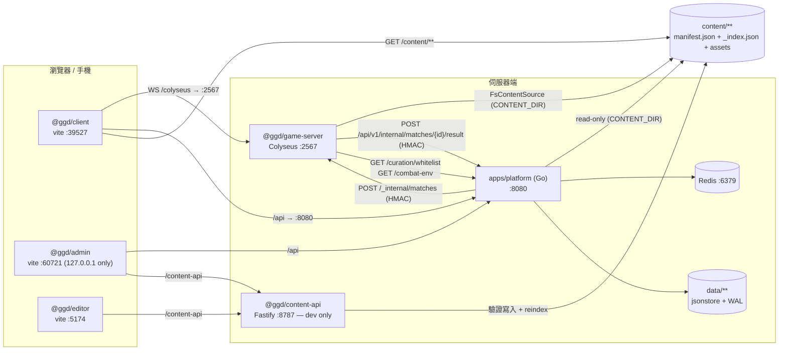
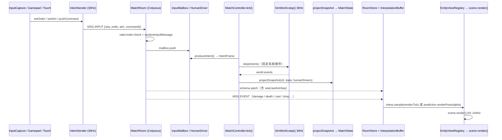

# GGD — 去死團的逆襲 / 動漫亂鬥競技場

3v3v3v3 網頁 3D 體素競技場 MOBA。私人專案。

- [1. 這是什麼 / What this is](#1-這是什麼--what-this-is)
- [2. 快速開始 / Quick start](#2-快速開始--quick-start)
- [3. 啟動各服務 / Running the services](#3-啟動各服務--running-the-services)
- [4. 有哪些頁面 / Feature pages](#4-有哪些頁面--feature-pages)
- [5. 怎麼玩 / How to play](#5-怎麼玩--how-to-play)
- [6. 各平台操作 / Controls](#6-各平台操作--controls)
- [7. 內容 / Content](#7-內容--content) — 含**完整的英雄 / 技能 / 道具清單**、**60 張聖杯願望三選一**、以及**技能機制詞彙**（效果 / 觸發 / 條件 / 標籤 / 特效）
- [8. 架構 / Architecture](#8-架構--architecture)
- [9. 開發 / Development](#9-開發--development)
- [10. 社群 / Community](#10-社群--community)
- [11. 授權 / Licence](#11-授權--licence)

---

## 1. 這是什麼 / What this is

一場 12 人：**4 隊 × 每隊 3 席**。每個回合，still-alive 的隊伍被拆成**同時進行的兩場 3v3 對決**（LoL Arena 式的 paired duels），輸的一方扣命數，命數歸零就淘汰，最後站著的隊伍第一名。回合之間有整備相位可以買裝、抽三選一強化，而且**每個回合都會換一張地圖**。跑在瀏覽器裡：Babylon.js 畫面、React HUD、Colyseus 權威伺服器、一套 30Hz 確定性模擬同時跑在伺服器與客戶端（後者只用來做本機預測）。可以純離線打 bot，也可以接上帳號平台連線對戰。

這是**私人專案**，從作者自己的 Warcraft III 自製地圖移植過來 —— 英雄、技能、道具、數值、字串都是從 `.w3x` 匯入再重建的（`tools/w3x-import`）。不是開源專案，沒有 CI badge，沒有 contribution guide，也不打算有。這份 README 是寫給兩種人的：**(a) 隔一陣子回來的作者本人**，**(b) 被丟了這個 repo 要幫忙的朋友**。所有數字與路徑都是從 repo 讀出來的；讀不到的地方會明講「未驗證」，不會編一個看起來合理的預設值。

---

## 2. 快速開始 / Quick start

**最短的真實路徑：不需要 Go、不需要 Redis、不需要帳號。**

```bash
pnpm install
```

```bash
pnpm dev
```

開 <http://localhost:39527>，在登入畫面按 **Play offline vs bots**（按鈕下方就寫著 "no account needed — jumps straight into a bot match"）。旁邊的競技場下拉選單有預設值 `arena.skeleton`（`apps/client/src/ui/platform/maps.ts:19` 的 `DEFAULT_MAP_ID`），不選也能直接開打。

接著會進**英雄選擇 40 秒**。挑一個按鎖定；**就算你完全不動，開打前伺服器也會從可選池裡隨機指派一個**（`MatchController.ts` 的 `isEnabledSpawnablePick()` 檢查失敗就 `pool[rng.int(...)]`），不會像早期版本那樣以 0 血觀戰開局。之後就是 §5 的迴圈：整備／商店 → 戰鬥 → 結算 → 下一回合。

為什麼這樣就夠：

- client 的 vite port 是寫死的 `39527` + `strictPort`（`apps/client/vite.config.ts` 的 `server.port` / `server.strictPort`），`pnpm dev` 不用加任何參數。
- client 走同源 `/colyseus` proxy 打到 `localhost:2567`（同檔 `server.proxy["/colyseus"]`，`ws: true`）。
- game-server 抓不到 platform 時，白名單**fail-safe 成 allow-all**（`apps/game-server/src/curation/whitelist.ts:14-21`），所以不跑 platform 也有完整英雄可選。
- `content/manifest.json` 與各 `_index.json` **都在 git 裡**（78 英雄 / 461 技能 / 239 道具），fresh clone **不需要**先跑 `content:build`。
- `@ggd/shared` **沒有 build 步驟** —— `package.json` 的 `main`/`types`/`exports` 全部直接指向 `./src/*.ts`，由 vite / tsx 就地編譯。所以 `pnpm install` 之後不用先 `pnpm build` 也不用先 build shared。

> 前兩條刻意只寫欄位名不寫行號 —— `apps/client/vite.config.ts` 是常被改的檔案，這兩處在寫這份 README 的期間就漂過兩次（504 → 505 → 514）。要找就 grep `39527` 與 `"/colyseus"`。

> **dev 模式下 `PLATFORM_GAME_SHARED_SECRET` 是空的** —— 這代表 join 不驗證、client 送什麼 accountId 就是誰、而且**作弊指令是開的**（`apps/game-server/src/config/secretGuard.ts:15-30`、`match/cheatGate.ts:14-17`）。本機自己玩沒差，對外開就是洞。

### 前置需求 / Prerequisites

| 需要 | 版本 | 何時需要 | 出處 |
| --- | --- | --- | --- |
| Node | `>=20` | 一定 | `package.json:8` |
| pnpm | `9.15.9`（`packageManager` 已 pin，`corepack enable` 即可） | 一定 | `package.json:6` |
| Go | `1.25`（platform）／`1.23`（testrunner） | 跑 platform 或 `make test` | `apps/platform/go.mod:3`、`tools/testrunner/go.mod:3` |
| Redis | 預設 `127.0.0.1:6379` | 只有跑 platform 才要 | `apps/platform/internal/config/config.go` 的 `LoadStorage()` |
| python3 | importer 要 **≥3.10**；`tools/reference/*.py` **沒有宣告任何最低版本**（只有 shebang，無 `from __future__`、無版本檢查），本機實測 3.10.4 可跑 | 重新產生 §7 的內容清單（`pnpm docs:readme` / `docs:reference`，兩者都是直接 `python3 tools/reference/*.py`）；importer 另需 `mpyq` `Pillow` | `package.json:22-24`、`tools/w3x-import/README.md:30` |
| ffmpeg | — | 只有 bgm-gen / tts-gen 才要 | `tools/bgm-gen/README.md` |
| docker + kind + kubectl + helm + skaffold | — | 只有 `make up` 才要 | `Makefile:42-46` |

沒有 `.nvmrc`。lockfile 是 pnpm v9 格式。CI 用 Node 22 + Go 1.25（`.github/workflows/ci.yml:21,32`）；engines 只宣告 `>=20`，所以「哪些版本是 known-good」除了 CI 的 22 之外沒有其他保證。

---

## 3. 啟動各服務 / Running the services

`.claude/launch.json` 是啟動設定的權威來源（13 個具名 server）。三個組合包：

```bash
pnpm dev        # game-server + client
```

```bash
pnpm dev:editor # content-api + editor
```

```bash
pnpm dev:all    # game-server + client + editor + content-api + admin
```

| name | 指令要點 | port | 什麼時候用 |
| --- | --- | ---: | --- |
| `client` | `pnpm --filter @ggd/client dev --port 39527 --strictPort` | 39527 | 平常唯一要開的前端 |
| `client-lan` | 同上 **+ `--host 0.0.0.0`** | 39527 | 手機／第二台電腦要連進來打。開之前先 `make lan-probe` |
| `client-mobile` | `VITE_GAME_WS=ws://localhost:2599` + port 5199 | 5199 | 搭配 `game-server-mobile`，在同一台 Mac 上開第二套環境（**不是** LAN 用的，見 §6） |
| `game-server` | `pnpm --filter @ggd/game-server dev` | 2567 | 預設。無 secret ＝ dev 模式（cheats on） |
| `game-server-seam` | `PLATFORM_GAME_SHARED_SECRET=devseam` | 2567 | 要測 platform↔game 的 HMAC seat/ticket 交握 |
| `game-server-platform` | `GGD_PLATFORM_URL=http://127.0.0.1:8080` + `GGD_WHITELIST_BYPASS=1` | 2567 | 要讓 game-server 讀到**本機** platform 的方便組合。**`GGD_PLATFORM_URL` 其實可省** —— 程式的內建預設已經是 `http://localhost:8080`（`apps/game-server/src/config/platformUrl.ts:31`，任務 #48 已把舊的 k8s host 預設改掉；k8s 那邊改成明確設 `GGD_PLATFORM_URL=http://platform:8080`）。這條真正有價值的是 `GGD_WHITELIST_BYPASS=1`，免得 default-empty 白名單把可選英雄過濾到零 |
| `game-server-mobile` | `GAME_PORT=2599` | 2599 | 手機測試專用的第二台 game-server |
| `platform` | `go -C apps/platform run ./cmd/platform`（⚠ 見下） | 8080 | 需要帳號、大廳、排位、白名單時 |
| `admin` | `pnpm --filter @ggd/admin dev` | 60721 | 後台。網址是 `/admin/`，**只綁 127.0.0.1** |
| `content-api` | `pnpm --filter @ggd/content-api dev` | 8787 | 後台「內容管理」要能存檔就得開它 |
| `editor` | `pnpm --filter @ggd/editor dev` | 5174 | 獨立的內容編輯 SPA，`/editor/`。**只有這條路徑會給你一個能用的編輯器**：正式映像預設不含它（#241）|
| `test-dashboard` | `pnpm --filter @ggd/test-dashboard dev` | 5173 | 一鍵跑測試的 UI，需搭配 `testrunner` |
| `testrunner` | `go -C tools/testrunner run ./cmd/testrunner` | 8799 | test-dashboard 的後端 |

### platform（要 Redis）

`JWT_SIGNING_SECRET` 與 `PLATFORM_GAME_SHARED_SECRET` 是**必填**：`internal/config/config.go` 的 `Load()` 在結尾檢查兩者非空、否則**回傳 error**（注意它自己不會 exit），真正 `os.Exit(1)` 的是 `cmd/platform/main.go:26`。開機時會用 `data/` 的 JSON 重建 Redis 熱層，Redis 掛了就開不起來（`cmd/platform/main.go:38-41` 的 `srv.Boot(ctx)`）。

```bash
redis-server &
```

```bash
DATA_DIR=./data REDIS_ADDR=127.0.0.1:6379 PLATFORM_ADDR=127.0.0.1:8080 JWT_SIGNING_SECRET=devsecret PLATFORM_GAME_SHARED_SECRET=devseam GAME_SERVER_ADDR=http://127.0.0.1:2567 PLATFORM_INTERNAL_URL=http://127.0.0.1:8080 go -C apps/platform run ./cmd/platform
```

> ⚠️ `.claude/launch.json` 有兩處要注意：
> - `platform` 那一條把 `DATA_DIR` 指到一個**舊 session 的 scratchpad 路徑**（`.claude/launch.json:55`）。用那條啟動等於開一個空的 store。要保留資料請自己覆寫 `DATA_DIR`。
> - `game-server-platform` 的 `comment` 欄（`:49`）還在講「內建預設是 k8s host `platform:8080`」—— 那是任務 #48 修好之前的舊註解，已不成立（見上表）。

### 環境變數 / Env vars

**platform**（全部在 `apps/platform/internal/config/config.go` 的 `Load()`；`DATA_DIR` / `REDIS_ADDR` / `REDIS_PASSWORD` 三個由它呼叫的 `LoadStorage()` 讀）

> 這裡刻意只寫函式名不寫行號 —— `apps/platform` 目前正被另一個 session 改動，行號會漂。

| 變數 | 必填 | 預設 |
| --- | --- | --- |
| `JWT_SIGNING_SECRET` | **是** | — |
| `PLATFORM_GAME_SHARED_SECRET` | **是** | — |
| `PLATFORM_ADDR` | | `:8080` |
| `REDIS_ADDR` / `REDIS_PASSWORD` | | `127.0.0.1:6379` / 空 |
| `DATA_DIR` / `CONTENT_DIR` | | `./data` / `../../content` |
| `GAME_SERVER_ADDR` | | `http://127.0.0.1:2567` |
| `PLATFORM_INTERNAL_URL` | | `http://platform:8080`（k8s 用） |
| `SEASON` | | `s1` |
| `RANKED_CHALLENGER_FRAC` / `RANKED_GRANDMASTER_FRAC` / `RANKED_MIN_APEX_GAMES` | | `0.10` / `0.10` / `10` |
| `RANKED_MIN_APEX_POINTS` / `RANKED_MIN_APEX_LADDER` | | `1` / `0`（GH#352 的兩個 apex 閘：**最低分數**與**榜上最少人數**。分數閘的 `1` 是 owner 的底線「沒分數不應該有位階」，調到 0 會被夾回 1；人數閘 `0` ＝不設閘，設成 N 之後**人數 < N 的榜一個菁英/宗師都不發**） |
| `ADMIN_BOOTSTRAP_USERNAME` | | 空（不 bootstrap） |
| `GGD_DEPLOY_TIER` | | 未設 ＝ **public**（版權閘的 fail-safe 方向） |
| `GGD_REQUIRE_APPROVAL` / `GGD_REGISTER_RATE_LIMIT` | | off / `0`（`internal/server/server.go` 的 `New()`：`envEnabled("GGD_REQUIRE_APPROVAL")` / `envInt("GGD_REGISTER_RATE_LIMIT", 0)`） |

**game-server**（`apps/game-server/src/index.ts:22-27` 等）：`GAME_PORT`=2567、`CONTENT_DIR`=repo `content/`、`PLATFORM_GAME_SHARED_SECRET`=空（production 才強制）、`GAME_PUBLIC_ENDPOINT`=`ws://localhost:<PORT>`、`GGD_PLATFORM_URL`=`http://localhost:8080`、`GGD_WHITELIST_BYPASS`、`GGD_COMBAT_ENV_BYPASS`、`GGD_DEV_CHEATS`（設 `"0"` 才關）、`GGD_MAX_ROOMS`=50（出貨預設；平台後台「系統運維」可覆寫，1～500）、`GGD_SNAPSHOT_HZ`=30（同上）、`GGD_SERVER_OPS_BYPASS`（設 `1` 跳過平台讀取）。

**content-api**：`PORT`=8787、`HOST`=127.0.0.1（**非 loopback 直接 exit**）、`GGD_CONTENT_DIR`、`GGD_CONTENT_BACKUP_DIR`=`data/content-backups`；`NODE_ENV=production` 一律拒絕啟動。

**前端 `VITE_`**：`VITE_GAME_WS`（強制指定 Colyseus 位址）、`VITE_PLATFORM_API_URL`、`VITE_CONTENT_API_URL`、`VITE_RUNNER_URL`、`VITE_GGD_SILENT`（靜音，給無頭截圖／背景 agent 用）、以及 admin Console Hub 的 `VITE_CLIENT_URL` / `VITE_EDITOR_URL` / `VITE_ADMIN_URL` / `VITE_DOCS_URL` / `VITE_TEST_DASHBOARD_URL`。

### Docker / k8s

存在，但**不是日常開發的路**。

- `make up` → kind cluster `ggd` + skaffold + helm，最後把 `svc/ggd-edge` port-forward 到 `http://localhost:8080`。需要 docker/kind/kubectl/helm/skaffold 五樣都在。
- `make secrets` 用 `openssl rand -hex 32` 產 `deploy/helm/secrets.local.yaml`（gitignored）。
- `docker/compose.yaml` 是不用 k8s 的較輕迴圈，但**目前有壞掉的 key**。Dockerfile 沒有任何 env 轉譯（`docker/platform.Dockerfile:32,38` 只設 `APP_ENV`/`DATA_DIR`/`CONTENT_DIR` 再 `ENTRYPOINT ["/platform"]`；`game.Dockerfile` 與 `content-api.Dockerfile` 都是 `CMD ["node","dist/index.js"]`），所以 compose 設的名字若程式不讀就是**直接被忽略**：

  | compose 設的 | 程式實際讀的 | 後果 |
  | --- | --- | --- |
  | `HTTP_ADDR: ":8080"` | `PLATFORM_ADDR`（預設 `:8080`） | 無害，預設剛好同值 |
  | `PORT: "2567"`（game） | `GAME_PORT`（預設 2567） | 無害，預設剛好同值 |
  | `GAME_INTERNAL_URL: "http://game:2567"` | `GAME_SERVER_ADDR`（預設 `http://127.0.0.1:2567`） | **壞**：platform 會打回自己而不是 game 容器，開房失敗 |
  | `CONTENT_DIR: /srv/content`（content-api） | `GGD_CONTENT_DIR`（`apps/content-api/src/index.ts:25`） | **壞**：那個 bind mount 等於沒作用 |

  `HTTP_ADDR` 與 `GAME_INTERNAL_URL` 在 `apps/` 底下**零次出現**（實測 grep）。要用 compose 得先把後兩個 key 改名。

---

## 4. 有哪些頁面 / Feature pages

這個 repo 沒有單一入口，是好幾個各自獨立的 dev server。

| 是什麼 | URL | 需要跑的 server |
| --- | --- | --- |
| **遊戲本體**（登入 → 大廳 → 對戰） | `http://localhost:39527/` | client；要真的打才要 game-server；要登入/大廳/排行才要 platform |
| ├ 登入 / 註冊 | 同上（`screen === "auth"`） | client |
| ├ 大廳（好友 / 房間 / 排行榜三欄） | 同上（`screen === "lobby"`） | client + platform |
| ├ 商店 Store（大廳內切換，不是另一頁） | 同上（`lobbyView === "store"`） | client + platform |
| └ 對戰（選角 / 中場商店 / 三選一 / 結算全是 match 的 phase） | 同上（`screen === "match"`） | client + game-server |
| **內容圖鑑 #codex** | `http://localhost:39527/#codex` | client（大廳右上「📖 圖鑑」按鈕） |
| **資產主控台 #assets** | `http://localhost:39527/#assets` | client。**沒有任何按鈕連過去，只能手打 hash** |
| **版權聲明 #credits** | `http://localhost:39527/#credits` | client（登入頁 footer） |
| **音樂・音效試聽** | `http://localhost:39527/bgm-audition.html` | client |
| **模型預算**（#99） | `http://localhost:39527/model-budget.html` | client |
| **店員視線確認**（#103） | `http://localhost:39527/intermission-audition.html` | client，**只在 `vite dev` 下可用** |
| **煙火確認**（#93） | `http://localhost:39527/firework-audition.html` | client，同上 |
| **地面確認**（#80） | `http://localhost:39527/ground-audition.html` | client，同上 |
| **後台管理主控台** | `http://127.0.0.1:60721/admin/` | admin；玩家維運頁另需 platform |
| **內容編輯器** | `http://127.0.0.1:5174/editor/` | editor + content-api。正式部署沒有這個路由（#241）|
| **測試台** | `http://127.0.0.1:5173/` | test-dashboard + testrunner |
| **平台健康檢查** | `http://localhost:8080/api/v1/healthz` | platform |

遊戲 client **沒有 URL router** —— 四個畫面（boot / auth / lobby / match）都在同一個網址下，由 Zustand 狀態機切換。選角、中場商店、三選一、結算全部是 match 畫面的 phase，都沒有自己的 URL。唯一可深連結的是那三個 hash overlay，而且可以疊在對戰進行中打開。

後面三個 audition 頁直接 import client 的 `/src/**/*.ts`，所以只在 `vite dev` 下能用（它們自己的錯誤框就這麼寫）。`bgm-audition.html` 與 `model-budget.html` 是純靜態 + fetch，理論上 build 完也能跑，但**未實測**。

> **⚠ 後台 Console Hub 上有兩張壞卡**：
> - 「測試台」寫的是 `localhost:5199`（`apps/admin/src/config.ts:28`），但那是 `client-mobile` 的 port。測試台真正在 **5173**。
> - 「說明文件 `/admin/docs`」—— 沒有任何 location 專門服務它，admin SPA 也沒有這個 route。`nginx.conf:262-271` 的 `location /admin/` 會用 `try_files $uri $uri/ /admin/index.html` 把它吃掉，所以它**回 200 但畫面是 admin 的預設頁**，不會 404。實質是死連結。

### 後台的每一頁

側邊欄 **production build 11 項**，寫死在 `apps/admin/src/ui/App.tsx:20-34` 的 `NAV` 陣列裡；**dev build 12 項** —— 「內容管理」不在那個陣列中，由 `useContentAdminPage()`（同檔 `:56-74`）動態 import `./ContentPage` 取得，再由 `App.tsx:109` 插在第 5 項之後。打 ✅ 的需要真的 platform 管理員登入，其餘在 loopback 上免登入直接進（`apps/admin/src/store.ts:85-94`）。

| 頁面 | 做什麼 | 需登入 |
| --- | --- | :---: |
| Console Hub | 每個服務一張卡 + 即時健康燈號 | — |
| Players | 玩家搜尋：停權 / M幣調整 / MMR 設定 | ✅ |
| Matches | 已結算對戰紀錄 + 詳情抽屜 | ✅ |
| Announcements | 公告增刪改 + 上下架 + 玩家端預覽 | ✅ |
| 內容白名單 | **內容能不能被玩到，只由這頁決定**。預設全空；英雄／道具／技能三分頁，可批次開關、一鍵「啟用起始組合」 | ✅ |
| 內容管理 | 英雄・技能・武器道具 CRUD。**只存在於 dev build**（production build 連這個 chunk 都不產生） | — |
| 戰鬥系統 | 全域倍率表（冷卻／傷害／防禦／生命／速度／治療／護盾／暴擊…），1.0 為中性。**存檔只對「下一場」生效** | ✅ |
| AI 生成設定 | 平台 AI proxy：開關、各能力的 base URL + model、**只寫不讀**的 API key | ✅ |
| 模型預算 | 每個模型的面數／貼圖／VRAM／用在哪 + 同畫面上限 | — |
| ICON 生成追蹤 | 覆蓋率、供應商狀態、樣式規格、費用與授權 | — |
| M幣 發放 | 後台發放 M幣（可負數扣除，伺服器端 floor 到 0） | ✅ |
| Audit log | 所有後台變更的 append-only 紀錄 | ✅ |

### 一開始沒有任何可玩內容？

只有**跑了 platform**才會遇到 —— 內容白名單刻意 default-empty。離線 bot 模式因為 fail-safe allow-all，不受影響。

```bash
make seed-demo   # 需要 admin token；POST 到 curation/whitelist/starter
```

```bash
make whitelist   # 看目前啟用了多少 champions/items/abilities
```

> ⚠️ 這兩個 target 打的**預設端點不是 platform**：`Makefile:108` 是 `PLATFORM ?= http://127.0.0.1:60721`，那是 **admin dev server** 的 port；請求要靠 `apps/admin/vite.config.ts:89-92` 的 `/api` proxy 才會轉到 platform :8080。所以只開 platform、沒開 admin 一樣是 connection refused。要嘛兩個都開，要嘛直接指定端點：`make whitelist PLATFORM=http://127.0.0.1:8080`（`seed-demo` 同理，另需 `TOKEN=`）。

或直接在後台：**內容白名單 → ⭐ 啟用示範組合 → 儲存**。完整復原指南：[`docs/runbooks/content-whitelist.md`](docs/runbooks/content-whitelist.md)。

---

## 5. 怎麼玩 / How to play

> 本節每個數字都從程式與 `content/config/` 讀出。若你改了設定卻發現沒生效，先看最後的「設定陷阱」。

### 賽制：3v3v3v3

一場 12 人：**4 隊 × 每隊 3 席**。每隊開局 **3 條命**。

每個回合，仍存活的隊伍被拆成**同時進行的兩場 3v3**（zone 0 / zone 1）。配對走固定的循環賽表，每 3 回合循環一次（`apps/game-server/src/match/PairedDuels.ts:16-29`）：

| 回合 | zone 0 | zone 1 |
| --- | --- | --- |
| 1, 4, 7… | 隊0 vs 隊1 | 隊2 vs 隊3 |
| 2, 5, 8… | 隊0 vs 隊2 | 隊1 vs 隊3 |
| 3, 6, 9… | 隊0 vs 隊3 | 隊1 vs 隊2 |

**輪空（BYE）**：只剩 3 隊時會有一隊輪空 —— 不上場、不扣命，但仍領敗方等級的 150 金。輪空者依回合輪替。

**輸掉一場對決要扣命，而且愈打愈痛**（`PairedDuels.ts:64-68`）：

| 回合 | 扣命 |
| --- | ---: |
| 1–2 | 1 |
| 3–4 | 2 |
| 5+ | 3 |

命數歸零＝淘汰，名次由下往上鎖定；**最後存活的隊伍就是第 1 名**，整場立刻結算。

### 一個回合長什麼樣

**商店在戰鬥「之前」**，不是之後：你在整備相位花掉上一回合賺的錢，然後開打。

```
英雄選擇 40s ──▶ ┌─ 整備/商店 40s ──▶ 戰鬥 ≤240s ──▶ 結算 6s ─┐
（開局一次）      └───────────────  下一回合  ◀───────────────┘
```

秒數來自 `content/config/config.match.json:12-21`。240 秒是**硬上限**，不是預期的回合長度 —— 火圈會先把場面收掉。模擬固定 30Hz。

戰鬥開始時所有人先被「停屍」，只有排進本回合對決的兩隊會在自家出生點**滿血滿魔**復活；輪空隊整回合維持陣亡。所以每回合都是乾淨的重新開打，只有裝備、等級與強化會累積。

**對決怎麼判贏**（`apps/game-server/src/match/MatchController.ts:760-781`，HP% 加總在同檔 `:748-757`）：

1. 一方三人全倒 → 對方勝
2. 240 秒到期 → 比該區存活者的 **HP 百分比總和**，高者勝
3. 雙方同時全滅、或 HP% 完全相同 → 用 `world.rng` 擲 50%（可重播，非真隨機）

### 火圈

**戰鬥開始 180 秒後**點燃（`config.match.json:15-20`）。不是實體縮圈，而是對每個還站著的英雄施加逐秒升壓的燒傷：t+0s 寬限、t+1s 每秒 1% 自身最大生命、t+2s 每秒 2%…上限 100%/秒。累積 1+2+…+14 ≥ 100%，所以**點燃後約 14 秒，滿血也會死**。

火圈傷害是純 %HP 真實傷害：**無視護甲、魔抗、護盾，也無視 combat-env 的傷害倍率**。它只在戰鬥真正進行中燒，回合一判定結束就停。

實務上：把 180 秒當成「這回合該結束了」的鈴聲，240 秒當成不會用到的保險絲。

### 中立守護者

每個**有對決的** zone 中央會生一隻（輪空區沒有）。它是純中立建築 —— 沒有隊伍、不算存活人數、不影響勝負判定，但誰都能打它。

**獎勵只給最後一擊的人**（`packages/shared/src/sim/systems/GuardianSystem.ts:489-543`）：**+150 金**、**回滿 HP 與 MP**、**25 秒的「鎮守之力」**（周圍 2.5 半徑內打出守護者齊射傷害 25% 的脈衝）。若最後一擊者在結算瞬間已死、或不在同一 zone，獎勵**作廢** —— 守護者照樣消失，沒人拿到。

它不是免費補品。醒著時會朝**傷害它最多的人**打出有 0.8 秒預警的 AoE 齊射：每 4 秒一輪、3 個標記點、半徑 3.0，同一次甦醒中每發再 +15%（最多 2 倍）。標記點**不追人**。

強度隨回合成長：HP = `1450 × (1 + 0.28×(回合-1))`，齊射基礎傷害 = `108 × (1 + 0.14×(回合-1))`。單次承受傷害硬上限 = 其最大生命的 15%，所以沒有任何一招能一鍵秒掉它。回合結束時消失。

> ⚠ 任務 **#89（守護者）** 在任務清單上仍標 pending。程式路徑與設定都存在且會被武裝，但**沒有實際跑一場對局確認觀感**。

### 金錢與商店

| 項目 | 金額 |
| --- | ---: |
| 起始金幣 | 600 |
| 擊殺 | 150 |
| 首殺賞金（額外） | +100 |
| 助攻 | 75 |
| 回合勝 | 300 |
| 回合敗／輪空 | 150 |

（`packages/shared/src/sim/economy/progression.ts:16,29`）

首殺賞金**每個敵人一生只付一次** —— 被救活後再殺不會再付（`DeathSystem.ts:54-57`）。

**商店開放時機**三態（`economy/shopAccess.ts:67-82`）：整備相位全員可買；**戰鬥中只有本回合已陣亡者**可買；英雄選擇／結算／賽末關閉。

**背包 6 格**，賣出**只退原價 40%**（向下取整）。買賣的 undo 歷史在戰鬥開始時清空，跨回合的「買→賣→undo」套不出錢。

**武器只有兩種價格**（`economy/itemTiers.ts:43-46`）：

| 層級 | 價格 | 件數 |
| --- | ---: | ---: |
| 簡易 SIMPLE | 300 | 42 |
| 強力 POWERFUL | 1200 | 28 |
| 傳說 LEGENDARY | **無價格** | 25（只能靠三選一或寶玉） |

4 件簡易 ≈ 1 件強力的數值，但吃掉 4 格 vs 1 格。後期是**格子壓力**的遊戲，不是金幣效率的遊戲。

**傳說寶玉 2400 金**：不是道具，是抽卡觸發器 —— 買下即從傳說池 roll 出三選一並預留一格。

> ⚠ **「不可重複」不是全域規則**。`buyItem` 只在道具標了 `unique` 時才擋（`shop.ts:227`），而**出貨的 127 份道具文件裡一份都沒有標 `unique: true`**（2026-08-18 重新實測 —— 唯一標過的那一份已隨退場批次搬進 [`content/_legacy/items/`](content/_legacy/items/)，逐筆索引見 [`docs/legacy-index.md`](docs/legacy-index.md)）。也就是說在目前資料下每一件道具都買得到第二個。是否有其他策展層另外過濾 —— **未驗證**。

### 屬性路線與畢業裝

商店有個不佔格子的服務：**能力屬性強化，每次 375 金**，從 9 種固定加成中均勻抽一種，可無限疊。

累積 **20 次**（375 × 20 = 7500 金）可換畢業裝 **傳說·萬象強化**：對最大生命／攻擊力／護甲／魔抗**各 +r%**，r 是 10%~100% 的十等分均勻抽。

兩個必須知道的規則：

1. **任何一次用金幣買真道具，層數立刻歸零** —— 包含第 19 層，也包含買傳說寶玉。只有三選一**免費發**的武器不歸零（`shop.ts:118`、`statPath.ts:204-216`）。
2. **就算 20 層滿了，也要等第 6 回合的商店才會發**（`CAPSTONE_ROUND_GATE = 6`）。

一場的確定收入約 7600 金（600+750+2500+1000+1250+1500），而 20 層要 7500 —— 這是一條**全押的路**，走了就幾乎買不起任何裝備。

### 回合間的三選一

抽 3 張、加權、不重複、已擁有的不會再出現（`content/config/arena-rules.json`）。

⚠️ **下面這張表已經跟出貨值脫節,不要照著它讀數字。** 唯一的真相是
`content/config/arena-rules.json`,而 `apps/game-server/src/match/arenaRules.test.ts`
逐格對著它斷言。已知的偏差(2026-08-01 量的):第 1 回合現在發 **+750**
(owner「開局應該是 750」)、兩張武器卡都抽 `legendary-weapons`
(`quest-rewards` 已退場)、第 3–13 回合的金幣與這張表完全不同。
重寫整張表沒有排進這一批,所以這裡誠實地標成過期而不是假裝它是對的。

| 回合 | 等級 | 金幣 | 強化卡 | 武器卡 |
| ---: | ---: | ---: | --- | --- |
| 1 | +2（自動學會 Q/W/E） | — | silver | — |
| 2 | +1 | +750 | silver | quest-rewards |
| 3 | +1 | +2500 | gold | — |
| 4 | +1 | +1000 | gold | — |
| 5 | +1 | +1250 | prismatic | legendary-weapons |
| 6 | +1 | +1500 | prismatic | — |
| 7+ | +1 | 1500，每多一回合 +250 | prismatic | — |

另外：**大招 R 從第 3 回合起無視等級可加點**；**EX 技能第 5 回合解鎖**。

### 復活小圈

你倒下時會在屍體位置落下**隊色小火圈**。**活著的隊友**站進去引導 **3 秒**就能救回你（`arena-rules.json:56-67`）：

- 引導 3.0 秒，圈存在 6.0 秒，半徑 2.0
- 復活後 **HP 與 MP 各回 50% 上限**
- **每隊每回合只有 1 次**
- 敵人站進圈裡會**暫停**進度（不歸零）；被打**不會**中斷；被控場**會**中斷
- 沒人引導時進度以 2 倍速倒退

圈只能救**它自己的主人**，屍體本人不能自己引導。一隊同時只有一個圈。回合結束時所有圈與引導中的施法一律靜默消失。

場上還有**治療花**：開打 15 秒後出現、每區最多 1 朵、25 秒重生、60 血，打爆後在半徑 6 內回復 18% 最大生命與 18% 最大魔力。

### 全域倍率表（重要：畫面上的數字已經乘過了）

<!-- BEGIN GENERATED:combat-env -->
#### 全域倍率表 `combat-env`（39 項 · 21 項不是 1.0）

> `content/config/combat-env.json` 是一張全域倍率表，每項只作用在模擬裡的**唯一一個**公式點。**遊戲內顯示的每一個數字，都是乘完倍率之後的最終值** —— 換算走唯一一條接縫 `apps/client/src/ui/displayFinal.ts`，React 端訂閱權威的 `combatEnvJson`，後台改倍率時畫面即時跟著變。
>
> ⚠️ 下表是**出貨值**。後台覆寫逐鍵蓋過 content 預設，所以線上那一場可能不是這些數字（改 config 前先查有沒有存過 override）。

| 倍率 | 值 | 是什麼 |
| --- | ---: | --- |
| `abilityRange` | **0.8** | 技能範圍 |
| `agiToArmor` | **0.3** | 敏捷 → 護甲 |
| `agiToAttackSpeed` | **0.01** | 敏捷 → 攻速 |
| `agiToEvasion` | **0** | 敏捷→迴避率 |
| `attackRange` | **0.6** | 攻擊距離 |
| `cooldown` | **0.3** | 技能冷卻時間 |
| `goldEliteKill` | **0.1** | 打特殊殭屍／殭屍王發放金錢 |
| `goldMobKill` | **0.5** | 打一般殭屍發放金錢 |
| `intToAbilityPower` | **4** | 智慧 → 法強 |
| `intToMagicResist` | **0** | 智慧 → 魔抗 |
| `intToManaRegen` | **0.21** | 智慧 → 回魔 |
| `intToMaxMana` | **15** | 智慧 → 魔力 |
| `magicResistMult` | **0.2** | 魔法抗性倍率 |
| `manaRegen` | **8** | 魔力回復 |
| `maxHealth` | **9** | 生命上限 |
| `moveSpeedMelee` | **0.8** | 近戰移速倍率 |
| `moveSpeedRanged` | **0.6** | 遠程移速倍率 |
| `strToAttackDamage` | **0.24** | 力量 → 攻擊力 |
| `strToCritChance` | **0** | 力量→暴擊率 |
| `strToHealthRegen` | **0.04** | 力量 → 回血 |
| `strToMaxHealth` | **23** | 力量 → 生命 |

其餘 **18** 項是 1.0（不動）：`abilityDamage`、`abilityPower`、`attackDamage`、`attackSpeed`、`critChance`、`critDamage`、`damageDealt`、`defense`、`goldHeroKill`、`goldQuest`、`goldRoundPayout`、`healing`、`healthRegen`、`itemCooldown`、`lifesteal`、`maxMana`、`moveSpeed`、`shield`。

*由 `pnpm docs:readme` 從 contentVersion `cv_39f21bfe47a9` 產生。 倍率讀 `content/config/combat-env.json`（version 9）。 這三段標記之間的任何字都會在下次重新產生時被覆蓋。*
<!-- END GENERATED:combat-env -->

倍率表在 tick 0 之前注入模擬並隨快照下發，兩邊用同一支正規化函式，所以預測與伺服器永遠對得上。技能卡面上的冷卻／距離／傷害怎麼過這張表，見 [⭐ 技能五級距](#-技能五級距)。

### 每回合換地圖

輪替池讀 `content/config/arena-pool.json`（`config.arena-pool@1`，後台可調 —— GH#324 之前它是寫死在 `arenaSelect.ts` 的 TS 陣列，於是七張新產出的動漫競技場上線後玩家一場都碰不到）。**哪幾張、各是什麼形狀，看下面那張產生出來的表**，⛔ 這裡不再手寫一份。

選擇由 `(matchSeed, round)` 決定，**不動用 `world.rng`**，因此：同種子重播完全一致、**連續兩回合永不重複**。地圖在戰鬥相位一開始就選定並套用碰撞幾何。

> ⚠ 任務 **#145（每回合換地圖）** 仍標 pending：程式路徑與全部 arena 文件都在，但**沒有實際跑一場對局確認觀感**。

<!-- BEGIN GENERATED:arenas -->
#### 競技場 arenas（13 張 · 邊界半徑 4 種 · 7 張帶場地特色）

> **輪替**欄讀 `content/config/arena-pool.json`（`config.arena-pool@1`，後台可調）：🔁 ＝在回合輪替池裡（12 張）、🏁 ＝決賽場地（`arena.royale`，刻意不在池子裡）、— ＝有文件但目前沒有人抽得到。⚠️ 池子的**順序不是輪替順序** —— `pickRoundArena()` 用 match seed 洗一次牌。
>
> 其餘每一欄都是從那一份 arena 文件**逐檔數**出來的：**半徑**＝各 zone 的 `boundaryRadius`（不同就全部列出）、**zone**＝一張圖切成幾個獨立的對決區、**障礙**＝`obstacles` 的段/圓總數（碰撞幾何，⛔ 不是佈景）、**出生點**＝`spawns` 攤平後的座標數、**地面**＝`groundStyle`、**背景**＝有沒有 `backdrop` 遠景層、**佈景**＝`decor` 物件數 ＋ `scenery.props` 的實例數（⛔ 兩者都不擋路）、**場地特色**＝`regions` 命名區域 / `interactions` 互動點 / `gates` 週期開關門。

| id | 名稱 | 輪替 | 半徑 | zone | 障礙 | 出生點 | 地面 | 背景 | 佈景 | 場地特色 |
|---|---|:-:|--:|--:|--:|--:|---|:-:|--:|---|
| `arena.castle` | 城堡競技場（室內） | 🔁 | 24 | 2 | 16 | 12 | `stone` | ✅ | 42+36 | — |
| `arena.colosseum` | 羅馬大擂台（室外） | 🔁 | 24 | 2 | 40 | 12 | `sand` | ✅ | 74+37 | — |
| `arena.dota` | Dota 三路河道（迷你） | 🔁 | 24 | 2 | 24 | 12 | `grass` | — | 64+27 | — |
| `arena.frieren` | 芙莉蓮迷宮 | 🔁 | 30 | 2 | 18 | 12 | `stone` | ✅ | 28+36 | 區域×10、互動×16、機關門 |
| `arena.godie` | 去死團的逆襲 EX 2.2s | 🔁 | 24 | 2 | 55 | 12 | `dirt` | — | 24+23 | — |
| `arena.heavens-arena` | 天空鬥技場 | 🔁 | 30 | 2 | 20 | 12 | `wood` | ✅ | 21+30 | 區域×10、互動×16、機關門 |
| `arena.holy-grail` | 大聖杯洞窟 | 🔁 | 30 | 2 | 28 | 12 | `stone` | ✅ | 26+34 | 區域×10、互動×16、機關門 |
| `arena.infinity-castle` | 無限城 | 🔁 | 30 | 2 | 36 | 12 | `tatami` | ✅ | 31+39 | 區域×10、互動×16、機關門 |
| `arena.nazarick` | 納薩力克大墳墓 | 🔁 | 31.24 | 2 | 20 | 12 | `obsidian` | ✅ | 25+38 | 區域×10、互動×16、機關門 |
| `arena.royale` | 終局大混戰 | 🏁 | 42 | 1 | 4 | 12 | `stone` | — | 18+38 | — |
| `arena.shiganshina` | 希干希納 | 🔁 | 30 | 2 | 18 | 12 | `dirt` | ✅ | 25+39 | 區域×10、互動×16、機關門 |
| `arena.skeleton` | 新手競技場 | 🔁 | 24 | 2 | 4 | 12 | `stone` | — | 24+20 | — |
| `arena.world-tree` | 世界樹核心 | 🔁 | 30 | 2 | 28 | 12 | `grass` | ✅ | 29+36 | 區域×10、互動×16、機關門 |

*由 `pnpm docs:readme` 從 contentVersion `cv_39f21bfe47a9` 產生。 輪替 12 / 全 13 張。 這三段標記之間的任何字都會在下次重新產生時被覆蓋。*
<!-- END GENERATED:arenas -->

### 設定陷阱（改了不會生效）

`content/config/config.match.json` 有幾個欄位**沒有任何程式碼讀取**：

| 欄位 | 寫的 | 實際 |
| --- | --- | --- |
| `match.startingTeamLives` | 8 | **3**（`apps/game-server/src/rooms/MatchRoom.ts:192` 字面值） |
| 整個 `economy` 區塊 | — | 生效的是 `economy/progression.ts` 與 `shop.ts` 的常數。目前數值恰好相同，但那是**巧合不是綁定** |
| `draft.tierSchedule` | — | 被 `arena-rules.json` 的 `rounds` 表取代 |

會生效的是：`match` 的四個秒數欄位、`match.fireRing` 整塊、`arena-rules.json` 全部、`combat-env.json` 全部。

---

## 6. 各平台操作 / Controls

GGD 是**一份 web client**。Mac 與 PC 之間**沒有任何程式碼上的差異** —— 全 client source 找不到 `userAgent` / `navigator.platform` / `metaKey` 的行為分支，也沒有 Electron / Tauri / Capacitor 外殼。差別只有你用哪個瀏覽器。手機才真的有一套獨立的輸入層。

| | 鍵鼠 (Mac / PC) | 觸控 (iPhone 橫向) | 手把 |
| --- | --- | --- | --- |
| 移動 | 右鍵點地 | 畫面**左半邊**浮動搖桿（按下處為圓心，半徑 64px，死區 0.12） | 左類比（死區 0.15） |
| 普攻／指定攻擊 | 右鍵點敵人；`A` + 左鍵 = attack-move | 右下角大 ⚔ 鈕（88px）＝ 打**範圍 12 內最近的敵人** | `LT` = 最近敵人；`RT` = attack-move |
| Q / W / E / R | `Q` `W` `E` `R`（quick cast，以**當下滑鼠位置**結算） | ⚔ 鈕周圍 122px 弧上的四顆圓鈕（Q 正左、R 正上） | `A` `B` `X` `Y` |
| **EX 技能** | **`F`**（HUD 標示為「F / Back」） | 弧線**外側** 45° 方向的琥珀色 EX 鈕（圓心距 122·√2 ≈ 173px，不在 QWER 那條 122px 弧上） | `Back`(8) |
| 停止／回城 | `S` 停止、`B` 回城 | 弧線上方小 ⌂ 鈕 = 回城 | `RB` 停止、`LB` 回城、`Start` ready |
| 攝影機 | 滾輪縮放、`Space` 切換跟隨、方向鍵平移、滑鼠貼邊 24px 自動平移 | 無（恆跟隨） | 右類比 = 瞄準（非攝影機） |
| 選單 | `Esc`（或 ☰ 鈕） | ☰ 鈕 | — |
| 作弊台（僅單機） | 反引號 `` ` ``（或 🐞 鈕） | 🐞 鈕 | — |
| 商店／計分板 | **沒有快捷鍵** | 同左 | 同左 |

> `W`/`A`/`S`/`D` **不是**移動鍵：照 MOBA 慣例 `A` 是 attack-move、`S` 是停止、`W`/`E` 是技能。平移用方向鍵。
> 桌機的技能格**按下去不會施法** —— 滑鼠按住只會叫出地面虛線射程/AoE 預覽 + 頂部技能說明；施法一律走鍵盤。
> 「商店／計分板無快捷鍵」是對 `apps/client/src` 所有 `keydown` listener 的窮舉 grep 結果；若有透過其他機制註冊的快捷鍵不會被抓到。

### 觸控：兩種施法方式

按住技能鈕後，鬆手做什麼取決於手指移動了多遠：

1. **點一下（位移 ≤ 18px）= 快速施放**。走跟鍵鼠、手把完全同一條 `buildCastCommand`：skillshot/dash → 射程內最近敵人方向，沒有就用面向；ground → 面向前方 `min(射程, 6)`；self → 自己；targeted → 射程內最近敵人，沒目標就**不出招**。
2. **按住拖曳（> 18px）= 瞄準模式**。拖到 96px 為滿舵，放開即施放。拖曳中該格亮**綠框**，地面顯示直線或圓盤指示器。**拖回原點 28px 內再放開 = 取消**（框變**紅色**）。

同時只追蹤一根技能手指；搖桿與技能手指可並存。

### 判斷「這是觸控裝置」

```
isTouchDevice = __ggdForceTouch === true
              || ('ontouchstart' in window && matchMedia("(pointer: coarse)").matches)
```

兩個條件**都要成立**（`apps/client/src/input/mobileDetect.ts:19-38`），所以有觸控螢幕但主指標是滑鼠的筆電**不會**被判成手機。目標平台明寫為 iOS Safari / WKWebView，**Android 不在範圍內**。開發時可用 `globalThis.__ggdForceTouch = true` 在桌機模擬（手把則有 `globalThis.__ggdFakePads`）。

### 手把與同機多人

- 一台機器最多 **4 位本機玩家**，一人一支手把：第 k 支**已連線**的手把驅動第 k 位玩家。手把數少於人數時，多出來的玩家沒有輸入。
- 玩家 0 同時保有鍵鼠；兩邊餵同一個 IntentSender，**後寫者勝**。
- 單人路徑則是「**最後連上的**那支手把」接管。
- 選角階段按 `A` 循環切換該座位的英雄。
- 同機客人的帳號是 `{accountId}:p2`..`:p4`，顯示為「名字 (2P)」..「(4P)」。
- ⚠ 程式直接寫死 standard mapping 的按鍵索引（BTN 0–9），**沒有讀 `Gamepad.mapping`** —— 非標準對應的手把會錯位。哪些實體手把回報 standard mapping **未實測**。

### 手機版面限制

- **強制橫向**：直向會蓋上整頁「Rotate to landscape」提示。
- HUD 以「手機橫向約 375–430px 高」為前提排版：小地圖從桌機的**右下**搬到觸控的**左上**，208 → 116px（因為右下角整片被技能弧佔滿）；敵隊面板在觸控只剩 66px 血條長條。
- 所有可點元素 ≥ 44px（Apple HIG），輸入框 16px 避免 iOS 對焦縮放；`viewport-fit=cover` + `env(safe-area-inset-*)` 避開瀏海與 home indicator。
- 畫質自動判定：觸控 → `medium`（≤3 核或 <3GB → `low`），桌機 → `high`（≤4 核或 ≤4GB → `medium`）。

> ⚠️ **已知未修（任務 #151）**：iPhone **橫向的選單畫面**（登入卡／英雄跑馬燈／按鈕／footer）會互相重疊，直向正常。要測 844×390、780×360、以及直向 390×844。只影響選單，不影響戰鬥中的觸控 HUD。

### 用手機透過 wifi 連進來玩

前提：手機和 Mac 在**同一個 wifi**。

```bash
pnpm --filter @ggd/game-server dev
```

```bash
pnpm --filter @ggd/client dev --port 39527 --strictPort --host 0.0.0.0
```

```bash
ipconfig getifaddr en0
```

手機瀏覽器開 `http://<上一行的 IP>:39527`，橫向拿好。

**為什麼會通**：`defaultEndpoint()` 是「同源優先」—— 只要網址 hostname 不是 localhost/127.0.0.1/::1，就連 `ws://<同一個 host>/colyseus`，再由 vite 的 `/colyseus` proxy（`ws: true`）轉到 Mac 本機的 2567。如果寫死 `ws://localhost:2567`，在手機上 localhost 指的是**手機自己**。

**兩件已經做好的事，別自己拆掉**：

- 這台 LAN 公開的 vite server **故意沒有 `/content-api` proxy**，而且有 plugin 對 `/content-api` 所有動詞回終端 404。因為 proxy 會把手機的來源位址洗成 127.0.0.1，content-api 的 loopback 檢查就會誤判，等於把 `content/` 的寫入權交給整個 wifi。內容編輯請走 admin console。
- 版權素材（`/content/assets/models/imported`、`/content/assets/blizzard-local`）依 socket 來源分級：loopback 與 LAN 照給，真正的 public peer 一律 403。手機在同一 wifi 上不受影響。

想確認 wifi 上沒有多開什麼寫入面：

```bash
make lan-probe
```

它用這台機器自己的 LAN 位址去探 39527 / 60721 / 8787（`tools/lan-probe.sh:34-36`），再確認遊戲本身還通得過（`/api/v1/healthz` → 200、`/api/v1/admin/accounts` → 401），最後對 platform :8080 做一次**建議性**檢查。**exit 0 不等於零警告** —— platform 若還綁在 wildcard 上會印黃色 `WARN` 但仍然通過（腳本自己註明那是無害的，因為 platform 沒有任何 address-based trust）。

> `.claude/launch.json` 另有 `client-mobile`(5199) + `game-server-mobile`(2599)，但 `client-mobile` **沒有** `--host`，而且 `VITE_GAME_WS=ws://localhost:2599` 在手機上會指向手機自己 —— 那是「在同一台 Mac 上開第二套環境」用的，**不是 LAN 連線用的**。

> 以上 LAN 流程是從 `launch.json` + `vite.config.ts` + `RoomConnection.defaultEndpoint()` 推導的，**沒有實際用手機連線驗證過**。

---

## 7. 內容 / Content

**開放（whitelisted）的英雄、技能與商店清單就直接印在下面、預設展開、不用點任何摺疊**。完整的全表搬到 `docs/reference/roster.md`、`abilities.md`、`items.md`（各區塊都有連結），這樣 README 才不會又肥又被 GitHub 折疊。所有數字都從 repo 量出來，權威計數在 `content/manifest.json`（由 `pnpm content:build` 產生）。

下表是 `cv_6e3d7560c86a`（2026-08-18）的實測值。

| collection | docs | 說明 |
| --- | ---: | --- |
| `content/champions/` | **78** | 全部英雄文件。扣掉變身態與下架的，可選本體約 50（sela / thorne 是骨架備援用的開發角色） |
| `content/abilities/` | **461** | 每英雄每 slot 一份，**一名英雄六個 slot**：天生技 `PASSIVE`、Q/W/E/R、EX |
| `content/items/` | **239** | 依 `craftRole` 標記（task #70）：最終合成武器真能買、寶具只能抽（或後台上架）；其餘是組件 / 代幣 / 無角色 |
| `content/vfx/` | 632 | 這個數字跟著 VFX 綁定工作一直在動，以 `manifest.json` 為準 |
| `content/models/` | 124 | 目錄下另有 `_index.json` 與 `_standin-overrides.json`（底線開頭＝非 doc，不進 index） |
| `content/config/` | 62 | 後台可調的每一組旋鈕各一份 |
| `content/arenas/` · `maps/` | 13 · 7 | 七張動漫競技場（GH#324）＋既有場地 |
| 其餘 6 個 collection | 184 | augments 91 / ability-templates 34 / status-effects 30 / projectiles 20 / skins 5 / loot-tables 4 |
| **合計** | **1800** | 這是**此刻**的磁碟實測；權威計數永遠是 `content/manifest.json` |

> ⚠️ **這張表被更正過兩次，兩次都是同一個形狀（第三守則）。**
> 2026-08-16：原本寫 113 英雄 / 662 技能 / 1598 合計 —— 那是 41 隻搬進 `_legacy/`（GH#323）
> **之前**的數字。2026-08-18：`items` 219→**239**、`config` 57→**62**、`augments` 31→**91**
> （60 張聖杯願望進來之後）、合計 1711→**1800**；而「其餘 5 個 collection」那一列
> 寫著 116、底下卻列了 **6** 個加起來 120 的項目 —— 一列自己跟自己對不上，
> 正是「手寫的統計沒有守衛」的標準症狀。
> ⛔ 與其留一個看起來精確的舊數字，不如只留量得到的那一格。

`manifest.json` 裡的 `contentVersion` 是整棵 `content/` 的純函數，**改內容就會變**。不要相信任何抄在文件裡的雜湊 —— 包含這份 README 的散文部分。下面三個產生區塊會自己印出產生當下的 `contentVersion`，那個才是可信的。


### ⭐ 英雄定位與屬性級距 —— 機制參考表

英雄的數值**不是逐隻手填的**。一位英雄只要指定**出身**（十選一），
引擎就從兩張表算出他的十一項屬性：

```
出身 ──► byOrigin[屬性][出身] ──► 落在哪一格級距（極小/小/中/大/極大）
                                        │
        bands[屬性][級距] ──────────────┴──► 基準等級（99 級）的最終總值
                                             （引擎反解出每級成長去命中它）
```

⚠️ **普攻距離**多一層：它的分佈是雙峰的（近戰 1.2–2.0 / 遠程 6–12，跨度 5.1×），
所以有**兩把尺**，走哪一把由 `scaleByOrigin[出身]` 決定 ——
⛔ **不是**由英雄卡上的 `attackType` 決定（出貨資料裡有 10 位兩者刻意相反：
藏馬是近身揮擊卻構得到 8.2，皮卡娘會放電卻只打 1.4）。

三張表都住在 `content/config/`，⚠️ 但**只有前兩張是手編的** —— 那兩張改一格是後台的事，不用重新部署；第三張 `stat-caps.json` 是 **`pnpm statcaps:build` 的產物**（來源：`tools/stat-caps/gen_stat_caps.ts` 的 capAt 表），手改會被 `statcaps:check` 判 stale，要改上限就改來源再重生成（這一行在 2026-08-25 之前把三張都寫成「後台的事」）：

| 表 | 住在哪 |
| --- | --- |
| 出身 × 屬性 → 級距 | `content/config/stat-normalization.json` 的 `byOrigin` |
| 級距 → 數值 | 同上的 `bands` / `bandsByScale` |
| 上限 | `content/config/stat-caps.json`（⚠️ `statcaps:build` 的產物，⛔ 不要手改 —— 改 `tools/stat-caps/gen_stat_caps.ts` 再 `pnpm statcaps:build`） |
| 每位英雄的出身 | `content/champions/*.json` 的 `origin`（批次改用 `pnpm champions:csv:export`） |

<!-- BEGIN GENERATED:stat-bands -->
#### 十出身 × 十一屬性 —— 每一格落在哪一級距（10 × 11）

| 出身 | 移速 | 攻速 | 攻擊力 | 法強 | 生命 | 裝甲 | 魔抗 | 魔力 | 生命回復 | 魔力回復 | 攻擊距離 |
|---|---|---|---|---|---|---|---|---|---|---|---|
| **鬥士** | 中 | 中 | 大 | 小 | 中 | 中 | 中 | 中 | 大 | 中 | 近戰・中 1.6 |
| **狂戰** | 大 | 極大 | 大 | 小 | 小 | 小 | 小 | 極小 | 極大 | 極小 | 近戰・小 1.4 |
| **射手** | 中 | 大 | 極大 | 極小 | 小 | 極小 | 極小 | 中 | 小 | 中 | 遠程・中 8.2 |
| **砲手** | 大 | 小 | 極大 | 小 | 極小 | 極小 | 極小 | 小 | 小 | 小 | 遠程・極大 12 |
| **坦克** | 小 | 小 | 小 | 小 | 大 | 極大 | 極大 | 極小 | 大 | 極小 | 近戰・小 1.4 |
| **法鬥** | 小 | 小 | 大 | 大 | 中 | 小 | 小 | 中 | 中 | 中 | 近戰・中 1.6 |
| **法師** | 中 | 小 | 小 | 大 | 中 | 小 | 小 | 中 | 中 | 中 | 遠程・中 8.2 |
| **法刺** | 大 | 極小 | 極小 | 極大 | 極小 | 極小 | 極小 | 小 | 小 | 小 | 近戰・小 1.4 |
| **硬輔** | 小 | 小 | 小 | 大 | 大 | 大 | 大 | 小 | 小 | 小 | 近戰・中 1.6 |
| **軟輔** | 小 | 小 | 小 | 大 | 小 | 小 | 小 | 小 | 大 | 大 | 遠程・中 8.2 |

**級距語意**：`極小 = 缺陷 · 小 = 偏低 · 中 = 標準 · 大 = 優勢 · 極大 = 特化`

#### 級距的實際數值與上限

| 屬性 | 極小 | 小 | 中 | 大 | 極大 | 一般上限 | 解鎖上限 | 生效中 |
|---|--:|--:|--:|--:|--:|--:|--:|:-:|
| 移速 | 5 | 6 | 8 | 10 | 12 | 18 | 24 | ✅ |
| 攻速 | 1 | 1.6 | 2 | 2.5 | 4 | 4 | 10 | ✅ |
| 攻擊力 | 210 | 336 | 420 | 525 | 840 | 20096 | 20096 | ✅ |
| 法強 | 94.25 | 150.8 | 188.5 | 235.63 | 377 | 500000 | 500000 | ✅ |
| 生命 | 4074.6 | 6519.36 | 8149.2 | 10186.5 | 16298.4 | 555243 | 555243 | ✅ |
| 裝甲 | 45.05 | 72.07 | 90.09 | 112.61 | 180.18 | 5237 | 5237 | ✅ |
| 魔抗 | 129.35 | 206.96 | 258.7 | 323.38 | 517.4 | 16191 | 16191 | ✅ |
| 魔力 | 2492.75 | 3988.4 | 4985.5 | 6231.88 | 9971 | 338713 | 338713 | ✅ |
| 生命回復 | 8.43 | 13.48 | 16.85 | 21.06 | 33.7 | 1366 | 1366 | ✅ |
| 魔力回復 | 10.11 | 16.18 | 20.22 | 25.27 | 40.44 | 1711 | 1711 | ✅ |
| **攻擊距離**（近戰尺） | 1.2 | 1.4 | 1.6 | 1.8 | 2 | 16 | 16 | ✅ |
| **攻擊距離**（遠程尺） | 6 | 7 | 8.2 | 10 | 12 | 16 | 16 | ✅ |

- 「級距值」是**基準等級（99 級）的最終總值**，⛔ 不是初始值
- 「解鎖上限」要靠道具／技能標籤才碰得到
- ⛔ 「生效中」是這張表最容易說謊的一欄：級距數字一直都在，但 `⛔` 的那幾項**沒有接進 `appliesTo`**，照它們調平衡會調到一條沒接上的線
- 移速那一列的兩個天花板是**碰撞物理**不是偏好：一般上限就是**穿牆平手線**（每 tick 剛好走滿一個身體半徑），級距的極大刻意留在線內 —— 推導在 `packages/shared/src/sim/statCaps.ts`

#### 🔴 每級成長 **100% 由出身決定**（三圍成長已經全部歸 0）

> 力量／敏捷／智慧的**每級成長全部是 0**（71/71 張英雄卡，含變身態）。一位英雄升一級拿到的每一點，都是引擎**反解**出來的 —— 反解的目標就是上表那一格級距值（等級 99 的終值）。
>
> ⭐ owner 的分工一句話：**初始＝個性（卡上的 `baseStats`），成長＝定位（出身的級距）**。兩位同出身的英雄可以有不同的起點，但他們在等級 99 收斂到同一格。
>
> ⚠️ 所以調 `combat-env` 的 `intToAbilityPower` **不會**讓法強終值變高 —— 它只改「等級 1 拿到多少」，反解把差額從每級成長裡等量扣掉，等級 99 逐位元不變。要改法強終值只有一格：上表的 `bands.ap`。

*由 `pnpm docs:readme` 從 contentVersion `cv_39f21bfe47a9` 產生。 級距與 `appliesTo` 讀 `content/config/stat-normalization.json`、上限讀 `stat-caps.json`、成長現況現場數 `content/champions/`。 這三段標記之間的任何字都會在下次重新產生時被覆蓋。*
<!-- END GENERATED:stat-bands -->

**49 位可選英雄的逐隻對照**（出身 / 普攻距離 / 核心玩法 / 選角說明）在
[`docs/英雄定位與屬性總表.md`](docs/英雄定位與屬性總表.md)，
⛔ 那份是 `tools/hero-archetypes/build.ts` 產生的，不要手改。

### 這幾份表是機器產生的

由 `tools/reference/gen_readme_lists.py` 寫進成對的 HTML 註解標記之間。**哪幾組標記，以那支腳本的 `BLOCKS` 為準** —— ⛔ 這裡刻意不列一份清單也不寫一個數字（那就是 GH#449 在講的第二住處；這一行以前寫「三對」，而實際上早就不只三對了）。實際字樣直接看下面每個區塊的頭尾：⛔ 散文裡多寫一次，產生器就會以為標記重複而中止（它是用**字串出現次數**找標記的）。守衛 `readmeListsFresh.test.ts` 逐一比對 `BLOCKS` 與 README 的標記對，少一組就紅。

**標記之間的任何一個字都不要手改** —— 下次重新產生就沒了。要改內容請改 `content/` 底下的來源文件，然後：

```bash
pnpm docs:readme
```

```bash
pnpm docs:readme:check
```

第二條只檢查不寫入，README 過期就 exit 1（適合掛 pre-commit / CI）。產生是確定性的、**無時間戳**；區塊結尾印的 `contentVersion` 就是新鮮度戳記。標記之外的每一個手寫字元都會逐位保留；標記若成對缺失，區塊會被**附加在檔尾**（不會靜默覆寫任何東西）。標記重複或落單，產生器會直接中止並說明。

`pnpm docs:readme` **一次寫兩個目標**：README 裡的**開放**清單，以及 `docs/reference/roster.md` / `abilities.md` / `items.md` 裡的**完整**全表（全 78 / 461 / 239）。兩者讀同一棵 `content/`、同一個 `build_context()`，所以永遠不會互相矛盾。（`pnpm docs:reference` 只重寫 docs 那三個檔，是 CI 用的子集。）

> ℹ️ **fresh clone 就能跑這兩條指令**：產生器（`tools/reference/`）、`docs:readme` / `docs:reference` 兩個 script 與 `docs/reference/*.md` 都已進版控（複驗：`git ls-files tools/reference docs/reference` 列得出檔、HEAD 的 `package.json` 兩個 script 都在），只需要 python3。⚠️ 這一段在 2026-08-25 之前寫著「產生器尚未 commit、fresh clone 跑不了」—— 那是它們還躺在工作區時量到的舊事實，早已過期（誤導源稽核 GH#771 抓到）。fresh clone 唯一缺的是 gitignored 的 `data/curation/whitelist.json`：它不在時**開放**清單是空的，產生器會大聲說明而不是印一張安靜的空表。

### 想要互動版：站內內容圖鑑

<http://localhost:39527/#codex>（任務 #71）

client 的一個 hash route，不用登入、不用開對戰，大廳右上「📖 圖鑑」按鈕也能開。它在**執行期**從 `/content` mount 抓資料，任何快照、JSON import 或複製貼上的內容字串都會讓 build 失敗（`codexLive.test.ts` 守著），所以永遠不可能過期。有搜尋、有 facet，英雄→技能、技能→本尊、道具→配方圖→推薦英雄全部互相連結，還會把壞資料列成 issue 表。在 localhost 上它同時是編輯器（#96；寫入路徑在 production bundle 裡是**不存在**而非被停用）。

下面的表格是**離線快照式的清單**（要 Ctrl-F、要離線看、要 diff 用），圖鑑是**互動版**（要查關聯、要編輯用）。兩者讀的是同一棵 `content/`。

> **README 印開放的、預設展開；完整的搬到 docs。** 下面三段（`roster` / `abilities` / `items` 標記之間）只放**開放名單**的英雄、技能與商店貨架，且**不包在 `<details>` 裡**——GitHub 對 `<details>` 預設折疊，之前就是這個原因讓人以為清單不見了。全 78 名 / 461 技能 / 239 道具的逐欄表在 `docs/reference/*.md`（各區塊有連結）。**描述類欄位為了可讀性被截斷**：英雄「一句話說明」40 字、技能效果 34 字、道具 modifiers 52 字、被動 28 字（`gen_readme_lists.py` 頂端的 `LIMIT_*`）；**結尾的 `…` 是產生器加的**。要完整逐字請開 `#codex` 或讀 `content/<collection>/<id>.json`。

### 怎麼讀這三張表

**開放名單 vs 全部 78 名。** 能不能被選到，是**營運策展狀態**，不是程式常數：真相在 `data/curation/whitelist.json`，由 platform 的 `GET /api/v1/curation/whitelist` 提供、由 game-server 在**建房當下**執行（5 秒行程快取，並據以過濾可選英雄／RANDOM 池／商店／draft，拒絕非白名單的 `SELECT_CHAMPION`）。所以：

- `content/champions/` 的 78 份是**這個 repo 有的東西**（另有 41 份在 `_legacy/champions/`，**不進出貨 bundle**）。
- 表格裡「開放名單」那幾名是**這台機器此刻啟用的東西** —— 實際數字看下面產生區塊自己印的那一行，⛔ 不要相信這段散文抄的數字。
- `/data/**` 是 gitignored（`.gitignore:21`），**fresh clone 的白名單是空的** —— 開放數會是 0，復原步驟見 §4。
- platform 沒跑時 game-server **fail-safe 成 allow-all**，所以離線 bot 模式永遠是完整 78 名可選，不受白名單影響。

**一名英雄是六個 slot：天生技（`PASSIVE`）＋ Q/W/E/R/EX。** 天生技就是 w3x 作者的 `NN-00`，**等級 1 就擁有**、不用點技能點；在原始地圖裡它掛在英雄單位的 `abilities`（innate、非 learnable），而 `NN-01..04` 才是 `hero_abilities` 裡學得到的那四個。**最初的匯入把這個 slot 整個漏掉了**，所以舊版 README 寫「只有五種、全樹沒有任何 `xx-00` 文件」—— 那句話對當時的**磁碟內容**是真的，但對**模型**是錯的。現在 75 份天生技已經從原始地圖還原成 `content/abilities/<championId>.passive.json`，由 champion doc 的 `passiveAbility` 指過來（`exAbility` 的同款寫法）。

- 75 份中 **39 份 `innateKind: "passive"`**（光環／閃避／命中觸發／回復／每殺成長，沒有冷卻、標 `[被動]` 或 `[靈氣]`），**36 份 `innateKind: "active"`**（真的有冷卻，原本在 D 鍵的招式）。兩者都是同一個等級 1 的 slot，只是建模方式不同。
- **78 名裡有 75 名帶 `passiveAbility`，3 名沒有**，而且每一個「沒有」都有可查的原因：`sela` / `thorne` 不是 w3x 原創英雄（本來就沒有 `NN` 編號）；`godie-ogld` 有 `72-01..04` + `72-002`，但整張地圖裡不存在 `72-00`。**沒有 `passiveAbility` 是還原出來的事實，不是待辦。**
- **別跟 champion doc 上那個舊的 `passive` 區塊搞混**：那是掛在某個 QWER 技能上的被動型效果（`docs/reference/abilities.md` 的 `型態` 欄標「被動」的那些，7 份 champion doc 有），跟天生技 slot 是兩回事。
- 📘 **逐支天生技的完整清單**（編號 · 擁有者 · 被動/主動 · 從 JSON 推導的效果摘要）在
  [`docs/固有能力及寶具總覽.md`](docs/固有能力及寶具總覽.md)，⛔ 那份是 `pnpm overview:build` 產生的，不要手改。

README 的開放名冊把每名英雄的六個 slot 直接列成六條「技能名稱＋一行效果」（天生技那條會標 `天生·被動` 或 `天生·主動`）；全 461 技能的逐欄表在 `docs/reference/abilities.md`。

**上架看 `craftRole`，不是看價格（task #70）。** 商店只讓 `craftRole === "final"` **且**真有效果（有 `modifiers` 或 `passive`）的最終合成武器上架（`packages/shared/src/sim/economy/shop.ts`、`apps/client/src/ui/panels/champSelectFilter.ts`）—— 239 件裡 `final` 有 **42 件**，其中 **38 件**真有 payload 會上架，加 2 項服務。元件、製作書、任務、代幣一律拒賣，即使有價格、有效果、被白名單放行。剩下 **4 件 `final` 沒有 payload**（主動效果 schema 還裝不下，#56）留在 final 分類但不上架。`quest-rewards` 那 13 件 `quest` 道具**已退場**（`arena-rules.json` 的 `retiredLootTables` 就列著它，表與道具都還在但沒有任何回合排它，見下方 🎴 那一節）。價格只有簡易 **300g**、強力 **1200g**。表上的 `tier` 欄（1..5）是 **w3x 匯入的遺留欄位，與 craftRole 無關**。

**⭐ 寶具（傳說武器）是另一條路，⛔ 不走 `craftRole`。** 判準是「它在不在 `legendary-weapons` 那張獎池裡」（`sim/economy/itemTiers.ts` 的 `LEGENDARY_POOL_TABLE`），⛔ 不是道具上的 `tags`／`tier`。回合間的三選一與傳說寶玉都抽這張表；`config.arena-rules@1.weaponTiers` 再往上疊**更高階的獎池**，出貨階級是 **EX ＜ [EX解放] ＜ [EX∅ 根源]**。⚠️ 「只能抽、買不到」這句話**在 2026-08-17 之後只對一半** —— 後台 `legendaryShelf.open` 出貨是**開的**，寶具會用統一價上架（＝傳說寶玉價 2400 × `priceMultiplier`，出貨 4 倍 = 9,600g）。逐件清單（階級 · 取得獎池 · 效果摘要 · 用到哪些機制）在 [`docs/固有能力及寶具總覽.md`](docs/固有能力及寶具總覽.md)。

**數值是 `content/` 的原始值，未套用 combat-env 倍率。** 遊戲內顯示的一律是乘算後的最終值（`cooldown` ×0.25、`damageDealt` ×0.5、`maxHealth` ×8.0、`abilityRange` ×0.6，見 §5），所以畫面上的冷卻／傷害／生命跟表格**不會相同** —— 那是預期行為，不是 bug。

**`critChance` / `critDamage` / `lifesteal` 的 flat 值是分數**（`+0.17` 就是 17%）；標了 `%` 的欄位才是 `pctAdd`。

### 英雄文件長什麼樣

schema 在 `packages/shared/src/content/schema/champion.ts`（`champion@1`，strict）：

| 你要找的 | 實際欄位 |
| --- | --- |
| 稱號 + 全名 | **都在 `name` 裡**，格式 `稱號 - 全名`。**沒有**獨立的 title 欄位。78 名裡 76 名符合，例外只剩 `sela`、`thorne`（表上顯示 `—`） |
| 描述 | `description`（選填，78 份裡有 68 份） |
| **名言** | **champion doc 裡沒有**。在 `docs/champions.csv`（113 列）與 `content/assets/audio/voices/quotes/quotes.json`（114 句），所以下面的名冊表也沒有這一欄。⚠️ 兩者都還是 `_legacy` 搬走**之前**的母體 |
| 職業／攻擊類型 | `role`、`attackType`（`melee` \| `ranged`） |
| 數值 | `baseStats` + `growth` |
| 技能 | `abilities.{Q,W,E,R}` **內嵌整份 ability def**；`exAbility` 是 ref |
| 模型 | `modelKey`，另有 `tint` / `alpha` / `icon` |

`docs/champions.csv`（7 欄、113 列、UTF-8 with BOM）**是手工維護的，沒有任何程式會產生它** —— 它的 113 列比出貨的 78 名多，因為 41 隻搬進 `_legacy/` 時沒有人動它，這正是下一段講的那個漂移。全 repo 只有兩個讀者：`tools/bgm-gen/src/audition.py:31` 與 `tools/tts-gen/src/build-champ-quotes.mjs:195`。改內容 JSON 不會同步這份 CSV —— 這是已知的漂移風險，也正是下面三張表要用產生器而不是手打的原因。

### 技能編號慣例

w3x 作者的慣例是 `NN-0X 技能名`，`NN` 是英雄編號；**天生技用 `NN-00`**、EX 用三位數 `NN-00X`。唯一的解析器是一條 regex —— `HERO_NUMBER_RE = /^(\d{2,3})-(\d{2,3})(?!\d)/`（`packages/shared/src/content/championIdentity.ts`）。它**刻意不要求前綴後面有分隔符**，就是為了 `61-01惡魔球` 這種少空格的名字（同檔的 NOTE 寫明）。⚠️ 英雄編號那一段是 `\d{2,3}` 而不是 `\d{2}`：`100-00 黑泥吞噬` 這種三位數的英雄編號**已經存在**，只收兩位數會把它整個漏掉。

461 份實測，兩種切法都列出來（前者是「編號寫了什麼」，後者是「編號跟 slot 對不對得上」）：

| | `00` | `01` | `02` | `03` | `04` | `002` | `001` | 無法解析 |
| --- | ---: | ---: | ---: | ---: | ---: | ---: | ---: | ---: |
| **依解析出的編號**（總和 461） | 75 | 74 | 75 | 74 | 74 | 72 | 1 | 16 |
| **編號與檔名 slot 相符** | 天生 75/75 | Q 70/78 | W 67/79 | E 69/78 | R 73/78 | EX 73/73 | — | — |

也就是說：**天生技那 75 份 100% 寫著 `NN-00`**，EX 那 73 份也**全部**編號正確（72 份 `002` + 1 份 `001`）；QWER 的 313 份裡 279 份對得上、16 份無法解析、**剩下 18 份編號與 slot 不一致**（`W` 那一格最多，12 份）—— 這是 w3x 原稿本身的偏差，不是匯入的 bug。

**16 份完全沒有可解析編號**，來源乾淨可數：兩名非 w3x 原創英雄 `sela` / `thorne`（各 4 份 = 8），加上兩名技能名稱字面就是 `none` 的英雄 `godie-e00u` / `godie-u01f`（各 4 份 = 8）。

編號同時是**英雄身分的唯一判準** —— 同模型 ≠ 同角色（`championIdentity.ts` 開頭的黑化Saber 案例值得讀一次）。

> ⚠️ 程式裡有幾則**過期註解**，不要抄：`apps/client/src/ui/codex/` 的 `CodexPage.tsx`、`codexSearch.ts`、`codexData.ts` 都還寫著 879 entries，`apps/admin/src/content.ts` 寫 "113 champions / 212 items / 554 abilities" —— 實際是 78 + 461 + 239 = **778**。以 `manifest.json` 為準。（`codexLive.test.ts` 已經有一條守衛禁止把 113/212/554/879 寫進 codex 的**原始碼**，但它管不到註解，也管不到別的 app。）

### ⭐ 技能五級距

> ⚠️ **這一節與上面那張「英雄定位與屬性級距」是兩套不同的東西**，只是共用同五個級距名：
> 那一張講的是**英雄的屬性**落在哪一格（`config.stat-normalization@1`），
> 這一節講的是**一支技能**的冷卻／距離／範圍／位移／傷害落在哪一格。

<!-- BEGIN GENERATED:tiers -->
#### ⭐ 技能五級距（7 張表 · 13 條梯子 · 母體 **49 位對戰可選英雄**）

> **級距名全專案只有一份**（`packages/shared/src/content/skillTiers.ts` 的 `SKILL_TIER_NAMES` = **極小** / **小** / **中** / **大** / **極大**）—— ⛔ 沒有「超大」，也沒有任何一軸可以自己再宣告一組。
>
> ⭐ **靠攏發生在註冊時，⛔ 內容 JSON 不動。** 技能檔裡那些從 w3x 匯進來的自由秒數／耗魔，是在 `packages/shared/src/content/tierSnap.ts` 被靠到格點上的 —— 舊技能、新技能、模板展開出來的技能走**同一個**接縫。靠攏方向是 owner 的規則「**傷害低的往前靠、傷害高的往後靠**」，而「高／低」那條線是後台一格（`highDamageThreshold`，**0 = 自動**＝全庫中位滿階傷害）。
>
> 每一張表自己帶 `enabled` 開關：翻掉那一格，那一軸就回到技能自己手寫的數字（**一鍵 rollback**，⛔ 不必改任何一份技能 JSON）。

##### 一 · 7 張表（**卡面值**，出貨 `content/config/*-tiers.json`）

| 軸 | 技能 JSON 填什麼 | 梯子 | 極小 | 小 | 中 | 大 | 極大 | 開關 | 出處 |
|---|---|---|---:|---:|---:|---:|---:|:-:|---|
| 施法範圍（AoE 半徑） | `radiusTier` | `radius` | **3** | **4.5** | **6** | **8** | **12** | ✅ | `aoe-tiers.json` |
| 冷卻 | `cooldownTier` + `cooldownShape` | `seconds.單體` | **6** | **15** | **30** | **45** | **60** | ✅ | `cooldown-tiers.json` |
|   |   | `seconds.範圍` | **30** | **45** | **60** | **90** | **120** | ✅ | `cooldown-tiers.json` |
|   |   | `seconds.變身` | **30** | **45** | **60** | **90** | **120** | ✅ | `cooldown-tiers.json` |
| 傷害 | `damageTier`（住 `amount.zScaling`） | `damage` | **200** | **500** | **1000** | **1500** | **2000** | ✅ | `damage-tiers.json` |
| 位移（衝刺 / 擊退） | `distanceTier` | `travel.distance` | **5.5** | **8.25** | **11** | **14.67** | **22** | ✅ | `displacement-tiers.json` |
|   |   | `push.distance` | **2** | **3** | **4.5** | **6** | **8** | ✅ | `displacement-tiers.json` |
| 耗魔 | `manaCostTier` | `manaCost` | **72** | **144** | **288** | **576** | **1152** | ✅ | `mana-tiers.json` |
| 施法距離 | `rangeTier` | `range` | **3** | **4.5** | **6** | **8** | **12** | ✅ | `range-tiers.json` |
| 移動速度 · 攻擊速度的**每級成長** | `msGrowthTier` / `asGrowthTier`（**英雄卡**） | `growth.A.ms` | **0** | **0.01** | **0.02** | **0.03** | **0.04** | ✅ | `speed-growth-tiers.json` |
|   |   | `growth.A.as` | **0.01** | **0.02** | **0.03** | **0.04** | **0.05** | ✅ | `speed-growth-tiers.json` |
|   |   | `growth.B.ms` | **0** | **0.02** | **0.04** | **0.06** | **0.08** | ✅ | `speed-growth-tiers.json` |
|   |   | `growth.B.as` | **0.01** | **0.02** | **0.04** | **0.06** | **0.08** | ✅ | `speed-growth-tiers.json` |

同一份 config 裡另外 **2** 個欄位五格是同一個值（⇒ 它是伴隨參數，⛔ 不是一條級距）：`travel.speed` = **16**（`displacement-tiers.json`）、`push.speed` = **16**（`displacement-tiers.json`）。

> ⚠️ **英雄卡那一軸有 1 格今天是 0 份用量**：`asGrowthTier`。級距表、後台欄位、schema 都在，但**沒有一張卡填它** —— 那條屬性已經交給 `config.stat-normalization@1` 的出身表（`appliesTo` 現在有 11 條）。⛔ 不要因為表上印著五格就以為它是一個可以填的設計維度。

##### 二 · 卡面 ↔ 實際（表上的數字**不是**玩家吃到的數字）

> 7 張表印的全部是**卡面值**。玩家實際吃到的是它再過一次全域倍率表（上一節的 `combat-env`），⛔ 而且**不是每一軸都有倍率**：

| 軸 | 卡面 → 實際 | 接縫 |
|---|---|---|
| 冷卻 | × `cooldown` **0.3**，再被 `config.cooldown-rules@1.minSeconds` **0.1** 夾一次 | `sim/abilities/abilitySystem.ts` |
| 施法距離 · AoE 半徑 | × `abilityRange` **0.8**（**⛔ 不含普攻** —— 那條走 `attackRange` **0.6**）| `abilityCastRange()` / `abilityRadius()` |
| 傷害 | × `damageDealt` **1**，之後才進減傷 | `sim/combat/damage.ts` |
| 位移（衝刺／擊退） | **⛔ 不套倍率** —— 卡面即實際 | `sim/effects/dash.ts` · `sim/effects/knockback.ts` |

> 🔴 **傷害還有第三層**（2026-08-21 新增，⛔ 只打在傷害這一軸）：`基礎傷害 × (1 + 施法者法強 × 0.005)`（＝ **0.5%**／點法強） —— 出貨 `scope: ability` / `apRatioMode: stack`（`content/config/ap-damage-scaling.json`，`rate = 0` 是一鍵 rollback）。⇒ 級距表上那一列**不是**玩家看到的傷害；法強級距從極小到極大，同一支技能差 **1.96×**。契約在 [`docs/editor-contract/ap-damage-scaling.md`](./docs/editor-contract/ap-damage-scaling.md)。

> ⚠️ 所以「單體·極小」的 **6 卡面秒**，在出貨設定下實際是 **1.8 秒**。⛔ 卡面上寫的是前者 —— 傷害與回魔的反算全部站在這個換算上。

##### 三 · 級距與**原始值**的關係

| 軸 | 原始值是什麼 | 怎麼變成級距 |
|---|---|---|
| 施法距離 · AoE · 位移 | w3x 的 `w3a` 欄位（JASS 優先） | 先乘換算係數 `GGD_PER_WC3 = 11/600`，再靠到梯子上。梯子本身是**決鬥區半徑的分數**（owner 給的錨：大 = 1/4、極大 = 1/3），⛔ 不是等比也不是等差 |
| 冷卻 | w3x 匯進來的自由秒數 | owner 2026-08-19 **直接給滿**十五格（單體／範圍／變身各一列），⛔ 所以這一軸照抄，沒有推導梯子。不在格點上的走 `tierSnap` 靠攏 |
| 傷害 | 技能自己手寫的 `flat` / `perRank` | **推導**：母體 49 位可選英雄的純基礎中位血量 ÷ owner 的「20 發要能殺死」× HP 倍率 ＋ 初始加成 ÷ 20 → 進位 = 極小；其餘四格 = 極小 × **單體冷卻比**。填了 `damageTier` 就**取代** `flat`/`perRank`（⛔ 不是相加） |

> ⭐ **母體是 49 位對戰可選英雄**，⛔ 不是 `content/champions/` 的檔案數 —— 那一份含**變身態**（同一位英雄的第二張卡 ⇒ 重複計數）與 fail-open 骨架佔位。定義只有一個住處（`packages/shared/testkit/balancePopulation.ts`：對戰可選名單 − 退場名單 − 變身態），`pnpm roster:check` 逐份交付物驗它。
>
> 逐格推導、三個錨點（LV30 hard / LV50 soft / LV99 極限）的達成率、以及兩個「空間」（純基礎 ↔ 引擎最終）的對照表在 [`docs/平衡錨點量測.md`](./docs/平衡錨點量測.md)；與 w3x 的逐支對照與梯子推導在 [`docs/editor-contract/ggd-skill-tiers.md`](./docs/editor-contract/ggd-skill-tiers.md)。兩份都是產生的。

*由 `pnpm docs:readme` 從 contentVersion `cv_39f21bfe47a9` 產生。 級距讀 `content/config/*-tiers.json`（7 張表）、母體讀 `docs/平衡錨點量測.md`。 這三段標記之間的任何字都會在下次重新產生時被覆蓋。*
<!-- END GENERATED:tiers -->

### 開放清單（以下預設展開，不用點）

以下三段是機器產生的**開放名單**：開放英雄＋技能、商店貨架＋抽卡池。全 78／461／239 的完整表在各段結尾連到 `docs/reference/*.md`。

<!-- BEGIN GENERATED:roster -->
#### 開放名單 OPEN roster（49 名）— 角色 + 六個技能 slot

> 選角畫面看得到、bot 也會抽到的就是這些。這是**營運策展狀態**，不是程式常數：真相在 `data/curation/whitelist.json`，由 platform 的 `GET /api/v1/curation/whitelist` 提供、game-server 在建房時執行。來源：`data/curation/whitelist.json`（updatedAt `2026-08-20T16:58:56.072938Z`）
>
> 每名英雄一格：**`id` 全名**（稱號 · 職業 · 攻擊）— 一句話說明，底下**六條**是**天生技（等級 1 就有）＋ Q/W/E/R/EX** 的**技能名稱＋一行效果**。天生技那條會標 `天生·被動`（光環／機率觸發／回復類）或 `天生·主動`（有冷卻、原本掛在 D 鍵的）。效果截斷到 34 字、說明截斷到 40 字，結尾的 `…` 是產生器加的。完整逐字內容在 [`docs/reference/abilities.md`](./docs/reference/abilities.md) 或 <http://localhost:39527/#codex>。

> ℹ️ 其中 **黑人牙膏**（`godie-ogld`）只有五條 —— 沒有 `NN-00` 天生技，**這是還原出來的事實，不是漏掉**（全 71 名裡共 3 名，逐一原因見 [`docs/reference/roster.md`](./docs/reference/roster.md)）。

**`godie-e001` 龍宮禮奈**（蟬在叫人壞掉 · fighter · 近戰） — 來自雛見澤的小女孩，喜歡把"好可愛"的東西帶回家。

- **天生·主動** 22-00 嗚鎖打!：[輔助][範圍]
- **Q** 22-01 鬼隱之擊：隱形並在一定的時間內提昇50%速度以暗殺目標，當攻擊時隱形術即告失…
- **W** 22-02 染血的柴刀：攻擊時有18%的機率可以使出會心一擊造成1.25倍的傷害。
- **E** 22-03 五吋釘：將一枚充滿詛咒的五吋釘射向敵方目標，造成瞬間500點傷害，並減緩6…
- **R** 22-04 雛見澤症候群L5：注射藥物使自己短暫激發到L5的病狀，此狀態將會強化攻擊55點和移動…
- **EX** 22-002 月光下的決鬥者：在夜晚的時刻決鬥能讓禮奈異常興奮，被敵人攻擊的時候有20%機率，引…

**`godie-e002` Saber**（亞瑟王 · fighter · 近戰） — 在偶然的情況下與衛宮士郎定下契約的 、外觀嬌小的女性SERVANT，就是被認為…

- **天生·被動** 20-00 銀色甲胄：[被動][格擋][機率]
- **Q** 20-02 感知能力：[被動][迴避][機率]
- **W** 20-01 風王結界：[主動][切換][普攻時][魔力耗盡][暴擊][屬性門檻][AP加…
- **E** 20-03 約束與勝利之劍：[主動][指向][範圍][AP加成]
- **R** 20-04 Avalon-永恆的理想鄉：[主動][輔助][反彈][AP加成]
- **EX** 20-002 解放.約束勝利劍MAX：[被動][指向][範圍][反彈][反彈成功時][AP加成]

**`godie-e008` 夏娜**（火霧戰士 · fighter · 近戰） — 身分為火霧戰士，為了存在感稀薄的人而戰。

- **天生·被動** 21-00 灼眼：灼眼的特殊體質可以讓夏娜看見隱藏在空間夾縫的所有人，即使在晚上仍能…
- **Q** 21-02 拔焰刀：拔抽覆蓋火焰的刀斬擊敵人造成500傷害，同時可以打昏目標0.5秒。…
- **W** 21-01 火羽：召喚火焰般的羽毛幫助周圍單位加速移動1.5倍，持續6秒。
- **E** 21-03 赤焰爆發：赤焰爆發可以攻擊一直線敵人，將其打到空中給予400點損害，落地後暈…
- **R** 21-04 討滅封絕：開啟封絕的結界，範圍1800敵方移動速度下降30%、攻擊速度下降1…
- **EX** 21-002 天破壤碎：以燃燒火霧戰士的心臟為祭品，讓身為紅世「天罰神」的阿拉斯托爾得以直…

**`godie-e00r` 初號機**（最終泛用人型決戰兵器 · fighter · 近戰） — 『汎用人型決戰兵器』EVANGELION初號機，採用半生物機械的製造，因此雖然…

- **天生·被動** 59-00 暴走：[被動][暴走][迴避][吸血][免疫][受到傷害時][屬性門檻]…
- **Q** 59-01 吞噬：[被動][週期][範圍][處決][吸血][吞噬][屬性門檻]
- **W** 59-02 高週波短刀：[被動][普攻時][機率][真傷]
- **E** 59-03 AT力場：[被動][週期][護盾][機率][格擋]
- **R** 59-04 野戰型陽電子砲：[主動][指向][範圍][真傷]
- **EX** 59-001 完全暴走：[被動][暴走][迴避][吸血][免疫][加速][屬性門檻]

**`godie-e00s` 白木卡迪那**（白木老樹精 · marksman · 遠程） — 白木家族是捍衛世界樹種族之一，與黃金龍族不同的是，通常處於被動守護狀態而不像黃…

- **天生·主動** 70-00 紮根：[主動][切換]
- **Q** 70-01 伸卡球：[主動][指向][範圍]
- **W** 70-02 大怒石：[被動][普攻時][範圍]
- **E** 70-03 木束縛之術：[主動][範圍][定身]
- **R** 70-04 千年練成：[主動][AP加成][範圍]
- **EX** 70-002 樹海降臨：[被動][範圍][治療][AP加成]

**`godie-e00w` 櫻綻剎那**（神鳴流劍士 · fighter · 近戰） — 武道四天王之一，是在京都流傳已久的神鳴流劍術高手，也是個精通陰陽道的劍士。烏鴉…

- **天生·被動** 77-00 浮雲-旋一閃：[被動][機率][迴避][迴避時][旋轉][暈眩]
- **Q** 77-01 百烈櫻華斬：[主動][範圍][擊退][AD加成]
- **W** 77-02 雷鳴劍：[被動][普攻時][機率][暴擊][範圍][AP加成]
- **E** 77-03 GLADIARIA ALAT：[主動][變身][加速][飛行]
- **R** 77-04 真-雷光劍：[主動][範圍][AD加成]
- **EX** 77-002 御雷劍：[被動][機率]

**`godie-edem` 宇智波佐助**（寫輪眼復仇者 · fighter · 近戰） — 在忍者學校以第一名的成績畢業，是有名的"宇智波一族"的後代。復仇信念堅定，一心…

- **天生·被動** 45-00 寫輪眼：[被動][反彈][機率]
- **Q** 45-01 火遁-豪火龍之術：[主動][指定][範圍][燃燒][週期]
- **W** 45-02 千鳥流：[主動][範圍][減速][AP加成]
- **E** 45-03 千鳥：[主動][指向][範圍][衝刺][AP加成]
- **R** 45-04 哥哥：[被動][技能命中時][身上有某狀態時][範圍][AP加成]
- **EX** 45-002 天照：[主動][範圍][燃燒][沉默][虛弱][週期]

**`godie-efur` 揍敵客桀諾**（揍敵客大家長 · marksman · 近戰） — 來自殺手世家揍敵客家族，其才能在揍敵客家族歷史也是非常優秀。擁有超強的念能力，…

- **天生·被動** 13-00 念。攻防轉換：[被動][輪替增益][普攻時]
- **Q** 13-01 暗步。極限之圓：[主動][指定][瞬移]
- **W** 13-02 龍頭戲畫。牙突：[主動][指定][擊退]
- **E** 13-03 龍頭戲畫。布陣：[主動][範圍][AP加成]
- **R** 13-04 龍星群：[主動][範圍][週期][AP加成]
- **EX** 13-002 絕。暗殺奧義：[被動][技能命中時][身上有某狀態時][機率]

**`godie-emfr` 涅吉。史普林。菲爾德**（魔法老師 · marksman · 遠程） — 英國某間魔法學校修行的首席畢業生涅吉，目前還只是個10歲的少年。他的目標是成為…

- **天生·被動** 15-00 真·不死不滅：[被動][週期][屬性門檻][回復][燒魔]
- **Q** 15-01 雷神槍「巨神殺手」：[主動][指向][範圍][AP加成]
- **W** 15-02 疾風迅雷：[主動][輔助][變身][普攻時][AP加成]
- **E** 15-03 獄炎煉我：[主動][變身][普攻時][範圍][AP加成]
- **R** 15-04 雷天大壯。貳式：[主動][變身][普攻時][AP加成]
- **EX** 15-002 敵彈吸收陣。太陰道：[主動][輔助][反彈][回復][層數累積][AP加成]

**`godie-emns` 夜神月**（奇樂 · marksman · 遠程） — 英俊瀟灑，謹慎且機智，雖然極有女人緣但對異性不感興趣。高中三年級時在學校撿到了…

- **天生·主動** 44-00 機警：[主動][吸收（護盾）]
- **Q** 44-01 死神之眼：[主動][指定][詛咒（失手）]
- **W** 44-02 死神的規則：「我是新世界的神」
- **E** 44-03 火車輾過：[主動][範圍][AP加成]
- **R** 44-04 心臟麻痺：[主動][AP加成]
- **EX** 44-002 交換筆記本：[主動][指定]

**`godie-etyr` 木乃香**（治癒系公主 · marksman · 遠程） — 父母家在京都的關西咒術協會，父親近衛詠春是關西咒術協會會長，祖父是關東魔法協會…

- **天生·主動** 14-00 召喚式神：召喚出式神跟隨木乃香，此式神周圍將附帶500點傷害，持續25秒。
- **Q** 14-01 東風繪扇、南風末廣：揮動兩把具有神奇魔力的扇子，使我方範圍300內單位解除異常狀態，並…
- **W** 14-03 魔力應援：木乃香強大的魔力使得400範圍內的友軍增加攻擊速度35%和移動速度…
- **E** 14-02 式神炸裂：讓每個召喚出來的式神自爆，使周圍敵人受到150+80% [AP]點…
- **R** 14-04 聖夜降臨：利用木乃香身上深不可測的魔力使得周圍死去的亡靈轉換成1個式神，持續…
- **EX** 14-002 魔力激發：打開魔力封印使得木乃香自身的魔力回復到達顛峰，每秒獲得7%的瑪那回…

**`godie-ewar` 天地志狼**（龍之子 · fighter · 近戰） — 本是平凡的國中二年級學生，因為母親項鍊的神奇力量來到三國時代，而被當做龍之子，…

- **天生·被動** 12-00 感應意脈：[被動][迴避]
- **Q** 12-01 鬥仙術：[主動][指定][混亂][AP加成]
- **W** 12-02 仙氣．採藥：[主動][輔助][治療][淨化]
- **E** 12-03 破凰之心。空破山：[被動][暴擊][機率][普攻時][AP加成]
- **R** 12-04 龍氣爆發：[主動][範圍][淨化][AP加成]
- **EX** 12-002 仙氣發勁：[主動][指定][擊退][AP加成]

**`godie-h00l` 林克**（時空勇者 · fighter · 近戰） — 原本在森林中被當成『永遠不會長大的科奇利族人』般的生活著，直到某天因葛諾多夫的…

- **天生·被動** 60-00 大師之劍：[被動][淨化][普攻時]
- **Q** 60-01 旋風斬：[主動][範圍][AD加成][擊退]
- **W** 60-02 鎖鏈槍：[主動][指向][範圍][跳躍]
- **E** 60-03 三角神力．勇氣：[被動][強化][普攻時][AP加成]
- **R** 60-04 完美盾反：[主動][反彈]
- **EX** 60-002 勇者意志：[被動][反彈成功時][反彈]

**`godie-h01n` 黑崎一護**（開外掛的死神 · fighter · 近戰） — 黑崎一護除了能夠看見靈之外，是個很普通的高中生，但是有一天，出現了一個叫做〔虛…

- **天生·被動** 79-00 靈壓：0秒冷卻
- **Q** 79-01 瞬步：[主動][指向][範圍][衝刺]
- **W** 79-02 月牙斬擊：[主動][AP加成]
- **E** 79-03 月牙天衝：[主動][指向][範圍][AP加成]
- **R** 79-04 卍解：[主動][輔助][變身]
- **EX** 79-002 虛化：[被動][回復][機率]

**`godie-h01u` 呂布奉先**（亂世癿王者 · fighter · 近戰） — 呂布（公元151年—公元198年），字奉先，五原（今內蒙古包頭市）人。三國時代…

- **天生·被動** 80-00 飛將神弓：[被動][擊殺時]
- **Q** 80-01 天下無雙：[被動][普攻時][層數累積]
- **W** 80-02 弒鬼神：[主動][範圍]
- **E** 80-03 鬼神烈戟：[主動][指向][範圍][衝刺][AP加成]
- **R** 80-04 赤兔咆哮：[主動][輔助][機率][普攻時]
- **EX** 80-002 戰無不勝：「只要一直贏，就沒有平衡問題」

**`godie-h02k` 熊貓**（國寶級的畜生 · fighter · 近戰） — 來自四川的熊貓，經歷過四川的地震以後，流落到馬戲團賣藝，雖然自稱賣藝不賣身，但…

- **天生·被動** 89-00 憤怒的門牙：[被動][普攻時][機率][暈眩]
- **Q** 89-01 憤怒的頭槌：[被動][機率][普攻時][暈眩]
- **W** 89-02 憤怒的菊花：[被動][範圍][機率]
- **E** 89-03 憤怒的胸毛：[被動][機率]
- **R** 89-04 憤怒的簡諧運動：[被動][機率][普攻時][迴避][迴避時][拉扯][擊退][暈眩…
- **EX** 89-002 俄羅斯輪盤：[主動][指定][範圍][輔助][恐懼][機率]

**`godie-h02v` 草泥馬**（看似憂鬱的神獸 · fighter · 近戰） — 草泥馬是中國網民惡搞的十大神獸之一，被《紐約時報》等媒體認為是中國網民對於中國…

- **天生·被動** 92-00 憂鬱的眼神：[被動][受到攻擊][致盲][機率]
- **Q** 92-01 臥草泥馬：[主動][變身][週期]
- **W** 92-03 狂草泥馬：[被動][屬性門檻][普攻時][吞噬][層數累積]
- **E** 92-02 消化液：[被動][指向][範圍][破魔][AP加成][機率][週期]
- **R** 92-04 馬勒戈壁：[主動][範圍][AP加成]
- **EX** 92-002 最終戈壁：[被動][週期][回復][範圍][AP加成]

**`godie-hapm` Berserker**（海克力斯 · fighter · 近戰） — Berserker是希臘神話中著名的英雄海格力斯(Hercules) ，血統為…

- **天生·被動** 52-00 十二道試煉：[被動][範圍][暈眩]
- **Q** 52-01 狂戰士之怒：[主動][輔助]
- **W** 52-02 蹂躪編年史：[主動][指向][範圍][AP加成]
- **E** 52-03 無銘斧劍：[被動][普攻時]
- **R** 52-04 巨神一擊：[主動][衝刺][範圍]
- **EX** 52-002 射殺百頭：[主動][指定][AP加成]

**`godie-hart` 克勞德**（最終幻想 · fighter · 近戰） — Cloud的名字暗示著他神祕，不清楚的過去以及他那不可預知的將來，為了過去奮戰…

- **天生·被動** 01-00 怒斬：攻擊時有15%的機會，造成175點額外傷害，並震昏敵人0.5秒。
- **Q** 01-01 凶斬：使用大刀在敵人身上刻下凶字造成500傷害，並且使人暫時無法行動1秒。
- **W** 01-02 隕石擊：招喚隕石擊落攻擊區域內的敵人造成100傷害並且跳躍到該範圍給予斬殺…
- **E** 01-03 畫龍點睛：快速迴旋巨劍產生龍捲風砍殺敵人造成500點傷害，並降低目標裝甲3點…
- **R** 01-04 超究武神霸斬：克勞德的奧義招式，連斬七次的超必殺攻擊，每一次斬擊皆造成極大傷害，…
- **EX** 01-002 究極魔劍：只有在使用究極魔劍時，克勞德才能發揮出他100%的力量。凶斬及超究…

**`godie-hgam` 妙蛙種子**（種子神奇寶貝 · fighter · 近戰） — 一出生背上就負著不可思議的種子。背上的種子裡面，擁有大量的營養 ，種子會跟著身…

- **天生·主動** 90-00 寄生種子：將寄生種子丟向敵人，每秒造成500點傷害並吸收生命回饋給施法者，持…
- **Q** 90-01 飛葉快刀：發出飛快的葉子進行攻擊，每秒對附近的敵人造成500點傷害，持續2秒。
- **W** 90-02 麻痺粉：散發出麻痺的粉末，令周圍600的敵人減緩速度60%，持續3秒。
- **E** 90-03 藤鞭：指定目標區域，1秒後將位於該區域上的所有單位拉到身旁，若受作用的目…
- **R** 90-04 陽光烈焰：草系的強力招式之一，將陽光的能量慢慢聚集起來，累積成強烈的烈焰後發…
- **EX** 90-002 超進化! 妙蛙花：小小青蛙也會有變態的時候，小學課本都有教。超進化為妙蛙花的時候攻擊…

**`godie-hjai` 莉娜因巴斯**（黑魔導士 · marksman · 遠程） — 自稱天才美少女魔導士的莉娜，加入愛與和平純粹只是為了可以獲得賞金，正如同她的綽…

- **天生·被動** 04-00 翔封界：翔封界不再是「擋一次負面魔法」了——莉娜嫌麻煩，乾脆整個人浮起來。
- **Q** 04-01 火球術：使用火球來攻擊敵人造成500點傷害，並附帶暈眩1.50秒的效果。
- **W** 04-02 炸彈陣：施展火焰爆裂魔法傷害敵方部隊，每秒可以燒傷55點並持續5秒的時間。…
- **E** 04-03 龍破斬：藉由赤眼魔王沙布蘭尼古之力使用的咒文，以範圍廣和強大的破壞力自誇，…
- **R** 04-04 神滅斬：是藉金色魔王之力使出的強力咒文。將魔力化為黑色的光刀，力量強勁到似…
- **EX** 04-002 惡夢魔王的碎片：使用惡夢魔王碎片來短暫增幅黑魔法的威力，持續20秒。

**`godie-hpb1` 蒼月潮**（獸矛傳承使 · fighter · 近戰） — 無意間破除光霸明宗所設的密室結界， 並意外成為獸矛這一世的傳承者。充滿熱血正義…

- **天生·被動** 07-00 獸化心靈：獸矛不挑食：小兵、殭屍、英雄，數量到了就給糖。
- **Q** 07-01 臨、兵、鬥：可抵擋對方負性魔法。
- **W** 07-02 者、皆、陣：以超快的速度衝刺砍殺一直線上的敵人使得血流成河，砍殺造成500+3…
- **E** 07-03 列、在、前：用盡全身力氣跳起落下斬擊使得大地震動，區域內敵人皆受到(50% […
- **R** 07-04 神聖結界：展開一道強力的結界，可以抵擋50%的傷害，持續8秒。
- **EX** 07-002 獸矛持有者：持有獸矛的蒼月潮，在攻擊非英雄部隊時(不包含建築)，當該部隊血量低…

**`godie-huth` 魔人普烏**（超級普烏 · fighter · 近戰） — 看似貪玩可愛，骨子裡卻充滿邪惡的魔人普烏。擁有強大的分身再生能力，摧毀敵人也只…

- **天生·被動** 28-00 無限再生：魔人普烏天生擁有快速的肉體再生能力，每秒回覆12點生命。
- **Q** 28-01 吃掉你：張開大口吃掉目標，把敵人變成養分。
- **W** 28-02 把你變成餅乾：把低等的敵人變成餅乾，吃下餅乾可以回復體力500點，也會對目標造成…
- **E** 28-03 分身：創造出2個普烏的實體來攻擊敵人，具有30%攻擊力，並除掉身上的所有…
- **R** 28-04 破滅能量彈：指定一區域給予強大的重力能量彈，造成該區域單位行動速度降低35%，…
- **EX** 28-002 純粹魔人普烏：普烏被逼至絕境時的最終手段——捨棄圓潤外型，回歸最純粹兇暴的原初魔…

**`godie-hvsh` Rider**（梅杜莎 · fighter · 近戰） — 高爾根為蛇髮女怪，她們是海神Phorcys和ceto所生的三女妖：大姐司提娜(…

- **天生·主動** 48-00 石化之眼：開啟石化之眼，將Rider附近小範圍的部隊予以石化，持續2秒。
- **Q** 48-01 魔法鎖鏈：使用鎖鏈將路線上的部隊拉回自己身旁，並受到150的傷害。
- **W** 48-02 心眼：心眼讓梅杜莎有12%的機會閃避攻擊。
- **E** 48-03 鮮血神殿：[主動][自身][範圍][持續傷害][減速][回復][屬性成長]
- **R** 48-04 騎英之疆繩：招喚飛馬以超快的速度衝擊前方，對指定地點上的地面部隊造成80% […
- **EX** 48-002 騎英之疆繩MAX：Rider解開眼罩封印，讓必殺技騎英之疆繩轉變成騎英之疆繩MAX造…

**`godie-hvwd` 桔梗**（除魔巫女 · marksman · 遠程） — 原本是四魂之玉的守護巫女，為了守護世界的和平，只好再度轉生修練來對抗去死團的怨…

- **天生·主動** 02-00 淨化：淨化移除所有的異常狀態，並可以緩慢對手4秒，燃燒50點瑪那。
- **Q** 02-01 破魔之箭：桔梗擁有極強力的淨化能力，使敵人受到25點傷害的同時流失法力。
- **W** 02-02 明鏡止水：明鏡止水可以讓桔梗的弓箭威力有7%的遠距攻擊傷害加成。
- **E** 02-03 魂飛魄散：桔梗將死魂收集的妖力爆發噴射，造成一直線上的敵人500點傷害。
- **R** 02-04 死魂蟲：放出6隻死魂蟲，吸取附近敵軍部隊的生命能量。當他們回到身邊時，他們…
- **EX** 02-002 神通眼：修練到極致的桔梗可以打開神通眼，讓淨化之箭追蹤千里之外的敵人並造成…

**`godie-n003` 依文潔琳**（黑暗福音 · marksman · 遠程） — 吸血鬼的真祖〔以怪物來說是最強的等級而且是吸血鬼中屬於最高階的人物﹞，在15年…

- **天生·主動** 42-00 魔法障壁：真祖常駐的魔法障壁可以增加10點裝甲並減慢近戰部隊的攻擊速度9秒，…
- **Q** 42-01 凍結的大地：以一波冰雪轟擊敵方部隊，造成目標500點的傷害，以及周圍目標150…
- **W** 42-02 吸血祭品：犧牲選定的友方不死部隊，並將它50%的生命點數轉化為吸血鬼的生命力…
- **E** 42-03 暗夜吹雪：依文潔琳的得意技之一，使用高等冰系黑魔法造成一直線敵方1500點傷…
- **R** 42-04 世界終結：由暗系永遠的黑暗以及冰系魔法永遠的冰河混合成的超強力魔法,有著足以…
- **EX** 42-002 魔力印章：用校長的印章解除魔力使用限制，讓依文可以隨時在身邊施展出世界終結的…

**`godie-n00b` 哆拉A夢**（小叮噹 · fighter · 近戰） — 從21世紀來的機械貓，因為感受到體內KUSO魂呼喚，所以決定在去死團大闖天下。

- **天生·主動** 57-00 四次元口袋：從小叮噹的百寶袋隨機拿出道具，雖然大多是便宜貨，但是偶爾也會有珍貴…
- **Q** 57-01 空氣砲：小叮噹的空氣砲可以造成一直線上敵方部隊500傷害並且擊退附近敵人。
- **W** 57-03 複製鏡：未來的法寶，可將鏡前的人或物加以複製，複製出來的人物擁有與本尊相同…
- **E** 57-02 任意門：使用任意門可以傳送到地圖探索過的任何一點，準備時間為3秒。
- **R** 57-04 竹蜻蜓：給目標帶上竹蜻蜓，而四周會產生共12道龍捲風每個龍捲風都有著500…
- **EX** 57-002 時光機：可以穿梭時空回到過去的超先進科技。

**`godie-nbbc` 勇者小呆**（傳說的龍騎士 · fighter · 近戰） — 傳說中打敗魔王的勇者，為神魔人混血創造的龍騎士，為了維護世界和平，再度使用高超…

- **天生·被動** 08-00 龍紋記憶：小呆平常呆，被打暈的時候龍紋章反而會替他清醒——這大概就是傳說的定…
- **Q** 08-01 雙龍紋：繼承父親巴藍以及自身的龍紋章，使用雙龍紋將會使小呆的增加50點傷害…
- **W** 08-02 萊丁快速劍：使用萊丁(閃電咒文)複合阿邦快速劍使出的魔法劍術，造成500點傷害…
- **E** 08-03 龍鬥氣砲咒文：龍騎士的得意技之一，發動龍紋章之力使出咒文迫擊砲，造成攻擊線地面部…
- **R** 08-04 阿邦快速劍X：小呆獨自思考和特訓中，所創出的新阿邦式快速劍，將A式(Arrow)…
- **EX** 08-002 龍魔人：[變身] 冷卻 60 秒 · 花費 0 法力 · 持續 20 秒

**`godie-nsjs` 南野秀一**（妖狐藏馬 · marksman · 近戰） — 魔界高級妖魔轉生寄宿為人類，為控制魔界植物的支配者。

- **天生·被動** 18-00 薔薇荊棘之刃：藏馬把玫瑰甩成鞭子，然後完全沒注意到目標後面還排著隊。
- **Q** 18-01 風華圓舞陣：周圍內飄逸出10片的花瓣，每片花瓣碰觸到敵方時造成50傷害，持續8…
- **W** 18-02 寄生種子：把魔界凶惡植物寄生在敵人身上造成500點傷害，若干時間後將會侵蝕敵…
- **E** 18-03 妖狐變化：幻化為妖狐型態，能力將會大幅提升，隨著技能等級提升妖狐可以具備更多…
- **R** 18-04 億年樹：讓魔界最具強大魔力的億年樹在現世甦醒，億年樹擁有500點生命，出現…
- **EX** 18-002 魔界吸血植物：培養殘暴的魔界吸血植物，當聞到血的味道將會自動追上敵人，使寄生種子…

**`godie-o00k` 皮卡娘**（傲嬌電氣老鼠 · marksman · 遠程） — 相當傲嬌的皮卡丘，從小就展現出超出一般水準的戰鬥能力，是個斗S，喜歡身為M的主…

- **天生·主動** 86-00 裝可愛：裝可愛是皮卡的絕技，只可惜在戰場上裝可愛只會讓別人更想打他，有效範…
- **Q** 86-01 十萬伏特：皮卡的得意絕招，使出電擊攻擊6個敵人，每個敵人傷害175。
- **W** 86-02 電光一閃：讓皮卡娘以疾快的速度移動進出600的距離到指定的位置。
- **E** 86-03 神鳴：皮卡娘大絕招之一，將雷電集中在手上，再放射出去，可造成前方一直線1…
- **R** 86-04 打雷絕招：放出全身積蓄的電壓，瘋狂電擊周圍的敵人並使之暈眩0.5秒。範圍內的…
- **EX** 86-002 雷電萌神：皮卡娘在雷電萌神狀態，閃電大決傷害將增加為兩倍。

**`godie-o00l` 傑洛士**（獸神官 · marksman · 遠程） — 隸屬於獸王底下的神官，是非常高等的魔族，擁有強大的魔法破壞力，不過通常隱身在幕…

- **天生·主動** 53-00 空間穿梭：讓一個部隊能在空間穿梭，使敵方無法直接看見，如果部隊展開攻擊，使用…
- **Q** 53-01 獸王牙操彈：借獸王之力施展之咒文，可依施法者思考操縱攻擊，光帶周圍每秒造成50…
- **W** 53-02 強化炸彈陣：施展火焰爆裂魔法傷害敵方部隊，燒傷150點。
- **E** 53-03 破法對咒：使用強大的魔力展開結界承受住大範圍內650點的法術傷害，持續6秒。
- **R** 53-04 暴爆咒：火系黑魔法的最高等攻擊法術，需要的魔力相當驚人，賢者等級以上才能施…
- **EX** 53-002 恐懼力量：加強吸收恐懼負面情緒的能量，當傑洛士施展暴爆咒時，能額外增加周圍敵…

**`godie-o02p` 初音**（夢幻之星 · fighter · 近戰） — 人類史上第一個紅遍全球的虛擬歌姬，儘管到了今日仍在發光發熱，甚至有專屬初音的感…

- **天生·被動** 99-00 可愛就是正義：這世界的真理就是可愛，可愛就是正義！在初音的影響下，週遭的部隊可以…
- **Q** 99-01 甩蔥歌：初音的成名曲之一，其電波般的旋律，會讓週遭的聽者有如全身通過電流一…
- **W** 99-02 最初的聲音：初音的成名曲之一，其輕快的旋律，唱出的卻是感傷的故事，撫慰的歌聲，…
- **E** 99-03 初音未來的消失：初音的成名曲之一，讓聽者莫名的悲憤及難過，進而在一定時間內武裝自己…
- **R** 99-04 世界第一的公主殿下：初音的成名曲之一，讓初音宛如公主般的翩翩起舞，期間不受任何魔法傷害…
- **EX** 99-002 把你給MikuMiku掉：初音的成名曲之一，可以發揮出初音最強之實力；所選擇的部隊將會獲得2…

**`godie-ofar` 皮卡丘**（神奇寶貝兒 · marksman · 遠程） — 自從皮卡丘成為國際巨星後，開始也擺起架勢把小智當傭人使喚，直到有一天在森林裡吃…

- **天生·主動** 58-00 電光一閃：皮卡丘的得意技能之一，可以瞬間移動到800距離內的任何地方，幫助他…
- **Q** 58-01 十萬伏特：皮卡的得意絕招，使出電擊攻擊6個敵人，每個敵人傷害175。
- **W** 58-02 鋼鐵尾巴：揮動鋼鐵尾巴可以讓皮卡在攻擊時有10%機率增加75點破壞力，並有機…
- **E** 58-03 就決定是你了!小智：對著敵方的部隊投出皮卡丘痛恨已久的低能小智缺，造成500傷害之後還…
- **R** 58-04 瘋狂皮卡丘：再也受不了裝可愛清純路線的皮卡丘終於露出本性，變身為瘋狂癡呆惡棍皮…
- **EX** 58-002 打雷絕招：放出全身積蓄的電壓瘋狂電擊範圍1800距離內的敵人並使之暈眩0.5…

**`godie-ogld` 黑人牙膏**（美白大法師 · marksman · 遠程） — 曾是魔法界首屈一指美白專家，個性善良；但在一次魔法決鬥中敗給飛鼠先生。自認為輸…

- **Q** 72-01洗刷刷：召喚一陣雨季的暴風來攻擊對方的部隊，在350範圍造成500點的傷害…
- **W** 72-02 黑人牙菌斑：釋放黑人牙菌斑病毒，被感染的部隊會每秒受到500點傷害並減緩攻擊移…
- **E** 72-03 超亮白：使用超亮白牙膏攻擊目標，帶腐蝕性的牙膏會侵蝕目標6點裝甲，亮白效果…
- **R** 72-04 黑化：黑化後的黑人牙膏將會在短時間內使出敵我皆傷的噴牙膏攻擊，對周圍所有…
- **EX** 72-002 億萬衛星殞落：黑人牙膏的最終能力，可以大範圍召喚流星進行攻擊，其規模毀天滅地，每…

**`godie-ogrh` 悟空**（賽亞人 · fighter · 近戰） — 七龍珠中不死的傳奇英雄，每當世界有難的時候總會亂入(!?)。

- **天生·被動** 09-00 賽亞人的血脈：悟空身為賽亞人，在每次的戰鬥之後都會永無止盡的增強，每殺死一個部隊…
- **Q** 09-01 界王拳：悟空在界王神那邊以10倍重力之下所習得的招數，可增加55點的額外傷…
- **W** 09-02 瞬間移動：悟空跟佛利沙大戰之後，在宇宙漂流到了亞德拉特星，跟那邊的人習得了瞬…
- **E** 09-03 超級賽亞人：帶著憤怒的情緒，將氣發揮到極致，變身成為超級賽亞人，攻擊和移動速度…
- **R** 09-04 龜派氣功：源自武天老師的絕學，將氣集中在手上，累積成強烈氣旋後發射，造成一直…
- **EX** 09-002 十倍龜派氣功：可以無限增強的悟空，在能力達一定程度後，可以使出一擊將一顆星球打爆…

**`godie-orkn` 臭作**（電車癡漢 · marksman · 遠程） — 傳說中的變態色魔老頭，身懷眾多變態絕技，是去死團裡強大的怨念支柱，興趣是偷窺以…

- **天生·主動** 30-00 攝影機：為了看到許多的糟糕畫面，以及方便搜尋肛人的目標，放攝影機前往附近的…
- **Q** 30-01 綁架：因為想非常想要肛人而起了綁架人的念頭，導致不分敵我的胡亂綁架來肛，…
- **W** 30-02 酒精灌腸：把敵人肛門泡在酒精中，讓他們的移動速度降低10%，而且有20%的機…
- **E** 30-03 痴漢火焰：讓一個敵方單位身陷痴漢火焰之中，造成每秒500點的持續性的傷害，並…
- **R** 30-04 電車之狼衝擊：在臭作肛了新幹線車長之時，導致車長興奮過度讓新幹線脫軌衝了出來，造…
- **EX** 30-002 變態紳士：[主動][變身][被動][普攻時][身上有某狀態時]

**`godie-osam` 殺生丸**（犬妖 · fighter · 近戰） — 犬夜叉同父異母的哥哥。他是完全的妖怪，能力要強得多，性格非常冷酷殘忍，對付自己…

- **天生·主動** 34-00 靈魂吞噬：身為妖怪中貴公子的殺生丸，喜好汲取敵人靈魂的生命力來恢復自身生命值…
- **Q** 34-01 毒華爪：殺生丸以毒華爪攻擊,爪中劇毒，導致這一擊之中10%的傷害會擊穿對方…
- **W** 34-02 閃光鞭：攻擊時有10%的機率造成1.5倍的傷害。
- **E** 34-03 爆碎牙：新生的爆碎牙，有15%的機會，對目標敵人造成90點額外傷害，並擊昏…
- **R** 34-04 奧義˙蒼龍破：蒼龍破是殺生丸釋放自己的妖力施展出來的絕招，將妖氣集中在劍刃上揮出…
- **EX** 34-002 冥道殘月破：完整的冥道殘月破，可將範圍內不分敵我，全部送往冥界，6秒後現身，並…

**`godie-u00h` 鬼畜狂刀KYO**（鬼畜紅王 · fighter · 近戰） — 關原之戰後四年千人斬傳說復活！

- **天生·主動** 39-00 無明神風流-玄武：提升鬼畜狂刀的攻擊力30點，生命回復12點和防禦8點，來增加戰場耐…
- **Q** 39-01 無明神風流-白虎：村正臨死前教授的真無名神風
- **W** 39-02 無明神風流-朱雀：村正臨死前教授的真無名神風
- **E** 39-03 無明神風流-蛟龍：你聽到神風的清響聲了嗎?
- **R** 39-04 祕奧義．金色的神風：同時召喚出四神時所同時發動的最終奧義，將帶給接近鬼眼狂刀的人333…
- **EX** 39-002 紅王：取回原本的身體，使得全能力值大幅提升30點，並額外增加蛟龍及金色神…

**`godie-u00j` 賽菲洛斯**（神性的流失 · fighter · 近戰） — 賽菲洛斯是路克麗西亞和寶條博士的兒子。在胎兒時期被親生父親植入傑諾娃細胞，造成…

- **天生·被動** 74-00 JENOVA：擁有JENOVA優越物種的DNA，使得戰鬥能力相當卓越，有15%的…
- **Q** 74-01 獄門：傳說中刺死愛麗絲的必殺技，命中範圍不算大，卻具有強大殺傷力，造成中…
- **W** 74-02 八刀一閃：極快的速度衝刺到敵人面前，給予週遭敵人80% [AP]+150傷害。
- **E** 74-03 闇之天使：抽取星球之力轉換為魔晃能量，瞬間爆發的威力造成500點傷害，共8道…
- **R** 74-04 最終殞落星：招喚災難彗星造成地面嚴重傷害，每顆隕石造成650點傷害，總共1顆隕…
- **EX** 74-002 超新星：在八刀一閃施展後瞬間施展獄門，將會招喚超新星造成大範圍1000傷害。

**`godie-u00k` 死之王**（邪惡意念集合體 · marksman · 遠程） — 所有邪惡的聚合體，從上古時代就誕生的惡魔，與飛鼠先生一戰後魂飛魄散，在此次戰役…

- **天生·被動** 71-00 暗夜契約：GGD 沒有日夜循環，所以死之王自己把夜晚扛過來。
- **Q** 71-01 死亡隕落：死之王可幻化成代表死亡的隕石造成敵方500點傷害。
- **W** 71-02 靈魂吸取：死之王每次攻擊可造成部隊的靈魂凍結0.01秒，並於部隊死亡後20秒…
- **E** 71-03 厄夜靈魂：抽取範圍內所有生命的泉源，造成生命8%傷害。
- **R** 71-04 萬惡歸宗：抽走附近敵我所有魔力，釋放出魔力總合乘上15%的魔法爆炸傷害。
- **EX** 71-002 夜之主：當死之王累積到足夠的邪惡，祂將重新奪回祂的力量，所施展的每一個招式…

**`godie-u00n` 蒙其.D.魯夫**（草帽小子 · fighter · 近戰） — 魯夫小時候崇拜海賊「紅髮傑克」而夢想將來做個海賊，某一天，魯夫因為誤食惡魔果實…

- **天生·主動** 76-00 二檔：讓身體像幫浦一樣加壓，加速血液流動增加攻擊速度100%和移動速度1…
- **Q** 76-01 伸縮自如的橡膠戰斧：利用橡膠果實的力量，將腿拉長，由上而下重擊敵人，造成傷害500點，…
- **W** 76-02 伸縮自如的橡膠火箭砲：藉由橡膠果實的能力，將手臂伸長，長距離給於敵人500點傷害，並且將…
- **E** 76-03 伸縮自如的槍亂打：利用拳頭迅速的攻擊範圍400內敵人造成暈眩1.5秒及傷害500點。
- **R** 76-04 三檔.巨人迴旋彈：將空氣吹入骨頭中形成骨氣球，在這個狀態下將拳頭揮出造成巨人般的破壞…
- **EX** 76-002 霸王色：可以靠著自身「氣魄」震攝或嚇昏敵人，但如果控制不好，會使周遭的人一…

**`godie-u00v` 基廉列克**（黑手黨老大 · fighter · 近戰） — 前黑手黨老大，被手下背叛炸爛後接合回去所以身上有須多接痕及顏色，平常安靜，必要…

- **天生·被動** 78-00 銅皮鐵骨：黑手黨老大的健身邏輯：拳頭越硬，皮就越厚。買一把刀等於順便買半件防…
- **Q** 78-01 斬鐵拳：基廉列克的拳頭在攻擊時有10%機率增加75點破壞力，並有機會將敵人…
- **W** 78-02 地走龍牙破：對付裝甲戰車時發動之必殺技，挖地道到目標上方後突襲，使該範圍受到5…
- **E** 78-03 廬山昇龍破：使數百輛警車和警察仆街的超必殺技，可對附近敵方單位造成500點傷害。
- **R** 78-04 死亡噴射肘擊：在基廉列克發怒的時候，將會使出意外的致命一擊，超快速速飛奔到敵人面…
- **EX** 78-002 加速爆體：暴走的監獄兔接近無敵狀態，將可抵擋50%法術和穿刺傷害，並有機率增…

**`godie-ubal` 巴恩大魔王**（魔界霸主 · fighter · 近戰） — 巴恩為了永恆年輕的肉體，將自己精神轉移到老頭子身上，並將年輕肉體封印起來，只在…

- **天生·主動** 37-00 鬼眼：使用鬼眼降低指定目標區域內的攻擊和移動速度50%，持續5秒。
- **Q** 37-01 凱薩之鷹：召喚魔界火焰形成像鷹一樣的灼熱衝擊波重創敵人，是巴恩的得意技，但是…
- **W** 37-03 災難之牆：釋放一道火牆，對面前所有的敵人每秒造成500點的傷害，火牆持續3秒。
- **E** 37-02 黑核晶：黑核晶是長年埋在魔界地底深層的脈礦，吸收蘊藏了相當驚人的魔力，一旦…
- **R** 37-04 魔界之王：召喚巴恩大魔王封印的年輕肉體並將靈魂合而為一，隨著技能等級提升可以…
- **EX** 37-002 真‧黑核晶：巴恩大魔王拿出真正的黑核晶進行設置，可以造成毀滅性的區域傷害，最高…

**`godie-ucrl` 傑 富力士**（職業獵人 · fighter · 近戰） — 出身於鯨魚島，從小就在大自然中成長，鍛鍊出他一身恐怖的能力。在尋找父親的旅程中…

- **天生·主動** 06-00 猜猜拳：小傑的「發」，由猜拳遊戲而來的必殺技，能根據敵人位置使出不同拳法應…
- **Q** 06-01 山形修煉-放：攻擊敵人時，4%機率施展放出系能力，由掌心放出念彈造成一直線敵人1…
- **W** 06-02 山形修煉-變：攻擊時有25%機率會發動變化系能力，將念化為刀刃攻擊目標造成75點…
- **E** 06-03 山形修煉-強：不斷地修煉強化系能力，能讓自身攻防能力大幅上升，永久性的提昇力量7…
- **R** 06-04 傑桑變化：將全身的念發揮至極限，強制讓身體成長為數十年後的面貌，成長後攻擊和…
- **EX** 06-002 殺意：平時的小傑雖然固執卻不喜歡殺害生命，但一旦被激起憤怒，將殺意注入攻…

**`godie-udea` 飛鼠先生**（至尊學長 · fighter · 近戰） — 神秘的英雄，擅長以各種KUSO手法襲擊對手並加以推倒。

- **天生·被動** 65-00 古老智慧：由於飛鼠先生熟讀世間所有魔法的根基，繼承著最古老的智慧，對於穿刺與…
- **Q** 65-01 神出鬼沒：飛鼠先生可以瞬間移動中距離到指定的位置。
- **W** 65-02 寒冰破碎：飛鼠先生在劍術學院結業創造之劍術，成功融合寒冰魔法與劍擊，能給予冰…
- **E** 65-03 魔法膨脹：施咒補充敵方部隊法力的缺陷，但是過度膨脹的法力將會使目標暈眩1秒並…
- **R** 65-04 天譴：怒氣凝聚為閃電，向前衝鋒，同時朝周圍的敵人放電。範圍內的敵人（最多…
- **EX** 65-002 永恆的愚蠢鄉：使飛鼠先生在一定時間內受到技能攻擊時，能夠給予對手強大的反擊，威力…

**`godie-udre` 索隆**（三刀流劍士 · fighter · 近戰） — 夢想成為世界第一的大劍客，使用自創的三刀流劍術擊遍天下劍客。為了在戰鬥中追尋武…

- **天生·主動** 11-00 三刀流：使出三刀流，增加自身攻擊速度75%，但是每秒損失12點生命值，持續…
- **Q** 11-01 燒鬼斬：在攻擊敵人時附加10點的火焰擴散傷害。
- **W** 11-02 虎狩獵：由背負著2把刀的型態下揮出「斬擊」系招式。據說名稱的由來是因為其傷…
- **E** 11-03 鬼氣九刀流-阿修羅壹霧銀：以鬥氣創造出鬼神阿修羅幻象的"鬼氣九刀流 阿修羅"，使出將對手斬擊…
- **R** 11-04 三千世界：三刀流的奧義，也是索隆最強的招式。把3把刀像風車般旋轉的姿態，會產…
- **EX** 11-002 武裝色霸氣：[變身] 冷卻 60 秒 · 花費 0 法力 · 持續 15 秒

**`godie-umal` 拳四郎**（北斗神拳掌門人 · fighter · 近戰） — 北斗神拳的唯一傳人，使用難以置信的秘穴(!?)拳法致敵人於死地。由於北斗星是不…

- **天生·主動** 25-00 北斗暗殺拳：北斗神拳本身就是暗殺拳的極致代表，因此使用拳法的人能隱藏自身並且提…
- **Q** 25-01 北斗懺悔拳："你還有3秒的時間可以懺悔你這輩子的罪孽"，點擊指定單位之秘穴，在…
- **W** 25-02 北斗神拳秘訣轉龍呼吸法：有7%的機會閃避攻擊，而且有12%機會擊中敵人祕穴造成正常攻擊1.…
- **E** 25-03 北斗百裂拳：拳四郎得意絕技之一，以連續拳頭攻擊區域內的敵人造成單體攻擊500+…
- **R** 25-04 ChangeDNA：在一次偶然失敗實驗中，拳四郎學會招喚強力雷電改變自身DNA，變身成…
- **EX** 25-002 喔拉喔拉喔拉喔拉：聽說這樣叫會比較強，有25%機率造成256點範圍傷害，並且提升在北…

**`godie-uvng` 飛影**（邪眼師 · fighter · 近戰） — 在魔界中有名的盜賊妖怪，除了是一位邪王炎殺拳的高手之外，也是一位用劍的高手。為…

- **天生·主動** 38-00 邪眼全開：將移植到身上的邪眼全部打開，使得妖氣爆增，攻擊速度提升100%和移…
- **Q** 38-01 邪王炎殺劍：招喚魔界火炎盤旋在劍上，使劍在瞬間變得鋒利無比，衝刺砍殺一直線上的…
- **W** 38-02 邪王炎殺煉獄焦：將火燄集中於拳頭上，以連續拳頭攻擊區域內的敵人造成500傷害。
- **E** 38-03 邪王炎殺黑龍波：將飛影手上封印的魔界生物炎殺黑龍釋放，凝聚到極限使出邪王奧義黑龍波…
- **R** 38-04 黑龍波吸收：吸收黑龍波的妖力，使支配魔界火焰的妖術師獲得爆發性的能力成長，但是…
- **EX** 38-002 究極暴走黑龍波：在邪眼全開的狀態下，將邪王炎殺黑龍波發揮到極致，黑龍波黑龍數量增加…

**`godie-zombiex` 喪標麥可**（聖杯黑泥醬 · tank · 近戰） — 黑化聖杯溢出的惡意黑泥受肉凝聚，本來在美國重生，但不小心被印度工程師當成咖喱帶…

- **天生·被動** 100-00 黑泥吞噬：黑化聖杯溢出的惡意邪念，吞下去的東西全部變成自己的血肉。每擊殺一隻…
- **Q** 100-01 肝泥抹德：噴出一灘黑泥，對範圍內敵人造成魔法傷害並減速。
- **W** 100-02 黑天覆七重咖哩・硬啦：拖著腐爛的身體向前衝撞，是這隻慢吞吞喪屍唯一的突進手段。
- **E** 100-03 咕咕嘎嘎：在地面攤開一片黑泥沼，踩進去的敵人受傷並被黏住定身。
- **R** 100-04 百式・哈基米：聖杯的黑泥從體內爆發，對周圍造成大範圍魔法傷害並重減速。
- **EX** 100-002 此世全部之咖哩・バタンキュー：倒地詐死再猛然起身，黑泥狂化，短時間大幅提升攻擊力。マイ・キョー・…

> 📖 **完整 71 名英雄**（含 22 名未開放）與逐欄資料（開放旗標、技能 id、攻擊類型…）在 [`docs/reference/roster.md`](./docs/reference/roster.md)。

*由 `pnpm docs:readme` 從 contentVersion `cv_39f21bfe47a9` 產生。 開放 49 / 全 71 名。 這三段標記之間的任何字都會在下次重新產生時被覆蓋。*
<!-- END GENERATED:roster -->

<!-- BEGIN GENERATED:abilities -->
#### 技能 abilities（全 421 個；開放英雄的 293 個）

> **開放英雄的每一個技能，都已經印在上面的開放名冊裡**（每名英雄六條：天生 ＋ Q/W/E/R/EX，含名稱與一行效果）。這裡不再重印一次，只放全表的統計與連結，讓 README 保持精簡。
>
> 每個英雄每個 slot 一份：天生 PASSIVE 69 · Q 71 · W 71 · E 71 · R 71 · EX 68。**`slot` 有六種**，`PASSIVE`（天生技，w3x 的 `NN-00`）跟 Q/W/E/R/EX 一樣是一個 slot，而且**等級 1 就擁有**；共 69 份（35 純被動 ＋ 34 有冷卻的天生主動），由 champion doc 的 `passiveAbility` 指到 `<championId>.passive`。
>
> ⚠️ 別跟舊的 `champion.passive` 區塊混為一談：那是掛在某個 QWER 技能上的被動型效果（`型態` 欄標「被動」的那些），跟天生技 slot 是兩回事。
>
> 數值是 `content/` 的**原始值**，未套用 `combat-env` 全域倍率 —— 遊戲內顯示的一律是乘算後的最終值，所以畫面上的冷卻／傷害跟表格不會相同。那是預期行為。

> 📖 **全 421 個技能的逐欄表**（id、名稱、slot、型態、編號、擁有英雄、開放旗標、完整短效果）在 [`docs/reference/abilities.md`](./docs/reference/abilities.md)；互動版在 <http://localhost:39527/#codex>。

*由 `pnpm docs:readme` 從 contentVersion `cv_39f21bfe47a9` 產生。 開放英雄技能 293 / 全 421 個。 這三段標記之間的任何字都會在下次重新產生時被覆蓋。*
<!-- END GENERATED:abilities -->

<!-- BEGIN GENERATED:items -->
#### 商店貨架 + 抽卡池（能實際取得的道具）

> 🗄️ **另有 112 件已退場道具不列在本表**（製作書系列 55、合成過渡期道具 38、兌換券 8）—— 它們在出貨的商店貨架與每一張抽獎表上都不存在，所以玩家拿不到。全文原封不動保存於 [`content/_legacy/items/`](content/_legacy/items/)，逐筆索引見 [`docs/legacy-index.md`](docs/legacy-index.md)。⛔ 這一行是**指標**不是清單：退場與否由檔案在哪個目錄決定，沒有第二份名單。
>
> 全部 142 件道具依 `craftRole` 標記分類（task #70）。**真正能買的只有 38 件最終合成武器＋2 項服務**；三選一 draft 抽 6 件任務道具、傳說寶玉抽 84 件傳說。其餘 44 件是配方組件、代幣、殘件或還沒 payload 的 final，不會單獨出現在商店或抽卡。
>
> 只有兩種商店價格：簡易 **300g**、強力 **1200g**（`packages/shared/src/sim/economy/itemTiers.ts:43-46`）。**傳說沒有價格**，只能抽。背包 6 格、賣出退 40%。
>
> ⚠️ `屬性 modifiers` 截斷到 52 字、`被動` 截斷到 28 字。`暴擊率`/`吸血` 的 flat 值是小數比例（`+0.17` = 17%）。完整內容在 [`docs/reference/items.md`](./docs/reference/items.md) 或 <http://localhost:39527/#codex>。

##### 🛒 商店貨架 shop shelf — `craftRole:final` 且有效果（38）

真正能用金幣買的最終合成武器。白名單啟用時可能再縮小，但永遠不會放進非 final 的東西（`shop.ts:110`）。

| id | 名稱 | 價格 | 開放 | 屬性 modifiers | 被動 |
|---|---|---|---|---|---|
| `godie-i006` | 雅典娜的驚嘆號 | — | ✅ | 法強 +33% · 回魔 +13 · 法強 +333 | onBasicAttack→damage |
| `godie-i00f` | 霸王破甲槍 | — | ✅ | 護甲 +10% · 攻擊力 +10% | — |
| `godie-i00i` | 炎龍巨弩 | — | ✅ | 魔力 +20% · 法強 +228 | onBasicAttack→damageArea |
| `godie-i00j` | 奇門盾甲 | — | ✅ | — | onInterval→heal |
| `godie-i00u` | 名刀-天狼 | — | ✅ | 攻速 +60% · 吸血 +0.1 | onBasicAttack→damage |
| `godie-i012` | 熾天使之弓 | — | ✅ | 攻速 +30% | onBasicAttack→spendMana/dot |
| `godie-i013` | 緣一零式 | — | ✅ | 攻擊力 +38 | onBasicAttack→damage/applyS… |
| `godie-i014` | 天叢雲劍 | — | ✅ | 攻速 +30% · 移速 +20% | — |
| `godie-i016` | 晨曦之光 | — | ✅ | 回魔 +8 · 冷卻縮減 +0.3 | onDamageTaken→applyBuff |
| `godie-i018` | 朗基努斯之槍 | — | ✅ | — | onBasicAttack→damage · onBa… |
| `godie-i01g` | 貫雷槍 | — | ✅ | 射程 +4 · 射程 +2 | onBasicAttack→applyStatus ·… |
| `godie-i01i` | 雷神之鎚 | — | ✅ | 護甲 +20 · 法強 +130 | onBasicAttack→damageArea ·… |
| `godie-i01j` | 靈魂魔石 | 1200g | ✅ | 生命 +217 · 魔力 +136 | — |
| `godie-i01o` | 死神裝束 | 1200g | ✅ | 攻速 +33.3% · 生命 +55 · 攻擊力 +2.8 · 魔力 +33 · 移速 +0.33 | — |
| `godie-i01v` | 螺旋劍 | — | ✅ | 攻速 +100% · 移速 +2 | onBasicAttack→spendMana/dam… |
| `godie-i01w` | 祕銀鎖子甲 | — | ✅ | 護甲 +40 · 魔抗 +66.7 | onDamageTaken→applyBuff |
| `godie-i020` | 瑪那魔杖 | — | ✅ | 法強 +78 · 魔力 +520 · 回魔 +12 | onBasicAttack→damage |
| `godie-i027` | 光魔杖 | — | ✅ | 法強 +目前魔力的 5% · 回魔 +18 | onBasicAttack→spendMana/dam… |
| `godie-i02e` | 狂暴軒轅劍 | — | ✅ | 攻速 +200% | onBasicAttack→applyStatus |
| `godie-i02r` | 奇蹟之墜 | 1200g | ✅ | 法強 +28.9 · 魔力 +87 · 生命 +174 | — |
| `godie-i031` | 天生牙 | — | ✅ | 回血 +20 | onKill→revive · onKill→rest… |
| `godie-i039` | 幻之匕首 | — | ✅ | 迴避 +0.1 | onBasicAttack→damage/spawnV… |
| `godie-i03b` | 真．雅典娜的驚嘆號 | 1200g | ✅ | 法強 +81.6 · 魔力 +245 · 回魔 +81.6% | — |
| `godie-i03d` | 光明虎徹 | 300g | ✅ | 生命 +39 · 攻擊力 +1.9 · 魔力 +23 | — |
| `godie-i03f` | 甘豆腐之袍 | — | ✅ | 魔力 +600 · 回魔 +4 | onKill→grantAttribute |
| `godie-i03h` | 天地崩裂魔杖 | — | ✅ | 法強 +255 · 法強 +10% | onAbilityCast→damageArea |
| `godie-i040` | 破甲槍 | 1200g | ✅ | 攻擊力 +26 | onBasicAttack→applyBuff |
| `godie-i041` | 火閃電 | 300g | ✅ | 移速 +0.83 | — |
| `godie-i045` | 寂靜刃 - 詠月 | 1200g | ✅ | 魔力 +450 · 回魔 +300% | — |
| `godie-i049` | 賢者之石 | 1200g | ✅ | 生命 +154 · 攻擊力 +7.7 · 魔力 +93 | — |
| `godie-i04d` | 冰晶虎魄 - 改 | — | ✅ | — | onBasicAttack→applyStatus ·… |
| `godie-i04i` | 厄夜鐮刀 | 1200g | ✅ | 回魔 +300% | — |
| `godie-i05h` | 失心匕首 | 1200g | ✅ | 攻擊力 +14.1 · 攻速 +28.2% | — |
| `godie-i05o` | 刺針 | 300g | ✅ | 攻擊力 +5.2 · 生命 +11 · 魔力 +7 | — |
| `godie-i067` | 惡夢魔王碎片 | — | ✅ | 魔力 +2200 · 回魔 +50 · 法強 +100% | — |
| `godie-i06d` | 斬龍刀 | — | ✅ | 攻擊力 +128 · 護甲 +12 · 暴擊率 +0.2 · 暴擊傷害 +0.25 | — |
| `godie-i06f` | 傲慢水龍王 | — | ✅ | 法強 +300% · 回魔 +7 | — |
| `godie-i06i` | 炎神弩 | — | ✅ | 攻擊力 +42 · 攻速 +60% | onBasicAttack→damage |

##### 🔧 商店服務 services（2）

不佔背包格、可重複買：傳說寶玉（抽傳說）與能力屬性強化（20 疊屬性路線）。

| id | 名稱 | 價格 | 開放 | 屬性 modifiers | 被動 |
|---|---|---|---|---|---|
| `legendary-orb` | 傳說寶玉 | 2400g | ✅ | — | — |
| `stat-attunement` | 能力屬性強化 | 375g | ✅ | — | — |

##### 🎴 舊標記 `craftRole:quest`（⚠️ 已不是一個取得面）（6）

owner 2026-08-18：「他有個舊標籤叫做任務道具，但在競技場新玩法**則完全不考慮這個標籤**」—— 這些道具的取得路徑跟其他寶具一樣，就是下面那三階寶具池。

| id | 名稱 | 價格 | 開放 | 屬性 modifiers | 被動 |
|---|---|---|---|---|---|
| `godie-i004` | 至尊魔戒 | 抽卡 | ✅ | 魔力 +1000 · 技能吸血 +0.2 | — |
| `godie-i00z` | 四魂之玉 | 抽卡 | ✅ | 魔力 +300 | — |
| `godie-i01n` | 天堂之劍 | 抽卡 | ✅ | 生命 -50% | — |
| `godie-i01s` | 仙后座 | 抽卡 | ✅ | 迴避 +0.25 · 魔力 +100% · 回魔 +25 · 冷卻縮減 +0.5 | onEvade→dash · onInterval→d… |
| `godie-i06j` | 獸人船長十字鎬 | 抽卡 | ✅ | — | onBasicAttack→applyStatus |
| `godie-i06n` | 老衲的棒子 | 抽卡 | ✅ | — | onBasicAttack→applyStatus |

##### 💎 寶具池 weapon pools（三階）（84）

三張表等權重（`legendary-weapons` · `ex-release-weapons` · `ex-origin-weapons`）。只能從寶具三選一或 2400g 傳說寶玉取得。⭐ 一件寶具**只屬於一個池**。

| id | 名稱 | 價格 | 開放 | 屬性 modifiers | 被動 |
|---|---|---|---|---|---|
| `all-might-hair` | 歐爾麥特的頭髮 | 抽卡 | — | — | onAllyDeath→applyBuff |
| `bezoar-of-the-apothecary` | 藥師少女的牛黃 | 抽卡 | — | — | onStatusApplied→dispel/rest… |
| `book-of-gospel` | 福音書 | 抽卡 | ✅ | — | onAbilityCast→applyBuff/mod… |
| `bulwark-charge-greaves` | 近擊的巨人鎧 | 抽卡 | ✅ | 護甲 +100 · 回血 +12 | onAbilityCast→dash |
| `cleaver-of-the-warden` | 泰坦九頭蛇 | 抽卡 | ✅ | 生命 +10% | onBasicAttack→damage/damage… |
| `collar-of-the-deadly-soul` | 致命魂之首輪 | 抽卡 | ✅ | — | onKill→applyBuff |
| `endless-edge` | 無盡連刃 | 抽卡 | ✅ | 攻速上限解鎖至 10 | onBasicAttack→applyBuff |
| `fingerless-gloves` | 指貫手套 | 抽卡 | ✅ | 攻擊力 +20% | onInterval→applyBuff/applyB… |
| `gantz-suit` | GANTZ Suit | 抽卡 | — | — | — |
| `godie-i000` | 丈八蛇矛 | 抽卡 | ✅ | 攻擊力 +87 · 生命 +872 | onBasicAttack→damageArea |
| `godie-i004` | 至尊魔戒 | 抽卡 | ✅ | 魔力 +1000 · 技能吸血 +0.2 | — |
| `godie-i006` | 雅典娜的驚嘆號 | 抽卡 | ✅ | 法強 +33% · 回魔 +13 · 法強 +333 | onBasicAttack→damage |
| `godie-i007` | 虛哭神去 | 抽卡 | ✅ | 吸血 +0.2 | onBasicAttack→damage |
| `godie-i00f` | 霸王破甲槍 | 抽卡 | ✅ | 護甲 +10% · 攻擊力 +10% | — |
| `godie-i00i` | 炎龍巨弩 | 抽卡 | ✅ | 魔力 +20% · 法強 +228 | onBasicAttack→damageArea |
| `godie-i00j` | 奇門盾甲 | 抽卡 | ✅ | — | onInterval→heal |
| `godie-i00l` | 落魂的嗜血劍 | 抽卡 | ✅ | 攻擊力 +128 · 攻速 +200% · 攻速上限解鎖至 10 · 吸血 +0.3 · 技能吸血 +… | onInterval→damage |
| `godie-i00s` | 黃金聖鬥衣 | 抽卡 | ✅ | 生命 +1200 · 魔力 +1200 · 攻速 +120% · 移速 +20% | — |
| `godie-i00u` | 名刀-天狼 | 抽卡 | ✅ | 攻速 +60% · 吸血 +0.1 | onBasicAttack→damage |
| `godie-i00z` | 四魂之玉 | 抽卡 | ✅ | 魔力 +300 | — |
| `godie-i012` | 熾天使之弓 | 抽卡 | ✅ | 攻速 +30% | onBasicAttack→spendMana/dot |
| `godie-i013` | 緣一零式 | 抽卡 | ✅ | 攻擊力 +38 | onBasicAttack→damage/applyS… |
| `godie-i014` | 天叢雲劍 | 抽卡 | ✅ | 攻速 +30% · 移速 +20% | — |
| `godie-i016` | 晨曦之光 | 抽卡 | ✅ | 回魔 +8 · 冷卻縮減 +0.3 | onDamageTaken→applyBuff |
| `godie-i018` | 朗基努斯之槍 | 抽卡 | ✅ | — | onBasicAttack→damage · onBa… |
| `godie-i01d` | 死之王的長槍 | 抽卡 | ✅ | 攻擊力 +17% | onBasicAttack→restore/damage |
| `godie-i01g` | 貫雷槍 | 抽卡 | ✅ | 射程 +4 · 射程 +2 | onBasicAttack→applyStatus ·… |
| `godie-i01i` | 雷神之鎚 | 抽卡 | ✅ | 護甲 +20 · 法強 +130 | onBasicAttack→damageArea ·… |
| `godie-i01n` | 天堂之劍 | 抽卡 | ✅ | 生命 -50% | — |
| `godie-i01s` | 仙后座 | 抽卡 | ✅ | 迴避 +0.25 · 魔力 +100% · 回魔 +25 · 冷卻縮減 +0.5 | onEvade→dash · onInterval→d… |
| `godie-i01v` | 螺旋劍 | 抽卡 | ✅ | 攻速 +100% · 移速 +2 | onBasicAttack→spendMana/dam… |
| `godie-i01w` | 祕銀鎖子甲 | 抽卡 | ✅ | 護甲 +40 · 魔抗 +66.7 | onDamageTaken→applyBuff |
| `godie-i020` | 瑪那魔杖 | 抽卡 | ✅ | 法強 +78 · 魔力 +520 · 回魔 +12 | onBasicAttack→damage |
| `godie-i027` | 光魔杖 | 抽卡 | ✅ | 法強 +目前魔力的 5% · 回魔 +18 | onBasicAttack→spendMana/dam… |
| `godie-i02d` | 消失的密室 | 抽卡 | ✅ | 護甲 +100 · 魔抗 +200 · 攻速 +100% · 攻速上限解鎖至 10 · 移速 +4 | onBasicAttack→applyStatus |
| `godie-i02e` | 狂暴軒轅劍 | 抽卡 | ✅ | 攻速 +200% | onBasicAttack→applyStatus |
| `godie-i031` | 天生牙 | 抽卡 | ✅ | 回血 +20 | onKill→revive · onKill→rest… |
| `godie-i039` | 幻之匕首 | 抽卡 | ✅ | 迴避 +0.1 | onBasicAttack→damage/spawnV… |
| `godie-i03f` | 甘豆腐之袍 | 抽卡 | ✅ | 魔力 +600 · 回魔 +4 | onKill→grantAttribute |
| `godie-i03h` | 天地崩裂魔杖 | 抽卡 | ✅ | 法強 +255 · 法強 +10% | onAbilityCast→damageArea |
| `godie-i03m` | 反射之盾 | 抽卡 | ✅ | — | onDamageTaken→damage |
| `godie-i04d` | 冰晶虎魄 - 改 | 抽卡 | ✅ | — | onBasicAttack→applyStatus ·… |
| `godie-i060` | 死之王的意志 | 抽卡 | ✅ | 法強 +174 | onBasicAttack→damage |
| `godie-i061` | 死之王的神盾 | 抽卡 | ✅ | — | onInterval→damageArea |
| `godie-i067` | 惡夢魔王碎片 | 抽卡 | ✅ | 魔力 +2200 · 回魔 +50 · 法強 +100% | — |
| `godie-i06a` | 妖物碎殺牙 | 抽卡 | ✅ | 攻擊力 +112 · 吸血 +0.15 | onBasicAttack→dot |
| `godie-i06d` | 斬龍刀 | 抽卡 | ✅ | 攻擊力 +128 · 護甲 +12 · 暴擊率 +0.2 · 暴擊傷害 +0.25 | — |
| `godie-i06e` | 月牙魔杖 | 抽卡 | ✅ | 魔抗 +200 · 法強 +369 | onInterval→damageArea |
| `godie-i06f` | 傲慢水龍王 | 抽卡 | ✅ | 法強 +300% · 回魔 +7 | — |
| `godie-i06g` | 殺豬刀 | 抽卡 | ✅ | 攻擊力 +37 · 護甲 +13 · 攻速 +30% | onBasicAttack→applyStatus |
| `godie-i06i` | 炎神弩 | 抽卡 | ✅ | 攻擊力 +42 · 攻速 +60% | onBasicAttack→damage |
| `godie-i06j` | 獸人船長十字鎬 | 抽卡 | ✅ | — | onBasicAttack→applyStatus |
| `godie-i06n` | 老衲的棒子 | 抽卡 | ✅ | — | onBasicAttack→applyStatus |
| `godie-i06o` | 血染八月 | 抽卡 | ✅ | 攻擊力 +88 | onBasicAttack→dot · onBasic… |
| `godie-i06q` | 鍊金術之盾 | 抽卡 | ✅ | — | onInterval→taunt · onDamage… |
| `gravity-sword-black-rod` | 重力劍〈黑棒〉 | 抽卡 | ✅ | — | onInterval→applyBuff · onBa… |
| `grief-seed` | 悲嘆之種 | 抽卡 | — | — | onStatusApplied→applyStatus… |
| `icha-icha-paradise` | 親熱天堂 | 抽卡 | — | — | onAbilityCast→restore · onA… |
| `lance-kongotetsu` | 神槍・金剛徹 | 抽卡 | ✅ | 射程 +1 | onBasicAttack→applyBuff · o… |
| `magic-armor-type-zero` | 魔導鎧・零式 | 抽卡 | ✅ | — | onAbilityCast→applyBuff · o… |
| `master-ball` | 大師球 | 抽卡 | — | — | onDamageDealt→convertTeam/a… |
| `meat-cleaver` | 肉切菜刀 | 抽卡 | ✅ | — | onInterval→applyBuff · onBa… |
| `meteor-ring` | 流星之戒 | 抽卡 | ✅ | — | onUltimateCast→applyBuff/mo… |
| `millennium-puzzle` | 千年積木 | 抽卡 | — | — | — |
| `mystery-scrap-of-paper` | 謎之紙片 | 抽卡 | ✅ | 單發傷害上限 +0.2 | onDamageTaken→applyBuff |
| `nezuko-box` | 禰豆子的木箱 | 抽卡 | — | — | onInterval→carry |
| `odm-gear` | 立體機動裝置 | 抽卡 | ✅ | 移速上限解鎖 +33.33% · 移速 +50% | onDashOrBlink→applyBuff |
| `pale-moon-requiem-crown` | 蒼月葬送・千年彼方花冠 | 抽卡 | ✅ | — | onOverheal→applyBuff/shield… |
| `red-comet-mask` | 赤色面具 | 抽卡 | — | — | onAllyDeath→applyBuff |
| `sasumata` | 討伐叉 | 抽卡 | — | — | — |
| `scouter` | 戰鬥力探測器 | 抽卡 | — | — | onDamageTaken→taunt |
| `senzu-bean` | 仙豆 | 抽卡 | — | — | onDamageTaken→restore/dispe… |
| `shining-golden-orbs` | 閃耀金玉 | 抽卡 | ✅ | — | onStatCapReached→applyBuff/… |
| `slime-suit` | 史萊姆裝 | 抽卡 | — | — | — |
| `soul-eater` | 噬魂者 | 抽卡 | ✅ | — | onKill→restore · onKill→app… |
| `soul-gem` | 魂之寶石 | 抽卡 | — | — | onDeath→applyBuff/delayed/d… |
| `spear-of-lightning` | 雷槍 | 抽卡 | ✅ | — | onInterval→applyBuff · onBa… |
| `staff-of-ainz-ooal-gown` | 安茲・烏爾・恭之杖 | 抽卡 | ✅ | — | onAbilityCast→applyBuff · o… |
| `stone-mask` | 石鬼面 | 抽卡 | ✅ | — | onDamageTaken→applyBuff · o… |
| `teardrop-of-rebirth` | 再誕之淚珠 | 抽卡 | ✅ | — | onDeath→applyBuff/delayed |
| `torch-master` | 火把師父 | 抽卡 | ✅ | — | onBasicAttack→applyBuff · o… |
| `touyako` | 洞爺湖 | 抽卡 | — | — | onCrowdControlReceived→disp… |
| `ultimate-mod-shiranui` | 終極魔改・不知火 | 抽卡 | ✅ | 攻擊力 +50% · 攻速 +50% · 暴擊傷害 +50% · 攻速上限解鎖至 10 | onBasicAttack→applyStatus/a… |
| `usagizuki-twin-crescents` | 兎月【雙弦月】 | 抽卡 | ✅ | — | onBasicAttack→applyBuff · o… |

> ⚠️ 另有 **4 件 `final` 沒有 payload**（風行天衣、盾甲天書、黑色魔書、嗜血邪書）：主動效果 schema 還裝不下（#56），所以商店拒賣。詳見完整表。

> 📖 **全 142 件道具依 craftRole 的完整分類表**（component 16 / token 0 / none 24 …）在 [`docs/reference/items.md`](./docs/reference/items.md)。

*由 `pnpm docs:readme` 從 contentVersion `cv_39f21bfe47a9` 產生。 可取得 130 / 全 142 件。 這三段標記之間的任何字都會在下次重新產生時被覆蓋。*
<!-- END GENERATED:items -->

<!-- BEGIN GENERATED:grail -->
## 🏆 聖杯願望三選一（回合獎勵）

> 每個回合結束顯現三張願望，選一張**刻入靈基**直到本場結束。共 **60 張**：C 20 · A 20 · EX 20。
>
> ⛔ **這一段沒有任何一行是手寫的** —— 觸發事件、效果、適性條件全部從 `content/augments/grail-*.json` 讀出來，而那 60 份 JSON 由 owner 的 CSV 產生。願望本身**零程式**：用到的 effect kinds / hook events 全部是引擎已有的機制。

### C級願望（後台 `silver`）—— 小幅干涉一條規則

| 願望 | 效果 | 觸發 | 效果機制 | 靈基適性條件 | 顯現位置 |
|---|---|---|---|---|---|
| **固有技能・對魔力 C**<br>`grail-c-01` | [負面狀態][淨化] 被掛上負面狀態時，立即移除最新一個負面狀態。25秒冷卻。 | 被掛上狀態時 · CD 25s | `dispel` | — | 泛用 |
| **固有技能・心眼（偽）C**<br>`grail-c-02` | [迴避][反彈][擊退] 成功迴避或反彈敵方攻擊時，將攻擊者小幅擊退。8秒冷卻。 | 迴避成功時 · CD 8s<br>反彈成功時 · CD 8s | `knockback` | 需要自己有迴避／反彈 | 連動 |
| **魔術・反射術式 C**<br>`grail-c-03` | [反彈][迴避][回魔] 成功反彈或迴避時，回復6%最大魔力。5秒冷卻。 | 反彈成功時 · CD 5s<br>迴避成功時 · CD 5s | `restore` | 需要自己有迴避／反彈 | 連動 |
| **魔術・魔力回收 C**<br>`grail-c-04` | [受傷][傷害轉魔力] 實際失去生命時，將該次生命損失的15%轉化為魔力。1秒冷卻。 | 受到傷害時 · CD 1s | `eventValueConversion` | 需要魔力 | 轉向 |
| **魔術・魔力裝甲 C**<br>`grail-c-05` | [最大魔力][最大生命] 最大魔力的20%同時視為額外最大生命。 | 常駐（屬性） | — | 需要魔力 | 轉向 |
| **固有技能・高速詠唱 C**<br>`grail-c-06` | [攻速][CDR] 每1.0攻速同時提供5%冷卻縮減，最多20%。原攻速不會消失。 | 常駐（屬性） | — | — | 轉向 |
| **固有技能・魔力放出 C**<br>`grail-c-07` | [普攻][傷害轉換] 所有普通攻擊改為魔法傷害，原傷害數值不變。 | 常駐（屬性） | — | — | 轉向 |
| **概念武裝・起源彈 C**<br>`grail-c-08` | [技能命中][驅散] 技能命中敵方英雄時，移除其最新一個可驅散增益。12秒冷卻。 | 技能命中時 · CD 12s | `dispel` | 需要自己有技能傷害 | 連動 |
| **概念武裝・破界之槍 C**<br>`grail-c-09` | [技能命中][破盾] 技能命中敵方英雄時，移除其一層護盾。12秒冷卻。 | 技能命中時 · CD 12s | `shieldBreak` | 需要敵方有護盾 | 連動 |
| **固有技能・魂喰 C**<br>`grail-c-10` | [擊殺][成長] 每累積擊殺5個單位，永久獲得1力量、1敏捷、1智慧；各最多20點。 | 擊殺時 | `grantAttribute` | 需要有小怪 | 轉向 |
| **固有技能・逆境再起 C**<br>`grail-c-11` | [負面狀態][技能重置] 被掛上負面狀態時，立即完成Q／W／E冷卻。25秒冷卻。 | 被掛上狀態時 · CD 25s | `modifyCooldown` | — | 泛用 |
| **魔術・詠唱結界 C**<br>`grail-c-12` | [施法][控制免疫] 施放Q／W／E／R後，獲得0.4秒控制免疫。8秒冷卻。 | 施法時 · CD 8s | `invulnerable` | 需要 Q／W／E／R 任一 | 泛用 |
| **固有技能・王殺 C**<br>`grail-c-13` | [Boss][寶具重置] 殭屍王出現時，立即完成R冷卻。 | 殭屍王出現時 | `modifyCooldown` | 需要有殭屍王 | 轉向 |
| **魔術・地脈接續 C**<br>`grail-c-14` | [中立物件][技能重置] 擊毀可觸發擊殺事件的中立單位或中立物件後，完成Q／W／E冷卻。15秒冷卻。 | 擊殺時 · CD 15s | `modifyCooldown` | 需要有中立物件 | 轉向 |
| **職階技能・單獨行動 C**<br>`grail-c-15` | [隊友死亡][回魔] 隊友死亡後，魔力回復效果變為2倍，持續15秒。不可疊加，只刷新時間。 | 隊友陣亡時 | `applyBuff` | 需要有隊友 | 連動 |
| **投影魔術・追尾彈 C**<br>`grail-c-16` | [技能命中][彈體] 技能命中敵方英雄時，追加一枚追尾魔彈，造成60＋15% AP魔法傷害。6秒冷卻。 | 技能命中時 · CD 6s | `damage` `spawnProjectile` | 需要自己有技能傷害 | 連動 |
| **固有技能・直感 C**<br>`grail-c-17` | [受到暴擊][護盾] 被敵方英雄暴擊時，獲得相當於8%最大生命的護盾，持續3秒。10秒冷卻。 | 受到傷害時 · CD 10s | `shield` | — | 泛用 |
| **固有技能・魔力放出（炎）C**<br>`grail-c-18` | [技能命中][燃燒] 技能命中敵方英雄時，使其燃燒3秒。8秒冷卻。 | 技能命中時 · CD 8s | `applyStatus` | 需要自己有技能傷害 | 連動 |
| **魔術・星之雨 C**<br>`grail-c-19` | [週期][隨機區域] 每15秒在自身附近降下2道星光，每道造成80＋15% AP範圍魔法傷害。 | 週期（每 N 秒） · CD 15s | `damageArea` `randomArea` | — | 轉向 |
| **投影魔術・強化投影 C**<br>`grail-c-20` | [施法][下一次普攻] 施法後5秒內，下一次普攻追加一枚投影彈，造成40＋20% AP魔法傷害。8秒冷卻。 | 施法時 · CD 8s | `applyBuff` `damage` `spawnProjectile` | 需要 Q／W／E／R 任一 | 連動 |

### A級願望（後台 `gold`）—— 建立可利用的玩法循環

| 願望 | 效果 | 觸發 | 效果機制 | 靈基適性條件 | 顯現位置 |
|---|---|---|---|---|---|
| **固有技能・心眼（真）A**<br>`grail-a-01` | [迴避][反彈][彈反] 成功迴避或反彈後，立即對攻擊者造成一次100% AD物理傷害並小幅擊退。6秒冷卻。 | 迴避成功時 · CD 6s<br>反彈成功時 · CD 6s | `damage` `knockback` | 需要自己有迴避／反彈 | 連動 |
| **魔術・反射術式 A**<br>`grail-a-02` | [反彈][迴避][回復] 成功反彈時回復等同反彈傷害50%的生命；成功迴避時回復6%最大生命。8秒冷卻。 | 反彈成功時 · CD 8s<br>迴避成功時 · CD 8s | `eventValueConversion` `restore` | 需要自己有迴避／反彈 | 連動 |
| **固有技能・戰鬥續行 A**<br>`grail-a-03` | [致命傷害][格擋] 每60秒一次，完全格擋一發原本會使你死亡的傷害。 | 常駐（屬性） | — | — | 泛用 |
| **固有技能・高速神言 A**<br>`grail-a-04` | [AP][CDR] 每100 AP同時提供5%冷卻縮減，最多30%。AP不會消失。 | 常駐（屬性） | — | — | 轉向 |
| **固有技能・獵殺本能 A**<br>`grail-a-05` | [英雄擊殺][技能重置] 擊殺敵方英雄時，完成Q／W／E／R冷卻。45秒冷卻。 | 擊殺時 · CD 45s | `modifyCooldown` | — | 連動 |
| **職階技能・單獨行動 A**<br>`grail-a-06` | [隊友死亡][回魔][淨化] 隊友死亡時，回復25%最大魔力、淨化所有負面狀態並獲得0.75秒無敵。30秒冷卻。 | 隊友陣亡時 · CD 30s | `dispel` `invulnerable` `restore` | 需要有隊友 | 連動 |
| **魔術・靈基修復 A**<br>`grail-a-07` | [復活][技能重置] 被復活時，完成Q／W／E／R冷卻、回滿魔力並獲得1秒無敵。 | 被復活時 | `invulnerable` `modifyCooldown` `restore` | 需要有復活圈 | 泛用 |
| **魔術・殘響詠唱 A**<br>`grail-a-08` | [技能再演] 施放Q／W／E／R後，1.2秒後自動再施放一次相同技能，不再次消耗魔力。各技能格24秒冷卻。 | 施法時 · CD 24s | `delayed` `proxyCast` | 需要 QWER | 連動 |
| **靈基轉換・虛數體 A**<br>`grail-a-09` | [防禦捨棄][迴避] 護甲與魔抗固定為0，迴避率固定為35%。 | 常駐（屬性） | — | — | 轉向 |
| **魔術刻印・閉鎖回路 A**<br>`grail-a-10` | [回魔捨棄][傷害回魔] 魔力回復固定為0；每次對敵人造成傷害時，回復3%最大魔力。1秒冷卻。 | 造成傷害時 · CD 1s | `restore` | 需要魔力 | 轉向 |
| **魔術・魔力裝甲 A**<br>`grail-a-11` | [最大魔力][最大生命] 最大魔力的50%同時視為額外最大生命。 | 常駐（屬性） | — | 需要魔力 | 轉向 |
| **魔術・術式反轉 A**<br>`grail-a-12` | [技能傷害][物理化] 所有技能傷害改為物理傷害；原本AP、AD或其他傷害係數不變。 | 常駐（屬性） | — | — | 轉向 |
| **固有技能・怪力 A**<br>`grail-a-13` | [AD捨棄][生命普攻] 攻擊力固定為0；每次普通攻擊額外造成自身最大生命5%的物理傷害。 | 普攻時 | `damage` | — | 轉向 |
| **固有技能・縮地 A**<br>`grail-a-14` | [迴避][瞬移] 成功迴避敵方英雄攻擊時，瞬移至該攻擊者身旁。10秒冷卻。 | 迴避成功時 · CD 10s | `blink` | 需要自己有迴避／反彈 | 連動 |
| **固有技能・不屈之魂 A**<br>`grail-a-15` | [負面狀態][淨化][無敵] 被掛上負面狀態時，淨化所有負面狀態並獲得0.75秒無敵。20秒冷卻。 | 被掛上狀態時 · CD 20s | `dispel` `invulnerable` | — | 泛用 |
| **魔術・心象防壁 A**<br>`grail-a-16` | [AP][護盾] 施放Q／W／E／R時，獲得相當於50% AP的護盾，持續3秒。4秒冷卻。 | 施法時 · CD 4s | `shield` | — | 連動 |
| **固有技能・無窮之武練 A**<br>`grail-a-17` | [普攻][技能重置] 普攻命中敵方英雄時，完成Q／W／E冷卻。8秒冷卻。 | 普攻時 · CD 8s | `modifyCooldown` | 偏好技能傷害 | 連動 |
| **魔術刻印・灼熱回路 A**<br>`grail-a-18` | [燃燒][技能重置] 對帶有燃燒狀態的敵方英雄造成傷害時，完成Q／W／E冷卻。10秒冷卻。 | 造成傷害時 · CD 10s | `modifyCooldown` | 需要自己有燃燒 | 連動 |
| **固有技能・自己改造 A**<br>`grail-a-19` | [技能命中][永久成長] 每次技能命中敵方英雄，永久獲得1 AP，最多60 AP。 | 技能命中時 | `applyBuff` | 需要自己有技能傷害 | 轉向 |
| **固有技能・千里眼 A**<br>`grail-a-20` | [技能命中][距離增幅] 技能命中英雄時追加一次魔法傷害；實際命中距離越遠，追加傷害越高。4秒冷卻。 | 技能命中時 · CD 4s | `damage` | 偏好技能傷害 | 轉向 |

### EX級願望（後台 `prismatic`）—— 直接改寫正常遊戲規則

| 願望 | 效果 | 觸發 | 效果機制 | 靈基適性條件 | 顯現位置 |
|---|---|---|---|---|---|
| **聖杯權能・真理改寫 EX**<br>`grail-ex-01` | [技能傷害][真實傷害] 所有技能傷害改為真實傷害，並在免疫與迴避判定前完成轉換。 | 常駐（屬性） | — | 需要自己有技能傷害 | 轉向 |
| **固有結界・時間神殿 EX**<br>`grail-ex-02` | [時間][技能重置] 每20秒完成Q／W／E／R冷卻。EX不受影響。 | 週期（每 N 秒） · CD 20s | `modifyCooldown` | — | 泛用 |
| **聖杯權能・勝利輪迴 EX**<br>`grail-ex-03` | [英雄擊殺][完全重置] 擊殺敵方英雄時，完成Q／W／E／R／EX全部冷卻。60秒冷卻。 | 擊殺時 · CD 60s | `modifyCooldown` | — | 連動 |
| **令咒・三重詠唱 EX**<br>`grail-ex-04` | [R施放][技能代放] 主動施放R時，同時免費施放Q、W、E。45秒冷卻。 | 施法時 · CD 45s | `proxyCast` | 需要 QWER | 轉向 |
| **寶具・二重真名解放 EX**<br>`grail-ex-05` | [R施放][寶具再演] 施放R後，1.25秒後自動再施放一次R，不再次消耗魔力。60秒冷卻。 | 施法時 · CD 60s | `delayed` `proxyCast` | 需要 R | 連動 |
| **職階技能・騎乘 EX**<br>`grail-ex-06` | [飛行][地形無視] 永久進入飛行狀態，無視單位與一般障礙物碰撞，但不能離開競技場邊界。 | 常駐（屬性） | — | 排除已有飛行 | 轉向 |
| **固有技能・戰鬥續行 EX**<br>`grail-ex-07` | [致命傷害][完全格擋] 每20秒可以完全格擋一次致命傷害，包含真實傷害。 | 常駐（屬性） | — | — | 泛用 |
| **固有技能・無我境地 EX**<br>`grail-ex-08` | [迴避][反彈][技能代放] 成功迴避或反彈敵方英雄攻擊時，從Q／W／E中隨機免費施放一個技能攻擊該敵人。12秒冷卻。 | 迴避成功時 · CD 12s<br>反彈成功時 · CD 12s | `proxyCast` `weightedBranch` | 需要自己有迴避／反彈<br>需要 QWE | 連動 |
| **聖杯權能・終末宣告 EX**<br>`grail-ex-09` | [火圈][隨機轟炸] 火圈開始燃燒時，獲得1秒無敵，並在5秒內於自身附近降下10道終末星光。 | 火圈點燃時 | `damageArea` `invulnerable` `randomArea` | 需要有火圈 | 轉向 |
| **契約・反魂 EX**<br>`grail-ex-10` | [隊友死亡][復活] 隊友死亡時，使該隊友以20%生命復活。60秒冷卻。 | 隊友陣亡時 · CD 60s | `revive` | 需要有隊友 | 連動 |
| **靈基再臨 EX**<br>`grail-ex-11` | [復活][完全重置] 自身被復活時，完成Q／W／E／R／EX冷卻、回滿魔力並獲得1.5秒無敵。 | 被復活時 | `invulnerable` `modifyCooldown` `restore` | 需要有復活圈 | 泛用 |
| **固有結界・魔力海 EX**<br>`grail-ex-12` | [最大魔力][最大生命][受傷回魔] 最大魔力的100%同時視為額外最大生命；生命損失的50%轉化為魔力。 | 受到傷害時 | `eventValueConversion` | 需要魔力 | 轉向 |
| **寶具・死棘之槍 EX**<br>`grail-ex-13` | [R命中][處決] R命中最大生命10%以下的敵方英雄時，直接處決目標，無視護盾。30秒冷卻。 | 技能命中時 · CD 30s | `devour` | 需要自己有技能傷害<br>需要 R | 連動 |
| **概念武裝・起源彈 EX**<br>`grail-ex-14` | [R命中][驅散][破盾] R命中敵方英雄時，移除其全部可驅散增益與全部護盾。30秒冷卻。 | 技能命中時 · CD 30s | `dispel` `shieldBreak` | 需要自己有技能傷害<br>需要 R | 連動 |
| **魔術禮裝・寶石劍 EX**<br>`grail-ex-15` | [技能施放][機率再演] 每次施放Q／W／E／R時，有25%機率立即免費再施放一次相同技能。再演不會再次觸發本願望。 | 施法時 · 25% | `proxyCast` | 需要 QWER | 連動 |
| **秘劍・燕返 EX**<br>`grail-ex-16` | [普攻][多重投影] 每次普通攻擊有30%機率產生兩次額外攻擊投影，每次造成100% AD物理傷害，但不觸發其他On-hit。 | 普攻時 · 30% | `damage` `delayed` | — | 連動 |
| **靈基換裝・零距離決戰 EX**<br>`grail-ex-17` | [射程捨棄][技能重置] 僅遠程英雄可選。普攻距離固定為近戰・中1.6；普攻命中英雄時完成Q／W／E／R冷卻。6秒冷卻。 | 普攻時 · CD 6s | `modifyCooldown` | 僅遠程 | 轉向 |
| **魔術刻印・生命爐心 EX**<br>`grail-ex-18` | [最大生命][最大魔力][受傷回魔] 最大生命的100%同時視為額外最大魔力；生命損失的25%轉化為魔力。 | 受到傷害時 | `eventValueConversion` | 需要魔力 | 轉向 |
| **固有技能・魔力爐心（無限）EX**<br>`grail-ex-19` | [技能命中][無限成長] 每次技能命中敵方英雄，永久獲得1 AP，沒有成長上限。 | 技能命中時 | `applyBuff` | 需要自己有技能傷害 | 轉向 |
| **固有技能・魔力放出（雷）EX**<br>`grail-ex-20` | [攻速][普攻傷害] 每次普通攻擊追加等同「60 × 當前攻速」的魔法傷害。攻速同時決定攻擊頻率與單次威力。 | 普攻時 | `damage` | — | 轉向 |

> ⚠️ 另外還有 **31 張舊增益卡**留在 `content/augments/`，但**預設不進卡池**（設計規則 §8「⛔ 禁止純屬性增益」）。後台「傳說武器三選一」頁的〈舊增益卡〉切成「兩批一起發」就整批回來。

逐張的完整 JSON（每一格參數、每一個 hook、每一條條件）在 [`docs/reference/grail-wishes.md`](docs/reference/grail-wishes.md)。

*由 `pnpm docs:readme` 從 contentVersion `cv_39f21bfe47a9` 產生。 這三段標記之間的任何字都會在下次重新產生時被覆蓋。*
<!-- END GENERATED:grail -->

### ⭐ 2026-08-17／18 這一批新加的機制（GH#354）

⚠️ 下一段那五張產生的表**涵蓋不到這一批的大部分** —— 它們數的是 effect kind /
hook event / 條件葉 / 狀態標籤 / 特效的**用量**，而這一批加的是**屬性**、**運算**、
以及兩個**欄位**（`applyBuff.permanentScope`、`stat` 條件葉的 `other`），那三類在那些表裡
根本沒有欄位可以住；唯一露臉的 `onStatCapReached` 也只會是一列數字，不解釋語意。
所以先寫在這裡。⚠️ 每一個名字都已經對出貨原始碼確認過存在，
逐格參數與上下界看 [`docs/技能標記機制與效果規則.md`](docs/技能標記機制與效果規則.md)。

**六條新屬性 `Stat`**（全部出貨值 0 ＝ 嚴格 no-op，內容不開就等於它不存在）：

| `Stat` | 意思 | 為什麼不能用既有的表達 |
| --- | --- | --- |
| `outputDamagePct` | 我造成的**傷害**整體 ×(1+N) | 一支「造成 300 點固定傷害」的技能對 `ad`/`ap` 完全免疫 —— 它必須坐在**封包層**，不是屬性層 |
| `outputHealingPct` | 我造成的**治療**整體 ×(1+N) | 同上（唯一入口 `combat/restore.ts::heal`） |
| `outputShieldPct` | 我給出的**護盾**整體 ×(1+N) | 同上（唯一入口 `combat/damage.ts::addShield`）。⛔ 三個分開是因為有的寶具只放大治療、有的只放大傷害 |
| `maxHitPctMaxHp` | **單發**傷害上限，以**承受者**最大生命的比例表示 | 0 ＝ 沒有上限（⛔ 不是「上限 0%」，那會讓沒填的人免疫一切） |
| `unavoidablePct` | 我的攻擊有多難被**迴避**，0..1 | ⛔ 它不是第三種迴避率，是**對方那一格的折扣**；1 ＝ 走既有的 zero-guarantee，所以「絕對命中」在重播位元層上等於「對方本來就沒迴避」。⚠️ 只關迴避，格擋／護盾／免疫照舊 |
| `cooldownDrainRate` | 冷卻**流逝速度**加成，0 ＝ ×1 | ⛔ 不是 `cdr`：CDR 在**施放那一刻**決定要等幾 tick，流逝速度是**持續**的，所以冷卻進行中才掛上的增益立刻生效 |

**一個新運算 `ModOp`**：`capRaisePct` —— 把這條屬性的上限**抬高幾成**
（`capRaise` 是「抬到某個絕對值」，多來源取 max）。

**一個新觸發 `hook`**：`onStatCapReached`（屬性首次到頂）。持有者是**那個身體自己**，
payload 帶著是哪一條 `stat`。⚠️ 它是**少數會在戰鬥外發射**的事件之一 ——
屬性到頂多半發生在商店買完裝備的那一刻。

**一個新的「永久有多久」欄位**：`applyBuff.permanentScope`（`match` 預設／`round`）。
沒有到期時間的增益從此可以只活到**這一回合結束**。⛔ 它不是「幫你算一個到期秒數」——
引擎記的是旗標，拆除點在回合開始（`sim/clearPools.ts::clearRoundScoped`）。

**條件葉的第二個運算元**：`stat` 條件葉新增 `other`，於是「比較**自身與目標**」
（`右手邊 = 對方的讀數 × 倍率 + 那個數字`）第一次寫得出來。⚠️ 兩個分支各帶一份
（資源 `hp`/`mp` 一份、一般屬性一份），所以拿魔力去比攻速在**解析階段**就會被擋。

**寶具階級**：`config.arena-rules@1.weaponTiers` 是一張**有序的「更高階獎池」表**，
出貨兩列 —— **EX ＜ [EX解放] ＜ [EX∅ 根源]**。逐階問「這回合開不開放 × 骰不骰得到」，
第一個中的就用它的獎池。⇒ 加第三、第四階是**填一列**，⛔ 不改程式。
逐件寶具（階級 · 取得獎池 · 效果摘要）在
[`docs/固有能力及寶具總覽.md`](docs/固有能力及寶具總覽.md)。

<!-- BEGIN GENERATED:mechanics -->
## 🧩 技能機制詞彙（效果 / 觸發 / 條件 / 標籤 / 特效）

> **一支技能或一張願望能寫什麼，由這五張表決定。**「有哪些」從 `content/editor-target-profile.json` 的 `runtimeCapabilities` 讀 ——那是出貨註冊表推導出來的同一份（外部編輯器契約讀的也是它），⛔ 不是手抄的清單。「用了幾份」是從 `content/` 逐檔數的。
>
> ⚠️ 一個 token 出現在這裡＝**引擎認得它**；「內容」欄是 0 ＝ 機制在但還沒有人用，⛔ 不是壞掉。

### 效果（effect kind）—— 46 種

| 效果 | 用它的內容 | 效果 | 用它的內容 | 效果 | 用它的內容 |
|---|--:|---|--:|---|--:|
| `applyBuff` | 105 | `applyStatus` | 96 | `blink` | 15 |
| `carry` | 0 | `chainLightning` | 2 | `championForm` | 23 |
| `comboStrikes` | 1 | `convertTeam` | 0 | `cycleBuff` | 1 |
| `damage` | 159 | `damageArea` | 42 | `damageLine` | 12 |
| `dash` | 8 | `delayed` | 15 | `devour` | 4 |
| `dispel` | 10 | `dot` | 3 | `evasion` | 0 |
| `eventValueConversion` | 5 | `extendBuff` | 1 | `floatingText` | 9 |
| `grantAttribute` | 5 | `grantGold` | 1 | `heal` | 10 |
| `invulnerable` | 18 | `knockback` | 13 | `leap` | 8 |
| `manaBarrier` | 1 | `modifyCooldown` | 13 | `proxyCast` | 6 |
| `pull` | 0 | `randomArea` | 7 | `restore` | 18 |
| `revive` | 1 | `screenFlash` | 6 | `screenShake` | 15 |
| `shield` | 10 | `shieldBreak` | 2 | `spawnModelFx` | 55 |
| `spawnProjectile` | 25 | `spawnVfx` | 50 | `spendMana` | 4 |
| `summon` | 0 | `swapResource` | 1 | `taunt` | 2 |
| `weightedBranch` | 5 |  |  |  |  |

### 觸發事件（hook event）—— 33 種

| 事件 | 中文 | 用它的內容 |
|---|---|--:|
| `onAbilityCast` | 施法時 | 22 |
| `onAbilityHit` | 技能命中時 | 21 |
| `onAllyDamaged` | 隊友受傷時 | 0 |
| `onAllyDeath` | 隊友陣亡時 | 3 |
| `onBasicAttack` | 普攻時 | 76 |
| `onBossSpawn` | 殭屍王出現時 | 1 |
| `onBoundaryTouch` | 碰到場地邊界時（＝踏進火圈） | 0 |
| `onCrowdControlApplied` | 對別人施加控場時 | 0 |
| `onCrowdControlReceived` | 自己被控場時 | 0 |
| `onDamageDealt` | 造成傷害時 | 7 |
| `onDamageTaken` | 受到傷害時 | 32 |
| `onDashOrBlink` | 位移時（衝刺／閃現／跳躍） | 0 |
| `onDeath` | 死亡時 ⛔ 已知壞掉（GH#296） | 0 |
| `onEvade` | 迴避成功時 | 10 |
| `onFireRingIgnite` | 火圈點燃時 | 1 |
| `onGuardianDown` | 守衛塔倒下時 | 0 |
| `onHeal` | 治療真的補到血時 | 0 |
| `onInterval` | 週期（每 N 秒） | 14 |
| `onKill` | 擊殺時 | 15 |
| `onLethalDamage` | 受到致命傷害時（免死有沒有生效都會發） | 0 |
| `onOverheal` | 治療溢出時 | 0 |
| `onProjectileExpire` | 自己的投射物消失時 | 0 |
| `onReflectSuccess` | 反彈成功時 | 14 |
| `onRevive` | 被復活時 | 2 |
| `onRoundEnd` | 回合結束時 | 0 |
| `onRoundStart` | 回合開始時 | 0 |
| `onShieldBroken` | 護盾破碎時 | 0 |
| `onShieldGained` | 獲得護盾時 | 0 |
| `onStatCapReached` | 屬性首次到頂時 | 0 |
| `onStatusApplied` | 被掛上狀態時 | 5 |
| `onStunned` | 被暈眩時 | 2 |
| `onUltimateCast` | 大招（R）施放時 | 0 |
| `onUltimateHit` | 大招（R）命中時 | 0 |

### 條件葉（condition leaf）—— 5 種

| 條件 | 用它的內容 |
|---|--:|
| `chance` | 0 |
| `equipment` | 0 |
| `kind` | 1 |
| `stat` | 9 |
| `status` | 25 |

### 狀態標籤 —— 106 個（`content/status-effects/*.json` 逐檔數出來）

標籤是**開放**詞彙（自由字串），條件葉 `status` 的類別分支就是查它：

`accuracy-down`×2 `ai-override`×3 `alcohol-enema`×1 `antiheal`×2 `armor-break`×1 `armor-down`×1 `attack-debuff`×2 `attack-denied`×8 `auto-target`×1 `bankai`×1 `banked`×2 `berserk`×1 `blind`×1 `buff`×15 `burn`×1 `burnstun`×1 `cast-denied`×7 `cc`×21 `channel`×1 `charmed`×1 `combo`×2 `confusion`×1 `cooldown`×1 `counter`×2 `curse`×1 `damage-bank`×2 `debuff`×27 `devour-cooldown`×1 `disable`×11 `dot`×1 `drunk`×1 `elemental`×1 `empowered`×1 `empowered-next`×1 `fang-stun`×1 `fear`×1 `fire`×2 `flee`×1 `form`×2 `frenzy`×1 `friendly-fire`×1 `generic`×1 `grail-strengthened-projection`×1 `grail-wish`×1 `grief-seed-charge`×1 `grievous-wounds`×1 `hard-cc`×6 `haste`×2 `heal-block`×1 `heal-down`×2 `immobilize`×1 `ingredient`×1 `internal-cooldown`×1 `lifesteal-down`×2 `lifesteal-up`×1 `light-wand-banked`×1 `magic-break`×1 `magic-resist-down`×1 `magical`×1 `mana-banked`×2 `marker`×3 `mechanism-on-card`×4 `millennium-plot-armor`×1 `miss`×2 `moon-combo`×1 `move-denied`×9 `move-speed-down`×7 `named-variant`×6 `nen-banked`×1 `next-attack`×1 `no-heal`×1 `no-stat-change`×1 `numbness`×1 `octuple-slash-window`×1 `omnislash-lock`×1 `omnislash-perform`×1 `paralysis`×1 `physical`×1 `projectile`×1 `rage`×1 `red-comet`×1 `regen-down`×2 `resist-down`×2 `root`×1 `self`×1 `self-lock`×1 `shred`×2 `slow`×8 `slow20`×1 `slow25`×1 `slow30`×1 `slow35`×1 `slow40`×1 `slow50`×1 `slow60`×1 `soft-cc`×9 `stat-down`×9 `stat-up`×1 `stun`×7 `timed-window`×3 `trial-stun`×1 `triforce-courage`×1 `uncontrollable`×3 `united-states-of-smash`×1 `witch-form`×1 `wound`×2

### 特效（vfx）—— 652 份

`content/vfx/*.json`，由 `spawnVfx.vfxId` 與技能的 `vfxKey` 引用。逐份清單在 [`docs/reference/mechanics.md`](docs/reference/mechanics.md)。

### 技能模板家族 —— 25 種

`beam-roll` `buff-self` `charge-push` `ground-nova` `instant-blast` `leap-strike` `line-blast` `line-sweep` `lock-combo` `locust-line` `locust-orb` `locust-strike` `locust-swarm` `locust-travel` `mark-stacks` `on-attack` `on-hit-react` `orbit-array` `proxy-cast` `proxy-fanout` `radial-burst` `random-barrage` `single-strike` `teleport` `traveling-wave`

### ⛔ 宣告為 unsupported（引擎沒有，⛔ 不要寫進 JSON）

`action.copy-buff@1` `action.create-portal@1` `action.create-terrain@1` `action.evolve-item@1` `action.modify-arena-boundary@1` `action.redirect-damage@1` `action.release-stored-damage@1` `action.rewind-state@1` `action.sacrifice-item@1` `action.store-damage@1` `action.swap-position@1` `action.transfer-cooldown@1` `condition.ability-state@1` `effect.attack-dash@1` `effect.control-restriction@1`

完整的參數與上下界（每個效果每一格能填什麼）在 [`docs/技能標記機制與效果規則.md`](docs/技能標記機制與效果規則.md)，同樣是產生的。

*由 `pnpm docs:readme` 從 contentVersion `cv_39f21bfe47a9` 產生。 這三段標記之間的任何字都會在下次重新產生時被覆蓋。*
<!-- END GENERATED:mechanics -->


---

## 8. 架構 / Architecture

### Monorepo 佈局

pnpm workspace 三個 glob：`packages/*`、`apps/*`、`tools/*`。

| 路徑 | 誰擁有什麼 |
| --- | --- |
| `packages/shared` | 唯一的共用套件：30Hz 確定性模擬（`src/sim/`）、Colyseus schema + 訊息協定（`src/protocol/`）、內容 Zod schema + loader（`src/content/`）、`src/constants.ts`、`src/envTier.ts` |
| `apps/client` | Babylon.js 7 命令式畫布 + React 18 DOM HUD + Zustand 5 + colyseus.js 0.16 |
| `apps/game-server` | Colyseus 0.16 權威伺服器（`MatchRoom` → `MatchController` → `SimWorld`） |
| `apps/platform` | Go：帳號/JWT、curation 白名單、combat-env、ranking、admin API、gamelink |
| `apps/admin` | 營運後台 SPA，base `/admin/`，**只綁 127.0.0.1** |
| `apps/content-api` | **dev-only** Fastify：對 `content/` 做驗證過的 CRUD + 增量 reindex + SSE。production 由 nginx 靜態服務，這個服務永不部署 |
| `apps/editor` | 由共用 Zod schema 生成表單的內容編輯 SPA |
| `apps/test-dashboard` | dev/CI-only：testrunner 的一鍵執行 + SSE log + todo 覆蓋矩陣 |
| `content/` | 一物件一 JSON，`檔名 stem == id`，+ `_index.json` / `manifest.json` |
| `data/` | platform 的持久真相（JSON，**gitignored**，fresh clone 是空的） |
| `docs/todo/` | 每功能一份 TODO `.md`（每項 ↔ 一個測試函式） |
| `docs/runbooks/` | 維運復原手冊 |
| `deploy/`、`docker/`、`nginx/` | Helm chart、kind、Dockerfile、edge 設定 |

### 服務拓撲



正式部署前面還有 nginx edge（`nginx/nginx.conf`，listen 8080，upstream `platform:8080` 與 `game:2567`），同源服務 `/`（client）、`/admin/`、`/content/`、`/api/`、`/colyseus/`＋`/ws/`、`/healthz`，並把 `/api/v1/internal/` 直接 `deny all; return 404;`。`/content-api/` 與 `/editor/` 都只有掛了 dev include 才存在（#241：編輯器本體也只有 `--build-arg GGD_INCLUDE_EDITOR=1` 才會被烤進映像，預設 0）。

### 權威模型

伺服器決定一切遊戲狀態，客戶端只負責「畫」。

- `SimWorld` 是 `(seed, 有序 intents)` 的**純函數**：無牆鐘、無 `Math.random`、迭代順序穩定。這條規則由 `packages/shared/src/sim/purity.test.ts` 把關 —— 掃描 `src/sim/` 每個非測試檔，出現 `Math.random` / `Date.now` / `setTimeout` / 三角函數就 fail。
- `SimWorld.step()` 的系統順序是**固定**的（statRecompute → buffExpiry → statusExpiry → castResolve → command → order → movement → basicAttack → projectile → hitstopDecay → combatResolve → fireRing → death → flower → revive → guardian → regen → 晚期 statRecompute → timeAlive）；客戶端預測重播的就是這一串。
- `digest()` 把每個實體的位置/朝向/HP/MP、hitstop/knockdown/hitstun、整份記分板、復活圈、守衛結構與 buff、rng state 與 tick 混成一個 32-bit 值，浮點量化到 1/4096。同種子同輸入 → digest 相同且座標逐位相同（`SimWorld.test.ts:61`）。這是 byte-identical 重播的檢查點，也是 desync 的偵測面。
- 對戰迴圈的節拍做了 catch-up clamp（`MAX_CATCHUP_TICKS = 5`）並丟棄整 tick 的積欠 —— 這只影響「什麼時候跑」，不影響「跑什麼」。

客戶端這側有對應的紀律閘（`apps/client/src/architecture.test.ts`）：只有 `render/*` 與 `vfx/*` 可以 import `@babylonjs`；`zustand` 只能出現在 `ui/*` 與 `net/RoomStore.ts`；`.setState(` 不得出現在 RoomStore 以外。**實體 transform 永遠不進 Zustand**，走 schema → `InterpolationBuffer` → Babylon transform 的命令式路徑。

### 每 tick 網路流



`projectSnapshot()` 在每個有推進的 frame 執行；schema patch 的實際下發由 Colyseus 的 patch interval 決定。

**（已修正）** 這裡以前寫著 `SNAPSHOT_MS` 全 repo 沒有消費者、也沒有任何地方設 `patchRate` —— 那個描述當時是**正確**的，而那正是 bug：20Hz 是 Colyseus 自己的 `DEFAULT_PATCH_RATE`(=1000/20)，不是本 repo 設定過的值，所以改 `SNAPSHOT_HZ` 不會影響線上任何東西。現在 `MatchRoom.onCreate` 會實際指派 `this.patchRate`（經 `config/serverOps.ts` → `config/snapshotRate.ts`），常數才真的具有權威性。目前 `SNAPSHOT_HZ = 30`（= `TICK_HZ`，每個 tick 都下發），`INTERP_DELAY_MS = 66`（= 2 個快照間隔的緩衝）。

本機英雄另外走 `apps/client/src/predict/LocalPrediction.ts`：一個只裝自己實體的迷你 `SimWorld`，用**同一套** `orderSystem` + `movementSystem` 推進；每次收到權威更新就 snap → 重放未 ack 的輸入，視覺誤差以約 100ms 半衰期衰減。

`GameApp` 擁有唯一的 rAF 迴圈，順序固定：drain network → 推進插值時鐘 → 本機預測 → `views.sync` → camera → vfx → `scene.render()`。

### Platform 接縫

- **Auth**：HS256 JWT，15 分鐘 access token，issuer `ggd-platform`；驗證時**鎖死 HS256 演算法**並要求 exp（擋 alg-confusion 與 `none`）。
- **Curation 白名單**：預設**全空**的營運狀態。真相是 `data/curation/whitelist.json`，Redis 只是可重建的鏡像，**內容樹本身永不被改**。公開讀 `GET /api/v1/curation/whitelist`，寫入 admin-only。game-server 在**建房當下**抓取（5 秒行程快取）並據以過濾可選英雄／RANDOM 池／商店／draft，並拒絕非白名單的 `SELECT_CHAMPION`。平台不可達時**刻意 fail-safe 成 allow-all** 並大聲記 log。
- **combat-env**：content 預設 + 平台 admin 覆寫（同 key admin 勝出），在建房時 normalize 一次並**凍結整場**，快照寫進 `MatchState.combatEnvJson` 給客戶端預測對齊；改設定從**下一場**生效。
- **共用密鑰**：`PLATFORM_GAME_SHARED_SECRET`。雙向都是 `hex(HMAC_SHA256(secret, ts + "." + body))`，帶在 `X-Internal-Timestamp` / `X-Internal-Auth`，常數時間比對 + 時鐘偏移守衛。平台 `POST {gameAddr}/_internal/matches` 開房並取得 12 個席位 reservation，打完回呼 `/api/v1/internal/matches/{id}/result`。沒有密鑰時 game-server 在 production **拒絕啟動**；有密鑰時 `onCreate` 會驗 server-only 的 `createToken`，客戶端無法自行開房。
- **DoS 邊界**：WS frame 上限 64 KiB；每 session 的 INPUT 有限流（超量 drop / 以 WS close code 4290 斷線）；`GGD_MAX_ROOMS` 上限 50（後台「系統運維」可即時調整，範圍 1～500；調低不會結束進行中的對戰，只是不再開新場）。

### 環境分級閘（#127）→ **已於 2026-07-26 退役（#239）**

> **這道閘已經不存在，別把它當 bug「修回來」。** `/content/assets/**` 底下的
> 每一個檔案（含 129 個匯入英雄 GLB + 110 個 LOD 變體、以及 blizzard-local
> overlay）現在**任何拿到 URL 的人都取得到**，不需登入、不需邀請碼、不需審核通過。
> 這是 owner 在被明確告知靜態路由完全不驗 session 之後，仍然做出的決定
> （「照你原本說的，全部公開不擋」）。完整記錄：
> [`docs/copyright-content-gate.md`](docs/copyright-content-gate.md)。

兩個補充事實，未來訂任何以來源位址為準的規則時都會踩到：

1. **這道閘在正式環境從來沒生效過。** 線上是 Caddy → `reverse_proxy edge:8080`
   走 compose 內網，nginx 看到的 `$remote_addr` 是 Caddy 容器的 IP（Docker
   172.17–172.31），落在 `172.16.0.0/12 → lan`，所以 `$ggd_deny_copyright` 恆為 0。
   拆掉它對線上行為**零改變**。
2. **邀請碼（#174）+ 審查制（#126）擋的是「註冊」與 lobby/platform API**，
   靜態資產路由一律不驗 session。已用匿名 curl 驗證：
   `GET /content/assets/models/imported/1hswd-01.glb` → 200 / 42,756 bytes。

**仍然活著的部分**：`packages/shared/src/envTier.ts` 的 `classifyEnvTier`
（`apps/client/src/ui/cheats.ts` 用它把 🐞 作弊鈕限制在 loopback）、
`nginx.conf` 的 `geo $ggd_env_tier`（已無人讀取，但它讓 family tier 的
`00-full-assets.geo.conf` 保持是合法 nginx——而那個檔案的「存在」正是 #176
全資產開機驗證的觸發條件）、以及 `GGD_DEPLOY_TIER`（餵空白名單開機拒絕等檢查，
與版權無關）。

### 內容管線

```
content/<collection>/<id>.json      # 一物件一檔，stem == id，內含 "schema" 判別子
        ↓ pnpm content:build        # tsx packages/shared/scripts/buildIndexes.ts
content/<collection>/_index.json    # {collection, hash, entries:[{id,path,hash,size}]}
content/manifest.json               # {contentVersion: "cv_<12hex>", collections:{…}}
        ↓ ContentLoader
        ├─ game-server  FsContentSource(CONTENT_DIR)  → registerAll(store)（開房前完成）
        ├─ client       HttpContentSource("/content")
        └─ platform     read-only via CONTENT_DIR
```

- schema 的唯一真相是 `packages/shared/src/content/schema/*` 的 Zod schema，editor 的表單也由它生成。
- hash 是 `sha256(safeStableStringify(doc))` 取前 12 hex，與排版、key 順序無關；collection hash 與 `contentVersion` 都是內容的純函數。`manifest.json` 走 no-cache，`?h=<hash>` 走 immutable。
- **硬引用**斷掉 = error（`spawnProjectile.projectileId`、`buildPriority`/loot-table → items、`champion.modelKey` → models、`champion.abilities[slot].id` → abilities、`skin.championId`/`modelKey`）；**軟引用**斷掉 = warn（`vfxKey`、`applyStatus.statusId`）。
- 開發期由 `apps/content-api` 做寫入（驗證 + 增量 reindex + SSE）。它硬拒 `NODE_ENV=production`，也硬拒綁在非 loopback 的 HOST。正式環境沒有任何服務會寫這棵樹。
- game-server 載入內容失敗時會退回 `registerSkeletonContent()`（2 個英雄、legacy 規則）而不是拒絕啟動 —— 所以「只有兩個英雄」通常代表內容載入炸了。

---

## 9. 開發 / Development

### 測試

```bash
pnpm test        # 每個 workspace 的 vitest run（pnpm -r --if-present test）
```

```bash
pnpm typecheck   # 全部 tsc --noEmit
```

```bash
make test        # 全套 orchestrator：固定類別順序、regression 最後、最後跑 todo runtime 閘
```

- 單一 package：`pnpm --filter @ggd/client test`；Go：`cd apps/platform && go test ./...`。
- `make test` 實際上是 `cd tools/testrunner && go run ./cmd/testrunner -once -mode all`。可跑的 suite 清單在 `tools/testrunner/suites.yaml`（它是一份 **argv 陣列的 allow-list，不經過 shell**）。
- 啟用中的 suite：`shared-unit`、`todo-check-unit`、`game-server-unit`、`content-api-unit`、`editor-unit`、`content-validate`、`dashboard-unit`、`client-unit`、`admin-unit`、`w3x-import-unit`、`role-classify-unit`、`icon-gen-unit`、`todo-static-gate`、`testrunner-go-unit`、`platform-go`、`infra-checks`。停用的佔位：`playwright-e2e`、`vuln-govulncheck`、`vuln-gosec`、`vuln-pnpm-audit`、`regression-golden`。
- `platform-go` 用 miniredis，**不需要外部服務**。`w3x-import-unit` 需要 python3 + mpyq + Pillow，缺了會乾淨跳過。
- 背景 agent／無頭截圖請用 `VITE_GGD_SILENT`（或 `globalThis.__GGD_SILENT__`、`?silent=`）靜音。
- ⚠️ 根目錄的 `pnpm lint` 是**確定的 no-op**：`apps/*`、`packages/*`、`tools/*` 沒有任何一個 `package.json` 定義 `lint`（實測 grep 零命中），配上 `-r --if-present` 等於什麼都不跑。**這個 repo 目前沒有 linter。**

### TODO ↔ 測試閘

```bash
pnpm todo:check   # 靜態閘：每個 docs/todo 項目都要有唯一 id + test_id + 合法 enum
```

- **必須在 repo root 跑**（`--dir` 預設是相對 cwd 的 `docs/todo`）。
- `pnpm todo:runtime` 額外需要一份 coverage NDJSON，並在任何 `done` 項目的 `test_id` 從未被觀察到時 fail。測試 beacon **只有在 `GGD_COVERAGE_FILE` 有設時**才會寫出來（`packages/shared/testkit/cover.ts:12` 讀環境變數，`:16` 的 `if (!FILE) return;` 是實際的閘）。

### 內容管線

```bash
pnpm content:build      # 重建每個 _index.json + manifest.json
```

```bash
pnpm content:validate   # 全量載入 + schema + 硬參照 + 索引過期偵測 + 競技場碰撞稽核
```

改完 `content/**` 沒跑 `content:build`，`content:validate` 會直接 fail 並叫你去 build —— 它同時是 testrunner 的 `content-validate` suite，所以會擋測試。

`content:build` 是一條**鏈**，它連帶重新產生三份「不可以手改」的文件，所以改內容不會讓它們過期：

```bash
pnpm spec:build         # docs/技能標記機制與效果規則.md    —— 一個機制「怎麼用」
```

```bash
pnpm overview:build     # docs/固有能力及寶具總覽.md        —— 「誰」用了它們
```

```bash
pnpm tiers:build        # docs/editor-contract/ggd-skill-tiers.md —— 六軸級距
```

三者都有 `:check` 版（`spec:check` / `overview:check` / `tiers:check`）只比對不寫入，過期就 exit 1，
而且各有一條測試（`skillSpecFresh.test.ts` / `innateLegendaryDocFresh.test.ts` / `skillTiersDocFresh.test.ts`）**真的把腳本跑起來**，
所以忘了重新產生會在 `pnpm test` 就紅，⛔ 不會拖到部署。三支都**刻意沒有時間戳** ——
任何隨時鐘變動的欄位都會讓逐位元組比對永遠不相等，於是 `--check` 只能被放寬成模糊比對，
而一條被放寬的閘等於沒有閘。

```bash
pnpm docs:readme        # 一次寫兩處：README §7 的開放清單 + docs/reference/*.md 的完整全表
```

```bash
pnpm docs:reference     # 只重寫 docs/reference/*.md 那三個完整檔（docs:readme 的子集）
```

`pnpm docs:readme:check` 只檢查不寫入，README **或** docs/reference/*.md 過期就 exit 1 —— 適合掛在 pre-commit 或 CI。改完 `content/**` 之後重跑 `docs:readme` 就會把兩處一起更新（§7 有完整說明）。

### ⭐ 大量改技能時的檔案分片（GH#467）

一次要動幾十支技能的時候，瓶頸不是想法，是**同一個檔只能有一個人在寫**。
2026-08-20 量到四個這樣的「單一寫入者」，全部拆掉了：

| 原本 | 現在 | 一個檔的範圍 |
| --- | --- | --- |
| `tools/skill-remake/batch1.py` 3,354 行 | `batch1.py` 393 行（`HERO` 註冊表 + 收尾）<br>`common.py`（模板／級距／各道閘）<br>**`tools/skill-remake/heroes/<英雄 id>.py` × 15** | **一位英雄** |
| `packages/shared/src/content/schema/effect.ts` 4,754 行 / 40 個 kind 一個 union | `effect.ts` 299 行（門面 + re-export）<br>**`schema/effects/<kind>.ts` × 40** + `_shared.ts` / `_hook.ts` / `index.ts` | **一個 effect kind** |
| `packages/shared/src/sim/effects/effect.ts` 2,751 行 | `effect.ts` 430 行<br>**`sim/effects/variants/<kind>.ts` × 40** | **一個 effect kind** |
| `descriptionClaims.baseline.ts`（181）<br>`abilityCodeParity.baseline.ts`（342） | 兩支 `.ts` 只剩 loader（50 / 48 行）<br>**`descriptionClaims.baseline/<英雄>.json` × 60**<br>**`abilityCodeParity.baseline/<英雄編號>.json` × 22** | **一位英雄** |

`content/abilities/` 本來就是一技能一檔（462 份），所以內容那一側不是瓶頸。

**三條規則（分片只有這三條要記）：**

1. **加一位英雄／一個 kind＝加一個檔**，⛔ 不是往既有檔裡塞。
   檔名就是 id：`heroes/<champion-id>.py`、`effects/<kind>.ts`、`variants/<kind>.ts`。
2. **兩個方向都要接上**，而且兩邊都有閘會紅：`batch1.py::load_heroes()` 逐檔對 `HERO`
   註冊表雙向比對；`schema/effects/effectShardWiring.test.ts` 把
   **兩個目錄 × `zEffectDefUnion.options` × `EFFECT_HANDLERS`** 四個方向互相釘住。
3. **分片是搬家，⛔ 不是改行為** —— 產出必須逐位元組相同。
   安全網：`python3 tools/shard/snapshot_generated.py --save` 先從**凍結的 commit**
   存基準（⛔ 不是會被別條 lane 編輯的工作樹），改完 `--compare`。

⚠️ 共用的東西要**抽進 `common.py` / `_shared.ts`**，⛔ 不可以複製進兩個分片檔 ——
複製出來的第二份會各自腐爛，那正是分片要解決的問題的反面。

**4. 一個產物只能有一個產生器寫。** 分片解決「一個檔多個人寫」，這一條解決
**「一個欄位多支腳本寫」** —— 同一個病的另一半。
前例（GH#456，2026-08-20）：`content/config/vfx-families.json` 的 `pitchDeg`
被 `build_vfx_orient.py`（w3a 表，40 支）與 `build_slash_pitch.py`（模型動畫，37 支）
**同時**在寫，而 37 支**完全被 40 支包住** ⇒ 兩條守衛**互為對方的紅燈**，
誰贏取決於指令順序，而順序沒有任何東西在守。
現在唯一寫入者是 `tools/w3x-import/build_pitch.py`（優先序**內建**：動畫 > w3a），
兩支舊腳本降級成只量測，守衛 `ops/pitchDerived.test.ts` 真的跑它們並斷言
**config 一個位元組都沒動**。

```bash
pnpm skills:sync    # 唯一入口:重跑全部產生器（含 pitch:build）
pnpm skills:check   # 唯一入口:全部 --check 閘（含 pitch:check）
```

⚠️ 新增一支產生器時**一定要同時加 `xxx:build` / `xxx:check` 兩個 npm script**：
`ops/skillsSyncCoversGenerators.test.ts` 只看得到有 npm script 的產生器 ——
上面那兩支之所以能打架三個月，正是因為**它們連 npm script 都沒有**，守衛看不到它們。

**⏭ 下一步（owner 2026-08-20 裁決）：`JSON 為唯一真相`。**
`batch1.py` 將降級成**一次性 migration**（跑完退場），那 15 位英雄的 90 支技能
之後與其餘 63 位一樣直接編 `content/abilities/*.json`。
⇒ 「大量改技能」從此**完全無鎖**，這是分片的終局。

### tools/

| 工具 | 做什麼 |
| --- | --- |
| `skill-remake` | 90 支重製技能的**產生器**（第〇·五守則：技能是 JSON，不是程式）。`batch1.py` = 註冊表 + 收尾、`common.py` = 模板與閘、`heroes/<id>.py` = 一位英雄一檔。`--check` 只驗不寫；`refresh_docs.py` 重新產出兩份文件。⛔ **不帶參數跑它會寫 90 份 JSON 並接著跑 `content:build`** |
| `shard` | `snapshot_generated.py` —— 分片前後「產生器的產出逐位元組相同」的安全網（GH#467） |
| `w3x-import` | 解 MPQ（含保護圖的 name-mining，不需 `(listfile)`）、MDX → glTF、物件資料 → 內容草稿。用法：`python3 tools/w3x-import/import_w3x.py <map>.w3x`，收尾一定是 `content:build && content:validate` |
| `bgm-gen` | 確定性 score → 音訊：全部由 numpy 合成，無取樣素材、無 soundfont、無生成模型；唯一外部程式是 ffmpeg。同 score 同 seed ⇒ byte-identical mp3 |
| `tts-gen` | macOS `say` + ffmpeg 產 MP3，EBU R128 loudness 對齊；會 probe-render 驗證語音真的存在（`say` 對未下載的語音會靜靜退回預設） |
| `icon-gen` | 分類哪些內容缺 icon、產 prompt、估價，**只有明確授權才生成**，冪等可續跑，`ledger.jsonl` 留收據 |
| `model-budget` / `lod-gen` / `audio-optimize` | 資產預算量測、LOD 降階、音訊壓縮 |
| `testrunner` / `todo-check` | 測試編排 + TODO↔測試閘 |
| `economy` / `ttk-sim` / `role-classify` / `status` / `reference` | 經濟模擬、TTK 模擬、職業分類、狀態報告、參考表產生 |

> ⚠️ `.w3x` 與 `.mpq` 都在 `.gitignore` 裡（`.gitignore:46-47`）且**未被 git 追蹤**。fresh clone **沒有**原始地圖，要重跑 importer 得自己把地圖放回 repo 根目錄。
> `tools/` 底下有 **9 個目錄沒有 `package.json`**（python/go-first），所以不是 pnpm workspace 成員：`audio-optimize`、`bgm-gen`、`economy`、`icon-console`、`icon-gen`、`lod-gen`、`reference`、`status`、`testrunner`。這有實際後果 —— `pnpm docs:reference` 其實是直接 `python3 tools/reference/gen_reference.py`，`make test` 是直接 `go run`，兩者都**繞過 pnpm**，所以 `pnpm -r` 系列指令碰不到它們。

### 任務帳本在哪

| 檔案 | 是什麼 |
| --- | --- |
| `docs/固有能力及寶具總覽.md` | **產生的**：每位英雄的天生技、每一件寶具（階級 · 獎池 · 效果摘要 · 用到哪些機制）。`pnpm overview:build` |
| `docs/技能標記機制與效果規則.md` | **產生的**：每個機制的參數與上下界。`pnpm spec:build` |
| `docs/todo/_index.md` + `docs/todo/*.md` | 每功能一份 TODO，每項對應一個測試函式（`todo:check` 守著） |
| `docs/_requirements-audit-gaps.md` | **需求 ↔ 實作的落差記錄**。每條需求一發現就要立刻登記在這裡 |
| `docs/requirements-status.md` | 需求逐項狀態 |
| `docs/runbooks/` | 維運復原手冊（目前有 `content-whitelist.md`） |
| `docs/asset-debt.md` | WC3 overlay 的**替代素材債**（還欠幾支模型／幾段語音／幾顆圖示）。⛔ 它**不是**一道版權閘 —— 閘已於 #239 退役，overlay 自 #177 起就刻意上線（bytes 不進 git、不進映像，走 runtime mount） |

---

## 10. 社群 / Community

登入頁 footer 的「討論區」連到私人 Facebook 社團：

<https://www.facebook.com/groups/142111353010>

（`apps/client/src/ui/platform/HomeFooter.tsx:69`，`target="_blank" rel="noopener noreferrer"`，並有測試釘住這個 URL。）

這是專案唯一的社群出口 —— repo 裡沒有 Discord、沒有論壇、沒有 issue tracker。發佈方式定位為**純會員審查制 + 私人 FB 社團 + 不收費**（M幣改由後台發放，見 `docs/requirements-status.md:297`）。

---

## 11. 授權 / Licence

**All Rights Reserved.** 私人專案，非開源，未授予任何人任何授權。完整條文見 [`LICENSE`](LICENSE)。

- 作者自有：所有原始碼、被移植的 WC3 自製地圖（設計／系統／trigger／平衡）與由它衍生的內容、為該地圖製作的模型與貼圖、21 段中文語音、**12 個場景曲目 × 2 種編曲 = 24 首**由 `tools/bgm-gen` 從零合成的 BGM、程序生成的地面貼圖與游標。
  > ⚠️ `LICENSE` 與 `content/assets/CREDITS.md` **兩份都還寫 "eleven"** —— 它們漏掉了 `menuNocturne`（任務 #88/#134）與每首各一支的 `.samantha` 變體（任務 #137）。實測 `tools/bgm-gen/scores/` 有 24 支 score、`content/assets/audio/bgm/` 有 24 個 mp3。兩份授權文件都該補，這裡先以檔案為準。
- CC0 素材：KayKit（Kay Lousberg）、Quaternius、Kenney Vleugels、mastjie。公有領域，**不需要**標註，出於禮貌記在 [`content/assets/CREDITS.md`](content/assets/CREDITS.md)。
- 効果音ラボ（<https://soundeffect-lab.info/>）**40 段錄音 = 32 段音效 + 8 段日語人聲**（`content/assets/CREDITS.md:917`）：可免費使用、標註選擇性、著作權由 効果音ラボ 保留。**不是 CC0。**
- 角色名稱、稱號與形象屬於各自的權利人。

### 唯一一項強制標註 / The one mandatory attribution

登入畫面的龍（`content/assets/models/menu/dragon2.glb`）是 **CC BY 4.0**，必須標註：

> "Animated Dragon Three Motion Loops"
> (https://sketchfab.com/3d-models/animated-dragon-three-motion-loops-eca98cf6cd084c1596cecf716e110c29)
> by LasquetiSpice (https://sketchfab.com/LasquetiSpice)
> licensed under CC-BY 4.0 (https://creativecommons.org/licenses/by/4.0/)

站內呈現在 <http://localhost:39527/#credits>（登入頁 footer 連過去）。完整來源記錄在 [`content/assets/CREDITS.md`](content/assets/CREDITS.md)；[`docs/asset-debt.md`](docs/asset-debt.md) 追蹤 Warcraft III overlay 的**替代素材債**（還欠 40 支模型 / 511 段語音 / 584+ 顆圖示）。⚠️ 那份文件在 2026-08-22（#37）之前寫著「None of it may ship」，而那句話自 #239 版權閘退役、#177 把 overlay 掛上 family host 之後就是反的：bytes 不進 git、不烘進映像，但**確實以 runtime mount 對外服務**，30/40 支 overlay 單位正在替沒有語音的英雄發聲。
