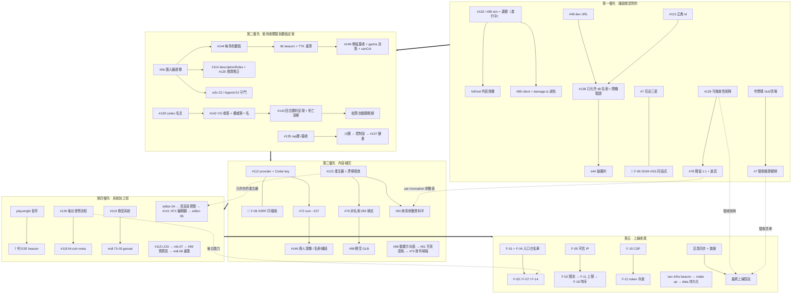

# GGD 執行批次計畫（TODO Batch Execution Plan）

> 這不是流水帳，也不是進度日誌。這是「接下來照這個順序做」的批次作戰表。
> 生成日期 2026-07-23 · 來源：任務帳本 + `docs/_requirements-audit-gaps.md` + `docs/todo/*.md`（69 檔）+ 程式碼 stub 掃描（原始 173 筆，去重後約 90 列）

## 開頭說明 — 怎麼用這份檔案

1. **這份檔案取代「從頭讀 gap-log」的規劃動作。** `docs/_requirements-audit-gaps.md` 仍然是**證據帳本**（誰報的、哪一行、當時怎麼判斷），但它是按時間長出來的，不能拿來排工。要決定「現在做什麼」請只看這裡；要確認「這件事為什麼存在」再回去查證據欄指的那一行。
2. **一列 = 一件真正要做的事。** 同一件事在 ledger / gap-log / todo-doc / 程式碼裡有四種寫法的，已經合併成一列，證據欄保留最有指向性的那一個。
3. **相依規則（本檔最重要的約束）**：有先後相依的工作**一律放在同一批**，批內由上而下排序，並在相依欄標 `→ 需先做 X`。唯一的例外是兩個**正在飛行中**的任務（第一批最上面兩列）：它們會在第一批期間落地，後面批次才引用其成果。
4. **規模**：S ≤ 半天 · M ≈ 1–2 天 · L ≈ 3–5 天 · XL = 需要自己開一個 wave。
5. 每批做完，回寫 `docs/_requirements-audit-gaps.md` + `docs/requirements-status.md` + hit-feel 稽核頁（滾動紀錄紀律）。

### ⚠️ 不要重做（帳沒關，但工作已完成或只剩驗證）

| 帳本編號 | 真實狀態 |
|---|---|
| #123 | 8 種 primitive 函式庫**已建好並有測試**；只剩「產生器 + 漂移檢查」（見 B3-08） |
| #148 | 商人提示輪播**已完成**（`merchantTips.ts` 12 則 + `MerchantTipBox.tsx` 5s 輪替）。帳本與 gap-log 的 #147/#148 編號互換，真正未做的是**戰鬥打擊感 VFX**（B2-17） |
| #124 | 下課鐘 BGM 方向**已被使用者否決並整軌改寫成 city-pop**，無工作殘留，只要關帳 |
| #144 | 移動速度**已匯入且分佈真實**（18 級距、2.5→6.1）；剩 `baseAttackTime` 未填 + 回復值是否匯入要使用者拍板 |
| #149 | 增幅池**已補到 21 張**（銀6/金8/稜彩7）；剩「真的能翻盤嗎」的實戰簽收 |
| #108 / #83 | 稽核與資料修正**都已落地**；各自只剩一支回歸守門測試 |
| #131 | 卡住的白色爆點**根因已修**（NaN pos 不再觸發 composer）；只剩實機確認 |
| #100 | 已加上 gating；只剩實機在真正僵局回合確認 |

---

## 第一優先 — 讓遊戲「是對的」

> 為什麼在這裡：這批全部是**現在按下去會壞、或剛修完還沒被眼睛看過**的東西。包含兩個飛行中任務的落地、四條「產生端已上線、消費端從來沒接」的一行接線、以及擋住使用者手動測試的 48 名冊實機驗證。做完這批，才有資格談「好不好玩」。
> 解鎖：可信的實機測試環境（第二批全部的手感調校都建立在這上面）。

| id | 標題 | 為什麼 | 相依 | 規模 | 證據 | 使用者要求 |
|---|---|---|---|---|---|---|
| B1-01 | **【進行中】** #133 EX 打擊感 + counter-hit + #89 守護者傷害減免（sim） | 兩個 agent 正在跑，其產出是本批後半與第二批的地基 | — | M | in-flight | ✅ |
| B1-02 | **【進行中】** 方向性運鏡 kick + EX punch-in（client） | 同上，client 側對應 | — | M | in-flight | ✅ |
| B1-03 | `content:validate` 紅燈（索引漂移） | 紅燈會遮住後面每一個真實的內容回歸，任何 content-shaped 工作排進來之前必須先綠 | — | S | `docs/todo/name-voice.md:247` | ❌ |
| B1-04 | 戰鬥生命週期實機複驗（火圈真僵局 / #100 gating / #164 傷害數字顏色 / #166 被動虛線框 / #131 白爆點） | 這五件的程式與測試都綠了，但**沒有一件被眼睛看過**；它們是整個戰鬥波的信任基礎 | — | S | `_requirements-audit-gaps.md:275`、`docs/todo/ability-vfx.md:60` | ✅ |
| B1-05 | #145 每回合換場：刪掉三個不存在的協定欄位分支，改讀 `state.mapId` 並實機確認換場 | `arenaSelect.ts` 分支在 `roundArenaId/roundMapId/arenaId` 上，協定只有 `mapId`；但 server 早就用 mapId 廣播且 client 已接 → 這是**清理 + 驗證**，不是重建 | — | S | `apps/client/src/render/arenaSelect.ts:23-29`、`GameApp.ts:732` | ✅ |
| B1-06 | 戰鬥低階音效自動接線（`audioSystem.playSfx(ev.type)` 一行進 `GameApp.frame()` 的 EVENT drain） | damage / basicAttackHit / projectileHit… 素材、音池、增益全在，引擎也會播，**就是沒人觸發** — 現在打擊近乎無聲 | — | S | `docs/todo/audio.md:143` | ❌ |
| B1-07 | 狀態光環解碼接線（`vfx.statusFx.set(es.id, es.flags, x, z, now)` 一行） | 暈眩/定身/緩速/衝刺的 bitmask 從協定寫好那天就在線上飛，client **從來沒讀過**；CC 目前完全看不見。順帶白送衝刺揚塵 | — | S | `apps/client/src/vfx/VfxSystem.ts:364,398`、`snapshot.ts:210-216` | ✅ |
| B1-08 | #77 / mdl-150d：`GameApp.modelOverrideFor` 讀 `_standin-overrides.json` | 使用者報的「小叮噹應該是 0.6 倍的藍色貓」在**單元測試全綠的情況下畫面上依然沒修**，因為例外表沒被載入。同一個 composition root 一步接線 | — | S | `docs/todo/models.md:71`、`_requirements-audit-gaps.md:202` | ✅ |
| B1-09 | 花朵可玩性三連：`prop.flower` 索引缺漏複驗 → `enemyUnitsFor` 放寬讓玩家點得到花 → **解鎖 `WorldAnchorLayer.makeChampionNode`**（血條中立色） | #7 的可見表面。花在 server 端早就能被打，client 卻選不到目標；血條還是金色 | — | S | `docs/todo/flowers.md:37,48,60` | ✅ |
| B1-10 | 🔀 sec-154-06：`makeChampionNode` 改用 `textContent` + `element.style`，不再字串拼 HTML（DOM-XSS F-06） | **跨主題但必須同批**：與 B1-09 是同一個函式，一次開檔兩處改；分批會撞檔或改兩次。也是唯一一個 high 等級的 client 安全洞 | → 與 B1-09 同時 | S | `docs/todo/security.md:34` | ❌ |
| B1-11 | #48 dev platform-URL fallback（窄範圍 dev 連線縫） | 它本身很小，但它**擋住 B1-13 的實機開機驗證** | — | S | `_requirements-audit-gaps.md:273` | ❌ |
| B1-12 | #113 選定正典 champion id、排除測試分身（14 對 / ~20 個），並向使用者確認「要不要實體刪除」 | 名冊、icon 批次、VFX 綁定全部建立在「哪 48 個是真的」上面。調查已完成，剩選定 + 一個使用者決策 | — | M | `docs/_champion-dedup-113.md`、`docs/todo/champion-identity.md:74` | ✅ |
| B1-13 | #138 遊戲內硬性只允許 48 名冊 + 完整堆疊開機截圖驗證（同一次開機一併驗 #44） | 使用者**目前無法手動測試**就卡在這裡 | → 需先做 B1-11、B1-12 | M | `_requirements-audit-gaps.md:152,179` | ✅ |
| B1-14 | #44 戰鬥 HUD 常駐裝備列（6 格、不可重複、沿用 #140 詳細 tooltip） | 使用者特別交代「別忘了」；目前只有休息時商店看得到裝備，打到一半看不到自己的 build | → 與 B1-13 同一次開機驗證 | M | `_requirements-audit-gaps.md:156` | ✅ |
| B1-15 | #128 技能可施放性全掃（含遠程 vs 近戰的操作差異：指定 / 地面 / skillshot），產出 pass/fail 覆蓋矩陣 | #78 查數值、#79 查特效，**沒有一項在查「按下 Q 真的會放」**。這是最後一個真正缺失的掃描需求 | — | L | `_requirements-audit-gaps.md:13,197`、`docs/_castability-128.md` | ✅ |
| B1-16 | #78 殘留 1:1 還原：~22 個 `perRank [1,1,1]` / coeff 0.003 的技能 + ~17 名角色 + **道具 1:1**。順帶產出兩份資料：(a) `rootWhileCasting` 政策 (b) per-invocation 特效參數表（供 B3-11 消費） | 「大絕造成 1 點傷害」是硬錯誤。commit 0c47fce 宣稱收工但 07-23 複審仍抓到；道具 1:1 完全沒被 commit 提及 | → 接在 B1-15 的矩陣之後（同一份 JASS 對照） | XL | `_requirements-audit-gaps.md:24,266`、`content/abilities/godie-o02v.r.json` | ✅ |
| B1-17 | hitFeel 內容授權（per-champion / per-ability 10 個旋鈕，目前 content 內 0 筆） | #133 的機制落地了，但每一次命中都還在吃「由傷害推導」的預設值 —「每個技能手感不同」的真正兌現在這裡 | → 需先做 B1-01（進行中） | L | `packages/shared/src/content/schema/ability.ts:20-43`（content 全域 grep 0 命中） | ✅ |
| B1-18 | #89 守護者 client 接線（HUD / 選取 / AI）+ `combat/damage.ts` 的護甲/魔抗、`maxHitPctMaxHp` 上限、`vsStructure` 攻城係數 | 欄位早就掛在 `StructureComp` 上，但 `damage.ts` 沒讀 → 守護者像花一樣吃全額傷害，「給攻城型英雄一個角色」的設計意圖歸零 | → 需先做 B1-01（sim 側減免正在飛行） | M | `docs/todo/guardian.md:16` | ✅ |
| B1-19 | 單人作弊碼：零冷卻 + 清場重開 | **要在 B1-20 之前**：這兩碼是手測冷卻與回合重置最快的工具 | — | S | `docs/requirements-status.md:206` | ✅ |
| B1-20 | #7 驗收細節總掃：#93 煙火 6 項 / #75 龍吼 8 項 / #3 Capcom 手感 4 項 / #90 復活不重複賞金 / #82 雙公式模擬 + 無 ImpactProfile 命中要不要補反應 | 這五件在摘要層被標完成，但**子細節可能被吃掉**；只能用眼睛逐項看，不能 grep | → 需先做 B1-19（作弊碼加速手測） | M | `_requirements-audit-gaps.md:70,124`、`EntityViewRegistry.ts:279-281` | ✅ |

---

## 第二優先 — 使用者指名的體驗與數值定案

> 為什麼在這裡：全部是使用者親口提過的體感問題（走速一樣、回合太長、增幅翻不了盤、手機橫向疊在一起、回合結束不知道誰贏、BGM 要重寫）。同時把 **匯入器 → 每角色數值 → TTK → 增幅簽收** 這條數值鏈整條做完，因為它們互相會把對方的結論推翻，分批做等於白做。
> 解鎖：數值凍結。第三批的內容量產（icon / VFX / VO）才不會建立在會被改動的數值上。

| id | 標題 | 為什麼 | 相依 | 規模 | 證據 | 使用者要求 |
|---|---|---|---|---|---|---|
| B2-01 | #56 匯入器 w3u 欄位透傳：確認 rawMods 到底留住哪些欄位，然後重跑 | 這是本批一半列的上游；`umvs` / 攻擊冷卻+後搖 / `uhpr` / `umpr` / `descriptionRoles` 全從這裡出來 | — | M | `_requirements-audit-gaps.md:164,188` | ❌ |
| B2-02 | #144 每角色 w3x 數值：`baseAttackTime` 補進 113 份角色文件（目前全部吃 1.0s 預設）；移動速度已落地需複驗；**回復值是否匯入需使用者拍板**（原始 uhpr/umpr 被 WC3 預設值汙染，硬匯入反而會壓平） | 使用者：「每個角色走路速度應該不一樣」。消費端 `BasicAttackSystem` 早就寫好 fallback，純內容填充 | → 需先做 B2-01 | L | `BasicAttackSystem.ts:135`、`docs/todo/w3x-import.md:33` | ✅ |
| B2-03 | ttk-sim 套件掛上 beacon（ttk-01..04）並在 #144 落地後**重測** TTK | #153 的結論（TTK ≈ 13.8×maxHealth−4，maxHealth ≈ 13.3 兩個目標都達標）是在攻速還沒差異化前量的；攻速一改，回合長度就位移 | → 需先做 B2-02 | S | `docs/todo/ttk-tuning.md:30`、`docs/_ttk-experiment-153.md` | ✅ |
| B2-04 | #149 增幅池戰力簽收（「要能翻盤」）+ 武器抽牌強度檢查 + **決定每回合道具 gacha 要開還是刪**（`arena-rules.json` 沒有 `gacha` 區塊 → 程式碼預設被文件關掉，`round-reward.json` 目前是孤兒） | 內容已補齊，剩「在現在的 4×HP / 0.25 冷卻尺度下真的會翻盤嗎」的實戰簽收；獎勵密度要跟 gacha 一起調一次 | → 需先做 B2-03（HP 尺度定案） | M | `docs/todo/economy.md:118`、`apps/game-server/src/match/arenaRules.ts:96` | ✅ |
| B2-05 | `canCrit` 政策拍板並授權（目前沒有任何技能傷害開啟暴擊） | 暴擊模型與暴擊火花分級都在，但沒有內容 opt-in → 暴擊裝備只影響普攻。小改動、真實平衡影響 | → 與 B2-04 同一次平衡拍板 | S | `effectRunner.ts:35`（content grep 0 命中） | ❌ |
| B2-06 | #114 匯入器輸出 `descriptionRoles`（w3x `\|cAARRGGBB` → 角色分類）**並在同一個 change 內修 #125 的 rescale 衝突** | 讀取端三處都寫好了但沒有一份內容帶標記 → 所有 tooltip 都是死白字。且 `[/c]` 會插進數字與「傷害」之間，**一旦內容有標記，displayFinal 數值換算會靜默失效** | → 需先做 B2-01；兩件必須同一個 commit | M | `abilityText.ts:47-52,255-262`、`_requirements-audit-gaps.md:255,256` | ❌ |
| B2-07 | 兩支守門測試：w3x-22（沒有道具能出貨重複 modifier 區塊）+ legend-01（傳說道具說明 ⇔ 數值） | #83 / #108 的資料與稽核都修完了，只欠回歸網；同一種形狀一次做完 | → 需先做 B2-01（守的是匯入器輸出） | S | `docs/todo/w3x-import.md:32`、`docs/todo/economy.md:104` | ✅ |
| B2-08 | #152 QWER/EX 上的技能名（桌面版被 w3x icon 蓋掉）+ **長按預覽**：按住浮出說明並在地面畫出射程/範圍虛線指示，放開即施放 | 使用者要求，全平台。接 `render/AimIndicator.ts` | — | M | `AbilityBar.tsx:172,177`、`_requirements-audit-gaps.md:204,257` | ✅ |
| B2-09 | #151 iPhone 橫向選單重疊 + #107 安全區最後兩個硬編碼（Leave 按鈕、小地圖差 4px）+ mobile-15 真機一次跑完 | 戰鬥強制橫向 → 這是玩家實際待著的方向，目前整個疊在一起。三件同一個佈局表面、同一場真機 session | 三件同批同時 | M | `_requirements-audit-gaps.md:203`、`hudLayout.ts:272,376`、`docs/todo/mobile.md:41` | ✅ |
| B2-10 | 登入場景一次過：uiHover/uiClick/uiType/dragonRoar 觸發接線 → 逐字打字火花視覺 → #74 登入→戰鬥交接（龍吼淡出到載入條）→（選配）AudioSystem 開 AnalyserNode 讓魔法陣隨音樂呼吸 | 素材、audio-map、事件名全在，缺的是 `AuthScreen` 那幾個 handler；四件同一個檔案表面 | 批內依序 | M | `docs/todo/audio.md:169`、`docs/requirements-status.md:205`、`docs/todo/login-scene.md:44` | ✅ |
| B2-11 | 選角畫面收尾：#41 hover 呼叫語、#76 角色檔案、#139 **Codex 英雄頁顯示名言**（113 句都已在 `champions.csv`） | 使用者明確要求名言要在 codex 看得到；三件同一個畫面 | — | M | `_requirements-audit-gaps.md:154,157` | ✅ |
| B2-12 | #142 名言 VO 收尾：(a) audition 頁加「英雄名言」區（頭像 + 全名 + 日/中文 + `<audio>`）(b) 回合結束第一名改為 **server 權威計算並廣播**（目前是 client 從共享 schema 推導） | 113 支語音都已算圖並接上三個播放時機；剩這兩個殘留。(b) 需要使用者決定要不要真 MVP | → 需先做 B2-11 | M | `_requirements-audit-gaps.md:160,161` | ✅ |
| B2-13 | #143 回合勝利呈現：贏家 3D 模型置中 + 名言 VO + **死亡溶解**（目前身體只是隱藏）+ #85 死亡觀戰去飽和 + 順手安置孤兒音效 `matchEndGong` / `vsReveal` | LAN 實測：回合結束只有聲音，玩家根本看不到誰贏 | → 需先做 B2-12（VO 的權威第一名） | M | `_requirements-audit-gaps.md:187,258`、`docs/todo/particles.md:72` | ✅ |
| B2-14 | 結算 → 戰績自動跳轉（目前是按鈕） | 使用者要的是**自動**轉場；就在 #143 要編輯的同一個 `MatchEndPanel` | → 與 B2-13 同一個面板 | S | `docs/requirements-status.md:204` | ✅ |
| B2-15 | BGM 波（bgm-gen 序列化，全部要 audition 簽收）：#135 rap/VO 層預設關掉 + 使用者簽收 → 火圈 intro 重寫（遠方空襲警報 + 嘲諷中文 rap → 爆炸，crescendo 縮短）→ 控制室整軌改寫（教堂/福音、神父 rap intro、中段嘲諷 rap）→ #137 每場景 Samantha James 風變奏曲（12 首 + 輪替 + audition 擴到 24） | 全部使用者指名；bgm-gen 只能一次跑一個，所以是一條硬序列 | 批內依序，全部 → 需先做 #135 簽收 | L | `_requirements-audit-gaps.md:144,158,159,162,163,206` | ✅ |
| B2-16 | 血腥風格/強度設定列進 `SettingsScreen.tsx` | store 欄位、夾限、持久化、per-champion 覆寫、即時傳播全部做完並測過，**只差一個 UI 控制項** → 玩家現在關不掉血 | — | S | `docs/todo/particles.md:74` | ❌ |
| B2-17 | #147 戰鬥打擊感 VFX：blob 影子、走路揚塵、施法地面印記、命中閃光火花、噴血（使用者：火花與血最重要） | 使用者列的五個缺失視覺。primitive 函式庫已存在，**不需要等 B3 的產生器** | — | L | `_requirements-audit-gaps.md:198` | ✅ |
| B2-18 | vtint-07 增益染色的 sim 半：暫時性染色到期要回到 `champion.tint`，**不是回到白色** | renderer 半已完成；不做的話被增益過的角色會永久變白。要避開地圖裡兩個已知的 `erasesStaticTint` 錯誤 | — | M | `docs/todo/vertex-tint.md:78` | ❌ |
| B2-19 | #94 商店卡片靠左 | 使用者指名的版面調整 | — | S | ledger #94 | ✅ |

---

## 第三優先 — 內容補完（美術 / 特效 / 模型 / 語音）

> 為什麼在這裡：這批是**量產**，不是設計。放在數值凍結之後，是為了不要對著會變的東西畫圖；放在系統工程之前，是因為 icon 與 VFX 是使用者列為最高優先的可見缺口。
> 解鎖：遊戲「看起來完成」。這是私密社團可以開放試玩的門檻。
> ⚠️ **B3-01 需要使用者提供 Civitai API key** — 這是唯一一個外部阻塞輸入，第二批一開始就要先問，不要等排到才問。

| id | 標題 | 為什麼 | 相依 | 規模 | 證據 | 使用者要求 |
|---|---|---|---|---|---|---|
| B3-01 | #112 AI 生圖路徑：真正的根因是「沒有設定 provider」（方言早就修好）+ 使用者的 Civitai API token | 擋住 icon、商人頭像、名冊補圖、播報重算 —— 一個環境設定擋住四件事 | — | S | `_requirements-audit-gaps.md:14,123,149` | ✅ |
| B3-02 | 🔀 sec-154-08：provider 回傳的 URL 先驗證再 fetch（SSRF）— 限 https、擋 loopback/link-local/RFC1918/169.254.169.254、限定 provider 網域、絕不把 API key 送到外部主機 | **跨主題但必須同批**：改的就是 B3-01 要打開的那份 `provider.go` / `music.go`；分批等於同一段程式改兩次 | → 與 B3-01 同時 | M | `docs/todo/security.md:35` | ❌ |
| B3-03 | #72 icon 批次（重新界定為 ~227：英雄頭像 + 武器/道具 + 抽牌增幅；QWER/EX 已捨） | 使用者列為 #3 優先。兩段式管線已驗證（pass0 英文關鍵字 → pass1 text2img → pass2 img2img 風格，denoise 0.4–0.55），本機 M5 Max ≈5s/張、$0。整批前先給使用者看 contact sheet | → 需先做 B3-01 | L | `_requirements-audit-gaps.md:14,89,149,150`、`docs/todo/icons.md:154` | ✅ |
| B3-04 | #146 旅行商人頭像 PNG（`assets/icons/shop/traveling-merchant.png` 路徑有、檔案沒有，目前 404 退化成字母 glyph） | 版面已做完並有測試，只缺這張圖 | → 需先做 B3-03（同一條管線） | S | `layout.ts:88`、`MerchantTipBox.tsx:80` | ✅ |
| B3-05 | 名冊首發缺件回填：妙蛙花 `godie-h02r` 沒有頭像、魔人普烏 `godie-huth` EX 說明是空的 | 為了讓 48 名能先出貨，G2-G6 的 icon/文案閘門被拿掉了 —— 這是刻意留的洞，icon 一到就補 | → 需先做 B3-03 | S | `apps/platform/internal/curation/starter.go:78,97` | ❌ |
| B3-06 | ident-11 重抽 9 張錯配頭像（曹操孟德掛著皮卡丘的圖、志志雄掛著初音的） | 現在選角畫面與登入跑馬燈上看得到。修法自我驗證：修好會讓 `SHARED_PORTRAIT_GROUPS` 表縮小、測試逼你刪掉過期項 | — | M | `docs/todo/champion-identity.md:64` | ❌ |
| B3-07 | ai-editor-01/02/03 測試覆蓋（AI icon 面板 / AI 填空 / stub 狀態呈現）— 先釐清 `editor.md` 標完成而 `ai.md` 標 pending 的矛盾，別重建 | 真實生成本來就卡在 B3-01；一起做 | → 需先做 B3-01 | M | `docs/todo/ai.md:102` | ❌ |
| B3-08 | #123 讓 `render/vfx` 模組成為 95 份 `fx.prim.*.json` 的**建置期真理來源**：`curatedDocs()` 加 CLI/npm script + 漂移檢查測試（先確認函式庫確實已建好，別重做） | 目前執行期與 `content:build` **都沒有任何東西 import** 那個模組 → 模組與已出貨文件會靜默分歧。這是相信 #79/#98/#50 的前提 | — | M | `bindings.ts:188`、`_requirements-audit-gaps.md:20,253` | ✅ |
| B3-09 | #79 非名冊技能 VFX 綁定（285 份文件還指著共用的火焰 placeholder `fx.ember-bolt-cast`） | 48 名冊的 240 個技能已重綁（依文潔琳的冰藍是使用者的驗收案例）；剩下是機械式量產，模式已存在 | → 需先做 B3-08 | L | `docs/todo/ability-vfx.md:8`、`_requirements-audit-gaps.md:270` | ✅ |
| B3-10 | #98 零幾何特效模型：非名冊引用改指原生 primitive，然後**把 11 個空 GLB 從模型預算刪掉** | 名冊範圍已解決；剩非名冊引用，跟著 B3-09 幾乎白送 | → 需先做 B3-09 | M | `docs/todo/ability-vfx.md:52` | ✅ |
| B3-11 | #50 per-invocation 美術參數的**資料半**：把地圖 dummy-effect / special-effect 呼叫點的真實 scale/tint/alpha/count/timeScale 綁上去 | `artParams.ts` 的轉換與測試都在，缺的是值。輸入資料由 **B1-16 的 JASS 重稽核一併抽出**，到這一批已是既有產物 | → 需先做 B3-08 | L | `docs/todo/ability-vfx.md:24`、`docs/todo/vertex-tint.md:66` | ✅ |
| B3-12 | mdx→vfx 匯入器輸出 `spriteSheet`（WC3 翻頁動畫粒子；目前 1400+ 份文件 0 命中） | #30 把動畫貼圖路徑蓋好了卻沒人用 → 每顆粒子都是靜態圖。跟 B3-10 的空發射器同源 | → 需先做 B3-08 | M | `particleFactory.ts:129-144,244` | ❌ |
| B3-13 | 模型稽核波：#68 每角色 × 每片段動畫方向 pass/fail 表（血輪眼左助飛行、皮卡丘 idle 翻轉、桔梗 walk 錯）→ #61 補回遺失的可見度軌/幾何（不重跑轉檔）→ #73 掃全角色缺件掛件（悟空沒頭那一類）+ 蝗蟲群模型合併 | 使用者要求「認真檢查每一個模型與每一個動畫」，交付物是表，讓使用者不用自己一個個看 | 批內依序（同一批模型開檔） | XL | `_requirements-audit-gaps.md:15,16,18,19,90-93` | ✅ |
| B3-14 | #105 守護者每場地身份：5 種模型臉（`guardian_beast.glb` / `guardian_treant_*.glb` 已在磁碟上，程式碼卻硬編 `prop.guardian`） | 機制早就完整接好，這純粹是模型身份 + 每場地文件；接縫在 `spawnGuardian`，B1 的 sim 波過後很乾淨 | — | M | `GuardianSystem.ts:50`、`_requirements-audit-gaps.md:267` | ❌ |
| B3-15 | #108 傳說道具池內容 → 名冊出裝階梯回填（≥4 階；目前多數只有 2 件） | 稽核已證明沒有內容缺陷，這是把出裝梯子補厚，直接影響 bot 品質與商店推薦 | 批內依序 | M | `starter.go:93,204`、`_requirements-audit-gaps.md:164,265` | ❌ |
| B3-16 | #81 / #116 暴雪素材債：替換 129 個 imported GLB 與相關素材 | 這是版權層的**永久解**（B5 的環境分層只是把它擋住不出貨） | — | XL | `docs/asset-debt.md`、`_requirements-audit-gaps.md:211` | ✅ |
| B3-17 | 商人人格一次過：merchant VO（**需要自己的音源** — 効果音ラボ 授權禁止重剪）+ 提示語/頭像文案微調 | 店員會比手勢但是啞的；跟 B3-04 頭像同一個角色 pass | — | M | `docs/todo/intermission.md:195` | ❌ |
| B3-18 | 非名冊語音補完：#139 的 46 句非名冊名言 + 97 名角色**完全沒有選角語音池**（`source:"none"`） | 地圖裡沒有他們的台詞、暴雪音組不能散佈 → 需要**錄製/生成的授權音源**，不是程式改動。刻意延到那些角色進名冊時才做，但要一起估 | — | XL | `docs/todo/champion-voices.md:73`、`_requirements-audit-gaps.md:157` | ❌ |
| B3-19 | 男聲名言 VO：在有乾淨日文男聲的機器上重跑 `build-champ-quotes`，並讓解析器在沒有男聲時**大聲失敗**（目前靜默退回 Kyoko） | 使用者要的是性別正確的日文 VO。這是機器設定 + 重跑，不是程式；但 fragility 要一起補 | — | S | `docs/todo/name-voice.md:244`、`_requirements-audit-gaps.md:271` | ✅ |
| B3-20 | 播報 + 角色名語音改用真實雲端 TTS 重算（目前全是 Apple TTS 佔位） | manifest 相同、`.mp3.hash` sidecar 讓重跑冪等且順便當存檔完整性檢查 | → 需先做 B3-01 | M | `docs/todo/announcer-vo.md:103` | ❌ |
| B3-21 | role-backfill：把提案的 `role` 寫回 111 份角色文件（30 份信心不足，需人工爭論具體幾行） | 分類器是唯讀的，六種真實角色目前只存在於報告裡，選角畫面還顯示舊分類 | — | M | `docs/todo/role-taxonomy.md:54` | ❌ |

---

## 第四優先 — 系統與工程

> 為什麼在這裡：這批不改變「遊戲現在好不好玩」，但決定「以後改動會不會壞」以及「還能長多大」。放在內容之後，因為多數項目需要內容已定型（E2E 要有穩定畫面才錄得起來、LOD 要有最終模型才有意義）。
> 解鎖：可回歸、可擴充、可營運（meta 進度 + 後台）。

| id | 標題 | 為什麼 | 相依 | 規模 | 證據 | 使用者要求 |
|---|---|---|---|---|---|---|
| B4-01 | 建起 `playwright-e2e` 套件本體 | **總開關**：五份文件裡七列 E2E 全部寫著「已手動驗過，等 Playwright beacon」。做一次解鎖全部 | — | L | `docs/todo/web-ui.md:28`、`tools/testrunner/suites.yaml` | ❌ |
| B4-02 | E2E 補齊：webui-11/12（雙帳號註冊→好友→房間→準備→開賽；買+裝外觀換模型）、client-09/10（進場→移動→施法→結果；斷線寬限重連）、couch-16（雙手把分割畫面）、roster-08（匯入角色 GLB 轉向平順）、rankui-11（雙排行榜對真 API；另需 #37 後端已部署） | 除了 client-10 重連寬限之外全部手動驗過，缺的是自動 beacon；client-10 視為**真的未證明** | → 需先做 B4-01 | M | `client-hud.md:16`、`couch-play.md:35`、`client-roster.md:15`、`ranking-ui.md:43` | ❌ |
| B4-03 | col-11 碰撞 server/client replay 一致 + sim-07 固定系統順序對齊預測回放 | 預測正確性壓在這上面；sim 這半年多了好幾個排序槽（flowers 在 deathSystem 之後、guardian 在 9d），現在值得釘死 | 兩件同批 | M | `docs/todo/collision.md:18`、`docs/todo/sim-determinism.md:14` | ❌ |
| B4-04 | content-07 `contentVersion` 不符時拒絕加入 + content-10 `?h=` immutable 快取標頭 | 一個是防呆閘門、一個是純效能，兩件都在 content mount 這條路上 | — | M | `docs/todo/content-pipeline.md:14,17` | ❌ |
| B4-05 | #63 場景範圍延遲載入擴到**模型與語音**（SFX 半已完成，`AssetManager` 沒有 per-scene warm set）— 先確認 #158 已涵蓋多少 | 使用者：「只載入戰鬥必要素材，而非 always 全載入」 | — | M | `_requirements-audit-gaps.md:27,37`、`docs/requirements-status.md:198` | ✅ |
| B4-06 | #119 變身/換型系統（每回合回到基礎型、計時自動還原）→ 接著解決 mdl-73-03 那批被保守留下的 geoset（heroichigo 的 TRANSFORM-BODY 正是 #119 的模型半） | sim 完全沒有這套（唯一 grep 命中是測試裡的假角色名）。先做 #119 設計，那些 geoset 就從死重量變成受控內容 | 批內依序 | L | `_requirements-audit-gaps.md:36`、`docs/todo/models.md:84` | ✅ |
| B4-07 | 模型工程：#115 LOD（`tools/lod-gen` 目前是空殼，全 repo 0 命中）→ mb-07 骨架感知幾何簡化 + 綁定存活驗證；#99 資產預算頁（三角數/貼圖/使用處，依慣例做成**執行期計算的站內活頁**）；mdl-06 把 +90° 基準旋轉烘進匯出器並重匯 | LOD 帳本說 in-progress，程式碼裡什麼都沒有。重匯出只做一次 —— mdl-06 要跟 B4-06 的 geoset 一起烘 | 批內依序 | XL | `docs/todo/model-budget.md:47`、`docs/todo/models.md:36`、`_requirements-audit-gaps.md:21` | ✅ |
| B4-08 | #126 **產品面**：後台 M-coin 發放流程 + 私密 FB 社團分發流程 | 不是安全硬化（那在第五批），是 #118 的前置能力 | — | M | `_requirements-audit-gaps.md:109,244` | ✅ |
| B4-09 | #118 M-coin / 水晶 meta 進度：貨幣、英雄解鎖（20 場）、最愛置頂、後台發幣 | 兩個「完全沒有程式碼」的缺口之一。因 #126 決定不接金流而大幅簡化 | → 需先做 B4-08 | XL | `_requirements-audit-gaps.md:35,109` | ✅ |
| B4-10 | #102 後台整併：比賽詳情 drill-in（`getMatch()` 有 API 無呼叫者）、一鍵套用 starter set（`applyStarterSet()` 同樣孤兒）、**並驗收 #133 的 hitFeel 倍率能在後台即時調** | 使用者的「localhost = 管理者可以編輯一切」；codex 編輯器與 AI 填空已完成，缺 CRUD 與這個驗收點 | — | M | `_requirements-audit-gaps.md:17,173`、`apps/admin/src/api.ts:90,179` | ✅ |
| B4-11 | 編輯器波：editor-04 RefSelect 選項來自目標集合索引 → editor-05/content-11 BabylonPreview 走**真渲染器**而非 mock → #141 站內 VFX 編輯器 Tier-1 MVP（`fx-compose@1`、1–3 層 primitive、5 個核心旋鈕、錨點+時序、dummy 施法循環預覽、走 #96 codex 存檔路徑）→ editor-06 地圖/場地編輯器（2D 正交擺放 + 3D 走查）+ capi-07 chokidar 把外部檔案編輯用 SSE 推出去 | 使用者：「要開放協作者編輯，打 JSON 太慢」。安全論證：VFX 純呈現，不動決定性 sim。治理面（貢獻者角色、送審→策展發布、內容版本）已設計未實作 | 批內依序 | L | `docs/todo/editor.md:15,16,17`、`docs/design/vfx-editor-and-collaboration.md`、`docs/todo/content-api.md:16` | ✅ |
| B4-12 | 決定 `recall` 指令：實作（自我傳送回泉水/商店）或**移除按鈕與手把綁定** | 螢幕上有一顆按鈕、手把有一個綁定，按下去什麼都不會發生 —— 對玩家是謊言 | — | M | `CommandSystem.ts:98-100`、`TouchControls.tsx:402` | ❌ |
| B4-13 | `useItem` 主動道具：sim 端實作 + 商店 UI 派送 | 從 intent → 驗證 → replay 過濾整條都通了，最後被 `case "useItem":` 丟棄 → 任何主動效果道具都做不出來。擋住 w3x 匯入的一整類道具 | → 建議接在 B3-15 傳說道具池之後（同一批道具語意） | L | `CommandSystem.ts:99-100`、`intents.ts:35` | ❌ |
| B4-14 | 沙發同樂債一次還：guest seat 接線（server 要接受單 token 多席）或**刪掉永久 disabled 的輸入框**；分割畫面每視窗商店卡；HUD/語音「只有主要本地席」的假設 | `RoomListPanel` 的人數輸入被 `min=1 max=1` 鎖死，helper 只有測試在用 —— 永久停用的控制項讀起來像 bug | 批內依序 | L | `couch.ts:8,13,22`、`RoomListPanel.tsx:75-83`、`docs/todo/intermission.md:198` | ❌ |
| B4-15 | `removeFriend()` 的 UI（端點與型別 client 都在，只差介面）| 好友加得進去刪不掉；對 #126 的好友制部署來說好友清單就是門禁面 | — | S | `apps/client/src/ui/platform/api.ts:66` | ❌ |
| B4-16 | #19 i18n chrome | 介面文字外部化，越晚做成本越高 | — | L | ledger #19 | ✅ |
| B4-17 | 從單一來源表產生 `announcer.json` + `announcer.cast.json` | 兩個檔案目前手工互相複製，avo-08 只是個一致性測試在代班；文件自己說產生器應**取代**那支測試 | — | S | `docs/todo/announcer-vo.md:97` | ❌ |

---

## 第五・最後收尾 — 上線

> 為什麼在最後：這批不改遊戲，改的是「敢不敢把網址給別人」。安全硬化排在功能凍結之後才不會被新程式碼推翻；掛名/致謝、活頁同步、最終試玩本質上是收尾動作。
> 例外：two 個安全項已被提前 —— F-06（DOM-XSS）到第一批、F-08（SSRF）到第三批，因為它們與別的工作**共用同一份檔案**，分批會改兩次。

| id | 標題 | 為什麼 | 相依 | 規模 | 證據 | 使用者要求 |
|---|---|---|---|---|---|---|
| B5-01 | sec-154-01 在入口白名單化 Colyseus INPUT（未知 kind 丟棄、slot ∈ {Q,W,E,R,EX}、itemSlot 範圍內整數、座標有限）**＋** sec-154-04 單訊息 `commands[]` 上限與每 session 速率限制 | F-01：一則訊息就能讓 `Registry.get(undefined)` 拋錯 → tick catch **把整個房間踢線**。#46 的 try/catch 不是緩解，它只是把拋錯換成全房斷線。兩件同一個 mailbox 接縫，一次改完 | 兩件同批同時 | M | `docs/todo/security.md:22,24` | ❌ |
| B5-02 | sec-154-03 `MatchRoom.onCreate` 需 server-only 證明（擋 client 房間洪水）+ sec-154-07 席位 displayName 清洗、拒絕 client 給的 `options.seats` + sec-154-14 `PLATFORM_GAME_SHARED_SECRET` 開機守門並移除 `options.accountId` fallback | F-03 在 onAuth 之前就建好 12 席 sim + 60Hz 迴圈；F-07 是 XSS 的來源端（對應第一批已修的 F-06 接收端）；F-14 是密鑰為空時**fail-OPEN**（無驗證、可偽造身份、作弊開啟） | 三件同批 | M | `docs/todo/security.md:23,25,26` | ❌ |
| B5-03 | #167 選角鎖定改為 server 權威（席位 `locked` 旗標 + snapshot bit） | 目前鎖定純 client：改造過的 client 鎖完還能換，其他席也看不到鎖定狀態 | — | M | `champselect/lockGate.ts:13-24` | ❌ |
| B5-04 | sec-154-05 `httpx.ClientIP` 走可信代理解析 → sec-154-02 註冊 per-IP 限流 + argon2 併發信號量 → sec-154-11 未核准帳號上限與 TTL 回收 → sec-154-18 註冊衝突回應統一 + 時序對齊 | 一條硬鏈：現在限流 key 信任可偽造的 `X-Real-Ip`，所以繞過邊緣直連就能無限爆破（F-05/F-13 同一根因一次修）；有了可信 IP 才談得上 F-02 的 CPU 放大保護；F-11 的無界成長**正是 #126 核准閘門造成的**；F-18 共用同一支限流器 | 批內依序 | L | `docs/todo/security.md:32,33,38,44` | ❌ |
| B5-05 | sec-154-09 http.Server 加 Read/Write/Idle timeout + MaxHeaderBytes（長連線 lobby WS 走另一條 deadline 路徑）+ sec-154-10 每帳號/每 IP lobby WS 上限與心跳回收 + sec-154-12 `?token=` 只限 WS handshake 並在 nginx log 遮罩 + sec-154-19 簽發 `aud` 並在 VerifyAccess 驗 issuer/audience | 四個獨立的平台側硬化；F-10 需要可信 IP | sec-154-10 → 需先做 B5-04 | M | `docs/todo/security.md:36,37,39,45` | ❌ |
| B5-06 | sec-154-15 真正的 CSP（default-src/script-src/object-src/base-uri，配合 Babylon 調校）→ sec-154-21 refresh token 改 httpOnly+Secure+SameSite=Strict cookie、access token 只放記憶體 | 目前 prod CSP 只有 `frame-ancestors 'none'`，零 XSS 緩解；文件明說若要保留 bearer-in-JSON，嚴格 script-src 就是硬前置 | 批內依序 | L | `docs/todo/security.md:41,47` | ❌ |
| B5-07 | sec-154-17 vite staticHandler 加 `realpathSync` 並重新檢查包含關係 + sec-154-22 補 `nosniff` + sec-infra-09/10/11 版權環境分層的 beacon（vite middleware 整合 harness + 真 nginx 容器守門 + 部署 tier） | 三件改的是同一段 vite middleware / 同一套 harness，一次開檔做完 | 同批同時 | M | `docs/todo/security.md:43,48`、`docs/todo/security-infra.md:64` | ❌ |
| B5-08 | sec-154-16 prod build 排除 audition/debug HTML（`dist/` 只出 index.html，nginx 對 model-budget.html / audition.html 回 404）| 內部除錯頁目前**打包進 prod 並公開提供**（約 20 個 innerHTML sink）。注意：`bgm-audition.html` 是使用者現役的簽收工具，排除不能弄壞本機使用 | — | S | `docs/todo/security.md:42` | ❌ |
| B5-09 | sec-154-20 本機密鑰改為 `make up` 臨時產生，或開機拒絕 `dev-insecure-*` + sec-154-23..26 四支 CI 守門（traversal、CORS 萬用字元、redis 綁定、開機密鑰） | sec-infra-06 只擋「空」密鑰，這支擋「弱」密鑰；四支守門是已驗證防線的回歸網，很便宜，一次坐下做完 | 同批同時 | S | `docs/todo/security.md:46,54` | ❌ |
| B5-10 | #127 版權分層殘留：(a) client 在 public tier **隱藏單人入口** (b) 真正的公開部署要**實體排除 129 個 imported GLB**（雲端 LB 之後 `$remote_addr` 會變成 LB 私網位址，IP 判斷不可靠） | 供應層已驗證正確，剩這兩件是明說「沒做」的 | — | M | `_requirements-audit-gaps.md:211` | ✅ |
| B5-11 | sec-infra-01..04 的 `cover()` beacon（helm 必要密鑰、`/api/v1/internal` 拒絕、NetworkPolicy、邊緣濫用限制）→ infra-01 `make up` 在 kind 叢集起完整堆疊 → infra-10 `data/` 跨重啟持久化 | 四項**都已實作並手動驗證**，卡在 beacon 需要 helm-render + 真 nginx 容器 harness；那個 harness 也是 B5-07 要的。`make up` 押在 sec-infra-01 讓密鑰產生 fail-fast 之後 | 批內依序 | L | `docs/todo/security-infra.md:21`、`docs/todo/infra.md:30,39` | ❌ |
| B5-12 | infra-04 WS upgrade 代理長逾時的自動證明 + infra-08 Redis 清空後平台從 `data/` JSON 重建 + infra-09 密鑰只從 env 注入（需 image 層掃描） | 「data/ JSON 是真理、Redis 可重建」整個儲存慣例壓在 infra-08 上；nginx 那兩件設定已就位，缺自動證明 | — | M | `docs/todo/infra.md:33,37,38` | ❌ |
| B5-13 | #13 致謝 / 出處標註頁 | 上線必需（素材出處、TTS、字體、原地圖作者） | — | M | ledger #13 | ✅ |
| B5-14 | 三張活頁同步 + 狀態漂移對帳：重跑 `gen_status.py` 並把 TASKS 補到 #171、`requirements-status.md` 目前停在 #128 且數字是錯的、關掉 #124/#148 兩列、修正 #79/#89/#98/#121/#123 三方不一致（**以 gap-log 為準**）、補寫七份從未撰寫的 todo 檔（champions/items/augments/map-editor/vfx-editor/model-inspector/ai-bots） | 使用者的滾動紀錄紀律；現在每一次讀 `requirements-status.md` 做規劃的人都在讀小說。專案慣例：這三張應該做成**執行期計算的站內活頁**，不是靜態文件 | — | M | `docs/requirements-status.md:3,240`、`_requirements-audit-gaps.md:182,277`、`docs/todo/_index.md:77` | ✅ |
| B5-15 | 最終上線試玩：完整堆疊 + 真機 + 多人一場打完，對照第一批的可施放性矩陣與驗收清單逐項簽收 | 上線閘門。不是「再玩一次」，是拿著矩陣簽名 | → 需先做 B1-15、B1-20 的產出 | M | 本檔 | ✅ |

---

## 批次相依圖

> 說明：依相依規則，**沒有任何一條未完成工作的相依鏈被切開**。批次之間只有兩種關係：(1) 時間順序，(2) 前批產出的**資料/能力**被後批消費（虛線）。橘色節點是兩個為了避免同檔案改兩次而**跨主題提前**的安全項。

