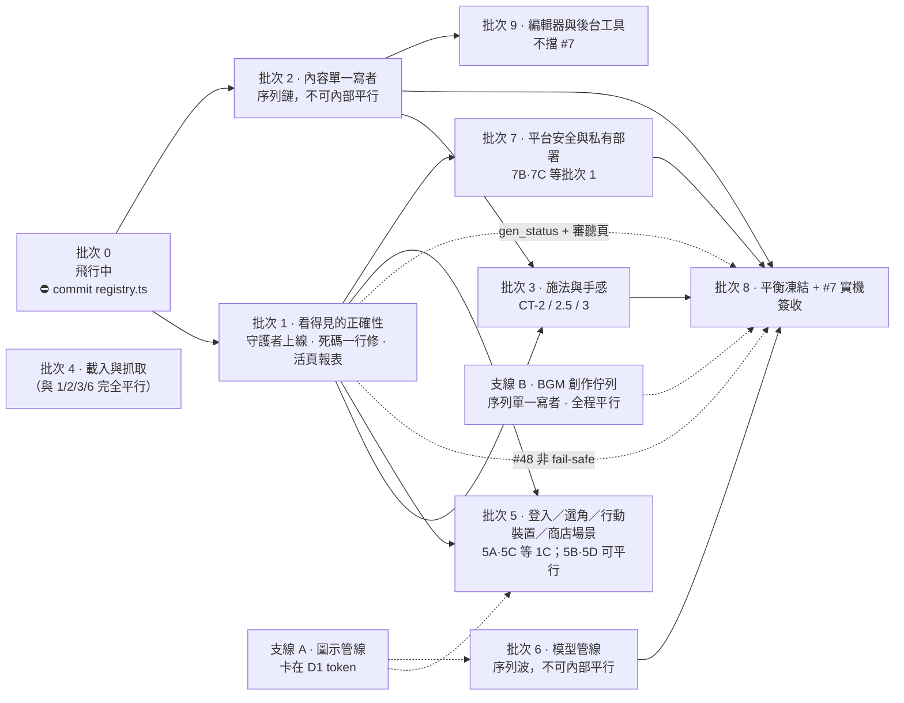

# GGD 執行批次計畫（Execution Batches）

> 已完成、無相依的歷史紀錄已移至 docs/_execution-batches-history-20260725.md

> 這不是進度日誌，也不是流水帳。這是一張**照這個順序交辦下去**的作戰表。

---

## 🔴 醒來先看這一條 · #239 版權閘在拓樸上就全開了

**我親自用匿名 curl 驗證過，不是推論。** 對正式站台，沒有 cookie、沒有 token、沒有邀請碼、沒有經過審核：

```
https://ggd.adms.ai/content/assets/models/imported/1hswd-01.glb          → 200, 42,756 bytes
https://ggd.adms.ai/content/assets/models/imported/aquaspikeversion2.glb → 200, 32,064 bytes
https://ggd.adms.ai/content/assets/models/imported/awing.glb             → 200, 20,540 bytes
```

nginx **有**擋這條路徑的規則（`nginx/nginx.conf:365-366`），它沒生效。**根因是拓樸**：正式環境是 Caddy → `reverse_proxy edge:8080` 走 compose 內網，所以 nginx 看到的 `$remote_addr` 是 Caddy 容器的 IP（Docker 預設池 172.17–172.31），落在 `172.16.0.0/12 lan`。於是每一個從網際網路進來的請求都被分類成 `lan`，`$ggd_deny_copyright` 恆為 0。**這跟 nginx/tier/family 有沒有掛載無關 —— 把 family tier 拿掉也關不回去。**

**範圍比第一時間的稽核說法窄**：`blizzard-local/` 在正式 edge 容器裡只有一個 README.md，87MB 的 Blizzard overlay 並沒有掛進去、該路徑回 404。所以外流的**不是** Blizzard MPQ 素材，是從 w3x 抽出來的 **129 個匯入角色模型**（第三方動漫/遊戲角色）。緩解：無目錄列表、有 noindex、URL 不好猜、審查制與邀請碼仍然守住「能不能玩」。

**我今晚刻意沒修。** 這是 deploy path 的改動，real_ip / X-Forwarded-For 改錯會讓正式站所有資產請求 403、家人直接玩不了，而你在睡覺無法確認。三個方向擇一，需要你拍板：
 (a) `real_ip_header X-Forwarded-For` + `set_real_ip_from <caddy 網段>`，讓 geo 看到真來源 IP —— 最正確，但要確認 Caddy 真的送 XFF，且只信任 compose 網段以防偽造。
 (b) 把 imported 模型從 production image 裡拿掉 —— `nginx.conf:174-176` 的註解自己就寫了這才是 EXACT 的做法。要先確認缺模型時會優雅降級到體素替身（#226/#231 剛好在做）。
 (c) 對這條路徑加 session 檢查（靜態資產路由目前完全不看登入狀態）。

**同一份稽核附帶一個隱形陷阱**：`geo.conf` 的重複網段 warning 目前結果無害（last-wins，include 在 `default public;` 之後），但分類是**順序相依**的。任何人把 include 往上搬一行，family tier 會靜默失效、40/113 英雄退回替身模型，而開機斷言只檢查位元組有沒有掛載、不檢查 geo 結果。最小修法已備好：把 `0.0.0.0/0` 拆成 `0.0.0.0/1` + `128.0.0.0/1`（同一個位址空間，但比 geo 的 `default` 更長前綴 → 無警告、且順序無關）。

---

## 📋 2026-07-26 · 批次重整（v0.5.18 後的作戰序）

線上 **v0.5.16** · main **v0.5.18**（已推未部署）· 跑中工作流 **3** 條。
試玩回饋大波 #216–#235：**17/20 已上線（85%）**，未完成的是 #232 / #233 / #235。

| 批次 | 內容 | 為什麼同批 |
|---|---|---|
| **A · 已完成** | #237 邀請碼測試修正 · #189 內容持久層 | 檔案領域不重疊，皆過對抗驗證 → 已合成 v0.5.18 |
| **B · 等 owner 裁決** | #239 版權閘退役 · #180 遠端開放審查文件 · `host-deploy-fixes` | 全是**對外行為**或安全控制。#239 觸發過安全警示，且合了也零可觀察變化（閘早已是死機關），我不自行動 |
| **C · 手感補完** | #232 回合 S~D 評價 · #233 向天光束預告 · #235 烤雞煙火重拍 | 三者都動 `client/src/vfx` 與結算／商店畫面，同時做會互撞。**且共用同一條新規則：驗證畫面必須用遊戲真正的 68° 鏡頭拍** |
| **D · 清理與守衛** | #240 KayKit 殘留＋永久守衛 · #241 `/editor/` 未驗證曝露 · #238 火圈聲音殘留 | 都是「宣稱做完但留了尾巴」。#240 的守衛**必須跟刪除同批**進 main，先進會立刻紅 |
| **跑中** | #242 Quick Approval · #243 平台資料 ZIP · #244 黑泥吞噬 | 三條檔案領域互斥（admin/platform · platform · sim+content+client vfx） |

**只有 owner 能做的兩件事**：① 後台「⭐ 啟用示範組合」→ 儲存，賈修＋揍敵客才會出現在選角（`ApplyStarterSet` 在白名單非空時不重跑）② 決定 `feat/239-retire-copyright-gate` 要不要合。

**#243 的規格我重開過一次。** 原版只寫「對拋棄式暫存目錄操作」，**沒有明文禁止碰生產**——而 agent 有 Bash，那兩件事的距離就是一個 ssh。owner 明令「千萬不能在 ggd.adms.ai 上測試，localhost 可以」之後，我停掉重開，並加了兩個可稽核欄位：實作與驗證都要回報 `productionUntouched`（用了什麼合成 fixture 取代），驗證還要 grep diff 有沒有寫死的主機位址。**教訓：寫下「要做什麼」不等於擋掉「不能做什麼」。**

---

## 🚀 2026-07-26 · v0.5.16 已部署 ggd.adms.ai（外觀大改版 + 英雄開放）

**部署協定全程執行：** ① `data/` 備份 `backups/data-pre-v0516-20260725-210759.tar.gz`（58M / 1030 entries）② host `2ac42c20 → e94fb96b` fast-forward ③ build + up（三個容器重建）④ 驗證。

**上線後實測：** HTTPS **200**（42 ms）· build stamp `e94fb96b 2026-07-25` 已烘進 served JS · 5 容器全部 Up · **accounts 35**（上次 34，期間有人註冊，被審查制擋在待審）· 兩道閘 ON · 無 backfill 重跑 · 無 ERROR。
**方塊人退場實證**：`blocky-{mage,knight,barbarian,rogue,undead}.glb` 線上各回 200、每個約 **52 KB**；`{mage,knight,barbarian,rogue}.glb` **全部 404** —— 4 個高面數 KayKit 模型連同 8 個 LOD 階，共 12 檔約 9.3 MB，真的從線上消失了。

**回滾方式**（萬一外觀不能接受）：host 上 `git checkout v0.5.15 && docker compose -f docker/compose.yaml -f docker/compose.family.yaml --env-file docker/.env build && up -d`。`data/` 不受影響。

### ⚠️ 只有 owner 能做的一件事：賈修 / 揍敵客尚未啟用

對抗式驗證抓到，我親自確認：兩位英雄已進 `starter.go`，但**不在線上的 operator 白名單**，而 `ApplyStarterSet` 在白名單非空時不會重跑 —— 所以程式碼只在「全新安裝」時才會開他們。開機日誌現在仍是 `whitelist enables 48 champions`。

我試著自己補，讀到 `apps/platform/internal/auth/bootstrap.go:67`：**loopback 當管理員的機制刻意沒有啟用**，因為 platform 坐在反向代理後面、每個遠端請求進來都長得像 127.0.0.1。所以我沒有管理員權杖，也不該有。**這是設計在正常運作，不是缺陷。**

→ **owner 在後台按一次「套用起始名單」**（`POST /api/v1/curation/whitelist/starter`，**union 語意**，不會洗掉你額外開的喪標麥可）即可上線。

### 本輪的第三個系統性教訓（#235 挖到，最值得記）

**任何視覺效果的驗證畫面，必須用遊戲真正在用的鏡頭去拍。**

#93 的回合煙火從來沒有被任何人看到過，根因是 `SMALL_DISTANCE = 22` 把整輪煙火放在攝影機前方 22 公尺 —— 而 #161 把戰鬥鏡頭從 55° 拉到 **68°**、眼睛只在 9.27 公尺高，那個點**落在地板下面 9.3～14.8 公尺**。粒子有深度測試、地板不透明，所以 **209 顆粒子活著、零像素**。
而它當初為什麼綠燈：試聽頁用 `(0, 6.5, -13)` ≈ **21°**，單元測試用 `(0, 6, -12)` ≈ **24.6°** —— **兩個都是遊戲裡不存在的鏡頭**。烤雞之所以看得到純粹是因為它是 mesh 且被設了 `renderingGroupId = 1`（Babylon 會在 group 之間清深度緩衝），運氣好，不是設計。
**#161 動了鏡頭角度，沒有人回頭重驗那些在舊角度下框好的特效。** 這條要變成規則。

（附記：`fix/235-fireworks-visible` **沒有併入 v0.5.16**。圓環那半經獨立重現確認是真的修好了，但烤雞那半的「修復前」證據是**偽造的** —— 兩張被當成 merge-base 狀態的截圖位元組完全相同，且該畫面只有把烤雞的 renderingGroupId 強制改成 0 才到得了。要重拍才收。）

---

## 🚀 2026-07-26 · v0.5.15 已部署 ggd.adms.ai（玩家回饋修復包）

**部署協定全程執行：** ① `data/` 備份 `backups/data-pre-v0515-20260725-200101.tar.gz`（58M / 1022 entries，內含 108 個帳號檔，壓縮檔完整性已驗）② `docker/.env` 檢查：`GGD_BACKFILL_WELCOME_CRYSTALS=0`、Slack webhook SET、`REDIS_PASSWORD` SET ③ host `36ed7d4e → 2ac42c20` fast-forward（乾淨）④ `build && up -d`（edge/game/platform 三個都重建）⑤ 驗證。

**上線後實測：** HTTPS **200**（117 ms）· `content/bundle.json` 200 · edge/game/platform 全部 Up、redis healthy · platform boot **乾淨無 error/panic**：`accounts: 34, replayed: 0`（帳號一個沒少）、審查制 ON、邀請碼閘 ON、first-owner claim 已關閉、**backfill 沒有重跑**、`deployTier family / fullAssets true`、whitelist 48 champions playable。build stamp `2ac42c20 2026-07-25` 已烘進 served JS（版號徽章會顯示）。

**本版內容（v0.5.10 → v0.5.15，30 commits）：**
#218 所有地圖中央柱子清除 · #220 死亡升天動畫 · #222 手把漸層炫光 · #224 天生技效果落地 · #225 後台發藍水晶 · #227 大廳商店顯示英雄名稱＋改藍水晶計價 · #228 全技能施法預告（43/255 → 255/255）· #216 回商店戰鬥真正結束 · #217 喪標麥可真殭屍模型＋數值 · #219 冷卻可讀（根因是分母）· #221 玩家英雄自動攻擊 · #223 敵人/隊友受傷·死亡語音 · BGM 全面降 20%＋大廳再降 30% · content-bus 修復。

**合併列車抓到的真語意衝突（`20bf778`）：** #221 讓英雄自動攻擊、#216 讓回合結束時戰鬥停止 —— 各自都對，合起來變成「勝負已分還在自動砍人」。auto-attack 現在會在已結算的 zone 收手。**教訓：每合一條就跑一次完整閘，衝突才會是「已知良好基底 vs 一個新改動」，不會三方混戰。**

### 反省（本輪工作流挖到的事實，全部已驗證）

1. **「量尺」比「資料」更容易錯 —— 兩個紅測試都是這一類。**
   - `descriptionRescale` 把 combat-env 的冷卻倍率**抄成字面量**；owner 從 0.25 調到 0.20（`039acb2`，試玩決定，owner 已確認 0.20 為正確值）後測試就紅。改成從出貨設定推導。順帶修掉同類第二個陷阱：無條件斷言出現「（WC3原 」，會讓 owner 把倍率全部改回 1.0 時無故變紅。
   - `bindings.test.ts` 從 **gitignore 掉的 `data/curation/whitelist.json`** 讀量尺 —— 乾淨 clone 直接 ENOENT（**0 個測試跑過**，不是 1 個失敗），有檔案的機器讀到 49。量尺改讀版控內的 `starter.go`，operator 文件改成**依證據稽核**（每個開啟的技能必須有真的特效文件；五格全開的英雄必須有綁定列）。
   - **通則：任何測試的量尺一旦來自「執行時狀態」或「當天抄下來的數字」，它遲早會在錯誤的時機變紅或變綠。量尺必須來自版控。**

2. **「做完了但玩家碰不到」是本專案的慣性病灶，這輪又抓到三個。**
   - **揍敵客 godie-efur 根本沒開過**：內容齊全、完成度檢查全過，但 `starter.go` 與 operator 白名單**兩個啟用面都沒有它**。之前那個「#212 已開放」的 commit 只改了 4 個技能名字＋重建索引。
   - **擊殺語音（一殺～五殺/首殺/無人能敵）早就接好了**，51 位英雄各 7 類齊全、用 `preempt:true` 慶祝政策不會被節流吃掉 —— 但 `killVoice` 這條路徑**過去零測試覆蓋**。真正缺的是觀眾歡呼聲（整個 repo 一支都沒有）。
   - **v0.5.14 的「格擋語音」「閃避語音」在目前內容下永遠不會響**：`blocked` 只在護盾吸收或有減傷 buff 時為真，而**減傷 buff 的內容文件數是 0**；`evade` 在 evasion==0 時根本不發事件，只有 9 份內容給閃避。已寫進 v0.5.14 release note，不含糊帶過。
   - **通則：release note 與完成宣告一律要問「這條觸發在正常一場遊戲裡真的會發生嗎？」單元測試綠不算證據。**

3. **喪標麥可 godie-zombiex（owner 更正：他是英雄，不是小兵）—— 但我第一版的診斷是錯的，更正如下。**

   ❌ **我錯了**：我說「沒有天生技、EX 沒掛進格位、選他等於四個技能全關」。全部不成立。champion doc 用的是 `passiveAbility` / `exAbility` **指標欄位**（`content/champions/godie-zombiex.json:238-239`），而**每一隻英雄都是這樣**——champion doc 從不把 PASSIVE/EX 塞進 `abilities{}`，`abilityMirror.test.ts` 的 SLOTS 也只有 Q/W/E/R。`godie-zombiex.passive.json`（100-00 黑聖杯・四拍令咒）確實存在。而且 `allowsAbility()` 在整個 repo 只有一個生產呼叫點，只管 EX 解鎖、不管 Q/W/E/R；`docs/_castability-128.md:99` 早就把他掃成 **✅✅✅✅✅✅**。**我的錯誤是只印了 `abilities` 這個 dict 的 key 就下結論。**

   ⚠️ **真正的問題比我說的嚴重，而且是 #217 造成的**：`mobRulesFromConfig()` 明文把 champion doc 當作「英雄卡與其小兵化身的單一真相來源」，從 `baseStats.maxHealth + growth.maxHealth*(level-1)` 推小兵數值。為了讓小兵符合 owner 的數值表，#217 **改寫了英雄自己的數值**：`maxHealth 600→100`、`healthRegen 4.0→1`、`growth.maxHealth 65→50`、`growth.healthRegen 0.15→0.2`。對照組：Saber 580/54、魯夫 480/59、揍敵客 420/30。**100 血的英雄不是可上架的英雄。**

   ✅ **對線上的實際影響：零。** 我查過 host 的開機日誌 —— `whitelist enables 48 champions`，`godie-zombiex` 不在裡面。那份 49 個英雄（含 zombiex）的白名單是 **owner 本機的 operator 狀態**，不是 host 的。所以在 ggd.adms.ai 上沒有人選得到他，那組數值只餵給小兵，正是 #217 要的。**這是一個為「有人把他開成英雄的那一刻」預先上膛的陷阱** —— 而 #236 正要做這件事。

   所以 #236 的真正阻擋點不是補技能格，是：**一份文件裝不下英雄卡與小兵卡兩套數值**，必須先拆開。

   其餘實際缺口（SOP 機器稽核 16 列跑出 10/16 PASS）：名言語音、圖示、starter.go、Go 釘住名單、castability ratchet、商店目錄。語音 54 個檔案早就生好（`quote.mp3` 確認是 owner 現行台詞、非過期），icon 則是英雄與六支技能**全空**。→ #236。

4. **`store.json` 的 `championPrices` 只有 48 筆 —— 這是新英雄 SOP 漏掉的一列。** 不在名單裡的英雄雖然仍可選（被歸類為 free），但 `ToggleFavourite`/`UnlockChampion` 會 404，**永遠不能被「喜愛置頂」**。喪標麥可現在就中這個洞。

5. **#128 掃描那唯一一個 ❌ 是量測工具的 bug，不是內容問題。** 魯夫 R 施法前搖 0.9 s = 27 tick，掃描只往後看 `WINDOW = 26` tick，技能在觀測停止的下一 tick 才結算。窗口拉到 ~34 tick 就會變 288/288。與 #198 有關。

6. **#237 邀請碼 —— 結果是測試在說謊，產品是好的。** 工作流照要求先跑真實伺服器（真 jsonstore + 真 redis、family 姿態）而不是讀程式碼推論：管理員發碼 → 表弟註冊成功（pending）→ **第二次用同一組碼註冊被 403 `invite_used`**，燒碼寫進磁碟、重啟也還在，`redeemedBy` 有寫。#126 也完好：pending 帳號登入回 403 `account_pending`。**#174 的閘從頭到尾都是好的。** 紅的原因是 #203：每個新帳號註冊時也會自動產生自己的推薦碼，`List` 又是新到舊排序，所以測試斷言的 `invites[0]` 變成表弟自己的推薦碼（合理地 active、沒有 redeemedBy），管理員那一組其實在 `invites[1]` 且正確地 redeemed。同一個索引缺陷還藏了另外兩支紅測試（`TestInviteHappyPath`、`TestConcurrentRegistrationsShareOneCode`），而後者真正重要的那條斷言「8 個併發註冊只能產生 1 個帳號」**是綠的**。→ 修測試，不動產品。

7. **#189 內容持久層 —— 前提又錯了，而且錯得更有用。** 我原本以為「後台改的內容在容器重建後消失」。實查：**持久層早就寫好也是綠的，但從來沒有任何東西寫進去過。** 三個原因：(a) **正式版的 admin bundle 根本不含 內容管理** —— `App.tsx` 的 `if (!import.meta.env.DEV) return;` 是可靜態分析的裸閘，rollup 直接把整個 chunk 折掉，所以 ggd.adms.ai 上那些頁面**不是被隱藏，是不存在**；(b) 就算存在，它唯一的寫入器打的是 `/content-api` —— 那是 dev-only 的 Fastify，**刻意不進正式 nginx**（這正是 loopbackOnly 的姿態，不能動）；(c) 瀏覽器端也沒有消費者，client 從不把來源包進 `OverlayContentSource`。所以正確的問題不是「存不住」，是「**線上根本沒有改內容的功能**」。
   附帶兩個把我原本的心智模型修掉的事實：**`content/bundle.json` 沒有被烤進 image** —— 它是 git checkout 的唯讀 bind mount（所以容器內根本寫不了，手寫進去的東西會死在下次 `git pull`）；以及 **v0.5.12 的 content-bus 修復只涵蓋三份 operator 文件**（curation / combat-env / server-ops），overlay 的內容文件依設計是開機才讀，platform 發的 `content-overlay` 失效通知會被 game-server 當成未知種類丟棄 —— 所以內容改動無論如何都要重啟 game 容器。

8. **#240 四個 KayKit 模組退場（owner：「我不想再看到這些模組了」）。** 分支確實刪了 12 個檔（4 個 base + 8 個 LOD，約 9.3 MB）。**doc 的 id 不能一起刪**：`skeleton.ts:38/:195` 硬寫了 `champ.sela`/`champ.thorne` 且必須與 champion 文件逐位元組相同。殘留引用最要緊的是 `apps/client/public/model-budget.html:448` 直接找 `champions/knight.glb`（後台會開的頁）。`CREDITS.md` 說城堡的值班鎧甲重用 knight.glb，但 `arena.castle.json` 的 decor 實際沒引用它 —— 文件描述了沒出貨的東西。**要加永久守衛**，讓它們回不來。

### 下一批（依相依性分組 · deploy 需 owner 醒來確認）

- **A｜英雄補完鏈（同一條 content 序列，必須依序）**：#236 喪標麥可補滿六格＋接上 183 個既有語音＋生成英雄與技能 icon → #212/#214 賈修＋揍敵客真正開放（分支 `feat/hero-onboarding-sop` 已就緒，含可執行的 SOP 稽核腳本 `tools/hero-onboarding/audit_hero.py`）→ 特效模型改成**可宣告 N 層、允許同一支重複疊加**（owner 指示）。roster 48 → 51，castability ratchet 與 `championPrices` 一起上調。
- **B｜外觀大包（動 44 位英雄長相，需 owner 驗收後才 deploy）**：#226 方塊人 · #231 體素貼圖 ×114 · #229 體素工坊 · #230 VFX 真實引用重綁 · 鑄技工坊 P1。
- **C｜手感與慶祝**：#232 回合評價 · #233 向天光束預告 · #234 觀眾歡呼 · #235 煙火為什麼沒看到。
- **D｜平台與部署**：#237 邀請碼 · #189 內容持久層 · edge geo.conf 重複網段 warning · #180 遠端開放安全審查（產出決策文件給 owner 裁決，不自行整合 `host-deploy-fixes`）。

---

## 2026-07-26 · v0.5.10 已部署 ggd.adms.ai（🚀 上線）+ 下一版主軸鎖定

**部署完成**：build `36ed7d4e`，HTTP 200、34 帳號完整、backfill 未重跑、全資產斷言 PASSED、審查制+邀請碼 ON、data/ 已備份。v0.5.6→v0.5.10 全部上線。

**下一版做全部（owner 2026-07-26「全部都是」）**，主軸四條（下次一開機的起點）：
1. **執行批次計畫**（本檔）— 每次先重整、按相依序做。
2. **鑄技工坊 #141**（`docs/skill-forge-design.md` 設計定稿）— 技能模板編輯器；同時解鎖狀態語音。後台技能編輯器沿用「鑄技工坊」之名。
3. **掃描對齊所有技能效果、特效** — 每技能效果+VFX 對照 w3x/JASS（延續 #78/#128；v0.5.10 併入的 JASS 落差分工具為基底）。
4. **編輯器** — 內容/技能/特效編輯器（承接 v0.5.6 後台內容管理）。

**下一版已定案的具體項**：
- **content-bus 修復（必做）**：今天部署發現 game 容器 content-bus 連不到 redis（127.0.0.1:6379），**後台改內容不會即時生效**（只在下一場 cache TTL 才套）→ 修成即時。
- **語音深化（Batch B）**：`docs/voice-binding-design.md` 已寫、待 owner 審。19 個 dead 類別分 Tier 1–4；防污染「隨機發、同語音不重疊」；狀態語音靠鑄技工坊定義。
- **英雄補完**：賈修 godie-hblm 開放（#212 收尾）+ SOP #214 + 喪標麥可名言語音重生。
- **遠端開放 #180**：host-deploy-fixes 對著 host 現況安全整合（前提：審查制+邀請碼，已 ON）。

**兩個非致命部署 warning 待修**：edge nginx `geo.conf` 的 `0.0.0.0/0` 重複網段；上面的 content-bus redis 斷線。

---

## 2026-07-26 · v0.5.6 整併回合（分支清理 + 後台內容管理 + 名言 + 語音盤點）

**已推送 v0.5.6（14339c9）+ release note。** 本回合處理的 owner 指令與狀態：

- **分支清理及合併**：本機 73 → 5。合併 6（admin content-suite #102/#205、#132/#195 火圈測試鎖、CI lockfile、#113 稽核、#178 圖示計畫、JASS 落差分評分）；修剪 59 已併入/已 cherry-pick + 5 被取代 WIP。**保留 4 個待裁決分支**：`task-144`（#144 移速匯入，衝突）、`claude/friendly-knuth`（CI 白名單，衝突）、`claude/practical-sinoussi`（#128 測試，衝突）、`host-deploy-fixes`（部署，owner-gated + 衝突）。
- **#212**：godie-efur（揍敵客）已開放並 content:build 通過；**godie-hblm（賈修）仍待辦** → 進 Batch A。
- **#100 喪標麥可 名言** → 「マイ・キョー・グァ・エ・ミャー、キョー・グァ・カン・リンニャー」（quotes.json + EX flavor）。⚠ **名言語音 clip 需重新合成**對應新台詞 → Batch A。
- **修正既有紅燈**：喪標麥可 critDamage 3.0→1.75（legendaryClaims 全員暴擊基準），877 shared 測試全綠。
- **#215 房間開關（預設開）**：workflow `wf_ec3f3569` 進行中（確定性/replay 保護）。
- **語音場景綁定盤點**（owner 提問）：46 類別中 **21 有實際播放**（20 戰鬥 LIVE + quote，quote 來源仍是 quotes.json #139 非新語音包）、6 點角色專用、**19 設定但邏輯上不會播放**：attack-light/heavy、block、dodge、sprint、jump、poison、blind、knockdown、confused、paralyzed、healed、curse、hum、thumbs-up、retreat、charge、watch、free-move。
  - **語音綁定補完** workflow `wf_39bcf5fe` 進行中：補可行層（attack-light/heavy→WINDUP 邊緣、healed→補血、hum→閒置計時器，client-only）。
  - **仍需決策**：(B) poison/blind/knockdown/confused/paralyzed 連 protocol ENTITY_FLAG 位元都沒有，要先加旗標+狀態機制；(B) comms/ping 輪盤（thumbs-up/retreat/charge/watch/free-move + 讓 respond/thanks/taunt/love/puzzled 變真 ping）需新 UI，lobby/intermission 目前零語音綁定。若不做 ping 系統，應停止為 51 英雄生成用不到的 clip。

**下一批（相依分組）**：A 內容補完（#212 hblm + #214 SOP + 名言語音）· B 語音深化（ping 輪盤 + 狀態旗標）· C 平衡凍結+實機簽收 #7 · D 編輯器/圖示。

---

## 🚀 v0.5.4 · 2026-07-25 已部署 ggd.adms.ai（owner 親自確認 PASS）

**部署協定全程執行：** ① data/ 備份（`backups/data-20260725-135547.tar.gz`，58M / 1003 entries，tar 完整性已驗）② docker/.env 檢查：Slack webhook SET、`GGD_BACKFILL_WELCOME_CRYSTALS=0`（一次性 backfill **不再跑**）③ host `9c93fcb → bfd0580` fast-forward（乾淨，25 commits）④ `docker compose build && up -d`（edge/game/platform 重建）⑤ 驗證。

**上線後實測：** 站台 **HTTPS 200**；ggd-{edge,game,platform} Up、redis healthy、caddy up；platform boot 乾淨 —— 邀請閘 ON、first-owner claim closed、`dataDir /data · family · fullAssets true`、**無 backfill 重跑、無 error/panic**。Web 試玩：https://ggd.adms.ai 登入頁完整渲染（isekai 動畫背景 + 英雄跑馬燈 + 手機登入/單機對戰入口），**0 console error**（正式 build 乾淨，非 localhost 的 HMR churn）。

**本版內容（v0.5.2→v0.5.4，25 commits）：** #210/#211/#213 · #203 邀請由誰產生 · #214 英雄#100 喪標麥可 · #215 肉鴿小怪波(整場累積) · Batch 4 taunt warm · Batch 7A #126 pending CAP+TTL · Batch 1 守護者鎮守光環/狀態光環/中立可點/telegraph 半徑/血特效開關 · Batch 5B 桌機技能名。**Round 2 的火圈真幾何/商店貨架皆實查為已完成(no-op)。**

**接下來批次（部署後整理 · 依相依性分組）：**
- **A｜開放 2 位英雄 #212/#214（最高，owner 要的）**：賈修(godie-hblm)+揍敵客(godie-efur) 跑已驗證 SOP（JP 名/配音/EX map/白名單+EX/castability）。實查：**兩份 champion 文件已存在、皆未 whitelist**。單一內容寫者。
- **B｜內容打磨鏈（接 A，同 content/abilities 序列）**：descriptionRoles+#125（同 commit）→ canCrit → spriteSheet（繫 #56）。皆實查為 0-content 真缺口。
- **C｜i18n 三語 #19（純 client，與內容鏈平行）**：實查無框架。
- **D｜內容持久寫入 adapter #189（platform+data，與 client 平行）**：後台改內容存進 data/。
- **E｜收尾**：recall 死按鈕（實作或刪）。
- **先 map 實查、很可能已完成（別重造）**：#180（已部署 200）、#147（groundfx/CombatFeedbackFx 已在）、#148（商人 tips 已實作）、#185（autofill 待複查）。

---

## 🔁 2026-07-25 自主循環 · Round 1（進行中，3 條平行工作流）

> owner `/goal`：批次分組→盡量開平行工作流→每批完成即 push+note→試玩→反省回寫本檔→重整→loop，直到只剩不重要議題再讓 owner 確認 deploy。**push 已授權（每批一次，patch bump），deploy 仍需 owner 親自確認。**

**本輪先實地複驗（2026-07-23 計畫部分已過期），確認 Batch 1 幾項已落地：** `1C-3` 登入跑馬燈 ✅（`93bacb5` 已訂閱 `useContentReady`）、`1A-1` `ENTITY_KIND.GUARDIAN=4` ✅已存在於 schema、`registry.ts` #79 override ✅已 commit。仍為死碼：`1B-1` statusFx 無呼叫者、`1C-1` gore 開關缺、`1C-2` undoDepth 無讀者、`1C-4` credits z-index、`1D-1` gen_status 分母。

**三條檔案領域互斥的平行工作流（各自 map→implement(worktree)→adversarial verify）：**
| 工作流 | 批次 | 獨佔檔案領域 | 動 content? |
|---|---|---|---|
| `wf_7fba40f1` | **Batch 1 看得見的正確性** | protocol/schema · sim · game-server snapshot/MatchRoom · client render/ui/vfx · content/arenas+arena-rules+prop.guardian | 是（唯一動 bundle 者）|
| `wf_611ea658` | **Batch 4 載入與抓取** | client AssetManager/ContentDb/IntermissionScene/audio-warm · nginx.conf · codex icon-hash | 否 |
| `wf_8f51e61a` | **Batch 7A 平台安全** | apps/platform · apps/admin（#126 核准佇列 UI + pending cap/TTL + trusted-proxy 若安全）| 否 |

三者互斥 → 合併不撞；只有 Batch 1 動 bundle.json。落地順序：各工作流回報 SOUND 後逐一驗證合併 → 每批 push+release note → localhost 試玩 → 問題回寫下方〈反省〉→ 開下一輪（Batch 2 內容、Batch 6 模型：兩者都動 content，須待 Batch 1 合併後才能開，避免 bundle 衝突）。

### 反省（每批試玩後回寫）
- **Batch 4 → 8/8 大多已完成（計畫嚴重過期）**：map 實查 HEAD 發現 `4-3`(ContentDb 註冊表優先)、`4-4`(nginx `?h=` immutable)、`4-5`(單 GET 無 HEAD)、`4-6`(hover 不載入)、`4-7`(icon hash 改按鈕)、`4-8`(共用 byteCache)、以及模型/語音 lazy 載入**全部已在 `d0f643a` 系列落地**。只有 `4-2` 勉強算開著，且計畫前提是錯的（victoryTaunt 只抓一支 config JSON，不是 351 clip/5.28 MB）。**淨產出：`useAudio.ts` +25 行把 taunt config warm 提前**（`8094eb4`，client tsc/​build 綠、shared 860/860）。**教訓：這份 2026-07-23 計畫的完成度被低估；map-first 工作流正確地沒有重造已完成的東西。Batch 1 的 map 同理會篩掉 1C-3/1A-1(enum)/#79 等已落地項。**
- 決策：Batch 4 只 25 行，push 與 Batch 1（實質批）合併成一次有意義的 release，不單獨發版。
- **支線 B（BGM/環境音）→ 全部完成（owner 2026-07-25 親自確認核准）**：`#75` 龍吼（`sfx/dragon-roar*.mp3` + `retired/…-4.4s` 縮短錨點版）、火圈 intro（`bgm/fireRing.mp3` 已渲染）、控室重寫（`bgm/room.mp3`，score 在 `tools/bgm-gen/src/ggd/`，非計畫寫的 `scores/`）、`#135` 招牌 intro（`audition.py:54 SCENE_INTRO` + `:69 SCENE_RAP`）皆在硬碟上並已 owner 試聽核准。**支線 B 從〈接下來優先批次〉移除。**
- **累計兩個 owner/map 佐證：這份 2026-07-23 計畫顯著低估完成度（Batch 4 的 7/8、整條支線 B）。往後每個「pending」項一律先 map 實查 HEAD 再動工，不照計畫文字重造。**

### Round 2（3 條平行工作流）+ 全面對帳 → 計畫幾乎完成
- **Batch 3C 火圈真幾何 = NO-OP（已完成）**：map 實查 —— 位置感知整身安全圈（`fireRing.ts:145 fireRingIsSafe` per-zone）、60s→20s 收縮律、burn 不走 damageQueue（`hp.hp-=dmg`+自帶 `fireRingDamage` 事件）、收縮預告 torus band、紅屏 `BurnTintFx`、收圈音效 全部在 HEAD。owner D4「真的會縮圈」**已經是遊戲現況**。（數字在 `config.match.json` 不是 arena-rules.json。）
- **Batch 5D 商店貨架 = NO-OP（已完成）**：`shelfDisplay.ts` + IntermissionScene 佈貨、#146 商人頭像（PNG 已由圖示側線於 07-24 補上）皆在 HEAD，layout+sightline+shelfDisplay+IntermissionScene 測試同時綠。
- **Batch 5B 行動裝置/HUD = 1 個真修**：#151 橫向/#107 殘留/#152 觸控名稱皆已完成；唯一真缺口 **#152 桌機技能名被圖示蓋掉**（`<IconImg fill>` inset:0 蓋住 in-flow 名字）→ 加底部 scrim 名字覆蓋層，桌機技能名終於看得到（`f2716b6`）。
- **六連 NO-OP 的結論 → 全面對帳**（實查 HEAD）：`hitFeel` **已 143 檔完成**（計畫說 0，過期）。**真正仍開著的少數缺口**：① `useItem`/`recall` 仍 inert（`CommandSystem.ts:121`）—— 主動道具/回城按了沒反應，唯一與 gameplay 有關的；② `canCrit` ≈0（技能暴擊政策/內容）；③ `descriptionRoles`=0（tooltip 顏色，+#125 地雷）；④ `spriteSheet`=0（粒子 flipbook，繫於匯入器 #56）。②③④ 屬打磨。
- **① 主動道具其實是 moot**：實查內容 **0 個道具有 active（點擊使用）效果**，14 個有效果的道具全是 passive（裝上即生效）。所以 `useItem` inert **對玩家沒有任何影響**（沒有主動道具可用）；`recall` 同理是 3 條輸入路徑接到一個沒有內容的功能。→ 不重要。
- **判斷：計畫已達 owner 的「只剩不重要議題」線 —— 沒有還開著的 gameplay 缺口。** 真正剩下的只有打磨：`canCrit`≈0（技能暴擊，平衡選項非 bug）、`descriptionRoles`=0（tooltip 顏色）、`spriteSheet`=0（粒子動畫）、`recall` 死按鈕（可實作或刪）。**v0.5.4 已 push。等 owner 拍板：直接 deploy，或先清某個打磨項。**

---

## 🚀 v0.5.0 · 2026-07-25 pre-push localhost 試玩紀錄（PASS）

**本場內容（20 commits，全過測試閘 shared 856 / game-server 438 / client tsc 0；#195 火圈另過對抗式 verify）：**
#195 火圈重製（60s點燃/20s收縮/圈外燒，取代 #132，combatMaxSec→100）· #191 死亡掉金幣 ·
#199 QR 反向登入 · #209 Slack 待審通知+核准（+2 安全修補）· #208 只剩一隊即勝 ·
Batch B（#206/#196/#207）· #202 商店描述 · #137 停用 Samantha 變體 · cast-time 對齊 0.2 CD ·
**等級系統**（回合→L50、真封頂 LV99、mob XP 補 50→99；每回合 grant 2/1/2/3/3/6/4/3/5/10/10）。

**localhost 煙霧測試（client-playtest:5205 + game-server-mobile:2599，bundled combat-env）：**
- 登入頁乾淨（版號 `a65a82f`）；可見 #199「用手機登入」入口；roster 含新英雄 賈修/揍敵客。
- 一鍵開打 → 選角 → **三選一 augment** → 商店 → **進入戰鬥**，全程 **0 console error**。
- **等級系統在遊戲內驗證通過：第 1 回合 HUD 顯示「Lv 3 · 0 xp」**（= 新表 round1→L3）。
- 技能列序 天生技/Q/W/E/R（#192）；HP 條、小地圖、金幣、augment 圖示皆正常渲染。
- game-server 僅有預期的「platform 不可達 → fail-safe」訊息（#48，離線正常），無 sim 錯誤、無停 tick。

**盯（部署後 & 下次實測）：** 回合到 R11 就 L50，成長×49 讓後期明顯變強 —— TTK 需實戰感受、必要時回調。
火圈 60s 點燃 / 金幣掉落 屬時間軸/死亡事件，本次未打滿全程；已由 856 shared + pacing probe（中位 76.5s / 點燃 60s）覆蓋。

---

## 🎮 v0.4.9（已被 v0.5.0 取代）· 2026-07-25 pre-push 試玩紀錄

**本場已併回 main（6 條 lane，均過對抗驗證＋測試閘，未部署）：** #201 藍水晶解鎖修復 ·
combat-env（魔力 3×/回魔 4×/CD 0.2×）· #197 手把全 UI · #203 邀請鏈自動審核 ·
#204 藍水晶大廳+送1000 · #193 離開先過結算 · #189 內容持久層 core（含 UpdatedBy 公開洩漏修補）。

**pre-push 試玩（localhost 冒煙測試，非完整多人對戰——後者是主機端 step 6）：**
- ✅ 合併後 client **production `vite build` EXIT=0**、`main.tsx` transform 乾淨、登入頁完整渲染
  （build stamp `b58d1e9`）；英雄跑馬燈、一鍵開打、音訊列、**#197 手把喚醒提示都在**。
- ⚠️ dev server 啟動當下有一批 `[hmr] Failed to reload` 錯誤——**確認為 HMR 熱抽換churn**
  （production build 乾淨、頁面正常渲染），不是真的匯入錯誤；正式部署走 vite build 不受影響。
- 12 個 workspace `tsc` 全綠；各 lane full suite 綠（既有紅：#210 WS 閘、fireRingArm 180 vs 60、
  bindings.test 缺 runtime whitelist.json——皆 main 上就紅、與本場無關）。

**下次（主機端）實測要盯：**
- 手把喚醒提示在鍵鼠玩家初次進站也會閃一下（pointer-events:none 無害，首次互動即消失）。
- 非 standard 對應的手把在**戰鬥中**按鍵面只警示、不自動重映（無安全通用映射）。
- **#189 只到 core**：主機後台 內容管理 的**正式寫入 adapter 仍未接**，所以 ggd.adms.ai 上改內容
  還不會真的存進 data/（editor 抓不到資料的根因只解一半）。
- **#210 安全洞**：被拒玩家持有效 token 仍能進大廳 WS（既有、非本場引入）。
- 尚未併：#202 商店描述、#191 金幣、#195 火圈、#199 QR；工作流仍跑：#209 Slack、#208 觀戰跟場。

---

## 🚀 作戰表 · 2026-07-25（本場，接續交辦）

### 本場新交辦（owner 於本場提出，尚未動工 → 已開工作流）

| # | 需求 | 狀態 |
|---|---|---|
| #204 | 大廳除 M幣外也顯示**藍水晶**；新帳號一律送 **1000 藍水晶** 讓人一進來就能解鎖喜歡的角色 | 工作流 `wf_592d5bb1`（Batch 1） |
| #203 | **邀請鏈自動審核**：拿邀請碼註冊者會拿到自己的一組碼；那組碼被別人成功註冊時，前一人自動過審，以此類推推廣（不得削弱 #174 邀請閘與 #126 審核閘） | 工作流 `wf_592d5bb1`（Batch 1） |
| 協定 | **嚴格部署協定**（owner 2026-07-25，需親自確認）：① code-cut＋commit＋release note draft ② 無 T0/重大 bug ③ localhost 實測記錄到本檔 ④ 重整本檔確認可上 ⑤ push＋release note（隔日跳版號）⑥ deploy＋實測記錄回本檔供下次工作流拾取 | 已寫入記憶 `ggd-gcp-deploy` |

### 接下來 5 批（相依同批；不同批平行）

- **Batch 1 拉新與成長** `wf_592d5bb1`：#204、#203。
- **Batch 2 收尾已完成 lanes**（主線手動合併+全綠閘）：#202 商店顯示描述（已測）、#191 陣亡掉金幣、#195 火圈 60/20（接 120/60 錨點）、#199 QR 反向登入。work 在各 worktree、多為未提交 dirty，需逐一驗證後合併。
- **Batch 3 手把全流程** `wf_001ce1a1`：#197 偵測/喚醒（getGamepads wake＋mapping 診斷）＋完整戰鬥按鍵圖（修飾層帶升技/鏡頭）＋DOM 焦點導航層（登入/大廳/選角/商店/離開，modal-aware）。
- **Batch 4 後台持久化+結算** `wf_f9c2ea93`：#189 data/ 內容持久層（前置條件，非加分）、#193 離開前先過結算。
- **Batch 5 內容/素材債**（可多子線）：#178 補 602 icons、#149 augment 池加強、#144 各英雄 w3x 移速/攻速/回復、#81 Blizzard 素材債。

### 下次 localhost / 上線實測要特別看（承 owner 部署協定 step 3/6）

- 魔力手感：×3 池＋×10 回魔，連招是否終於跟得上 0.25× CD？會不會**過頭**（無腦放技能）？
- 2 分鐘回合＋60s 火圈：節奏會不會太趕？火圈音樂切換點對不對？
- #201：未解鎖英雄三面（手動/隨機/伺服器）是否真的都擋住。
- #200：一鍵開打第一下是否穩定不退回。
- 主機 game-server `content-bus` 連不到 Redis（127.0.0.1）→ 後台改動只在下場 cache TTL 生效（#48/#189 範疇，非本次回歸）。

---

## 🎯 接下來五批（依相依性分組）

| # | 批次 | 錨點 → 解鎖 | 閘門 |
|---|---|---|---|
| **1** | **天生技效果落地** | 填 **29 個空 modifier**（迴避 0.20/0.15/0.18、光環）→ 60 個主動天生技接第 6 槽 → `eventFanout` 加 `evade` 讓閃避看得見 | sim 機制**已就緒**、icon 已排空 → **可立即跑** |
| **2** | **VFX 綁定層** | #98 發射器參數化 → **585 支**綁真實 w3x art（464 支在 `w3a` 有資料）→ #50 每次施放參數 | 等 VFX抽取(2/3)＋Babylon發射器(1/3) |
| **3** | **角色語音正式生成** | QC 閘校準 → **2,208 clip**（CosyVoice 3 主力／IndexTTS 備援）→ 後台試聽驗收 | 等雙引擎 QC；**吼叫/痛哼/專有名詞**兩引擎可能都不行，備案是改用 効果音ラボ 人聲 |
| **4** | **中場經濟 swing** | #108 傳說池策展錯 → #149 augment 翻盤力 · P3 卡片中英混雜 · #145 隨機競技場 | content/items+augments **已解鎖** → 可立即跑 |
| **5** | **合併→push→部署→雙試玩** | 合併 3 個主機 commit → push＋release note → ssh 部署 → **本地與 Web 各試玩一次並記錄** | 等全部車道落地（現 505 檔 dirty）|

**尾聲（永遠最後）**：匯入器 #56 → #144。re-import 會覆蓋 `craftRole` 與 `icon`，所有內容定稿前不得跑。
註：#50/#98 已被批次 2 吸收。

### C. 兩個新發現的內容 bug（icon 車道挖到的）
- `godie-u01f`（黑化張飛）與 `godie-e00u`（十六夜Sakuya）**不是測試英雄、可以被選**，卻有四支 `name:"none"` 的技能。
- `godie-i065` / `godie-i06p` 是**真道具**（成本 1150/1250、有 modifiers、craftRole=component、完整解說），
  但 `name` 在 w3x 匯入時遺失，等於 id。
> 每一批 = 一個可以整批丟出去、丟完可以走開的波次；批內切成**檔案領域互斥的 lane**，好幾個 agent 同時跑不會撞檔。
>
> 改寫日期 2026-07-23 · 取代前一版八批計畫
> 依據：對 `campaign/complete-tasks` @ `c153304` **加上當前 dirty working tree（680 modified / 16 untracked）** 的實地查核。
> 凡是能實跑的都實跑過 —— 用 repo 自己的 `ContentLoader + FsContentSource + registerAll` 讀**註冊表**（不是讀 JSON 檔），
> 用真的 `MatchController` + 真的 `projectSnapshot()` 驗守護者上線與戰鬥收尾，用 repo 自己的 sweep 測試重跑 #128。
> **文件與程式碼衝突時一律以程式碼為準；綠燈測試不算證據。**

## 這份檔案的使用規則

1. **相依 = 同批，沒有例外。** 兩件事碰同一份檔案，或一件需要另一件的 schema／資料，就是同一批。跨批只允許一種關係：**前批的產出被後批消費**。
2. **Lane 是檔案領域，不是主題。** 每個 lane 標明它**獨佔哪些路徑**，lane 之間不共用任何一個檔案。批內若有先後（例如 B 要等 A 的常數），會在描述裡寫明。
3. **排序依據是「玩家按下去會不會覺得被騙」**。唯一的例外是**衛生工作解鎖整個叢集**時（單一寫者、產生器、活頁報表），那種會被提到最前面。
4. **規模**：S ≤ 半天 · M ≈ 1–2 天 · L ≈ 3–5 天 · XL = 自成一波。
5. 每批收工，回寫 `docs/_requirements-audit-gaps.md`、三張活頁、以及本檔的〈附錄：已驗證完成〉。

---

## 這個專案一直在犯的同一個錯（先讀這段，再讀批次）

到今天為止有 **八個**確認案例：功能寫完了、測試全綠、但**在執行期不可能發生**。

| 形狀 | 案例 |
|---|---|
| **accessor 沒有呼叫者** | `StatusAuraFx`（`VfxSystem.ts:407` 的註解把缺的那一行原字寫出來）、`loadVictoryTaunts()`（351 支 taunt / 5.28 MB 因此在必須發聲的當下才冷抓） |
| **權威欄位沒有讀者** | `SeatState.undoDepth`（每 tick 廣播，client 0 讀者）、`ENTITY_FLAG.CASTING`（每 tick 寫，沒人讀） |
| **事件沒有訂閱者** | 8 個 `guardian*` + 3 個 `fireRing*` 事件全部死在 server process 內 |
| **註解活得比事實久** | `ChampionMarquee.tsx` 檔頭斷言「registry 在 mount 前已載入」—— #170 讓這句話變成假的，登入頁跑馬燈永久空白 |
| **模組被出貨內容遮蔽** | #79：champion 文件的內嵌 QWER 副本蓋掉 standalone 文件，460/554 技能落回火焰 placeholder |
| **正確綁定但抵達不了** | menuNocturne 劫持 `lobby.mp3`（已修） |

> **⛔ 本計畫自己踩到同一個坑，已訂正（留著當教訓）。**
> 前一稿把 `frameDataAudition.ts` 列為「第八個案例：364 行、0 個 import」。**那是錯的，而且錯法正是本節在警告的形狀 —— 用 grep 找不到就宣告死亡。**
> 實際上 `apps/client/public/frame-data.html:117` 有 `await import("/src/render/frameDataAudition.ts")`：一個**字串裡的動態 import**，
> 任何以模組名做的 identifier grep 都看不到它。檔案是 **534 行不是 364 行**，且它的檔頭第 27-29 行**明講**「`public/*.html` 不是 build entry，所以永遠不進 bundle」——
> **不進 bundle 是設計，不是缺陷。** 把它掛成 AppRoot 路由會把 `NullEngine` + glb 解析拉進正式包。
> **教訓：宣告死碼之前，要對「呼叫點可能是字串」的路徑（動態 import、`public/**`、HTML、設定檔）各查一次。**

**驗收方法論的結論：任何一項「完成」都必須有一個執行期證據 —— 實跑註冊表、實跑 snapshot、或一張截圖。**
本計畫每一條驗收標準都照這個標準寫。

---

## 批次 0 · 飛行中（不要重排，但**必須接**它們的產出）

### 0-1 · CAST-PILLAR 程式（多 lane workflow，Lane 0 已完成但**尚未 commit**）

> ⛔ **最高優先的單一動作：把 `packages/shared/src/sim/content/registry.ts` commit 掉。**
> `git show HEAD:packages/shared/src/sim/content/registry.ts | grep -c 'overrideAbilities'` = **0**，工作樹裡是 **4**。
> 這一個未提交的檔案，是 #79 從 460/554 火焰降到 285/554 的**全部**原因（內容檔對 HEAD 位元相同，改善 100% 來自這支程式）。
> **它一旦掉了，#79 直接回到 83% 火焰，而且沒有任何測試會變紅**（`bindings.test.ts:41-43` 只斷言記憶體裡的 ROSTER 表）。

| lane | 狀態 | 落地後解鎖 |
|---|---|---|
| **Lane 0 · 解除 champion-doc 遮蔽** | 程式已寫（`registerChampion` 改成 fillGaps，standalone 勝出並寫回 `Champions.register`），**未 commit** | **#79 名冊半（192/192 QWER 槽已離開火焰，依文潔琳 Q→`fx.prim.ice.shockwave` 實測通過）、#98 全案、#123 的 94 primitives 可達**。也讓「改 `content/abilities/*.json` 有沒有用」從否變成是 —— 批次 2 的整條寫入鏈以此為前提 |
| **Lane · castTimeSec 分級** | 進行中；目前工作樹是**均一 0.6**（535/554），分級公式尚未落地 | 批次 3 的 CT-3 內容授權以此為輸入。⚠ 已造成一個回歸，見下 |
| **Lane · 光柱 telegraph / castStrikeFraction / recovery** | 進行中，`castPillar.ts` / `CastPillarFx.ts` / `render/anim/castStrike.ts` / `frameDataAudition.ts` 為 untracked | 批次 3 的 CT-2 / CT-2.5 接在後面 |

> **⚠ 這條 lane 已經製造了一個回歸，要在分級落地前修掉：**
> `packages/shared/src/sim/castabilitySweep.test.ts:74` 硬寫 `const WINDOW = 26`（0.867 s），文件寫的假設是「>最長前搖 0.6s=18 tick」。
> cast 程式已把 3 個技能推到 0.9 s（27 tick），實跑 #128 sweep 從出貨文件的 **281 PASS / 0 FAIL 掉到 279 PASS / 2 FAIL**（`godie-h01u` E、`godie-u010` EX）。
> 這**不是遊戲壞掉，是量尺壞掉**：分級一鋪開，會有越來越多技能被標 ❌，理由與技能本身無關。→ 排進 **2B-4**，且必須在分級落地前。

### 0-2 · 已 commit、玩家看得到、需要一眼簽收

| commit | 內容 | 接什麼 |
|---|---|---|
| `f035bc3` | 首個註冊帳號自動成為 owner-administrator | 解除 `apps/platform/internal/auth/service.go` 寫入鎖 → **批次 7** 的 sec-154 平台鏈與 #126 核准佇列才能開工 |
| `669c1aa` | combat-env console 改成**編輯內容之上的 delta**；補上遺漏的 `abilityRange` | #28 的自我打結（存一格滑桿壓平整張表）已解。**批次 8 的平衡凍結以此為基準** |
| `7b85cbe` | `cmd/ownerreset` 主機端密碼重設（刻意不做 loopback 閘，因為 LAN proxy 會把手機請求洗成 127.0.0.1） | 批次 7 的 `sec-154-05` trusted-proxy 必須模擬的正是這個洗白路徑；`admin-40`（Dockerfile 沒 build 這支）同批 |
| `d0f643a` | glb+wav 壓縮、AI icon → WebP 128（17.2 MB → 1.93 MB）、content bundle 1462 → 1 請求、四個泛用 stand-in 14.48 → 4.26 MB | **批次 4** 從這裡起跳，不要重壓一次；四個 stand-in 的剩餘空間已從 LOD 轉成 clip pruning，改寫 **批次 6** 的 #115 價值定位 |
| `b8780d9` | chrome-reserve 契約：音訊叢集發布自己的框，每個畫面都保留 | #107 主體完成。殘留兩處硬寫座標 + `AuthScreen`/`SettingsScreen` 未消費 → **1C-5 / 批次 5** |
| `4663e57` `b287a13` `c153304` | lobby.mp3 可達 · 寧靜女聲接在 match-win sting 之後 · **auto-advance 改成 sting 結束才起算，`AUTO_ADVANCE_SEC` 18 → 12** | **前一版計畫警告的 C4 常數對撞已經解除。** 結算三件事（sting 完整播完 / 寧靜女聲聽得到 / 自動跳戰績）現在互相相容，只欠一次實機簽收 → 附錄 |

> ⚠ 本批期間受其他 agent 獨佔、任何人不得改：`docs/design/cast-telegraph.md`、`README.md`、`content/**`、`apps/client/src/render`、`apps/client/src/vfx`、`packages/shared/src/sim`、`apps/client/src/audio`。
> **批次 1 的 Lane 1B 與 Lane 1A 的 sim 半，必須等 cast-pillar lane 交還這些路徑才開工。** 這是批內排序，不是跨批。

---

## 訂正區 · 死碼與假完成（本計畫價值最高的一段）

以下每一項在某張活頁上都是「完成」，實跑起來是假的。**它們不是新需求，是已經付過錢沒拿到貨的工作。**
按「玩家損失」排序，全部排進真實批次。

| # | 活頁怎麼說 | 實測真相 | 排到 |
|---|---|---|---|
| **#89 守護者** | `gen_status.py:91` 標 📐「只有設計」 | **反過來的死碼：機制已在正式環境上線，client 一行都沒有。** 實跑 `MatchController` + 真 `projectSnapshot()`：2 座守護者（entity 13/14）確實生成，在網路上編碼成 `kind=0 seatId=-1 key="" hp=1450/1450`。`snapshot.ts:203` 沒有 `world.structure` 分支，`schema.ts:378-383` 的 `ENTITY_KIND` 只到 `REVIVE_CIRCLE: 3`。client 端 `EntityViewRegistry.ts:431` 因此替它蓋了一個 **ChampionView**，`modelDocFor("")` 回 null → 玩家看到的是**場中央一具沒上色的程序化人形**，會放**沒有預告的 AoE 齊射**。`GuardianSystem.ts` 的 **9 個事件 0 個訂閱者**（`apps/client/src` grep「guardian」只有 2 句過期註解）| **1A** |
| **#105 守護者身分** | 帳本 in_progress、`gen_status.py:108`「11/12 agent 完成」 | **未開始。** 只有美術：4 個 glb 在 `content/assets/models/`（beast 309684 B / stone 301924 B / treant 兩件），`content/models` 只有一份 `prop.guardian.json`，`GuardianSystem.ts:53` 硬寫 `GUARDIAN_MODEL_KEY = "prop.guardian"`，**0 / 5 份 arena 文件帶 guardian 欄位**。`spawnGuardian` 根本不寫 model key | **1A**（同一條 entity-view 縫，不能拆） |
| **狀態光環** | #133 完成、#147 pending | **死碼，且原封不動。** `apps/client/src` 全域 grep `statusFx` = 剛好 2 行：`VfxSystem.ts:407`（把缺的呼叫原字寫在註解裡）與 `:410`（getter）。`StatusAuraFx.ts:72` 實作完整、測試齊全、**生產呼叫者 0**。**暈眩／定身／緩速的角色看起來跟健康的一模一樣** | **1B-1**（一行） |
| **登入跑馬燈** | #18 完成 | **死碼，而且是兩個已完成任務相乘出來的。** `main.tsx:118` 先 `root.render(<AppRoot/>)`，`:122` 才 `ensureContentLoaded()`（#170 刻意的）。`AuthScreen.tsx:550` 在第一幀就掛 `<ChampionMarquee/>`，`ChampionMarquee.tsx:111` 用 **空相依 useMemo** 快照 `Champions.all()`，`:136` `tiles.length === 0 → return null`。它**沒有訂閱 `useContentReady()`** —— 其他每一個吃內容的畫面都用那個訊號。**登入頁的英雄展示永久空白** | **1C-3** |
| **gore 設定** | 舊 B2-16「store／夾限／持久化／即時傳播全過測試」 | **死碼。** `grep -c gore apps/client/src/ui/SettingsScreen.tsx` = **0**。管線是真的（`vfx/goreSettings.ts`、`VfxSystem.ts:622` 的 `if (gore.style === 'off') return;` 是個會動的開關），但 `SettingsScreen` 只露出畫質預設／戰鬥文字範圍／FPS 上限。**玩家關不掉血** | **1C-1**（一個控制項） |
| **`undoDepth`** | `schema.ts:78-82` 註解宣稱 client 有讀 | **權威欄位沒有讀者。** `snapshot.ts:100` 每 tick 廣播，全 repo client 讀者 **0**；`MerchantShop.tsx:119` 用 last-event 啟發式自己猜（多步 undo 或封包亂序就會誤報） | **1C-2** |
| **telegraph 誠實性** | 「telegraph 已經有了」 | **半修好。** cast agent 已在工作樹把 `fillMs` 接上真實 `castTimeSec`（`VfxSystem.ts:653-667`），但**半徑仍是未縮放的 `def?.radius ?? 1.2`**，而 sim 端會乘 `combatEnv.abilityRange = 0.6` → `godie-h01u.e` **畫 9.72、實際打 5.83（1.667×）**。地面圈是收據不是預告的另一半已解，**畫錯大小這一半還在** | **1B-3** |
| **`useItem`** | 帳本 #128 completed，標題寫「技能 **+ 道具** in-game 可施放性」 | **死碼。** `CommandSystem.ts:98-100`：`case "recall": case "useItem": // deferred features — accepted but inert`。上游 intent／驗證／replay 過濾整條都通。**#128 的 288 格矩陣 = 48 英雄 × 6 技能槽，道具半一格都沒測過，因為根本用不了** | **2B-1** |
| **`recall`** | 舊 B4-12 | **死碼，而且有三條輸入路徑。** `TouchControls.tsx:402`（螢幕按鈕）、`GamepadInput.ts:151`（手把 LB）、`InputCapture.ts:49`（鍵盤 B）。按下去什麼都不發生，也沒有拒絕回饋 | **2B-1**（實作或連按鈕一起刪） |
| **`hitFeel` 內容** | 帳本 #133 completed | **死碼。** `grep -rl hitFeel content/` = **0 份**；註冊表實跑 554 個技能 **0 個帶 hitFeel**。每次命中還在吃「由傷害推導」的預設。**「每個技能手感不同」尚未兌現** | **2A-6** |
| **`descriptionRoles`** | 帳本 #114 completed | **死碼。** `grep -rl descriptionRoles content/` = **0 份**。讀取端 `abilityText.ts:47-52` 全部就緒，**所有 tooltip 都是死白字** | **2A-7**，**必須與 #125 地雷同一個 commit** |
| **#114 ↔ #125 地雷** | gap-log:256「潛在衝突」 | **未爆但已上膛。** `abilityText.ts:255-262,288-296` 的 `rescaleAbilityProse` 錨定在「數字**緊鄰** 傷害／秒冷卻／damage」，角色標記會把 `[/c]` 插進兩者之間 → **`descriptionRoles` 一有內容，所有 tooltip 立刻退回未乘倍率的數字，而且沒有任何測試會變紅** | **2A-7**（同一 commit） |
| **`canCrit` / `spriteSheet` / `gacha`** | 各自「模型已建好」 | **內容 0 筆。** 註冊表 554 技能 0 個 opt-in 暴擊（暴擊裝備只影響普攻）；1441 份文件 0 份帶 `spriteSheet`（每顆粒子都是靜態圖）；`arena-rules.json` 沒有 `gacha` 區塊、`round-reward.json` 是孤兒 | **2A-8 / 批次 8** |
| **`loadVictoryTaunts()`** | 「回合勝利 taunt 已接線」 | **accessor 沒有呼叫者（第七例）。** 專門為了預熱 taunt 而寫，**0 個生產呼叫者** → 351 支 clip / 5.28 MB 在**必須發聲的那一瞬間**才做兩次串接的冷抓 | **4-2** |
| **`frameDataAudition.ts`** | 前一稿誤判為「0 個 import 的第八個死碼案例」 | **❌ 誤判，已撤回。** 534 行（不是 364），且 `apps/client/public/frame-data.html:117` 的 `await import("/src/render/frameDataAudition.ts")` 就是它的呼叫者 —— **字串裡的動態 import，identifier grep 看不到**。兩個檔案都是 cast-pillar agent 這一波的 untracked 產出（`git status` 兩者皆 `??`）。**批次 3 的 CT-0D 驗收方法已經存在，不需要新建** | **1D-2 降級成「開 dev server 目視一次」**（不是掛路由；掛路由會破壞它刻意不進 bundle 的設計）|
| **`teamId ?? 0`** | 附錄前一稿寫「全檔已無 `?? 0`」| **❌ 該證據不成立，實查有兩處。** `GameApp.ts:1033` `e.teamId = this.teamBySeat.get(es.seatId) ?? 0` 與 `:1613` `teamId: isFlower ? -1 : (… ?? 0)`。前一稿查的是 `:1298`/`:1300`（那兩處確實已是 `?? -1`），**但沒查完整支檔**。後果：任何**沒有席位的 entity 都被畫成 0 號隊（藍隊）** —— 而 1A 讓守護者上線之後，`seatId = -1` 的守護者會拿到 `teamBySeat.get(-1) → undefined → 0`，**變成一隻藍隊守護者**，還會被餵進 #85 死亡去飽和的「我方」名單 | **1B-5**（與守護者同批，否則 1A 一落地就製造新的視覺錯誤）|
| **#127 對外分級殘留** | #127 completed | **服務層閘門是真的且已驗（loopback/LAN 200、對外 403），但兩件事沒做：** (a) 對外分級仍然**顯示單機入口**（UI 隱藏當初排在範圍外）；(b) 129 個匯入 GLB **仍實體存在於對外映像**，閘門只是不服務它們。另外雲端 LB 之後 `$remote_addr` 是 LB 的私網位址，IP 分級會整個失效 | **7A**（與 sec-154-05 trusted-proxy 同一個根因，同批）|
| **`spriteSheet`** | 「模型已建好」| 1441 份文件 **0 份帶 `spriteSheet`** → 每顆粒子都是靜態圖，WC3 的 flipbook 動畫從未移植。**它的來源是 mdx→vfx 匯入器**，不是手寫內容 | **2A-2**（與 #56 同一次匯入器改動，不是獨立任務）|
| **#94 可用貨架** | #94 pending | 卡片靠左半**已出貨**（見附錄），**只剩「功能性貨架」沒有任何批次認領**。它改的是 `render/intermission/layout.ts`，那條路徑在前一稿裡沒有任何 lane 宣告 | **5D**（新 lane）|
| **`mdl-150d` 矛盾** | 附錄說 #77/#150 已接線（`contentDb → EntityViewRegistry.ts:427`）、`docs/todo/models.md:71` 說 composition-root 那一步還沒做 | **兩份文件互相矛盾，沒有人裁決過。** 高度正規化是活的，有風險的只有**刻意例外**（小叮噹 0.65 / 皮卡丘 0.6 / 初號機 1.55）。這正是 `modelOverrideFor` 那條路徑，而 1A-3 要在**同一支 `EntityViewRegistry.ts`** 裡加守護者分支 | **1A-3 順手判定**（開同一支檔，別為它單開一波）|
| **孤兒 SFX** | `audio-map.json:504,512,528` 已授權 | **死碼。** `sfxManifest.ts:44-47` 自己註明「故意不列，因為沒有東西會觸發」：`mapFlavor*` / `lab` / `settlementReveal` / `matchEndGong` / `vsReveal` | **批次 3**（呈現層 pass 順手安置或退役） |
| **`gen_status.py`** | 「這份檔案是動態的」 | **分母是錯的。** TASKS 陣列 131 筆、涵蓋 1–128（缺 #45）之後只有 #143 與 #173 → **#129–#142、#144–#172 共 44 個 id 結構性缺席**。`requirements-status.md` 的「合計 131」「完成度 68/131 ≈ 52%」**是對 173 件帳本算出來的假百分比**；另有 #85／#93 重複列且狀態不一致 | **1D-1**（提前，因為每一批的簽收都要讀這張頁；順便回寫 #124「已被取代」與 #104 的雙態）|

### 假 pending（活頁說沒做、實測做完了）—— **不得再排工**

`#100`、`#131`、`#142`、`#173`、`#143`、`#85`、`#93`、`#145`、`#147`、`#148`、`#110`、`#121`、`#107`、`#118`、`#162`、`#128`（技能半）、`#63`（SFX 半）、`#94`（卡片靠左半）、`#136`、`#133`（機制半）、`#89`（sim 半）、`#98`。
證據逐條收在〈附錄〉。**重排這些是這裡第二貴的錯誤；最貴的是把綠燈測試當成功能能發生的證據。**

---

## 開工當天就要問使用者的四個決策

排到才問就會卡住整條鏈。

| # | 問題 | 卡住什麼 |
|---|---|---|
| **D1 ✅ 已決策** | **用本機 Stable Diffusion 產圖**（owner 2026-07-25：「本地 SD 產」，不需 Civitai/雲端 token）| 圖示批（支線 A：#112→#72→#146）**解除阻塞**，用本機 M 系列管線（~5 s/張、已產 282 張）補完。⚠ 產圖可平行，但**圖示欄位寫進英雄文件仍須經批次 2 單一寫者**（補丁表），不可直接寫檔 |
| **D2** | **14 對位元相同的英雄文件要不要實體刪掉？**（#113） | 決定**哪一份文件收圖示、哪一份收 `baseAttackTime`**。它是整條內容寫入鏈的根，批次 2 第一步 |
| **D3** | **要不要匯入 `uhpr` / `umpr` 回復數值？**（#144） | 來源值被 WC3 預設值污染，盲目匯入會**壓平英雄差異**；同時會移動 cast-telegraph 的 `v_ref = 5.6`，連動 #153 TTK 重測 |
| **D4 ✅ 已決策** | **給真實幾何 —— 火圈真的會縮圈**（owner 2026-07-25：「真的會縮圈」）| 實作**位置感知的收縮安全圈**（圈內安全、圈外燒）+ 可見收縮預告 + 傷害數字/紅閃/聲音。⛔ **仍不可改走 `damageQueue`**（會重開護甲/護盾/吸血/擊殺歸屬）→ 火圈自帶傷害事件與呈現層。排 **批次 3 Lane 3C**；其 map 先對照 #195（60s 點燃/20s 收縮/圈外燒）實查——已有內外之分就是調校，否則是新幾何 |

次要但也要問：**六個「冷卻比自己前搖短」的技能**怎麼處理（見 2A-9）；**gacha 開還是刪 `round-reward.json`**；**輸的一方要不要也有 bed**；
**回合「第一名」目前是 client 端從 `roundOutcome` 推導的**（`settlementModel.ts:411`），要不要升成 server 權威的 MVP 欄位（#173 已經有權威的每回合 K/D，升級很便宜）→ 排 **8-4** 一起裁決。

---

## 批次相依圖



**⚠ 前一稿在這裡寫「批次 1 / 4 / 5 / 7 彼此不共用任何檔案」—— 逐檔查過，那是假的。** 實際的檔案衝突有五處，全部在後面的 lane 標題用「（X 交還後）」偷偷承認了，
但那個寫法**違反本檔第 1 條規則**（跨批只允許「前批產出被後批消費」，不允許「同時開跑再交還檔案」）。訂正如下：

| 衝突檔案 | 誰先 | 誰後 | 處置 |
|---|---|---|---|
| `apps/client/src/ui/platform/**`（`AuthScreen.tsx` / `CreditsRoute.tsx`）| **1C**（1C-3/1C-4/1C-5）| 5A（#74）、5C（#13）| **批次 5 的 5A/5C 不可與批次 1 同時開跑**，等 1C 收工 |
| `apps/client/src/ui/WorldAnchorLayer.tsx` | **1B** | 7C（F-06 XSS）| 批次 7 的 7C 等批次 1 收工 |
| `apps/client/src/ui/panels/MerchantShop.tsx` | **1C-2** | 2B-2（`useItem` 派送）| **2B-2 排到批次 1 之後**（正當的跨批消費：它消費 1C-2 修好的 undo 讀取路徑）|
| `apps/game-server/src/rooms/MatchRoom.ts` | **1A-2** | 7B（F-01/F-04 mailbox）| 批次 7 的 7B 等批次 1 收工 |
| `nginx/nginx.conf` | **4-4** | 7C（CSP）| 批次 7 的 7C 等批次 4 的 4-4 收工 |

**真正互斥、可以完全同時開跑的：批次 1 / 批次 4 / 批次 2 / 批次 6 / 支線 B（BGM）** —— 這五條互相不碰任何檔案。
**批次 5 與批次 7 是「批次 1 的下游」**，不是它的平行組。
**必須自己序列跑的：** 批次 2（`content/**` 是整檔寫入）與批次 6（`content/assets/models/**` 是同一片位元組空間）—— 這兩條**彼此獨立**，可以當兩條平行的序列鏈。

---

# 批次 1 · 玩家立刻看得見的正確性

**這一批的一句話：把「玩家正在被一個看不見的東西射」修掉，順手把九個一行就能救的死碼點亮，並且把驗收用的活頁修對。**

為什麼是這一批：#89 的 sim 半**已經是正確的、已經在正式環境跑**，缺的 100% 是傳輸與呈現；設計文件稱它為「全遊戲 CP 值最高的修正」。其餘各項全是**已付款未取貨**的一行修，而且分佈在互斥的檔案領域，可以四個 agent 同時跑。批次 1 同時把 `gen_status.py` 修對 —— 後面每一批的簽收都要讀那張頁，晚做等於每批各自欺騙自己一次。

> **批內唯一的硬順序：`1A-1`（鑄出 `ENTITY_KIND.GUARDIAN`）→ `1B-2` 的守護者半 / `1B-5`；`1A-8`（產出 fail-safe 欄位）→ `1C-6`（顯示徽章）。**
> 其他所有項目彼此無相依，四條 lane 可以同一天全部發出去。

## Lane 1A · 守護者上線（#89 + #105，同一條 entity-view 縫）

**獨佔路徑**
`packages/shared/src/protocol/schema.ts` · `packages/shared/src/content/schema/config.ts`（守護者預設值就在這裡：`:331 DEFAULT_GUARDIAN_TOWER_CONFIG`、`:339 volleyWindupSec 0.8`、`:341 volleyRadius 3.0`）·
`apps/game-server/src/net/snapshot.ts` · `apps/game-server/src/rooms/MatchRoom.ts` · `apps/game-server/src/curation/whitelist.ts`（1A-8 的 fail-safe 來源）·
`apps/client/src/render/EntityViewRegistry.ts` · `apps/client/src/render/overheadAnchors.ts` ·
`packages/shared/src/sim/systems/GuardianSystem.ts`（**等 cast lane 交還 `packages/shared/src/sim`**）·
`content/arenas/*.json` · `content/models/prop.guardian*.json` · `content/config/arena-rules.json`（**等批次 0 交還 `content/**`**）

> ⚠ **前一稿的 lane 邊界有一個實查出來的破洞，已訂正。** 它宣稱「守護者的血條只要改純函式 `overheadAnchors.ts`，就不必碰 Lane 1B 獨佔的檔案」。
> 逐行讀過 `GameApp.ts:1602-1640` 之後，那句話不成立：血條迴圈裡有三個以 `isFlower`（`es.kind === KIND_FLOWER`）為鍵的分支 ——
> `:1612` 名字、`:1613` **`teamId: isFlower ? -1 : (this.teamBySeat.get(es.seatId) ?? 0)`**、`:1630` championId。
> 守護者的 `seatId` 是 **-1**，`teamBySeat.get(-1)` 回 `undefined` → `?? 0` → **一隻藍隊守護者**。
> `overheadAnchors.anchorColorFor()` 只決定顏色，決定不了隊伍歸屬。
> **→ 守護者在 `GameApp.ts` 的消費點全部歸 Lane 1B（新增 1B-5），批內順序 `1A-1 → 1B-5`。**
> 這不是把工作搬家，是把一個**會讓 1A 落地當天就產生新視覺錯誤**的相依寫進計畫裡。

| # | 是什麼（使用者原話）| 為什麼在這批 | 驗收 | 規模 |
|---|---|---|---|---|
| **1A-1** | 「每個對決區中央一座中立守護塔：補刀給獎勵、會 AoE 懲罰、讓攻城型英雄有角色」 —— 的**傳輸半** | 沒有 `ENTITY_KIND.GUARDIAN` 就沒有地方掛 view、掛血條、掛選取、掛 #105 的 model key。它是本 lane 其他每一項的前置 | `ENTITY_KIND.GUARDIAN = 4` 存在；`snapshot.ts` 有 `world.structure` 分支；**實跑** `MatchController` + `projectSnapshot()`，兩座守護者編碼成 `kind=4`、`key="prop.guardian.*"`、`hp=1450/1450`，**不再是 `kind=0 seatId=-1 key=""`** | S |
| **1A-2** | 「AoE 齊射要有預告」 | `MatchRoom.ts:293+` 是一條**手寫的 ~30 條 `ev.type ===` if-chain**，8 個 `guardian*` 事件與 3 個 `fireRing*` 事件都不在裡面 → 全部死在 server process。這是所有 telegraph 階段共用的唯一咽喉，**不能當平行 lane** | `guardianSpawn/Wake/Sleep/Mark/Impact/HeirPulse/Slain` 全部進白名單；client 端接到並印出 log；`grep -rni guardian apps/client/src` 從 2 句過期註解變成真實訂閱者 | S |
| **1A-3** | 「玩家要看得到那座塔」 | `EntityViewRegistry.ts:431` 現在替它蓋 `ChampionView` + `modelDocFor("")→null` = 一具沒上色的程序化人形。這是**現在螢幕上最糟的東西**。⚠ **同一支檔開著的時候順手裁決 `mdl-150d`**：附錄說 `contentDb → EntityViewRegistry.ts:427` 的 `modelOverrideFor` 已接線、`docs/todo/models.md:71` 說 composition-root 那步還沒做 —— 兩份文件矛盾，實跑一次 boot 看 `modelOverrideFor` 回不回東西即可結案 | 開一場，對決區中央站的是 `guardian_*.glb`，不是人形；`prop.guardian` 之外的 model key 由 snapshot 帶下來；`modelOverrideFor` 的裁決寫回 `docs/todo/models.md` | M |
| **1A-4** | 血條的**純函式半** | `overheadAnchors.ts`（`hasOverheadBar` / `anchorColorFor` / `anchorHeightFor` 全以 `KIND_*` 為鍵）。**⚠ 這只是一半** —— 呼叫端 `GameApp.ts:1602-1640` 的 `isFlower` 三分支決定名字／隊伍／championId，那支檔是 Lane 1B 獨佔，**歸 1B-5，批內順序 1A-1 → 1A-4 → 1B-5** | `KIND_GUARDIAN` 有中立色血條、高度合理；`overheadAnchors.test.ts` 新增守護者案例 | S |
| **1A-5** | 「一個機制，五張臉：樹人 / 石頭人 / 巨獸人」（#105）| 美術已在硬碟上（4 個 glb），但 `GUARDIAN_MODEL_KEY` 是硬寫的常數、arena 文件沒有欄位可填 —— **在 1A-1 的 model key 上線前，#105 沒有地方放它的答案** | 5 份 arena 文件各帶 `guardian` 欄位；跑三張不同地圖，中央的塔是三種不同模型；`prop.guardian.beast/stone/treant` 三份 model 文件出貨 | M |
| **1A-6** | 「最慢的英雄也要走得出去」 | 齊射 windup 0.8 s 在幾何上太短：`GuardianSystem.ts:352` 傳的是**未經 `abilityRange 0.6` 縮放的原始 `volleyRadius`**，d = 3.6u 在 `v_ref` 5.6 需要 1.09 s、最慢的 4.0 u/s 需要 1.35 s。**修 1A-1/1A-3 讓它變得看得見的同一刻，就要讓它變得躲得掉**，否則只是把不公平變成看得見的不公平 | `volleyWindupSec 0.8 → 1.25`、`volleyRadius 3.0 → 2.5`（傷害不動）；用 113 個英雄的移動速度跑一支表格測試，**全部逃得出去** | S |
| **1A-7** | 「鎮守之力」heir pulse | 第三個無聲 AoE，而且**掛在玩家身上**（`heirPulsePct 0.25 × volleyDamage`、半徑 2.5、每 4 s 共 25 s）。事件不廣播、沒有光環、沒有標記 —— 隊友完全不知道該不該靠近 | 持有者身上有可見光環；每次 pulse 有地面標記；事件在 1A-2 的白名單裡 | S |
| **1A-8** | 「畫面顯示的就是實際發生的」的前置（#48 傳輸半）| platform 連不上時 curation → allow-all（`curation/whitelist.ts:137-148` 已經 log 得很大聲，但**只 log 給 server 的 stdout**）、combat-env → bundled 預設。**在 fail-safe 狀態下簽收任何東西都是自欺** → 必須在批次 1 就有，不能等批次 8。它的檔案（schema / snapshot / MatchRoom / whitelist.ts）就是本 lane 已經開著的那幾個。**`MatchState` 已經有 `combatEnvJson` 這個先例欄位（`schema.ts:311`），照著加即可** | `MatchState` 帶 `curationSource` 與 `combatEnvSource`（`live` / `failsafe`）；拔掉 platform 開一場，兩個欄位都回 `failsafe` | S |

## Lane 1B · client entity-sync 縫（五個小修，全在同三支檔案裡）

**獨佔路徑** `apps/client/src/GameApp.ts` · `apps/client/src/vfx/VfxSystem.ts` · `apps/client/src/ui/WorldAnchorLayer.tsx`
> ⏳ **開工條件：等批次 0 的 cast lane 交還 `apps/client/src/vfx`。** 這兩支檔案現在是 dirty 的。

| # | 是什麼 | 為什麼在這批 | 驗收 | 規模 |
|---|---|---|---|---|
| **1B-1** | 「暈眩／定身／緩速要看得見」 | 全 repo 最乾淨的死碼：`VfxSystem.ts:407` 的註解**把缺的那一行原字寫出來**，`StatusAuraFx` 實作與測試都在，生產呼叫者 0。一行 | `GameApp` 的逐幀 entity loop 呼叫 `vfx.statusFx.set(...)`；被暈的角色腳下有光環；**新增一支斷言呼叫點存在的測試**（不是斷言 `StatusAuraFx` 內部行為 —— 那已經綠了三個月而功能不存在） | S |
| **1B-2** | 「server 端花可以打，client 選不到」+ 守護者同病 | `GameApp.ts:1309`（連同 `:1076` / `:1113` / `:1500`）的 `if (es.kind !== 0 …) return;` 把花與守護者從**每一張**選取清單濾掉：點選、`pickEnemyAt`、觸控最近敵人、攻擊移動。花的半現在就能做，**守護者半要等 1A-1 的 `ENTITY_KIND.GUARDIAN`（同批，寫明順序）** —— 同一支函式，不做在一起就要開兩次檔 | 點得到花；1A-1 落地後點得到守護者；攻擊移動會把守護者當合法目標 | S |
| **1B-3** | 「地面圈畫的大小要等於實際打到的大小」 | cast agent 已經修好 `fillMs`（時間對了），**半徑還是錯的**：傳未縮放的 `def.radius`，sim 端乘 `abilityRange 0.6` → `godie-h01u.e` 畫 9.72 打 5.83。**一個畫錯大小的預告比沒有預告更糟**，而且它現在就站在新的光柱旁邊自打嘴巴 | `VfxSystem.ts` 的 `Telegraph` 用 server 權威的 castR（或本地乘上同一個倍率）；挑三個技能量地面圈直徑 == 實際命中直徑 | S |
| **1B-4** | 「四個對決區的施法聲不該疊在一起」 | `GameApp.ts:803-804` 呼叫 `playSfx` **沒帶 `{volume, pan}`** → 四區的施法聲以相同音量堆在中央。這是 cast-telegraph stage 0-C，且與 1B-1 是同一個 loop | 施法聲依對決區距離做 pan/衰減；隔壁區的施法明顯比自己區小聲 | S |
| **1B-5** | 守護者在 `GameApp.ts` 的**三個消費點** + `teamId ?? 0` 正規化 | **這一項是 1A 的落地條件，不是加分題。** 實查：`:1033` `e.teamId = this.teamBySeat.get(es.seatId) ?? 0`、`:1613` `teamId: isFlower ? -1 : (… ?? 0)`、`:1612` 名字、`:1630` championId 全部以 `isFlower` 為鍵。守護者 `seatId = -1` → `teamBySeat.get(-1)` = `undefined` → `?? 0` → **一隻藍隊守護者**，而且會被 #85 死亡去飽和當成「我方」保留顏色。前一稿的附錄寫「全檔已無 `?? 0`」是錯的（它只查了 `:1298`/`:1300`）。**同一次編輯把「未知席位 = -1」訂為全檔不變式** | 全檔 `grep 'teamId.*?? 0'` = 0；守護者的血條是中立色、名字不是 `#13`、不進 #85 的我方名單；新增一支「未知 seatId 不得映射到任何真實隊伍」的測試 | S |

**Lane 1B 批內順序：** `1B-1` / `1B-3` / `1B-4` 之間無相依，可任意穿插；**`1B-2` 的守護者半與 `1B-5` 都要等 `1A-1` 的 `ENTITY_KIND.GUARDIAN` 落地**（`1B-2` 的花半可以先做）。

## Lane 1C · 玩家關得掉、按得到、看得到的 UI（純 React，完全互斥）

**獨佔路徑** `apps/client/src/ui/SettingsScreen.tsx` · `apps/client/src/ui/panels/MerchantShop.tsx` ·
`apps/client/src/ui/platform/ChampionMarquee.tsx` · `apps/client/src/ui/platform/CreditsRoute.tsx` · `apps/client/src/ui/platform/AuthScreen.tsx` ·
**`apps/client/src/net/RoomStore.ts`**（前一稿漏了：`1C-2` 的 `undoDepth` 與 `1C-6` 的 fail-safe 徽章都要先在這裡解碼進 `hudStore`，
`RoomStore.ts` 是**逐欄位手寫映射**的，`combatEnvJson` 就是先例；它不屬於 1A/1B/1D 任何一條 lane，不指定就是沒有人做）

| # | 是什麼 | 為什麼在這批 | 驗收 | 規模 |
|---|---|---|---|---|
| **1C-1** | 「玩家要關得掉血」 | 整套 gore 管線（store／夾限／持久化／即時傳播／`style === 'off'` 的真開關）都通過測試，**唯獨少一個控制項**。`grep -c gore SettingsScreen.tsx` = 0 | 設定畫面有 style + intensity（可到 0）；切 off 後開一場，畫面 0 個血特效 | S |
| **1C-2** | 「賣錯東西要救得回來」的權威半（#121 殘留）| 整個 undo 迴圈是真的（按鈕 → 指令 → `undoShopAction`），但 UI 用 last-event 啟發式猜「還能不能 undo」，而**權威 `undoDepth` 每 tick 廣播、0 個讀者**。多步 undo 或封包亂序就會誤報 | `MerchantShop.tsx` 讀 `undoDepth > 0`；連按三次賣出後連按三次復原，按鈕在第四次正確變灰 | S |
| **1C-3** | 「登入頁的英雄跑馬燈」（#18）| **現在是永久空白**，而且是 #18 與 #170 相乘的結果 —— 不是跑馬燈的 bug，是它把契約寫在註解裡而不是寫在相依陣列裡 | 訂閱 `useContentReady()` 並放進 deps；**開新分頁進登入頁，跑馬燈在內容載完後自己出現**（不是靠打字觸發 re-render） | S |
| **1C-4** | 「常駐 chrome 不可以被蓋住」（#14／#107 契約）| `CreditsRoute.tsx:72` 的 `zIndex 2147483600` > `AudioToggle` 的 `Z_TOP 2147483000`，蓋掉常駐音訊叢集。`hudLayout.ts:79-82` 白紙黑字寫著只有**阻擋式 modal** 才可以高過 `Z_TOP` | 開版權頁，音訊叢集仍可點；或改成 reserve 它的框 | S |
| **1C-5** | 兩個畫面在 chrome-reserve 契約之外 | `AuthScreen.tsx` 與 `SettingsScreen.tsx` 對 `topRightReserve`/`chromeReserve` **0 次引用**（`LobbyScreen`／`ChampSelectPanel`／`CodexPage`／`AssetConsolePage` 都有）。1C-1 與 1C-3 已經要開這兩支檔 | 兩個畫面都消費契約；`chromeReserve.test.ts` 增加對應斷言 | S |
| **1C-6** | #48 的顯示半 | 消費 **1A-8** 產出的 `curationSource` / `combatEnvSource`（批內相依，寫明順序）。**沒有這個徽章，批次 8 的 16 項實機簽收全部不可信** | fail-safe 時 HUD／設定頁出現明確標示；platform 正常時不出現 | S |

## Lane 1D · 活頁報表（衛生工作，但它解鎖每一批的簽收）

**獨佔路徑** `tools/status/**` · `docs/requirements-status.md` · `apps/client/public/frame-data.html`
> ⚠ 前一稿寫的 `apps/client/src/AppRoot.tsx` 與 `apps/client/src/ui/dev/**` **兩條路徑都不存在**（AppRoot 實際在 `apps/client/src/ui/platform/AppRoot.tsx`，而那是 Lane 1C／批次 5 的檔案領域）。已改。

| # | 是什麼 | 為什麼在這批 | 驗收 | 規模 |
|---|---|---|---|---|
| **1D-1** | 「狀態頁要是動態的」 | `gen_status.py` 的 TASKS 是**手抄的** 131 筆，#129–#142、#144–#172 共 44 個 id 結構性缺席 → 狀態頁的每一個百分比都是**對錯誤分母算的**，而且 #85/#93 重複列、狀態互相矛盾。**後面七批的收工回寫全部要寫進這張頁**，晚修等於每批各騙一次 | TASKS **改成從帳本產生**（沿用 `e20081b` README 產生器的樣板），不再手抄；頁面顯示 173/173；重複列消失 | M |
| **1D-2** | castStrikeFraction 驗收頁的**目視確認**（規模已從 M 降到 S）| **⚠ 前一稿把這件事排錯了，因為證據是錯的。** 它寫「`frameDataAudition.ts` 0 個 import → 要掛成 `/frame-data` 路由」。實查：`apps/client/public/frame-data.html:117` 就是呼叫者（`await import("/src/render/frameDataAudition.ts")` —— **字串裡的動態 import**），兩支檔都是 cast-pillar agent 這一波的 untracked 產出。**這是飛行中 agent 已經做完的工作。** 而且模組檔頭 `:27-29` 明講它刻意不進 bundle；**掛成 AppRoot 路由會把 `NullEngine` + glb 解析拉進正式包，是把對的設計改壞**。（⚠ 117 份 clipMap 剛好六個鍵 idle/run/attack/cast/hurt/death，不可以發明新 clip 名）| 起 dev server 開 `/frame-data.html`，確認它真的列出 117 個模型、strike 標記畫得出來、貼得出 `castStrike.ts` 的那一行 —— **只要能看，批次 3 的 CT-0D 就有驗收方法**。若它跑不起來才升級成修繕任務 | S |

**批次 1 的完成長相：** 開一場，場中央站著一隻依地圖不同的守護者 —— **它是中立色，不是藍隊的**；它要出手前地上有 1.25 s 的預告圈、**圈的大小等於真的會打到的大小**，跑得掉；你點得到它，補刀拿得到獎勵；被暈的角色腳下有光環；隔壁對決區的施法聲比自己區小聲；設定裡關得掉血；商店的復原按鈕不再亂猜；版權頁蓋不住音訊叢集；登入頁的跑馬燈在轉；平台掛掉時螢幕會告訴你「你現在看到的數值是 fail-safe」。狀態頁的分母是 173 不是 131。

---

### 🔄 2026-07-23 晚間 · 批次 1 逐項複驗（每一條都是實跑 grep/probe，不是讀計畫）

| 項目 | 複驗結果 |
|---|---|
| **1C-3 登入跑馬燈** | ✅ **已完成並提交**（`93bacb5`）。`ChampionMarquee.tsx` 現在訂閱 content-ready，實機 66 個 `` / 33 張頭像，**這個功能史上第一次真的渲染出來**。 |
| 1A-1 `ENTITY_KIND.GUARDIAN` | ❌ 仍不存在於 `protocol/schema.ts`。 |
| 1A-2 守護者事件廣播 | ❌ `grep -c guardian apps/game-server/src/rooms/MatchRoom.ts` = **0**。8 個事件仍死在 server process。 |
| 1B-1 `statusFx.set` 生產呼叫者 | ❌ 唯一命中是 `VfxSystem.ts:407` **那行說明該怎麼呼叫的註解本身**。仍是死碼。 |
| 1C-1 血特效開關 | ❌ `grep -c gore SettingsScreen.tsx` = **0**。管線在 `settings/types.ts` 與 `VfxSystem.ts`，就是沒有控制項。 |
| 1C-2 `undoDepth` 讀者 | ❌ `MerchantShop.tsx` = **0**。權威欄位仍每 tick 廣播給 0 個讀者。 |
| 1C-4 版權頁 z-index | ❌ 仍是 `zIndex: 2147483600` > `Z_TOP 2147483000`。 |
| 1D-1 `gen_status.py` TASKS | ❌ 仍是**手抄 131 筆**（需 173）。 |

**結論：批次 1 除了跑馬燈之外原封不動有效，不需要重排。** 批次 4（載入）已大幅落地，見 `93bacb5`。


# 批次 2 · 內容單一寫者波（序列鏈，**不可以內部平行**）

**為什麼整批只能一個寫者：** 三件事互相加乘 ——
(1) JSON 是**整檔寫入**，「我只碰 vfxKey 這個欄位」在檔案系統層級不成立；
(2) **鏡像規則**：每個 QWER 改動要同時落在 `content/abilities/<id>.json` 與 `content/champions/<cid>.json`，否則 codex 與後台會與對戰不一致（`contentValidate.ts:114-135` 已報 194 對漂移）；
(3) `contentValidate.ts:137-170` 是一道 **`process.exit(1)` 的閘門** —— 每個可施放技能都必須有 `castTimeSec`、每個純被動都不可以有。**匯入器重跑若不保留 `castTimeSec`，會一次讓 545 個技能建置失敗。**

> ⚠ 開工條件：批次 0 的 cast lane 交還 `content/**`，且 `registry.ts` 已 commit。

**Lane 2A（唯一寫者，序列）** —— 獨佔 `content/abilities/**` · `content/champions/**` · `content/items/**` · `tools/w3x-import/**` · `scripts/content*`

| 序 | 內容 | 備註 |
|---|---|---|
| 2A-1 | **#113 正規 id 裁決**（決策 D2）| 整條鏈的根：決定圖示與 `baseAttackTime` 寫進哪一份文件。`godie-n01g`（第二個依文潔琳）在 ROSTER 之外，兩份都還綁火 |
| 2A-2 | **#56 匯入器：停止白名單、加 raw mods passthrough** + **`castTimeSec` preserve 語義** + **`spriteSheet` 產出** | ~150/180 個 w3u 欄位被丟掉，包含 `acas`/`ucpt`/`ucbs` —— **使用者自己手寫的施法時間**（w3a 130 個技能帶 `acas`、128 個非零）。126 個被使用者定過時間的技能現在是瞬發（龜派氣功 1.0、龍破斬 1.2、世界終結 1.6、千之雷 1.5）。⚠ 三個離群值需人工判斷、不可批次匯入：`A0ZG 98-002 = 720.0`、`A0AQ 31-02 rank2 = 5.0`、`A10U 84-002 = 4.0`。**`spriteSheet` 也掛在這裡**：1441 份文件 0 份帶它（每顆粒子都是靜態圖、WC3 的 flipbook 從未移植），來源是 mdx→vfx 匯入器而不是手寫內容 —— 前一稿只在訂正表提過它，沒有給它任何批次歸屬 |
| 2A-3 | **#144 `baseAttackTime` 回填**（+ 決策 D3 的 `uhpr`/`umpr`）| 113 個英雄全部還在吃 1.0 s 預設。移動速度已落地（18 種值） |
| 2A-4 | **#79 非名冊重綁 + #98 空 GLB 退役** | 名冊半已被 Lane 0 修好（實測 192/192 QWER 槽離開火焰）。**剩下非名冊 231 個 QWER 槽 + 29 個非 QWER 仍是火**。由 **2C 的產生器**產出，不是 285 次手改。#98 的 11 個零幾何 glb（6 個 288 B）確認**沒有任何技能引用**，是孤兒資產債 |
| 2A-5 | **#50 per-invocation 美術參數** | 與 2A-2 **共用同一次 JASS/w3u 重讀** —— 不排明就會變成沒有輸入的任務 |
| 2A-6 | **`hitFeel` 內容授權** | 0 份 → 兌現「每個技能手感不同」 |
| 2A-7 | **`descriptionRoles` 授權 + #114↔#125 地雷拆除** | **必須同一個 commit。** 先讓 `rescaleAbilityProse` 對角色標記免疫，再寫內容 |
| 2A-8 | **`canCrit` 政策 + 內容** | 目前 0 個技能 opt-in，暴擊裝備只影響普攻 |
| 2A-9 | **#78 殘留：87 個誤匯入的被動** + **6 個自鎖技能** | 87 個 w3x tooltip 寫 `[被動]`/`[靈氣]` 卻被匯成可施放 self+applyBuff → 改成 `passive` 會**自動豁免** `castTimeSec` 閘門並移除 87 個假的「0.6s 詠唱」標籤。6 個技能冷卻 ×0.25 後**短於自己的前搖**（`godie-u011.r` 實跑 284/300 tick 被定住 = 94.7%）→ 決策：冷卻 ≥ 前搖 / `rootWhileCasting:false` / 把 `[開關]` 改成被動（**最忠於 w3x**）|
| 2A-10 | **#83 重複修飾詞守門 + #108 傳說池逐項比對** | #83 內容已修但**沒有回歸守門**；#108 只抽驗過 `godie-i02p`，22 個傳說候選從未逐行比對 |
| 2A-11 | **#78 道具半** | 全專案最大保真缺口，**沒有任何 commit 碰過**。技能半已由 `0c47fce` 驗乾淨 |

**Lane 2B（sim / 測試，與內容互斥）** —— 獨佔 `packages/shared/src/sim/systems/CommandSystem.ts` · `packages/shared/src/sim/castabilitySweep.test.ts`

> ⚠ **`apps/client/src/ui/panels/MerchantShop.tsx` 不屬於本 lane。** 那是 Lane 1C（1C-2）獨佔的檔案。
> 前一稿寫「（1C 交還後）」，等於讓兩個**可以同時開跑**的批次共用一支檔 —— 違反本檔第 1 條規則。
> **訂正：`2B-2` 是批次 1 的下游**（它消費 1C-2 修好的 `undoDepth` 讀取路徑），不與批次 1 同時進行。`2B-1`／`2B-3`／`2B-4` 不碰 client，照常平行。

- **2B-1 `useItem` + `recall`**：實作或連三條輸入路徑一起刪。沒有它，**整個「主動效果道具」類的 w3x 內容不可能存在**，#128 的道具半也永遠測不了。
- **2B-2** 商店／裝備欄的 `useItem` 派送。**⏳ 等批次 1 的 1C-2 收工**（同一支 `MerchantShop.tsx`）。
- **2B-3** #128 道具矩陣（消費 2B-1）。
- **2B-4** **`WINDOW` 改成從各技能自己的 `castTimeSec` 推導**，取代硬寫的 26 —— **必須在 cast 分級鋪開前**，否則 #128 矩陣變成雜訊。

**Lane 2C（產生器，純程式）** —— 獨佔 `apps/client/src/render/vfx/**` · `scripts/vfx-gen*`

- **2C-1 #123 收尾**：`curatedDocs()` / `rosterBindings()` 現在**除了自己的測試沒有任何 import**，模組與 94 份出貨文件可以靜默分歧。做成 CLI／npm 產生器 + 漂移守門測試，**讓它成為 `content/abilities` 的建置期唯一寫者** —— 這才是 2A-4 能用產生的方式而不是手改 285 份的原因，也是 #141 VFX 編輯器的調色盤前置。

---

# 批次 3 · 施法、預告與手感（cast-telegraph stage 2 → 3）

接批次 0 的光柱／castStrike 與批次 1 的事件白名單、批次 2 的內容授權能力。

- **Lane 3A · 幾何上線** — 獨佔 `packages/shared/src/protocol/schema.ts`、`apps/game-server/src/net/snapshot.ts`、`apps/game-server/src/rooms/MatchRoom.ts`
  - **CT-2**：`castBegin` 現在的酬載只有 `{caster, slot, abilityId, ticks, castTimeSec}` → **受害者永遠學不到「會打到哪裡」**。頭頂施法條是對的但只回答「有人在施法」；#152 的虛線預覽是**施法者專屬**且在施放瞬間消失。補 point / radius / direction。
  - **CT-2.5-B** 泛用 hazard 戳記（把 `GuardianSystem` 的 `sc.marks` + `impactTick` + `applyMark` 一般化成 `world.hazards` + `HazardSystem`）—— 守護者已經證明這個 pattern 是決定性的。設計文件列為三大高價值項之一。
  - **CT-2.5-E 後搖（recovery）**：現在躲掉大絕**什麼都賺不到**，施法者也**什麼都不賠**。使用者選的是格鬥遊戲的 frame data 模型（打中取消後搖、揮空吃滿）。⚠ **必須配一個看得見的 `ENTITY_FLAG.RECOVERING`** —— 看不見的懲罰視窗等於不存在（這正好順手消費掉 `ENTITY_FLAG.CASTING` 這個沒人讀的欄位）。
  - **CT-targeted**：211 個指向型技能**移動躲不掉**（`CastResolveSystem.ts:52-57` 只有 `ground` 會重查）。提案 `AbilityDef.resolveRecheck: "lock" | "range"`，重用 `BasicAttackSystem.ts:96-113` 已驗證的規則。
- **Lane 3B · 呈現** — 獨佔 `apps/client/src/vfx/**`、`apps/client/src/render/anim/**`
  - **CT-0D castStrikeFraction 對齊**（用批次 1 的 **1D-2** 審聽頁簽收，不是用單元測試）。
  - **#147 陰影誠實化**：「陰影」畫質選項**不會切換任何 ShadowGenerator**，只是把方向光 0.9 ↔ 0.25（`Lighting.ts:1-7` 自己承認）。真的做一個 pass，或把標籤改誠實。
  - 孤兒 SFX 安置或退役。
- **Lane 3C · 火圈（#132，等決策 D4）** — 獨佔 `packages/shared/src/sim/systems/FireRingSystem.ts` + `content/config/arena-rules.json`
  - 現況：**不分位置燒每個活人（沒有安全地面）**、繞過 `damageQueue` 所以沒有傷害事件／數字／紅閃／聲音、3 個事件不在白名單、唯一的 client 提示是**猜**在戰鬥第 210 秒，而滿血英雄在 194.9 秒就死了。⛔ 無論 D4 選哪一邊，都不可以改走 `damageQueue`。
- **Lane 3D · CT-3 內容授權** —— **必須排在批次 2 之後**，因為它寫 `content/abilities` + `content/champions`（單一寫者面）。分級的 `castTimeSec`、`recoverySec`（B 0.30 / C 0.47 / D 0.60 / L 0.47）、`impactDelaySec`。⚠ 四類需要使用者**親手感覺過**才凍結：13 個位移技能現在**先定身 0.6 s 再位移**（全服只有 12/113 英雄有位移）、5 個護盾、12 個治療、184 個自我增益。

---

# 批次 4 · 載入與執行期抓取（與批次 1／2／6／支線 B 完全平行）

接 `d0f643a` 的成果起跳，**不要重壓一次**。全部落在同兩支檔案，所以是一個 lane 一個 agent。

**獨佔路徑** `apps/client/src/render/AssetManager.ts` · `apps/client/src/content/ContentDb.ts` · `apps/client/src/render/intermission/IntermissionScene.ts` · `apps/client/src/audio/*Warm*` · `nginx/nginx.conf`

| # | 內容 | 實測 |
|---|---|---|
| 4-1 | **#63 模型／語音 per-scene warm set** | SFX 半已完成（boot 抓 0 支、warm `SFX_CORE` + 當前場景、換場景再 warm）。使用者的原話是「只載入戰鬥必要素材」→ 模型與語音**完全沒有 warm set**；另欠 champ-select 的 LOOKAHEAD 預熱（否則第一回合第一次命中仍冷抓）與一份 before/after 位元組＋延遲報告 |
| 4-2 | **`loadVictoryTaunts()` 接線** | 0 個生產呼叫者 → 351 支 clip / 5.28 MB 在必須發聲的瞬間串接冷抓 |
| 4-3 | **ContentDb 每場重抓 505 份文件** | `ContentDb.ts:99-115` → `fetchCollection('models')` 117 + `fetchCollection('vfx')` 388，**每個 entry 一個請求**，而 `bundle.json`（1,306,171 B）在 boot 已經抓過也 parse 過 |
| 4-4 | **資產 URL 沒有 `?h=`** | nginx 因此送 `no-cache`（`nginx.conf:277,299`），每次重載重抓一遍。修完順手把那兩個 location 翻成 immutable（也解 `content-10`）|
| 4-5 | **每個 glb GET 前先 await 一次 HEAD** | `AssetManager.ts:42`，每個模型多一次 round trip。改成在 GET 上處理 404 |
| 4-6 | **champ-select hover 無 debounce** | 游標掃過名冊一次可下載 **24.9 MB** 模型 |
| 4-7 | **codex 圖示 hash 掃描把每張圖完整下載來算 SHA-256** | ~282 張 / 16.9 MB。改成 server 端算或出貨 digest manifest |
| 4-8 | **IntermissionScene 每回合重建 AssetManager** | `IntermissionScene.ts:243`，回合之間丟掉整個 glb 快取（`GameApp.ts:359` 早就有一個可以共用）|

---

# 批次 5 · 登入 / 選角 / 行動裝置 / 版權頁 / 商店場景

> ⛔ **開工條件（前一稿沒寫，是它把批次 5 誤列為批次 1 的平行組的原因）：批次 1 的 Lane 1C 必須先收工。**
> 5A 的 #74 改 `AuthScreen.tsx`、5C 的 #13 改 `CreditsRoute.tsx`，**兩支都是 1C 獨佔的檔案**。
> 5B（`hudLayout.ts` / `TouchControls.tsx`）與 5D（`render/intermission/**`）不碰 1C，**可以與批次 1 同時開跑**。

**Lane 5A · 登入與選角** — 獨佔 `apps/client/src/ui/platform/**`（**批次 1 收工後**）· `apps/client/src/ui/panels/champselect/**`
- **#74** 登入→戰鬥交接：≥1 s 載入條 + 自己英雄的隊色光暈（`AuthScreen.tsx:99-103` 的咆哮淡出閘已經在了）；順帶補「每次按鍵的**視覺**火花」（打字 SFX 在 `:188` 已接，視覺從未接）。
- **#76** 選角 ≥60 s + 完整檔案面板；**#41** hover 稱號＋名字 call-out（VO 內容 #57/#120 已存在，**只欠一個 handler，而且它從 #76 正在做的面板觸發**）。
- **#139** codex 英雄頁顯示名言（champ-select 已接、codex 從未接）+ **46 支非名冊名言沒有 VO**（進 TTS 佇列，不要留成隱形殘留）。
- **#142 男聲脆弱性**：`resolveMaleVoice()` 在沒有乾淨日文男聲的機器上會**靜默掉 72 支男聲** → 改成大聲失敗。
- **#167** champ-select 鎖定現在是 **client-only**（`lockGate.ts:13-24`）—— 改過的 client 仍可換角，其他席位也看不到鎖。需要 server 端 `locked` 席位旗標。

**Lane 5B · 行動裝置與 HUD 殘留** — 獨佔 `apps/client/src/ui/hud/hudLayout.ts` · `apps/client/src/ui/TouchControls.tsx`
- **#151** iPhone **橫向**選單重疊（使用者用真機測過；直向沒事，而**戰鬥強制橫向，玩家實際上住在橫向**）。測 844×390 / 780×360 / 390×844。
- **#107 殘留**兩處硬寫（`hudLayout.ts:272` Leave 按鈕、`:376` 記分板 4 px）—— **同一組常數，必須跟 #151 同一次真機 session**，不是兩件事。
- **#152 桌機**：技能名被 w3x 圖示蓋掉（`AbilityBar.tsx:172,177` 觸控有名字、桌機圖示 `inset:0` 蓋滿）—— 使用者說的是「**所有平台**」。

**Lane 5C · 版權與語言** — 獨佔 `apps/client/src/ui/platform/CreditsRoute.tsx`（**批次 1 收工後**）· `apps/client/src/i18n/**`
- **#13 是授權義務，不是 polish**：CC-BY 4.0 的龍是**強制**署名，加上 TTS／字型／原始地圖作者。
- **#19** 三語 UI chrome（en/zh/ja），內容名稱維持中文。

**Lane 5D · 商店場景（新增；前一稿把它整個漏掉了）** — 獨佔 `apps/client/src/render/intermission/layout.ts` · `apps/client/src/ui/MerchantTipBox.tsx`
（**刻意不含 `IntermissionScene.ts`** —— 那支檔是批次 4 的 `4-8` 獨佔，兩條 lane 因此完全不共檔）
- **#94 的「功能性貨架」** —— 卡片靠左半**已出貨**（`layout.ts:123 SHOP_CARD_SIDE = "left"` + `mirrorPoint()` + `CHAMPION_STAND`），
  **只剩貨架，而前一稿只在附錄提了一句「只剩可用貨架」，沒有任何批次認領它**。
  ⚠ 任何貨架幾何移動**必須在同一次編輯裡重新滿足** `layout.test.ts` 與 `sightline.test.ts`（後者編碼了 #103 實測的 `multiPickWithRay` 遮擋）。
- **#146 商人頭像的消費端**：`layout.ts:88` 指向 `assets/icons/shop/traveling-merchant.png`、**那個目錄不存在**，`MerchantTipBox.tsx:79` 永遠降級成字母方塊。
  圖檔本身由**支線 A（圖示管線）**產出；本 lane 負責它到位之後的接線與 fallback 驗收。

---

# 批次 6 · 模型管線（序列波，**不可以內部平行**）

每一位成員都改寫 `content/assets/models/**` 的位元組並讓 `modelScale.fixture.json` 失效，而那份 fixture **一次匯出只能重新產生一次**。順序反了就是白做。

```
6-a 存活清單裁決（#81/#116：129 個匯入模型哪些留）
  → 6-b 只對存活者做完整重匯出（#61 / #73 / mdl-06 烘焙 +90° / 可見度軌 / 掛點幾何）
      + #68 的「**逐英雄 × 逐 clip 的 pass/fail 表格**」——
        ⚠ 已完成的 mdl-68-01 掃描只證明了一件事（43 個匯入英雄都在 Z 軸分裂），
        **沒有涵蓋使用者親自點名的三個案例**（血輪眼左助飛行、皮卡丘 idle 翻面、桔梗 walk），也沒有產出表格。
        使用者要的重點就是「不必自己手動檢查 113 個模型」→ **交付物是表格，不是掃描**
  → 6-c #115 LOD（`tools/lod-gen/` 目前只有一個 node_modules symlink、**零行原始碼**，帳本標 in_progress 是錯的；
        四個泛用 stand-in 已被 `d0f643a` 處理過，剩餘價值集中在 6-a 可能刪掉的那 129 個）
  → 6-d #116 替代資產，**走同一條匯出管線**
  → 6-e #99 資產預算頁（tris + 貼圖 + **用在哪裡**）—— 依專案慣例做成**執行期計算的活頁**，排在最後才讀到最終位元組
```

**#119 變身／形態切換必須搭同一波車** —— 全 repo 只有兩個真正零程式碼的需求之一（`grep -rn 'formSwap|revertForm|transformInto' packages/shared/src` = 0）。理由是硬的：**mdl-73-03 保守保留下來的 geoset 就是 heroichigo 的 TRANSFORM-BODY 群組**，先剝掉就刪掉了 #119 需要的美術，先做 #119 又沒有閘門可以綁。
唯一真正與本波平行的是批次 4 的載入工作與 #119 的 sim 側模組。

---

# 批次 7 · 平台安全與私有部署（硬序列鏈）

**Lane 7A · 平台（序列）** — 獨佔 `apps/platform/**` · `apps/admin/**`
`sec-154-05 trusted-proxy ClientIP` → `sec-154-02 註冊限流` → `#126 核准佇列 UI` → `sec-154-11 pending 帳號上限 + TTL` → `sec-154-18`
- **05 是整條鏈的根**：每個限流都對一個**可偽造的 `X-Real-Ip`** 取鍵，在它之前加的限流一律可繞過。而且這個問題現在就是活的 —— LAN proxy 會把手機請求洗成 127.0.0.1（`ownerreset` 刻意不做 loopback 閘的原因）。
- **#126 的 server 半比帳本說的完整得多**：`requireApproval`、pending 戳記、`claimOwnership`、force-approve 路徑都在 `auth/service.go` 與 `admin.go`。**缺的是後台核准佇列 UI**（`apps/admin/src/ui/` 沒有這頁，全域 grep `approve` = 0）。
- **11 必須與 #126 同批**：核准閘門本身**製造**無上限的 pending 帳號成長（`service.go:120-152` SetNX、ttl 0、無限流）—— 閘門開之前做沒意義，開之後才做就是磁碟／Redis DoS。

**Lane 7B · game-server** — 獨佔 `apps/game-server/src/net/InputMailbox.ts` · `rooms/MatchRoom.ts`（1A 交還後）· `cheatGate.ts`
- **F-01 + F-04 同一條 mailbox 縫，必須同批**：一個 prototype 名稱的 slot 讓 `Registry.get(undefined)` 丟例外 → tick 的 catch **把整個房間斷線**；`commands[]` 無上限（#46 的 tick clamp 限的是 tick **數量**，不是每 tick 的工作量）。
- **F-03** `create("match")` flood 在 `onAuth` 之前就建好 12 席 sim + 60 Hz loop。
- **F-14** 空的 `PLATFORM_GAME_SHARED_SECRET` **fail open**。

**Lane 7C · client 安全** — 獨佔 `apps/client/src/ui/WorldAnchorLayer.tsx`（1B 交還後）· `nginx/nginx.conf`（4-4 交還後）
- **F-06**：玩家 `displayName` 進血條的 `innerHTML`（`:40-58`），配上 localStorage token 與**沒有真正的 CSP**（只有 `frame-ancestors`）= 完整帳號接管。**與中立血條顏色改動是同一支函式，一次開檔兩件事一起做。**

**Lane 7D · 測試骨架** — 獨佔 `tools/testrunner/**` · `playwright/**`
- playwright 套件是**停用的佔位**（`suites.yaml:162-169 enabled: false`），**一支就擋住 7 個 todo 列**（webui-11/12、client-09/10、couch-16、roster-08、rankui-11）。順帶 `col-11`、`sim-07`、`content-07/10/11`、`capi-07`、`vtint-07`、`mobile-15`、以及 **#85 的量測代理修正**（死亡去飽和的驗收量的是**世界空間**地面面積比，而 shader 推理的是**螢幕空間** —— 近鏡頭的色塊佔的螢幕遠大於地面）。
- 基礎建設 beacon（`sec-infra-01..04`、`09..11`）與 `infra-01/04/08/09/10` **共用同一套 helm-render + 真 nginx 的 harness，不要蓋兩次**。`admin-40`（`docker/platform.Dockerfile` 沒 build `cmd/ownerreset`）也在這裡。

---

# 批次 8 · 平衡凍結 + 實機簽收（#7）

**排在最後的理由是硬的**：TTK 曲線在 545 個技能剛被加上前搖、`hitFeel` 內容還是 0 份的當下已經過期；而 `#48` 沒修完之前，任何簽收都可能是在 fail-safe 環境裡自欺。

- **8-1 平衡凍結**（必須在**任何**大規模內容授權之前定案，否則授權是對會變動的值做的）：**#153 TTK 重測**（現行 `TTK ≈ 13.8×maxHealth − 4` 早於 #144、早於 0.6 s 前搖）、**#149 增強池**（21 份已正確分層抽取，但**無重複抽 + 排除已有 → 每回合都選的玩家約第 10 回合抽乾 prismatic 之後靜默不再發牌**，需要空池 fallback + 使用者的「能不能翻盤」簽收）、**#82 gacha 開或刪**、`canCrit` 政策。
- **8-2 十六項實機簽收**（gap-log:70 + 批次列表的合集）：#93 的 6 個細節、#3 的 4 細項、#90、#82、#100、#131、#110、#121、#145、#147、#148、#142、#107、#164、#166、#85。
  ⚠ **前置是 1C-6 的 fail-safe 徽章。**
  ⚠ **訂正：`#75` 已從這份清單移出。** 它不是「看一眼簽字」，是要重新對齊龍吼錨點＋加深殘響的**動手工作**（8 個細節）→ 移到 **支線 B 的 B-1**。
  把工作寫進簽收清單，等於保證它在簽收當天才被發現還沒做。
- **8-3 #7 全面驗收**：全端 + 真機 + **一場打完的多人對戰**，對著矩陣簽字 —— 「這不是再玩一次，是簽一張矩陣」。消費 #128 的完整矩陣（技能半 + 2B-3 的道具半）。
- **8-4 #173 行為變更裁決**：回合 MVP 現在**偏好對決勝方**，所以「命數領先但輸掉這場對決」的隊伍永遠不會被表揚。這是使用者沒要求過的行為變更，已刻意記錄以免 playtest 誤判為回歸 —— 需要使用者看一回合後裁決。
- **8-5 缺席的 todo 檔**：`champions.md` / `items.md` / `augments.md` / `map-editor.md` / `vfx-editor.md` / `model-inspector.md` / `ai-bots.md` 從未撰寫，而其中好幾個功能已經在飛 → test-id 閘門對它們**沒有任何覆蓋列**。

> ⚠ **前一稿的 `8-5 剩餘編輯器工具` 已獨立成批次 9。** 理由：那一項是「#141 VFX 編輯器 MVP + `editor-04/05/06` + `content-11` + `ai-editor-01/02/03` + #102 後台整併」——
> 至少 L～XL 的一波建置工作，**而且不是 #7 簽收的前置**（沒有編輯器一樣打得完一場）。把一整波建置塞進簽收批，會讓批次 8 大到交不出去，也會讓 #7 被編輯器進度綁架。

---

# 批次 9 · 編輯器與後台工具（自成一波，不擋 #7 簽收）

**獨佔** `apps/editor/**` · `apps/admin/**`（批次 7 收工後）· `apps/client/src/ui/codex/**`

- **#141 VFX 編輯器 Tier-1 MVP** —— ⛔ **前置是 2C-1**：調色盤就是那個 primitive library，library 沒成為建置期唯一寫者之前，編輯器沒有權威的東西可以給。
- **`editor-04/05/06`**（RefSelect 選項、真渲染器預覽、地圖編輯器）、**`content-11`**（用真 driver 而非 mock 做預覽）。
- **`ai-editor-01/02/03`**（AI 圖示產生 / AI 填表 / 供應商未設定時的優雅狀態）—— 隨 **D1** 的供應商設定一起。
- **#102 後台整併**：比賽 drill-in 與一鍵套用起始集**都是沒有呼叫者的孤兒 API**；順便驗證 戰鬥系統 頁能不能即時調 #133 的手感倍率（使用者明確要過）。

---

## 支線 B · BGM／環境音創作佇列 — ✅ **全部完成（owner 2026-07-25 親自試聽核准）**，不要重排

> ✅ #75 龍吼（縮短錨點+殘響）、火圈 intro（`bgm/fireRing.mp3`）、控室重寫（`bgm/room.mp3`）、#135 招牌 intro（`audition.py` SCENE_INTRO/SCENE_RAP）皆已渲染上架並 owner 核准。以下為歷史需求描述，保留備查。

獨佔 `tools/bgm-gen/**` · `content/assets/audio/bgm/**` · `apps/client/public/bgm-audition.html`

> **為什麼要獨立成一條線：** 前一稿把使用者的 BGM 需求全部弄丟了 —— #135 一次都沒出現，火環 intro 改寫與控室整首重寫**連提都沒提**，
> #75 被塞進「8-2 十六項實機簽收」，可是它是**要動手做的工作**（重新對齊龍吼環境音到縮短後的錨點、加深殘響，共 8 個細節），不是簽字。
> 而且 bgm-gen 是**硬性單一寫者**：每一份工作都會重寫 `audition.py`，一次只能做一首。它不碰任何其他批次的檔案，所以**全程平行、但內部序列**。
> **每一首都是創作類 → 交付物是「渲染完成 + 更新試聽頁 + 等使用者上試聽頁核准」，不是「測試綠」。**

| 序 | 內容 | 實測 |
|---|---|---|
| B-1 | **#75 龍吼環境音**（8 個細節：重新對齊到縮短後的錨點、加深殘響…）| 前一版計畫裡它是**唯一一個沒出現在任何批次的 pending 帳本項**；這一版一度被誤放進簽收清單。要逐項對著使用者的原話做 |
| B-2 | **火環 intro 改寫**（`intro.fireRing`）：遠處微弱**空襲警報** + **嘲諷逃跑者的中文 rap** → **爆炸** → 接現有火焰旋律，且**原本的漸強太久要縮短** | gap-log:162。**從來沒有帳本編號**，因此在任何以 `#` 編號盤點的清單裡都是隱形的 |
| B-3 | **控室整首重寫**（`scores/room.py`，現況是冷機械嗡鳴）：教堂／福音感，**黑人神父的小 rap 開場**，中後段嘲諷 rap 穿插旋律高潮轉折 | gap-log:163。**也沒有帳本編號**。規模等同 intermission 那次整首重做（L）|
| B-4 | **#135 各場景招牌 intro 的 rap/VO 層** | `tools/bgm-gen/src/audition.py:60` `SCENE_RAP` —— say-based 的 rap 層**預設關閉**，只有 `--tts` 才會烘進去，所以**出貨的 intro 全是純合成器**。使用者要的識別度只做了一半 |
| B-5 | **#137 試聽頁對帳**（S）| 12 支 `<scene>.samantha.mp3` **實查在硬碟上**（battleStart/champSelect/combat/defeat/fireRing/intermission/lobby/menu/menuNocturne/room/settlement/victory），但 `bgm-audition.html` 全檔 `grep samantha` 只有 **1 筆** → **試聽頁幾乎確定沒有列出 12 首變體**（應該是 12 原曲 + 12 變體 = 24）。開頁看一次就知道 |

> ✅ **#124 已被取代，不要重排**：使用者後來否決了「下課鐘 intro」（突兀、沒融入），改要求整首 city-pop 慵懶→女聲爆發 EDM，
> 該重寫**已完成並客觀驗證**（`scores/intermission.py`，`intro.intermission` 改為柔和 Rhodes swell）。#124 的「打鐘窗」硬限制隨舊設計一併退役。
> 帳本上 #124 仍是 pending，**這是帳本沒回寫，不是工作沒做** → 由 1D-1 一併訂正。

---

## 支線 A · 圖示管線（卡在決策 D1，token 一到隨時可插隊）

獨佔 `apps/platform/internal/ai/**` · `content/assets/icons/**` · `tools/icon-gen/**`
**#112**（根因是**沒有設定供應商**，不是程式壞了；本機 M 系列管線約 5 s/張、已產 282 張）→ **#72**（實測覆蓋：英雄 109 = 85 png + 24 webp、道具 157 = 15 png + 142 webp、**增強只有 3 張對 22 份文件**、技能 13 —— 狀態頁寫的「0 張」是過期的）→ `ident-11` 的 9 張錯置頭像（曹操戴著皮卡丘的圖示）→ **#146 的商人頭像**（`layout.ts:88` 指 `assets/icons/shop/traveling-merchant.png`，**那個目錄不存在**，`MerchantTipBox.tsx:79` 永遠降級成字母方塊）。
⚠ 兩個耦合：SSRF 白名單改的是**同一支 fetch 函式**（同一個 commit）；圖示欄位寫進英雄文件 → **必須以補丁表交給批次 2 的單一寫者套用**，不可直接寫檔。
另有 `starter.go` 的兩個已知缺口（妙蛙花 `godie-h02r` 無頭像、魔人普烏 `godie-huth` EX 說明空白）與 `buildPriority` 的 2 階梯降級（為了讓 48 人名冊出得去，`≥4` 階閘門被刻意拿掉）—— 補完後**要把閘門裝回去**。

---

## 刻意保留、不要「修」的東西

| 項目 | 為什麼 |
|---|---|
| SELA / THORNE 的 TS fixture 保持 `castTimeSec 0` | `combatTiming.test.ts` 的 `ct-04` 需要一個零前搖技能；這個分歧在 `content/loader.test.ts` 裡被**明確斷言**。game-server 永遠載 `content/` |
| `RoundWinnerStage` 與 `MatchEndPanel` 共用同一個 process-wide `victoryTaunts` player | 共用實例**正是**兩個聲音不會疊在一起的保證。安全性目前靠 `roundEndQuoteChampion` 在最終回合回 null —— **要拆之前必須先換一個等價保證** |
| `hitImpact` 沒有 profile 時完全沒有模型反應 | `EntityViewRegistry.ts:279-281` 刻意的防禦性 no-op；已記錄以免被重新「發現」一次 |
