# VFX Forge 八招候選畫面驗收（2026-09-02T03:30:43.827Z）

> 這份報告驗的是「Editor 能否用積木拼出候選」，不是遊戲主程式內容變更。
> 八份皆為 `editor-capability-fixture`、`promotable:false`；人工通過也永久不能 Promote。
> ⛔ 這批畫面揭露了舊世代／僅抽樣稽核的假陰性：紅／紫棋盤載體與白色 fallback 仍肉眼可見。
> 因此全部舊收據已隔離：只能 fail，不能 pass／approve／Promote；必須修正素材後由 Editor 以 `@3` 重掃。

## 驗收身分與量尺

- 來源：`docs/_review/ai-proposals` 的 hash-locked proposal framebuffer
- 對戰：真 Sim／真 VfxSystem／真 CameraRig／雙方真 3D 外觀；目標固定為非替身、非鏡像的 `godie-e001`
- 雙向量尺：通過（亮 739600／暗亮點 4550／暗顯影 9465）
- 每招保留兩個由時間軸「建議關鍵格」選出的完整 Runtime 畫面；不是只截資料面板
- `reviewHash` 同時綁定 JSON、擷圖、說明與 GPU 收據，任一變更都必須重新人工審查
- 視覺稽核資格：包含舊世代或缺少逐張關鍵格稽核，已禁止正向裁決
- 自動分數僅供人工分流，不代表原作還原、動作正確或已通過

## 八招摘要

| 技能 | Owner 目標 | 候選／審查 hash | GPU 衛生分流 | 人工裁決 |
|---|---|---|---:|---|
| 04-03 莉娜 · 龍破斬 | 投射後一段距離爆炸 | `1b3884cb152b`／`455392fcefcc` | 6.5/10 | ⛔ ggd-vfx-visual-audit@1／缺逐張稽核，禁止 pass |
| 04-04 莉娜 · 神滅斬 | dash 後斬擊 | `a2c14f8d7112`／`28490212a001` | 9.5/10 | ⛔ ggd-vfx-visual-audit@1／缺逐張稽核，禁止 pass |
| 01-04 克勞德 · 超究武神霸斬 | 動畫連斬＋黃藍直立光束砲 | `fb3b8971c3ec`／`a1a6ea79084c` | 8.5/10 | ⛔ ggd-vfx-visual-audit@1／缺逐張稽核，禁止 pass |
| 08-04 小呆 · 阿邦快速劍X | A 衝擊波＋B dash 斬擊 | `d58ce9d2c969`／`6cbd9742d170` | 8/10 | ⛔ ggd-vfx-visual-audit@1／缺逐張稽核，禁止 pass |
| 08-03 小呆 · 龍鬥氣砲咒文 | 橫向藍色氣功砲 | `9986aee4d190`／`40e12bc11b46` | 9/10 | ⛔ ggd-vfx-visual-audit@1／缺逐張稽核，禁止 pass |
| 09-04 悟空 · 龜派氣功 | 橫向橘色氣功砲 | `e1dacd1cafeb`／`e0649be32382` | 8.5/10 | ⛔ ggd-vfx-visual-audit@3／缺逐張稽核，禁止 pass |
| 20-002 Saber · 理想鄉 EX | 反擊＋動畫連斬＋氣功砲 | `4c03337bb639`／`e9da0e6f9ab5` | 8.5/10 | ⛔ ggd-vfx-visual-audit@1／缺逐張稽核，禁止 pass |
| 48-04 Rider · 騎英之手綱 | dash＋橫向藍色氣功砲 | `10f5cb288016`／`a0078fae2f67` | 9/10 | ⛔ ggd-vfx-visual-audit@1／缺逐張稽核，禁止 pass |

## 04-03 莉娜 · 龍破斬

- Owner 目標：投射後一段距離爆炸
- Main 目前：ability 已有 line-blast／抵達爆炸；script 補詠唱法陣，但沿途與爆炸層次仍不完整。
- JASS：Fire_NOVA 詠唱後，DragonSlaveMove 以 0.03 秒週期推進 FireBlast，抵達後展開爆炸鏈。
- JASS／蝗蟲群：h013 MarkOfChaosTarget 聚氣法陣＋h014 FireBlast 投射物；原作沿途及終點另建立效果。
- 來源判定：partial:Owner 與 JASS 的投射→爆炸順序一致；以 Owner 的紅橘、體積火焰為視覺目標，保留 JASS 時序。
- 候選：`1b3884cb152b`；審查材料：`455392fcefcc`；base：`655fe3834e5c`
- GPU 完整時間軸：36 格；衛生分流 6.5/10；最差 1.067 秒；粒子峰值 154／系統 45
- 稽核資格：⛔ ggd-vfx-visual-audit@1 legacy；畫面只作失敗證據，不得通過

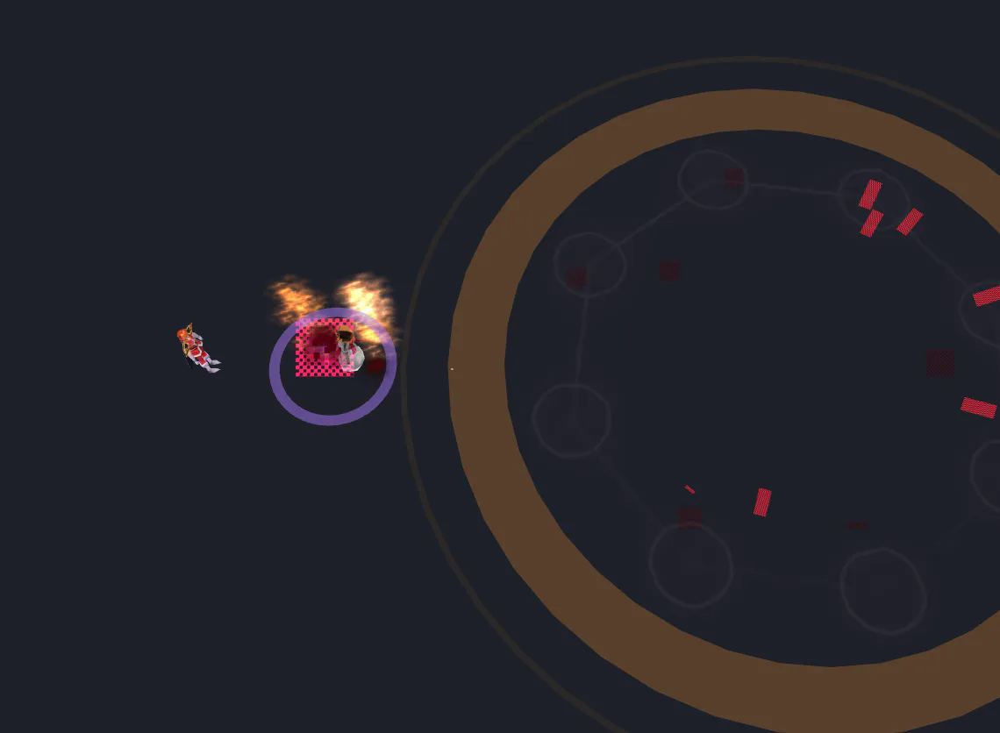

1098ms · side
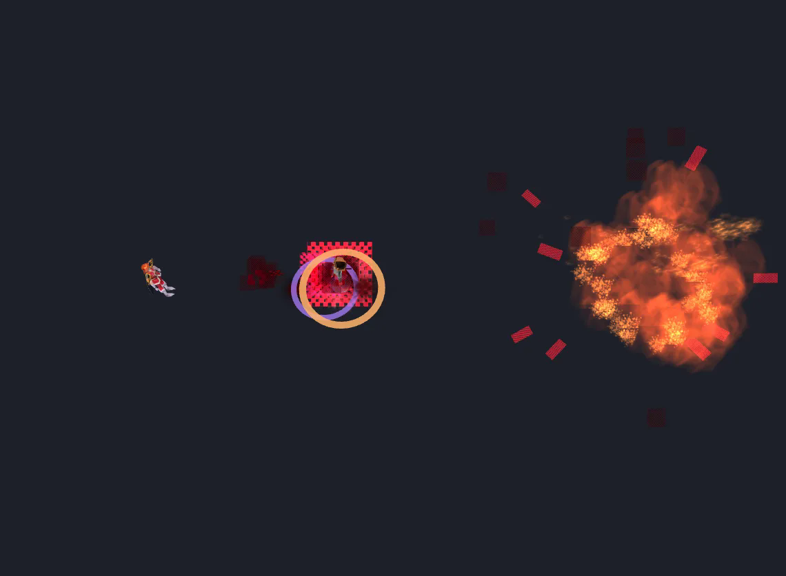

1518ms · side

## 04-04 莉娜 · 神滅斬

- Owner 目標：dash 後斬擊
- Main 目前：Main 已出貨專用 vfx-script：隱藏本體、Lina 模型高速穿越目標，並疊加兩道紫色斬痕與落點爆發。
- JASS：命中後先造成傷害，0.5 秒後啟用 LinaS_Effect 推動目標，並對附近玩家震屏。
- JASS／蝗蟲群：施法點 HeroCloudCyd；推動路徑使用 UndeadDissipate、ImpaleTargetDust，另有 WispExplode。
- 來源判定：owner-override:JASS 核心是推動受害者，不是施法者 dash；依 Owner 最新目標改成 dash 斬擊，但在審查頁永久標示此偏離。
- 候選：`a2c14f8d7112`；審查材料：`28490212a001`；base：`none`
- GPU 完整時間軸：34 格；衛生分流 9.5/10；最差 1.000 秒；粒子峰值 49／系統 21
- 稽核資格：⛔ ggd-vfx-visual-audit@1 legacy；畫面只作失敗證據，不得通過

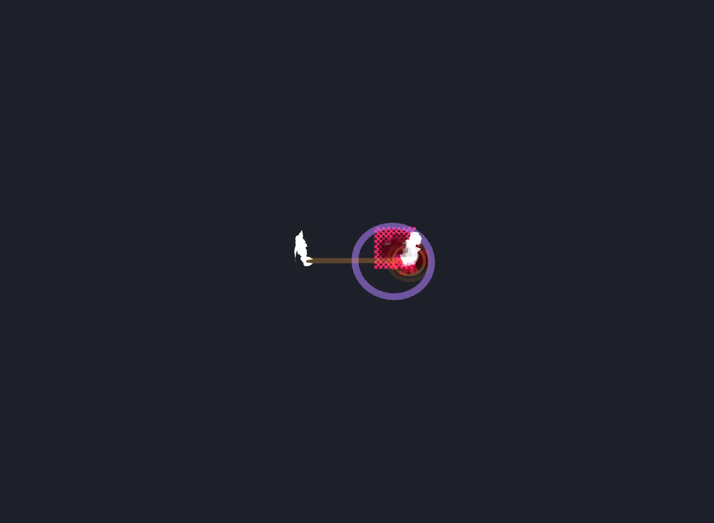

1084ms · side
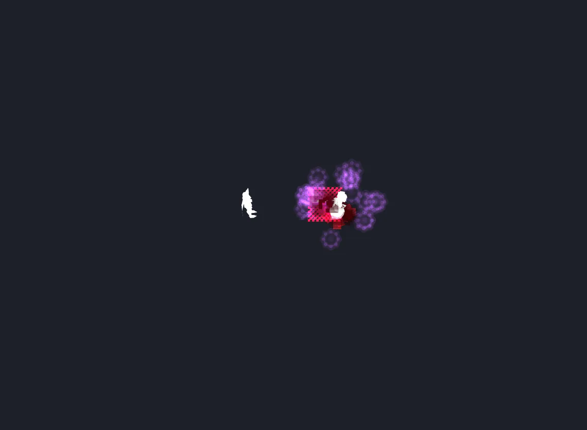

1448ms · side

## 01-04 克勞德 · 超究武神霸斬

- Owner 目標：動畫連斬＋黃藍直立光束砲
- Main 目前：已有 combo、無敵與豐富 script，是八招中最完整的 main 基線；逐刀站位與加速仍需校準。
- JASS：七段斬擊逐刀換位，第三段升空，後段播放速度逐步提高，最後一刀另有終結演出。
- JASS／蝗蟲群：ResurrectTarget 武器光柱＋h002 幻影；施法者與受害者依段次改位置、高度、面向與動畫速度。
- 來源判定：partial:多段與終結方向一致；必須補足逐刀身體位置、升空曲線與逐段加速後才可人工通過。
- 候選：`fb3b8971c3ec`；審查材料：`a1a6ea79084c`；base：`9b1af8fd531f`
- GPU 完整時間軸：87 格；衛生分流 8.5/10；最差 4.600 秒；粒子峰值 109／系統 33
- 稽核資格：⛔ ggd-vfx-visual-audit@1 legacy；畫面只作失敗證據，不得通過

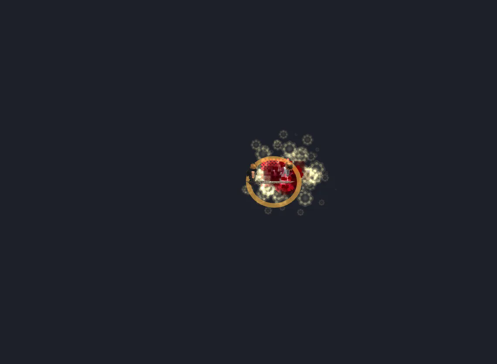

2778ms · side
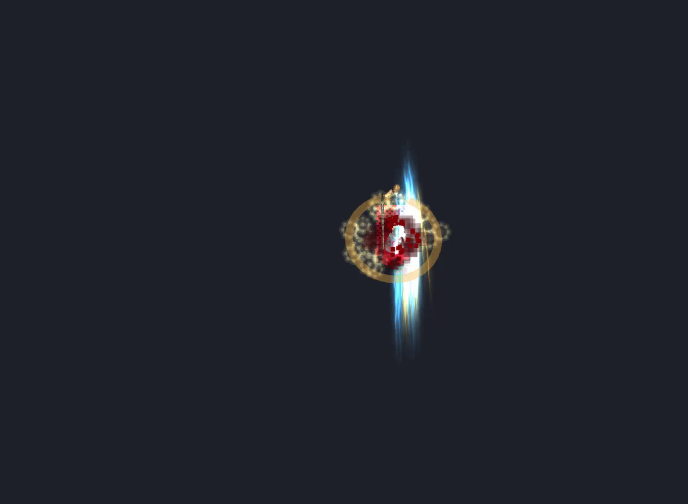

4620ms · side

## 08-04 小呆 · 阿邦快速劍X

- Owner 目標：A 衝擊波＋B dash 斬擊
- Main 目前：ability 有直線傷害、標記、延遲位移與落點傷害；script 有隱藏本體與 RedDragonMissile。
- JASS：原作在出發點放 e003，隱藏本體約一秒後固定移動 550 wc3u，落點造成範圍傷害。
- JASS／蝗蟲群：e003 RedDragonMissile＋ImpaleTargetDust；受害者腳下 ThunderClapCaster。
- 來源判定：partial:B 段 dash 與 JASS 接近；A 段藍色衝擊波採 Owner／影片版本，須避免 ability 與 script 重複畫同一層。
- 候選：`d58ce9d2c969`；審查材料：`6cbd9742d170`；base：`fff26c131b41`
- GPU 完整時間軸：35 格；衛生分流 8/10；最差 0.867 秒；粒子峰值 69／系統 15
- 稽核資格：⛔ ggd-vfx-visual-audit@1 legacy；畫面只作失敗證據，不得通過

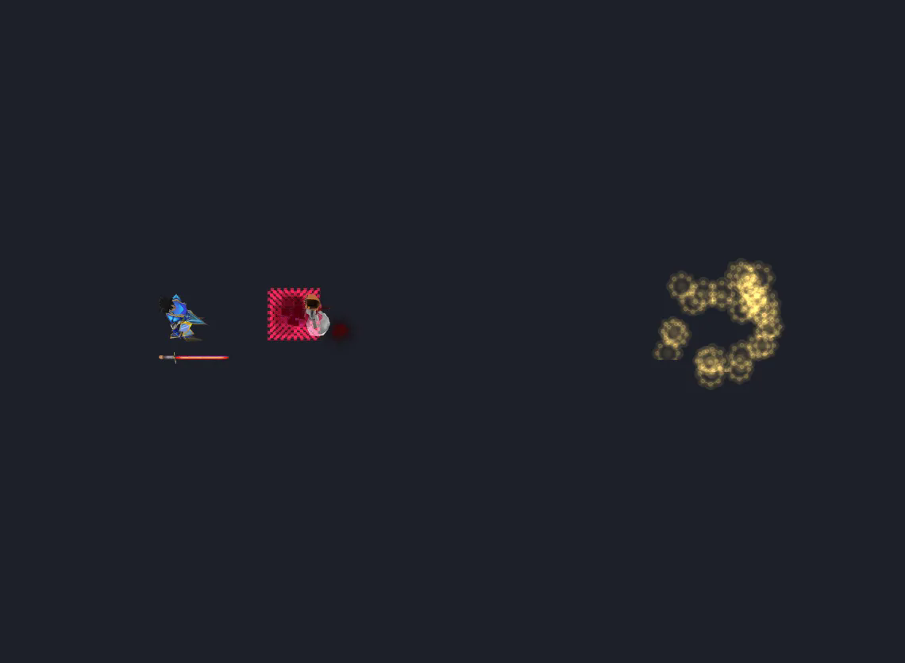

1311ms · side
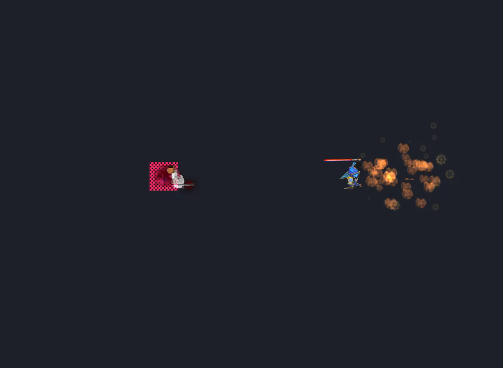

1561ms · side

## 08-03 小呆 · 龍鬥氣砲咒文

- Owner 目標：橫向藍色氣功砲
- Main 目前：Main 已出貨專用 vfx-script：胸前藍白聚能、沿地面推進的多層橫向光束與持續核心；命中仍由 ability 掌權。
- JASS：同一幀沿施法面向每 150 wc3u 建立一個 e003，共十個，存活一秒；另有震屏與地形波紋。
- JASS／蝗蟲群：10× e003 RedDragonMissile，比例 4.0；兩秒後清理同型 dummy。
- 來源判定：owner-override:JASS 是十顆紅龍飛彈列陣；Owner 已明確指定藍色經典光束，因此保留十段節奏作參考，視覺改採藍色 beam。
- 候選：`9986aee4d190`；審查材料：`40e12bc11b46`；base：`none`
- GPU 完整時間軸：34 格；衛生分流 9/10；最差 0.867 秒；粒子峰值 87／系統 14
- 稽核資格：⛔ ggd-vfx-visual-audit@1 legacy；畫面只作失敗證據，不得通過

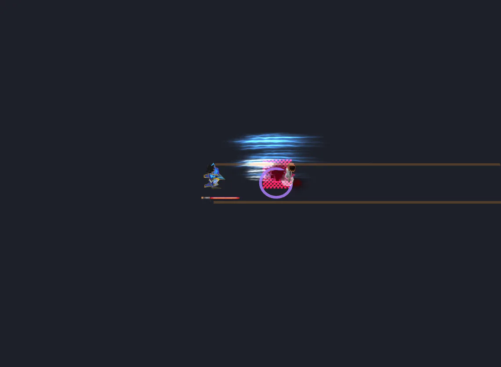

931ms · side
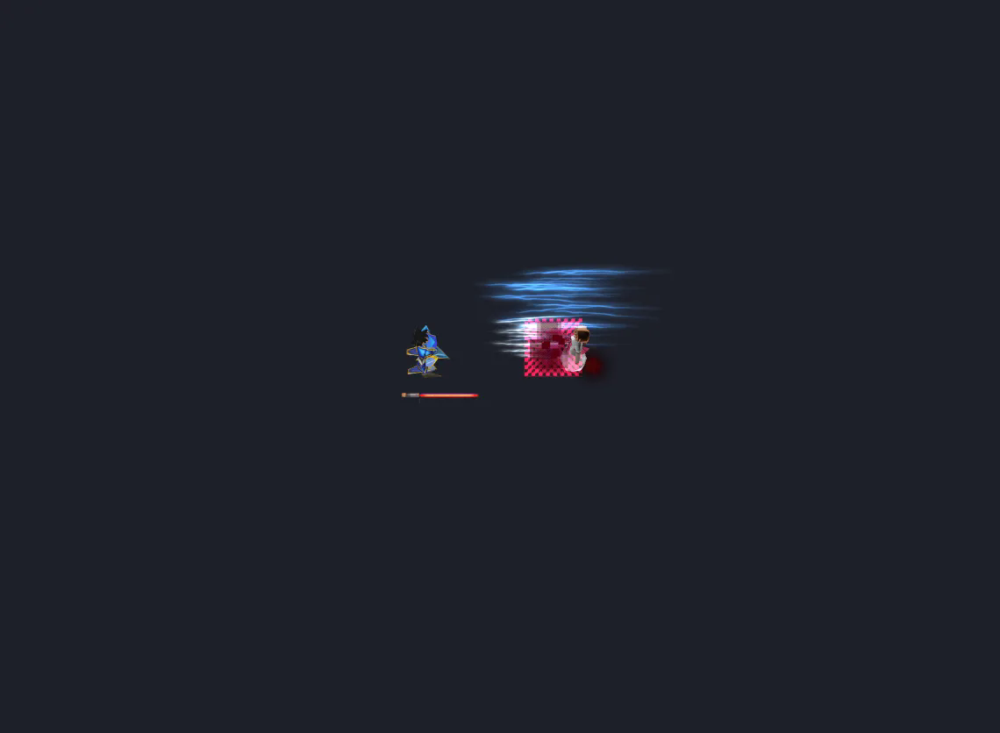

1356ms · side

## 09-04 悟空 · 龜派氣功

- Owner 目標：橫向橘色氣功砲
- Main 目前：ability 已有 ReviveHuman、FragDriller、六段 FlameStrike 與震屏；script 補槍口層。
- JASS：槍口前 150 wc3u 建立 ReviveHuman 與 FragDriller，並在 200～1200 wc3u 同幀建立六個 FlameStrike。
- JASS／蝗蟲群：h007 ReviveHuman＋h008 FragDriller＋6× h006 FlameStrike1，兩秒後清除鏡頭噪動。
- 來源判定：partial:組成與時序接近；橫向拉伸 beam 是為 Owner 可讀性做的明確改編，不宣稱是 JASS 1:1。
- 候選：`e1dacd1cafeb`；審查材料：`e0649be32382`；base：`c2f67c69c2a9`
- GPU 完整時間軸：34 格；衛生分流 8.5/10；最差 0.867 秒；粒子峰值 81／系統 14
- 稽核資格：⛔ ggd-vfx-visual-audit@3 legacy；畫面只作失敗證據，不得通過

931ms · side
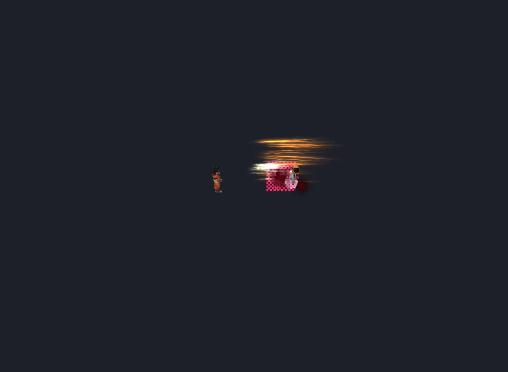

1356ms · side

## 20-002 Saber · 理想鄉 EX

- Owner 目標：反擊＋動畫連斬＋氣功砲
- Main 目前：reflectSuccess 接縫與 17 段 script 已存在；目前角色模型 primitive／貼圖問題阻擋視覺核准。
- JASS：Avalon 反彈窗由受傷事件判定；成功後進入 ExcaliburMAX 七刀與第八擊終結鏈。
- JASS／蝗蟲群：MonsoonBolt、鏈鎖閃電、拖曳與多段斬擊效果；EX 演出綁 Saber 受傷事件而非獨立 A0SP。
- 來源判定：partial:事件與三段敘事一致；模型資產、拖曳、隨機間隔與逐刀站位未通過前維持 fixture-pending。
- 候選：`4c03337bb639`；審查材料：`e9da0e6f9ab5`；base：`e4edec42414d`
- GPU 完整時間軸：39 格；衛生分流 8.5/10；最差 0.000 秒；粒子峰值 265／系統 69
- 稽核資格：⛔ ggd-vfx-visual-audit@1 legacy；畫面只作失敗證據，不得通過
- 2026-09-02 12:54 動作守衛重驗：⛔ 第七刀 650–710ms 的終結砲已超出目標受擊動作窗，命中
  `TARGET_REACTION_MISSING`。此候選與舊圖維持原樣作失敗證據；不得補 JSON 後沿用舊擷圖。

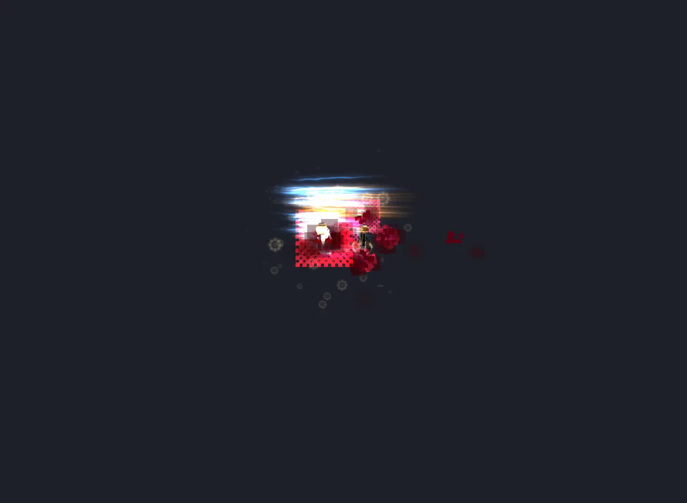

1233ms · side
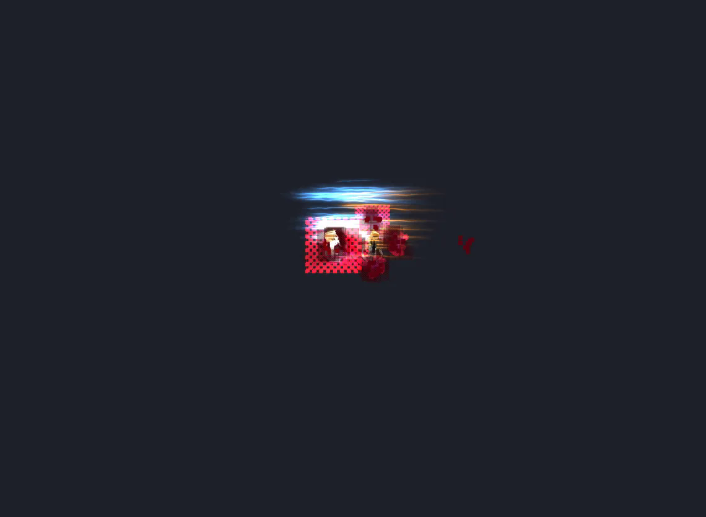

1676ms · side

## 48-04 Rider · 騎英之手綱

- Owner 目標：dash＋橫向藍色氣功砲
- Main 目前：Main 已出貨專用 vfx-script：Rider 以 bodyMove 弧線 dash，並疊加藍白橫向光砲與落點演出。
- JASS：依 EX 狀態分兩條路；普通路隱藏 Rider，用 h024 每 0.01 秒移動 50 wc3u，落點十二次 ThunderClap。
- JASS／蝗蟲群：h02D 光環、h015 翅膀、h02H Shockwave、h02I 法陣；普通路 h024／h025 與路徑特效群。
- 來源判定：owner-override:w3x 是魔法陣與蝗蟲群的曲線衝刺，並非藍色長光束；依 Owner 最新目標製作 dash＋beam，但完整保留偏離紀錄。
- 候選：`10f5cb288016`；審查材料：`a0078fae2f67`；base：`none`
- GPU 完整時間軸：39 格；衛生分流 9/10；最差 1.067 秒；粒子峰值 111／系統 22
- 稽核資格：⛔ ggd-vfx-visual-audit@1 legacy；畫面只作失敗證據，不得通過

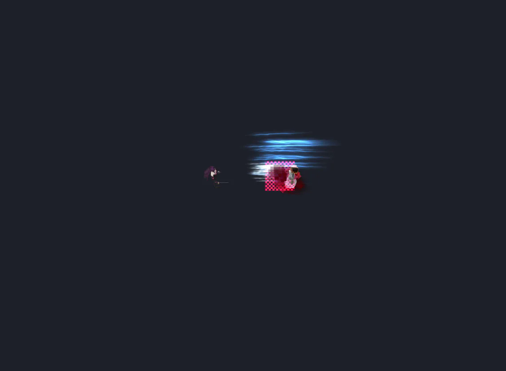

1523ms · side

1784ms · side

## 判定邊界

- PNG 是送審候選的實際 framebuffer；報告不以 schema 通過冒充視覺通過。
- 舊稽核未檢出棋盤載體的分數已作廢；後台與 Promote 只接受 `ggd-vfx-visual-audit@3` 的正向裁決。
- 自動掃描只負責不透明底板／可讀性分流；顏色、方向、節奏、原作忠實度仍由人工 0～10 分與 pass/fail 決定。
- 本工具只讀 proposal 並輸出報告，不寫 `content/vfx-scripts/`，不會把八招套回遊戲。
