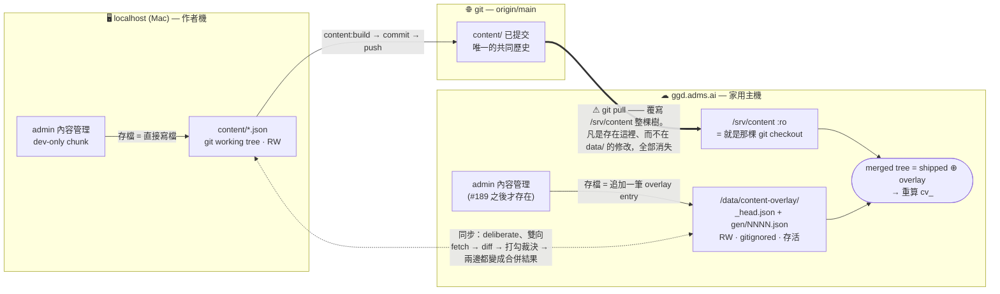

# 兩台後台的內容同步 (Two-Console Content Sync)

> **狀態**：owner 已裁示（2026-07-25）。這份文件是把裁示寫成規格，不是重新設計。
>
> **任務**：#189（`data/` 持久化 overlay）是這件事的**前置條件**，不是加分項。
>
> **相關**：`docs/todo/content-sync.md`（驗收列）、`docs/todo/content-api.md`（localhost 寫入路徑）、
> `docs/_requirements-audit-gaps.md`「兩台機器的內容同步＝逐項打勾裁決」（2026-07-24 的來源需求）、
> `docs/legacy/_session-handoff-2026-07-24.md`（為什麼遠端 內容管理 今天不能用）、#179（可複用的 bundle 信封）。

---

## 0. 問題與答案

owner 問的是：

> 「ggd.adms.ai 及 localhost 兩邊後台不管哪個，修改完要儲存時，都要問同步到另外一台嗎?」

**答案：不要。** 存檔永遠不問。下面每一節都是這個「不要」的理由，理由本身就是規格。

一句話版本：**存檔是本機的事，同步是另一件事**。存檔快、離線可用、不會失敗；同步是使用者自己按下去的、
會把兩邊的差異攤成一張打勾表、逐項（必要時逐欄位）裁決，送出之後**兩邊都變成合併結果**。
唯一會跳出來擋人的那一個提示，不是「要不要同步」，而是「你正在覆蓋別人剛剛改的同一個欄位」。

---

## 1. 有三個 store，不是兩台機器

把這件事想成「兩台機器對帳」是最容易犯、也最貴的錯。真正的資料落點有**三個**，其中一個會定期把另一個抹掉。



要讀的就是那條粗箭頭。`docker/compose.yaml:69-72` 把 `../content` 以 `:ro` 掛進 platform（game `:95`、
edge `:114` 同樣 `:ro`），而那份 `content/` 就是主機上的 git checkout；`docker/compose.family.yaml` 沒有改變這件事。
唯一的 RW content 掛載是 `profiles:["dev"]` 的 `content-api`（`:131`），家用主機不跑它。
所以主機上任何「存到 content/ 裡」的東西，下一次 `git pull` 就沒了 —— 不是可能，是必然。

**只有 `data/` 活得下來**（`../data:/data`，RW，`DATA_DIR=/data`，且 `/data/**` 被 gitignore，所以永遠不會被 pull 蓋到）。
這正是 #189 的內容：一個放在 `data/content-overlay/` 的持久化 overlay，出貨的 `content/` 當底，overlay 疊在上面，
合併之後重算 `contentVersion`。**任何只建模「兩台機器」的同步設計，都會輸給下一次 git pull。**

第三個 store 是 git 本身。它不是備份，它是**唯一的共同祖先來源**：Mac 上的工作樹遲早會 commit、push，
主機遲早會 pull。同步機制必須知道「這份 doc 上次雙方同意的樣子」是什麼，否則分不出「A 改了」和「B 刪了」。

---

## 2. 存檔語意：本機、即時、不會失敗

**規則：存檔只寫本機的 store，同步呼叫一律不參與存檔路徑。**

- **本機**。localhost 的存檔寫 `content/*.json`（`apps/content-api/src/server.ts:204-423`，寫前把舊 bytes 快照進
  `data/content-backups`）。主機的存檔追加一筆 overlay entry（`apps/platform/internal/contentoverlay/`）。兩者都不碰對方。
- **即時**。不等網路。一個要跨網路才能完成的存檔，就是一個會轉圈的存檔。
- **不會失敗**。存檔唯一允許的失敗理由是 **schema 驗證不過** 或磁碟寫不進去 —— 這兩個是使用者能理解、也能修的。
  「對方連不上」永遠不是存檔失敗的理由。
- **offline-first**。家用主機關機、Mac 在外面、網路斷掉，兩邊的後台都照常可以編輯。分歧是可以接受的狀態，
  不是錯誤狀態；能被合併的分歧不需要被預防。

### 為什麼不能在存檔時問

三個獨立的理由，每一個都足以否決。

1. **他要把後台開放給家人**（「我會開放給家人一起修改」）。每次存檔都彈一個 modal，等於訓練所有人閉著眼睛按掉它。
   那麼真正該讀的那一次，也會被按掉。一個總是出現的警告等於沒有警告。
2. **存檔的當下還不知道有沒有衝突**。要知道，就得去問對方那台；對方可能關機。於是只剩兩個選擇：
   讓存檔變慢而且會失敗（違反上面每一條），或者問一個自己答不出來的問題。
3. **同步根本不是 yes/no**。owner 自己的規格是：「每次要同步的時候改變項目列出來選擇以誰為主，並且是打勾的形式，
   然後送出合併同步兩邊」，加上「欄位級裁決 要支援，因為我會開放給家人一起修改」。
   那是一張**逐欄位裁決的表格**。表格塞不進存檔按鈕。

---

## 3. 同步：一個獨立的、使用者按下去的動作

同步是 內容管理 頁面上的一個入口（見 §4 的分歧指示器），不是存檔的後半段。它有四步，順序不能換。

### 3.1 Fetch —— 去要對方的快照

向對方要一份內容快照。可以拿得到就往下走；拿不到就**明說拿不到**（§4），不做任何事。

- 便宜的探測：`GET /content-overlay/head`（`internal/contentoverlay/handlers.go:66-88`，public）只回
  generation / contentVersion / registryFingerprint / docCount / updatedAt / updatedBy，不用下載任何 doc
  就足以判斷「對方有沒有前進」。
- 完整抓取才會拿 doc。傳輸信封複用 #179 的形狀：`Kind` + `BundleVersion` + 每個 part 的 sha256 +
  遇到未知版本直接拒絕 + dry-run 報告（`internal/opstate/bundle.go:63-90`）。但**是新的 Kind**
  （`ggd-content-sync`），因為 opstate 是單向、整檔安裝、不帶 generation、不帶 `baseHash`，
  而且刻意排除 content docs —— 可複用的是那個信封的紀律，不是那條路徑。

### 3.2 Diff —— 三方比較，分成三類

比較的單位是 `hashDoc()`（`content/hash.ts`），三個輸入：

| 名稱 | 是什麼 |
|---|---|
| `base` | `lastSyncedHash` —— 上一次雙方同意的那個版本的 hash（§6） |
| `A` | 本機現在的 `hashDoc(doc)` |
| `B` | 對方現在的 `hashDoc(doc)` |

分類與預設打勾：

| 情況 | 類別 | 預設 |
|---|---|---|
| `A == B` | 已收斂 | 不列出，只把 `lastSyncedHash` 推進 |
| `A == base`，`B != base` | 只有對方改 | 預設勾**對方** |
| `A != base`，`B == base` | 只有本機改 | 預設勾**本機** |
| 兩邊都動且 `A != B` | **真衝突** | **不預設**，展開欄位級 |
| 一邊有、一邊沒有（新建） | 新建 | 預設勾有的那邊 |
| 一邊刪除、一邊修改 | 刪除衝突 | **不預設**，刪除永遠不自動獲勝 |

沒有 `base`（雙方從未同步過，或該 doc 是新的）時，任何雙邊都存在的差異一律當**真衝突**處理。
寧可多問一次，也不要在第一次同步就靜靜吃掉一邊。

Diff 引擎必須是 `packages/shared` 裡的**純函數**：不碰 fs、不碰時鐘、輸入 `(base, local, peer)`、輸出分類結果。
這是整個機制裡唯一「算錯就會無聲失去資料」的部分，所以它必須是可以單獨測到爛的那一塊。

### 3.3 打勾表格 + 欄位級裁決

- **每一列是一份 doc**：collection、id、顯示名稱、類別（只有本機改 / 只有對方改 / 衝突 / 新建 / 刪除）、
  哪些欄位不同、兩邊各是誰在什麼時候改的（`lastEditedBy` / `lastEditedAt`，§6）。
- **勾選 = 以誰為主**。單選（本機 / 對方），不是核取方塊的 on-off —— 「以誰為主」本來就是二選一。
  非衝突列已經有預設，使用者可以整批送出而不用逐列點。
- **展開一列 = 欄位級裁決**。三欄：`欄位` / `本機` / `對方`，每個**有差異的**欄位各自選一邊。
  這就是「同一個英雄，A 改了 Q 冷卻、B 改了 R 傷害，兩個都要」的那個情境 —— 沒有欄位級就只能丟掉一半。
  只列出真的有差的葉節點；陣列（例如 `effects[]`）整段比、整段選，因為「第 3 個 effect 誰贏」不是任何人能推理的東西。
- **鏡像規則不能忘**。技能同時存在於 `content/abilities/<cid>.<slot>.json` 與
  `content/champions/<cid>.json` 的 `abilities[<slot>]`（sim 讀的是內嵌那份）。欄位級裁決落在 ability 上時，
  合併結果必須在**兩邊都**重新套用鏡像，否則合併完成的當下就違反 mirror audit。
- 合併結果送出前必須通過**現行 Zod schema**。裁決可以產生一份兩邊都沒出現過的 doc，那份 doc 一樣要能載入。

### 3.4 Submit —— 兩邊都變成合併結果

一次送出做完，而且是原子的：

1. 對每一列算出合併後的 doc（逐欄位取被勾的那一邊）。
2. 驗證整批（含鏡像一致性、`zRef` 參照完整性）。任何一列不過，整批不寫 —— 部分套用的合併是最難收拾的狀態。
3. **兩邊都寫入同一份結果**：主機寫成一個新的 overlay generation（`gen/NNNNNNNNNN.json` 是不可變的，
   `gen/index.json` append-only 記 `createdBy` / `createdAt` / `note` / `changes[]`）；
   Mac 寫回 `content/*.json`（走既有的備份快照路徑，所以合併也是可以還原的）。
4. 兩邊的 `lastSyncedHash` 一起設成 `hashDoc(merged)`，並記下同步時間與對方 generation。
5. 兩邊重算 `contentVersion`；UI 照舊顯示「重開一場才會生效」。

「合併同步兩邊」是字面意思：**沒有哪一邊贏**，兩邊拿到同一棵樹。

---

## 4. 分歧指示器：把「每次都問」換成「永遠看得到」

不在存檔時問，代價是使用者可能忘記兩邊已經岔開。所以把那個問題換成一個**常駐的、誠實的**狀態列，
放在 內容管理 頁首，點下去就是 §3 的同步頁。

| 狀態 | 顯示 |
|---|---|
| 已收斂 | `已同步 · 上次同步 7 月 25 日 14:20` |
| 已知分歧 | `本機有 3 項未同步 · 對方有 1 項 · 上次同步 7 月 25 日 14:20` |
| 對方前進但尚未比對 | `對方已前進到 gen 12（尚未比對）· 本機有 3 項未同步` |
| **對方連不上** | `⚠ 無法連線對方（最後嘗試 15:02）· 本機有 3 項未同步 · 對方：未知 · 上次同步 7 月 25 日 14:20` |
| 從未同步 | `從未同步過` |

**誠實的離線狀態是這一節存在的理由。** 連不上的時候，絕對不可以顯示綠勾、不可以把對方的數字寫成 `0`、
不可以說「已同步」。`0` 和「我問不到」在畫面上必須長得不一樣，因為它們的意思完全相反。
`M` 只有在最近一次完整 fetch 之後才是已知的；否則就寫「未知」或「尚未比對」。

`N`（本機未同步）永遠可以在本機算出來 —— 它只需要 `lastSyncedHash` 和現在的 `hashDoc()`，
不需要網路。所以離線時 `N` 仍然準確，這是刻意的：至少你知道自己欠了多少。

輪詢用 `GET /content-overlay/head`（便宜、public、只回 generation），不要為了更新一個角標去拉 1.5 MB 的 bundle。

---

## 5. 唯一值得跳出來的那一個提示

有一種情況確實該擋人一下，而它不是「你要不要同步」。

**觸發條件（四個全部成立才跳）**：

1. 這次存檔會改到 doc `D` 的欄位集合 `F`；**且**
2. 我們手上有對方對 `D` 的快照（最近一次 fetch 的快取，或這次剛好拿得到）；**且**
3. `hashDoc_peer(D) != lastSyncedHash[D]` —— 對方在上次同步之後也動過 `D`；**且**
4. 對方動到的欄位和 `F` **有交集**。

四個都成立，才跳：

> **對方也改了同一個欄位。**
> `<who>` 在 `<when>` 把「冷卻時間」從 `8` 改成 `6`。
> 你正要寫入 `10`。
> [仍要儲存] [取消] [開啟同步比對]

條件 4 是讓它保持稀有的關鍵：兩個人編不同英雄、或編同一個英雄的不同欄位，永遠不會看到這個框。
稀有到值得每次都讀 —— 這正是 §2 裡「每次都彈」所摧毀的那個性質。

幾個必須寫死的細節：

- **它不是同步提示**。文案裡不出現「要不要同步」。它說的是「你正在覆蓋某人剛剛改的東西」。
- **對方連不上時不會跳**，也不可以拿一個泛用的恐嚇框頂替。分歧指示器已經說了「無法連線對方」，那就夠了。
- **它擋不住存檔**。按「仍要儲存」就存下去，而且立刻。§2 的規則沒有例外。
- **可以用過期的快照**，但要把快照時間寫在框裡。「根據 15:02 抓到的資料」這種稍嫌過時但誠實的警告，
  比為了新鮮而不警告好；真正的權威還是同步時的那張表。

---

## 6. 每份 doc 的三個欄位：放 sidecar，不放 doc

需要的是 `lastSyncedHash`（三方合併的 base）、`lastEditedBy`、`lastEditedAt`。
這三個本來就是欄位級裁決要顯示的東西（「誰在什麼時候改的」），所以不是額外成本。

**裁決：放 sidecar，不進 doc。四個理由，每一個單獨都成立。**

1. **schema 是 `.strict()` 的**。`zChampionDoc`（`schema/champion.ts:112-114`）、
   `zAbilityDoc`（`ability.ts:188-190`）、`zItemDoc`（`item.ts:56`）、`zArenaDoc`（`arena.ts:84`）
   全都以 `.strict()` 收尾 —— 未知的 key 是**硬失敗**，不是被忽略。塞進 doc 就得同時改 12 個 collection 的 schema、
   所有 fixture、以及匯入器；而且從此每一份手寫的 content JSON 都得帶編輯履歷才合法。
2. **`hashDoc()` 吃整份 doc**。`content/hash.ts` 是 `sha256(safe-stable-stringify(doc))`，
   往上是 `hashCollection` 再往上是 `contentVersion`。把 `lastEditedAt` 放進 doc，等於**每次存檔都會動 `cv_`**，
   client 的 bundle 快取全數失效、玩家被告知「重開一場才會生效」—— 只因為有人打開又關掉了一個表單。
3. **更糟的是 diff 引擎會壞掉**。整套分類的前提是「hash 是內容的純函數」。一旦編輯者名字進了 hash，
   兩台機器上數值完全相同、只是最後編輯者不同的 doc，會**永遠**被判成衝突。base/A/B 比較就此失去意義。
4. **content/ 是出貨樹，履歷是營運狀態**。這個 repo 已經做過這個切分：curation whitelist、備份快照、
   admin audit 全都在 `data/`。編輯履歷屬於同一類。

### 放哪裡

每個 store 各自一份，路徑一致：

```
data/content-sync/state.json
{
  "schemaVersion": 1,
  "updatedAt": "...",
  "docs": {
    "champions/godie-hart": { "lastEditedBy": "...", "lastEditedAt": "..." },
    ...
  },
  "peers": {
    "<peerId>": {
      "lastSyncAt": "...",
      "lastPeerGeneration": 12,
      "synced": { "champions/godie-hart": "<12-hex hashDoc>", ... }
    }
  }
}
```

- **`docs.*` 是本機的編輯履歷**（誰、什麼時候）。由**兩條寫入路徑各自維護**：localhost 是
  `apps/content-api`，主機是 `internal/contentoverlay`。主機那邊其實可以從 `gen/index.json` 的
  `createdBy`/`createdAt`/`changes[]` 推出來，但仍然明寫一份 —— 兩個 store 必須用**同一種方式**回答同一個問題，
  否則 diff 引擎得知道自己跑在哪台機器上，而它應該是純函數。
- **`lastSyncedHash` 掛在 `peers.<peerId>` 底下**，因為它不是 doc 的屬性，是**這一對 store 的**屬性。
  今天只有兩台，但寫成 map 之後多一台家用機不需要 migration。
- 單一檔案、單寫者、atomic rewrite —— 和 `data/curation/whitelist.json`（`internal/curation/curation.go:75`）
  同一個模式。1,441 份 doc × 約 120 B ≈ 170 KB，不需要拆成 1,441 個檔。
- 目前 shipped content **完全沒有**任何 per-doc 編輯 metadata（`packages/shared/src/content/schema/` 裡
  找不到 `updatedAt`/`editedBy`/`revision`），doc 的身分就只有它的 hash。這份 sidecar 是第一個，
  也刻意是**唯一**一個 —— 不要再有第二個地方記同一件事。

**本文件不改 code。** 因為這三個欄位一旦進 doc 就會撞到 `.strict()`，依照指示改為規格化描述，交給實作階段。

---

## 6.5 合併優先權規則（#189 已落地，2026-07-26）

同步引擎還沒做，但**單向合併**已經在跑了：主機上玩家看到的是
`merged = shipped(content/) ⊕ overlay(data/content-overlay/)`。這一節把那個 ⊕ 的規則寫死，
因為它就是 §3.2 三方比較的 base 從哪來。

### 規則本身（`apps/platform/internal/contentoverlay/precedence.go`）

1. **覆蓋層永遠贏。** 覆蓋的 doc 取代出貨 doc；tombstone 讓該 id 從合併樹消失；
   覆蓋層獨有的 id 追加進索引。**無條件**，包含「出貨 bundle 在編輯之後被改掉」的情況。
2. **基準對不上的項目要被標記，不是被丟掉。** 每筆 entry 帶 `baseHash`（編輯當下出貨 doc 的 hash），
   每次讀狀態都拿去和現在的出貨 `_index.json` 比。不同 → 該筆仍然生效，但標成 `stale`、
   計入 `flaggedCount`、開機時 warn 一行、後台那一列變黃。
3. **沒有基準 ≠ 基準相同。** 舊版 overlay（沒有 `bases` 欄位）或編輯當下讀不到 `content/`，
   一律報 `unknown-base` 並標記。對應 csync-03：缺 base 一律降級成需要人看，絕不挑一邊。

### 為什麼是「贏 + 標記」而不是「過期就輸」

兩種錯的代價不對稱。過期就輸 → 一次 `git pull` 會**無聲**回捲家人正在玩的調整，
沒有警告、也看不到失去了什麼。贏 + 標記 → 最壞情況只是 repo 的新版還沒生效，
而後台有一列紅字說明，按一下「還原」就採用 repo 版本。**任何一邊都不會在沒人被問到的情況下消失。**

### 狀態表

| 狀態 | 情況 | 標記 |
|---|---|---|
| `clean` | 出貨 doc 和編輯當下的基準一致 | 否 |
| `stale` | 出貨 doc 被改過（git pull） | **是** |
| `orphan` | 基準所指的出貨 doc 已被刪除 | **是** |
| `added` | 出貨樹本來沒有、現在也沒有這個 id | 否 |
| `shadow` | 新增的 id，出貨樹後來也長出同名 doc | **是** |
| `unknown-base` | 沒有可用基準（舊 entry／讀不到 content/） | **是** |
| `tombstone` / `tombstone-moot` | 隱藏中／出貨樹已無此 id 的殘留隱藏 | 否 |

### `baseHash` 從哪裡來（**Go 不自己算 hash**）

`hashDoc` 是 TypeScript（`packages/shared/src/content/hash.ts`，safe-stable-stringify + sha256 取 12 碼）。
在 Go 重寫一份、要求 byte 對 byte 相同，是會讓每一筆永遠報 `stale` 的陷阱。
所以改成讀 `pnpm content:build` **已經寫好的** `content/<collection>/_index.json` 裡的 `hash`。
寫入當下記下來的值、與日後比對的值，來自同一支 TS pipeline 算出的同一個檔案，因此天生自洽。

console 也**不**負責提供 `baseHash`：它有出貨 doc 在手，但那樣基準就變成呼叫端宣稱的，
一個開了一小時的分頁就能把「已比對」蓋在一份一小時前的 doc 上。

### 三個動詞，不是兩個

| 動詞 | 端點 | 語意 |
|---|---|---|
| upsert | `PUT /content-overlay/docs/{c}/{id}` | 蓋掉出貨 doc |
| tombstone | `DELETE /content-overlay/docs/{c}/{id}` | 讓該 id 從合併樹消失（**連出貨版一起**） |
| revert | `DELETE /content-overlay/entries/{c}/{id}` | 移除覆蓋層的意見，回到出貨 doc |

`revert` 是 `stale` 的唯一非破壞性出口。只有 tombstone 的話，遇到 repo 更新的 doc，
操作者手上沒有任何「算了，repo 是對的」的動作可用。

---

## 7. 工作順序

> **在 #189 落地之前，遠端存檔不存在。** 不是「不好用」，是不存在：
> `apps/admin/src/ui/App.tsx:73` 與 `:104` 用 `if (!import.meta.env.DEV) return;` 動態載入 內容管理 與 角色語音生成，
> 所以**正式 build 的 admin bundle 裡根本沒有這兩頁的 chunk**；而寫入端 `/content-api` 只存在於 `nginx/dev/`。
> 沒有東西可以同步。所有同步工作都排在 #189 之後。

| # | 工作 | 為什麼是這個順序 |
|---|---|---|
| 0 | **把三個 worktree 的成果審完、提交** | #189 的 code 已經寫好但**沒有進任何分支**（`git diff --stat main...worktree` 是空的，只有 `??`/`M`），躺在 `.claude/worktrees/wf_4d023fe1-8b6-{5,6,7}`：`packages/shared` 的 `overlay.ts` / `MergedContentSource.ts`、`apps/platform/internal/contentoverlay/`（11 檔）、`apps/admin/src/content/` 的四個 adapter。這是唯一一件不做就什麼都不能做的事。 |
| 1 | **#189：`data/` overlay 上線 + 正式 build 帶進 內容管理** | 主機端要有一個 git pull 蓋不掉的寫入目的地，admin 正式 bundle 要真的含這一頁。做完這一步才第一次有「兩個 store」。 |
| 2 | **sidecar sync state（§6）由兩條寫入路徑同時開始寫** | 必須和 (1) 同一批落地。晚一步，第一次同步就沒有 `base`，所有 doc 都會被判成真衝突，那張表會有 1,441 列 —— 沒有人會讀它。 |
| 3 | **diff 引擎（純函數，`packages/shared/src/content/sync/`）** | 唯一算錯就會無聲失去資料的部分，先做、單獨測。不碰 fs、不碰時鐘。 |
| 4 | **傳輸 + fetch/apply 端點** | `ggd-content-sync` 信封（複用 #179 的紀律）、拉對方快照、原子寫入合併結果並推進雙方 generation。 |
| 5 | **UI：分歧指示器 → 同步頁 → 打勾表 → 欄位展開 → 送出** | 使用者第一次真的能用同步，是在這一步。 |
| 6 | **§5 那一個提示** | 排最後：它需要 (2) 的 `lastSyncedHash` 和 (4) 的對方快取。少了它系統仍然正確，只是少一層保護。 |

**一個貫穿的架構要求**：`apps/admin/src/content/selectAdapter.ts:52` 已經在 dev 走 loopback（content-api）、
在 production 走 overlay。同步引擎必須坐在**這個接縫之上**，讓兩台機器共用同一份實作 ——
否則會養出兩套會慢慢分家的合併邏輯，而合併邏輯分家就是資料遺失。

---

## 8. 還需要 owner 決定的（其他都已裁示，不要再問）

1. **localhost 上的 `lastEditedBy` 是誰？** 本機後台在 loopback 免登入（#162），所以沒有身分。
   選項：OS 使用者名稱 / 每台機器在設定裡填一個名字 / 第一次編輯時強迫填。
   要問的是：家人會不會共用那台 Mac？如果會，OS 名稱就沒有意義。
2. **同步之後誰負責 commit 進 git？** 合併完兩邊一致，但只有 Mac 能 push。
   同步要不要順手在 Mac 上 stage 一個 commit，還是維持手動 `pnpm content:build && git commit`？
   這決定了主機的 overlay 有沒有機會被清空（否則它會永遠越疊越厚）。
3. **家人能不能按同步？** 編輯只影響他自己那台；同步會**寫進兩台**。這是比編輯大得多的權限。
   建議只有 owner 能送出合併，家人只能看那張表。
4. **`content/assets/*` 圖片要不要同步？** 它們是二進位、不是 JSON doc，hash-diff 引擎覆蓋不到
   （寫入路徑是 `capi-08`）。而 #186「建立內容時自動生圖」一旦上線，這件事會立刻變成常態。
   選項：圖片只在 Mac 上產生（最單純）/ 用另一套 by-hash 的資產同步。
5. **第一版覆蓋哪些 collection？** 全部 12 個，還是先做後台真的會編的那幾個（champions / abilities / items，
   加上 delegation 最安全的 vfx）？
6. **落選的那一邊要不要留？** 一次合併是這個系統裡**第一個**會讓某台機器上的值消失、而那台機器上沒有快照的操作
   （備份是各存各的）。要不要在 generation log 的每一列裡順手記下沒被採用的值，讓按錯的勾可以救回來？
