# 抓取系模板家族設計（Grab Template Family）— v2，對「完整普查」重寫

> **狀態**：設計文件。**這份文件不動任何一行程式碼、不動任何一份 content。**
> 本版**取代**前一版草案（三模板 `tpl-grab-{yank,vacuum,seize-throw}`）。前一版的普查不完整，
> 三分法在完整普查下**站不住**：漏掉的五支裡有一支是「延伸／隨機咬住／逐節收回」的鎖鏈鉤索，
> 一支是 `onDamaged` 的招架反摔，兩支是「先鎖位、再推」的近身摔投，全都塞不進那三張卡。
>
> **owner 的框定（2026-07-26）**：「**抓取系 也是一種模板機制**」——它是自己的家族，
> 不是 `tpl-leap-strike` 的一個參數。
>
> **owner 的取值規則（2026-07-26）**：「war3 編輯器設定 設定不了 JASS 實作效果，遇到這種情形
> **一律以 JASS 實際參數為準**」。優先序 **JASS（會執行的那一行）> w3a/w3u > tooltip**。
> 物件表的 `null` 是 **INHERIT**（走 `base` → repo 根目錄 MPQ 的原廠表），不是 0。
>
> 所有行號 = `tools/w3x-import/out/GoDieEX22s-src/raw/war3map.j`（56,765 行）。
>
> **併行工作流的邊界（不碰）**：`packages/shared/src/sim/effects/effectRunner.ts`、
> `content/abilities/godie-hpb1.e.json`、`#247` 的分支。本文引用 #247 的成果
> （`sim/movement/leap.ts`、`sim/systems/LeapSystem.ts`、`render/leapFraming.ts`、
> `GGD_APEX_PER_WC3`）**只讀不改**。

---

## 0. 本版重寫前，我自己回去對過的東西（含三處普查更正）

普查交來的東西我逐條回 `war3map.j` / `war3map.w3a` 對過。**引擎、五支漏網、十三支新增，絕大多數屬實**，
但有三處必須更正，其中一處會改變分類結論。

### 0.1 引擎：完全屬實，逐行核對過

```jass
// war3map.j:4745-4783  Move_Func（「共同擊退觸發」）
if ( Distance > 0 ) then
   set P1 = GetUnitLoc(MoveUnit)
   set P2 = PolarProjectionBJ(P1, 50.00, Angle)          // j:4757  每 tick 走 50 wc3
   call SetUnitPositionLoc( MoveUnit, P2 )
   set P3 = GetUnitLoc(MoveUnit)
   if(DistanceBetweenPoints(P3,P1) < 10) then            // j:4753  實際位移 < 10 = 撞牆
       call SetUnitPositionLoc( MoveUnit, P1 )           // j:4754  退回上一格
       call AddSpecialEffectLocBJ( P1, "...ThunderClapCaster.mdl" )
       call EnumDestructablesInCircleBJ( 150, P1, function Destruct_Judge )
       call SetHandleInt( MoveUnit, "Distance", 0)       //         中止
   else
       call AddSpecialEffectLocBJ( P3, "...ImpaleTargetDust.mdl" )
       set Distance = Distance - 1                       //         整數遞減，不是浮點累減
   endif
```
`Set_Move_Value(unit, Distance:int, Angle:real)` j:4785-4797，`TimerStart(t, 0.04, true, …)` j:4793。
三個內嵌抄寫變體確認存在且閾值不同（大熊 `>8`、Berserker `>=5`、皇者 `>8`），且新增的
**A0L6 `>8.00`（j:50185）與 A0SQ `>8.00`（j:29696）也是同一支的抄寫變體**——抄寫變體從 3 個變 5 個，
更加確定「閾值差異是手滑不是設計」。**共用引擎的 10 wc3 是家族的唯一碰撞 epsilon。**

### 0.2 更正一（重要）：**A0RG/A0RH「19-00 閃擊」不是抓取，是施法者瞬移**

普查說「攻擊者被拉到 Azumi 身後 80」。**方向反了。** 逐行讀：

```jass
// j:27653-27657
set udg_Auzimi = GetEventDamageSource()
call SetUnitPositionLoc( GetEventDamageSource(),                       // ← 被搬的是「傷害來源」
        PolarProjectionBJ(GetUnitLoc(GetTriggerUnit()), 80.00,          // ← 錨點是「被傷害者」
                          ( GetUnitFacing(GetTriggerUnit()) + 180.00 )) )
call SetUnitFacingToFaceUnitTimed( GetEventDamageSource(), GetTriggerUnit(), 0 )
call IssueTargetOrderBJ( GetEventDamageSource(), "attack", GetTriggerUnit() )
```
`DamageLink`（j:4907-4956）以 **被傷害者 `DesT` 身上的 buff** 派發：`udg_Des_Buff[9]='B03L'`（j:5024）、
`udg_Des_BuffTri[9]=gg_trg_AzumiShadow`（j:5023），`udg_Des_DNC[9]` 未設 ⇒ 預設 `false`（j:2727）⇒ **命中即消耗**。
`B03L` 是 A0RG/A0RH 的 buff，base **`AHbh`（Bash）**，w3a：機率 **15%（A0RG）/ 50%（A0RH）**、
傷害 120、暈眩 0.30 s。Bash 的 buff 掛在**被打的人**身上。

⇒ 實際語意：**Azumi 重擊留印 → 該目標下次受傷時，Azumi（傷害來源）瞬移到目標背後 80，轉身、強制攻擊它。**
這與 tooltip 完全吻合：「**繞到對手的背後**」。**它移動的是施法者，不是敵人。**

**分類判決：A0RG/A0RH 退出抓取家族**，與 A10H「13-002 化龍」同去向——那是 #247 的 blink/leap 家族。
普查把它當成「證明方法論的那一筆」，這個論點不成立（雖然「effect-site-first 掃描才找得到它」這件事仍然成立，
只是找到的東西不是抓取）。

順帶更正：`udg_AzumiHIT >= 2`（j:27644）**不是整支 trigger 的閘**，它只閘住那個「N HIT!」浮字
（j:27663）。瞬移每次都發生。

### 0.3 更正二：A0SQ 的鎖位在**兩段 0.5 s 之後**，而且落點是「被害者正前方」

```jass
// j:29646
call SetUnitPositionLocFacingLocBJ( udg_ChiRam,
        PolarProjectionBJ(GetUnitLoc(udg_PowerBack_Target), 100.00,
                          GetUnitFacing(udg_PowerBack_Target)),        // ← 被害者的「面向」方向
        GetUnitLoc(udg_PowerBack_Target) )
```
不是「施法者面前 100」，是**被害者正前方 100，並轉身面向被害者**（= 站到對方眼前）。
而且 `EnableTrigger(gg_trg_PowerBack_Effect)` 在**第二個** `TriggerSleepAction(0.50)` 之後（j:29638/29645/29665），
所以起手到開推是 **1.0 s**，不是 0.5 s。

### 0.4 更正三：A0BR 的「反距離衝量」實務上是**平推**，只有貼身才會爆開

```jass
// j:46173
RMinBJ(-130.00, ( -3200.00 / DistanceBetweenPoints(GetUnitLoc(GetEnumUnit()), udg_P_Link) ))
```
`RMinBJ` 取**較小**者，兩者皆負 ⇒ 位移量 = `max(130, 3200/d)`。`3200/d > 130` 只在 **d < 24.6 wc3
（= 0.45 GGD u）** 時成立——那已經是兩具身體重疊的距離。**375 半徑內 99% 的目標拿到的是固定 130 wc3/tick。**
所以它不是「越近打越飛」的設計曲線，而是**一條固定徑向推力 + 一個防疊人的貼身爆開保險**。
模板不需要為它開 `inverseDistance` 參數；一個 `minStepDistance` 就夠，而且我建議連那個都不開（見 §2.6）。

### 0.5 其餘核對結果（屬實，逐項有行號）

| 普查條目 | 核對 | 證據 |
|---|---|---|
| A0RO 20 節 × 50、0.03s 延伸 / 0.04s 收回、`GroupPickRandomUnit`、節 ≥3 才咬、傷害 `100L+50` | ✅ 全部屬實 | j:38185/38187/38192/38197/38214/38226/38244 |
| A0RO 咬取濾網 | **只咬敵人**（`IsUnitEnemy` ∧ 存活 ∧ 非建築，j:38176-38178）；w3a `targets_allowed` 含 `friend` 只是「可以對友軍方向施放」 | j:38176 |
| A0Y4 1 s 電報、`udg_Frog_P` 在 sleep **之後**才讀、480 半徑、分支 (b) **無友軍濾網** | ✅ 全部屬實 | j:26671/26676-26685 |
| A0Y4 w3a | levels 4、CD 45、range **500/700/900/1100**（隨等級）、area 450（**JASS 用 480，w3a 用 450 → JASS 勝**） | OBJECTS.json |
| AHtb 四相位、3 拍 @0.40、120 @面向−120°、2000 平傷、`'A0FZ'` | ✅ 全部屬實；`A0FZ` base `Arav`（00-設定飛行高度），確認是飛行高度工具而非抓取標記 | j:25198-25254 |
| A0JD 招架窗 0.5 s、`InshouIndex` 21 拍 @0.02、`-2.5(i-11)²+250`、每拍 `-20`、傷害 **250 + AGI×5** | ✅ 全部屬實；tooltip 的 350 與 JASS 的 250 衝突 → **JASS 勝** | j:49322/49323/49335/49345 |
| A0YF `'A0YF'` 在 JASS 出現 **0 次** | ✅ `grep -c` = 0。w3a：4 級、CD 40、range 200、dur/heroDur **2.0999999**、`data{1:{1:0.0}}`、targets `ground,enemies,organic,air` | OBJECTS.json |
| A0L6 caster→victim tile（j:50113）、20 × **40** @0.04、eps 8、退格 + `STR×3` AoE | ✅ 屬實。**另外**：450/700/950/1200 傷害與 1.0/1.75/2.5/4.0 暈眩**是 w3a 的 `AHtb` 本體**（`data{1:{1:450…}}`、`duration`），JASS 只做位移 | j:50185/50201/50209 + OBJECTS.json |
| A012 200 半徑**含友軍**吸到施法者腳下 | ✅ 濾網只排除中立敵對、建築、屍體（j:43196-43204） | j:43210 |
| A0CV 12 × 50 @0.05 + 停下後 250 內 5 × 50 | ✅ | j:51522/51593/51623 |
| A00J / A00P / Acyc / `Aroo` 空集合 / `Amls` = Aerial Shackles | ✅ 全部屬實（w3a 值見 §7 表） | OBJECTS.json |

---

## 1. 完整普查 → **六個力學形狀**（不是三個）

把「會搬動另一具身體」的全部攤開，**按力學形狀**分群（不按名字、不按英雄）：

```mermaid
flowchart TB
  subgraph G1["Ⅰ 單體瞬移<br/>(instant single relocation)"]
    A["A09L / A0BP / A0W3 comeon<br/>A0AD"]
  end
  subgraph G2["Ⅱ 多體聚攏<br/>(area gather)"]
    B["A0Y4 藤鞭 · A012 天翔龍閃<br/>A091 及喀爾度 · A10U/A0YA/A0EY 召回"]
  end
  subgraph G3["Ⅲ 定向多步位移<br/>(directed displacement)"]
    C["Set_Move_Value 本體 · A0Z4 · A0TV<br/>A0Y7 · A0L6 · A0SQ · A06P"]
  end
  subgraph G4["Ⅳ 持續徑向群推<br/>(sustained shove field)"]
    D["A0BR 迴旋斬 · A0CV 保齡球"]
  end
  subgraph G5["Ⅴ 雙人鎖 + 連打 + 釋放<br/>(two-body seize)"]
    E["AHtb 摔技 · A0JD 旋一閃 · A0U5 · A0IS<br/>A0CX · A0SG · A000 · Saber EX"]
  end
  subgraph G6["Ⅵ 鎖鏈延伸／咬住／收回<br/>(chain hook)"]
    F["A0RO 魔法鎖鏈"]
  end
  subgraph G7["Ⅶ 純物件資料押制<br/>(object-data hold)"]
    G["A0YF · A00J · A00P · Acyc<br/>AEer-as-immobiliser ×5"]
  end
  subgraph GX["✗ 不屬於本家族"]
    H["A0RG/A0RH 閃擊 · A10H 化龍<br/>→ #247 blink 家族"]
  end
```



**前一版三分法的失敗點，一句話講完**：它把 Ⅲ 和 Ⅴ 合併成一張 `seize-throw` 卡
（於是 A0Z4/A0TV/A0Y7 這種「完全沒有擒住相位」的技能得填一堆空參數），
同時**沒有 Ⅳ 也沒有 Ⅵ**（A0BR 的持續群推、A0RO 的鎖鏈，任一張卡都表達不了）。

---

## 2. 模板集（自完整普查重新導出）

**五張抓取卡 + 一張同引擎的兄弟卡。** 規則不變（owner 訂）：**每個參數至少有一支真技能需要它。**
每個參數後面都附「誰需要它 / JASS 行號」。長度槽 `unit:"wc3u"` 由 expander 的 `toLen()` 換算
（`GGD_PER_WC3 = 11/600`）；**高度槽用 `toApex()`（`GGD_APEX_PER_WC3 = 1/250`），永遠不用 `toLen`**（§6）。

| 檔案 | family | 覆蓋群 | requires |
|---|---|---|---|
| `tpl-grab-yank.json` | `grab-yank` | Ⅰ | `["grab"]` |
| `tpl-grab-vacuum.json` | `grab-vacuum` | Ⅱ | `["grab"]` |
| `tpl-grab-hurl.json` | `grab-hurl` | Ⅲ | `["grab","knockback"]` |
| `tpl-grab-seize-throw.json` | `grab-seize-throw` | Ⅴ | `["grab","knockback"]`（+`"leap"` 當 `throwArc:"parabola"`） |
| `tpl-grab-chain.json` | `grab-chain` | Ⅵ | `["grab","knockback"]` |
| `tpl-shove-field.json` | `shove-field` | Ⅳ | `["knockback"]`（**非抓取，見 §2.6**） |

`content/ability-templates/tpl-pull-throw.json` 今天是空殼 draft（`params:{}`、`requires:["knockback"]`、
無人引用）。**處置：刪除並更新 `_index.json`**，`docs/ability-templates.md` 的「拉扯投擲」章節改指本文。
不要留兩個同名家族。

### 2.0 共同的觸發層：**不做成模板參數，用既有的 hook**

前一版打算開一個 `trigger: onCast|onMarkedHit|onDamaged` 參數。**查過程式碼之後，這是多餘的。**

```ts
// packages/shared/src/sim/combat/damage.ts:587-588
fireHooks(world, pkt.source, "onDamageDealt", pkt.target);
fireHooks(world, pkt.target, "onDamageTaken", pkt.source);   // ← owner = 被打的人，target = 攻擊者
```
`HookEvent` 已有 `onDamageTaken`，而且**它把「攻擊者」當成效果的 target 傳進去**——這正是
A0JD（招架反摔）、Saber EX（理想鄉反擊）需要的形狀，一比一。`expand()` 也已經有「proc 家族回傳
`passive`、`effects` 留空」的先例（`expand.ts` 的註解與 `innateKind:"passive"`）。

**所以**：`trigger` 是一個**只影響 expander 輸出位置**的參數，值域只有兩個：

| `trigger` | expander 輸出 | 誰需要它 |
|---|---|---|
| `onCast`（預設） | `effects: [ {kind:"grab", …} ]` | 絕大多數 |
| `onDamageTaken` | `innateKind:"passive"` + `passive.hooks:[{on:"onDamageTaken", effects:[{kind:"grab",…}]}]` | A0JD（j:49250-49286）、Saber EX（j:32383） |

`onMarkedHit`（`DamageLink` 的 buff 註冊表）**不需要新機制**：GGD 的等價是「A 支技能 `applyStatus` 打一個標記狀態，
B 支被動掛 `onDamageTaken` 並條件在該狀態上」。差別只有 `DamageLink` 的 `exitwhen true`
（j:4943：**一次傷害事件只會觸發第一個命中的 buff trigger**）與 `Des_DNC==false` 的消耗語意，
兩者都由狀態本身的 `duration` / 一次性消耗表達。**這是本次設計相對前版最大的簡化：少一個 capability、少一個參數。**

### 2.1 `tpl-grab-yank`（單體瞬移鉤索）— 群 Ⅰ

| 參數 | 型別 | 預設 | 誰需要它 | 證據 |
|---|---|---|---|---|
| `landCheck` | enum `none｜onBuff` | `onBuff` | A09L/A0BP/A0W3：命中判定綁在 base `Amls` 的 `'Bmlt'` 上，沒中跳「Miss!」 | j:25302 |
| `destination` | enum `casterFront｜casterTile` | `casterFront` | `casterFront`=comeon 三支；`casterTile`=A0AD | j:25326 / 25977 |
| `destOffset` | number wc3u | `100` → **1.83 u** | comeon 三支 | j:25326 |
| `forceAttackSec` | number s, optional | 缺省 | **只有 A0W3**：`(8+8L)×0.05` = 0.8/1.2/1.6/2.0 s 強迫攻擊施法者 | j:53084/53110/53122 |
| `damage` | scaling, optional | 缺省 | **JASS 三支鉤索都不造成傷害**；留槽的理由見 §2.7 | — |
| `castTimeSec` | number s | `0.3` | cast-telegraph 契約 | `docs/design/cast-telegraph.md` |

`castType` 由 expander 固定 `"targeted"`（JASS 讀 `GetSpellTargetUnit()`，j:25326）。

### 2.2 `tpl-grab-vacuum`（區域聚攏）— 群 Ⅱ

**本版把「友軍召回」併進來**，因為力學完全相同（把一組身體搬到一個點），差別只在選取器；
併進來讓家族**多吃三支**（A10U / A0YA / A0EY）而不增加任何積分器。

| 參數 | 型別 | 預設 | 誰需要它 | 證據 |
|---|---|---|---|---|
| `origin` | enum `targetPoint｜casterTile` | `targetPoint` | `targetPoint`=A0Y4（`GetSpellTargetLoc`）；`casterTile`=A012 | j:26677 / 43239 |
| `telegraphSec` | number s | `0` | **A0Y4 唯一**：`TriggerSleepAction(1.00)`，而且 `udg_Frog_P` 在 sleep **之後**才讀 ⇒ 落點是「爆的當下施法者所在」 | j:26680-26681 |
| `gatherRadius` | number wc3u | `480` → **8.80 u** | A0Y4 480（**w3a 寫 450，JASS 寫 480 → JASS 勝**）；A012 200 → 3.67 u | j:26682 / 43239 |
| `destination` | enum `casterTile｜originPoint｜anchor` | `casterTile` | A0Y4/A012/召回三支=`casterTile`；A091=`anchor` | j:26671 / 43210 / 28225 |
| `selector` | enum `enemies｜all｜alliedHeroes` | `all` | **`all`=A0Y4 分支(b)（j:26673 完全沒有友軍濾網）與 A012（j:43196-43204 只排中立敵對/建築/屍體）**；`alliedHeroes`=A10U/A0YA/A0EY | j:26673 / 43196 / 51024 / 54708 / 47065 |
| `anchorCount` | number count, optional | 缺省 | **只有 A091**：`2 × level` | j:28224 |
| `anchorRadius` | number wc3u, optional | `200` → 3.67 u | A091 | j:28225 |
| `anchorSpacingDeg` | — | **不開放填**，expander 導出 `360/anchorCount` | A091 掃過的總角度 = 360°（`180/level × i`，`i=1…2L`） | j:28224-28225 |
| `damage` | scaling, optional | 缺省 | A0Y4 `200 + 150L` = **350/500/650/800**（分支 (a) 只打敵人） | j:26679 |
| `castTimeSec` | number s | `0.5` | — | — |

> **`selector:"all"` 是 v1 表達不了的一格**（`zAbilityDef.targetsEnemies` 是布林）。見 §7-4。
> 這一格在本版**變嚴重了**：以前只有 A09L 的描述說「不分敵我」，現在有**兩支 JASS 實證**會把友軍吸走。

### 2.3 `tpl-grab-hurl`（近身鎖位 + 定向推飛）— 群 Ⅲ 【新】

從舊 `seize-throw` 拆出來。判準：**沒有 hold 相位、沒有雙人持續鎖**。
它的「鎖位」是**一次性的施法者重定位**（貼上去），之後就只有位移。

| 參數 | 型別 | 預設 | 誰需要它 | 證據 |
|---|---|---|---|---|
| `approach` | enum `none｜casterToVictimTile｜casterToVictimFront` | `none` | `casterToVictimTile`=**A0L6**（施法者被搬到被害者格上）；`casterToVictimFront`=**A0SQ**（被害者**正前方** 100 並轉身面向它）；`none`=A0Z4/A0TV/A0Y7 | j:50113 / 29646 |
| `approachDelaySec` | number s | `0` | A0L6 0.50；**A0SQ 1.00（兩段 0.5，更正 §0.3）** | j:50110 / 29638+29645 |
| `throwDistance` | number wc3u | `500` → 9.17 u | 共用引擎 10×50=500；A0Y7 `(4+4L)×50`=400…1000；A0CX 1000；A0L6 20×40=**800**（tooltip 說 1000，**JASS 勝**）；A0SQ 12×50=600；A0U5 200；A06P 300 | j:4757 / 54322 / 51229 / 50201 / 29712 / 52208 / 29117 |
| `throwStepDistance` | number wc3u | `50` → 0.92 u | 共用引擎/A0Y7/A0CX 50；**A0L6 40**；A0U5 20 | j:4757 / 50202 / 52208 |
| `throwStepIntervalSec` | number s | `0.04` | 共用引擎/A0CX/A0L6/A0SQ 0.04；**A0Y7 0.03**；A0U5 0（單幀） | j:4793 / 54428 / 50227 / 29740 |
| `throwDirection` | enum `awayFromCaster｜casterFacing｜random｜pastCaster` | `awayFromCaster` | `awayFromCaster`=A0Y7/A0Z4/A0TV/A0L6/A0SQ（皆 `AngleBetweenPoints(caster,victim)`）；**`random`=A0CX**（`GetRandomDirectionDeg`）；`pastCaster`=A0IS/A0JD | j:50109 / 29635 / 51176 / 36262 / 49323 |
| `collisionEps` | number wc3u | `10` → 0.18 u | **統一取共用引擎的 10**；五個抄寫值 8/8/8/8/5 是手滑（§0.1） | j:4753 |
| `onCollide` | enum `abortSnapBack` | `abortSnapBack`（唯一值） | 全部五支抄寫版與引擎本體都是「退回上一格 + ThunderClap + 砍 150 內可破壞物 + 中止」 | j:4753-4759 |
| `collideRadius` | number wc3u, optional | 缺省 | **只有 A0L6**：撞停時 300×300 內 `STR×3` | j:50179 |
| `collideDamage` | scaling, optional | 缺省 | A0L6 `STR×3` | j:50179 |
| `perStepDamage` | scaling, optional | 缺省 | **只有 A0Y7**：每步 30 魔法 | j:54388 |
| `impactRadius` / `impactDamage` | wc3u / scaling, optional | 缺省 | A0Y7 龍氣 80（由 `A0YE` 承載）；A06P 300 | j:54401 / 29117 |
| `impactRequiresBuff` | ref, optional | 缺省 | **只有 A0Y7**：龍氣 `'B04Y'` 在身才爆 | j:54398 |
| `castTimeSec` | number s | `0.3` | — | — |

**傷害從哪來，要講清楚**：A0L6 的 450/700/950/1200 與 1.0/1.75/2.5/4.0 s 暈眩**不在 JASS 裡**，
它們是 base `AHtb`（Storm Bolt）的 w3a `data{1}` 與 `duration`——這是本批**唯一一支「傷害走物件資料、位移走 JASS」**
的正牌範例，也是 A0YF 那個被誤傳的角色的真正持有者。模板照樣用 `damage` 槽表達，只是取值來源標註成 w3a。

### 2.4 `tpl-grab-seize-throw`（雙人鎖 + 連打 + 釋放）— 群 Ⅴ

四相位：**① 擒住 → ② 連打／拖曳 → ③ 釋放 → ④ 落點**。②③ 都可省略。

**① 擒住**

| 參數 | 型別 | 預設 | 誰需要它 | 證據 |
|---|---|---|---|---|
| `trigger` | enum `onCast｜onDamageTaken` | `onCast` | `onDamageTaken`=**A0JD**（`EVENT_UNIT_DAMAGED`，條件：來源是英雄且未 pause）、Saber EX | j:49038/49250-49260 / 32383 |
| `armWindowSec` | number s, optional | 缺省 | **A0JD `TriggerSleepAction(0.50)`**；Saber `level('A0CT')+1` | j:49362 / 32383-32387 |
| `armRangeMax` | number wc3u, optional | 缺省 | **只有 A0JD**：`<= 200.00` 才成立 | j:49264 |
| `armManaPct` | number ratio, optional | 缺省 | **只有 Saber**：`GetUnitManaPercent >= 70.00` | j:32496 |
| `armOncePerCast` | bool | `true` | A0JD 的 `udg_InshouJudg` 一次性旗標（「每次發動限一人且為英雄」） | j:49361/49254 |
| `seizeTargets` | enum `victim｜caster｜both` | `both` | `both`=AHtb/A0U5/A0IS/A0SG/A000/Saber；**`caster`=A0CX（被停住的是大熊自己）** | j:25201-25202 / 51061 |
| `seizeWindupSec` | number s | `0.2` | AHtb 0.20；**A0JD 0.20**；A0U5 0.20；A0CX 0.40 | j:25207 / 49274 / 52068 / 51080 |
| `lockDistance` | number wc3u | `100` → 1.83 u | AHtb **0**（直接疊到施法者格上）；A0IS/A0U5 100；A0U5 被害者側 130 | j:25203 / 36272 / 52146 |

**② 連打／拖曳**

| 參數 | 型別 | 預設 | 誰需要它 | 證據 |
|---|---|---|---|---|
| `beatCount` | number count | `3` | **AHtb 3**；A0CX 6；Saber 7；A0U5 9；A06P 11；A000 14；A0SG 51；**A0JD 0** | j:25207-25229 / 51119 / 32572 / 52134 / 29078 / 33459 / 27373 |
| `beatIntervalSec` | number s | `0.40` | **AHtb 0.40（0.20+0.20）**；A0CX 0.40；A0U5 起始 1.00；A0SG 0.10；A000 0.04；A06P 0.02 | j:25207-25214 / 51119 / 52176 |
| `beatIntervalDecay` | number ratio, optional | 缺省 | **只有 A0U5**：`CD = CD × 0.75`，九拍總長 = 3.70 s | j:52176 |
| `beatDamage` | scaling, optional | 缺省 | A0U5 = STR/擊；A0SG = 每 10 tick 400；**Saber = 0.6 × 觸發那一擊的傷害（表達不了，§7-1）** | j:52169 / 27384 / 32563 |
| `beatLiftHeight` | number wc3u(**apex 尺**), optional | 缺省 | **AHtb**：每拍 5000↔180 的垂直摔；A0SG 定高 **−150**；A000 定高 **+400** | j:25206/25209 / 27336 / 33361 |
| `beatOrbitRadius` | number wc3u, optional | 缺省 | **只有 A000**：每拍甩到半徑 150 的隨機方位 | j:33465 |
| `casterFollows` | bool | `true` | A0CX/A0U5/A0IS/A0SG/Saber 施法者跟著；AHtb 不動（原地摔） | j:51131/52151/25198 |

**③ 釋放 + ④ 落點**

| 參數 | 型別 | 預設 | 誰需要它 | 證據 |
|---|---|---|---|---|
| `throwMode` | enum `none｜teleport｜ground｜parabola` | `ground` | **`teleport`=AHtb（單次 120 @ 面向−120°）**；`parabola`=**A0JD / A0IS / A0U1 / A0J2**；`ground`=A0CX/A0U5；`none`=A06P/A0SG | j:25229 / 49322 / 36347 / 51828 |
| `throwDistance` | number wc3u | `500` | AHtb 120；**A0JD 21×20 = 420**；A0CX 1000；A0U5 200 | j:25229 / 49323 / 51229 / 52207 |
| `throwDurationSec` | number s | `0.80` | **A0JD 21×0.02 = 0.42**；A0IS 41 步 | j:49345 / 36347 |
| `apexHeight` | number wc3u(**apex 尺**), optional | 缺省 | 只在 `parabola`；**A0JD 250**、A0IS/A0J2 600、A0U1 300 | j:49322 / 36347 / 51828 |
| `throwDirection` / `throwStepDistance` / `throwStepIntervalSec` / `collisionEps` / `onCollide` | 同 §2.3 | 同 | 同 | 同 |
| `impactRadius` | number wc3u, optional | 缺省 | **A0JD 200（砍可破壞物）**；A0IS 250；Saber 900 | j:49327 / 36373 / 32638 |
| `impactDamage` | scaling, optional | 缺省 | **AHtb 2000 平傷**；**A0JD `250 + AGI×5`（tooltip 的 350 是錯的）**；Saber 1800 | j:25252 / 49335 / 32526 |
| `impactOffset` | number wc3u, optional | 缺省 | **只有 Saber**：AoE 中心在面向前方 350 | j:32638 |
| `finisherBeatCount` / `finisherBeatIntervalSec` | count / s, optional | 缺省 | **只有 AHtb**：4 × 0.10 s 收招連踏 | j:25232-25250 |
| `finisherDamage` | scaling, optional | 缺省 | A0U5 900；A0CX `STR·L + 75 + 175L` | j:52197 / 51184 |

### 2.5 `tpl-grab-chain`（鎖鏈鉤索）— 群 Ⅵ 【新】

**只有 A0RO 一支，而且它一支就撐得起一張卡**——延伸 / 隨機咬住 / 逐節收回，
三個相位在其他任何一張卡裡都不存在。前一版之所以漏掉，正是因為三分法沒有它的位置。

| 參數 | 型別 | 預設 | 誰需要它 | 證據 |
|---|---|---|---|---|
| `segmentLength` | number wc3u | `50` → 0.92 u | A0RO：`PolarProjection(casterLoc, 50 × Tdistance, angle)`——**對起點取極座標，不是對上一節**（決定性上是好消息，§5） | j:38187 |
| `segmentMax` | number count | `20` | A0RO：`Tdistance <= 20` | j:38185 |
| `extendIntervalSec` | number s | `0.03` | A0RO 延伸期 | j:38214 |
| `retractIntervalSec` | number s | `0.04` | A0RO 收回期 | j:38244 |
| `snagRadius` | number wc3u | `100` → 1.83 u | A0RO：鏈頭 100 內取候選 | j:38190 |
| `snagMinSegment` | number count | `3` | A0RO：`Tdistance >= 3` 才開始咬 | j:38192 |
| `snagSelect` | enum `random｜nearest` | `random` | A0RO 用 `GroupPickRandomUnit`（**決定性處理見 §5.2**） | j:38192 |
| `snagFilter` | enum `enemies` | `enemies`（唯一值） | A0RO 濾網：存活 ∧ 敵對 ∧ 非建築 | j:38176-38178 |
| `snagDamage` | scaling, optional | `{perRank:[150,250,350,450]}` | A0RO `100×L + 50`，**在咬住當下結算一次，不在抵達時** | j:38197 |
| `emptyExtendPolicy` | enum `retractEmpty` | `retractEmpty`（唯一值） | 20 節沒咬到也一樣走收回相位 | j:38205 |
| `castTimeSec` | number s | `0.3` | — | — |

**沒有 impact 相位**，這是 A0RO 與所有其他抓取最大的形狀差異，模板必須忠實地不提供它。
`castType = "ground"`（JASS 讀 `GetSpellTargetLoc()`，j:38152），cast range 1000 → **18.33 u**，CD 25。

### 2.6 `tpl-shove-field`（持續徑向群推）— 群 Ⅳ 【新，但**不是抓取**】

A0BR / A0CV 沒有擒住語意：它們不抓任何人，只是**每 tick 把周圍所有人往外推**。
放進抓取家族會讓「抓取」這個詞失去意義。**判決：獨立的兄弟卡，共用同一支 `displace` 原語，
與抓取同批實作、不同家族。** 列在這裡是為了不讓它被靜默丟掉。

| 參數 | 型別 | 值 | 證據 |
|---|---|---|---|
| `tickIntervalSec` | s | A0BR 0.10；A0CV 0.05 | j:46204 / 51623 |
| `tickCount` | count | A0BR 30（總長 3.00 s）；A0CV 12 | j:46180 / 51522 |
| `fieldRadius` | wc3u | A0BR 375 → **6.88 u**；A0CV 250 → 4.58 u | j:46198 / 51528 |
| `pushPerTick` | wc3u | **A0BR 130**（`max(130, 3200/d)`，更正 §0.4：反距離只在 d<24.6 wc3 生效）；A0CV 5 步 × 50 | j:46173 / 51528-51570 |
| `casterRoll` | wc3u / count / s, optional | **只有 A0CV**：施法者自己 12 × 50 @0.05 | j:51593/51597 |
| `tickDamage` | scaling | A0BR `udg_LinkDamage`（w3a `data{1}` = 450/750/1050 + 力量係數）；A0CV `STR×2 + 150` | OBJECTS.json / tooltip |

### 2.7 三個刻意的取捨

* **`damage` 留在 `tpl-grab-yank`，即使三支鉤索的 JASS 都不造成傷害。** `expand()` 回傳**整個**
  `effects` 陣列，ability doc 自己的 `effects` 是空的 ⇒ 模板沒給的東西永遠不存在。60-02 鎖鏈槍的
  tooltip 寫「額外傷害 150」，owner 若要它成真必須有這個槽。**預設留空**：填了就等於明示
  「這是 tooltip 主張、JASS 沒有」。
* **`collisionEps` 全家族統一 10 wc3**（共用引擎值），不各自抄 8/8/8/8/5。五個抄寫值的差異在 JASS 裡
  沒有任何設計意義，統一之後 `docs/_requirements-audit-gaps.md` 只登錄一條偏差。
* **時間縮放（AHtb 的 500%、A0JD 的 200%）與動畫指定（"Spell"／"death"／"attack slam"）不進模板。**
  純表現，歸 client；要就另開 render hint，不佔模板參數位。

---

## 3. `Set_Move_Value` 的移植規格 —— **家族的地基**

新檔 `packages/shared/src/sim/movement/displace.ts` + `sim/systems/DisplaceSystem.ts`。
形狀刻意抄 #247 的 `movement/leap.ts` + `systems/LeapSystem.ts`，理由見 §3.4。

### 3.1 原始語意（逐項，全部有行號）

| 項 | JASS | 值 |
|---|---|---|
| 計時器週期 | `TimerStart(t, 0.04, true, …)` j:4793 | **0.04 s = 25 Hz** |
| 每 tick 位移 | `PolarProjectionBJ(P1, 50.00, Angle)` j:4757 | **50 wc3** |
| 有效速度 | 50 × 25 | **1250 wc3/s = 22.917 GGD u/s** |
| 步數 | `Distance` 整數遞減 j:4767 | 呼叫端給 |
| 碰撞測試 | `DistanceBetweenPoints(P3,P1) < 10` j:4753 | **10 wc3 = 0.1833 u** |
| 碰撞處置 | `SetUnitPositionLoc(MoveUnit, P1)` j:4754 | **退回上一格** |
| 碰撞酬載 | ThunderClapCaster.mdl @ P1；`EnumDestructablesInCircleBJ(150, P1, …)` j:4755-4757 | 爆點 + 砍 **150 wc3 = 2.75 u** 內可破壞物 |
| 碰撞後 | `SetHandleInt(MoveUnit,"Distance",0)` j:4758 | **中止**（不是繼續、不是滑行） |
| 每步表現 | ImpaleTargetDust.mdl @ P3 j:4762 | 拖尾 |

### 3.2 25 Hz 不整除 30 Hz —— **怎麼解、代價是什麼**

`0.04 s × 30 Hz = 1.2 tick`。三個候選：

| 方案 | 做法 | 判決 |
|---|---|---|
| A 保步數 | 1 JASS 步 = 1 sim tick | ❌ 距離對、**速度錯 +20%**（22.92 → 27.5 u/s）。20 步從 0.80 s 變 0.667 s |
| B **保速度與距離** | 由 `(stepDistance, stepCount, stepIntervalSec)` 導出「總距離 + 總時間」，再換算成整數 tick 預算 | ✅ **採用** |
| C 子步進 | 在 30 Hz tick 內用累加器跑 25 Hz 邏輯 | ❌ 浮點累加器 = #247 花力氣消掉的那類漂移，直接否決 |

**方案 B 的定義（起手時算一次，之後不再算）**：

```ts
// movement/displace.ts
export const DISPLACE_MIN_TICKS = 1;   // A0U5 的單幀位移是合法的 1 tick 傳送

distanceU   = toLen(stepDistance * stepCount);          // 平面尺 11/600
durationSec = stepIntervalSec * stepCount;
ticks       = Math.max(DISPLACE_MIN_TICKS, Math.round(durationSec * TICK_HZ));
// 位置是絕對函式，不是累加 —— 與 leapPosAt 同形
displacePosAt(from, to, k, N) =
    k >= N ? {…to}                                       // 分支，逐位元等於起手證明過的合法點
  : k <= 0 ? {…from}
  : { x: from.x + (to.x-from.x)*k/N, z: from.z + (to.z-from.z)*k/N };
```

**逐支換算表**（`ticks = round(stepIntervalSec × stepCount × 30)`）：

| 技能 | JASS 步數 × 步長 @ 間隔 | 總距離 | GGD 距離 | 總時間 | **GGD ticks** | 每 tick 位移 | 相對 JASS 的採樣密度 |
|---|---|---|---|---|---|---|---|
| 共用引擎 / A0Z4 / A0TV | 10 × 50 @0.04 | 500 | 9.17 u | 0.400 s | **12** | 0.764 u | **細 20%**（更安全） |
| A0CX 給我蜂蜜 | 20 × 50 @0.04 | 1000 | 18.33 u | 0.800 s | **24** | 0.764 u | 細 20% |
| A0L6 死亡噴射肘擊 | 20 × 40 @0.04 | 800 | 14.67 u | 0.800 s | **24** | 0.611 u | 細 20% |
| A0SQ 仙氣發勁 | 12 × 50 @0.04 | 600 | 11.00 u | 0.480 s | **14** | 0.786 u | 細 17% |
| A0Y7 謝謝指教 L4 | 20 × 50 @**0.03** | 1000 | 18.33 u | 0.600 s | **18** | 1.019 u | **粗 11%** ⚠ |
| A0Y7 L1 | 8 × 50 @0.03 | 400 | 7.33 u | 0.240 s | **7** | 1.048 u | 粗 14% ⚠ |
| A0RO 延伸 | 20 × 50 @0.03 | 1000 | 18.33 u | 0.600 s | **18** | 1.019 u | 粗 11% ⚠ |
| A0RO 收回 | 20 節 @0.04 | — | — | 0.800 s | **24** | — | 細 20% |
| A0JD 旋一閃 | 21 × 20 @**0.02** | 420 | 7.70 u | 0.420 s | **13** | 0.592 u | **粗 38%** ⚠ |
| A0U5 射殺百頭 | 10 × 20 @0（單幀） | 200 | 3.67 u | 0 s | **1** | 3.67 u | 忠實（原本就是單幀） |
| A0CV 保齡球 | 12 × 50 @0.05 | 600 | 11.00 u | 0.600 s | **18** | 0.611 u | 細 50% |
| A0BR 迴旋斬 | 30 × 130 @0.10 | ~3900 | ~71.5 u | 3.000 s | **90** | 0.794 u | 細 200% |

**代價，逐條講清楚（這就是「fidelity 損失」的完整清單）**：

1. **碰撞採樣解析度改變。** 快於 25 Hz 的來源（A0Y7 @0.03、A0RO @0.03、A0JD @0.02）在 30 Hz 下**變粗**，
   最糟是 A0JD 的 +38%（0.592 u/tick vs JASS 的 0.367 u/tick）。**這不會造成穿牆**：`displace` 走的是
   `moveWithCollision`（與行走、dash 同一支），牆是實體阻擋而不是離散取樣；變粗只影響「退格點」落在哪，
   誤差上限 = 一個 tick 的步長，**A0JD 最大 0.59 u**。登錄為明示偏差。
2. **每步酬載變成每 tick 酬載，總量會漂。** A0Y7 每 50 距離 30 點魔法傷，JASS 20 步 = 600；
   若照 18 tick 各給 30 就變 540（**−10%**）。**解法是整數配額，不是浮點分攤**：
   ```ts
   // 起手時：doses = stepCount（整數）；每 tick：
   carry += doses;  while (carry >= ticks) { pay(1); carry -= ticks; }
   ```
   全程整數，總劑量**恰好** `stepCount`，且分佈均勻。與 §5 的「不得浮點累加」一致。
3. **退格點粒度不同。** JASS 退回上一個 50 wc3 點；GGD 退回上一個 tick 點。差 ≤ 一個 tick 步長
   （最大 0.59 u = 32 wc3）。可忽略，但要寫進偏差登錄。
4. **`throwStepIntervalSec = 0` 退化成 1 tick 傳送。** A0U5 在 WC3 裡本來就是單幀迴圈，**這是忠實的**。

### 3.3 碰撞測試怎麼寫（決定性關鍵）

```ts
// 每個 displace tick：
const want   = displacePosAt(from, to, k, N);            // 絕對，非累加
const before = {…t.pos};
const body   = { pos: t.pos, radius: t.radius };
moveWithCollision(body, sub(want, before), zone);        // 與行走／dash 同一支，不可能與它們不一致
t.pos = body.pos;
const achieved = lenSq(sub(t.pos, before));
const intended = lenSq(sub(want,   before));
if (achieved + EPS2_SLOP < intended * COLLIDE_RATIO2 || achieved < EPS2) { … 撞牆分支 … }
```
* **一律用平方比較**（`lenSq`），全程沒有 `sqrt`、沒有三角函數 —— 只有 `+ − × ÷`，IEEE-754 保證正確捨入。
* **`EPS2 = (10 × 11/600)² = 0.033611…`**（0.1833 u 的平方）。JASS 比的是「實際 < 10」，
  GGD 比的是同一件事的平方形式；兩者在門檻上可能差 ≤1 ulp，而 0.18 u 這個 epsilon 的物理意義遠大於 1 ulp。
* **撞牆是分支，不是數值修正**：退回 `before`（一個賦值）、跑 `onCollide` 酬載、`ticks` 直接設成已用完。
  浮點只參與一次比較，**比較結果不進入下一步的輸入** —— 這是 #247 `leapPosAt` 免疫 hitstop 的同一條理由。

### 3.4 為什麼形狀抄 #247 而不是自己設計

1. **地圖自己就是這樣分層的**：`Set_Move_Value` 是平面共用擊退（j:4785），
   空中拋物線是另一套 `SetUnitFlyHeightBJ` 慣用式（#247 已證明十個站點收斂成同一條曲線）。
   **抓取技在 JASS 裡從來沒有自己寫過位移數學——它們呼叫其中一種。** 照抄這個分層是最保守的移植。
2. **#247 已經把「起飛時就決定合法落點、飛行中脫離平面物理、落地 tick 引爆」全論證過一次**
   （`resolveLandingPoint` 的決策段）。`displace` 與它唯一的差別是**飛行中不脫離平面物理**
   （地面推飛就是要撞牆），所以它保留 `moveWithCollision`、不用 `relaxBody` 預先解算落點。
3. **`nav.override` 只有一格，而抓取的 ①② 不需要那一格**：拖曳期間兩具身體是被 `GrabComp`
   **絕對定位**的，不是被單向衝量推的。只有 ③ 需要 —— 而 ③ 委派出去。**抓取永遠不直接寫 `nav.override`。**

### 3.5 系統順序與兩個原語搶格子的裁決

```
orderSystem
grabSystem        ← 新：相位推進、雙人鎖定位、③ 起手時委派
displaceSystem    ← 新：Set_Move_Value 的移植
leapSystem        ← #247，一行不改
movementSystem
```
`grabSystem` 必須排在 `displaceSystem` / `leapSystem` **之前**：抓取在同一 tick 決定「要不要放出去」，
放出去之後由位移系統在**同一 tick** 推進第一格。順序反了就慢一 tick，而慢一 tick 就是
「釋放 tick 的位置不是擒住 tick 的位置」——正是 #247 花力氣消掉的那類漂移。

| 情境 | 今天會發生什麼 | 規則 |
|---|---|---|
| 被害者正在自己的 leap 空中，被抓取 ③ 拋出 | `startLeap` **直接覆寫** `nav.override`（`leap.ts`），第一條弧的 `onLand` 永遠不執行 → 落地傷害靜默消失 | ③ 之前先 `cancelLeap`，並**明確丟棄**被取消的 `onLand`（與死亡路徑同語意），不是靜默覆寫 |
| 施法者在 ② 拖曳中被別人拋出 | 兩個系統同時定位，逐 tick 抖動 | **`GrabComp` 存在時，該實體不可成為新 leap/dash/displace 的飛行者**；擋在施法端，回饋沿用 #181 的施法回饋管線 |
| 被害者在被抓期間死亡 | `cancelLeap` 清 override 與 `airborne`，但**不會清 `GrabComp`** → 施法者永遠停在 ② | `DeathSystem` / `ReviveSystem` / 回合重置三條路徑都必須呼叫 `releaseGrab`。**v1 必測（§5.4 測試 5）** |

---

## 4. `SIM_CAPABILITIES.knockback` —— 讀了註解與程式碼之後的判決

### 4.1 帳本現況（逐行查證，不是查表）

```ts
// packages/shared/src/content/templates/expand.ts（#247 分支）
dash: { p: 2, available: true },   // kind exists, but no P1 family uses it
leap: { p: 2, available: true },
// UNCHANGED, deliberately. The knockback in combat/damage.ts is a REACTION to
// a landed hit, not an EffectDef a template author can emit — there is no
// `knockback` kind. #247's `applyTo: "target"` is not it either: that is a
// parabola, not a directed impulse. False stays the honest answer.
knockback: { p: 2, available: false },
```

**這個專案兩次把「只是沒人用」誤報成「沒有」。所以我對程式碼查了四件事**：

| 查 | 結果 |
|---|---|
| `EffectDef` 有沒有 `knockback` kind？ | **沒有**。union 是 damage / heal / shield / applyStatus / applyBuff / restore / **dash** / **leap** / spawnProjectile / spawnVfx（`sim/effects/effect.ts:23-97`） |
| `nav.override.kind === "knockback"` 存不存在？ | **存在**（`components.ts:52`），而且**每一次夠重的命中都在用**：`combat/damage.ts:404` `nav.override = { kind:"knockback", dir:kbDir, speed:KB_SPEED, remaining:kbMag }` |
| 誰能寫那一格？ | 全庫只有兩處：`damage.ts:404`（knockback，只在 `applyDamage` 內部）與 `MovementSystem.ts:269`（dash helper）。**內容作者拿不到** |
| `dash` 憑什麼是 `true` 而 `knockback` 是 `false`？ | 因為 `dash` **是一個 EffectDef kind**（`{kind:"dash", mode, speed, maxDistance}`），模板 emit 得出來；knockback 不是。**帳本內部是一致的**：`available` = 「模板 emit 得出來且 sim 認得」 |

### 4.2 判決：**註解的結論對，但理由講得不夠準，而且共用引擎沒有改變結論**

`knockback: false` **今天仍然是誠實的答案**。但註解說「it is a directed impulse」這句話會**誤導下一個人**去
把 `KB_OVERRIDE_MAX` 調大就收工。地圖的東西**不是一個定向衝量**，它是**「分步位移 + 退格 + 引爆 + 中止」的契約**。
四處硬性不相容，逐條對程式碼：

| | 既有 hit-knockback | 抓取／推飛需要的 |
|---|---|---|
| 距離上限 | **`KB_OVERRIDE_MAX = 8`**（`damage.ts:84`） | A0CX / A0Y7 L4 要 **18.33 u**（2.3×）；A0BR 累計 71.5 u |
| 撞牆行為 | `if (moved + 1e-6 < stepLen …) nav.override = null` —— **停在牆邊，沒有退格、沒有酬載**（`MovementSystem.ts:135`） | **退回上一格 + ThunderClap + 砍 150 內可破壞物 + 中止**（j:4753-4759） |
| 積分形式 | **累加**：`ov.remaining -= stepLen`，每 tick `moveWithCollision` | **絕對參數式**（§3.2），否則 hitstop 會擾動軌跡 |
| 酬載 | 無 `onImpact`、無 rank/origin/slot | ④ 落點要跑 `runEffects`，與 `LeapSystem.detonate` 同一條路 |
| 誰能發動 | 只有 `applyDamage` 內部 | 內容作者（模板參數） |

**結論（三句話）**：
1. `knockback` **今天必須維持 `false`** —— 共用引擎的存在不改變這一點，因為缺的不是知識而是**一個 EffectDef kind 與一支積分器**。
2. **正確的動作不是翻旗標，是新增 `movement/displace.ts` + `{kind:"displace"}` EffectDef**，之後再把
   `knockback` 翻 `true`。**保留 `knockback` 這個 key、不另立 `displace` key**：`tpl-charge-push` 的
   `requires` 已經寫著 `"knockback"`，`missingCaps()`（`expand.ts:70`）就是靠這個 key 比對，
   另立新 key 會讓那張卡的紅徽章永遠不轉綠。
3. **註解要改一句**：把「a directed impulse」改成「a *stepped* displacement whose wall contract is
   snap-back-and-detonate（war3map.j:4753-4759），which `KB_OVERRIDE_MAX` / `MovementSystem:135` 都不提供」。

### 4.3 唯一需要新增的 key：`grab`（p2, false）

查過確實不存在：
* **沒有任何元件把兩個實體綁在一起**。所有 store 都是 `Map<EntityId, X>` 單體狀態；
  `nav.attackTarget` 是「我想打誰」，不是「我抓著誰」。
* **沒有相位時間軸**。唯一的多 tick 技能狀態是 `LeapOverride`（單段弧）與 `abilities.cast`（起手）。
  連打／拖曳需要 `(phase, phaseTicksLeft, beatIndex)`。
* **`applyStatus` 停得住人、綁不住位置**。stun/root 只讓 `MovementSystem` 跳過轉向與步進，
  無法讓 A 每 tick 被搬到「B 前方 1.83 u」。

**不需要**（避免多要）：`periodicDamage`（連打節拍活在抓取自己的時間軸裡，正如落地傷害活在 `LeapOverride.onLand`）、
`summon`（A0RO 的 `'u01R'` 鏈節、A0JD 的 `'o013'` 替身、A0CX 的 `'h023'` 在 GGD 都是 `spawnVfx`）、
`combo`、`hooks`（已 true，而且 §2.0 證明它就是觸發層）。

---

## 5. 決定性

30 Hz 鎖步、`Math.random` 在 `sim/**` 被禁、三角函數不得進 sim 路徑。
抓取是**最容易破壞決定性的形狀**：可變 tick 數、距離停止條件、隨機方向、隨機咬取、隨機節拍。逐項處理。

### 5.1 「tick 數取決於距離比較」的分歧形狀 —— 怎麼消掉

**問題**：`Move_Func` 的迴圈在兩個條件之一成立時結束：(a) 步數用完，(b) 實際位移 < 10。
(b) 是浮點比較，結果依賴碰撞幾何。

**消法四條，全部是結構性的，不是「小心一點」**：

1. **tick 預算在起手當下算成整數，之後不再算**（§3.2）。`ticks` 是 `Math.round`（ECMA-262 精確指定）的一次性結果，
   存進元件。**不要**移植成 `while (remaining > 0)` 的浮點累減。
2. **位置是絕對函式**：`displacePosAt(from,to,k,N)`，第 k tick 只依賴 `(from,to,k,N)`，
   **不依賴 sim 怎麼走到那裡**。hitstop 凍結、replay seek、快照中途接手都不會擾動它，
   而且 `k>=N` 是**分支**回傳 `to` 逐位元原值。
3. **碰撞比較用平方、只用 `+ − × ÷`**（§3.3），沒有 `sqrt`／`sin`／`cos`／`pow`／`atan2`。
   IEEE-754 強制這四則正確捨入 ⇒ 每個平台同一個位元樣式。
   （`normalize` 需要一次 `sqrt` —— **`sqrt` 也是 IEEE-754 強制正確捨入的**，與四則同級，白名單放行；
   ECMA-262 允許實作自訂結果的是 `sin/cos/tan/atan2/pow/exp/log`，那些一律禁。）
4. **`moveWithCollision` 是共用的**（行走／dash／displace 同一支）。這不只是省程式碼：
   它保證「牆在哪」這件事**不可能有兩個答案**。分歧只會來自兩份幾何，而這裡只有一份。

**分歧結果**：(b) 的比較結果仍然是浮點，但**它是同一份純函數在同一份輸入上的結果**，
所以 server 跑一次、#175 replay 跑一次、另一台機器跑一次，得到的是同一個布林。
真正致命的不是浮點比較，是**浮點累加**（每 tick 的誤差進入下一 tick 的輸入）——那條路被第 2 點堵死了。

### 5.2 A0RO 的「隨機咬一個」—— 怎麼在無 `Math.random` 的鎖步裡活下來

`GroupPickRandomUnit(TGroup)`（j:38192）有兩層不決定性：**抽哪個**、以及 **WC3 group 的內部順序**。

| 風險 | 處置 |
|---|---|
| rng 來源 | 一律 `world.rng`（mulberry32，`sim/math/rng.ts`）。**全世界只有這一個 rng**，而且它的 state 進 digest（`SimWorld.ts:705`） |
| 候選集合的順序 | **抽之前必須按 `EntityId` 升序正規化**。WC3 group 的迭代序是引擎內部的，我們不重現它，我們重現它的**語意**（「鏈頭附近隨機一個」）。沒有正規化，`rng.int(n)` 會索引到不同的身體 |
| 抽幾次 | **整條鏈最多抽一次**，由 `ChainComp.snagDrawn: boolean` 把關。JASS 也是：咬到就 `EnableTrigger(linkback) + DisableTrigger(self)`（j:38200-38203） |
| 什麼時候抽 | 抽在「`segment >= snagMinSegment` **且**候選集非空」的那一 tick。**那一 tick 本身是世界狀態的決定性函數**（位置都是決定性的），所以每個副本在同一 tick、同一 rng state 上抽 |
| hitstop 會不會挪動抽籤順序？ | 會，如果抽籤點可以被延後。**所以 `ChainComp` 的相位推進不受 hitstop 影響**（鏈頭不是身體，沒有 hitstop）；被咬住的**身體**受 hitstop 影響，但那發生在抽籤**之後** |

**同一條規則套用到其他 rng 消費者**：

* **A0CX 的隨機拋飛方向**（`GetRandomDirectionDeg`，j:51176）：**在 ① 擒住那一 tick 就抽完並存進 `GrabComp`**，
  不要等 ③ 才抽。理由是抽籤**順序**：hitstop 可以把 ③ 往後推任意 tick，若在 ③ 抽，
  同一場比賽的 rng 消費順序就被凍結時間改變 —— 而 rng state 是全域的，**一次錯位會讓其他系統
  後續每一次擲骰都不同**。抽籤點必須是相位轉換裡最早、最不可延遲的那一個。
* **A000 每拍甩到隨機方位**（j:33465）：每拍抽一次，但**按 `beatIndex` 整數推進**，順序由整數決定。
* **A0Z4 的機率閘** `GetRandomInt(1,10) <= level+1`（j:39596）：在 `onCast` 那一 tick 抽，一次。
* **Saber 的隨機節拍** `TriggerSleepAction(GetRandomReal(0.05,0.30))`（j:32604）：**不移植**。
  它每擊消耗一次 rng，換來的只有視覺抖動。改成固定 `beatIntervalSec`，抖動交給 client 動畫層（不影響 sim）。
  **登錄成明示偏差。**

### 5.3 digest

照 #247 先例（`airborne` 只在存在時混入），`GrabComp` / `DisplaceComp` / `ChainComp`
**只在存在時混入**，混入 `(id, victimId, phase, phaseTicksLeft, beatIndex, ticksLeft)`。
理由同 #247：對沒有抓取的世界，雜湊值與加功能前**逐位元相同**，#191 的 disarmed-golden canary 不會被無謂打紅。

### 5.4 會證明它的測試（`grab.test.ts` / `displace.test.ts` / `chain.test.ts`）

| # | 測試 | 為什麼不能省 |
|---|---|---|
| 1 | 同 seed、同 intents，第 40 tick 發動一次完整抓取，跑 300 tick，**逐 tick digest 全等** | 基本盤 |
| 2 | **負控制**：同一場不發動抓取，digest 序列必須**不同** | 沒有它，第 1 條在「抓取根本沒進雜湊」時也會綠 |
| 3 | ③ 拋出中途 `hitstop` 凍結 3 tick → 位置與 `beatIndex` 不動，解凍後**接在同一格**（不是跳到「本來該到的地方」） | 絕對函式形式的唯一證明 |
| 4 | **rng 抽籤位置**：同一場把抓取的 hitstop 由 0 改成 3 tick，抓取結束時 `world.rng.state` **必須相同** | §5.2「別在 ③ 抽籤」的機器版本 |
| 5 | **A0RO 抽籤次數**：整條鏈跑完，`world.rng` 的呼叫次數**恰好 1**（沒咬到則 0）；候選集含 3 個實體時，把它們的插入順序打亂，咬到的仍是同一個 | 正規化順序的守門員 |
| 6 | ② 中途：被害者死／施法者死／回合重置 → 三條路徑都要 `GrabComp` 被清、雙方 `nav.override` 為 null、沒有殘留 stun | §3.5 的三個故障 |
| 7 | 同一 tick 兩個施法者抓同一個被害者：只有 id 較小者成立，另一者拿到失敗理由 | 沒有它，順序相依會在 3v3 亂鬥裡變成不可重現的 desync |
| 8 | **每步酬載守恆**：A0Y7 L4 跑完，`perStepDamage` **恰好給 20 劑**（不是 18、不是 20.0000001） | §3.2 第 2 點的整數配額 |
| 9 | **靜態禁令**：`grab.ts` / `displace.ts` / `chain.ts` 原始碼不得出現 `Math.(random｜sin｜cos｜tan｜atan2?｜pow｜exp｜log)` / `Date.now` / `performance.now`（`sqrt` 白名單） | 直接抄 #247 `leap.test.ts` 的 `STATIC BAN` |
| 10 | **跨系統**：含抓取的一場丟進 #175 replay（seed + inputs），重播 digest 序列與原場相同 | 唯一能證明「server 與 replay 不分歧」的測試 |

---

## 6. 鏡頭預算 —— **先算，並且沿用 #247 已經付過代價的那把尺**

#247 的教訓寫在 `apps/client/src/render/leapFraming.ts` 的檔頭：一條真的做對的拋物線，
**73% 的 tick 在畫面外，部分完全跑進近平面**（模型翻面或直接消失）。修法是**在垂直軸加第二把尺**
`GGD_APEX_PER_WC3 = 1/250`（`toApex`），並用真的 `CameraRig` 量測。
**一支把人丟 400 wc3 的抓取有一模一樣的曝險。本節在動工前就把預算訂死。**

### 6.1 兩把尺，別用錯

| 量 | 尺 | 常數 |
|---|---|---|
| `throwDistance` / `lockDistance` / `snagRadius` / `impactRadius` / `gatherRadius` / cast range | **平面** | `GGD_PER_WC3 = 11/600` → `toLen()` |
| `apexHeight` / `beatLiftHeight` / 任何 fly height | **高度** | `GGD_APEX_PER_WC3 = 1/250` → `toApex()` |

`leapFraming.test.ts` 量出來的真實天花板（出貨 `DOLLY_DEFAULT=10`、pitch 68°、fov 0.8 rad）：
**4.61 u = 身體中段離開視口**、**3.71 u = 頭頂離開視口**；全 JASS 家族最大弧 A0RZ（A=1000）落在 **4.00 u**。

**抓取的高度值，用 `toApex` 換算之後**：

| 技能 | JASS fly height | → GGD | 判決 |
|---|---|---|---|
| A0JD 旋一閃 | apex 250 | **1.00 u** | ✅ 全程頭到腳都在框內 |
| A0U1 蹂躪編年史 | apex 300 | 1.20 u | ✅ |
| A0IS / A0J2 | apex 600 | 2.40 u | ✅ |
| A000 畫龍點睛 | 定高 +400 | **1.60 u** | ✅ |
| A0SG 來~快點吃吧 | 定高 **−150** | **−0.60 u**（沉在地面下） | ✅ 但需要「負高度」通道（`airborne.y` 目前是升空語意） |
| **AHtb 摔技** | **5000 @rate 5000** | **20.0 u** | ❌ **超天花板 5 倍，且是唯一一支** |

**AHtb 的判決，寫死在這裡**：`SetUnitFlyHeightBJ(5000, 5000)` **不是一個設計高度**，它是 WC3 的
「盡可能高、立刻」哨兵值 —— 原圖的鏡頭在 2196 wc3 外（j:4471，≈40 GGD u 等效 dolly，天花板 ≈18.7 u），
所以看得到；GGD 的框只有 5.5 u。**照抄就是渲染不出來的東西。**
**取值：AHtb 的 `beatLiftHeight` 授權為家族自身的上限 1000 wc3（→ 4.00 u，= A0RZ 的高度）**，
不是 5000。這是**知情地抬高／壓低守衛**，不是偷偷 rescale 內容 —— 與 `ggd-faithful-import-over-rescale`
的規則一致：**一個哨兵值不是一個量測值。** 登錄為明示偏差。

### 6.2 水平曝險 —— 這是 leap 的框架**沒有**量過的東西

`measureLeapFraming` 量的是「弧上的每個取樣點在不在框內」，它對水平一樣有效；
問題是**沒有人拿地面拋飛去餵它**。地面可視帶沿視軸只有 ≈9.4 u 深。而：

| 技能 | 拋飛距離 | 相對 9.4 u 可視帶 |
|---|---|---|
| A0CX 給我蜂蜜 | **18.33 u** | 1.95× ❌ |
| A0Y7 謝謝指教 L4 | **18.33 u** | 1.95× ❌ |
| A0RO 鎖鏈（射程） | **18.33 u** | 1.95× ❌ |
| A0L6 死亡噴射肘擊 | 14.67 u | 1.56× ❌ |
| A0SQ 仙氣發勁 | 11.00 u | 1.17× ❌ |
| 共用引擎 (10×50) | 9.17 u | 0.98× ⚠ 邊緣 |
| A0JD 旋一閃 | 7.70 u | 0.82× ✅ |
| A0U5 射殺百頭 | 3.67 u | ✅ |

**⇒ 靜態鏡頭下，一半的抓取會把人丟出畫面。這不是可以事後再修的東西。**

### 6.3 預算（決定在前，寫成測試而不是判斷題）

**重用 `leapFraming.ts` 的整套機器，不新寫量測。** `sampleLeapArc(spec)` 只需要 `{apexHeight, ticks, from, to}`；
地面拋飛就是 `apexHeight = 0`（或 `beatLiftHeight`）的同一條 spec。
`measureLeapFraming` 的檔頭已經明說「the caller may advance/settle its rig between samples —
this function never assumes the camera is static」——**那就是掛鉤點。**

| 相位 | 預算 | 憑什麼 |
|---|---|---|
| ① 擒住 / ② 連打 | **`outside = 0`、`cropped = 0`、`nearPlane = 0`（三個都是硬 0，不是比例）** | 鎖距最大 130 wc3 = **2.38 u**，最高 `beatLiftHeight` 授權值 4.00 u < 4.61 u 天花板。**做得到，就不准妥協**：看不見的抓取 = 加了動畫的暈眩 |
| ③ 拋出 | **沿用 `LEAP_FRAMING_LIMITS` 原值**：`maxNearPlaneSamples = 0`、`maxOutsideFraction = 0.15`、`maxCroppedFraction = 0.35` —— **但必須在「有交棒的鏡頭」下量** | 一條全新的預算等於一條沒有人驗證過的預算。#247 的三個數字是量出來的，直接沿用 |
| ④ 落點 | **撞擊那一 tick：`inFrame` 必須為 true，`nearPlane` 必須為 false。硬 0，無例外** | 爆點是這個家族的酬載；看不到爆點就是 #93 再一次 |

**讓 ③ 過關的機制（全部在 client，不回饋 sim）**：

1. **交棒（主）**：③ 起手時把 follow 目標由施法者換成**被害者**，落點後 0.3 s 交回。
   **這就是原圖的視角語意** —— WC3 玩家的單位在 ③ 之後被 `SelectUnitForPlayerSingle` 重新選取
   （**A0JD j:49337**、A06P j:29133、A0IS j:36385），視野自然黏回去。代價 0，可見度接近 100%。
   只在**本機玩家是當事人（施法者或被害者）**時啟動。
2. **拉遠（輔）**：`grabRelease` 事件帶 `(apex, throwDistance)`，相機用既有的瞬時 dolly 位移機制
   （`CameraRig` 的 EX punch-in，換個號誌方向）拉遠 `Δ = clamp(throwDistance × 0.5 / 0.5515 − dolly, 0, +8)`，
   0.25 s ease-in、落點後 0.4 s ease-out。**上限 +8 是刻意的**（dolly 10→18）：再遠就像換了一個遊戲。

**驗收檔**：新增 `apps/client/src/render/grabFraming.test.ts`，
**import `sampleLeapArc` / `measureLeapFraming` / `LEAP_FRAMING_LIMITS`，不複製它們**，
對 content 裡每一支 grab 技能，用真的 `CameraRig`（`DOLLY_DEFAULT`、`CAMERA_PITCH_RAD`）
在**有交棒**與**無交棒**兩種模式各跑一次：
* 有交棒 → 必須通過上表；
* 無交棒 → **必須失敗**（負控制；否則證明交棒根本沒被量到）。
比例上限做成 ratchet，只能往下調。

---

## 7. 這個家族**表達不了**的東西（前版五條全部保留，新增六條）

> 一條都不准靜默丟掉。每條都要進 `docs/_requirements-audit-gaps.md`。

**沿用前版（五條，全部複驗屬實）**

1. **`Scaling` 沒有「來自受擊傷害」的來源。** Saber EX 每擊 = `GetEventDamage() × 0.60`（j:32563）。
   `Scaling = {flat?, perRank?, ratios?:{stat,coeff}[]}`（`sim/effects/effect.ts:17-21`），`stat` 是 `Stat` 列舉，
   沒有 `incomingDamage`。**Saber EX 因此被卡住**，除非 `Scaling` 長出 `incomingCoeff?: number`
   且 `EffectContext` 帶入觸發傷害值。
   *（#247 之後有一半路已經鋪好：`fireHooks(world, pkt.target, "onDamageTaken", pkt.source)` 已經把攻擊者傳進來，
   缺的只剩「傷害數值」這個純量。）*
2. **沒有「隨等級變的整數／長度」。** `zParamType` 只有 `number｜enum｜scaling｜statModifiers`
   （`content/schema/template.ts:29`），`zAbilityDef.radius` 是單一 number。影響：
   A091 的 `2L` 錨點與 `250+100L` 半徑、**A0Y7 的 `4+4L` 步數**、A0W3 的 `(8+8L)` 強迫攻擊 tick、
   **A0Y4 的 500/700/900/1100 射程**、A0L6 的 4 級暈眩、A06P 的條件加成。
   v1 一律出等級 1 的值 + `inert` 註記；正解是讓 `perRank` 能掛在任何數值槽上。
3. **沒有「EX 模式」全域狀態。** `udg_EX_Mode[player]`（j:51181 / 32481）是每玩家持久旗標，
   A0CX 與 Saber EX 的傷害式都分支在它上面。GGD 有 EX **技能格**，沒有 EX **模式**。
4. **沒有「可打友軍」的目標模式。** `targetsEnemies` 是布林。**本版嚴重升級**：
   不只 A09L 的描述，**A0Y4 分支 (b) 完全沒有友軍濾網（j:26673）、A012 的濾網只排中立敵對／建築／屍體
   （j:43196-43204）** —— 兩支 JASS 實證會把隊友吸走。要嘛新增 `targets: "enemies"|"any"`，要嘛明示登錄。
5. **`leap` 沒有「持高 → 以速率 R 釋放」的高度剖面。** A0SG 定高 **−150** 持續 51 tick（j:27336/27373）；
   A000 定高 **+400**（速率 600 上升 j:33361）→ 結束時以速率 2000 落下（j:33486）。
   兩者都不是 `h = 4A·u(1−u)`。建議 `leap.ts` 增 `mode:"parabola"|"hold"` 與 `holdHeight`/`releaseRate`，
   **由 #247 的擁有者做，不由抓取這一批做**（那是 leap 原語的形狀）。在它落地前，兩支的高度維持 0 並登錄 `inert`。

**本版新增（六條）**

6. **沒有「隱身 + 替身」通道。** A0JD 在拋摔全程 `ShowUnitHide(udg_Inshou)` 並生成替身 `'o013'`
   （j:49279-49283），落地才 `ShowUnitShow`（j:49333）。`spawnVfx` 是純表現、mutate 不了任何世界狀態，
   更藏不了一個 champion。**偏差：拋摔時本體照樣可見。**
7. **沒有「強制面向／強制指令」的 EffectDef。** A0W3 的 `DeathGrip` 每 0.05 s 下 `IssueTargetOrderBJ(…,"attack",…)`
   共 `(8+8L)` 次（j:53084/53110/53122）；A0RG/A0RH 也用同一招（j:27656-27657，雖然它已退出本家族）。
   `nav.attackTarget` 存在，但**沒有任何 EffectDef 寫得到它**。需要 `forceOrder` kind 或一個
   `attackTargetOverride` 時窗。目前 `forceAttackSec` 這個槽是**開了但 inert 的**。
8. **fly height 的哨兵值不可移植。** AHtb 的 5000（§6.1）。這一條是**設計決定**而不是缺工具：
   即使工具齊全也不該照抄，因為那是「畫面外」的意思，而 GGD 的畫面外 = 看不到。
9. **`Health` 沒有無敵欄位，而且本家族刻意不加。** AHtb/A0U5/A0IS/Saber/A0SG/A000 在擒住期間都給雙方
   `SetUnitInvulnerable(true)`（如 j:25200-25201）。WC3 用它防止被害者在動畫中途死掉讓觸發序列崩掉；
   GGD 的 `DeathSystem` + §3.5 的 `releaseGrab` 已經處理同一件事。
   **照抄反而會製造一個地圖裡不存在的 3v3 問題：隊友無法救援被抓的人。**
   v1 不加，登錄明示偏差；owner 若要再開 `grabDamageImmune: bool`（預設 false）。
10. **單例（global）語意不移植 —— 這是刻意「比原作正確」。** A0RO / AHtb / A0JD / A0L6 / A0SQ 全部用
    `udg_*` 全域（`udg_TUnit[]`、`udg_StumbleUnit`、`udg_Inshou`、`udg_RabUnit`、`udg_ChiRam`）：
    **在原圖裡，第二次施放會把第一次的狀態沖掉**（兩隻梅杜莎不能同時放鎖鏈）。
    GGD 的 per-entity 元件讓每個實例獨立。**登錄為刻意改良，不是缺口。**
11. **WC3 的 rng 序列不可重現。** A0CX 的 `GetRandomDirectionDeg`、A000 的每拍隨機方位、
    A0RO 的 `GroupPickRandomUnit`、A0Z4 的機率閘 —— 語意可重現（§5.2），**逐次數值不可**。
    這是明示偏差，不是 bug。

---

## 8. 重綁順序（含 JASS 實值）

排序準則：①描述 vs 效果的落差嚴重度、②英雄是否在出貨名單、③是否被 §7 卡住、④是否需要新原語。
長度一律 `× 11/600`；高度一律 `× 1/250`；力量→AD 的對應等 #248 落地再收斂。

| 序 | 技能 / content 檔 | 模板 | JASS 實值 | 卡點 |
|---|---|---|---|---|
| **1** | **48-01 魔法鎖鏈** `godie-hvsh.q.json` | `grab-chain` | 20 節 × 50（**0.92 u**）@0.03 → **18 ticks**；咬取半徑 100（**1.83 u**）、`snagMinSegment 3`、`random`；傷害 `100L+50` = **150/250/350/450**（咬住即結算）；收回 @0.04 → 24 ticks；cast range 1000（**18.33 u**）、CD 25。現行 content 只有 `["damage"]`，描述承諾「將路線上的部隊拉回自己身旁」全部沒有 | 需要 `grab-chain` 整張卡；§6 交棒 |
| **2** | **90-03 藤鞭** `godie-hgam.e.json` + `godie-h02r.e.json` | `grab-vacuum` | `telegraphSec 1.00`（→ **30 ticks**）、`gatherRadius` **480**（w3a 寫 450，**JASS 勝**）→ **8.80 u**、`destination casterTile`（**sleep 之後**才讀施法者位置）、`selector all`（**無友軍濾網**）、傷害 `200+150L` = **350/500/650/800**（只打敵人）、range 500/700/900/1100、CD 45 | §7-4 友軍；§7-2 射程隨等級 |
| **3** | **77-00 浮雲-旋一閃** `godie-e00w.passive.json` + `godie-e00x.passive.json` | `grab-seize-throw` | `trigger onDamageTaken`（→ `passive.hooks`）、`armWindowSec 0.50`、`armRangeMax 200`（**3.67 u**）、`armOncePerCast`、`seizeWindupSec 0.20`、`beatCount 0`、`throwMode parabola`、`throwDistance 420`（**7.70 u**）、`throwDurationSec 0.42`（→ **13 ticks**）、`apexHeight 250`（→ **1.00 u**）、`throwDirection pastCaster`、`impactRadius 200`、**`impactDamage 250 + AGI×5`（tooltip 的 350 是錯的，JASS 勝）**、CD 15 | **無卡點 —— 全家族最乾淨的一支，而且兩次普查都漏了它。建議當第一個實作標的** |
| **4** | **60-02 鎖鏈槍** `godie-h00l.w.json` | `grab-yank` | `landCheck onBuff`（`'Bmlt'`）、`casterFront`、`destOffset 100`（**1.83 u**）、range 300/500/700/900 → **5.5/9.17/12.83/16.5**、CD 35、**JASS 無傷害**。現行 doc 把 tooltip 的 150 做成**施法者自己的護盾**，是全批最嚴重的反向錯誤 | — |
| **5** | **30-01 綁架** `godie-orkn.q.json` | `grab-yank` | 同上；range 300…1500 五階 → **5.5/9.17/12.83/16.5/20.17**、CD 15；`castType` 必須從 `self` 改 `targeted` | §7-4「不分敵我」 |
| **6** | **91-01 死亡之握** `godie-h02s.q.json` + `godie-h02z.q.json` | `grab-yank` | range 450 平（**8.25 u**）、CD 40、**`forceAttackSec = (8+8L)×0.05` = 0.8/1.2/1.6/2.0 s** | §7-7 `forceOrder` |
| **7** | **78-04 死亡噴射肘擊** `godie-u00v.r.json` | `grab-hurl` | `approach casterToVictimTile`、`approachDelaySec 0.50`、20 × **40** @0.04 → **24 ticks**、總 800（**14.67 u**，tooltip 說 1000，**JASS 勝**）、`collideRadius 300`（5.5 u）、`collideDamage STR×3`、`collisionEps 10`；**傷害 450/700/950/1200 與暈眩 1.0/1.75/2.5/4.0 來自 base `AHtb` 的 w3a**、range 550、CD 50 | §7-2 等級曲線 |
| **8** | **12-002 仙氣發勁** `godie-ewar.ex.json` + `godie-e007.ex.json` | `grab-hurl` | `approach casterToVictimFront`、`approachDelaySec **1.00**`（兩段 0.5，§0.3）、12 × 50 @0.04 → **14 ticks**、總 600（**11.00 u**）；w3a 傷害 1800、range 450、CD 30。**整個「鎖位＋推飛」在原 tooltip 裡也沒寫** | — |
| **9** | **95-01 謝謝指教** `godie-e00j.q.json` | `grab-hurl` | `(4+4L)` 步 × 50 @**0.03**、L4 → 1000（**18.33 u**）/ **18 ticks**、`perStepDamage 30` 魔法（**整數配額 20 劑**）、`awayFromCaster`、`collisionEps 10`、`impactRequiresBuff 'B04Y'` → 80 AoE。**tooltip 的 400 是等級 1** | §7-2 步數隨等級；§6 交棒 |
| **10** | **84-04 給我蜂蜜** `godie-e00v.r.json` | `grab-seize-throw` | `seizeTargets **caster**`(!)、`lockDistance 100`、6 拍 @0.40、`throwMode ground`、1000（**18.33 u**）/50/0.04 → **24 ticks**、`throwDirection **random**`（① tick 抽一次）、`collisionEps 10`、`finisherDamage STR·L + 75 + 175L` | §7-3 EX 分支；§6 鏡頭（1.95× 可視帶） |
| **11** | **47-04 天翔龍閃** `godie-e012.r.json`（+ **`godie-eevi.*` 完全不存在，需先建champion**） | `grab-vacuum` | `origin casterTile`、`gatherRadius 200`（**3.67 u**）、`destination casterTile`、`selector **all**`、傷害 500/900/1300（w3a）、CD 60。這是 18 連衝擊波大絕的**開場聚攏**，不是全部 | §7-4 友軍；需要新 champion doc |
| **12** | **CP-摔技**（hero U01F 萬夫莫敵，**目前 content 完全沒有它** — `godie-u01f.{q,w,e,r}.json` 全是 `"name":"none"` 的佔位） | `grab-seize-throw` | `seizeTargets both`、`lockDistance **0**`、`beatCount 3` @0.40、`beatLiftHeight` **授權 1000 wc3 → 4.00 u（不是 5000，§6.1）**、`throwMode teleport` 120（**2.20 u**）@ 面向−120°、`finisherBeatCount 4` @0.10、`impactDamage **2000 平傷**`、range 150、CD 15 | §7-8 哨兵高度；U01F 的五格全部要重建（不只這一支） |
| **13** | **52-002 射殺百頭** `godie-hapm.ex.json` | `grab-seize-throw` | 雙方擒住、鎖距 130/100、9 擊、`beatIntervalDecay 0.75`（總 **3.70 s**）、`finisherDamage 900`、`throwMode ground` 200（**3.67 u**）/20/單幀 → **1 tick**、`collisionEps 10` | §7-3 EX 分支；**`godie-hapm.w` 由 #247 佔用，只動 `.ex`** |
| **14** | **05-03 及喀爾度** `godie-hblm.e.json` + `godie-h021.e.json` | `grab-vacuum` | `destination anchor`、`anchorCount 2L` @半徑 200（**3.67 u**）、`anchorSpacingDeg = 360/(2L)`（**整圈，不是扇形**）、`gatherRadius 250+100L` → L1 **6.42 u**。**被吸到的是「球」不是施法者身旁**，描述要改 | §7-2 等級曲線 |
| **15** | **11-03 阿修羅** `godie-u01u.e.json` + `godie-udre.e.json` | `grab-seize-throw`（無 ③） | `trigger` = 標記引爆（`B02H` 命中消耗，`Des_Buff[5]` j:5011）、11 拍 @0.02、傷害 `150L+150`（+STR×2 三刀流、+STR×3 阿修羅形態）、**攻擊者**被丟出 300（**5.5 u**）。描述要從「主動斬擊」改成「標記引爆」 | §7-2 條件加成 |
| **16** | **01-03 畫龍點睛** `godie-hart.e.json` | `grab-seize-throw` + `beatOrbitRadius` | 14 拍 @0.04、`beatOrbitRadius 150`（**2.75 u**，每拍抽一次 rng）、`beatLiftHeight +400` → **1.60 u**、傷害 `300+150L` = 450/600/750/900（**現行 content 的數字剛好對，機制全錯：JASS 是雙人空中雜耍，不是龍捲風；裝甲 −3 在 JASS 裡不存在**） | §7-5 定高剖面 |
| **17** | **20-002 ExcaliburMAX** `godie-e002.ex.json` | `grab-seize-throw` | `trigger onDamageTaken` + `armWindowSec L+1` + **`armManaPct 0.70`（j:32496，描述是對的）**、7 擊、`finisherDamage 1800` @半徑 900（**16.5 u**）中心前方 350（**6.42 u**） | **§7-1 卡死**：每擊 `0.6×受擊傷害` 表達不出 |
| **18** | **24-002 來~快點吃吧** | `grab-seize-throw`（無 ③） | 51 tick @0.10（**5.10 s**）、每 10 tick 400 傷、`beatLiftHeight **−150**` → **−0.60 u**（地面下） | §7-5 定高剖面（含負高度） |
| **19** | **39-02 朱雀 `A0Z4` / 77-01 百烈櫻華斬 `A0TV`** | `grab-hurl`（無 approach） | 共用引擎：10 步 × 50 @0.04 → **12 ticks**、500（**9.17 u**）、`collisionEps 10`；A0Z4 機率 `(L+1)/10`（① tick 抽）；A0TV 半徑 400（**7.33 u**）全體 | 需先確認兩支的 content 綁定 |
| **20** | **84-002 我只想確定你在這裡** `godie-e00v.ex.json` / **95-002 和諧世界** `godie-e00j.ex.json` / **物品英雄之笛** | `grab-vacuum`（`selector alliedHeroes`） | 全隊英雄 → 施法者格（j:51024 / 54708 / 47065）；A10U 另加 50% HP/MP + 2 s AoE 暈；A0YA 先復活死亡隊友 | 復活／回復是獨立 effect，組在 ability doc 裡，不是模板參數 |

**兄弟卡（同批、非抓取家族）**：**60-04 迴旋斬** `godie-h00l.r.json` 與 **84-02 保齡球** `godie-e00v.w.json`
→ `tpl-shove-field`（§2.6）。

**不移植 / 移出家族**（回報即可）：

* **`A0RG` / `A0RH` 19-00 閃擊**（`godie-e00k.passive.json` / `godie-e00z.passive.json`，兩者 `effects: []`）
  → **§0.2：它移動施法者，是 blink-behind。交給 #247 的 blink 家族**，並附帶 §7-7 的強制指令需求。
* **`A10H` 13-002 化龍** → 同上，blink 家族；而且是孤兒（`godie-efur.ex.json` 上的是「13-002 龍星群」）。
* **`A0YF` 97-02 貳之秘劍-紅蓮腕** `godie-h02y.w.json` → **不是抓取**。`'A0YF'` 在 JASS 出現 **0 次**，
  不在 `comeon` 的條件表（j:25293-25305）。它出貨的東西是 **base `Amls`（Aerial Shackles）
  2.1 s、`DataA1 = 0`（零傷害）、range 200、CD 40 的純繫留**。
  tooltip 承諾的「抓至身邊 → 點燃爆炸 → 75/150/225/300 + 暈眩 0.5/1/1.5/2」**在原圖裡從未被實作**。
  現行 content 出 `["damage","applyStatus"]` —— **這是全批唯一「移植比原作更慷慨」的一支**。
  處置：要嘛砍成純 `applyStatus`（忠實），要嘛明示登錄「這是我們補完的 tooltip 承諾」。**由 owner 決定，不由本文決定。**
* **`A00J` 48-03 魔法枷鎖 / `A00E`** → 孤兒（`Hvsh` 的 hero_abilities 是 `[A0RO, A069, A06C, A0RQ, Aamk]`，
  真正的 48-03 是 `A06C 鮮血神殿`）。**不移植。**
* **`A00P` 33-02 吃完的口香糖 `godie-obla.w.json`**（`Aens` 唯一一支）、**`Acyc` 64-00 開瓶特技
  `godie-ecen.passive.json`**、`AEer` 那組固定用途的束縛 → **群 Ⅶ，純物件資料押制。
  用既有的 `applyStatus`（root/stun）就對了，不進抓取家族。** 現行 content 兩支都已經是 `["applyStatus"]`，**忠實，不必動。**
* **`A0AD` Soulless Hunter**（沒有任何單位持有）、**`A0J2` 00-00 龍虎亂舞**（擊殺獎勵技，
  `UnitAddAbilityBJ('A0J2', GetKillingUnitBJ())` j:13868/13976，屬於場地規則不屬於英雄卡）→ 不移植。
* **`Aroo`** → **證明不存在**：不在 801 列原廠 `AbilityData.slk`，`war3map.w3a` 位元組計數 0、
  `war3map.j` 出現 0 次、`OBJECTS.json` 0 筆。這個 class 不存在，別再找它。

---

## 9. 這份文件**沒有**授權的事

1. 不授權改 `content/**` 任何一個位元組。§8 是**提案**，逐支要走 `docs/_requirements-audit-gaps.md` 登錄 + owner 打勾。
2. 不授權碰 `packages/shared/src/sim/effects/effectRunner.ts`、`content/abilities/godie-hpb1.e.json`、
   `#247` 的分支。§3 對 `startLeap` 的委派**要等 #247 併入 main 之後**才動工。
3. 不授權為了畫面砍 JASS 數值。§6 的解法是**鏡頭回應 + 明示偏差登錄**，唯一的例外是 AHtb 的 5000
   哨兵值（§6.1），而那是**知情的、寫明理由的**決定。
4. 不授權在 sim 裡讀相機。§6 的一切都在 client，靠 `world.emit` 單向流出。
5. 不授權碰線上主機。全部工作 localhost / 暫存目錄。

## 10. 建議的落地切法

| 階段 | 內容 | 可獨立驗收 |
|---|---|---|
| A | `movement/displace.ts` + `DisplaceSystem` + `{kind:"displace"}` EffectDef + `knockback` 翻 true + §5.4 測試 1/2/3/8/9 | ✅ 不需要抓取也有用（`tpl-charge-push` / `tpl-shove-field` 直接受益） |
| B | `GrabComp` + `GrabSystem` + `grab` capability + §5.4 測試 4/6/7 | ✅ |
| C | `ChainComp` + 鎖鏈相位機 + §5.4 測試 5 | ✅ |
| D | 五張抓取卡 + 兄弟卡 + expander family + `paramsSchema.test.ts` 的 inert 對帳 | ✅ |
| E | 鏡頭交棒 + `grabFraming.test.ts`（含無交棒負控制） | ✅ |
| F | 依 §8 逐支重綁，每支一次 `pnpm content:build` | 逐支 |
| G | （被擋住的）`Scaling.incomingCoeff` → 解鎖 Saber EX；`leap` 的 `hold` 高度剖面 → 解鎖 A0SG / A000；`forceOrder` → 解鎖 A0W3 | 需要 owner 決定優先序 |
