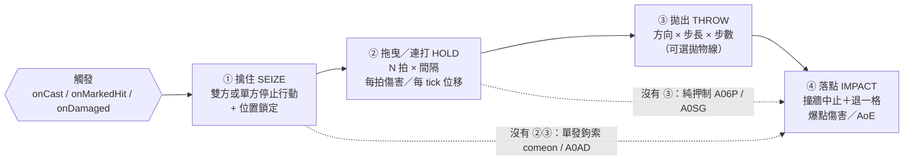

# 抓取系模板家族設計（Grab Template Family）

> **狀態**：設計文件。**這份文件不動任何一行程式碼、不動任何一份 content。** 它要被實作之前，
> owner 要先看過第 4 節（參數表）與第 8 節（鏡頭預算）兩張表。
>
> **owner 的框定（2026-07-26）**：「**抓取系 也是一種模板機制**」。
> 所以抓取**不是** `tpl-leap-strike` 的一個參數，它是自己的家族：leap 的 `applyTo:"target"`
> 只決定「誰的身體跟著那條弧線」，而抓取有 leap 根本表達不出來的相位——
> **擒住 → （拖曳／連打）→ 拋出 → 落點**，外加**由誰觸發**。
>
> **owner 的取值規則（2026-07-26）**：「war3 編輯器設定 設定不了 JASS 實作效果，
> 遇到這種情形一律以 JASS 實際參數為準」。本文所有數字的優先序 **JASS > w3a > tooltip**，
> 每個數字後面都附 `war3map.j` 行號（`tools/w3x-import/out/GoDieEX22s-src/raw/war3map.j`，56,765 行）。
>
> **前置**：#247（`feat/247-leap-from-jass`）已經把拋物線 leap 做成真的原語。
> 本文**建立在它上面，不重做它**。#247 擁有的三個檔案
> （`effectRunner.ts` / `godie-hapm.w.json` / 那條分支）本文一律不碰。
>
> **相關**：`docs/ability-templates.md`「拉扯投擲」家族普查、
> `packages/shared/src/content/templates/expand.ts`（SIM_CAPABILITIES＋expander）、
> `packages/shared/src/sim/movement/leap.ts`（#247 的原語與決定性論證）、
> `docs/design/cast-telegraph.md`（起手時間契約）、
> `docs/_requirements-audit-gaps.md`（本文的需求登錄列）。

---

## 0. 先講一件會改變結論的事

上游掃描把 15 支抓取技找出來了，方向完全正確。但在動手設計之前，我把每一支都回去對了
`war3map.j`，有**五處必須更正**，其中兩處會直接改變模板長相。全部列在 §1。

最重要的一件事在這裡先說：

> **這張地圖自己就有一個共用位移引擎，而且是手寫 JASS，不是 GUI 產生的。**
> `war3map.j:4733-4795`，標題就寫著「**共同擊退觸發**」，用法註解寫著
> `call Set_Move_Value( Unit , Distance , Angle )`。

```jass
// war3map.j:4745-4783  （擊退函式 Move_Func，計時器週期 0.04s，j:4793）
if ( Distance > 0 ) then
   set P1 = GetUnitLoc(MoveUnit)
   set P2 = PolarProjectionBJ(P1, 50.00, Angle)      // 每 tick 走 50 wc3
   call SetUnitPositionLoc( MoveUnit, P2 )
   set P3 = GetUnitLoc(MoveUnit)
   if(DistanceBetweenPoints(P3,P1) < 10) then        // 實際位移 < 10 = 撞牆
       call SetUnitPositionLoc( MoveUnit, P1 )       //   → 退回上一格
       call AddSpecialEffectLocBJ( P1, "...ThunderClapCaster.mdl" )   //   → 撞擊爆點
       call EnumDestructablesInCircleBJ( 150, P1, function Destruct_Judge )
       call SetHandleInt( MoveUnit, "Distance", 0)   //   → 中止
   else
       ... set Distance = Distance - 1               //   → 否則步數 -1
   endif
```

這件事有三個後果：

1. **上游掃描說「全地圖 56,765 行都是 GUI 產生的 `Trig_*` cluster，沒有手寫 helper」是錯的。**
   至少有兩個手寫引擎：這個 `Set_Move_Value`，以及 §1 表 1.5 的傷害事件派發器 `DamageLink`
   （`war3map.j:4907-4956`）。任何只走 `TRIG_FUNCS` 的掃描都看不到它們。
2. **地圖自己已經把「拋飛」抽成原語了**，簽名是 `(unit, 步數, 角度)`，語意是
   「每 0.04s 走 50 wc3，撞到就退回一格並爆一下」。**GGD 該做的是移植這個原語，不是重新發明。**
   三支技能裡各自內嵌的碰撞判定（大熊 `>8` j:51210、Berserker `>=5` j:52127、皇者 `>8` j:54373）
   全部是這支共用函式的抄寫變體——閾值不同只是抄的人手滑，不是設計。
3. **抓取家族的「拋出」相位不該自己寫積分器**，它該呼叫這個位移原語，
   就像 #247 的 leap 呼叫 `startLeap` 一樣。§5 會把這件事論證完。

---

## 1. 對上游掃描的五處更正（每一處都有行號）

| # | 掃描說 | JASS 實際 | 影響 |
|---|---|---|---|
| 1.1 | A091 及喀爾度的磁力球「在身前 180° 扇形展開」 | `角度 = 施法者面向 + (180/level) × i`，`i = 1 … 2×level`（j:28225，迴圈條件 j:28224），掃過的總角度 **= 360°** | 是**整圈**，不是扇形。玩家從背後也會被吸。模板參數是 `spacingDeg = 360/count`，不是 `arcDeg` |
| 1.2 | Saber EX「整個 cluster 沒有任何魔力檢查，描述的 70% 是錯的」 | **`war3map.j:32496`：`GetUnitManaPercent(GetTriggerUnit()) >= 70.00`** | 描述是**對的**，掃描漏看。這是本批唯一一句「shipped 描述與 JASS 完全相符」的敘述，必須保留 |
| 1.3 | A06P 阿修羅是「被動反擊，條件是攻擊者帶 `B02Y` 且是 `U01U` 形態」 | 那兩個不是**閘**，是**傷害加成分支**（j:28995 vs j:28997、j:29000）。真正的閘是 `DamageLink` 的 buff 註冊表：`udg_Des_Buff[5] = 'B02H'`（j:5011），而且 `Des_DNC[5]` 未設 → **buff 命中後被消耗**（j:4941-4944） | 這是「**下標記 → 下次受傷引爆**」，不是常駐反擊。模板的 `trigger` 要有 `onMarkedHit` 這一檔 |
| 1.4 | A0W3 死亡之握「強迫攻擊在 JASS 和 effects 裡都不存在，是 w3a 層的空頭支票」 | **存在**，而且是獨立的第二個 trigger：`Trig_DeathGrip`（j:53083-53090，註解就寫「拉人是共同觸發」）→ `Trig_DeathGrip_effect` 每 **0.05s**（j:53122）對目標下 `IssueTargetOrderBJ(target,"attack",DK)`，共 `8 + 8×level` 次（j:53084/53110） | **(8+8L)×0.05 = 0.8 / 1.2 / 1.6 / 2.0 秒**。tooltip 的「0.8 秒」是等級 1 的值。這給模板一個 `forceAttackSec` 槽，而且是 JASS 實證的 |
| 1.5 | 「沒有手寫 helper」 | `Set_Move_Value`（j:4785，共同擊退觸發）＋ `DamageLink`（j:4907，傷害觸發連結，兩張註冊表：攻擊者 unit-type → trigger、受傷者 buff → trigger） | 見 §0。另外因此多找到兩支抓取：**39-02 無名神風流-朱雀 `A0Z4`**（j:39620 `Set_Move_Value(target,10,caster→target)`，機率閘 `GetRandomInt(1,10) <= level+1` j:39596）與 **77-01 百烈櫻華斬 `A0TV`**（j:49121，400 半徑內全體推 10 步） |

另外三個**非錯誤、但值得記錄的補正**：

* **A0U5 的連打不是「施法者往前走、被害者不動」**。每一擊都先把**被害者**丟到
  `施法者 + 130 wc3（施法者→被害者方向）`（j:52146），再把**施法者**放到
  `被害者 − 100 wc3` 並面向它（j:52150-52151）。是**雙人鎖定的推進**，不是單邊位移。
* **A0U5 的節奏是幾何遞減**：`CD = CD × 0.75` 每擊（j:52176），起始 1.00s。九擊 = STR×9
  （j:52134 的 `Index < 9`、j:52169 的每擊傷害），最後 900（j:52197）——
  所以 tooltip「(力量*9)+900」與 JASS **完全一致**。
* **Saber 每擊之間是 `TriggerSleepAction(GetRandomReal(0.05, 0.30))`**（j:32604）。
  這是 rng，決定性一節（§7）會處理。

---

## 2. 相位模型：抓取是什麼

把 17 支（15 + §1 表 1.5 新增 2 支）攤開之後，抓取只有四個相位，沒有第五個：



四個相位對照 17 支技能（`—` = 該支沒有這個相位）：

| 技能 | 觸發 | ① 擒住 | ② 拖曳/連打 | ③ 拋出 | ④ 落點 | JASS |
|---|---|---|---|---|---|---|
| A09L 30-01 綁架 | onCast | — | — | 瞬移到施法者前 100 | — | j:25326 |
| A0BP 60-02 鎖鏈槍 | onCast | — | — | 同上（共用 trigger `comeon`） | — | j:25326 |
| A0W3 91-01 死亡之握 | onCast | — | 強迫攻擊 (8+8L)×0.05s | 同上（共用 trigger） | — | j:25326 / 53084 |
| A0AD Soulless Hunter | onCast | — | — | 瞬移到施法者腳下 | — | j:25977 |
| A091 05-03 及喀爾度 | onCast | — | — | 2L 個錨點，各自吸 250+100L | — | j:28214/28225/28230 |
| A0Z4 39-02 朱雀 | onCast（機率 (L+1)/10） | — | — | `Set_Move_Value(10 步)` 推離 | 共用引擎爆點 | j:39620 |
| A0TV 77-01 百烈櫻華斬 | onCast | — | — | 400 半徑全體 `Set_Move_Value(10)` | 共用引擎爆點 | j:49121 |
| A0Y7 95-01 謝謝指教 | onCast | — | — | (4+4L) 步 × 50 @0.03s，每步 30 傷 | 撞牆退格 + 龍氣 80 AoE | j:54322/54392/54400 |
| A0CX 84-04 給我蜂蜜 | onCast | **施法者**被擒 | 6 拍 @0.40s，鎖距 100 | 20 步 × 50 @0.04s，**隨機方向** | 撞牆退格 | j:51061/51131/51176/51229 |
| A0U5 52-002 射殺百頭 | onCast | 雙方 | 9 擊，CD×0.75 遞減，鎖距 130/100 | 10 步 × 20（單幀） | 撞牆退格 | j:52064/52146/52207 |
| A0IS 76-01 橡膠戰斧 | onCast | 雙方 | 施法者瞬移到目標前 100 | 41 步拋物線，終點=施法者後方 d | 250 AoE + 落地傷害 | j:36268/36272/36347 |
| Saber EX 20-002 | **onDamaged**（理想鄉窗 + 魔力 ≥70%） | 雙方 | 7 擊，每擊推 10 沿 Saber 面向 | — | 1800 AoE 900，中心前方 350 | j:32496/32564/32573/32638 |
| A06P 11-03 阿修羅 | **onMarkedHit**（`B02H` 消耗） | 雙方 | 押制 11 tick @0.02s | 把**攻擊者**丟出 300 | — | j:5011/29007/29117 |
| A0SG 24-002 來~快點吃吧 | onCast | 雙方 | 51 tick @0.10s，被害者沉到 **−150** 跟著跑 | — | 每 10 tick 400 傷 | j:27336/27373/27382 |
| A000 01-03 畫龍點睛 | onCast | 雙方 | 14 tick @0.04s，被害者甩到隨機方位半徑 150 | — | 落地 300+150L | j:33361/33465/33495 |
| A0J2 00-00 龍虎亂舞 | onCast（擊殺獎勵技） | 雙方 | 5 步同進 | 雙方升空 360/225 後砸下 | STR×20 | j:25709/25761/25796 |
| A0U1 52-02 蹂躪編年史 | onCast | 被害者 | — | 21 tick 拋物線 apex 300 | #247 已實作 | j:51728/51828 |

**讀這張表得到的三個結論，就是模板要拆成三支的理由：**

1. **8 支只有 ③**（鉤索／真空／推離），完全沒有擒住相位 → `tpl-grab-yank` + `tpl-grab-vacuum`。
2. **7 支有完整 ①②③④** → `tpl-grab-seize-throw`。
3. **③ 的位移語意只有兩種**：走地面（步進，撞牆退格）與走空中（拋物線）。
   前者 = 地圖自己的 `Set_Move_Value`；後者 = #247 的 `startLeap`。**抓取不需要第三種積分器。**

---

## 3. 家族命名與檔案落點

沿用既有 `content/ability-templates/` 命名法，**family key 取新的，不覆寫任何 draft**：

| 檔案 | family | 與既有 draft 的關係 | status |
|---|---|---|---|
| `tpl-grab-yank.json` | `grab-yank` | — | v1 enabled |
| `tpl-grab-vacuum.json` | `grab-vacuum` | — | v1 enabled |
| `tpl-grab-seize-throw.json` | `grab-seize-throw` | **取代 `tpl-pull-throw`**（今天是空殼 draft） | v1 enabled |

`tpl-pull-throw` 今天是空殼（`content/ability-templates/tpl-pull-throw.json`：`"params": {}`、
`"status":"draft"`、`"requires":["knockback"]`、`exemplar` 是 `(draft)`），沒有任何 ability 引用它。
**處置：保留 id、把 `family` 指到 `grab-seize-throw`，或直接刪除並更新 `_index.json`。**
不要留兩個都叫「拉扯投擲」的東西——`docs/ability-templates.md:390` 的家族章節同時更名為
「抓取系（拉扯投擲）」並指回本文。

`tpl-charge-push`（`requires:["dash","knockback"]`）**不併進來**：衝鋒是施法者自己位移撞人，
沒有擒住相位；它會跟抓取共用同一支 `displace` 原語，但語意不同，維持獨立 draft。

---

## 4. 參數集

規則（owner 訂的）：**每個參數至少有一支真技能需要它；沒有人用的不進去。**
下表「證據」欄是那支技能的 JASS 行號。單位 `wc3u` 的槽由 expander 的 `toLen()`
（`expand.ts:40`，`GGD_PER_WC3 = 11/600`）換算，**不新增第二個換算常數**。

### 4.1 `tpl-grab-yank`（單發鉤索）

| 參數 | 型別 | 預設 | 誰需要它 | 證據 |
|---|---|---|---|---|
| `landCheck` | enum `none｜onBuff` | `onBuff` | A09L/A0BP/A0W3：命中判定綁在基礎技的 `'Bmlt'` buff 上，沒中就跳「Miss!」 | j:25302 / 25328 |
| `destination` | enum `casterFront｜casterTile｜anchor` | `casterFront` | `casterFront`=comeon 三支；`casterTile`=A0AD | j:25326 / 25977 |
| `destOffset` | number wc3u | `100`（→1.83u） | comeon 三支 | j:25326 |
| `pullStepDistance` | number wc3u, optional | 缺省＝瞬移 | A0Z4/A0TV 走共用引擎的 50/step；comeon 是瞬移 | j:4750 / 25326 |
| `pullStepIntervalSec` | number s, optional | `0.04` | 共用引擎的計時器週期 | j:4793 |
| `forceAttackSec` | number s, optional | 缺省 | **只有 A0W3**：(8+8L)×0.05s 強迫攻擊施法者 | j:53084 / 53110 / 53122 |
| `damage` | scaling, optional | 缺省 | **JASS 裡三支鉤索都不造成傷害**。這個槽的存在理由寫在 §4.5 | — |
| `castTimeSec` | number s | `0.3` | cast-telegraph 契約 | `content/castTimeFormula.ts` |

`castType` 由 expander 固定為 `"targeted"`（JASS 讀 `GetSpellTargetUnit()`，j:25326）。
`targetsEnemies`：**A09L 的描述說「不分敵我」，而 JASS 只排除中立敵對陣營的盟友（j:25285），
所以友軍確實可鉤**——這是 §6.4 的 schema 缺口，不是一個模板參數。

### 4.2 `tpl-grab-vacuum`（環形吸引）

| 參數 | 型別 | 預設 | 誰需要它 | 證據 |
|---|---|---|---|---|
| `anchorCount` | number count | `2` | A091：`2 × level` 個錨點 | j:28224 |
| `anchorRadius` | number wc3u | `200`（→3.67u） | A091 | j:28225 |
| `spacingDeg` | — | 由 expander 導出 `360/anchorCount`，不開放填 | A091（更正 §1 表 1.1：整圈） | j:28225 |
| `pullRadius` | number wc3u | `350`（→6.42u） | A091：`250 + 100×level` | j:28230 |
| `anchorVfx` | ref, optional | ThunderClap | A091 每次吸附放一發 | j:28215 |
| `castTimeSec` | number s | `0.5` | — | — |

**`anchorCount` 與 `pullRadius` 都會隨等級變，而模板 schema 沒有「隨等級變的整數／長度」型別**
（`zParamType = number｜enum｜scaling｜statModifiers`，`content/schema/template.ts:29`；
`zAbilityDef.radius` 也是單一 number）。v1 只能出等級 1 的值並把落差登錄成 `inert`。詳見 §6.4。

### 4.3 `tpl-grab-seize-throw`（擒拿投擲）

分四段列，對應四個相位。

**觸發段**

| 參數 | 型別 | 預設 | 誰需要它 | 證據 |
|---|---|---|---|---|
| `trigger` | enum `onCast｜onMarkedHit｜onDamaged` | `onCast` | onCast=A0CX/A0U5/A0IS/A0SG/A000；onMarkedHit=A06P（`Des_Buff[5]='B02H'`，命中即消耗）；onDamaged=Saber EX | j:5011 / 31982 |
| `armWindowSec` | number s, optional | 缺省 | Saber：`level('A0CT') + 1` 秒的理想鄉窗 | j:32383-32387 |
| `armManaPct` | number ratio, optional | 缺省 | Saber：`>= 0.70` | **j:32496** |
| `procChance` | number ratio, optional | 缺省 | A0Z4：`GetRandomInt(1,10) <= level+1` | j:39596 |

**① 擒住段**

| 參數 | 型別 | 預設 | 誰需要它 | 證據 |
|---|---|---|---|---|
| `seizeTargets` | enum `victim｜caster｜both` | `both` | `both`=A0U5/A0IS/Saber/A06P/A000/A0SG；**`caster`=A0CX（被停住的是大熊自己，被害者只被播死亡動畫）** | j:52066 / 51061 / 51137 |
| `seizeWindupSec` | number s | `0.2` | A0U5 `TriggerSleepAction(0.20)`；A0CX 是 0.40 | j:52068 / 51080 |
| `lockDistance` | number wc3u | `100`（→1.83u） | A0CX/A0U5/A0IS 都是 100；A0U5 的被害者側是 130 | j:51131 / 52076 / 52146 / 36272 |
| `lockSubject` | enum `casterToVictim｜victimToCaster｜mutual` | `casterToVictim` | A0CX/A0U5/A0IS 把**施法者**拉向被害者；Saber 先推被害者再把 Saber 疊上去 = `mutual` | j:51131 / 32573-32575 |

**② 拖曳／連打段**

| 參數 | 型別 | 預設 | 誰需要它 | 證據 |
|---|---|---|---|---|
| `beatCount` | number count | `6` | A0CX 6；A0U5 9；Saber 7；A06P 11；A0SG 51；A000 14 | j:51119 / 52134 / 32572 / 29078 / 27373 / 33459 |
| `beatIntervalSec` | number s | `0.40` | A0CX 0.40；A0U5 起始 1.00；Saber 0.05–0.30（rng，見 §7）；A06P 0.02；A0SG 0.10；A000 0.04 | 各 `InitTrig_*` 的 `TriggerRegisterTimerEventPeriodic` |
| `beatIntervalDecay` | number ratio, optional | 缺省 | **只有 A0U5**：`CD = CD × 0.75` | j:52176 |
| `beatDamage` | scaling, optional | 缺省 | A0U5＝STR/擊；Saber＝**0.6 × 觸發那一擊的傷害**（表達不出來，見 §6.4）；A0SG＝每 10 tick 400 | j:52169 / 32563 / 27384 |
| `beatOrbitRadius` | number wc3u, optional | 缺省 | **只有 A000**：被害者每拍被甩到半徑 150 的隨機方位 | j:33465 |
| `casterFollows` | bool | `true` | A0CX/A0U5/A0IS/Saber 施法者跟著跑；A0Y7/A0Z4 不跟 | j:51131 / 52151 |

**③ 拋出段 ＋ ④ 落點段**

| 參數 | 型別 | 預設 | 誰需要它 | 證據 |
|---|---|---|---|---|
| `throwDistance` | number wc3u | `1000`（→18.33u） | A0CX 1000；A0U5 200；A0Y7 (4+4L)×50；A06P 300；共用引擎 10 步×50＝500 | j:51213 / 52207 / 54322 / 29117 / 4750 |
| `throwStepDistance` | number wc3u | `50`（→0.92u） | A0CX／A0Y7／共用引擎 50；A0U5 20 | j:51229 / 54392 / 52208 / 4750 |
| `throwStepIntervalSec` | number s | `0.04` | 共用引擎 0.04；A0CX 0.04（j:51253）；A0Y7 **0.03**（j:54428）；A0U5 ＝ 0（單幀迴圈） | j:4793 / 51253 / 54428 / 52207 |
| `throwDirection` | enum `casterFacing｜awayFromCaster｜random｜pastCaster` | `awayFromCaster` | casterFacing＝Saber；awayFromCaster＝A0Y7/A0Z4/A0TV；**random＝A0CX**；pastCaster＝A0IS（終點是施法者後方 d） | j:32573 / 54327 / **51176** / 36262 |
| `throwArc` | enum `none｜parabola` | `none` | none＝A 區全部；parabola＝A0IS/A0J2/A0U1 → **委派給 #247 的 `startLeap`** | j:36347 |
| `apexHeight` | number wc3u, optional | 缺省 | 只在 `throwArc:"parabola"` 時有意義；A0IS 600 | j:36347 |
| `perStepDamage` | scaling, optional | 缺省 | **只有 A0Y7**：每滑行 50 距離 30 點魔法傷害 | j:54388 |
| `collisionRule` | enum `none｜stop｜abortSnapBack` | `abortSnapBack` | 地圖的共用引擎與三支內嵌抄寫版全都是 abortSnapBack | j:4753-4759 / 51210 / 52127 / 54373 |
| `collisionEps` | number wc3u | `10`（→0.18u） | 共用引擎 10；A0CX/A0Y7 8；A0U5 5。**建議統一取共用引擎的 10** | j:4753 / 51210 / 54373 / 52127 |
| `impactRadius` | number wc3u, optional | 缺省 | A0Y7 龍氣 80；Saber 900；A0IS 250 | j:54401 / 32638 / 36373 |
| `impactDamage` | scaling, optional | 缺省 | Saber 1800；A0Y7 龍氣 AoE（由 `A0YE` 承載） | j:32526 / 54405 |
| `impactOffset` | number wc3u, optional | 缺省 | **只有 Saber**：AoE 中心在 Saber 面向前方 350 | j:32638 |
| `impactRequiresBuff` | ref, optional | 缺省 | **只有 A0Y7**：龍氣 `'B04Y'` 在身才爆 | j:54398 |
| `finisherDamage` | scaling, optional | 缺省 | A0U5 收招 900；A0CX 最後一擊 `STR·L + 75 + 175·L` | j:52197 / 51184 |

### 4.4 一張參數 × 技能覆蓋表（哪支被誰表達）

| 技能 | 模板 | 完全可重現？ |
|---|---|---|
| A09L / A0BP / A0W3 | grab-yank | ✅（A0W3 需 `forceAttackSec`） |
| A0AD | grab-yank（`destination:casterTile`） | ✅ 但**不移植**（孤兒技，§9） |
| A091 | grab-vacuum | ⚠️ 等級曲線表達不出（§6.4） |
| A0Z4 / A0TV | grab-seize-throw（無 ①②） | ✅ |
| A0Y7 | grab-seize-throw（無 ①②） | ✅ |
| A0CX | grab-seize-throw | ⚠️ EX 分支表達不出（§6.4） |
| A0U5 | grab-seize-throw | ⚠️ 同上 |
| A06P | grab-seize-throw（無 ③；被丟出去的是攻擊者） | ⚠️ 三刀流／霸王色條件加成表達不出（§6.4） |
| Saber EX | grab-seize-throw | ❌ **`beatDamage = 0.6×受擊傷害` 表達不出（§6.4）——這支被卡住** |
| A0IS / A0U1 / A0J2 | grab-seize-throw + `throwArc:"parabola"` → leap | ✅（A0IS 需 §5.2 的裁決規則） |
| A0SG | grab-seize-throw（無 ③） | ❌ **需要「定高 −150 持續 51 tick」的高度剖面，不是拋物線（§6.2）** |
| A000 | grab-seize-throw + `beatOrbitRadius` | ❌ **需要「定高 +400 → 以速率 2000 落下」的高度剖面（§6.2）** |

### 4.5 三個刻意的取捨

* **`damage` 留在 `tpl-grab-yank` 裡，即使 JASS 三支鉤索都不造成傷害。** 理由是機制的：
  `expand()` 回傳**整個** `effects` 陣列（`expand.ts` 的 family switch），ability doc 自己的
  `effects` 是空的，所以模板沒給的東西就永遠不存在。60-02 鎖鏈槍的 tooltip 寫著「額外傷害 150」，
  owner 若要它成真，必須有這個槽。**預設留空**，填了就等於明示「這是 tooltip 主張、JASS 沒有」，
  而不是被靜默塞進去。
* **`collisionEps` 統一取 10 wc3**（共用引擎的值），不各自抄 8/8/5。三個內嵌值的差異在
  JASS 裡沒有任何設計意義，統一之後 `docs/_requirements-audit-gaps.md` 只要登錄一條偏差。
* **時間縮放（150%/250%/600%/5%）與動畫指定（"attack slam"／"death"）不進模板。** 它們是純表現，
  歸 client；`EntityState` 已經有 `sc`（#247 的暫時縮放通道）但沒有 timescale 通道，
  要就另開一條 render hint，不佔模板參數位。

---

## 5. 與 `tpl-leap-strike` 的邊界

### 5.1 結論：**組合，不是繼承；抓取不擁有位移積分器**

抓取家族擁有的是**相位狀態機**與**雙人鎖**。所有實際位移一律委派給兩個原語：

```
GrabSystem（新）
  ├─ ① 擒住      → applyStatus(stun/root) + 自己的 GrabComp（不寫 nav.override）
  ├─ ② 拖曳/連打  → 每 tick 絕對定位（不寫 nav.override，因為兩具身體要維持鎖距）
  ├─ ③ 拋出 none      → startDisplace(...)   ← 新原語，Set_Move_Value 的移植（§6.1）
  │     拋出 parabola → startLeap(...)       ← #247 既有，一行不改
  └─ ④ 落點      → runEffects(onImpact)      ← 與 LeapSystem.detonate 同一條路
```

三個論證：

1. **地圖自己就是這樣分層的。** `Set_Move_Value` 是共用擊退函式（j:4785），
   空中拋物線是另外一套 `SetUnitFlyHeightBJ` 慣用式（#247 已證明十個站點收斂成同一條曲線）。
   抓取技在 JASS 裡從來沒有自己寫過位移數學——它們**呼叫**其中一種。照抄這個分層是最保守的移植。
2. **A0IS 同時是 leap 也是 grab，而它證明的是組合而不是二選一。**
   `Trig_Luf_Axe_Actions`：擒住雙方（j:36268-36269）→ 把**施法者**瞬移到被害者前 100（j:36272）
   → 對**被害者**跑 41 步拋物線（j:36347，`-1.5(i-21)²+600`，正是 #247 的 `h = 4A·u(1-u)`）
   → 落點 250 AoE（j:36373）。若 grab 自己寫積分器，這條弧線就得寫第二遍，
   而 #247 已經把「起飛時就決定合法落點、飛行中脫離平面物理、落地 tick 引爆」
   全部論證過一次（`movement/leap.ts` 的 `resolveLandingPoint` 決策段）。重寫＝重新製造同樣的 bug。
3. **`nav.override` 只有一格，而 #247 已經把「dash 或 leap，不會同時」做成結構保證**
   （`components.ts` 的 `override: DashOverride | LeapOverride | null`）。
   抓取若也去搶那一格，就是第三種 kind 塞進同一格——**但抓取的 ①② 相位不需要那一格**：
   拖曳期間兩具身體是被 `GrabComp` 絕對定位的，不是被單向衝量推的。
   只有 ③ 需要，而 ③ 已經委派出去了。**結果：抓取永遠不直接寫 `nav.override`。**

### 5.2 兩個原語搶同一格時會壞掉的東西（必須有裁決規則）

`nav.override` 的既有語意（`MovementSystem.ts:122-140`）：override 勝過一切轉向、無視 root、
被 hitstop 凍結、被每一條死亡／回合重置路徑清空。#247 的 `startLeap` 直接覆寫該格
（`leap.ts` 的 `nav.override = ov`），**沒有先檢查既有 override**。這造成三個真實故障：

| 情境 | 今天會發生什麼 | 規則 |
|---|---|---|
| 被害者正在空中（自己的 leap 未落地），被抓取的 ③ 拋出 | 第二次 `startLeap` 覆寫第一條弧，**第一條的 `onLand` 永遠不會執行**（LeapSystem 只在 landing tick 引爆），該支技能的落地傷害靜默消失 | **③ 之前先呼叫 `cancelLeap`，並且把被取消的 `onLand` 明確丟棄**（與死亡路徑同語意），不是靜默覆寫 |
| 施法者在 ② 拖曳中被別人的 leap 拋出 | 施法者被兩個系統同時定位，逐 tick 抖動 | **`GrabComp` 存在時，該實體不可成為新 leap/dash 的飛行者**；擋在施法端，理由沿用 #181 的施法回饋管線 |
| 被害者在被抓期間死亡 | `cancelLeap` 會清 override 與 `airborne`，但**不會清 `GrabComp`** → 施法者永遠停在 ② | `DeathSystem` / `ReviveSystem` / 回合重置三條路徑都必須呼叫 `releaseGrab`；**這是 v1 必測項**（§7.3 測試 5） |

系統順序（插進 `SimWorld.step()`，`SimWorld.ts:480-520`）：

```
orderSystem            // 4
grabSystem             // 4a ← 新：相位推進、鎖距定位、③ 起手時委派給 displace/leap
leapSystem             // 4b（#247）
movementSystem         // 5
```

`grabSystem` 必須排在 `leapSystem` **之前**：抓取在同一 tick 內決定「要不要起飛」，
起飛之後由 leapSystem 在同一 tick 推進第一格；順序反了會慢一 tick，而慢一 tick 就是
「起飛 tick 的位置不是擒住 tick 的位置」——正是 #247 花力氣消掉的那類漂移。

---

## 6. 模擬器缺什麼（逐條對程式碼查過，不是查表）

`SIM_CAPABILITIES`（`packages/shared/src/content/templates/expand.ts:54-68`）是誠實帳本。逐條驗證：

### 6.1 `knockback` —— 帳本說 false，**這是對的，但理由要說準**

`nav.override` 的 `kind:"knockback"` **確實存在**（`components.ts:52`），
而且 `combat/damage.ts:404` 每一次夠重的命中都在用它：
`nav.override = { kind:"knockback", dir:kbDir, speed:KB_SPEED, remaining:kbMag }`。
所以「knockback 不存在」是錯的說法；**正確的說法是 #247 已經寫在那條註解裡的那句**：

> 「The knockback in combat/damage.ts is a REACTION to a landed hit, not an EffectDef a template
> author can emit — there is no `knockback` kind.」

抓取的「拋出」**是不是同一件事**？——**同一個積分器，不同治理。** 四點差異，每一點都是真的缺口：

| | 既有 hit-knockback | 抓取的拋出 |
|---|---|---|
| 誰決定方向 | 一律「離開傷害來源」（`damage.ts:373`） | 四種：`casterFacing` / `awayFromCaster` / **`random`** / `pastCaster` |
| 距離上限 | `KB_OVERRIDE_MAX = 8`（`damage.ts:84`） | A0CX 要 **18.33u**，超出上限 2.3 倍 |
| 撞牆行為 | `moved + 1e-6 < stepLen` → `nav.override = null`，**停在牆邊，沒有退格、沒有酬載**（`MovementSystem.ts:137`） | 地圖規定：**退回上一格 ＋ 爆點 ＋ 中止**（j:4753-4759） |
| 誰能發動 | 只有 `applyDamage` 內部 | 內容作者（模板參數） |

**結論**：不新增 capability key，**把 `knockback` 留著，並在 `displace` EffectDef 落地時翻成 true**。
理由：`tpl-pull-throw` 與 `tpl-charge-push` 的 `requires` 已經寫著 `"knockback"`，
另立 `displace` key 會讓那兩張卡的紅色徽章永遠不會轉綠——而 `missingCaps()`（`expand.ts:70`）
就是靠這個 key 比對的。

需要新增的**程式**（不是 key）：

```ts
// packages/shared/src/sim/movement/displace.ts   ← 新檔，Set_Move_Value 的移植
startDisplace(world, id, {
  dir,                 // 起手一次算好的單位向量（normalize；sqrt 是 IEEE-754 保證正確捨入的）
  stepDistance,        // 0.92u  (= 50 wc3)
  stepCount,           // 整數，起手一次算好（20 = 1000/50）
  stepIntervalTicks,   // 整數，Math.round(0.04 × 30) = 1
  collisionRule,       // "abortSnapBack"
  collisionEps,        // 0.18u  (= 10 wc3)
  perStepEffects,      // A0Y7 的每步 30 傷
  onImpact,            // 撞牆／走完時執行的 EffectDef[]
  casterId, rank, origin, slot,
})
```

### 6.2 `leap` —— #247 已翻 true，**但有兩支抓取用不到它**

`A0SG` 是**定高 −150**（沉在地面下）持續 51 tick（j:27336 / 27373）；
`A000` 是**定高 +400**（速率 600 上升，j:33361）→ 結束時以速率 2000 落下（j:33486）。
兩者都不是 `h = 4A·u(1−u)`。缺的是一條**「持高 → 以速率 R 釋放」的高度剖面**。
建議：`leap.ts` 增一個 `mode: "parabola" | "hold"` 與 `holdHeight` / `releaseRate`，
**由 #247 的擁有者做，不由抓取這一批做**（那是 leap 原語的形狀，不是抓取的形狀）。
在它落地之前，A0SG 與 A000 的抓取部分維持 `throwArc:"none"`，並把差異登錄成 `inert`。

### 6.3 需要新增的 capability key：`grab`（p2）

查過確實不存在的東西：

* **沒有任何元件把兩個實體綁在一起。** `SimWorld` 的 store 全是 `Map<EntityId, X>` 單體狀態；
  `nav.attackTarget` 是「我想打誰」，不是「我抓著誰」。
* **沒有相位時間軸。** 唯一的多 tick 技能狀態是 `LeapOverride`（單段弧）與
  `abilities.cast`（起手）。連打／拖曳需要 `(phase, phaseTicksLeft, beatIndex)`。
* **`applyStatus` 停得住人，綁不住位置。** stun/root 只讓 `MovementSystem` 跳過轉向與步進
  （`MovementSystem.ts:96-116`），無法讓 A 每 tick 被搬到「B 前方 1.83u」。

所以 `grab: { p: 2, available: false }` 是誠實的新條目，而且它是**唯一一條**新的。
`tpl-grab-*` 三張卡的 `requires` 都寫 `["grab"]`，`tpl-grab-seize-throw` 額外寫 `"knockback"`，
用到 `throwArc:"parabola"` 的技能額外寫 `"leap"`。

**不需要**的（避免多要）：

* `periodicDamage`（帳本 p3 false）：連打的節拍活在抓取自己的時間軸裡，
  正如落地傷害活在 `LeapOverride.onLand` 裡。**不要為了抓取去翻這一格。**
* `summon`（p3 false）：A0CX 的鏡像 `'h023'`、隱形踩踏兵 `'hfoo'`、A091 的磁力球 `'o00H'`
  在 GGD 都是 `spawnVfx`（`effect.ts` 既有 kind）＋直接 AoE，不需要真的召喚單位。
* `combo`（p3 false）：`tpl-lock-combo` 的 key，抓取不是連段。
* `dash`（已 true）：抓取不需要它，但 §6.1 的 `displace` 落地後 `tpl-charge-push` 會兩個都要。

### 6.4 四件 **schema** 缺口（不是 capability，是型別）

1. **`Scaling` 沒有「來自受擊傷害」的來源。** Saber EX 的每擊是 `GetEventDamage() × 0.60`
   （j:32563）。`Scaling = { flat?, perRank?, ratios?: {stat, coeff}[] }`（`sim/effects/effect.ts:17-21`），
   `stat` 是 `Stat` 列舉，沒有 `incomingDamage`。**Saber EX 因此被卡住**，
   除非 `Scaling` 長出 `incomingCoeff?: number` 且 `EffectContext` 帶入觸發傷害值。
2. **沒有「隨等級變的整數／長度」。** `zParamType` 只有 `number｜enum｜scaling｜statModifiers`，
   `zAbilityDef.radius` 是單一 number。影響：A091 的 `2L` 顆球與 `250+100L` 半徑、
   A0Y7 的 `4+4L` 步、A0W3 的 `(8+8L)` 強迫攻擊 tick、A06P 的三刀流／霸王色條件加成。
   v1 全部出等級 1 的值 ＋ `inert` 註記；正解是讓 `perRank` 能掛在任何數值槽上。
3. **沒有「EX 模式」全域狀態。** `udg_EX_Mode[player]`（j:51181 / 32481）是每玩家的持久旗標，
   A0CX 與 Saber EX 的傷害式都分支在它上面。GGD 有 EX **技能格**，沒有 EX **模式**。
   A0CX 的 `STR×9`（EX）與 `STR×level`（一般）v1 只能出後者。
4. **沒有「可打友軍」的目標模式。** `targetsEnemies` 是布林；A09L 的 JASS 只排除
   中立敵對陣營的盟友（j:25285），友軍是合法目標。要嘛新增 `targets: "enemies"|"any"`，
   要嘛把「不分敵我」登錄成明示落差。

### 6.5 一件刻意**不**移植的東西：`'Avul'` 無敵

A0U5/A0IS/Saber/A0SG/A000 在擒住期間都給雙方 `'Avul'`（例如 j:52064-52065），
每一擊再開關一次讓自己的傷害進得去。GGD 的 `HealthComp` 沒有無敵欄位（查過 `components.ts`）。

**判斷：那是實作噪音，不是設計意圖。** 在 WC3 裡它的作用是防止被害者在動畫中途死掉、
讓觸發序列崩掉；GGD 這邊 `DeathSystem` ＋ §5.2 的 `releaseGrab` 已經處理了同一件事。
**照抄反而會產生一個地圖裡不存在的 3v3 問題**：隊友無法救援被抓的人。
建議 v1 **不加無敵**，並在 `docs/_requirements-audit-gaps.md` 登錄成明示偏差；
若 owner 要，再開一個 `grabDamageImmune: bool` 參數（預設 false）。

---

## 7. 決定性

30Hz 鎖步、`Math.random` 在 `sim/**` 被禁、三角函數不得進 sim 路徑。
抓取是**最容易破壞決定性的形狀**：有可變 tick 數、有距離停止條件、有隨機方向、有隨機節拍。
逐項處理：

### 7.1 六條規則

1. **步數在擒住當下就算成整數，之後不再算。**
   `stepCount = Math.round(throwDistance / throwStepDistance)`、
   `stepIntervalTicks = Math.max(1, Math.round(intervalSec × TICK_HZ))`。
   JASS 的 `exitwhen Distance > 0` 本來就是整數遞減迴圈（j:4745）——
   **不要**移植成 `while (remaining > 0)` 的浮點累減。
2. **位置是絕對函式，不是累加。** 第 k 步的目標點 ＝ `origin + dir × (stepDistance × k)`，
   照抄 A0U5 的寫法（j:52208 `PolarProjectionBJ(P1, 20 × Int, Angle)`，
   它就是對**起點**取極座標，不是對上一格）。#247 的 `leapPosAt` 已經證明這個形式
   對 hitstop 凍結、replay seek、快照中途接手都免疫。
3. **碰撞判定是分支，不是數值調整。** 走完一步後比較「意圖位移」與 `moveWithCollision`
   實際達成的位移；差距 > `collisionEps` → 退回上一格（一個賦值）並執行 `onImpact`。
   浮點只參與一次比較，不進入下一步的輸入。
4. **沒有三角函數。** JASS 的 `AngleBetweenPoints` ＋ `PolarProjectionBJ` 全部改寫成向量：
   `dir = normalize(b − a)`、`polar(p,d) = p + dir·d`。`normalize` 用 `sqrt`——
   **`sqrt` 是安全的**（IEEE-754 強制正確捨入，和 `+ − × ÷` 同級），
   `sin/cos/pow/atan2` 才是 ECMA-262 允許實作自訂結果的那一類。與 #247 的靜態禁令一致。
5. **rng 只有一個來源，而且只抽一次、在擒住那一 tick 抽。**
   A0CX 的拋飛方向是 `GetRandomDirectionDeg()`（j:51176）、A000 每拍甩到隨機方位（j:33465）、
   A0Z4 的 `GetRandomInt(1,10)` 機率閘（j:39596）。全部走 `world.rng`（mulberry32，
   `sim/math/rng.ts`）。**關鍵細節：在 ① 擒住 tick 就抽完並存進 `GrabComp`**，不要等到 ③ 才抽。
   理由是抽籤順序：hitstop 可以把 ③ 往後推任意 tick 數；若在 ③ 抽，同一場比賽的 rng
   消費順序就會被凍結時間改變，而 rng 狀態是全域的——一次錯位會讓**其他系統**
   後續的每一次擲骰都不同。抽籤點必須是相位轉換裡最早、最不可延遲的那一個。
   A000 的「每拍一個隨機方位」則是每拍抽一次，按實體 id 升序，`beatIndex` 整數推進，順序本身決定。
6. **Saber 的隨機節拍不移植。** `TriggerSleepAction(GetRandomReal(0.05,0.30))`（j:32604）
   是 WC3 為了讓連擊看起來不機械。它每擊消耗一次 rng，換來的只有視覺抖動。
   **改為固定 `beatIntervalSec`，抖動交給 client 的動畫層**（不影響 sim）。登錄成明示偏差。

### 7.2 digest

照 #247 的先例（`SimWorld.ts` 的 digest 只在 `airborne` 存在時才混入），
`GrabComp` 也只在存在時混入，且混入 `(id, victimId, phase, phaseTicksLeft, beatIndex)`。
理由同 #247：對沒有抓取的世界，雜湊值與加功能前逐位元相同，
#191 的 disarmed-golden canary 不會被無謂地打紅。

### 7.3 會證明它的測試（七條，全部可寫成 `grab.test.ts`）

| # | 測試 | 為什麼這條不能省 |
|---|---|---|
| 1 | 同 seed、同 intents，在第 40 tick 發動一次完整抓取，跑 300 tick，**逐 tick digest 全等** | 基本盤 |
| 2 | **負控制**：同一場不發動抓取，digest 序列必須**不同** | 沒有它，第 1 條在「抓取根本沒進雜湊」時也會綠 |
| 3 | 拋出中途 `hitstop` 凍結 3 tick → 位置與 `beatIndex` 不動，解凍後**接在同一格**（不是跳到「本來該到的地方」） | 絕對函式形式的唯一證明 |
| 4 | **rng 抽籤位置**：同一場比賽把抓取的 hitstop 由 0 改成 3 tick，抓取結束時 `world.rng.state` **必須相同** | §7.1 第 5 點的機器版本；它就是「別在 ③ 抽籤」的守門員 |
| 5 | 被害者在 ② 中途死亡／施法者在 ② 中途死亡／回合重置 → 三條路徑都要 `GrabComp` 被清、雙方 `nav.override` 為 null、沒有殘留 stun | §5.2 那三個故障 |
| 6 | 同一 tick 內兩個施法者抓同一個被害者：只有 id 較小者成立，另一者拿到失敗理由 | 沒有它，順序相依會在 3v3 亂鬥裡變成不可重現的 desync |
| 7 | **靜態禁令**：`grab.ts` / `displace.ts` 原始碼不得出現 `Math.(random｜sin｜cos｜tan｜atan2?｜pow｜exp｜log)`／`Date.now`／`performance.now`（`sqrt` 白名單） | 直接抄 #247 `leap.test.ts` 的 `STATIC BAN` 那一條 |

再加一條**跨系統**的：把一場含抓取的比賽丟進 #175 的 replay（seed ＋ inputs），
重播出來的 digest 序列必須與原場相同。

---

## 8. 鏡頭預算（先算，不要事後才發現看不到）

#93 的教訓是「沒被看見的效果等於零」，#247 又踩了一次同一個坑。
所以這一節先算，而且算法寫出來讓人能複驗。

### 8.1 現行鏡頭的可視錐（可複驗）

參數全部來自程式，不是估的：`CAMERA_PITCH_RAD = 68°`、`DOLLY_MIN = DOLLY_DEFAULT = 10`
（`apps/client/src/render/CameraRig.ts:36-46`）；arena 相機沒有設定 `fov`
（`.fov =` 只出現在 intermission 與 login 場景），所以是 Babylon 預設**垂直 fov 0.8 rad**。

```
眼睛      = target + (0, 10·sin68, −10·cos68) = target + (0, 9.272, −3.746)
垂直半視角 = 0.4 rad = 22.92°     水平半視角(16:9) = 36.93°
上緣平面   = 68° − 22.92° = 45.08°  ← 斜率幾乎正好 1
```

於是有一條非常好記的預算式（dz ＝ 沿畫面「往上」方向離開鏡頭目標的距離，單位 GGD）：

> **可見天花板 C(dz) ≈ 0.5515 × dolly − dz**
> 在出貨的 dolly = 10：**C(0) = 5.52u**，且**每往畫面上方跑 1u，天花板就掉 1u**。
> 地面可視帶沿視軸只有 **z ∈ [−3.89, +5.50]**（深度 9.39u）。

### 8.2 這就是 #247 的弧線看不見的原因，而且**地圖自己的鏡頭證明了它**

`tpl-leap-strike` 的 `apexHeight` 預設 600 wc3 ＝ **11.0u**。代入：
`4A·u(1−u) ≥ 5.52` ⟹ **70.6% 的飛行時間在畫面外**（把水平位移也算進去只會更糟）。

為什麼在 WC3 裡不會？**因為原圖的遊戲鏡頭本來就遠得多**——這不是外部常識，是這張圖自己的資料：

```jass
// war3map.j:4470-4471（gg_cam_Camera_001；4480-4481 的 002、4510-4511 的 014 同值）
call CameraSetupSetField( gg_cam_Camera_001, CAMERA_FIELD_ANGLE_OF_ATTACK, 304.0, 0.0 )   // = −56°
call CameraSetupSetField( gg_cam_Camera_001, CAMERA_FIELD_TARGET_DISTANCE, 2196.2, 0.0 )
```

2196.2 wc3 × 11/600 ＝ **40.26 GGD 單位**，俯角 56°。同一條公式算下去：

| 鏡頭 | 等效 dolly | 俯角 | 目標正上方天花板 |
|---|---|---|---|
| **原圖遊戲鏡頭**（j:4471） | 40.26 | 56° | **18.71 u** |
| GGD 出貨鏡頭 | 10 | 68° | **5.52 u** |

**原圖有 18.7u 的頭頂空間，我們有 5.5u。** 600 wc3 的 apex 在那裡舒舒服服，
在這裡高出天花板兩倍。這不是「原作數值太誇張」，是**框變小了 3.4 倍**——
與 `ggd-faithful-import-over-rescale` 這條記憶完全一致：**不要偷偷改內容去遷就守衛，
要嘛知情地把守衛抬高，要嘛明示地記下偏差。**

### 8.3 抓取的可視預算（三條硬規定 ＋ 一條相機回應）

| 相位 | 預算 | 現況 |
|---|---|---|
| ① 擒住／② 連打 | **必須 100% 可見**：鎖距 ≤ 2.4u、拋高 ≤ 3.0u | ✅ **全部 JASS 鎖距都過關**：100 wc3 ＝ 1.83u、130 wc3 ＝ 2.38u。A 區抓取的拋高全是 0 |
| ③ 拋出 | 沿畫面上方**只有 5.5u 額度** | ❌ A0CX 要 18.33u（3.3×）、A0Y7 滿級 18.33u、共用引擎 9.17u（1.7×） |
| ④ 落點 | **撞擊那一 tick 必須在框內**，無例外 | 需要相機回應 |

③ 的解法**不是砍數值**（那正是 owner 反對的 rescale），而是兩段式相機回應，
兩段都只在**本機玩家是當事人（施法者或被害者）**時才啟動，**全部在 client，不回饋 sim**：

1. **交棒（主）**：③ 起手時把 follow 目標由施法者換成**被害者**，落點後 0.3s 交回。
   代價 0，可見度 100%，而且這就是原圖的視角語意——WC3 玩家操作的單位在 ③ 之後被
   `SelectUnitForPlayerSingle` 重新選取（j:29133、j:36385-36386），視野自然黏回去。
2. **拉遠（輔）**：`grabSeize` 事件帶 `(apex, throwDistance)`，
   相機以既有的瞬時 dolly 位移機制（`CameraRig.ts:402-465` 的 EX punch-in，換個號誌方向）
   拉遠 `Δ = clamp((apex + throwDistance×0.5)/0.5515 − dolly, 0, +8)`，
   0.25s ease-in、落點後 0.4s ease-out。上限 +8（dolly 10→18，天花板 5.52→9.93）是刻意的：
   再遠就開始像換了一個遊戲。

### 8.4 驗收方式（照 #93 的做法，不靠人眼判斷）

用 #93 已經驗證過的 **frame-stepped 截圖**手法：以出貨的 `CameraRig` 逐 tick 推進，
把飛行者的世界座標投影到螢幕座標，斷言：

* ①② 的每一 tick，雙方都在 `[0,1]²` 內 → **100%**（硬失敗）
* ③ 的 tick 中至少 **60%** 在框內（ratchet，只能往上調）
* ④ 撞擊 tick 在框內 → **100%**（硬失敗）

寫成測試檔而不是判斷題，才不會第三次踩同一個坑。

---

## 9. 重綁順序（含 JASS 實值）

排序準則：①描述 vs 效果的落差嚴重度、②英雄是否在出貨名單、③是否會被 §6 卡住。
長度換算一律 `× 11/600`；傷害公式用 JASS 值，力量→AD 的對應等 #248 落地再收斂。

| 序 | 技能 / content | 模板 | JASS 實值 | 卡點 |
|---|---|---|---|---|
| **1** | 60-02 鎖鏈槍 `godie-h00l.w` | grab-yank | `landCheck:onBuff`、`destination:casterFront`、`destOffset:100`(1.83u)、range 300/500/700/900 → **5.5/9.17/12.83/16.5**、cd 35、**JASS 無傷害**。現行 doc 把 tooltip 的 150 做成**施法者自己的護盾**，是全批最嚴重的反向錯誤 | — |
| **2** | 30-01 綁架 `godie-orkn.q` | grab-yank | 同上；range 300…1500 五階 → **5.5/9.17/12.83/16.5/20.17**、cd 15；`castType` 必須從 `self` 改 `targeted` | 「不分敵我」需要可打友軍的目標模式（§6.4-4） |
| **3** | 91-01 死亡之握 `godie-h02s.q` ＋ `godie-h02z.q` | grab-yank | range 450 平（**8.25**）、cd 40、**`forceAttackSec = (8+8L)×0.05` ＝ 0.8/1.2/1.6/2.0** | — |
| **4** | 95-01 謝謝指教 `godie-e00j.q` | grab-seize-throw（無①②） | 步數 `4+4L`、步長 50(**0.92u**)、間隔 **0.03s**、每步 30 魔法、`awayFromCaster`、`abortSnapBack`、龍氣 `B04Y` → 80 AoE。**滿級真實距離 1000 wc3（18.33u），tooltip 的 400 是等級 1** | 步數隨等級（§6.4-2） |
| **5** | 84-04 給我蜂蜜 `godie-e00v.r` | grab-seize-throw | `seizeTargets:caster`(!)、`lockDistance:100`、6 拍 @0.40s、拋 1000(**18.33u**)/50/0.04s/**random**、eps 8→10、傷害 `STR×L + 75 + 175L` | EX 分支（§6.4-3）；鏡頭 §8.3 |
| **6** | 05-03 及喀爾度 `godie-hblm.e` ＋ `godie-h021.e` | grab-vacuum | 錨點 `2L` @半徑 200(**3.67u**)、間隔 `360/(2L)`、吸附半徑 `250+100L` → L1 **6.42u**。**被吸到的是「球」不是施法者身旁**，描述要改 | 等級曲線（§6.4-2） |
| **7** | 52-002 射殺百頭 `godie-hapm.ex` | grab-seize-throw | 雙方擒住、鎖距 130/100、9 擊、`decay 0.75`、收招 900、拋 200(**3.67u**)/20/單幀、eps 5→10 | EX 分支；**`godie-hapm.w` 由 #247 佔用，只動 `.ex`** |
| **8** | 11-03 阿修羅 `godie-u01u.e` ＋ `godie-udre.e` | grab-seize-throw（無③） | `trigger:onMarkedHit`（`B02H` 消耗）、押制 11 tick @0.02s、傷害 `150L + 150`（＋STR×2 帶三刀流、＋STR×3 阿修羅形態）、**攻擊者**被丟出 300(**5.5u**) | 條件加成（§6.4-2）；描述要從「主動斬擊」改成「標記引爆」 |
| **9** | 01-03 畫龍點睛 `godie-hart.e` | grab-seize-throw ＋ `beatOrbitRadius:150` | 14 拍 @0.04s、隨機方位半徑 150(**2.75u**)、傷害 `300+150L` ＝ 450/600/750/900（**現行 content 的數字剛好對，機制全錯：JASS 是雙人空中雜耍，不是龍捲風；裝甲 −3 在 JASS 裡不存在**） | 定高剖面（§6.2） |
| **10** | 20-002 ExcaliburMAX `godie-e002.ex` | grab-seize-throw | `onDamaged` ＋ `armWindowSec = L+1` ＋ **`armManaPct 0.70`（§1 表 1.2）**、7 擊每擊推 10、收招 1800 @半徑 900(**16.5u**) 中心前方 350(**6.42u**) | **被 §6.4-1 卡住**：每擊 `0.6×受擊傷害` 表達不出 |
| **11** | 24-002 來~快點吃吧（hero 24 EX） | grab-seize-throw（無③） | 51 tick @0.10s、每 10 tick 400 傷、被害者定高 **−150** 跟著跑 | 定高剖面（§6.2） |
| **12** | 39-02 朱雀 `A0Z4` / 77-01 百烈櫻華斬 `A0TV` | grab-seize-throw（無①②） | 共用引擎：10 步 × 50、0.04s、eps 10；A0Z4 機率 `(L+1)/10`、A0TV 半徑 400(**7.33u**) 全體 | 需先確認兩支的 content 綁定 |

**不移植**（回報即可，不入模板）：

* `A0AD` Soulless Hunter——全圖只出現在自己的閘（j:25965），沒有任何單位持有它，
  `HERO_NUMBERS` 裡沒有，是 DotA 時代的遺留。
* `A0J2` 00-00 龍虎亂舞——擊殺獎勵技（`UnitAddAbilityBJ('A0J2', GetKillingUnitBJ())`，
  j:13868 / 13976），屬於場地規則不屬於任何英雄卡，今天沒有槽位放它。

---

## 10. 這份文件**沒有**授權的事

1. 不授權改 `content/**` 任何一個位元組。§9 的重綁順序是**提案**，逐支要走
   `docs/_requirements-audit-gaps.md` 的登錄與 owner 打勾。
2. 不授權碰 `packages/shared/src/sim/effects/effectRunner.ts`、
   `content/abilities/godie-hapm.w.json`、`feat/247-leap-from-jass` —— 那是併行工作流的。
   §5 的 `startLeap` 委派**要等 #247 併入 main 之後**才動工。
3. 不授權為了畫面砍 JASS 數值。§8 的解法是相機回應與明示偏差登錄，不是 rescale。
4. 不授權在 sim 裡讀相機。§8.3 的一切都在 client，靠 `world.emit` 的事件單向流出。

## 11. 建議的落地切法

| 階段 | 內容 | 可獨立驗收 |
|---|---|---|
| A | `movement/displace.ts`（`Set_Move_Value` 移植）＋ `displace` EffectDef ＋ `knockback` 翻 true ＋ §7.3 測試 1/2/3/7 | ✅ 不需要抓取也有用（`tpl-charge-push` 直接受益） |
| B | `GrabComp` ＋ `GrabSystem` ＋ `grab` capability ＋ §7.3 測試 4/5/6 | ✅ |
| C | 三張模板卡 ＋ expander family ＋ `paramsSchema.test.ts` 的 inert 對帳 | ✅ |
| D | 相機回應（交棒 ＋ 拉遠）＋ §8.4 的 frame-stepped 驗收 | ✅ |
| E | 依 §9 逐支重綁，每支一次 `pnpm content:build` | 逐支 |
| F | （被擋住的）`Scaling.incomingCoeff` → 解鎖 Saber EX；`leap` 定高剖面 → 解鎖 A0SG / A000 | 需要 owner 決定優先序 |
