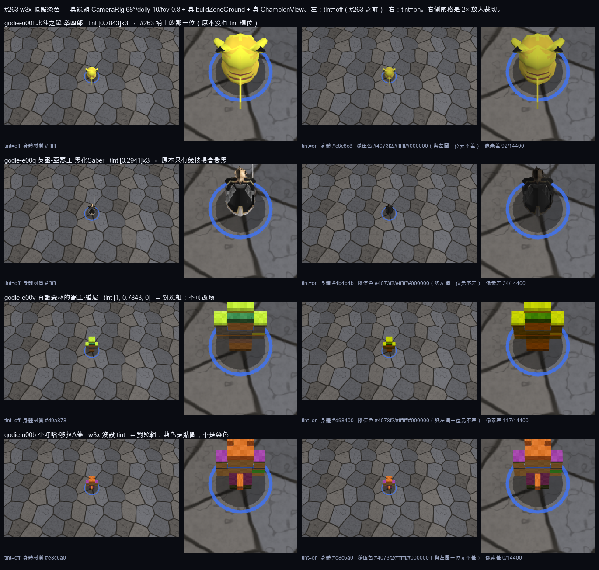

# w3x 頂點染色 —— 沒讀到設定的角色重新上色 (#263)

Owner 的原話：

> 小熊維尼(黃)、小叮噹(藍) 都有為角色特別調整顏色，請你清查沒有讀取 w3x 設定的角色重新上色

**這兩個例子是兩種完全不同的機制，而這正是整張表的分類依據。**

| | 維尼 `E00V` | 小叮噹 `N00B` |
|---|---|---|
| w3x 有效 RGB | **255,200,0**（red 繼承自 stock `Ewrd`，green/blue 是地圖自己設的 `uclg=200 uclb=0`） | **255,255,255** —— 完全沒染色 |
| 黃/藍從哪來 | `tint` 乘在白熊 `PolarBear` 貼圖上 | 那顆 `StormPandarenBrewmaster` mdl 的**貼圖本身就是藍熊貓** |
| 本任務能做什麼 | 已經對了（#49 就做了），本次只負責**不要弄壞** | **什麼都不能做**：w3x 沒設 tint，硬上色＝發明顏色 |

所以 #263 的授權範圍是「把 w3x **已經有**的值接回去」，不是「幫沒有顏色的角色配色」。
體素換膚（#231/#264）才是「生成」，這邊是「還原」。

---

## 為什麼會有漏的 —— 繼承鏈少了一段

`uclr/uclg/uclb`（Art Red/Green/Blue Tint，0–255，WC3 預設 255）**從來沒進過匯入器的白名單**
（`w3xlib/stats.py` `UNIT_FIELD_CODES` / `src_objects.py` `_UNIT_CODES`），所以
`OBJECTS.json` 裡連欄位都沒有（`grep -c uclr` → 0，該檔早於 `rawMods` 通道）。
唯一的 ground truth 是 `tools/w3x-import/out/GoDieEX22s-src/raw/war3map.w3u`。

**缺一個通道 ≠ 0，是「繼承」。** 正確的解析順序（`resolve_unit_tints.py` 實作並跑過）：

1. 該 entry 自己的 `uclr/uclg/uclb` mod
2. → 它的 `base_id`，**如果那個 base 本身也是 w3u 的一筆（custom 或 original 表）** ← **#49 漏掉的就是這段**
3. → 沿 base 鏈找暴雪原廠 `Units\UnitUI.slk` 的 `red/green/blue`（837 列，193 列不是 255）
4. → 都沒有才是 **255**（未染色），**不是 0**

三個通道**各自獨立**解析：維尼的 red 走第 3 步、green/blue 走第 1 步。
把缺通道當 0 會把整份名冊塗黑；跳過 SLK 會漏掉 6 位純靠繼承上色的英雄。

---

## 三種原因，三種修法

### 【第 1 類】匯入器漏讀 → content 缺值。**全名冊只有 1 位。**

| championId | 名稱 | w3x unit | 有效 RGB | 寫入 tint | 為什麼漏 |
|---|---|---|---|---|---|
| `godie-u00l` | 北斗之鼠 - 拳四郎 | `U00L`（base `Umal`） | 200,200,200 | `[0.7843, 0.7843, 0.7843]` | 自己沒設，從 **w3u original 表的 `Umal`** 繼承（第 2 步）。它是 25 號拳四郎的**變身型**，本體 `godie-umal` 已經有 0.7843 —— 畫面上會看到「變身把灰色洗掉」 |

其餘 20 位（#49 落地的）逐位重算後**完全相符**，誤差 0。

### 【第 2 類】content 有值、客戶端沒套用 → 4 個畫面

#49 只在競技場 `EntityViewRegistry.applyTint` 套色。以下四個畫面顯示的是**原色**：

| 畫面 | 檔案 | 修法 |
|---|---|---|
| 選角 3D 展示台 | `ui/panels/champselect/ProfileBlock.tsx` → `StorePreviewCanvas` | `championId` 傳進 `StorePreview.show` |
| 大廳商店預覽 | `ui/platform/StoreScreen.tsx` → 同上 | 同上 |
| 回合勝者卡 | `render/RoundWinnerStage.ts` | `ctx.championId` 轉給 previewer |
| 中場商店櫃檯 | `render/intermission/IntermissionScene.ts` | `setChampion(..., championId)` |

四個都改成呼叫**同一支** `applyModelTint` —— gamma 校正（PBR 要 `t^2.2`）、
隊伍色 mesh 排除清單、材質 clone/release 都是共用碼，不是四份會各自走鐘的實作。

順帶：`GameApp.roundWinnerModelDoc` 的註解原本宣稱回合勝者「vertex tint apply exactly
as they do in-world」——**那句是假的**（`model@1` 根本沒有 tint 欄位），已改掉。

### 【第 3 類】模型本身就沒有可染色的原始材質 → **不上色，只回報**

42 位 w3x 來源的角色 `modelKey` 指向 4 具共用方塊人（`champ.sela` / `champ.thorne` /
`champ.skin.barbarian` / `champ.skin.rogue`），顏色由 championId 的 FNV-1a hash 決定
（`views/voxelLook.ts`），**完全沒有讀 w3x 的 `umdl`**。角色的「真正顏色」在原圖躺在那顆
mdl 的貼圖裡，轉檔時整個丟掉了。小叮噹正是這一類。

- 40/42 在 `data/blizzard-overlay/MANIFEST.json` 有真模型，但 overlay 預設只在 dev build 開
  —— owner 自己看得到藍色小叮噹，正式站台看到的是隨機色方塊人。
- 2/42 連 overlay 都沒有：`godie-o02n`（曹操孟德·阿瞞大人）、`godie-u011`（克勞薩先生，
  w3x 模型是 `collision.mdl` —— 無幾何的 dummy，原圖本來就沒有可見身體）。
- `sela` / `thorne` 是自製角色，沒有 w3x 來源，**不是缺陷**。

**單純補 tint 欄位對這一類沒有用** —— 原圖沒設 tint。修法屬於 #81/#116（模型替身正式化）
或 #264（體素換膚 palette override），不屬於 #263。

---

## 隊伍顏色怎麼共存

不同 **mesh**，不是不同通道：`modelTint.ts` 的
`UNTINTED_MESH_SUFFIXES = ["-teamring", "-shadow", "-teamband"]` 讓地面環、影子與胸口條
永遠不被染。角色染色只吃身體材質。這是靠 mesh 名稱字尾比對的隱性契約，
`modelTint.test.ts` + 本任務的 `tint263-team-colour` 兩邊都釘住它。

四個新增的套色點全部走預設排除清單，沒有一個自己寫 `albedoColor *= tint`。

---

## 前後對照（真鏡頭實拍）



`docs/_tint-263-before-after.png` —— 每一列左邊是 `tint=off`（#263 之前的行為）、右邊是
`tint=on`，中間兩格是 2× 放大裁切。相機是真的 `CameraRig`（68° / dolly 10 / fov 0.8），
地板是真的 `buildZoneGround`，角色是真的 `ChampionView`。
兩張之間**唯一**的差別是有沒有呼叫 `applyModelTint`。

| 角色 | tint | 身體材質 off → on | 隊伍色 (band/ring/shadow) | 像素差 |
|---|---|---|---|---|
| `godie-u00l` 拳四郎（**本次補上**） | [0.7843]×3 | `#ffffff → #c8c8c8`（體素·Standard，原值）<br>glb `#ffffff → #959595`（PBR，0.7843^2.2） | `#4073f2` / `#ffffff` / `#000000`，**前後相同** | **92** / 14400 |
| `godie-e00q` 黑化Saber | [0.2941]×3 | `#ffffff → #4b4b4b`；glb → `#111111` | 同上，**前後相同** | **34** / 14400 |
| `godie-e00v` 維尼（對照組） | [1, 0.7843, 0] | `#d9a878 → #d98400`（藍歸零、綠 ×0.784、紅不動） | 同上，**前後相同** | **117** / 14400 |
| `godie-n00b` 小叮噹（對照組） | 無 | `#e8c6a0 → #e8c6a0` **完全不動** | 同上，**前後相同** | **0** / 14400 |

小叮噹那一列的 `0` 正是它該有的樣子：w3x 沒設 tint，所以套色路徑**一個材質都不碰**。
它同時證明另外三列的非 0 像素差是染色本身，不是量測雜訊 —— 同一支管線、同一格畫面。

重跑方式（本機，不碰正式站）：

```
pnpm --filter @ggd/client exec vite --port 5263 --strictPort
node apps/client/scripts/captureRealCamera.mjs --base http://localhost:5263 \
  --page tint-audition.html --out /tmp/shots \
  --shot "none-u00l:champ=godie-u00l&tint=off&step=600&hud=0" \
  --shot "on-u00l:champ=godie-u00l&tint=on&step=600&hud=0"
```

## 這次沒做的（明確留給後續）

- **24 筆戰鬥中變色（`transient`）仍然一行都沒實作**，涉 7 位英雄（狂戰士之怒、一護虛化、
  涅吉黑魔法、胖虎地獄搖滾、克勞德分身、皮卡丘受擊紅閃、黑人牙膏）。其中 2 筆是原圖 bug
  （`war3map.j:39537` / `:47390` 還原成純白，會把靜態 tint 永久洗掉），台帳已用
  `erasesStaticTint: true` 標了，移植時必須還原成 `champion.tint`。→ vtint-07。
- **`utco`（Art - Team Color）沒有任何 content 欄位。** `Ucrl` 在原圖被強制指定玩家 6 的
  隊伍色，GGD 沒有對應欄位也沒有讀取點。1 位，優先度低。
- **變身型的顏色無處可放。** `N01B`（胖虎貓王形態 255,100,100）與 `E010`（白木卡迪那形態
  255,200,255）沒有 champion doc，`championTint.ts` 只吃 championId。→ #249。

| ID | Item | Test ID | Category | Status |
| --- | --- | --- | --- | --- |
| t263-01 | 繼承鏈完整實作：entry 自己的 mod → w3u base（custom **或** original 表）→ 沿 base 鏈的 stock `Units\UnitUI.slk` → 255；三通道獨立解析。`godie-u00l` 從 original 表的 `Umal` 繼承 `[0.7843]×3` 落地，與變身本體 `godie-umal` 一致；對照組 `godie-e00v` 維持 `[1, 0.7843, 0]`（red 來自 SLK、green/blue 來自 w3u），`godie-n00b` **維持沒有 tint 欄位**（它的藍是貼圖不是染色）；台帳 `source` 分得出 `w3u-static` / `w3u-base-inherited` / `slk-inherited` | tint263-inheritance | regression | done |
| t263-02 | 匯入器不再丟掉顏色欄位：`uclr/uclg/uclb` 進 `stats.py` / `src_objects.py` 的白名單並落成 `tint_raw`（每通道 `None` = 繼承，不是 0）。產出物 `out/GoDieEX22s-src/UNIT_TINTS.json` 是可重跑的守衛：每一筆非中性、且有 champion doc 的 unit 都必須與 doc 的 `tint` 及 `config/unit-tints.json` 台帳三邊一致，中性的 unit 不准出現在任何一邊 | tint263-resolver | regression | done |
| t263-03 | 選角 / 商店 / 回合勝者的 3D 預覽台套上 champion 的 w3x 顏色：`StorePreview.show(doc, { championId })` 走共用 `applyModelTint`（PBR `t^2.2` gamma 校正），未指定或未染色的角色一個材質都不碰，換模型/dispose 時 `releaseModelTint` 把 AssetManager 的快取材質原封還回去 | tint263-store-preview | integration | done |
| t263-04 | 回合勝者卡把得勝者的 championId 交給 previewer（`RoundWinnerStage.show` 的 ctx 已經有，之前整個丟掉），沒有得勝者時明確傳 `null` 而不是沿用上一輪 | tint263-round-winner | integration | done |
| t263-05 | 中場商店櫃檯的英雄套上同一份顏色：`IntermissionScene.setChampion(glbPath, scale, modelKey, championId)`，換英雄與 dispose 都先 `releaseModelTint` | tint263-intermission | integration | done |
| t263-06 | **隊伍顏色不被吃掉**：四個新套色點全部沿用 `UNTINTED_MESH_SUFFIXES`，身體被乘暗（黑化Saber 0.2941）時 `-teamring` / `-teamband` / `-shadow` 的顏色一位元都不變 | tint263-team-colour | regression | done |
| t263-07 | **Deferred — no automated guard (GH#1031)**: the audition page ships (`render/tintAudition.ts` + `public/tint-audition.html`) but the before/after capture is a browser e2e step, CI's `e2e` job is `if: false`, and no visual-proof report for it is on record (`docs/_reports/` only holds `fxtint_visual-proof_20260825`, a different page) — this row had been reading `done` on no evidence. Automate when e2e turns on. 真鏡頭前後對照：`public/tint-audition.html` 用真正的 `CameraRig`（68°/dolly 10/fov 0.8）＋真正的 `buildZoneGround` ＋真正的 `ChampionView`（體素貼圖、glb 升級、隊伍環都在），`?tint=off` 與 `?tint=on` 之間**唯一**的差別是有沒有呼叫 `applyModelTint`；截圖 diff 必須非 0（不可交出兩張位元組相同的前後圖），且 probe 要證明隊伍色材質前後一位元都沒變 | tint263-capture | e2e | deferred |

> 戰鬥中變色（`transient` 24 筆 / 7 位英雄）**不在這張表** —— 它一直是
> `docs/todo/vertex-tint.md` 的 **vtint-07 / tint-buff-restore**，狀態仍是 pending。
> 這裡不另開一列，免得同一件事有兩個 Test ID。
