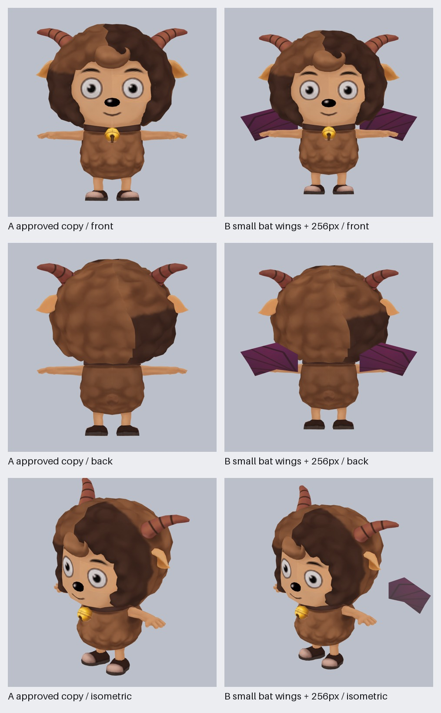

# 阿薩謝爾小型蝙蝠翼加工副本 v1

新候選 `acbc5a0cd8880ef835cfc0bb59011f59fbca3c053f7e0902c5d7df5cae5e166a` 為 **5,691 面／2 draw／最大 256px／單段最多 42 通道**；Khronos 0 error / 0 warning。

翅膀為 10 面的小型深紅／紫色雙面 primitive，全部頂點以 100% 權重綁定 `Bip01 Spine1`。來源身體 primitive、骨架、節點和五段借用動作保留；已核准的咖啡色／深咖啡色 atlas 只做 512→256 Lanczos 縮圖。原候選仍留在原路徑。

新 source model 已透過 `ModelVersions` 註冊為 `version.body.2c8f3fd1ec55b7d216e6668ee399c345c7bfe0da7891f439`；原有 5 個選項全數保留，目前共 6 個。新版 `automaticEligible=true`，英雄保持 automatic 模式並預選新版。ModelVersions 與內容模型窄測試共 23 項通過，11 組加工副本稽核 11/11 通過。目前是**已轉換、政策/Khronos/靜態三視圖通過、已註冊可切換且自動預選、正式站未部署**。
