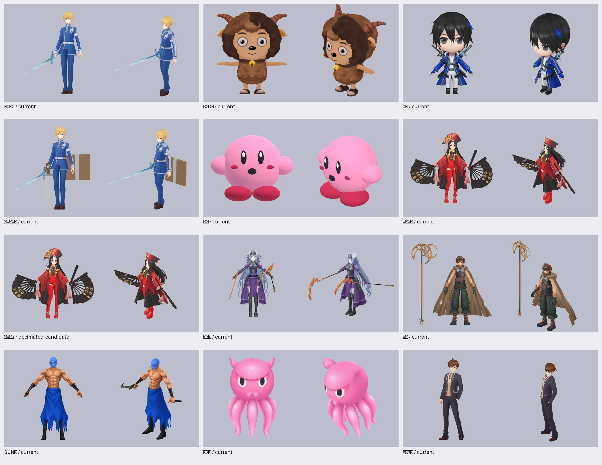
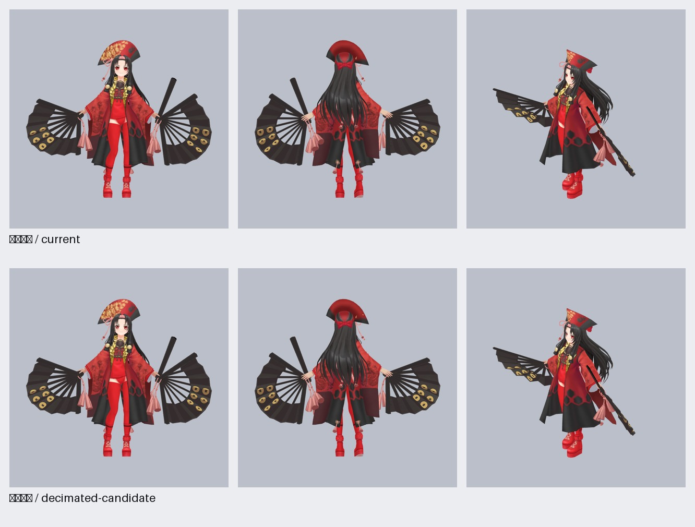

# 使用者核准 11 組加工副本稽核

11/11 獨立完整 GLB、11/11 `model@1`、11/11 現行 hard policy 通過、11/11 已註冊可切換；正式站部署未驗證。

| 角色 | GLB SHA-256 | 面／draw／貼圖 | 動作來源 | 預設關係 |
| --- | --- | --- | --- | --- |
| 不知火舞 | `227cd7fadd66fa7c622f897b13ac6b93471347796034c9af7377f6803e6928e4` | 7,994／4／256px | 來源模型原生；對目標角色屬借用 | 現行副本；非預設副本 2 |
| 卡比 | `e99ca23f4890c44abb8dca39fbe988355c52e1070492b55e8858681461ede4d5` | 2,920／1／16px | 卡比程序化替身動作 | 現行副本；非預設副本 1 |
| SUN樂 | `f5ee6f2f81183ff9c2c4448b9fbbce4aee7748da53bceccfdc888ea3abeb86ed` | 4,686／3／256px | 來源模型原生；對目標角色屬借用 | 現行副本；非預設副本 1 |
| 阿薩謝爾 | `acbc5a0cd8880ef835cfc0bb59011f59fbca3c053f7e0902c5d7df5cae5e166a` | 5,691／2／256px | 來源模型原生；對目標角色屬借用 | 現行副本；非預設副本 2 |
| 何布 | `7e08dcd47c6ea86f052d0a492ab86f9a8f24d5be2b735d5c2445de3a160ce44e` | 5,500／1／256px | 來源模型原生；對目標角色屬借用 | 副本保留為非預設；非預設副本 2 |
| 阿爾巴斯 | `fd74d7db8cdf6c740d6622b3ad49699eec93ba513e1a98e276d7f4fbd6161a93` | 8,455／4／256px | 來源模型原生；對目標角色屬借用 | 現行副本；非預設副本 1 |
| 哥布林殺手 | `8302dd8e3ffd61904e5f346337235b232bb9a57a757ebb7dc064310bc0926de7` | 8,515／3／256px | 來源模型原生；對目標角色屬借用 | 現行副本；非預設副本 1 |
| 高遠夜霧 | `fcc0b83b634ec8afc497fa58991c7321472df6aacfce6a93e7d538915d5cc689` | 4,900／1／256px | 來源模型原生；對目標角色屬借用 | 現行副本；非預設副本 1 |
| 章魚嗶 | `bdce60d0ca8b9de84ca8eb19db53308556ac11e90bcf11a439286a87bf06a717` | 1,192／1／256px | 來源模型原生；對目標角色屬借用 | 現行副本；非預設副本 1 |
| 米瑟利 | `97d4dc973e3518acb77b623f46ef241409c2506263feaf37e817605601b963c1` | 8,602／4／256px | 來源模型原生；對目標角色屬借用 | 現行副本；非預設副本 1 |
| 波吉 | `745fe9a31c9ed44098f7d92984de88e81f5ddf6605c7327f327ddcd82ee96581` | 7,165／2／256px | 來源模型原生；對目標角色屬借用 | 副本保留為非預設；非預設副本 2 |

數據來源為 `audit.json`、`current-policy.json`、`visual-receipt.json` 與 `mai-decimation-acceptance.json`。六態綁定可重複使用同一片段；本報告沒有把 4～6 個不同片段寫成目標角色原生六動作。
