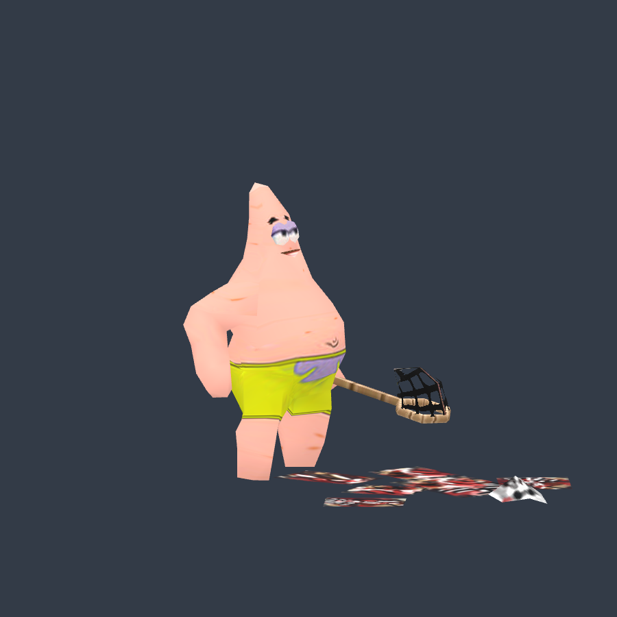
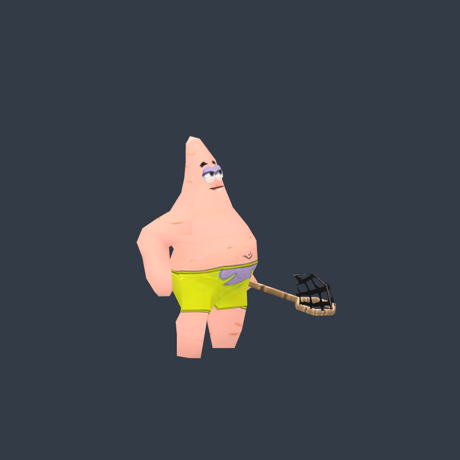
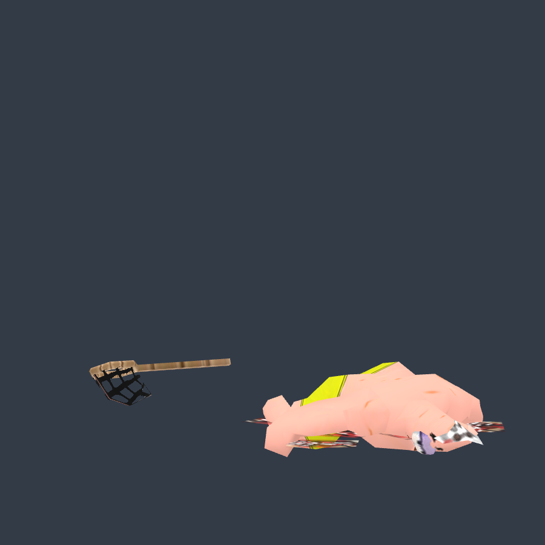

# 羽賀既有相似模型：原生顯隱修復

修復版 `ou99.495015-native-visibility-v1` 已登記為羽賀的獨立可選版本，自動順位沿用原已核准相似來源。原始、舊標準化版與凍結版本完整保留；此模型仍是海星動畫人相似模型，不重新認定本尊。

原 MDX 的 geoset 2 只受無子骨骼、無動作通道的 `gutz00` 控制，其餘身體完全不使用該骨骼。依已驗證的二值 KGAO，加入 STEP scale 顯隱：一般六態隱藏；Decay Flesh 在 3.767 秒開始顯示；Decay Bone 顯示。沒有刪除網格、貼圖或原始動作通道，13 段原生動畫全部保留。

- 原生來源與 SHA：[native-geoset-proof.json](native-geoset-proof.json)
- 精確新增通道：[conversion.json](conversion.json)
- 實際後台 prepare 與原版本保存：[backend-prepare-receipt.json](backend-prepare-receipt.json)
- Khronos：0 errors／0 warnings／0 infos，未截斷。
- Babylon 82 個取樣涵蓋 13 段動畫及顯隱切換前後；其他身體頂點最大差異 0，應顯示部件最大差異 0，應隱藏部件三角形面積 0：[render-proof.json](render-proof.json)
- 原固定 catalog 137 → 138，原項目未刪改：[admission.json](admission.json)

驗證是直接播放取樣；跨動畫混合可能暫時縮放該部件，尚未驗收整場遊戲。全庫幾何普查仍會掃描保留的原件與靜態幾何，未放寬其規則或宣稱全庫发布通過。正式站尚未部署。

