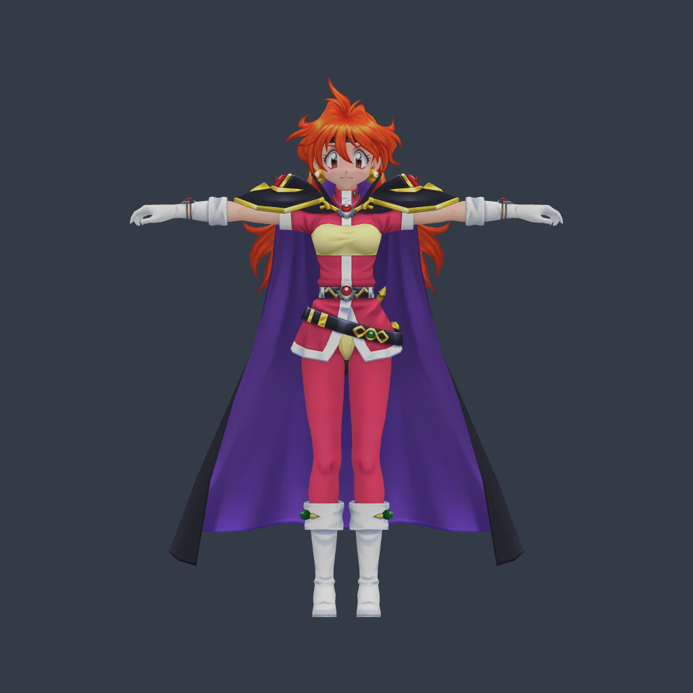
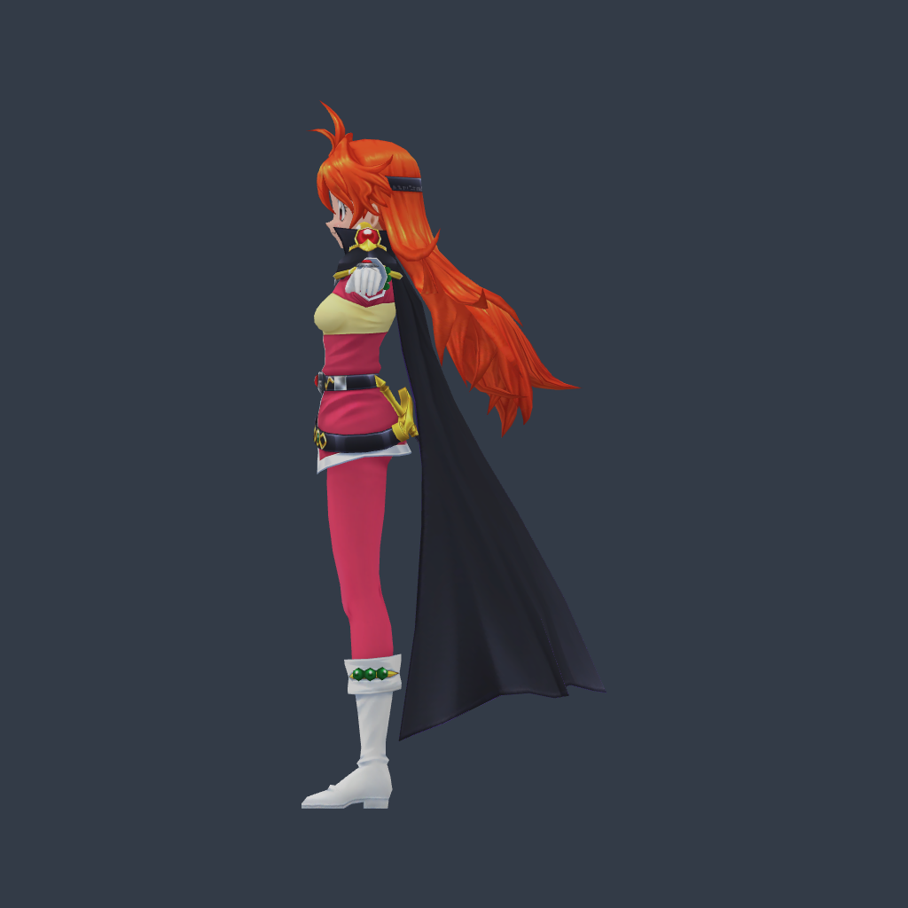
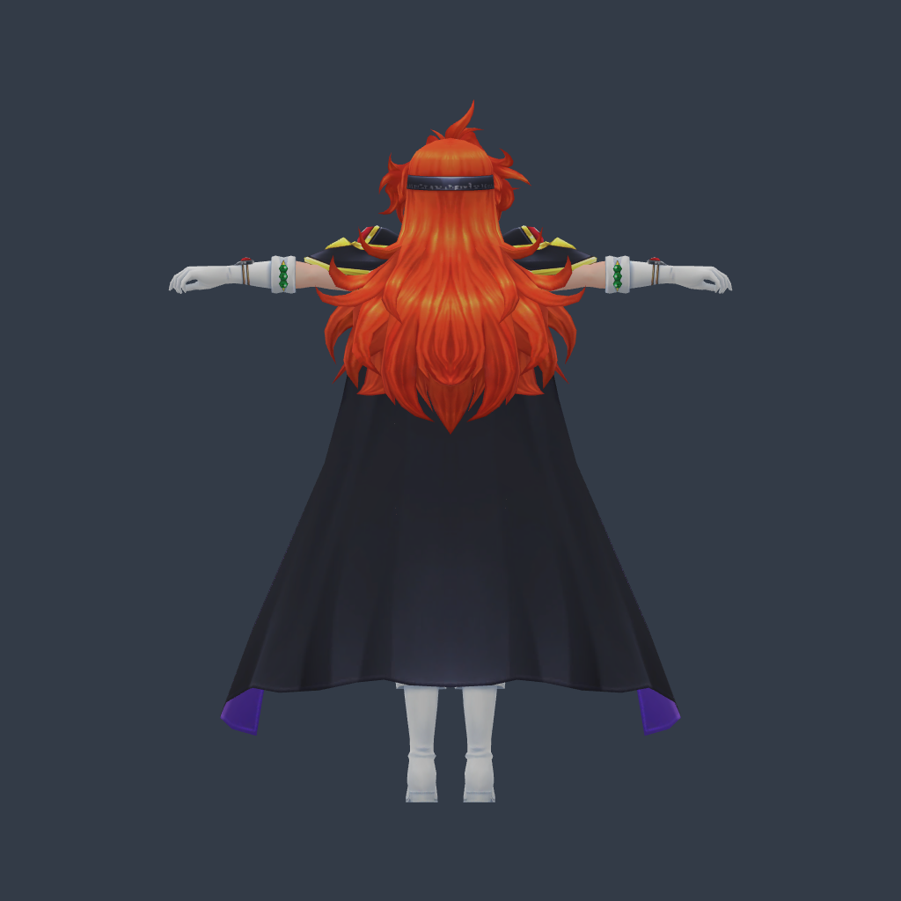
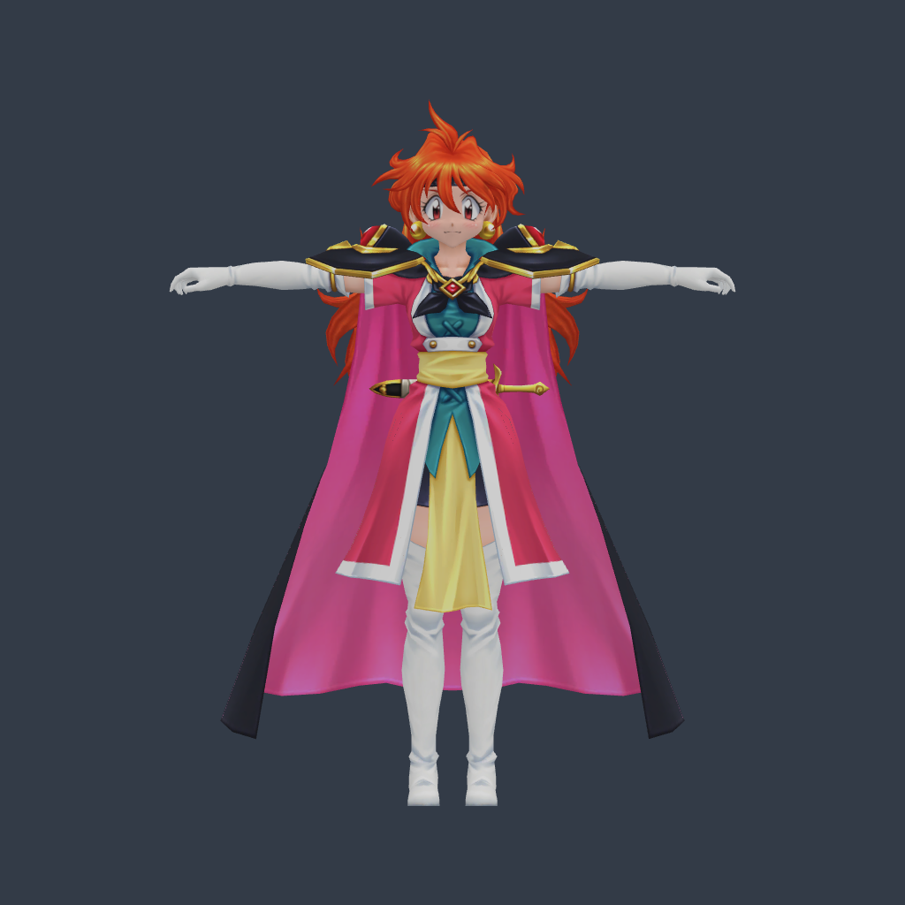
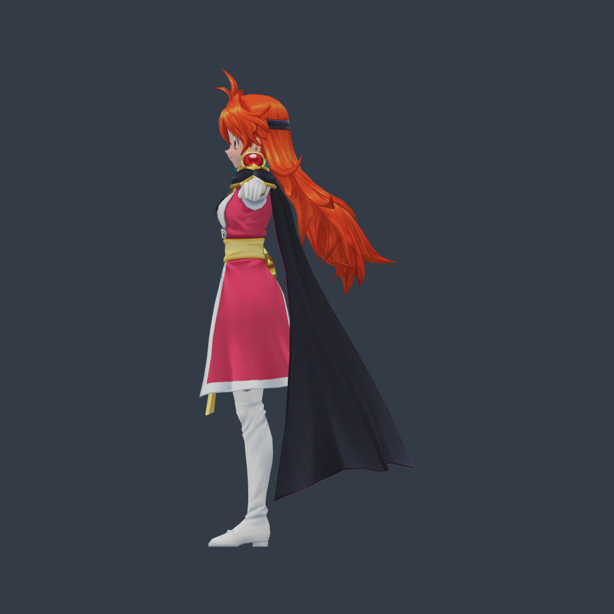
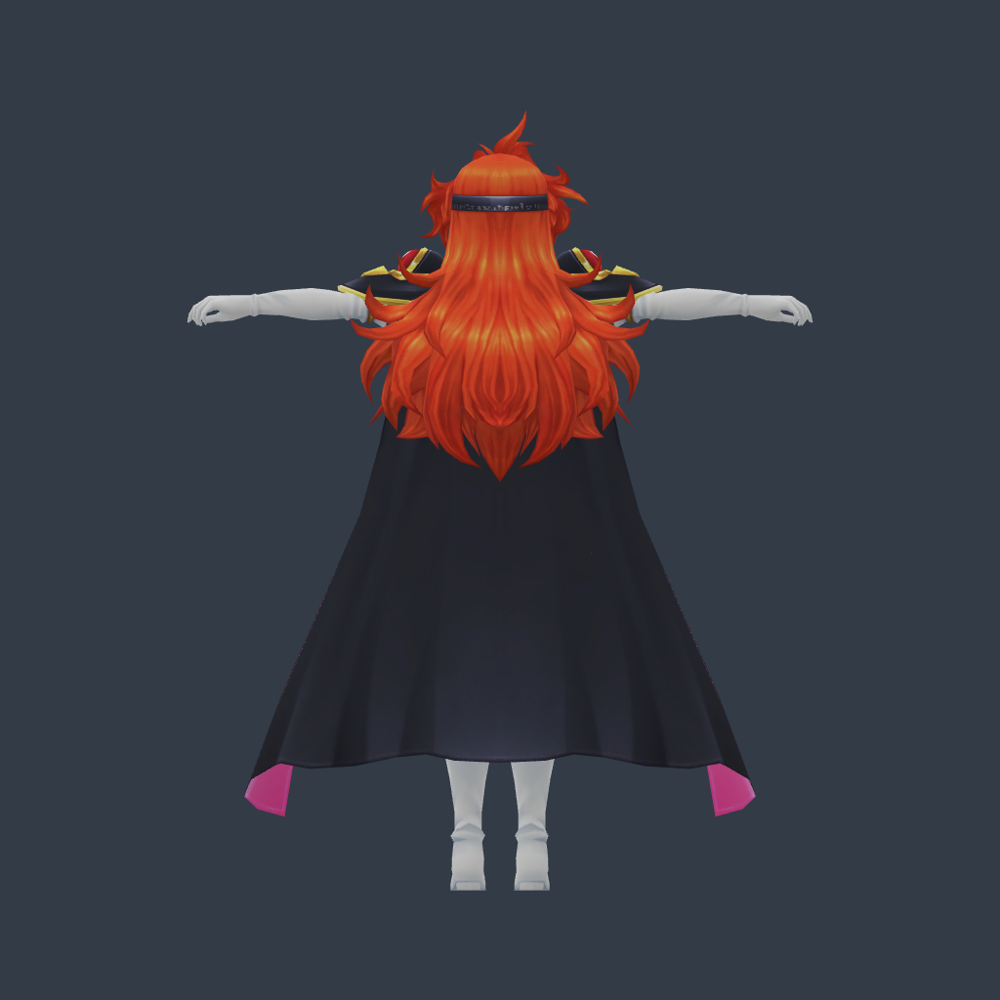

# 莉娜靜態候選實際畫面

這是 Babylon 載入實際 GLB 的驗證圖。兩套服裝各保留四種手型，下圖為放鬆彎指版本，各只顯示一隻左手與一隻右手。模型、貼圖、皮膚權重與原來源均保留；原生動作 0，仍待 GGD 尺度、落地與移動／技能動作驗收。

| 服裝 | 正面 | 側面 | 背面 |
|---|---|---|---|
| lina00 |  |  |  |
| lina01 |  |  |  |

來源：Ceruleancast / Meowth for Smash 的 Tales of the Rays Slayers 包；既有原始候選未改。候選與完整來源收據見全角色模型盤點和 download-sources.json。這些靜態圖不代表 GGD 下拉切換或原作動作已验收。圖像與原路徑 SHA 見 evidence.json。
