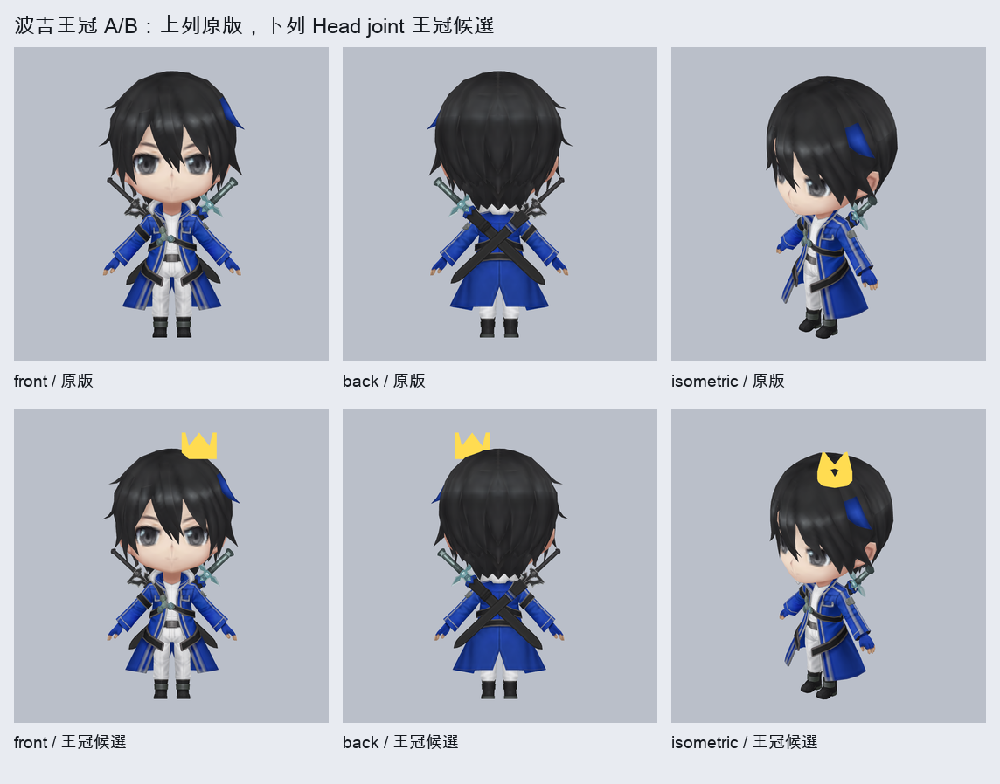

# 波吉王冠候選 v1

以現有 `derivative:bojji` 獨立 GLB 為輸入，新增 64 面、單一 draw 的小型金黃色王冠。王冠 32 個頂點全數以 1.0 權重綁到 `Bip001 Head`；來源兩個 skinned primitive、兩張內嵌 256px 貼圖、54 joints 與 5 段來源原生借用動作皆保留。



| 檢查 | 結果 |
| --- | --- |
| 面數 | 7,229（原 7,165 + 王冠 64），符合使用者 `<= 8,000` |
| draw primitives | 3／上限 6 |
| 貼圖 | 原兩張內嵌貼圖原封不動，最大 256px；王冠用純色材質，不增貼圖 |
| 動作通道 | 5 clips、每段 66 channels；王冠由 Head joint 跟隨 |
| Khronos | 0 error／0 warning |
| GGD budget | `errors=[]` |
| 註冊 | `community.body.46cab3416f3f164ca9fa27dbb1ad88e9f2c1b2ce5163e23c` → `version.body.b73694be2665676dbdc4b6a6f44e374fce4cb0e08b74a673` |
| 狀態 | 已轉換、已驗證、已進 Git、已註冊可切換，並成為 automatic 目前預選；待使用者 A/B 最終視覺核准與正式站部署驗證 |

重建與驗證：

```sh
python3 tools/hero-model-library/source-workflows/bojji-crown-v1/build_candidate.py
node --import tsx tools/hero-model-library/source-workflows/bojji-crown-v1/validate_candidate.mts . content/assets/models/community/versions/745fe9a31c9ed44098f7d92984de88e81f5ddf6605c7327f327ddcd82ee96581.glb ../GGD-Asset-Library/conversions/bojji-crown-v1/candidate.glb ../GGD-Asset-Library/conversions/bojji-crown-v1/validation.json
python3 tools/hero-model-library/source-workflows/approved-derivatives-v1/render_static_glb.py ../GGD-Asset-Library/conversions/bojji-crown-v1/candidate.glb ../GGD-Asset-Library/conversions/bojji-crown-v1/webgl-review-v1 --repo .
python3 tools/hero-model-library/source-workflows/bojji-crown-v1/build_visual_evidence.py
node --import tsx tools/hero-model-library/source-workflows/bojji-crown-v1/promote_register.mts . ../GGD-Asset-Library/conversions/bojji-crown-v1/candidate.glb --check
python3 tools/hero-model-library/source-workflows/bojji-crown-v1/build_inventory.py
```

本批保留原有 5 個模型選項，新增一個獨立完整王冠候選並設為 automatic 目前預選。未改中央索引，也沒有宣稱正式站已部署。
